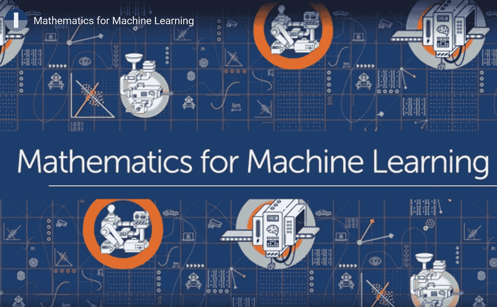
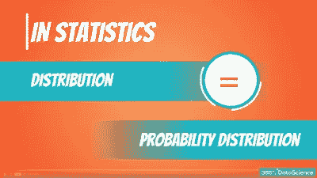
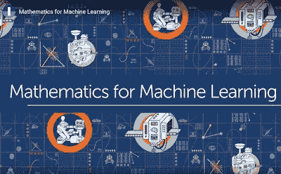
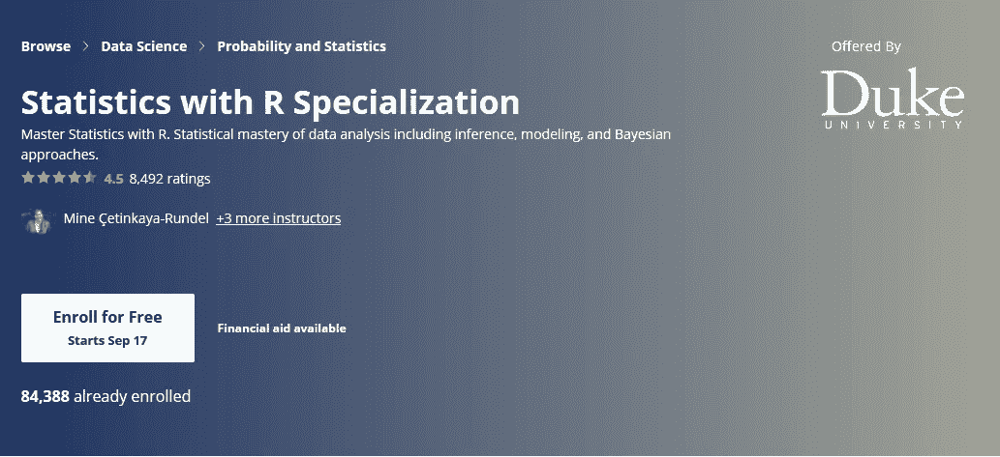
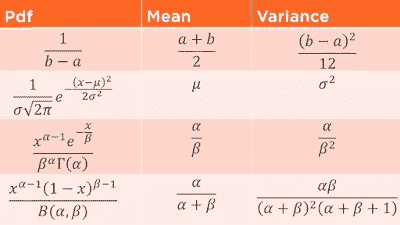

# 2023 年数据科学和机器学习程序员的 5 门最佳数学和统计学课程

> 原文：<https://medium.com/javarevisited/5-best-mathematics-and-statistics-courses-for-data-science-and-machine-learning-programmers-bf4c4f34e288?source=collection_archive---------0----------------------->

## 这些是从 Udemy、Coursera 和 Pluralsight 学习数学和统计技能并在 2023 年成为更好的数据科学家的最佳在线课程

image_credit — Coursera 机器学习数学

大家好，如果你正在学习数据科学和机器学习，并寻找一些复习课程来提高你的数学和统计技能，那么你来对地方了。

以前我要分享的是 [**最好的数据科学和机器学习课程**](/javarevisited/my-favorite-data-science-and-machine-learning-courses-from-coursera-udemy-and-pluralsight-eafc73acc73f) ，今天我要分享的是数据科学学习数学和统计学的最好课程。这些课程是由专家创造的，是顶尖大学想出来的。你可以加入他们来提高你的数学技能，成为一名更好的数据科学家。

学习数据科学和机器学习的程序员面临的一个主要挑战是其中涉及的数学量，特别是在[深度学习](https://becominghuman.ai/9-data-science-and-machine-learning-courses-by-harvard-ibm-udemy-and-others-12a0c7c23ec1)和[神经网络](https://javarevisited.blogspot.com/2019/08/top-5-courses-to-learn-deep-learning.html)训练中。

当我第一次开始探索深度学习时，数学是一个障碍。尽管我在大学时是一名优秀的数学学生，但在[学习数据科学](/javarevisited/6-best-websites-to-learn-data-science-and-machine-learning-36f014af63fb)时，我仍然落后于统计、概率和微积分，这就是为什么我决定更新知识，重新学习数据科学的统计和数学。

我们还生活在一个[大数据](https://javarevisited.blogspot.com/2017/12/top-5-courses-to-learn-big-data-and.html#axzz5bKDxWpoU)的世界，需要有人来理解所有这些数据，这就需要数据科学家不断增长，但这不是一个自然的领域。我见过的大多数数据科学家都拥有博士学位，并且非常擅长数学和统计技能。

即使你可以通过像吴恩达 的 [**机器学习这样的在线课程学习到大部分数据科学和机器学习的概念，为你解决了数学题；并且，让你完全专注于深度学习理论；你仍然需要更新你以前在学校或大学学过的数学和统计学概念。

当你进入解决实际问题的实际工作时，不知道**](https://coursera.pxf.io/c/3294490/1164545/14726?u=https%3A%2F%2Fwww.coursera.org%2Flearn%2Fmachine-learning)**[统计、数学](https://javarevisited.blogspot.com/2019/09/top-5-statistics-and-mathematics-course-for-data-science.html)和概率在实际工作中不会成为借口，在实际工作中，你需要拿出自己的适应能力来解决你手中的独特问题，这就是为什么我建议你一旦掌握了[机器学习基础](https://dev.to/javinpaul/10-data-science-and-machine-learning-courses-for-programmers-looking-to-switch-career-57kd)就复习你的统计和数学技能。我已经推迟学习数学和统计学很长时间了，但上周末我想让我们开始，看看进展如何。我已经有几门课程是由一些知识渊博的家伙推荐给我的，我也有自己的入围课程，今天我将与你们分享。

我仍在学习，但根据推荐和评论，这些是学习数据科学统计和数学的最佳在线课程，如果您需要复习数学、概率或统计技能，您一定要查看它们。这也有助于[数据科学面试](https://javarevisited.blogspot.com/2018/03/top-5-data-science-and-machine-learning-online-courses-to-learn-online.html)；在这里，许多面试官会检查你对这些话题的掌握程度。**

顺便说一句，如果你刚刚开始学习数据科学，那么我建议你参加一个更一般但更全面的课程，如 Udemy 网站上由基里尔·叶列缅科教授的 [**数据科学 A-Z:现实生活中的数据科学**](https://click.linksynergy.com/deeplink?id=JVFxdTr9V80&mid=39197&murl=https%3A%2F%2Fwww.udemy.com%2Fdatascience%2F) 课程。这是开始数据科学之旅的最佳方式。

<https://click.linksynergy.com/deeplink?id=JVFxdTr9V80&mid=39197&murl=https%3A%2F%2Fwww.udemy.com%2Fdatascience%2F>  

# 2023 年学习数据科学统计和数学的前五门课程

在不浪费你更多时间的情况下，这里是我为数据科学和机器学习列出的一些学习统计和数学的最佳课程。

# 1.[数据科学与商业分析统计](https://click.linksynergy.com/deeplink?id=JVFxdTr9V80&mid=39197&murl=https%3A%2F%2Fwww.udemy.com%2Fcourse%2Fstatistics-for-data-science-and-business-analysis%2F)

这是学习统计学基础知识的最佳课程之一，不仅对数据科学家来说如此，对任何需要使用统计学进行数据分析的人来说也是如此。在本课程中，你将学会有效地分析数据，制定假设，并对大量数据告诉你的事情进行推理。本课程还将教你如何绘制不同类型的数据和基本原理，如计算相关性和协方差，计算集中趋势、不对称性和可变性等。

你还将学习如何处理不同类型的数据和分布，理解回归分析的机制，学习数据科学所需的概念，甚至使用 [Python](https://javarevisited.blogspot.com/2019/07/top-5-books-to-learn-python-in-2019.html) 和 [R](https://hackernoon.com/5-free-r-programming-courses-for-data-scientists-and-ml-programmers-5732cb9e10) 。

课程中使用的动画真的很容易理解复杂的统计和数学概念，如概率。

**以下是加入本课程** — [数据科学与商业分析统计](https://click.linksynergy.com/deeplink?id=JVFxdTr9V80&mid=39197&murl=https%3A%2F%2Fwww.udemy.com%2Fcourse%2Fstatistics-for-data-science-and-business-analysis%2F)的链接

## 2.[机器学习专用数学](https://coursera.pxf.io/c/3294490/1164545/14726?u=https%3A%2F%2Fwww.coursera.org%2Fspecializations%2Fmathematics-machine-learning)

对于机器学习和深度学习的大量更高水平的课程，你会发现需要像概率一样刷新数学和统计的基础知识。这些概念你可能以前在学校或大学里学过，但它们是在另一种背景下教授的，或者不是很直观，所以你很难把它与它在计算机科学中的应用联系起来。

这一专业化旨在弥合这一差距，让你快速掌握基础数学，建立直觉理解，并将其与[机器学习](/javarevisited/top-10-resources-to-learn-data-science-and-machine-learning-best-of-lot-f153e1f44e89)和[数据科学](https://dev.to/javinpaul/11-best-resources-to-learn-data-science-and-machine-learning-in-2020-2od)联系起来。专业化是 3 门课程的集合，将从机器学习的角度教你数学。您将更新您的线性代数和微积分知识，同时学习其他在机器学习中很重要的数学概念。

**这里是加入本课程** — [机器学习专业化的数学](https://coursera.pxf.io/c/3294490/1164545/14726?u=https%3A%2F%2Fwww.coursera.org%2Fspecializations%2Fmathematics-machine-learning)的链接

在本专业结束时，您将获得继续您的旅程和学习机器学习和数据科学方面更高级课程的必备数学知识。

与其他 [Coursera 专业](https://dev.to/javinpaul/top-5-coursera-professional-certificates-to-start-advance-your-career-in-technology-185p)、*一样，如果你只是想学习，这些课程是免费的，*但如果你需要认证或希望做测验、作业和评估，你需要支付订阅费。

这些顶级的数据科学课程都包含在**[**Coursera Plus**](https://coursera.pxf.io/c/3294490/1164545/14726?u=https%3A%2F%2Fwww.coursera.org%2Fcourseraplus)中，这是一个年度订阅，提供超过 3000 门课程、专业、专业证书和指导项目的访问权限。如果你计划参加多个 Coursera 课程，那么我强烈建议你加入 Coursera Plus。更多细节可以看[这里](https://coursera.pxf.io/c/3294490/1164545/14726?u=https%3A%2F%2Fwww.coursera.org%2Fcourseraplus)。**

**<https://coursera.pxf.io/c/3294490/1164545/14726?u=https%3A%2F%2Fwww.coursera.org%2Fcourseraplus> ** 

# **3.[成为概率统计大师](https://click.linksynergy.com/deeplink?id=JVFxdTr9V80&mid=39197&murl=https%3A%2F%2Fwww.udemy.com%2Fstatistics-probability%2F)**

**这是概率和统计最集中的课程之一。您将从概率和统计学中学习一切，如均值、方差和标准差等数据分布，正态分布和 z 值，[数据可视化](https://javarevisited.blogspot.com/2019/09/top-5-courses-to-learn-d3js-best.html)，包括条形图、饼图、维恩图、直方图、点状图等。

您还将学习一些关于数据分析的知识，包括均值、中值、众数、正态、极差、IQR、盒须图和假设检验，如推断统计、显著性水平、I 类和 II 类误差、检验统计和 p 值。

总体来说，短时间内学习*概率统计*最全面的课程之一。该课程包含超过 11 个小时的观看材料，还附带 400 多个练习题来测试您的知识。**

****这里是加入本课程**——[成为概率统计大师](https://click.linksynergy.com/deeplink?id=JVFxdTr9V80&mid=39197&murl=https%3A%2F%2Fwww.udemy.com%2Fstatistics-probability%2F)的链接**

****

## **4.[R 专业化统计](https://coursera.pxf.io/c/3294490/1164545/14726?u=https%3A%2F%2Fwww.coursera.org%2Fspecializations%2Fstatistics)**

**这是 Coursera 上数据科学家的另一个极好的资源。在本专业中，您将学习如何使用 [R 编程语言](https://hackernoon.com/5-free-r-programming-courses-for-data-scientists-and-ml-programmers-5732cb9e10)分析和可视化数据，并创建可重现的数据分析报告。

您还将学习统计推断，如贝叶斯统计推断和建模，以了解自然现象，做出基于数据的决策，更重要的是，正确传达统计结果。**

**如果你喜欢 R 编程语言，并且想在数据分析方面表现出色，这门课程可以帮助你。** 

****这里是加入本课程**——[R 专业统计](https://coursera.pxf.io/c/3294490/1164545/14726?u=https%3A%2F%2Fwww.coursera.org%2Fspecializations%2Fstatistics)的链接**

****

# **5.[统计学基础:理解概率和分布](https://pluralsight.pxf.io/c/1193463/424552/7490?u=https%3A%2F%2Fwww.pluralsight.com%2Fcourses%2Fstatistics-foundations-probability-distributions)**

**这是一门非常好的在线课程，学习数据采样和探索，以及基本的概率论和贝叶斯法则。你将研究各种类型的抽样方法，并讨论这些实践如何影响推论的范围。本课程还将教你许多探索性的数据分析技术，如数字汇总统计和基本的数据可视化。

您还将学习如何安装 R 和 RStudio(免费统计软件)并在实验室练习和期末项目中使用这些工具进行[数据分析](https://javarevisited.blogspot.com/2019/10/top-5-courses-to-learn-pandas-for-data-analysis-python.html)。总的来说，这是一门学习统计和概率基础的伟大课程。**

****

**顺便说一句，你需要一个 [Pluralsight 会员](https://javarevisited.blogspot.com/2019/10/udemy-vs-pluralsight-review-which-is-better-to-learn-code.html)才能进入这个课程，费用大约是每月 29 美元或每年 299 美元(14%的折扣)。这更像是软件开发人员的网飞，因为学习是我们工作的重要组成部分，Pluralsight 会员资格是在竞争中保持领先的一个很好的方式。

他们还提供了一个<http://pluralsight.pxf.io/c/1193463/424552/7490?u=https%3A%2F%2Fwww.pluralsight.com%2Flearn>**的 10 天免费试用期，无需任何承诺，这是一个很好的方式，不仅可以免费参加这个课程，还可以在加入 Pluralsight 之前检查课程的质量。****

****<http://pluralsight.pxf.io/c/1193463/424552/7490?u=https%3A%2F%2Fwww.pluralsight.com%2Flearn>  

以上是关于数据科学和机器学习中学习统计学、数学和概率的一些**最佳在线课程。这些领域的良好知识对分析和理解[大数据](/javarevisited/top-10-courses-to-learn-big-data-and-hadoop-best-of-lot-23ef8691633f)大有帮助，这是你工作的一部分。**

建立这些基础或修改这些基础的小小努力对成为你一直想成为的成功的数据科学家或数据工程师大有帮助。
T5 其他**文章程序员和数据科学家**可能喜欢

*   [初学者学习数据科学的 10 门课程](https://hackernoon.com/10-machine-learning-data-science-and-deep-learning-courses-for-programmers-7edc56078cde)
*   [面向数据科学和机器学习的 8 大 Python 库](https://javarevisited.blogspot.com/2018/10/top-8-python-libraries-for-data-science-machine-learning.html)
*   [2023 年学习 Python 的 5 大课程](https://hackernoon.com/top-5-courses-to-learn-python-in-2018-best-of-lot-26644a99e7ec)
*   [面向数据科学家的 10 大 TensorFlow 课程](https://dev.to/javinpaul/10-of-the-best-tensorflow-courses-to-learn-machine-learning-from-coursera-and-udemy-37bf)
*   [面向程序员的 10 门机器学习和深度学习课程](https://hackernoon.com/10-machine-learning-data-science-and-deep-learning-courses-for-programmers-7edc56078cde)
*   [2023 年学习 Python 的 10 个理由](https://hackernoon.com/10-reasons-to-learn-python-in-2018-f473dc35e2ee)
*   [学习数据科学 R 编程的 5 门免费课程](https://www.java67.com/2018/09/top-5-free-R-programming-courses-for-Data-Science-Machine-Learning-Programmers.html)
*   [学习数据科学 Tableau 的前 5 门课程](https://javarevisited.blogspot.com/2019/07/top-5-tableau-online-courses-and-certifications-for-data-science-engineers.html)
*   [学习高级数据科学的前 5 门课程](https://hackernoon.com/top-5-data-science-and-machine-learning-course-for-programmers-e724cfb9940a)
*   [初学者学习 Python 的 10 门免费课程](https://hackernoon.com/10-free-python-programming-courses-for-beginners-to-learn-online-38312f3b9912)
*   [学习数据科学 Python 的 5 本书](https://javarevisited.blogspot.com/2019/08/top-5-python-books-for-data-science-and-machine-learning.html)
*   [学习机器学习的 5 大免费课程](https://www.java67.com/2019/01/5-free-courses-to-learn-machine-and-deep-learning-in-2019.html)
*   [初学者学习 TensorFlow 的 5 大课程](https://hackernoon.com/top-5-tensorflow-and-ml-courses-for-programmers-8b30111cad2c)

感谢您阅读本文。如果你喜欢这些最好的数学和统计课程，那么请分享给你的朋友和同事。如果您有任何问题或反馈，请留言。

**P.S. —** 如果你渴望了解更多关于数据科学和机器学习的知识，并且此时此刻只想做一件事，那就去参加 Udemy 网站上由基里尔·叶列缅科教授的 [**数据科学 A-Z:现实生活中的数据科学**](https://click.linksynergy.com/deeplink?id=JVFxdTr9V80&mid=39197&murl=https%3A%2F%2Fwww.udemy.com%2Fdatascience%2F) 课程吧。你不会后悔你的决定。

<https://click.linksynergy.com/deeplink?id=JVFxdTr9V80&mid=39197&murl=https%3A%2F%2Fwww.udemy.com%2Fdatascience%2F> ****