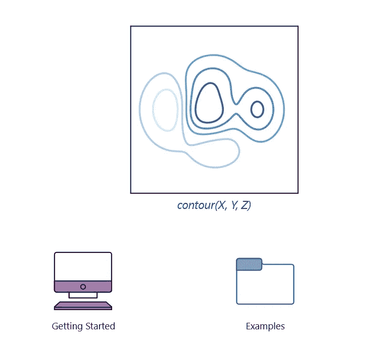
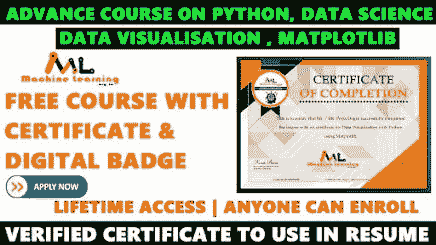
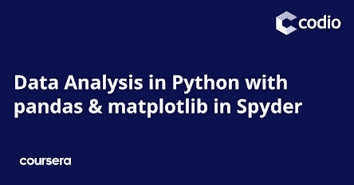
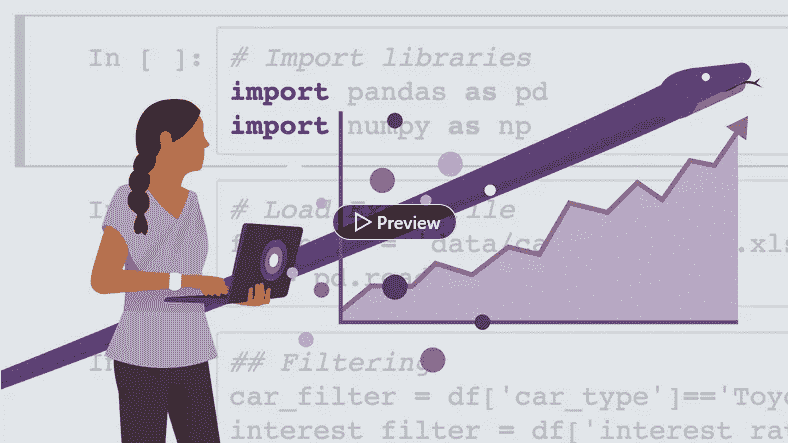
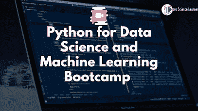

# Python 开发人员和数据科学家的 5 门最佳 Matplotlib 在线课程

> 原文：<https://medium.com/javarevisited/5-best-matplotlib-online-courses-for-python-developer-and-data-scientist-9f3bf4359b86?source=collection_archive---------2----------------------->

## 2023 年想学 Matplotlib？以下是 2023 年学习 Matplotlib 并在 2023 年增强数据可视化技能的最佳在线课程

大家好，如果你想在 2023 年学习 Matplotlib，这是一个流行的用于数据可视化的 Python 库，那么你来对地方了。早些时候，我已经分享了学习 [Pandas](/javarevisited/5-best-free-pandas-courses-for-beginners-in-2022-d7dbe017b90c) 、 [Scikit-learn](/javarevisited/5-best-scikit-learn-online-courses-for-machine-learning-and-data-science-6beb02e9cca0) 和 [NumPy](/javarevisited/6-best-online-courses-to-learn-numpy-for-beginners-60120f611e06) 的最佳免费课程，在这篇文章中，我将分享学习 Matplotlib 的最佳在线课程。

但是，在我告诉你可以用来学习更多关于 Matplotlib 的精彩课程之前，让我告诉你什么是 Matplotlib。Matplotlib 是一个构建在 [NumPy](https://javarevisited.blogspot.com/2021/10/top-5-courses-to-learn-numpy-for-python.html) 2D 阵列上的数据可视化库，旨在与更大更广的 SciPy 堆栈一起工作。

Matplotlib 是一个用 Python 编写的惊人的[数据可视化库，用于最基本的数组 2D 绘图。它是由约翰·亨特于 2002 年发明的。](/javarevisited/8-best-data-visualization-tools-and-libraries-data-analysts-and-scientists-can-learn-d2734371df16)

关于可视化，你需要理解的第一件事是，它允许用户可视化地访问大量易于理解的数据。Matplotlib 由几个图组成，如折线图、条形图、散点图和直方图。

你可以在 Windows、 [Linux](https://javarevisited.blogspot.com/2021/06/5-websites-to-learn-linux-command-line.html) 或 [macOS](https://javarevisited.blogspot.com/2022/02/top-5-macos-courses-for-beginners-in.html) 上安装 Matplotlib，因为它的大部分依赖项都可以作为 wheel 包获得。大多数时候，您可以运行简单的一行命令来安装 matplotlib。

Matplotlib 有许多特性，并带有各种各样的情节。图可以用来理解趋势和模式，并进行关联。它们通常用于定量信息的推理。

# 2023 年初学者和有经验者的 5 个最佳 Matplotlib 课程

在这里，我们整理了学习 Matplotlib 的 5 个最佳课程列表。请继续阅读，了解更多信息。

## 1.[完成关于数据可视化、Matplotlib 和 Python 的课程](https://click.linksynergy.com/deeplink?id=JVFxdTr9V80&mid=39197&murl=https%3A%2F%2Fwww.udemy.com%2Fcourse%2Fcomplete-course-on-data-visualization-matplotlib-and-python%2F)

这是一门非常棒的课程，将帮助您掌握 Matplotlib，并学习 Seaborn 使用定制的、适合各种用途的漂亮图表来可视化数据。

购买本课程后，您将终身获得超过 3 小时的点播视频讲座、1 篇文章和 64 种可下载的教育资源。

在本课程中，您将学习如何创建各种图表，如条形图、折线图、堆积图、圆环图和饼图、直方图、KDE 图、小提琴图、箱线图和散点图。

**课程时长:4 小时**

**球场评分:4.3 星(满分 5 分)**

**课程讲师:Bekzod Ruzmetov**

**课程价格:56 美元**

**以下是加入本课程的链接** — [关于数据可视化、Matplotlib 和 Python 的完整课程](https://click.linksynergy.com/deeplink?id=JVFxdTr9V80&mid=39197&murl=https%3A%2F%2Fwww.udemy.com%2Fcourse%2Fcomplete-course-on-data-visualization-matplotlib-and-python%2F)

## 2.[Python 中的数据分析与 pandas 和 Spyder 中的 matplotlib](https://coursera.pxf.io/c/3294490/1164545/14726?u=https%3A%2F%2Fwww.coursera.org%2Flearn%2Fcodio-data-analysis-in-python-with-pandas-and-matplotlib-in-spyder)

这个 Coursera 在线课程将向你展示如何在不安装任何东西的情况下，在几分钟内编写和运行你的第一个 Python 脚本。这对于之前没有编码经验的人和绝对的初学者来说是完美的。

你将获得一门关于 Python 的优秀速成课程，这将使你能够深入研究可以转换成其他语言的核心数据分析主题。您还将学习如何导入和组织数据，使用函数收集描述性统计数据，以及执行统计测试。本课程结束时，你将能够用统计学描述一个数据集。

**课程时长:9 小时**

**课程评分:4.5 星(满分 5 分)**

课程导师:凯文·诺埃尔森特

课程价格:50 美元

这是参加本课程的链接。[Python 中的数据分析与 pandas 和 Spyder 中的 matplotlib](https://coursera.pxf.io/c/3294490/1164545/14726?u=https%3A%2F%2Fwww.coursera.org%2Flearn%2Fcodio-data-analysis-in-python-with-pandas-and-matplotlib-in-spyder)

顺便说一句，当谈到参加这个课程时，你有两个选择，你可以单独参加这个课程，每月花费大约 39 美元进行专业化，你也可以 [**参加 Coursera Plus**](https://coursera.pxf.io/c/3294490/1164545/14726?u=https%3A%2F%2Fwww.coursera.org%2Fcourseraplus) 每月 59 美元，这是 Coursera 的一个订阅计划，让你无限制地访问他们最受欢迎的课程、专业化、专业证书和指导项目。

 [## Coursera Plus |无限制访问 7，000 多门在线课程

### 在 Coursera 上可以无限制地访问 90%以上的课程、项目、专业和专业证书

coursera.pxf.io](https://coursera.pxf.io/c/3294490/1164545/14726?u=https%3A%2F%2Fwww.coursera.org%2Fcourseraplus) 

## 3.[使用 Matplotlib 构建数据可视化](https://pluralsight.pxf.io/c/1193463/424552/7490?u=https%3A%2F%2Fwww.pluralsight.com%2Fcourses%2Fmatplotlib-building-data-visualizations)

本课程的重点是让数据科学家或业务分析师能够访问和理解 Matplotlib。在本课程中，您将发现构成绘图的基本组件，并了解如何调整参数和属性以自定义可视化效果。

课程开始时，您将学习 Matplotlib 中可用的基本 API、它们的使用位置，以及如何自定义这些多轴绘图的显示、颜色和其他属性。

**课程时长:3 小时**

**课程评分:4.8 星(满分 5 分)**

**课程讲师:Janani Ravi**

**课程价格:高级计划每年 140 美元**

以下是加入本课程的链接— [使用 Matplotlib 构建数据可视化](https://pluralsight.pxf.io/c/1193463/424552/7490?u=https%3A%2F%2Fwww.pluralsight.com%2Fcourses%2Fmatplotlib-building-data-visualizations)

不过，你需要一个 [Pluralsight 会员](https://pluralsight.pxf.io/c/1193463/424552/7490?u=https%3A%2F%2Fwww.pluralsight.com%2Fpricing%2Fskills)才能加入这个课程，费用大约是每月 29 美元或每年 299 美元(14%的折扣)。我向所有程序员强烈推荐这个订阅，因为它提供了超过 7000 个在线课程的即时访问，以学习任何技术技能。或者，你也可以使用他们的 [**10 天免费通行证**](https://pluralsight.pxf.io/c/1193463/424552/7490?u=https%3A%2F%2Fwww.pluralsight.com%2Fpricing%2Ffree-trial) 来免费观看这个课程。

 [## Pluralsight |个人免费试用

### 立即开始免费试用 Pluralsight！查看我们为个人和团队提供的服务，如果您不确定…

pluralsight.pxf.io](https://pluralsight.pxf.io/c/1193463/424552/7490?u=https%3A%2F%2Fwww.pluralsight.com%2Fpricing%2Ffree-trial) 

## 4.[用于数据可视化的 Python](http://linkedin-learning.pxf.io/c/1193463/449670/8005?u=https%3A%2F%2Fwww.linkedin.com%2Flearning%2Fpython-for-data-visualization)【LinkedIn 学习】

这门课的指导老师是 Michael Galarnyk，他是 cnvrg.io 的一名 ML 和 AI 传道者。

本课程将教您如何使用 Python 创建准确、有趣且易于理解的图表和图形。您将有能力探索 pandas 和 matplotlib 库，并学习如何加载和清理数据集，以及创建简单和高级的图，如直方图和支线图。

**课程时长:4 小时**

**课程评分:4.5 星(满分 5 分)**

**课程讲师:迈克尔·加拉尼克**

**课程价格；年费每月 12 美元**

以下是加入本课程的链接— [Python 用于数据可视化](http://linkedin-learning.pxf.io/c/1193463/449670/8005?u=https%3A%2F%2Fwww.linkedin.com%2Flearning%2Fpython-for-data-visualization)

顺便说一下，你需要一个 LinkedIn Learning 会员才能观看这个课程，费用大约为每月*29.99 美元*，但你也可以通过参加他们的 [**1 个月免费试用**](http://linkedin-learning.pxf.io/c/1193463/449670/8005?u=https%3A%2F%2Fwww.linkedin.com%2Flearning%2Fsubscription%2Fproducts) 来免费观看这个课程，这是一个探索他们 17000 多门最新技术在线课程的好方法。

 [## LinkedIn Learning 免费试用和订阅价格

### 从初级到高级的 20，000 多门由专家指导的个性化优质内容课程。基于社区的…

linkedin-learning.pxf.io](http://linkedin-learning.pxf.io/c/1193463/449670/8005?u=https%3A%2F%2Fwww.linkedin.com%2Flearning%2Fsubscription%2Fproducts) 

## 5.[用于数据科学和机器学习的 Python 训练营](https://click.linksynergy.com/deeplink?id=JVFxdTr9V80&mid=39197&murl=https%3A%2F%2Fwww.udemy.com%2Fcourse%2Fpython-for-data-science-and-machine-learning-bootcamp%2F)

这是列表中最全面和详尽的课程之一。您将了解到关于 Numpy、Pandas、Seaborn、Matplotlib、Plotly、Scikit Learn、Machine Learning 和 Tensorflow 的所有信息。

购买本课程后，您将终身获得超过 25 小时的点播视频讲座、13 篇文章和 5 种可下载的教育资源。

您将学习如何实现机器学习算法，并使用 pandas 进行数据分析。您还将能够使用 Seaborn 进行统计绘图，使用 Scikit-Learn 进行机器学习任务。

**课程持续时间；25 小时**

**课程评分:4.6 星(满分 5 分)**

课程讲师:何塞·波尔蒂利亚

课程价格:56 美元

以下是加入本课程的链接— [Python 数据科学和机器学习训练营](https://click.linksynergy.com/deeplink?id=JVFxdTr9V80&mid=39197&murl=https%3A%2F%2Fwww.udemy.com%2Fcourse%2Fpython-for-data-science-and-machine-learning-bootcamp%2F)

# MatPlotlib 常见问题

以下是人们在线学习 Matplotlib 时会问的一些常见问题:

**1。Matplotlib 到底是什么？**

Matplotlib 是一个建立在 NumPy 2D 阵列上的数据可视化库，旨在与更大更广的 SciPy 堆栈一起工作。Matplotlib 是一个非常棒的 Python 可视化库，用于最基本的数组 2D 绘图。它由约翰·亨特创建，于 2002 年推出。

**2。Matplotlib 有什么特点？**

Matplotlib 有许多特性，并带有各种各样的情节。图可以用来理解趋势和模式，并进行关联。它们通常用于定量信息的推理。

**3。如何安装 Matplotlib？**

您可以在 Windows、Linux 或 macOS 上安装 Matplotlib，因为它的大多数依赖项都以 wheel 包的形式提供。大多数时候，您可以运行简单的一行命令来安装 matplotlib。

以上就是 2023 年从零开始学习 Matplotlib 的**最佳在线课程。现在轮到你了。你可以参加一个或几个最好的 MatplotLib 课程来学习数据可视化，这是数据工程师、数据科学家和机器学习程序员的重要技能之一。**

当我学习 Matplotlib 时，我使用了各种资源，如博客和教程，甚至参加了多门课程，因为如果同一概念由多名教师讲解，我会学得更好。

有时它会连接，有时不会，所以尝试几个肯定是学习复杂主题的更好方法，如 2023 年的数据可视化和 Matplotlib。

你可能喜欢的其他**数据科学和机器学习**文章

*   [十大 Coursera 数据科学课程和认证](https://javarevisited.blogspot.com/2020/08/top-10-coursera-certifications-to-learn-Data-Science-Visualization-and-Data-Analysis.html)
*   [你可以在线获得 5 个数据科学学位](https://www.java67.com/2020/06/top-5-data-science-degree-you-can-earn-online-coursera-edx.html)
*   [面向数据科学家的 10 大 TensorFlow 课程](https://dev.to/javinpaul/10-of-the-best-tensorflow-courses-to-learn-machine-learning-from-coursera-and-udemy-37bf)
*   [2022 年学习 Power BI 的 5 大课程](https://www.java67.com/2020/06/top-5-courses-to-learn-microsoft-power-BI.html)
*   [学习机器学习的 5 大免费课程](https://www.java67.com/2019/01/5-free-courses-to-learn-machine-and-deep-learning-in-2019.html)
*   [5 门最适合初学者的计算机视觉课程](https://javarevisited.blogspot.com/2020/09/top-5-computer-vision-and-open-cv-courses-projects.html)
*   [学习数据科学 Python 的 5 本书](https://javarevisited.blogspot.com/2019/08/top-5-python-books-for-data-science-and-machine-learning.html)
*   [学习数据科学 Tableau 的前 5 门课程](https://javarevisited.blogspot.com/2019/07/top-5-tableau-online-courses-and-certifications-for-data-science-engineers.html)
*   [2022 年学习 Python 的 5 大课程](https://hackernoon.com/top-5-courses-to-learn-python-in-2018-best-of-lot-26644a99e7ec)
*   [2022 年约翰霍普金斯大学学习数据科学的最佳课程](https://javarevisited.blogspot.com/2021/05/best-johns-hopkins-courses-for-data-science-coursera.html)
*   [五大基本机器学习算法](https://www.java67.com/2020/07/top-5-machine-learning-algorithms-for-beginners.html)
*   [学习 QlikView 和 QlikSense 的五大课程](https://javarevisited.blogspot.com/2020/07/top-5-courses-to-learn-qlikview-and-qlik-sense.html)
*   [2022 年学习 Python 的 10 个理由](https://hackernoon.com/10-reasons-to-learn-python-in-2018-f473dc35e2ee)
*   [初学者学习 Python 的 10 门免费课程](https://hackernoon.com/10-free-python-programming-courses-for-beginners-to-learn-online-38312f3b9912)
*   [面向数据科学和机器学习的 8 大 Python 库](https://javarevisited.blogspot.com/2018/10/top-8-python-libraries-for-data-science-machine-learning.html)
*   [学习高级数据科学的前 5 门课程](https://hackernoon.com/top-5-data-science-and-machine-learning-course-for-programmers-e724cfb9940a)
*   [初学者学习 TensorFlow 的 5 大课程](https://hackernoon.com/top-5-tensorflow-and-ml-courses-for-programmers-8b30111cad2c)

感谢您阅读本文。如果你喜欢这 5 个学习 Matplotlib 的最佳课程列表，请随意与你的朋友和家人分享。

**P. S.** —如果你热衷于学习 Numpy，并在寻找免费的 NumPy 在线课程，你也可以在 Udemy 上查看这个 [**深度学习先决条件:360 careers 的 Python V2**](https://click.linksynergy.com/deeplink?id=CuIbQrBnhiw&mid=39197&murl=https%3A%2F%2Fwww.udemy.com%2Fcourse%2Fnumpy-python%2F) 课程中的 NumPy 堆栈。这个 2 小时长的课程是完全免费的，由 Udemy 上一位著名的讲师创建。我强烈推荐参加这个课程，你所需要的只是一个免费的 Udemy 账户。