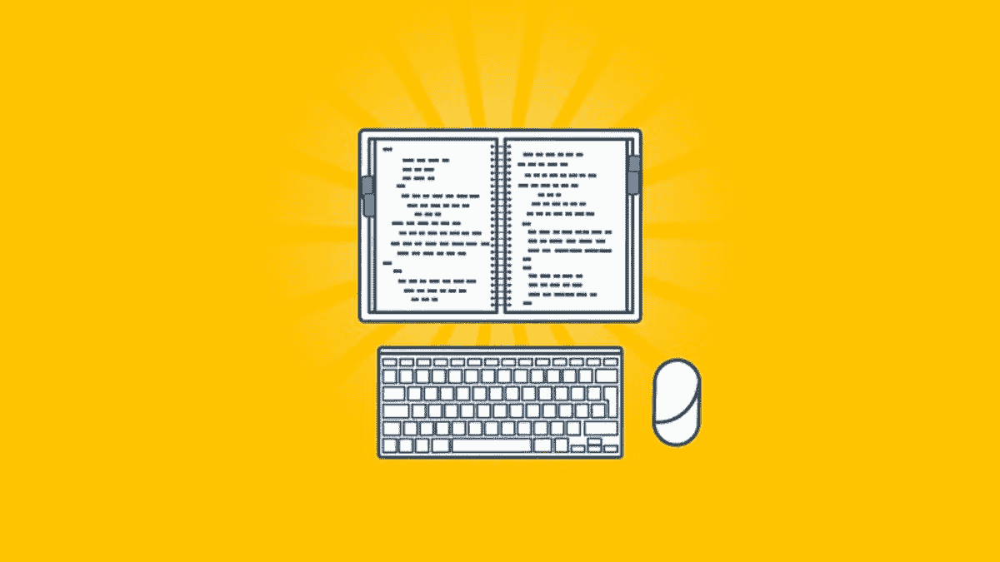
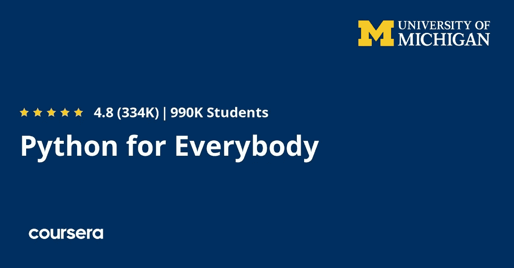
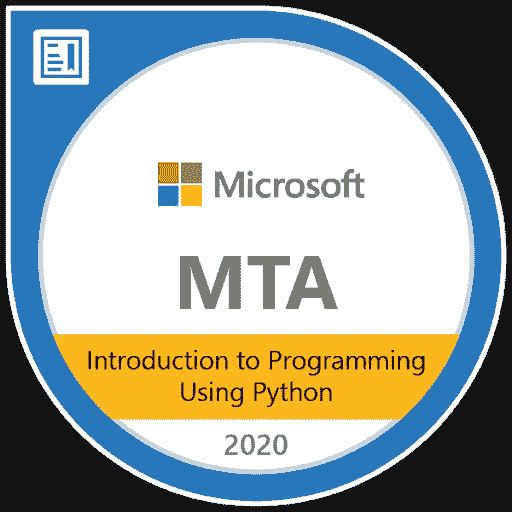
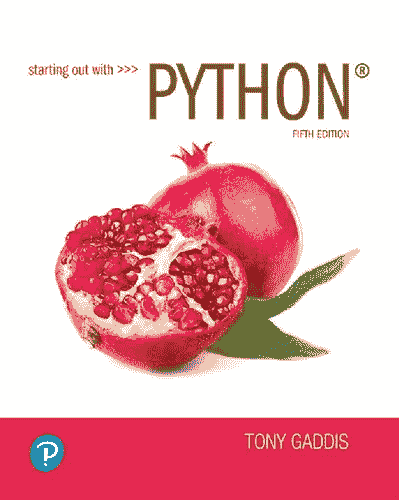

# 2023 年 5 本最佳 Python 认证书籍、课程和实践测试

> 原文：<https://medium.com/javarevisited/5-best-microsoft-python-certification-books-courses-and-practice-tests-to-crack-98-381-exam-in-b5c8895d5945?source=collection_archive---------1----------------------->

## 成为认证 Python 开发者的完整指南，并在 2023 年通过微软的 Python 认证考试

大家好，如果你正在准备任何 Python 编程认证，并且正在寻找最好的资源，比如在线课程和教程，那么你来对地方了。

之前我已经分享了 [**最好的 Python 书籍**](https://javinpaul.medium.com/best-python-books-a93d1a0d842d)[**网站**](/javarevisited/10-free-python-tutorials-and-courses-from-google-microsoft-and-coursera-for-beginners-96b9ad20b4e6) ， [**学习 Python 的最好的在线课程**](/javarevisited/10-best-python-3-courses-on-udemy-ddd4e3ec5dbf) 在他的文章中，我将分享最好的在线课程，为这次 Python 认证做准备。

比方说，你想在 IT 领域获得职业生涯，你想知道在这种情况下你应该做什么，我强烈建议你需要有公认的认证，无论你想成为一名 web 开发人员还是任何语言的程序员，python 绝对是其中之一。

[Python 在线认证](https://javarevisited.blogspot.com/2020/02/10-best-coursera-courses--for-python.html)不多。其中一些教你基础知识，另一些让你深入了解更高级的概念。我真心推荐你参加的最好的认证之一是 PCAP 认证的 Python 编程助理**考试，并在 2023 年成为认证的 Python 开发者。**

这个 python 认证是由 PCAP 为真正的初学者用户提供的，教学大纲包含这种语言的基础知识，如数据类型和运算符以及输入输出和错误处理，它不会教你 [Python](/javarevisited/10-best-python-certification-courses-from-coursera-4576890eb6b3) ，而是测试你对这种语言的技能和知识。

这篇文章将向您展示深入学习 python 的 [*最佳在线课程*](https://www.java67.com/2020/05/top-5-courses-to-learn-python-in-depth.html) 这样您就可以自信地通过考试，如果您喜欢阅读而不是看视频，还可以阅读一些在线书籍。

 [## 2023 年学习 Python 3 的前 5 门课程——最好的

### 2018 年学习 Python 3 的一些最好的在线课程的集合。Python 是最强大而简单的…

javarevisited.blogspot.com](https://javarevisited.blogspot.com/2018/03/top-5-courses-to-learn-python-in-2018.html) 

# 为 Python 编程考试 PCAP 认证助理准备的 5 本最佳 Python 课程和书籍

为了不浪费你更多的时间，这里有一个最好的在线课程和书籍列表，为 PCAP 认证的 Python 编程助理考试做准备。这项考试将于明年退休，可能会被另一个 Python 认证所取代，所以现在是获得 Python 认证的好时机，这样可以给自己一个竞争优势。

## 1.[Python 圣经](https://click.linksynergy.com/deeplink?id=CuIbQrBnhiw&mid=39197&murl=https%3A%2F%2Fwww.udemy.com%2Fcourse%2Fthe-python-bible%2F)

如果你想要一个类来指导你从一开始就掌握这门漂亮的编程语言，你应该看看 udemy 中的 python 课程，从安装环境开始，然后学习基础知识，比如循环的变量数据类型等等。

该课程教授你某个主题，之后通过一个小测验和一个编码挑战来测试你的技能，以增强你的知识。

这有助于你最大限度地利用本课程，并且在整个课程中不会感到无聊，并继续学习一些高级技术，如面向对象编程和 python 中的函数等。

**这里是加入本课程的链接**—[Python 圣经](https://click.linksynergy.com/deeplink?id=CuIbQrBnhiw&mid=39197&murl=https%3A%2F%2Fwww.udemy.com%2Fcourse%2Fthe-python-bible%2F)

## 2. [Python 为大家](https://coursera.pxf.io/c/3294490/1164545/14726?u=https%3A%2F%2Fwww.coursera.org%2Fspecializations%2Fpython)【图书&教程】

现在让我们来看一些亚马逊畅销书，这些书将帮助你作为初学者学习 python，我向大家推荐的最好的书之一是 Python，它最初是在 [Coursera](https://javarevisited.blogspot.com/2020/09/python-for-everybody-course-from-coursera-review.html#axzz6pXQD0ZSG) 和 [edX](https://javarevisited.blogspot.com/2021/05/top-10-edx-courses-and-certificates-for.html) 中的一门课程，但由于这个项目的成功，作者创建了他的课程的图书版本。

这本书教你计算机历史和从可变数据类型转移到 python，if 循环语句和更多的基础知识，然后转移到使用 python 与文件交互和创建一些项目，包括从 web 抓取数据以及与数据库交互等等。

如果你想加入课程，这里有 Coursera 上为大家提供的 [**加入 Python 的链接。这是一门很好的课程，可以深入学习 Python，也可以为 Python 认证做准备。**](https://coursera.pxf.io/c/3294490/1164545/14726?u=https%3A%2F%2Fwww.coursera.org%2Fspecializations%2Fpython)

顺便说一句，如果你计划参加多个 Coursera 课程或专业，那么考虑参加 [**Coursera Plus 订阅**](https://coursera.pxf.io/c/3294490/1164545/14726?u=https%3A%2F%2Fwww.coursera.org%2Fcourseraplus) ，它可以让你无限制地访问他们最受欢迎的课程、专业、专业证书和指导项目。它每月花费大约 59 美元，但很值得，因为你可以访问 7000 多门课程和项目，还可以获得无限的证书。

 [## Coursera Plus |无限制访问 7，000 多门在线课程

### 用 Coursera Plus 投资你的职业目标。无限制访问 90%以上的课程、项目…

coursera.pxf.io](https://coursera.pxf.io/c/3294490/1164545/14726?u=https%3A%2F%2Fwww.coursera.org%2Fcourseraplus) 

## 3.[Python MTA 98–381 考试](https://click.linksynergy.com/deeplink?id=CuIbQrBnhiw&mid=39197&murl=https%3A%2F%2Fwww.udemy.com%2Fcourse%2Fpython-mta-98-381-exam-complete-preparation-course-practice-tests-tips%2F)

不需要任何之前的 python 语言知识，你就可以参加这个 Udemy 课程，开始这种神话般的语言的职业生涯，你只需要两样东西:一台联网的计算机和学习 python 的热情。

通过首先向您介绍变量以及数据类型和循环来学习 python 的基础知识，因此这些知识将在整个课程中使用。

之后，您将创建一些项目和答案，之后您将探索面向对象的编程和使用 python 发送电子邮件，以及使用 SQL 和更多与数据库交互。

**这里是加入本课程的链接**—[Python MTA 98–381 考试](https://click.linksynergy.com/deeplink?id=CuIbQrBnhiw&mid=39197&murl=https%3A%2F%2Fwww.udemy.com%2Fcourse%2Fpython-mta-98-381-exam-complete-preparation-course-practice-tests-tips%2F)

## 4.[微软 Python 认证考试(98–381)](https://click.linksynergy.com/deeplink?id=CuIbQrBnhiw&mid=39197&murl=https%3A%2F%2Fwww.udemy.com%2Fcourse%2Fmicrosoft-python-certification-exam-98-381-practice-tests%2F)【模拟测试】

假设你现在已经掌握了 python，你想测试一下这些知识和技能，那么你可能需要在 Udemy 中查看这个基于问题的课程，包含大约 200 个问题，分为四个部分，每个部分有 40 个问题。

每个部分都包含许多关于某个主题的问题，比如第一次测试有关于变量、操作和数据类型等问题，其他测试将测试您在流程控制功能、错误处理等方面的知识。

**这里是参加本次模拟考试**——[微软 Python 认证考试(98–381)](https://click.linksynergy.com/deeplink?id=CuIbQrBnhiw&mid=39197&murl=https%3A%2F%2Fwww.udemy.com%2Fcourse%2Fmicrosoft-python-certification-exam-98-381-practice-tests%2F)的链接

## 5.[从 Python 开始](https://www.amazon.com/Starting-Out-Python-Tony-Gaddis/dp/0134444329/?tag=javamysqlanta-20)[图书]

转到最后一个建议，这是另一本学习 python 的好书，不需要任何入门经验，并且为您提供了这种编程语言的基础的学生友好的介绍等等。这本书首先向初学者介绍如何像任何 python 书籍或课程一样使用变量循环 if 和 else 语句编写 python 代码，然后转向一些高级主题，如类和函数、面向对象编程等等。

**这里是加入本课程的链接** — [从 Python 开始](https://www.amazon.com/Starting-Out-Python-Tony-Gaddis/dp/0134444329/?tag=javamysqlanta-20)

这些课程和书籍是我推荐给那些想获得 PCAP 认证的 Python 编程助理证书并在该领域获得职业生涯的人的一些最佳资源，现在你已经向实现这一目标迈出了一步。

您可能喜欢的其他 **Python 文章和教程**:

*   [2023 年学习 Python 的 10 个理由](https://javarevisited.blogspot.com/2018/05/10-reasons-to-learn-python-programming.html)
*   [5 个免费学习 Python 编码的网站](https://javarevisited.blogspot.com/2019/09/5-websites-to-learn-python-for-free.html)
*   2023 年你可以构建的 8 个 Python 项目
*   [Python vs Java？从哪个开始比较好？](https://hackernoon.com/java-vs-python-which-is-better-to-learn-for-beginners-in-2020-yq1t3y58)
*   [5 Python 中的数据科学与机器学习课程](https://javarevisited.blogspot.com/2018/03/top-5-data-science-and-machine-learning-online-courses-to-learn-online.html)
*   [初学 Python 的 5 大课程](https://hackernoon.com/top-5-courses-to-learn-python-in-2018-best-of-lot-26644a99e7ec)
*   [Python 开发者的 5 大 Web 开发框架](https://javarevisited.blogspot.com/2019/04/top-5-python-web-development-frameworks.html)
*   Python 和 JavaScript，从哪个开始比较好？
*   [深入学习 Python 的 10 门免费在线课程](https://javarevisited.blogspot.com/2018/12/10-free-python-courses-for-programmers.html)
*   [哈佛和 IBM 的 9 门数据科学课程](https://becominghuman.ai/9-data-science-and-machine-learning-courses-by-harvard-ibm-udemy-and-others-12a0c7c23ec1)
*   [面向数据科学和机器学习的 8 大 Python 库](https://javarevisited.blogspot.com/2018/10/top-8-python-libraries-for-data-science-machine-learning.html)
*   [Python vs . Java——初学者应该学习哪种编程语言？](https://javarevisited.blogspot.com/2018/06/java-vs-python-which-programming-language-to-learn-first.html)
*   [2023 年学习数据科学 Python 的前 5 本书](https://javarevisited.blogspot.com/2019/08/top-5-python-books-for-data-science-and-machine-learning.html)
*   [面向程序员的 10 本免费 Python 编程书籍](http://www.java67.com/2017/05/top-7-free-python-programming-books-pdf-online-download.html)
*   [深入学习 Python 的 10 门免费课程](https://hackernoon.com/10-free-python-programming-courses-for-beginners-to-learn-online-38312f3b9912)
*   [为什么 Python 是数据科学的最佳编程语言](https://javarevisited.blogspot.com/2020/05/why-python-is-best-programming-language.html)

感谢您阅读本文。如果您发现这些 ***最佳 Python 认证课程*** 有用，那么请与您的朋友和同事分享。如果您有任何问题或反馈，请留言。

如果你是 Python 新手，想从头开始学习 Python 编程，但正在寻找免费课程，那么不要担心。Udemy 上有很多免费的 Python 课程，其中很多你可以在上面的文章中找到。如果你赶时间，我建议从[**Python 编程入门**](http://bit.ly/2D5vvnV) 课程开始，它完全免费，你需要做的就是创建一个 Udemy 账户来注册这门课程。

 [## 15 门免费 Python 课程，供初学者在线学习

### 学习 Python 的一些免费在线课程的精选列表。

medium.com](/swlh/5-free-python-courses-for-beginners-to-learn-online-e1ca90687caf)