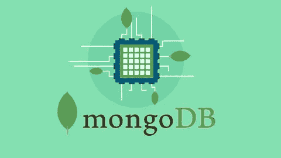
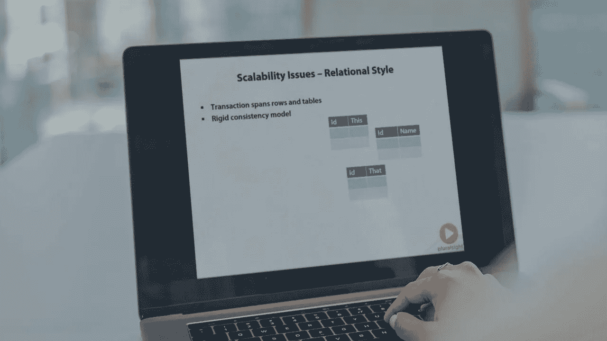
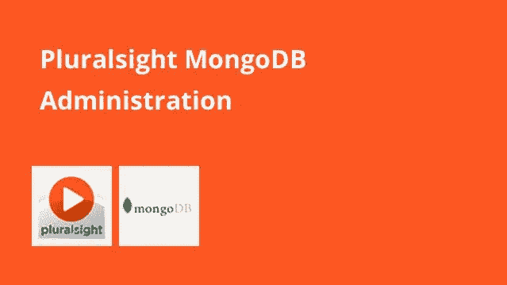

# 2023 年 6 门适合初学者学习的最佳 MongoDB 在线课程

> 原文：<https://medium.com/javarevisited/5-best-mongodb-courses-to-learn-nosql-for-beginners-in-2020-42df5af5496c?source=collection_archive---------2----------------------->

## 我最喜欢的在线课程 2023 年在线学习 MongoDB

大家好，如果你想学习 MongoDB 和 NoSQL 数据库，并寻找最好的在线课程，那么你来对地方了。以前分享过 MongoDB 起关键作用的[**学习 MERN 栈**](/javarevisited/top-5-online-courses-to-learn-mern-stack-in-depth-9947230f194?source=---------9------------------) 的最佳课程，还有 [Express.js、](https://www.java67.com/2020/06/top-5-courses-to-learn-mern-stack-for-web-development.html) [React.js](/javarevisited/top-10-free-courses-to-learn-react-js-c14edbd3b35f?source=extreme_main_feed----d3a191ac6ed-----5-1--------------------561c2dc6_a2b4_41e0_b7be_1d97edbf631c--8) 、 [Node.js](/javarevisited/top-10-online-courses-to-learn-node-js-in-depth-8ef0e31ca139) ，今天分享 2023 年学习 MongoDB 的最佳课程。

[MongoDB](https://www.mongodb.com/) 是领先的 [NoSQL 数据库](https://javarevisited.blogspot.com/2019/03/top-5-nosql-database-web-developers-should-learn.html)之一，很长一段时间我都没有机会学习或使用它，但最近我有机会在我们的一个项目中使用 MongoDB，在这个过程中我学到了很多。在本文中，我将介绍 MongoDB 以及如何学习 MongoDB，以便您可以在您的项目中使用它。

在本文中，我将分享一些我参加的在线课程，以了解 MongoDB 上的基本 CRUD(创建、检索、更新、删除)操作。我也读了几本书，也学习了一些教程，但是这些课程是我学习 Mongo DB 的主要来源。

你可能已经知道，MongoDB 是一个[**NoSQL 数据库**](https://javarevisited.blogspot.com/2019/03/top-5-nosql-database-web-developers-should-learn.html#ixzz64aBvbXQ4) 框架。NoSQL 数据库与传统的关系数据库管理系统(RDBMS)非常不同，如 [Oracle](http://www.java67.com/2018/02/5-free-oracle-and-microsoft-sql-server-online-courses.html) 、 [SQL Server](https://javarevisited.blogspot.com/2018/12/top-5-free-microsoft-sql-server-and-transact-sql-online-courses.html) 、 [MySQL](https://javarevisited.blogspot.com/2018/05/top-5-mysql-courses-to-learn-online.html) 或 [PostgreSQL](https://javarevisited.blogspot.com/2020/02/top-5-courses-to-learn-postgresql-in.html) 。

关系数据库有特定的预定义模式、表、列、约束、字段类型、触发器等等，但在 NoSQL 数据库中，没有这样的东西。

事实上，在建立数据库之前，不需要定义一个结构。这使得像 MongoDB 这样的 NoSQL 数据库可以根据应用程序进行伸缩，而像 Oracle T21 或微软 SQL Server T23 这样的关系数据库则不容易伸缩。

还有，NoSQL 在大多数情况下要快得多；因此，如果你需要存储或检索大量的数据，NoSQL 数据库是正确的选择。还有不同类型的 NoSQL 数据库，比如键值存储、文档数据库、宽列存储和图形数据库。MongoDB 是一个文档数据库，它使用类似于语法的 **JSON** (JavaScript 对象符号)将所有模式和记录存储在文档中。

如果你熟悉 [JavaScript](https://javarevisited.blogspot.com/2018/06/top-10-courses-to-learn-javascript-in.html) 、 [JSON](https://javarevisited.blogspot.com/2018/02/how-to-parse-json-with-date-field-in-java-jackson-example.html) 、 [Web 开发](http://www.java67.com/2018/03/top-5-free-courses-to-learn-web-development.html)，那么 MongoDB 就不会很难理解，这些课程一定能帮你开个好头。

# 2023 年 6 大 MongoDB 初学者课程

现在你知道什么是 NoSQL 数据库，什么是 MongoDB，是时候探索最好的在线课程来更好地学习 MongoDB 了。这些是我在开始学习 MongoDB 时看过的课程，所以从初学者的角度来看它们是不错的。

所有这些课程都来自最好的两个在线学习平台 [Pluralsight](https://javarevisited.blogspot.com/2020/08/top-10-pluralsight-courses-to-learn-React.js.html) 和 [Udemy](/javarevisited/my-favorite-udemy-online-courses-for-programmers-and-software-engineers-f9d941dd0035) 。

它们也不是很贵，因为有些只需要不到 10 美元。我最初想买这本书，但在我从这些课程中学到很多东西之前，我暂时放弃了这个想法。

## 1.MongoDB 的完整开发者指南

这是 2023 年学习 MongoDB 最好的 Udemy 课程。本课程将用测试驱动的方法教你 MongoDB 和 Mongoose 设计。

本课程将让你快速上手并运行 MongoDB，教会你深入理解和构建以 Mongo 为中心的 app 所需的核心知识。

这是 [NodeJS](http://javarevisited.blogspot.sg/2018/01/top-5-nodejs-and-express-js-online-courses-for-web-developers.html) 的重点，使用测试驱动练习，还解释了 MongooseJS 的高级特性。

如果你是 MongoDB 的新手，或者如果你一直在努力学习它，但有时觉得你还是不太“明白”,这就是适合你的 MongoDB 课程

**这里是加入本课程的链接**—[MongoDB 的完整开发者指南](https://click.linksynergy.com/fs-bin/click?id=JVFxdTr9V80&subid=0&offerid=634352.1&type=10&tmpid=14538&RD_PARM1=https%3A%2F%2Fwww.udemy.com%2Fthe-complete-developers-guide-to-mongodb%2F)

## 2.努里·哈尔佩林对 MongoDB 的介绍——多视角

这是 Pluralsight 上最好的 MongoDB 课程。正如我在上一段所说，MongoDB 是一个非常流行的开源 NoSQL 数据库。当需要可伸缩性和速度时，这个数据库会大放异彩。

是一个文档数据库，强加的很少，有很多编程语言的驱动。

本课程将教你如何运行 mongo，操作和查询数据，速度指数，并教你开始使用 Mongo 所需的基本技能。

**这里是加入本课程的链接**—[Nuri Halperin 的 MongoDB 简介](https://pluralsight.pxf.io/c/1193463/424552/7490?u=https%3A%2F%2Fwww.pluralsight.com%2Fcourses%2Fmongodb-introduction)

## 3. [MongoDB Essentials —完整的 MongoDB 指南](https://click.linksynergy.com/fs-bin/click?id=JVFxdTr9V80&subid=0&offerid=634352.1&type=10&tmpid=14538&RD_PARM1=https%3A%2F%2Fwww.udemy.com%2Fmongodb-essentials-m%2F) — Udemy

这是使用 JavaScript Mongo Shell、Robo 3T (Robomongo)和 Udemy 上的 MongoDB Compass 学习 MongoDB 数据库的另一个很棒的课程。您将了解 MongoDB 是如何在幕后工作的。

课程纯粹专注于 MongoDB 和 MongoDB Shell。您将从安装 MongoDB 开始，并学习如何在 MongoDB Shell 中工作。我们将讨论和探索 MongoDB 中使用的 JavaScript 引擎。

您还将学习主要的 MongoDB 数据类型——字符串、数字、数组、对象、日期等，并执行各种 CRUD(创建、读取、更新和删除)操作。

您还将学习 JSON 和 BSON 数据类型，并讨论它们之间的区别。

**以下是加入本课程的链接** — [MongoDB 基础知识—完整的 MongoDB 指南](https://click.linksynergy.com/fs-bin/click?id=JVFxdTr9V80&subid=0&offerid=634352.1&type=10&tmpid=14538&RD_PARM1=https%3A%2F%2Fwww.udemy.com%2Fmongodb-essentials-m%2F)

## 4.努里·哈尔珀林对 MongoDB 的管理

这个 Pluralsight Mongo DB 课程将教你有效管理 Mongo DB 所需的基本技能和工具。它涵盖了 MongoDB 管理工具、语法和管理原则，涵盖了从安装到配置、备份、监控、向外扩展、安全性和性能调优的方方面面。

它向您展示了如何创建和管理副本集——Mongo 的可用性和持久性机制。它将教你如何使用切分来扩展 Mongo。

本课程还深入探讨了索引和性能调优，以及您可以使用哪些工具和技术来使您的生产部署平稳且可预测地运行。

**这是加入本课程的链接** — [由 Nuri Halperin 管理的 MongoDB】](https://pluralsight.pxf.io/c/1193463/424552/7490?u=https%3A%2F%2Fwww.pluralsight.com%2Fcourses%2Fmongodb-administration)

顺便说一下，你需要一个 Pluralsight 会员才能参加这个课程，费用大约是每月 29 美元或每年 299 美元(14%的折扣)。

我向所有程序员强烈推荐这个订阅，因为它提供了超过 7000 个在线课程的即时访问，以学习任何技术技能。或者，你也可以使用他们的 [**10 天免费通行证**](https://pluralsight.pxf.io/c/1193463/424552/7490?u=https%3A%2F%2Fwww.pluralsight.com%2Flearn) 免费观看这门课程。

<https://pluralsight.pxf.io/c/1193463/424552/7490?u=https%3A%2F%2Fwww.pluralsight.com%2Flearn>  

## 5.3T 学院版 MongoDB 101 和 MongoDB 201(免费)

这是从 Academy 3T 学习 MongoDB 的另一个很好的课程，Academy 3T 是一个领先的 MongoDB 学习平台，由 Studio 3T 的创作者开发，是领先的 MongoDB 专业人员 GUI。

他们的 [MongoDB 初学者教程](https://studio3t.com/academy/)、 **MongoDB 101** 仅用两个小时就涵盖了基础知识，而他们的中级课程 **MongoDB 201** 则在不到三个小时的时间里带您了解查询 MongoDB 的更复杂的细节——包括如何构建`find()`查询、使用聚合框架和查询数组。

有了适量的理论和大量的实践练习和测验，您将很快按照自己的进度学习 MongoDB。

所有 Academy 3T 课程都是免费的，不需要注册。

下面是开始 MongoDB 101 课程的链接: [MongoDB 101](https://studio3t.com/academy/lessons/introduction-to-mongodb/)
下面是开始 MongoDB 201 课程的链接: [MongoDB 201](https://studio3t.com/academy/lessons/mongodb-crud-operations/)

<https://studio3t.com/academy/lessons/mongodb-crud-operations/>  <https://studio3t.com/academy/lessons/introduction-to-mongodb/>  

## 6.[从零开始学习 MongoDB:领先的 NoSQL 数据库](https://click.linksynergy.com/fs-bin/click?id=JVFxdTr9V80&subid=0&offerid=634352.1&type=10&tmpid=14538&RD_PARM1=https%3A%2F%2Fwww.udemy.com%2Flearn-mongodb-leading-nosql-database-from-scratch%2F) — Udemy

这是另一个精彩的 MongoDB 课程，学习构建基于 MongoDB 的应用程序所需的所有 NoSQL 和 MongoDB 概念。

这又是一门实践课程，包括两个全面的实际项目，以应用您在课程中学到的任何东西:

项目 1 —使用 node.js 和 MongoDB

项目 2:使用 [MongoDB](https://javarevisited.blogspot.com/2019/01/top-5-mongodb-online-training-courses.html) 和 [Java/JEE](/javarevisited/top-7-online-courses-to-learn-java-ee-jakarta-ee-in-2020-216c1a5eea99)

的用户管理系统简而言之，这是一门理想的课程，适合希望学习使用 MongoDB 进行 NoSQL 数据库设计的 DBA 以及希望学习和开发 MongoDB 的开发人员

**这里是加入本课程的链接**——[从零开始学习 MongoDB:领先 NoSQL 数据库](https://click.linksynergy.com/fs-bin/click?id=JVFxdTr9V80&subid=0&offerid=634352.1&type=10&tmpid=14538&RD_PARM1=https%3A%2F%2Fwww.udemy.com%2Flearn-mongodb-leading-nosql-database-from-scratch%2F)

以上是开发人员和 DBA 学习 MongoDB 的一些最佳课程。正如我所说，这是最受欢迎的 NoSQL 数据库之一，如果你有兴趣去 NoSQL，那么 MongoDB 是一个很好的开始。这些课程大部分都是实践性的，你不仅会学习理论，还会获得一些 MongoDB

其他**在线编程资源**你可能会喜欢
[2023 devo PS 程序员路线图](https://javarevisited.blogspot.com/2018/09/the-2018-devops-roadmap-your-guide-to-become-DevOps-Engineer.html)
[10 框架 Java 和 Web 开发人员应该学习的](https://javarevisited.blogspot.com/2018/01/10-frameworks-java-and-web-developers-should-learn.html)
[学习数据库和 SQL 的前 5 门课程](https://javarevisited.blogspot.com/2018/05/top-5-sql-and-database-courses-to-learn-online.html)
[2023 React JS 开发人员路线图](https://javarevisited.blogspot.com/2018/10/the-2018-react-developer-roadmap.html)
 <http://www.java67.com/2018/08/top-10-free-java-courses-for-beginners-experienced-developers.html> [2023 年学习 Scala 的 5 门免费课程](https://javarevisited.blogspot.com/2019/01/5-free-scala-programming-courses-for-java-programmers-learn-online.html)
[2023 年学习 Maven 和 Jenkins 的 5 门免费课程](http://www.java67.com/2018/02/6-free-maven-and-jenkins-online-courses-for-java-developers.html)
[10 个框架和库全栈开发者应该学习的](https://javarevisited.blogspot.com/2019/01/10-web-development-frameworks-fullstack-developer-should-learn.html)
[2023 年学习 Docker 的 10 门免费课程](http://www.java67.com/2018/02/5-free-docker-courses-for-java-and-DevOps-engineers.html)
[2023 年学习 React JS 的前 5 门课程](https://javarevisited.blogspot.com/2018/08/top-5-react-js-and-redux-courses-to-learn-online.html)
[5 个面向 Java 开发者的 Android 在线培训课程](https://javarevisited.blogspot.com/2017/12/top-5-android-online-training-courses-for-Java-developers.html) [2023 年加入的 13 门免费 JavaScript 课程](/javarevisited/12-free-courses-to-learn-javascript-and-es6-for-beginners-and-experienced-developers-aa35874c9a32)
[2023 年可以加入的 10 门免费 TypeScript 课程](/javarevisited/top-10-free-typescript-courses-to-learn-online-best-of-lot-44bce9da41d1)

感谢您阅读本文。如果你喜欢这些 MongoDB 课程，请与你的朋友和同事分享。如果您有任何问题或反馈，请留言。

如果你正在寻找一个免费的 MongoDB 课程来开始你的 NoSQL 之旅，那么你也可以在 Udemy 上查看这个免费的[**MongoDB Essentials——了解 MongoDB**](https://click.linksynergy.com/deeplink?id=JVFxdTr9V80&mid=39197&murl=https%3A%2F%2Fwww.udemy.com%2Fcourse%2Fmongodb-essentials%2F) 课程的基础知识。这个课程是完全免费的，你只需要一个 Udemy 帐户就可以加入这个课程。

<https://click.linksynergy.com/deeplink?id=JVFxdTr9V80&mid=39197&murl=https%3A%2F%2Fwww.udemy.com%2Fcourse%2Fmongodb-essentials%2F> 