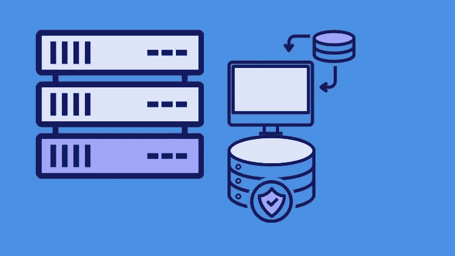
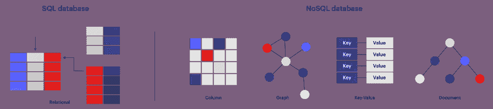
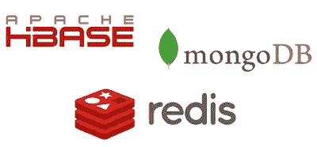
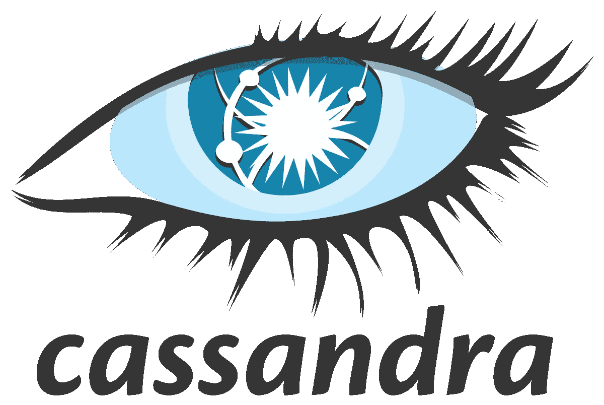
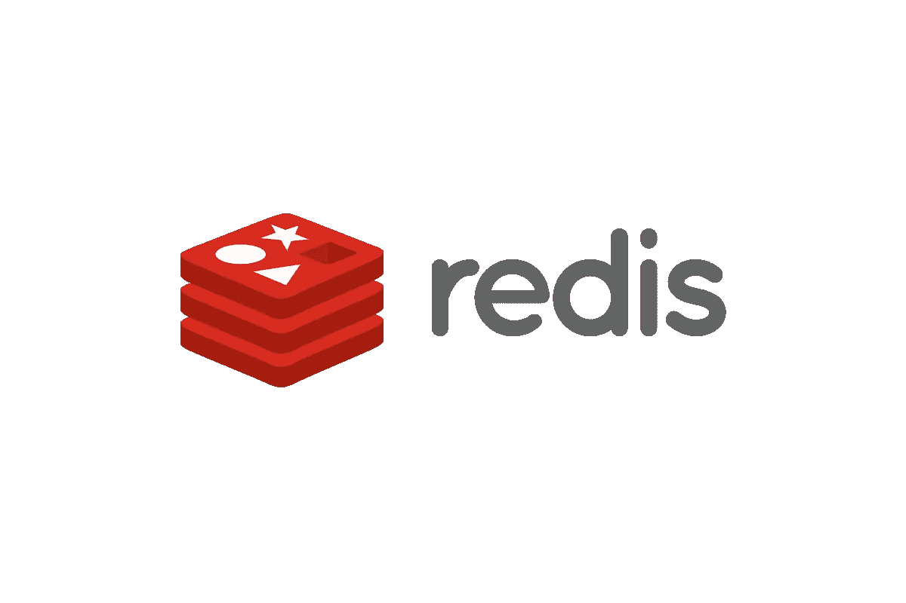
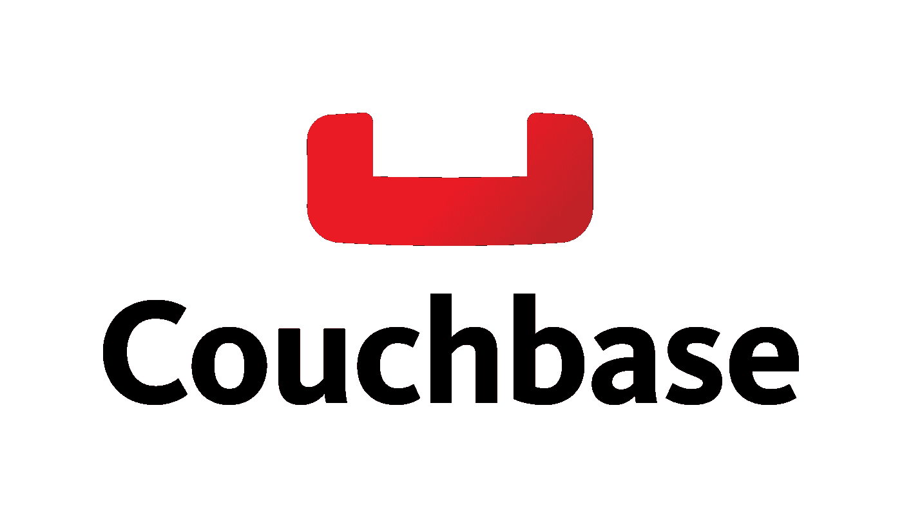
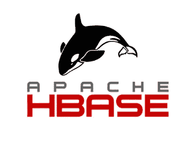

# 2023 年 NoSQL 数据库开发人员可以学到的 5 个知识

> 原文：<https://medium.com/javarevisited/5-best-nosql-database-programmers-and-developers-can-learn-42a0bdfa9a12?source=collection_archive---------0----------------------->

## 这些是最受欢迎的 NoSQL 数据库程序员、软件工程师和全栈开发人员，他们可以通过最佳资源和在线课程的链接在 2023 年学习。

image_credit — Udemy

大家好，如果你想了解 NoSQL 和流行的 NoSQL 数据库，那么你来对地方了。早些时候，我已经分享了 [**免费的 SQL 和数据库课程**](/javarevisited/7-free-courses-to-learn-database-and-sql-for-programmers-and-data-scientist-e7ae19514ed2) ，在这篇文章中，我将谈论 NoSQL，并分享学习不同类型的 NoSQL 数据库的最佳资源。

尽管不强制要求 [Java](https://javarevisited.blogspot.com/2016/01/how-to-become-better-java-developer.html#axzz5gF1pIlkc) 或 [Web 开发人员](https://javarevisited.blogspot.com/2019/01/10-web-development-frameworks-fullstack-developer-should-learn.html)学习 NoSQL 数据库，但世界正朝着那个方向发展，Java 和 Web 开发人员都应该熟悉 NoSQL 数据库。

如果你想知道**NoSQL 数据库是什么意思**，那么这里有一个快速概述。

NoSQL 数据库是指提供数据存储和检索机制的非 SQL、非关系或不仅仅是 SQL 数据库，它以不同于关系数据库中使用的表格关系的方式建模。

NoSQL 数据库主要有四种类型:**键值存储、文档存储、面向列的数据库和图形数据库**。每种类型都解决了一个关系数据库无法解决的问题

随着 [Spring 5](https://javarevisited.blogspot.com/2018/06/top-6-spring-framework-online-courses-Java-programmers.html) 引入 [**Web-Flux**](/javarevisited/7-best-webflux-and-reactive-spring-boot-courses-for-java-programmers-33b7c6fa8995) **，**一个新的非阻塞 Web 框架，NoSQL 数据库的使用只会增长，但大问题是从哪个 NoSQL 数据库开始？

有很多流行的 NoSQL 选项可用，像 [Apache Cassandra、](https://cassandra.apache.org/_/index.html) [MongoDB](https://javarevisited.blogspot.com/2019/01/top-5-mongodb-online-training-courses.html) 、 [Redis](https://redis.io/) 和 [Couchbase](https://www.couchbase.com/) 。这完全取决于你的项目。如果它使用的是 Cassandra，那么你可能需要学习 Cassandra，如果它使用的是 MongoDB，那么你可能需要学习 MongoDB。

但是如果你是一个技术或[解决方案架构师](https://javarevisited.blogspot.com/2018/02/5-must-read-books-to-become-software-architect-solution.html)，决定选择使用哪一个 NoSQL 数据库，你可能需要熟悉它们，了解它们的优缺点，并根据你的情况和它们的优势做出决定。

说到学习，我个人喜欢熟悉尽可能多的技术、框架、库，只是为了拓宽自己的知识面。即使我不经常使用它们，学习它们有时也会给我的头脑带来新的想法，我会学到一些东西，这些东西可以用在我现有的项目中。

如果你渴望成为一名软件或技术架构师，那么你应该熟悉最新最棒的[技术](http://www.java67.com/2018/01/top-10-web-mobile-and-big-data-framework-libraries-technologies-programmers-should-learn-in-2018.html)、[框架](http://www.java67.com/2018/02/top-10-open-source-frameworks-and-libraries-java-web-developers.html)，以及[库](https://javarevisited.blogspot.com/2018/01/top-20-libraries-and-apis-for-java-programmers.html)。记住这一点，我将在本文中分享一些关键的 5 个 NoSQL 数据库，你可以在 2023 年内学习或熟悉它们。

# 2023 年 NoSQL 数据库开发人员应该学会的 5 件事

正如我所说的，市场上有许多 NoSQL 数据库，如 Apache [Cassandra](https://javarevisited.blogspot.com/2022/02/top-5-courses-to-learn-apache-cassandra.html) 、 [MongoDB](https://javarevisited.blogspot.com/2019/01/top-5-mongodb-online-training-courses.html) 、 [Redis](https://javarevisited.blogspot.com/2022/02/top-5-courses-to-learn-redis.html) 和 Couchbase，但每一个都有一些特殊的功能，使用它们都有利弊。要根据您的需求做出明智的决策，需要对这些方面有充分的了解。

## 1.MongoDB

MongoDB 是一个面向对象、简单、动态和可伸缩的 NoSQL 数据库。它基于 NoSQL 文档库模型。数据对象作为单独的文档存储在集合中，而不是将数据存储在传统关系数据库的列和行中。MongoDB 使用类似 JSON 的文档和模式。

如果你今年想学 MongoDB，建议你去 Udemy 上看看[**MongoDB——完全开发者指南**](https://click.linksynergy.com/deeplink?id=JVFxdTr9V80&mid=39197&murl=https%3A%2F%2Fwww.udemy.com%2Fmongodb-the-complete-developers-guide%2F) 在线课程。开始学习 MongoDB NoSQL 数据库的最佳课程之一。

如果你需要更多的选择和资源，那么你也可以看看这个免费的 MongoDB 课程列表和最好的 Mongo DB 课程列表。

## 2.阿帕奇卡桑德拉

Apache Cassandra 是一个免费的开源分布式 NoSQL 数据库管理系统，旨在处理许多商用服务器上的大量数据，提供无单点故障的高可用性。当您需要可伸缩性和高可用性而又不牺牲性能时，Apache Cassandra 数据库是正确的选择。商用硬件或云基础设施上的线性可扩展性和经验证的容错能力使其成为任务关键型数据的完美平台

Cassandra 数据库的主要优势之一是它提供高可用性的服务，并且没有单点故障。

如果你决定学习阿帕奇卡珊德拉 NoSQL 数据库，那么 Udemy 上的 [**阿帕奇卡珊德拉**](https://click.linksynergy.com/deeplink?id=JVFxdTr9V80&mid=39197&murl=https%3A%2F%2Fwww.udemy.com%2Fapache-cassandra%2F) 入门课程是最好的入门课程之一。

## 3.雷迪斯

Redis 是一个开源的内存数据库项目，实现了一个分布式的、具有可选持久性的内存键值存储。它还可以用作缓存和消息代理。

支持[字符串](http://www.java67.com/2018/04/21-string-programming-and-coding-interview-questions-answers.html)，[哈希](https://javarevisited.blogspot.com/2018/01/top-5-free-data-structure-and-algorithm-courses-java--c-programmers.html)，[列表](https://javarevisited.blogspot.com/2015/07/java-arraylist-tutorial.html)，[集合](https://javarevisited.blogspot.com/2012/11/difference-between-treeset-hashset-vs-linkedhashset-java.html)，范围查询排序集合，位图，超级日志，半径查询地理空间索引等数据结构。

如果你决定在 2023 年学习 Redis，那么 [**从零开始学习 Redis**](https://click.linksynergy.com/deeplink?id=JVFxdTr9V80&mid=39197&murl=https%3A%2F%2Fwww.udemy.com%2Flearn-redis-from-scratch%2F)Udemy 上的课程是一个不错的开始。

## 4.沙发底座

Couchbase Server，原名 Membase，是一个开源的分布式多模型 NoSQL 面向文档的数据库软件包，针对交互式应用程序进行了优化。

如果你想学习更多关于 Couchbase 数据库的知识，并且需要一个资源，那么我强烈推荐你查看 Udemy 上的 [**了解 CouchDB 3:学习基础&高级 NoSQL 技能**](https://click.linksynergy.com/deeplink?id=JVFxdTr9V80&mid=39197&murl=https%3A%2F%2Fwww.udemy.com%2Fcourse%2Funderstanding-couchdb%2F) 课程。这是我在线学习 Couchbase 的最佳资源。

如果你需要更多的选择，你也可以从官方教程和文档中获得。顺便说一句，他们也有一些免费的在线培训，你可以作为一门课程来使用。

## 5.Apache HBase

HBase 是一个开源的、非关系的分布式数据库，模仿 Google 的 Bigtable，用 Java 编写。它是作为 Apache Software Foundation 的 Apache Hadoop 项目的一部分开发的，运行在 HDFS (Hadoop 分布式文件系统)之上，为 Hadoop 提供类似于 Bigtable 的功能。

如果你决定学习 Apache HBase，那么你也可以在 Udemy 上加入 [**完整的 Apache HBase 开发者课程**](https://click.linksynergy.com/deeplink?id=JVFxdTr9V80&mid=39197&murl=https%3A%2F%2Fwww.udemy.com%2Fapache-hbase-course%2F) 从头开始学习。

## 关于 NoSQL 数据库的常见问题

以下是一些关于 NoSQL 数据库的常见问题

1.  ***NoSQL 数据库有哪 4 种类型？***

有四种主要类型的 NoSQL 数据库:

*   文档数据库。
*   键值存储。
*   面向列的数据库。
*   图形数据库。

***2。哪个是最好的 NoSQL 数据库？***

这取决于场景，例如，如果你需要一个基于文档的 NoSQL 数据库，那么 MongoDB 是最好的 NoSQL 数据库。同样，如果您需要全文搜索作为解决方案的一部分，那么 [ElasticSearch](https://javarevisited.blogspot.com/2022/02/top-5-courses-to-learn-elasticsearch.html) 是最佳选择。就可伸缩性而言， [AWS DynamoDB](/javarevisited/7-best-aws-s3-and-dynamodb-courses-for-beginners-in-2021-a8a44b6066da) 也是一个很棒的数据库。

**3。MongoDB 是什么类型的 NoSQL？**

MongoDB 是一个文档数据库。图形数据库用于存储关于网络的信息，例如社会关系。

**4。SQL 和 NoSQL 哪个更快？**

至于速度， **NoSQL 一般比 SQL** 快，尤其是我们实验中的键值存储；另一方面，NoSQL 数据库可能不完全支持 ACID 事务，这可能导致数据不一致。

这就是 2023 年你可以学习和探索的一些最好的 NoSQL 数据库。即使您在当前项目中没有使用任何 NoSQL 数据库，也应该提前了解它们。

他们将帮助你拓宽知识面，并让你跟上最新的技术发展。在找工作和去面试的时候，了解最新的技术发展也很重要。

其他**编程资源文章**您可能喜欢探索

*   [2023 年 Java 程序员应该学会的 10 件事](https://javarevisited.blogspot.com/2017/12/10-things-java-programmers-should-learn.html#axzz5atl0BngO)
*   [面向 Java 开发者的 5 门免费 Spring 框架课程](http://www.java67.com/2017/11/top-5-free-core-spring-mvc-courses-learn-online.html)
*   [2023 年 DevOps 开发者路线图](https://javarevisited.blogspot.com/2018/09/the-2018-devops-roadmap-your-guide-to-become-DevOps-Engineer.html)
*   [面向有经验的 Java 开发人员的 5 大 Java 设计模式课程](http://javarevisited.blogspot.sg/2018/02/top-5-java-design-pattern-courses-for-developers.html)
*   [编程/编码工作面试 10 门课程](http://javarevisited.blogspot.sg/2018/02/10-courses-to-prepare-for-programming-job-interviews.html)
*   [学习 learn Shell 脚本的 5 门课程](http://javarevisited.blogspot.sg/2018/02/5-courses-to-learn-shell-scripting-in-linux.html)
*   [学习 Python 编程的 10 门免费课程](https://javarevisited.blogspot.com/2018/12/10-free-python-courses-for-programmers.html)
*   [2023 年网络开发者路线图](https://javarevisited.blogspot.com/2019/02/the-2019-web-developer-roadmap.html)
*   [2023 年 Java 开发人员可以学习的 21 项技术技能](https://javarevisited.blogspot.com/2020/03/top-20-skills-java-developers-can-learn.html#axzz6k4XBgTw4)
*   [初级开发人员的 10 个 Web 开发技巧](/javarevisited/10-things-aspiring-web-developers-should-learn-in-2021-6747bfbfc12e)
*   [50+数据结构与算法面试问题](http://www.java67.com/2018/06/data-structure-and-algorithm-interview-questions-programmers.html)
*   [如何在 2023 年成为一名现代 React JS 开发者](https://javarevisited.blogspot.com/2018/10/the-2018-react-developer-roadmap.html)
*   [学习 Java 编程的 10 门免费在线课程](http://www.java67.com/2018/08/top-10-free-java-courses-for-beginners-experienced-developers.html)
*   [深入学习数据结构和算法的 10 门免费课程](http://www.java67.com/2019/02/top-10-free-algorithms-and-data.html)

感谢您阅读本文。如果你喜欢这些*最佳 NoSQL 数据库*，那么请与你的朋友和同事分享。如果您有任何问题或反馈，请留言。

**P. S.** —如果你对学习 NoSQL 技术感兴趣，特别是 MongoDB，但正在寻找一个免费的在线培训课程，那么我强烈推荐你在 Udemy 上查看— [**MongoDB Essentials —了解 Mongo DB**](https://click.linksynergy.com/deeplink?id=JVFxdTr9V80&mid=39197&murl=https%3A%2F%2Fwww.udemy.com%2Fcourse%2Fmongodb-essentials%2F) 课程的基础知识。这是完全免费的，你只需要一个 Udemy 帐户就可以加入这个课程。

 [## 2023 年 5 大免费 MongoDB 和 NoSQL 课程供初学者学习——最好的

### 如果你想在 2023 年学习最受欢迎的 NoSQL 数据库之一 MongoDB，s 和正在寻找免费资源，如…

www.java67.com](https://www.java67.com/2020/10/5-free-mongo-db-courses-for-programmers.html)