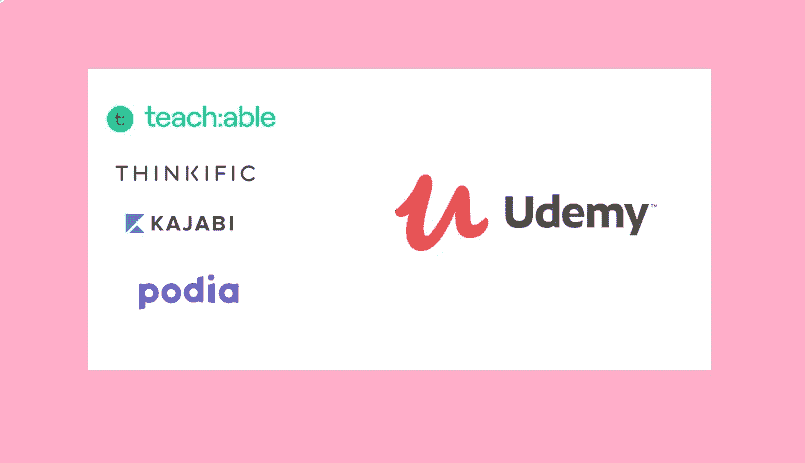
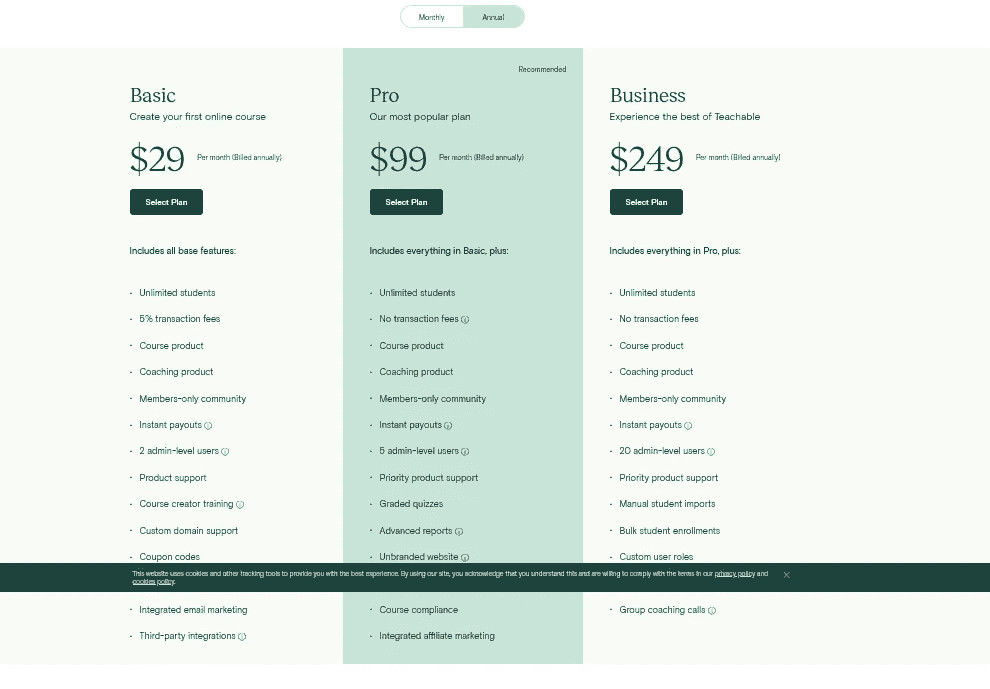
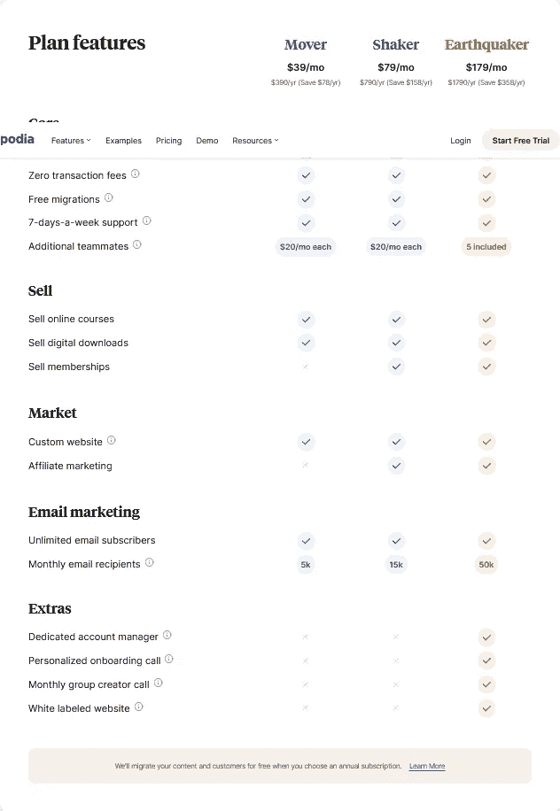
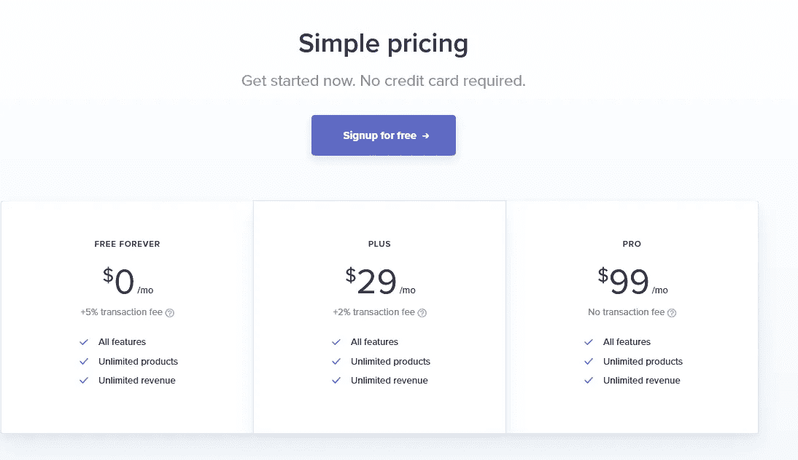
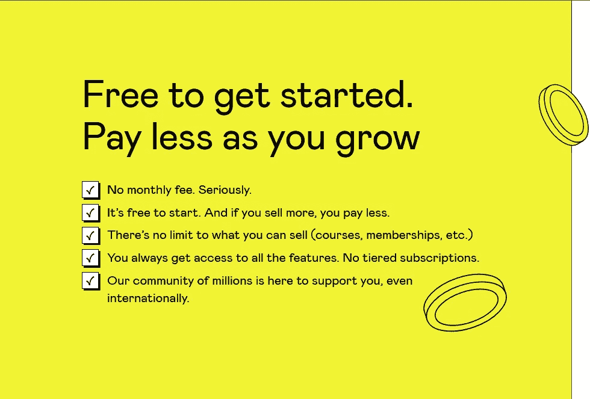
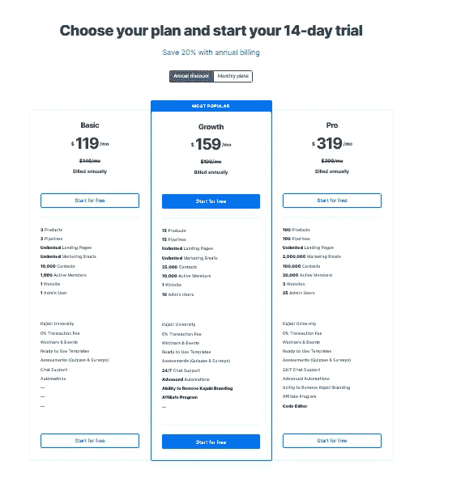
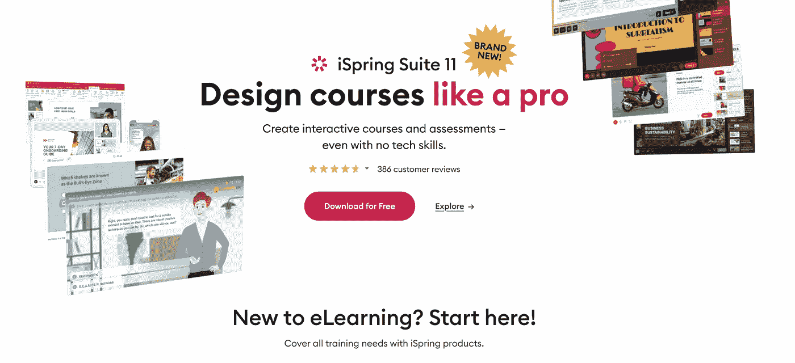
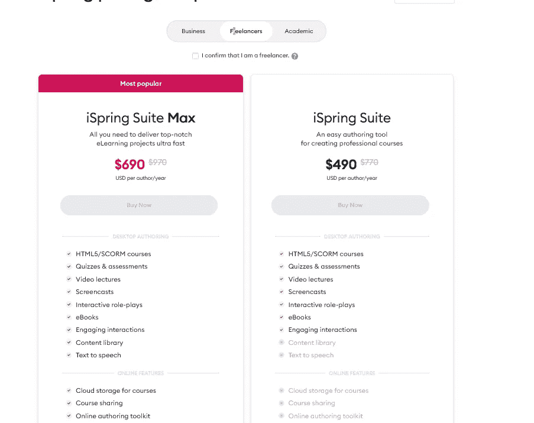

# 2023 年创建和销售课程和会员资格的 9 个最佳在线课程平台

> 原文：<https://medium.com/javarevisited/5-best-online-course-platforms-for-instructors-bloggers-teachers-and-creators-in-2021-84dd9cadd66f?source=collection_archive---------0----------------------->

## 我最喜欢的在线课程平台创建和销售你的在线课程，培训，在线辅导，并开始你的在线教学学校。他们中的大多数都有针对初学者的免费计划。

大家好，如果你是一个在线课程创建者、讲师、教师或博客作者，正在寻找最好的在线平台来创建、托管和销售你的在线课程、电子书、会员和数字产品，并且正在寻找最好的免费和付费平台，那么你来对地方了。

在这篇文章中，我将分享举办和销售在线培训课程的最佳地点。在这篇文章中，我们将看看最好的在线教学平台，如<https://teachable.sjv.io/c/1193463/998814/12646>**[**th nkitic**](http://try.thinkific.com/javinpaul8817)[**learn world**](https://learnworlds.grsm.io/javarevisited)**[pay hip](https://payhip.com?fp_ref=javin98)[Udemy](https://click.linksynergy.com/fs-bin/click?id=JVFxdTr9V80&offerid=323058.9409&type=3&subid=0)、Kajabi 和 [**Podia**](https://podia.sjv.io/c/3294490/1274189/15666?u=https%3A%2F%2Fwww.podia.com%2F) 并对它们进行分析，找出哪一个最适合在线教学和销售****

****在线教学变得越来越大，许多博客作者、专业人士、程序员都在创建在线课程，赚了很多钱。对于被动收入创造者来说，这是一条新的途径，我认为这是我所知道的最好的途径之一。****

> ****为什么？因为这对每个人来说都是双赢的。****

****例如，如果一个博客作者创建了一个在线课程，他通过教学赚钱。学生们受益是因为他们从一位专家那里学到了知识，这位专家通过自己的错误和实践知识艰难地获得了知识，而像<https://teachable.sjv.io/c/1193463/998814/12646>**[*thinkfic*](http://try.thinkific.com/javinpaul8817)*[*Podia*](https://podia.sjv.io/c/3294490/1274189/15666?u=https%3A%2F%2Fwww.podia.com%2F)*和 Kajabi* 这样的在线创作者平台受益是因为他们赚取了一些费用和佣金。因此，对于学生、课程创建者、教师和平台这三方来说，这是一个双赢的局面，这使得在线创建和销售课程变得很容易。

如今许多人创建在线课程的最大原因是这个行业发展非常快。据估计，在线学习行业将从 2017 年的 1700 亿美元增长到 2023 年的 3500 亿美元左右，这是一个惊人的数字。创建在线课程的另一个重要原因是它的扩展性很好。*******

> ******你只需要创建一次课程，然后你就可以多次向多人出售，而无需积极参与。******

******这是一种创造被动收入流的强大而真实的方式，这就是为什么我一直要求人们 [**创建在线课程作为副业**](https://dev.to/javinpaul/why-sofware-developers-should-create-online-courses-as-a-side-hustle-3011) 。虽然，如果你关心你的学生和你的课程，你应该花些时间帮助学生，更新你的课程材料以保持它的相关性和最新性，但与博客、自由职业者、写作或任何其他在线赚钱方式相比，这只是工作中很小的一部分。

现在，我们很清楚创建一个在线课程是一个很棒的主意，让我们把注意力放在可以帮助你建立和销售在线课程的平台上。******

# ******2023 年创建和销售在线课程、书籍、会员和数字产品的 9 个最佳软件平台******

******当谈到在线创建和销售课程时，有许多选项，如<https://teachable.sjv.io/c/1193463/998814/12646>**[**th nkitic**](http://try.thinkific.com/javinpaul8817)[**learn world**](https://learnworlds.grsm.io/javarevisited)**、** [**Udemy**](https://click.linksynergy.com/fs-bin/click?id=JVFxdTr9V80&offerid=323058.9409&type=3&subid=0) 、Kajabi、Skillshare 和**【Podia**(之前称为蔻驰)、Payhip、Gumroad 等。********

******你也可以在网上找到很多关于他们的详细评论，但我必须根据自己的评估来选择，记住一些非常重要的特点，比如创建课程的难易程度、营销(销售)和成本。******

## ******1.[思维型](http://try.thinkific.com/javinpaul8817)******

******在创建在线课程方面，[thinkfic](http://try.thinkific.com/javinpaul8817)是市场领导者，有 32，000 名有影响力的博客作者、程序员和营销人员选择了他们来主持他们的课程。这个事实本身就说明了很多关于 Thikific 的事情，因为很多人不会错，他们也不是初学者，但他们中的很多人都是专家和有影响力的人。

[thinkfic](http://try.thinkific.com/javinpaul8817)在课程讲授和学生参与方面简直令人惊叹。它允许您添加多种内容类型，包括视频、测验、文本、PDF、调查等。你还可以提供课程完成证书，这是如今课程的最大卖点，因为它允许学生在 LinkedIn 和他们的简历上展示他们的技能。它们还允许您创建带有先决条件和课程锁定的学习路径，这对于基于技能的教学非常有用。

他们性价比也很高。他们的 [**免费计划**](http://try.thinkific.com/javinpaul8817-omf) *允许你创建多达 3 门在线课程，学生人数不限。内容托管也是免费的，但是如果你对你的在线课程很认真的话，我建议你加入他们的专业计划(79 美元/月),以获得让你的课程更上一层楼所需的功能。他们还提供 [**一个月免费试用**](http://try.thinkific.com/javinpaul8817-omf) 探索自己的职业规划，值得一看。*******

************

******thinkfic 的唯一问题是他们不为自己处理增值税(欧盟税),但他们在这里记录了他们的理由，并认为对许多本来不必支付增值税的课程收取增值税是不公平的。你可以阅读他们的理由来了解更多。******

## ******2.[可教的](https://teachable.sjv.io/c/1193463/998814/12646)******

******Teachable 是另一个很棒的平台或网站，可以帮助你创建和销售在线课程。它与 Thinkific 非常相似，它们之间只有一些细微的区别。

在课程交付方面，[**teacheable**](https://teachable.sjv.io/c/1193463/998814/12646)还允许您向课程添加多种内容类型，包括视频和测验，滴下您的课程内容，创建课程完成认证，确保课程合规性，它还有一个设计非常好的课程播放器，共同为学生带来出色的学习体验，这是选择[teacheable vs thinkic](https://javarevisited.blogspot.com/2019/09/teachable-or-udemy-which-platform-is-best-online-course.html)的最重要因素之一。

虽然 [Teachable 的](https://teachable.sjv.io/c/1193463/998814/12646) USP 是其强大的销售和营销功能，如优惠券、高度优化的一步结账流程、一键追加销售、欧盟增值税处理，以及一套管理财务和文书工作的服务，但请相信我，没有一个在线课程创建者喜欢管理会计和税务。

回到他们的定价计划，不幸的是，他们没有任何免费计划，但他们提供了 [**14 天的免费试用**](https://teachable.sjv.io/c/1193463/998787/12646) 他们的专业计划，允许您在没有任何交易费的情况下主持无限的课程。******

************

******我推荐的是选择他们的 [**基本计划(每月 29 美元)**](https://teachable.sjv.io/c/1193463/1010411/12646) 甚至更好的 [**专业计划(每月 99 美元)**](https://teachable.sjv.io/c/1193463/1010411/12646) 按年收费。首先，你可以选择基本计划，当你取得一些成功时，转到他们的专业计划，使它变得更大。******

******<https://teachable.sjv.io/c/1193463/1010411/12646> ****** 

## ******3.[波迪亚](https://podia.sjv.io/c/3294490/1274189/15666?u=https%3A%2F%2Fwww.podia.com%2F)******

******Podia(以前称为蔻驰)是托管在线课程平台市场中相对较晚的进入者，它允许您创建和销售在线课程和其他数字产品，如会员资格、pdf、电子书和模板。******

******这是我通过[在线课程创作](https://hackernoon.com/whey-every-bloggerprogrammerhacker-should-create-online-courses-as-sidehustle-1kr230bf)第一次接触到的一个平台，但不幸的是，我没有推出这个课程，因为我想让它变得更好。

说到教学和在线学习体验 [**Podia**](https://podia.sjv.io/c/3294490/1274189/15666?u=https%3A%2F%2Fwww.podia.com%2F) 允许您创建包含视频、音频、文本、PDF 等内容的引人入胜的多媒体讲座。然后通过设计精美的课程播放器交付，创造出令人惊叹的学习体验。

[**Podia**](https://podia.sjv.io/c/3294490/1274189/15666?u=https%3A%2F%2Fwww.podia.com%2F)提供的另一个有用的功能是建立*会员网站*，这是 Thinkific 和 Teachable 等许多其他在线课程平台所不具备的(至少我不知道)。******

******<https://podia.sjv.io/c/3294490/1274189/15666?u=https%3A%2F%2Fwww.podia.com%2F>  

因此，除了捆绑你的课程，你还可以创建个人帖子，定期发布一次性内容，赚取一些额外收入。

Podia 也有很多计划可以选择，比如他们的基本计划叫做 Mover，专业计划叫做<https://podia.sjv.io/c/3294490/1274189/15666?u=https%3A%2F%2Fwww.podia.com%2Fpricing>**，终极计划叫做 [*【地震师】*](https://podia.sjv.io/c/3294490/1274189/15666?u=https%3A%2F%2Fwww.podia.com%2Fpricing) 。最棒的是，它们都有 14 天的免费试用期，而且你也不需要输入你的信用卡，这让尝试它们变得非常容易。**

****

**我推荐你加入他们的 [**职业计划，名为 Shaker**](https://podia.sjv.io/c/3294490/1274189/15666?u=https%3A%2F%2Fwww.podia.com%2Fpricing) ，这个计划允许你维护一个 15K 成员的电子邮件列表。它还允许您创建和销售会员和联盟营销。**

**<https://podia.sjv.io/c/3294490/1274189/15666?u=https%3A%2F%2Fwww.podia.com%2Fpricing> ** 

## **4.工资**

**知道的人不多，但 Payhip 是一个很好的平台，可以在 2023 年建立并销售你的在线课程。这是一个平台，它不仅允许你出售在线课程，还允许你出售任何类型的数字产品，如电子书、会员资格，甚至在线辅导课程。**

**是的，你没听错，你可以从一个简单的平台销售数字下载、课程、教练
等。他们现在甚至允许你出售你的物理项目和所有这些东西，价格只是其他平台如 Thinkific 和 Teachable charging 的一小部分。他们甚至有一个 [**免费账户**](https://payhip.com/pricing?fp_ref=javin98) ，在那里你可以免费出售无限量的课程，只需支付 5%的交易费用。**

**这就是为什么许多创作者，尤其是第一次创作的创作者和指导者喜欢 Payhib，超过 130，000 名创作者已经在 Payhip 上销售他们的书籍，课程和数字产品，**

**我喜欢 Payhip 的一个原因是它简单的界面和容易集成，但是他们的客户服务也很棒，你可以信赖他们。**

**和平台很像，他们的 [**定价**](https://payhip.com/pricing?fp_ref=javin98) 也很简单，可以先免费再转到 PRO，省钱增收。**

**这里是免费加入 PayHip 的链接— [**Payhip 免费账号**](https://payhip.com/pricing?fp_ref=javin98)**

****

## **5.Gumroad**

**这是另一个平台，允许你创建和销售你的在线课程、电子书和会员资格等数字产品，以及木制品等实物产品。**

**我个人喜欢 Gumroad，并用它来销售我的 [**Java 和 Spring 电子书。早先他们有一个个人计划，你只需支付 100 美元，然后支付 3%的交易费，并出售无限的产品和课程，但现在他们也简化了它，并收取累进交易费。**](https://gumroad.com/l/QqjGH)**

**这是 Gumroad 在谈到定价时所说的**

> **我们希望你过上更好的生活，而不是关注费用。这就是为什么我们没有月费，只从每笔销售额中抽取一小部分。另外，随着你的成长，我们的比例会越来越小。赢/赢。**

**他们交易费是这样的:**

****

**但是，我真的很喜欢口香糖的弹性。你可以免费开始，慢慢成长，这是最大的优势，当你开始赚钱时，你会很高兴支付一些，当你真正开始赚钱时，他们会拿更少的提成。**

****

## **6.卡贾比**

**Kajabi 是最好但昂贵的在线平台之一，它能让你做的不仅仅是举办和提供在线课程或会员资格。你不仅可以建立一个漂亮的课程网站，还可以创建一个博客，建立销售渠道，进行电子邮件营销等。

除了 [Teachable](https://teachable.sjv.io/c/1193463/998807/12646) 和[thinkfic](http://try.thinkific.com/javinpaul8817)提供的所有重要的课程创建功能外，它还提供了一些强大的功能，如社区、评估(测验和作业)、自动化、学习路径等。这将帮助你为你的成员创造一个很好的学习体验。Kajabi 的唯一缺点是他们的定价，这也是公平的，因为他们提供了如此多的功能，并为创建在线课程提供了一个一体化的平台。Kajabi 的定价从 149 美元/月起，他们最受欢迎的计划价格为 199 美元/月。

与[可教](https://teachable.sjv.io/c/1193463/998807/12646)不同的是，无论你选择他们的基础计划还是专业计划，Kajabi 都不会向你收取一美元的交易费。**

****

## **7.我的学院**

**我的学院是另一个(不太受欢迎的)创建、托管和销售在线课程的选择。它允许你建立一个成熟的网站来托管你的在线课程并开始销售。

我的学院最好的一点就是它强大的 LMS 功能。它内置了对证书、游戏化、论坛、成绩册等的支持。这些功能可以改变游戏规则，提高学生的参与度，增强他们的在线学习体验。

Academy of Mine 的起价为 9997 美元，这对于个人讲师和课程创建者来说似乎相当高，但如果你已经有了相当数量的课程和学生，并希望扩大你的电子学习业务，那么探索 Academy of Mine 可能是一个不错的选择。**

****

## **8.iSpring 套件**

**2023 年，iSpring Suite 是另一个创建和启动在线课程的伟大工具。它为您提供了构建优秀在线学习内容所需的一切。**

**它允许你为任何可能的学习场景创建在线课程、14 个问题类型的防作弊测验、视频教程、角色扮演模拟和其他互动内容。**

**该工具非常易于使用，并带有现成的幻灯片模板和视觉资产，因此您可以从第一天起就制作出好看的课程，即使您没有设计技能。**

**如果您想知道是否有像 Teachable Discover 或 Gumroad Discover 这样的课程销售支持，那么让我告诉您，iSpring 套件与在线课程销售平台 iSpring Market 相集成。它允许您在一个地方推广和销售课程、建立客户群和跟踪收入。**

**用户尤其看重它的用户友好性——你不需要任何技术技能就可以创建一个市场，添加你的课程，并设定价格。你可以将你的课程出售一次，然后简单地记录你已经获得了多少收入。**

**用 [**iSpring Suite**](https://www.ispringsolutions.com/pricing/#a_aid=63a317c6e5370) 创建的所有内容，包括课程、小测验、视频、模拟人生，都完全兼容 iSpring Market。这使得该捆绑包非常适合那些想要建立引人入胜的互动课程并开始在线销售课程的人。**

****

**谈到定价，iSpring 不提供免费的定价计划，但您可以获得 iSpring 套件的 [*免费试用版和 iSpring Market*](https://www.ispringsolutions.com/pricing/#a_aid=63a317c6e5370) 来体验一下。随着 Gumroad 将其固定费用提高到 10%，许多人都在寻找 Gumroad 的替代品，它认为 iSpring 值得一看。**

**如果你已经有一个课程或数码产品，我建议你加入 iSpring Suite Max，虽然有点贵，但完全值得，但如果你是初学者，iSpring Suite 就足够了。对于自由职业者，他们甚至给你折扣，如下所示:**

****

## **9.[学习世界](https://learnworlds.grsm.io/javarevisited)**

**这是另一个很好的在线平台，可以开始你的在线课程业务或出售任何电子书籍。LearnWorlds 拥有数字企业家所需的一切，是一个一体化的在线课程平台。**

**它具有丰富的课程创建功能，允许您构建交互式内容、内置社区、深入的学习者和课程分析、实时会话、销售在线课程的关键推广工具以及原生移动应用程序。**

**如果你想订阅 LearnWorlds，现在是最好的时机，因为他们在网络星期一提供 37%的折扣。**

****此处是了解更多信息的链接** — [了解世界网络星期一交易【37%折扣】](https://learnworlds.grsm.io/javarevisited)**

****

**以上是 2023 年制作和销售培训课程的**最佳在线平台。你有如此多的选择，但是<http://try.thinkific.com/javinpaul8817-omf>**和 [**可教**](https://teachable.sjv.io/c/1193463/998814/12646) 是市场领导者，许多程序员、博客作者、教师、讲师和营销人员都选择了他们。我也建议从思考型或教学型平台开始。******

**我最喜欢 Teachable 的一点是，他们尽一切努力让他们的课程创建者获得成功。他们提供大量[有用的培训](https://teachable.sjv.io/c/1193463/1009206/12646)、[、**网络研讨会**、](https://teachable.sjv.io/c/1193463/998807/12646)以及如何创建成功的在线课程的知识材料。**

**如果你是网络课程创建的新手，我强烈推荐你看看他们的 [**7 个步骤来推出你自己的盈利网络课程**](https://teachable.sjv.io/c/1193463/1014938/12646) ，这是想要创建成功的网络课程的新教师的最佳指南之一。**

**在这篇文章中，我故意省略了 Udemy T21、Pluralsight 和 Skillshare，因为它们只是一个市场，并不能让你完全掌控市场和销售。毫无疑问，Udemy 仍然是一个很好的平台来销售你的课程，但是如果你想长期发展，你应该选择上面的任何一个平台开始， [**我个人推荐 Teachable**](https://teachable.sjv.io/c/1193463/998787/12646) 开始。

其他**你可能喜欢的科技和编程文章****

*   **[为什么每个程序员或博客作者都应该在线教学](https://javarevisited.blogspot.com/2019/06/why-programmers-should-create-and-sell.html#axzz5zt6Ca1vv)**
*   **[创建最畅销在线课程的 5 种资源](https://javarevisited.blogspot.com/2019/12/top-5-courses-to-learn-how-to-create-online-courses.html)**
*   **[学习如何在 10 分钟内创建在线课程](https://javarevisited.blogspot.com/2019/12/how-to-create-online-courses-for-free.html)**
*   **[创建在线课程作为副业的 10 个理由](https://javarevisited.blogspot.com/2020/03/10-reasons-to-create-online-courses.html)**
*   **[2023 年网络开发者路线图](https://hackernoon.com/the-2019-web-developer-roadmap-ab89ac3c380e)**
*   **[2023 react . js 开发者路线图](https://javarevisited.blogspot.com/2018/10/the-2018-react-developer-roadmap.html)**
*   **可教的，有思想的，还是无意义的？导师最好的网络课程平台是哪个？**
*   **[面向程序员的 10 门免费 Python 编程课程](https://hackernoon.com/10-free-python-programming-courses-for-beginners-to-learn-online-38312f3b9912)**
*   **[十大数据科学和机器学习认证课程](https://hackernoon.com/10-machine-learning-data-science-and-deep-learning-courses-for-programmers-7edc56078cde)**
*   **[10 程序员数据结构与算法课程](https://www.java67.com/2019/02/top-10-free-algorithms-and-data.html)**
*   **[初学者学习 Java 的五大课程](https://javarevisited.blogspot.com/2018/05/top-5-java-courses-for-beginners-to-learn-online.html)**
*   **[8 个免费学习 Python 的免费网站](https://dev.to/javinpaul/top-5-places-to-learn-python-programming-for-free-m4c)**

**感谢您阅读本文。如果你喜欢这些*最好的在线课程平台*，那么请与你的朋友和同事分享。如果您对创建和销售在线课程有任何疑问，请留言。

**附:——**如果你决定加入 Teachable，我建议你参加他们的 [**专业计划**](https://teachable.sjv.io/c/1193463/1010411/12646) ，费用在每月 99 美元左右。在此计划中，您不需要支付在基本计划上销售课程所需的 5%交易费，并且您还可以获得许多更有用的高级功能，如课程完成证书、整合的联盟营销和支持。**

**<https://teachable.sjv.io/c/1193463/1010411/12646> ********