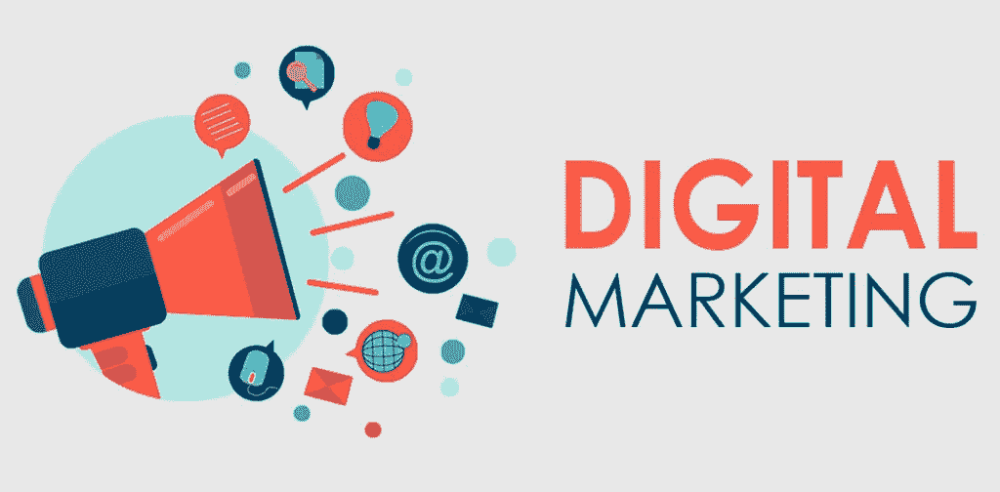
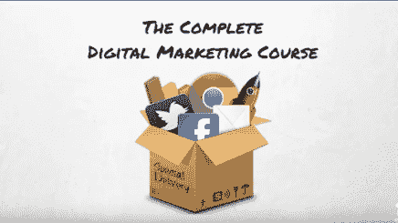
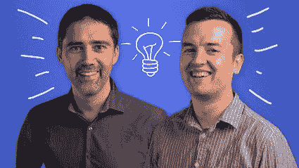

# 2023 年学习数字营销的 5 门最佳在线课程

> 原文：<https://medium.com/javarevisited/5-best-online-courses-to-learn-digital-marketing-in-depth-f43a5584f047?source=collection_archive---------0----------------------->

## 2023 年想学数字营销？以下是深入学习数字营销的最佳在线课程

大家好，如果你想在 2023 年学习数字营销，并寻找最好的数字学习资源，如在线课程，那么你来对地方了。早些时候，我已经分享了 [*最佳 Twitter 课程*](/javarevisited/7-best-courses-to-build-your-twitter-audience-grow-following-and-engagement-6561812869b4) ，在这篇文章中，我将分享 2023 年最佳数字营销在线课程。

数字营销可能是一个宽泛和误导的术语。它主要用于指通过搜索引擎、社交媒体、网站、移动应用和电子邮件等数字渠道做的广告。如今，公司越来越多地转向在线媒体来宣传他们的产品、服务和品牌。

这是因为消费者也越来越多地在购买任何东西之前转向数字手段来研究产品。数字营销的现代世界是由大量的渠道组成的，专业的数字营销人员通过这些渠道来推广他们的品牌和产品。但是数字营销人员也需要研究和发现独特的创新策略来增加参与度。

在数字营销中，参与一词意味着与潜在客户和回头客建立有意义的关系。

随着消费者可以使用越来越智能的可穿戴设备，数字营销的前景只会越来越好。著名的《福布斯》杂志曾预言，电子邮件营销将变得更加个性化，视频内容将为搜索引擎优化而细化，社交媒体将变得越来越对话化。

# 2023 年 5 门最佳新手数字营销课程

我们已经为你做了艰苦的工作，并编制了一份学习数字营销的 5 门最佳课程的清单。我毫不怀疑这些课程会在几周内将你从一个完全的初学者转变为数字营销专家。

## 1.[完整的数字营销课程——1 门课程 12 门](https://click.linksynergy.com/deeplink?id=JVFxdTr9V80&mid=39197&murl=https%3A%2F%2Fwww.udemy.com%2Fcourse%2Flearn-digital-marketing-course%2F)【Udemy】

这是一门非常棒的课程，将帮助你掌握数字营销策略、社交媒体营销、SEO、YouTube、脸书营销、电子邮件和分析。这是一门庞大的课程，一旦你购买了它，你将终身获得超过 22 小时的点播视频讲座、35 篇文章和 10 种可下载的教育资源。

**课程持续时间；23 小时**

**课程评分:4.5 星(满分 5 分)**

**课程讲师:罗布·帕西瓦尔**

**课程价格:56 美元**

学完这门课程后，你将能够作为代销商赚钱，并从零开始发展网上业务。你也可以在家工作，成为一名自由营销人员，或者被聘为数字营销专家。机会是无穷无尽的。

**这是加入本课程的链接**——[完整的数字营销课程](https://click.linksynergy.com/deeplink?id=JVFxdTr9V80&mid=39197&murl=https%3A%2F%2Fwww.udemy.com%2Fcourse%2Flearn-digital-marketing-course%2F)

## 4.[内容营销战略](https://coursera.pxf.io/c/1193463/1164545/14726?u=https%3A%2F%2Fwww.coursera.org%2Flearn%2Fcontent-marketing)【Coursera】

这是 Coursera 平台上最受欢迎的课程之一。在本课程中，您将了解不同种类的数字营销策略，这些策略可用于以盈利的方式赢得和留住客户。您还将获得开发和实施成功的内容营销策略的技能。

本课程还将帮助你分析和衡量内容营销策略的有效性。这门课程的讲师是 Sonia Simone，她是 Rainmaker Digital LLC 的首席内容官。

**课程时长:19 小时**

**课程评分:4.5 星(满分 5 分)**

**课程讲师:索尼娅·西蒙妮**

**课程价格:50 美元**

**这是加入本课程** — [内容营销战略](https://coursera.pxf.io/c/1193463/1164545/14726?u=https%3A%2F%2Fwww.coursera.org%2Flearn%2Fcontent-marketing)的链接

顺便说一句，如果你计划参加多个 Coursera 课程或专业，那么考虑参加 [**Coursera Plus 订阅**](https://coursera.pxf.io/c/3294490/1164545/14726?u=https%3A%2F%2Fwww.coursera.org%2Fcourseraplus) ，它可以让你无限制地访问他们最受欢迎的课程、专业、专业证书和指导项目。它每年花费大约 399 美元，但很值得，因为你可以访问 7000 多门课程和项目，还可以获得无限的证书。

<https://coursera.pxf.io/c/3294490/1164545/14726?u=https%3A%2F%2Fwww.coursera.org%2Fcourseraplus>  

## 3.[数字营销基础](https://linkedin-learning.pxf.io/c/1193463/449670/8005?u=https%3A%2F%2Fwww.linkedin.com%2Flearning%2Fdigital-marketing-foundations)【领英学习】

本课程将是一次宝贵的经历，帮助你跟上快速发展的数字营销领域。你还将学习必要的技能，这样你就可以避开噪音，与潜在客户接触。

你将从学习网上营销的组成部分开始这门课程。您还将学习如何确定您的目标市场，定义您的价值主张，并建立您的目标。本课程还涵盖了客户如何评价一家公司的整体在线形象。您还将学习如何优化您的网站，并了解付费广告的价值。

**课程时长:3 小时**

**球场评分:4.8 星(满分 5 分)**

**课程导师:布拉德·贝特索尔**

**课程价格:年费每月 29 美元**

这是参加本课程的链接。[数字营销基础](https://linkedin-learning.pxf.io/c/1193463/449670/8005?u=https%3A%2F%2Fwww.linkedin.com%2Flearning%2Fdigital-marketing-foundations)

顺便说一下，你需要一个 LinkedIn Learning 会员才能观看这个课程，费用大约为每月*29.99 美元*，但你也可以通过参加他们的 [**1 个月免费试用**](http://linkedin-learning.pxf.io/c/1193463/449670/8005?u=https%3A%2F%2Fwww.linkedin.com%2Flearning%2Fsubscription%2Fproducts) 来免费观看这个课程，这是一个探索他们 17000 多门最新技术在线课程的好方法。

  

## 4.[数字营销基础](https://www.awin1.com/cread.php?awinmid=6798&awinaffid=631878&clickref=&p=%5B%5Bhttps%3A%2F%2Fwww.edx.org%2Fcourse%2Ffundamentals-of-digital-marketing)【edX】

顾名思义，你可以通过本课程了解数字营销的不同方面，如移动营销、全渠道营销和归因。您将能够成功地为您组织的数字营销战略创建一个营销模型。

**课程时长:4 周**

**课程评分:5 颗星中的 4.5 颗星**

**课程导师:PK Kannan 和张玲玲**

课程价格:550 美元

你还将获得对数字经济如何运作的宝贵理解，这将使你在电子商务、社交和数字营销方面取得成功。

以下是参加本课程的链接— [数字营销基础](https://www.awin1.com/cread.php?awinmid=6798&awinaffid=631878&clickref=&p=%5B%5Bhttps%3A%2F%2Fwww.edx.org%2Fcourse%2Ffundamentals-of-digital-marketing)

## 5.[数字营销大师班——1 门课程共 23 门营销课程](https://click.linksynergy.com/deeplink?id=JVFxdTr9V80&mid=39197&murl=https%3A%2F%2Fwww.udemy.com%2Fcourse%2Fdigital-marketing-masterclass%2F)

这是一门真正精彩的课程，它将教你如何使用几十种已经在现实世界中被使用和证明的数字营销策略。一旦您购买了本课程，您将终身获得超过 34 小时的点播视频讲座、18 篇文章和 25 种可下载的教育资源。

通过本课程，您将学习使用所有流行的社交媒体平台进行社交媒体营销。你将能够以有机的方式在网上发展你的业务。

**课程时长:35 小时**

**球场评分:4.5 星(满分 5 分)**

**课程讲师:菲尔·埃比纳**

**课程价格:$56**

以下是加入本课程的链接— [数字营销大师班](https://click.linksynergy.com/deeplink?id=JVFxdTr9V80&mid=39197&murl=https%3A%2F%2Fwww.udemy.com%2Fcourse%2Fdigital-marketing-masterclass%2F)

# 数字营销常见问题

**1。到底什么是数字营销？**

数字营销一词主要用于指通过搜索引擎、社交媒体、网站、移动应用和电子邮件等数字渠道做的广告。

**2。你是做数字营销的？**

数字营销的现代世界是由大量的渠道组成的，专业的数字营销人员通过这些渠道来推广他们的品牌和产品。但是数字营销人员也需要研究和发现独特的创新策略来增加参与度。在数字营销中，参与一词意味着与潜在客户和回头客建立有意义的关系。

**3。该不该学数字营销？**

随着消费者可以使用越来越智能的可穿戴设备，数字营销的前景只会越来越好。著名的《福布斯》杂志曾预言，电子邮件营销将变得更加个性化，视频内容将为搜索引擎优化而细化，社交媒体将变得越来越对话化。

## 结论

正如你所看到的，我已经遵守了我的承诺，为你提供了一份学习数字营销的 5 门最佳课程的清单。现在轮到你了。你唯一需要做的就是选择一门课程并开始学习。那你还在等什么？

如果你喜欢这份学习数字营销的 5 门最佳课程清单，请随意与你的朋友和家人分享。如果您有任何疑问或问题，您也可以发表评论，我们会立即回复您。

您可能喜欢的其他**数字营销和软技能资源**

*   [学习公众演讲的 5 门最佳课程](https://javarevisited.blogspot.com/2021/12/5-best-courses-to-learn-public-speaking.html)
*   [学习成长黑客的 5 门最佳课程](https://javarevisited.blogspot.com/2021/12/5-best-courses-to-learn-growth-hacking.html)
*   [2023 年学习管理技能的 5 门最佳课程](https://javarevisited.blogspot.com/2021/12/best-courses-to-learn-management-skills.html)
*   [5 个可操作的 Twitter 课程来建立你的受众](https://javarevisited.blogspot.com/2021/05/best-twitter-marketing-courses-for.html)
*   [2023 年学习商业战略的 5 门最佳课程](https://javarevisited.blogspot.com/2021/12/5-best-courses-to-learn-business.html)
*   [程序员和开发人员的 10 个最佳 Git 想法](https://javarevisited.blogspot.com/2017/12/10-gift-ideas-for-programmers-software.html)
*   [2023 年学习 Instagram 营销我最喜欢的课程](https://javarevisited.blogspot.com/2021/12/5-best-online-courses-for-instagram.html)
*   [5 门免费的个人发展课程](https://www.java67.com/2021/02/5-free-personal-development-and-leadership-courses-for-programmers.html)
*   [开发人员学习电子邮件写作的 5 门最佳课程](https://javarevisited.blogspot.com/2018/02/top-5-professional-email-writing-courses-for-programmers.html)

**附言——**如果你热衷于从数字营销开始，那么 Instagram 营销是建立你的受众的好方法，如果你需要免费课程，那么你也可以在 Udemy 上查看 [**完整的 Instagram 营销大师班:成为专业的**](https://click.linksynergy.com/deeplink?id=CuIbQrBnhiw&mid=39197&murl=https%3A%2F%2Fwww.udemy.com%2Fcourse%2Finstagram-marketing-3-tip-get-real-instagram-followers-course-learn%2F) 课程。这个 1.5 小时的课程是完全免费的，已经有超过 30，000 名学生加入了这个课程。

<https://javarevisited.blogspot.com/2021/12/5-best-courses-to-learn-facebook.html> 