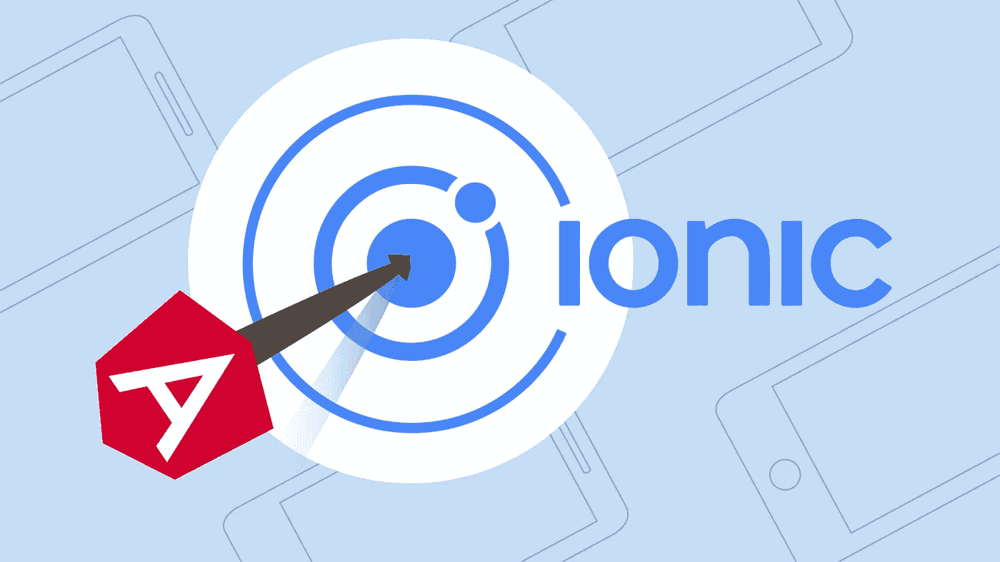
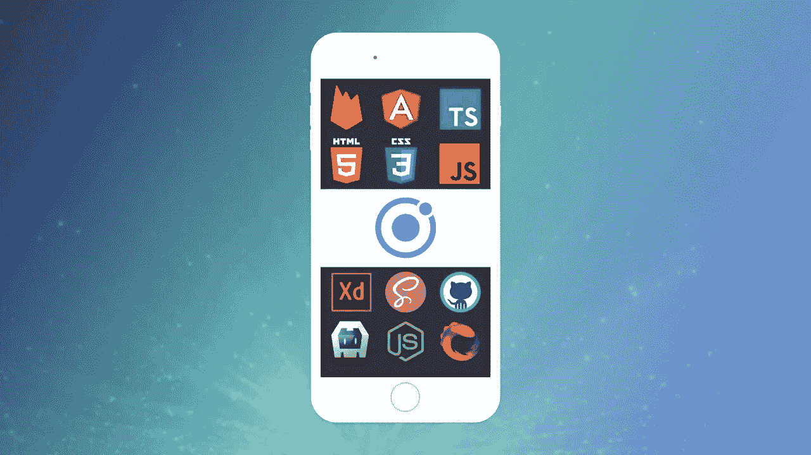

# 2023 年学习 Ionic 应用开发的 5 门最佳在线课程

> 原文：<https://medium.com/javarevisited/5-best-online-courses-to-learn-ionic-for-app-development-8f6a2e552b2c?source=collection_archive---------1----------------------->

## 想学习使用 Ionic 进行跨平台 app 开发？以下是 2023 年学习爱奥尼亚最好的在线课程

大家好，如果你想在 2023 年学习 Ionic for app developent，并寻找最好的在线课程，那么你来对地方了。之前，我已经分享了 [**最佳颤振课程**](/javarevisited/my-favorite-flutter-and-dart-programming-courses-for-beginners-9e8355710d78) 以及 [**最佳反应本土课程**](/javarevisited/my-favorite-free-react-native-courses-for-beginners-in-2020-4629f5274eb6) 在这篇文章中，我将分享最佳在线课程以深入学习 Ionic。

但是，在我们看到这些资源之前，首先要了解什么是离子以及它如何帮助你？

Ionic 是一个跨平台、开源的 UI 工具包，用于构建移动应用、桌面应用和 web 应用。这是一个非常强大的框架，因为它允许开发人员只构建一次，然后在任何地方使用它。

爱奥尼亚是由马克斯·林奇、本·斯佩里和亚当·布拉德利创造的。Ionic 框架的首个测试版于 2014 年发布。

Ionic 框架可以用来增强前端体验和 UI 交互。它还可以与 Angular 和 Cordova 等其他库和框架很好地协作。

Ionic framework 的主要优势之一是它是免费和开源的。这意味着你可以用它来为 iOS、Android 和其他使用相同代码库的操作系统构建基于移动设备的应用。

使用 Ionic 框架，您可以构建混合移动应用程序。Ionic 具有高效的性能和很少的 DOM 操作。Ionic 由 Drifty Co .于 2013 年推出，第一个 alpha 版本于 2014 年发布。从那以后，Ionic 框架有了不同的迭代，比如 Ionic 1 和 Ionic 2。

最新版本是 Ionic 5，2020 年 2 月发布。Ionic 5 的主要重点是通过改变材料设计来改善用户界面。它还具有多框架兼容性，这意味着您可以创建定制的动画和其他组件。还有 UI 设计组件的大规模设计升级。

程序员应该使用 Ionic 框架在一个可以在多种设备和操作系统上运行的应用程序中创建本地功能。这使得应用程序的开发速度更快，成本效益更高，并大大减少了维护所需的时间。

Ionic 框架的一个主要优点是易于学习。具有 CSS、HTML 或 JavaScript 基础知识的开发人员会发现 Ionic 框架非常简单和直观。

Ionic 提供的官方文档也非常好，结构良好。Ionic 应用程序可以部署在 iOS、Android 或桌面上，只有一个代码库。由于 Ionic 框架建立在 AngularJS 之上，它为开发者提供了许多功能。

# 2023 年初学者学习爱奥尼亚的 5 门最佳课程

我们列出了一些顶级课程，你可以用它们来掌握 Ionic 框架，并创建高度可定制的高性能应用。

## 1.[Ionic——用 Ionic 和 Angular 构建 iOS、Android 和 Web 应用](https://click.linksynergy.com/deeplink?id=CuIbQrBnhiw&mid=39197&murl=https%3A%2F%2Fwww.udemy.com%2Fcourse%2Fionic-2-the-practical-guide-to-building-ios-android-apps%2F)

本课程将使学生能够利用 Ionic 和 Angular 的强大功能，为 iOS 和 Android 构建原生应用。将向学生介绍 Ionic 的核心和高级功能。

这门课程的培训师是 Maximilian Schwarzüller，他是一名专业的网页开发人员，也是 Udemy 平台上最受欢迎的讲师之一。

本课程要求学生熟悉 Angular 的基础知识，尽管会提供复习课程。学生还应该具备 HTML、CSS 和 JavaScript 的基础知识。

**课程时长:20 小时
评分:4.7 星(满分 5 分)**

学生将了解 Ionic 的基础知识及其丰富的组件库，以及如何获取和存储用户输入。学生将了解 Ionic 2 的高级功能，并使用它来优化他们的应用程序。在本课程中，学生将构建 4 个完整的应用程序。本课程有一个关于离子 3 和离子原生 3 的特殊部分

**这是加入本课程的链接**—[Ionic——构建 iOS、Android 和 Web 应用](https://click.linksynergy.com/deeplink?id=CuIbQrBnhiw&mid=39197&murl=https%3A%2F%2Fwww.udemy.com%2Fcourse%2Fionic-2-the-practical-guide-to-building-ios-android-apps%2F)

## 2. [Ionic 4.0 基础培训](https://linkedin-learning.pxf.io/c/1193463/449670/8005?u=https%3A%2F%2Fwww.linkedin.com%2Flearning%2Fionic-4-0-essential-training)【LinkedIn 学习】

这是网上最好的课程之一，可以帮助你全面理解 Ionic 框架。培训由爱奥尼亚的专家指导，即使是完全的初学者也可以通过本课程开始学习爱奥尼亚。

学生将学习如何使用 Ionic 开发高性能应用。这些应用将兼容所有流行的移动和桌面操作系统。
这门课的培训师是萨尼·优素福，他是一名软件工程师、演说家、培训师、出版作家。他将向学习者介绍 Ionic 4.0 的高级功能。

**课程时长:5 小时
评分:4.5 星(满分 5 分)**

学生将获得许多作业和项目来帮助他们的学习。完成本课程后，学生可以获得可共享的证书。课程内容在注册后的前 30 天是免费的。

**以下是参加本课程的链接** — [Ionic 4.0 基础培训](https://linkedin-learning.pxf.io/c/1193463/449670/8005?u=https%3A%2F%2Fwww.linkedin.com%2Flearning%2Fionic-4-0-essential-training)

顺便说一句，你需要 LinkedIn Learning 会员才能观看这门课程，每月费用约为 49.99 美元，但你也可以通过参加他们的 [**1 个月免费试用**](http://linkedin-learning.pxf.io/c/1193463/449670/8005?u=https%3A%2F%2Fwww.linkedin.com%2Flearning%2Fsubscription%2Fproducts) 来免费观看这门课程，这是探索他们 17000 多门最新技术在线课程的好方法。

 [## LinkedIn Learning 免费试用和订阅价格

### 从初级到高级的 20，000 多门由专家指导的个性化优质内容课程。基于社区的…

linkedin-learning.pxf.io](http://linkedin-learning.pxf.io/c/1193463/449670/8005?u=https%3A%2F%2Fwww.linkedin.com%2Flearning%2Fsubscription%2Fproducts) 

## 3.[集成了 Ionic Native 和 Cordova 的 Master Ionic 3](https://click.linksynergy.com/deeplink?id=CuIbQrBnhiw&mid=39197&murl=https%3A%2F%2Fwww.udemy.com%2Fcourse%2Fmaster-ionic-3-with-ionic-native-and-cordova-integrations%2F)

本课程将帮助学生通过推送通知、摄像头访问、指纹等功能革新他们的应用。学生将能够将几种本机设备特性集成到他们的离子应用中。该课程分为 35 节课，可以在很短的时间内完成。

该课程由保罗·哈利迪(Paul Halliday)主讲，他是一名科技企业家，擅长跨平台移动开发。他还拥有桑德兰大学的计算机科学荣誉理学士学位。本课程只需要对离子框架有一个基本的了解。学生可以将本机设备 API 集成到他们的 Ionic 应用中。

本课程使用最新的 ES6/7 语法设计。

课程时长:3.5 小时
评分:2.8 星(满分 5 分)

**以下是加入本课程的链接** — [掌握 Ionic 3 与 Ionic Native](https://click.linksynergy.com/deeplink?id=CuIbQrBnhiw&mid=39197&murl=https%3A%2F%2Fwww.udemy.com%2Fcourse%2Fmaster-ionic-3-with-ionic-native-and-cordova-integrations%2F)

## 4.面向 WooCommerce 的 Ionic 3 应用:构建一个电子商务移动应用

本课程将使学生能够使用 Ionic Framework 3 构建一个电子商务应用程序，并使用 HTML、SCSS 和 TypeScript 构建 WooCommerce。将向学生介绍 Ionic 框架的本地组件和功能。

这门课程的创建者是 Samarth Agarwal，他是一名软件开发人员、企业家，也是 Udemy 上最受欢迎的导师之一。
课程结束时，学生将能够构建和部署跨平台混合应用，并在 Play Store 中发布他们的应用。

**课程时长:7 小时
评分:4.8 星(满分 5 分)**

学生还将学习如何将 PayPal 支付网关以及推送通知集成到他们的 Ionic/Cordova 应用程序中。

注册这门课程只需要 HTML、CSS 和 JavaScript 的基础知识。本课程还包括超过 7 小时的点播视频讲座以及其他教育资源。

学生将学习如何将 PayPal 支付网关集成到他们的 Ionic 应用程序中。

以下是加入本课程的链接— [面向 WooCommerce 的 Ionic 3 应用:](https://click.linksynergy.com/deeplink?id=CuIbQrBnhiw&mid=39197&murl=https%3A%2F%2Fwww.udemy.com%2Fcourse%2Fionic-3-apps-for-woocommerce-build-an-ecommerce-mobile-app%2F)

## 5.[使用 Ionic 框架和 AngularJS 构建移动应用](https://pluralsight.pxf.io/c/1193463/424552/7490?u=https%3A%2F%2Fwww.pluralsight.com%2Fcourses%2Fbuilding-mobile-apps-ionic-framework-angularjs)

这是一门实践性很强的课程，将向学生展示如何通过动手实践的方式，使用 Ionic 框架构建移动应用。除了其他 Ionic 框架组件之外，本课程还涵盖了导航和路由等组件。

课程还包括离线功能的数据和缓存，以及提供地图和驾驶方向。本课程的讲师是史蒂夫·米凯洛蒂，他是微软 Azure 全球工程团队的项目经理。

这是一门以代码为中心的课程，将帮助学生尽快上手并运行。这门课的讲师也是该领域的顶尖专家。

**课程时长:3-4 小时
评分:4.5 星(满分 5 分)**

这是加入这个课程的链接。[使用 Ionic 框架和 AngularJS 构建移动应用](https://pluralsight.pxf.io/c/1193463/424552/7490?u=https%3A%2F%2Fwww.pluralsight.com%2Fcourses%2Fbuilding-mobile-apps-ionic-framework-angularjs)

不过，你需要一个 [Pluralsight 会员](https://pluralsight.pxf.io/c/1193463/424552/7490?u=https%3A%2F%2Fwww.pluralsight.com%2Fpricing%2Fskills)才能加入这个课程，费用大约是每月 29 美元或每年 299 美元(14%的折扣)。我向所有程序员强烈推荐这个订阅，因为它提供了超过 7000 个在线课程的即时访问，以学习任何技术技能。或者，你也可以使用他们的 [**10 天免费通行证**](https://pluralsight.pxf.io/c/1193463/424552/7490?u=https%3A%2F%2Fwww.pluralsight.com%2Fpricing%2Ffree-trial) 免费观看这个课程。

 [## Pluralsight |个人免费试用

### 立即开始免费试用 Pluralsight！查看我们为个人和团队提供的服务，如果您不确定…

pluralsight.pxf.io](https://pluralsight.pxf.io/c/1193463/424552/7490?u=https%3A%2F%2Fwww.pluralsight.com%2Fpricing%2Ffree-trial) 

## 结论

学习 Ionic 意味着你只需要有一个代码库就可以在 iOS、Android 和其他操作系统上部署你的应用。如果你有 JavaScript 经验，Ionic 也很容易学。

它还将使您能够在应用程序中使用漂亮的用户界面组件。

Ionic 中有很多有用的插件，比如 Cordova，它就内置在 Ionic 中。Ionic 也是开源的，这意味着你不必支付任何许可费来使用该框架开发应用程序。

所有这些都意味着，作为一名软件开发人员，Ionic 是您工具箱中的必备工具。

您可能想探索的其他**编程资源**

*   [2022 年学习 React Native 的 5 大课程](https://javarevisited.blogspot.com/2018/02/5-react-native-courses-to-learn-mobile-development-using-JavaScript.html#axzz5gYSQ4RjO)
*   [面向 Java 开发人员的 5 大 Android 在线培训课程](https://javarevisited.blogspot.com/2017/12/top-5-android-online-training-courses-for-Java-developers.html)
*   [学习 iOS 应用开发的五大课程](https://javarevisited.blogspot.com/2019/01/top-5-ios-developer-course-to-learn-ios.html)
*   [10 门针对初学者的免费 React 本地课程](/javarevisited/my-favorite-free-react-native-courses-for-beginners-in-2020-4629f5274eb6)
*   [2023 年学习微服务开发的 5 门课程](https://javarevisited.blogspot.sg/2018/02/top-5-spring-microservices-courses-with-spring-boot-and-spring-cloud.html)
*   [程序员 10 门 DevOps 课程](https://javarevisited.blogspot.com/2018/09/10-devops-courses-for-experienced-java-developers.html)
*   [2023 年从零开始学习 Java 的 5 门课程](http://www.java67.com/2018/02/5-online-courses-to-learn-java-9-better.html)
*   [2023 年 5 门免费课程学习 Angular](http://www.java67.com/2018/01/top-5-free-angular-js-online-courses-for-web-developers.html)
*   [2023 年 5 门机器学习和数据科学课程](http://javarevisited.blogspot.sg/2018/03/top-5-data-science-and-machine-learning-online-courses-to-learn-online.html)
*   [学习大数据、Hadoop 和 Spark 的 5 门免费课程](http://www.java67.com/2018/05/top-5-free-big-data-courses-to-learn-Hadoop-Apache-Spark.html)
*   [2023 年网络开发者路线图](https://hackernoon.com/the-2019-web-developer-roadmap-ab89ac3c380e)
*   [深入了解区块链的五大免费课程](http://www.java67.com/2018/02/5-free-blockchain-technology-courses.html)
*   [7 门深入学习 Nodejs 的免费课程](/javarevisited/7-free-courses-to-learn-node-js-in-2020-2f1dd6722b49)
*   [面向开发者的 10 门免费 Docker 课程](https://hackernoon.com/10-free-courses-to-learn-docker-for-programmers-and-devops-engineers-7ff2781fd6e0)
*   [2023 年手机开发者可以学习的 10 项技能](https://javarevisited.blogspot.com/2020/01/10-things-mobile-app-developers-can-learn.html)

感谢您阅读本文。如果你喜欢这五大离子课程，请与你的朋友和家人分享。如果您有任何疑问或反馈，也可以在评论区留言。

如果你想学习 Flutter，另一个流行的构建移动应用的框架，并寻找一个全面的在线培训课程，那么我也推荐你去看看 Udemy 上最好的讲师之一，AcadMind 的 Maximilian Scwarzmuller 的[**Flutter&Dart-完整指南【2022 版】**](https://click.linksynergy.com/deeplink?id=JVFxdTr9V80&mid=39197&murl=https%3A%2F%2Fwww.udemy.com%2Fcourse%2Flearn-flutter-dart-to-build-ios-android-apps%2F) 课程。

 [## 2023 年面向初学者的前 5 名飞镖和飞镖在线课程-最佳

### 一个关于 Java，编程，算法，数据结构，SQL，Linux，数据库，面试问题，以及我个人…

javarevisited.blogspot.com](https://javarevisited.blogspot.com/2020/01/top-5-courses-to-learn-dart-programming.html)