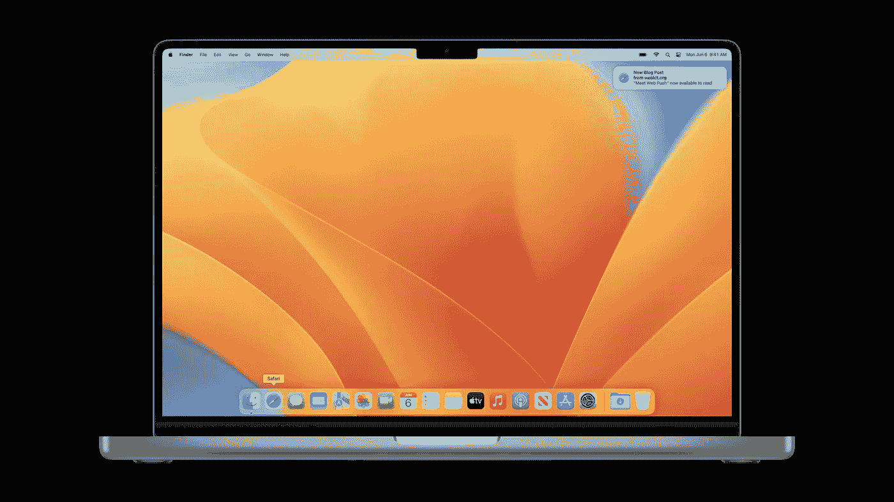

# 深入学习 Mac OS 的 5 门最佳在线课程

> 原文：<https://medium.com/javarevisited/5-best-online-courses-to-learn-mac-os-in-depth-2763dd39b156?source=collection_archive---------2----------------------->

## 想深入学习 Mac OS？以下是 2023 年你可以加入学习 Mac OS 的最佳在线课程。

你好，伙计们，如果你正在使用 Mac OS，但觉得你不太了解 Mac OS 是如何工作的，或者因为你来自 Windows 并且不知道 Mac 快捷方式而难以有效地使用 Mac OS，那么你来对地方了。早些时候，我已经分享了学习 Linux 的最佳在线课程</javarevisited/7-best-linux-courses-for-developers-cloud-engineers-and-devops-in-2021-7415314087e1>**，在这篇文章中我将分享 2023 年学习 Mac OS 的最佳在线课程。**

**我很确定你们大多数人不需要 macOS 的介绍。但我会告诉你只是为了它。macOS 是苹果公司设计的操作系统，用于其所有设备，如 MacBook、MacBook Air、MacBook Pro、iMac 和 Mac Pro。**

**这个操作系统管理你所有的文件并运行你的应用。最新版本的 macOS 是 macOS Monterey，发布于 2021 年 10 月。**

**它是 Mac 操作系统的第 18 个版本，以加州中部海岸命名。macOS 是第一个引入图形用户界面的操作系统，为其他流行的操作系统如 Windows 铺平了道路。**

**macOS 的第一个版本发布于 1984 年，从那时起，它已经被修改以提供更好的功能和服务。它被设计成只能在苹果公司生产的个人电脑上运行，不支持 x86 架构。**

**所有苹果麦金塔电脑都预装了 macOS，允许你做很多事情，比如查看电子邮件、浏览互联网、编辑照片、玩游戏和听音乐。**

# **2023 年新手学习的 5 门最佳 macOS 在线课程**

**在这里，我们整理了一份网上 5 大 macOS 课程的列表。看看下面的列表。**

## **1. [macOS X 超级用户——像专业人士一样使用 MAC OS X——2023](https://click.linksynergy.com/deeplink?id=JVFxdTr9V80&mid=39197&murl=https%3A%2F%2Fwww.udemy.com%2Fcourse%2Fhow-to-use-mac-os-x%2F)【Udemy】**

**本课程将教你如何像专业人士一样使用 macOS，并自动完成所有常见任务，让你的生活更加轻松。通过这个课程，你会知道 macOS 上所有常用的快捷方式。**

**你将了解如何根据你的需要修改操作系统，并大量减少使用电脑的时间。**

****课程时长:1 小时****

****课程评分:4.8 星(满分 5 分)****

****课程讲师:格兰特·克利梅蒂斯****

****课程价格:$26****

**购买本课程后，您将终身获得 1 小时的点播视频讲座。**

****这是加入本课程的链接**——[MAC OS X 超级用户——像专业人士一样使用 MAC OS X](https://click.linksynergy.com/deeplink?id=JVFxdTr9V80&mid=39197&murl=https%3A%2F%2Fwww.udemy.com%2Fcourse%2Fhow-to-use-mac-os-x%2F)**

****

## **2. [macOS Monterey 基础培训](https://linkedin-learning.pxf.io/c/1193463/449670/8005?u=https%3A%2F%2Fwww.linkedin.com%2Flearning%2Fmacos-monterey-essential-training)【领英学习】**

**这门课程将教你所有你需要知道的苹果最新操作系统的来龙去脉。您将从基础知识开始，比如设置新电脑、iCloud 和 AppleID，以及配置“系统偏好设置”和用户帐户。**

**您还将学习如何连接附件、使用键盘快捷键以及将电脑连接到互联网。通过他的课程，你还将学习如何组织你的桌面上的项目和定制你的桌面壁纸。**

****课程时长:4 小时****

****课程评分:4.5 星(满分 5 分)****

****课程讲师:尼克·布拉齐****

****课程价格:年费每月 12 美元****

**本课程还将带您了解启动、更新和管理应用程序的所有方法。**

****以下是参加本课程的链接—** [macOS Monterey 基础培训](https://linkedin-learning.pxf.io/c/1193463/449670/8005?u=https%3A%2F%2Fwww.linkedin.com%2Flearning%2Fmacos-monterey-essential-training)**

****

**顺便说一下，你需要一个 LinkedIn Learning 会员才能观看这个课程，这个课程每月花费大约 29.99 美元，但是你也可以通过参加他们的 [**1 个月免费试用**](http://linkedin-learning.pxf.io/c/1193463/449670/8005?u=https%3A%2F%2Fwww.linkedin.com%2Flearning%2Fsubscription%2Fproducts) 来免费观看这个课程，这是一个探索他们 17000 多门最新技术在线课程的好方法。**

 **** 

## **3.[Master you Mac 2023—Mac OS Monterey—完整课程](https://click.linksynergy.com/deeplink?id=CuIbQrBnhiw&mid=39197&murl=https%3A%2F%2Fwww.udemy.com%2Fcourse%2Fmaster-your-mac-2022-macos-monterey-the-complete-course%2F)**

**在本课程中，您将发现使用 macOS Monterey 工作的所有新方式。你将开始学习如何以最有效的方式执行所有的基本任务，以及如何组织所有的文件和文件夹。**

**然后，将向您介绍最常见的 Mac 应用程序，如 Safari、TextEdit、Notes 和 QuickTime。**

****课程时长:7 小时****

****球场评分:4.4 星(满分 5 分)****

****课程导师:卢克·库贝克****

****课程价格:$26****

**您还将学习如何定制操作系统来满足您的需求和偏好。您还将了解 Mac 上可用的隐私和安全选项。**

****以下是参加本课程的链接** — [掌握你的 Mac 2023 — macOS Monterey —完整课程](https://click.linksynergy.com/deeplink?id=CuIbQrBnhiw&mid=39197&murl=https%3A%2F%2Fwww.udemy.com%2Fcourse%2Fmaster-your-mac-2022-macos-monterey-the-complete-course%2F)**

****

## **4. [macOS Big Sur 基础培训](https://linkedin-learning.pxf.io/c/1193463/449670/8005?u=https%3A%2F%2Fwww.linkedin.com%2Flearning%2Fmacos-big-sur-essential-training-2)【LinkedIn 学习】**

**本课程将帮助您开始使用苹果公司的操作系统 macOS Big Sur。您将全面了解使用 Mac 电脑需要了解的所有基本概念。**

**您将从学习如何设置和配置 Mac 开始。然后，你将学习如何使用 Finder，这是一个浏览文件和文件夹的工具。**

****课程时长:4 小时****

****课程评分:4.7 星(满分 5 分)****

****课程讲师:尼克·布拉齐****

**课程价格:年费每月 12 美元**

**你还将学习如何整理你的桌面和保持一个干净的工作空间。**

****以下是参加本课程的链接—** [macOS Big Sur 基础培训](https://linkedin-learning.pxf.io/c/1193463/449670/8005?u=https%3A%2F%2Fwww.linkedin.com%2Flearning%2Fmacos-big-sur-essential-training-2)**

****

## **5.蒙特雷马科斯的指南**

**在本课程中，您将从学习使用苹果公司最新操作系统 macOS Monterey 的所有基础知识开始。您将获得所有 Mac 应用程序的概述，如提醒事项、备忘录和日历。您还将学习如何使用 Finder 来整理文件和文件夹。**

****课程持续时间；8 小时****

****课程评分:4.7 星(满分 5 分)****

****课程讲师:Gary Rosenzweig****

**课程价格:52 美元**

**还有一个重点是新的 macOS 功能，如聚焦，隐藏我的电子邮件和快捷方式。课程还会教你如何使用 Safari 和 Mail。还有一个额外的部分，介绍了您可以用来充分利用 Mac 的所有提示和技巧。**

****这是参加本课程的链接**——[MAC OS Monterey 指南](https://click.linksynergy.com/deeplink?id=CuIbQrBnhiw&mid=39197&murl=https%3A%2F%2Fwww.udemy.com%2Fcourse%2Fmacmonterey%2F)【Udemy】**

****

# **MacOS 常见问题**

**现在，让我们来回答几个关于 Mac OS 的常见问题**

****1。macOS 的目的是什么？****

**所有苹果麦金塔电脑都预装了 macOS，允许你做很多事情，比如查看电子邮件、浏览互联网、编辑照片、玩游戏和听音乐。**

****2。macOS 和 MacBook 一样吗？****

**macOS 是苹果公司生产的 MacBook 和所有其他个人电脑的操作系统。这个操作系统管理你所有的文件并运行你的应用。最新版本的 macOS 是 macOS Monterey，发布于 2021 年 10 月。**

****3。macOS 和 iOS 是一样的吗？****

**iOS 被设计成可以在 iPhone 和 iPad 上运行，而 macOS 可以在苹果生产的电脑上运行。**

**这就是 2023 年深入学习 mac OS 的最佳在线课程。这些是迄今为止你可以用来从苹果公司学习更多操作系统的最佳课程。您将能够使用这些课程来充分利用您的 Mac 电脑。我毫不怀疑这些课程会在几周内让你成为 macOS 专家。**

**如果你喜欢这 5 大 macOS 课程列表，请随意与你的朋友和家人分享。如果您有任何疑问或问题，您也可以发表评论，我们会立即回复您。**