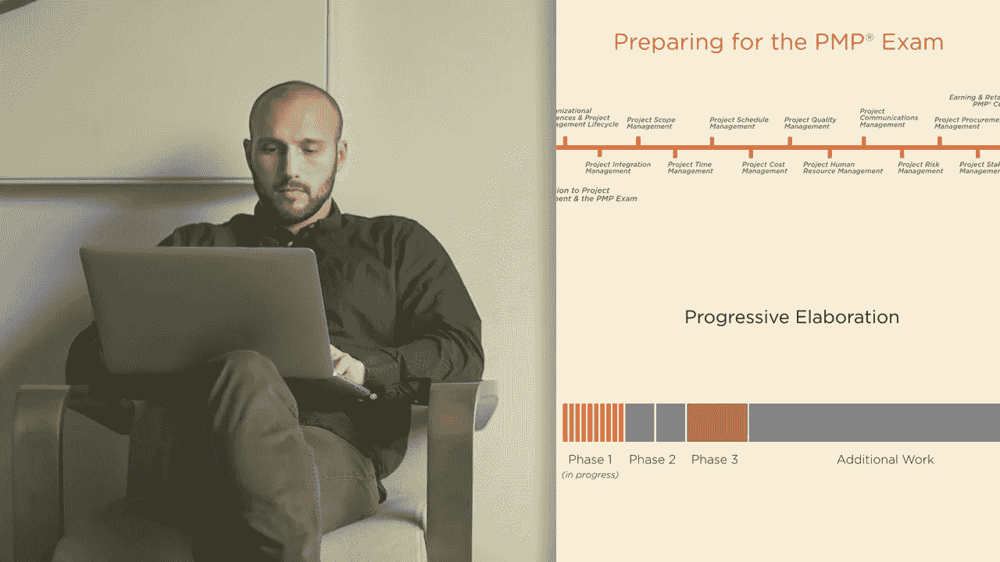
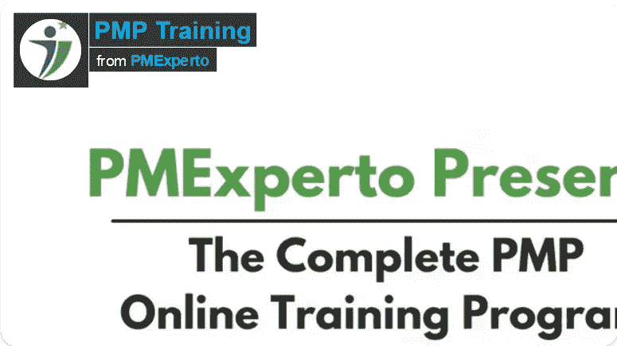
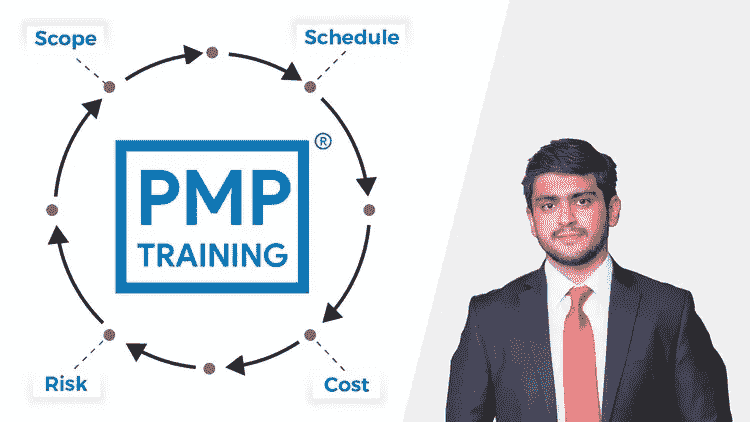
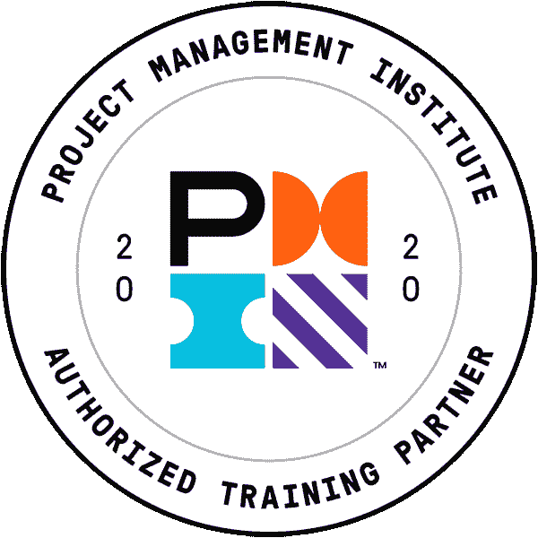
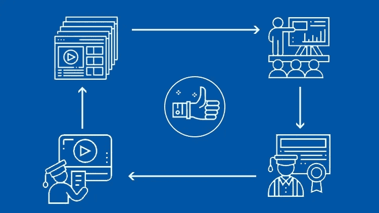
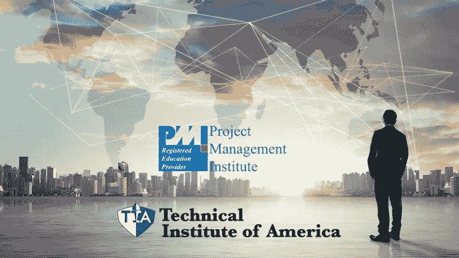
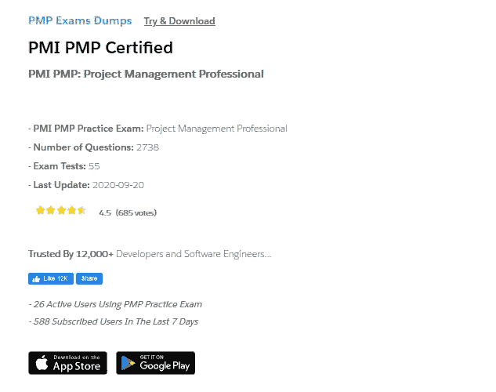
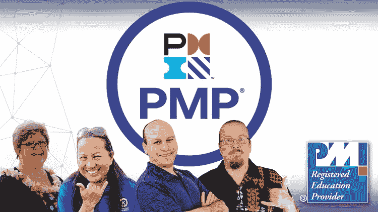

# 10 门最佳项目管理(PMP)认证课程和实践测试，帮助您在 2023 年通过考试

> 原文：<https://medium.com/javarevisited/5-best-pmp-certification-courses-and-practice-tests-to-become-a-project-management-professional-in-8c0e7c574995?source=collection_archive---------0----------------------->

## 这些是通过 2023 年 PMP 认证的最佳在线培训课程、练习题和考试转储

image_credit — Pluralsight

大家好，如果你在项目管理和人员管理领域，那么你可能听说过 **PMP 认证**，这是最著名和最受欢迎的 [IT 认证](https://javarevisited.blogspot.com/2019/12/top-10-it-certifications-for-java-programmers.html)之一，面向项目经理和有志成为项目经理的人。

PMP 是**项目管理专业人员**的简称，由项目管理协会(PMI)提供。正如我所说，这是项目管理专业人士最著名的认证之一。

全球对项目经理有巨大的需求。一些领先的和最好的公司雇佣认证项目经理来管理他们的项目。根据 PMI 报告，每年有超过 200 万个项目管理角色需要填补。如果你想成为[项目经理](https://javarevisited.blogspot.com/2018/10/top-5-carrer-options-for-experienced-java-programmers.html)，这个认证不仅可以提升你的资历，还可以帮助你获得晋升，找到一份更好的高薪项目经理工作。

项目管理专业人员(PMP)认证是全球公认的对 IT 和许多其他行业的专业人员最有价值的认证之一。它也被认为是项目管理领域的黄金标准认证。

你可能在想*为什么 PMP 认证如此受推崇？嗯，因为不是每个人都有资格参加 PMP 认证考试。你需要有一定的项目管理经验，才能连本带利的申请这个认证，忘记考试及格，获得证书。

在这篇文章中，我将分享一些*破解 PMP 认证*的最佳课程，它们与 [**PMBOK 指南第六版**](https://www.amazon.com/Project-Management-Knowledge-PMBOK-Sixth/dp/1628251840/?tag=javamysqlanta-20) 和最新的 PMI 标准保持一致。它们还涵盖了项目管理领域的最新最佳实践。*

<https://www.amazon.com/Project-Management-Knowledge-PMBOK-Sixth/dp/1628251840/?tag=javamysqlanta-20>  

# 通过 2023 年 PMP 项目管理认证考试的 10 个最佳在线课程和练习题

以下是通过备受推崇的 PMP 认证考试的一些最佳课程。这些课程涵盖了你需要的所有理论，以及一些练习题。我还确保大多数课程都有资格获得 PMI 的 PMP 认证的 35 小时联系时间。

## 1. [PMP 备考研讨会— PMBOK 指南 6](https://click.linksynergy.com/deeplink?id=JVFxdTr9V80&mid=39197&murl=https%3A%2F%2Fwww.udemy.com%2Fpmp-pmbok6-35-pdus%2F) (Udemy 最佳课程)

这是第一次尝试获得 PMP 认证的最佳课程之一。讲师 Joseph Philips 非常有资格，并撰写了许多关于项目管理和 PMP 认证的书籍，如 CAPM/PMP 项目管理认证综合考试指南。

课程非常全面，提供了您准备 PMP PMI 认证所需的所有细节。不仅如此，你还将从 PMI 注册教育机构获得 35 小时的考试联系时间，这是 PMP 认证的强制性要求。

Joseph Philips 本人是 PMP，ITIL，PMI-ACP，和 Project+ CTT+认证。简而言之，他对自己的东西非常了解，这反映在这门课上。当然，它的质量也是非常棒的，内容非常吸引人，音频清晰，交付也非常棒。

谈到社会证明，已经有超过 91005 名学生注册了这门课程，平均有 29000 名参与者给它打了 4.6 分，这简直太惊人了，充分说明了它的质量。

这也是关于 PMP 认证的 [Udemy 畅销书](https://javarevisited.blogspot.com/2019/08/top-10-udemy-courses-and-certifications-for-programmers.html)之一，如果你想第一次通过 PMP 认证，我强烈建议你参加这个课程。

**以下是参加本课程的链接** — [PMP 备考研讨会— PMBOK 指南 6](https://click.linksynergy.com/deeplink?id=JVFxdTr9V80&mid=39197&murl=https%3A%2F%2Fwww.udemy.com%2Fpmp-pmbok6-35-pdus%2F)

您也可以将本课程与 [PMI PMP:项目管理专业考试转储](https://www.certification-questions.com/practice-exam/pmi/pmp?affiliateCode=fcff36fd-557a-4713-abf6-973e9924770f&utm_source=Javin&utm_medium=affiliate&utm_campaign=affiliate)结合起来，以便更好地准备并在第一次尝试中通过该认证。

## 2.[项目管理介绍和 PMP 考试](https://pluralsight.pxf.io/c/1193463/424552/7490?u=https%3A%2F%2Fwww.pluralsight.com%2Fcourses%2Fpmp-v6-introduction-project-management-pmp-exam) (Pluralsight 最佳课程)

这是我推荐给 PMP 认证申请者的另一门课程。在本课程中，您将了解参加 PMP 认证对您的职业发展是否是正确的选择，参加认证考试必须满足哪些先决条件，对考试本身有什么期望，以及如何编写和提交申请。

之后，您将了解基本的项目管理原则，这些原则可以帮助您更好地理解项目管理与组织的日常管理需求的区别，并了解整个学习过程中将涵盖的内容。

**这是加入本课程** — [项目管理和 PMP](https://pluralsight.pxf.io/c/1193463/424552/7490?u=https%3A%2F%2Fwww.pluralsight.com%2Fcourses%2Fpmp-v6-introduction-project-management-pmp-exam) 的链接

最棒的是，这门课程，以及这条学习道路上的所有其他课程，完全符合最新版本的 PMP 考试的目标和第六版的项目管理知识体系( [**《项目管理知识体系指南》第六版**](https://www.amazon.com/Project-Management-Knowledge-PMBOK-Sixth/dp/1628251840/?tag=javamysqlanta-20) )，这是 PMP 认证的圣杯。

另一个需要注意的要点是，完成本课程和系列中的其他课程将有助于您满足 PMP 考试的强制性培训要求。它还可以用来为那些已经获得认证的人获得继续教育学分。

来自 [Pluralsight](https://javarevisited.blogspot.com/2017/12/top-10-pluralsight-courses-java-and-web-developers.html) ，所以很有可能你已经有了会员资格，但是如果没有，那就去办一个吧，这是完全值得的，因为学习对于程序员和 It 专业人员来说是必不可少的。或者，你也可以使用他们的 [**10 天免费旅行**](https://pluralsight.pxf.io/c/1193463/424552/7490?u=https%3A%2F%2Fwww.pluralsight.com%2Flearn) 来免费观看这个课程。

<https://pluralsight.pxf.io/c/1193463/424552/7490?u=https%3A%2F%2Fwww.pluralsight.com%2Flearn>  

## 3. [PMP 35 小时在线培训，由 PMExprto 提供](https://academy.pmexperto.com/courses/5083-pmp-35-contact-hours-online-training?affcode=qtphgxvt)

这是另一个高水平的 PMP 培训计划，你可以参加，为 2023 年的项目管理专业考试做准备。本次 PMP 在线培训旨在首次尝试破解 PMP 认证。

它还包括一个强制性的 35 PDUs 接触小时培训证书，以申请 PMP 考试。这个 PMP 培训课程最好的一点是，它融入了 PMI 在 2021 年推出的最新变化。

它也符合 PMBOK 指南和敏捷实践指南。它提供了 PMBOK 指南中规定的 10 个知识领域和 5 个过程组的详细而深入的知识。

这不仅有助于你准备 PMP 考试，也有助于你成为一名更好的项目经理。通过参加这个 PMP 培训项目，坚持不懈地学习，你可以在第一次尝试中通过 PMP 考试。

这个 PMP 培训班最大的好处是，他们提供了许多像
1 一样的好处。完全符合 PMBOK 指南第 6 版&第 7 版和敏捷实践指南
2。培训师直接提供无限支持，直到你通过考试。
3。该课程在移动应用程序上提供，无需额外费用。
4。课程会根据最新的考试变化进行更新。

此外，通过参加这个 PMP 培训课程，您还将获得
1。第一次尝试通过考试的提示。
2。基于 PMBOK 指南的重要缩略语和术语表。
3。基于 PMBOK 指南的 PMP 公式快速参考。
4。练习练习册

你还将获得其他人没有提供的填写 PMP 申请的支持，所有这些好处使 PMP 课程成为 2023 年通过 PMP 认证的绝佳伴侣。

**以下是参加本课程的链接**—[PMExprto 提供的 PMP 35 小时联系在线培训](https://academy.pmexperto.com/courses/5083-pmp-35-contact-hours-online-training?affcode=qtphgxvt)

他们还有一个 [**PMP 考试模拟器**](https://academy.pmexperto.com/courses/5149-pmp-exam-simulator?affcode=qtphgxvt) 有 1000 多道+题，不限试，还更新了 2021 年最新考试变化。您可以参加本课程的模拟测试，以便更好地准备 PMP 认证。也可以用我的代码**好友 10** 打九折。

<https://academy.pmexperto.com/courses/5149-pmp-exam-simulator?affcode=qtphgxvt>  

## 4. [PMP 考前准备-项目管理专业全员培训](https://click.linksynergy.com/deeplink?id=JVFxdTr9V80&mid=39197&murl=https%3A%2F%2Fwww.udemy.com%2Fcourse%2Fpmp-training-for-pmp-certification-pmp-exam%2F)

这是我向准备 PMP 认证的人推荐的另一个很棒的课程。这是最完整而简洁的课程之一。它涵盖了 PMI 的教学大纲所要求的所有主题，但大部分内容都被简短的 crips 课程所涵盖，这使得它很容易理解。

用通俗易懂的例子用简单的语言解释概念，没有不相关的信息，这意味着绝对没有时间浪费。

我强烈推荐这个课程给那些不能花时间在 PMP 的人，他们想在百忙之中完成这个课程。概念得到了很好的解释，而且是以最简单的方式。

谈到社会证明，这是 PMP 认证的另一个 *Udemy 畅销书*，受到超过 23，000 名学生的信任。这门课程平均得到了 3500 名参与者的 4.4 分，这是非常了不起的。

非常感谢导师 Umer Waqar，他也是 PMP 认证专家，创建了这个奇妙的课程。我强烈推荐这个课程，如果你幸运的话，你可以在几个 Udemy 销售上只赌 15 美元，每个月都有。

**这里是加入本课程的链接**——[PMP 考前准备——项目管理专业全程培训](https://click.linksynergy.com/deeplink?id=JVFxdTr9V80&mid=39197&murl=https%3A%2F%2Fwww.udemy.com%2Fcourse%2Fpmp-training-for-pmp-certification-pmp-exam%2F)

## 5.[灰色校园的 PMP 认证培训](https://www.shareasale.com/m-pr.cfm?merchantID=53429&userID=880419&productID=862330985)

如果你不知道 GreyCampus 有 PMP 认证的最好的课程之一。我是从今年早些时候通过 PMP 认证的一个人那里知道这个课程的。

这是美国 PMI 提供的 PMP 证书的完整预备课程。他们也是全球 PMI 注册教育提供商(ID 3871)，然后课程总是更新，以涵盖最新的 PMI PMP 考试大纲。

根据您投入的时间和精力，您还可以选择 3 种不同的学习形式(面授课程、在线课程和自定进度的在线课程)。

所有的课程形式都附带 35 小时的教育证书，这是你的 PMP 认证资格的强制性组成部分。

**以下是参加本课程的链接**——[灰色校园的 PMP 认证培训](https://www.shareasale.com/m-pr.cfm?merchantID=53429&userID=880419&productID=862330985)

## 6.[项目管理专业人员(PMP) — 35 小时接触](https://click.linksynergy.com/deeplink?id=JVFxdTr9V80&mid=39197&murl=https%3A%2F%2Fwww.udemy.com%2Fcourse%2Fpmp-certification-complete%2F)

这是 Udemy 上的另一门课程，有资格获得 35 个小时的 PMI PMP 认证。通过参加本课程，您将全面了解项目管理的最佳实践，无论是从实际经验还是从认证角度来看，这都非常重要。本课程还配有可打印和可保存的抽认卡、游戏、幻灯片和其他补充材料，这使得它非常吸引人。

这也有助于你记住所学的知识。不用我说，本课程也涵盖了 PMI 规定的和 PMP 认证所需的所有主题。

说起社会证明，这门课也是被超过 28K 的卓越学员所信赖的。它的平均评分为 4.2 分，略低于列表中的其他课程，但仍然是一门很棒的课程。

如果您无法连接到上一个课程的指导，您应该查看这个课程。否则，PMP 考试准备研讨会是最好的课程开始。

**以下是参加本课程的链接** — [项目管理专家(PMP) — 35 学时](https://click.linksynergy.com/deeplink?id=JVFxdTr9V80&mid=39197&murl=https%3A%2F%2Fwww.udemy.com%2Fcourse%2Fpmp-certification-complete%2F)

## 7. [PMP PMBOK 6 模拟考试:为 PMP 考生设置一套](https://click.linksynergy.com/deeplink?id=JVFxdTr9V80&mid=39197&murl=https%3A%2F%2Fwww.udemy.com%2Fcourse%2Fpmp_practice_exams_1%2F) (400 题)

模拟考试是通过 PMP 认证的另一个重要因素，你必须解决尽可能多的模拟问题，以达到通过 PMP 考试所需的速度和准确度。

在第一套 PMP 实践考试中，你将面临 200 道基于第六版 *PMBOK 指南*的 PMP 实践考试题。这些问题是模仿 PMP 考试编写的，并基于 PMI 提供的 PMP 考试目标。

在这门课程中，你总共会有五次考试。使用本模拟考试课程为通过 PMP 考试做准备。参加每个一小时的考试，直到你能正确回答所有 50 个问题。一旦你掌握了单独的考试，进入 200 题的考试汇编

下面是解决这些练习题的链接— [PMP PMBOK 6 练习考试:为 PMP 考生设置一个](https://click.linksynergy.com/deeplink?id=JVFxdTr9V80&mid=39197&murl=https%3A%2F%2Fwww.udemy.com%2Fcourse%2Fpmp_practice_exams_1%2F)

## 8. [PMP 认证考试预备课程 35 PDU 联系时数/PDU](https://click.linksynergy.com/deeplink?id=JVFxdTr9V80&mid=39197&murl=https%3A%2F%2Fwww.udemy.com%2Fcourse%2Fpmp-certification-exam-prep-course-pmbok-6th-edition%2F)

这是 Udemy 最高等级的 PMP 认证课程，您可以参加该课程，不仅可以获得 35 个 PDU 联系小时，还可以为认证做好充分准备。

本课程由讲师兼《PMP》作者安德鲁·拉姆达亚尔教授。Andrew 拥有超过 53 项认证，并为 PMP 考试撰写了几本畅销书。Andrew 已经在课堂上和网络上向全球数千名学生教授了这门课程。

这是你在这门课中会学到的主要东西—

1.  35 小时合同/PDU 证书，来自 PMI 注册教育提供商
2.  所有 49 个 PMBOK 流程都将被深入讨论
3.  考试提示和技巧
4.  所有 EVM、通信和估算公式
5.  400 多个类似考试的问题

因此，你可以看到这是一个相当全面的 PMP 认证课程，应该加入，以加快您的准备。

以下是参加本课程的链接— [PMP 认证考试预备课程 35 PDU 联系时间/PDU](https://click.linksynergy.com/deeplink?id=JVFxdTr9V80&mid=39197&murl=https%3A%2F%2Fwww.udemy.com%2Fcourse%2Fpmp-certification-exam-prep-course-pmbok-6th-edition%2F)

## 9.PMP PMI:项目管理专业考试转储

PMP 考试转储对于了解 PMP 认证考试非常有用。这些是以前考试中的真题，由通过或经历过 PMP 认证的考生提供。

你可以仔细阅读这些问题，找出 PMP 认证中所提问题的难度和类型，但不要做鬼脸。不要认为你会得到同样的问题，这不是考试转储的目的。

这些 PMP 认证转储是考试问题的最大集合，这里是一些重要的细节。

- PMI PMP 实践考试:项目管理专业

-问题数量:2738

-考试测试:55

这是由 12，000 多名开发人员和软件工程师编写的 t **,你也可以检查他们，以帮助你做好准备。**

**这里是获取本次 PMP 考试资料的链接**——[PMP PMI:项目管理专业考试资料](https://www.certification-questions.com/practice-exam/pmi/pmp?affiliateCode=fcff36fd-557a-4713-abf6-973e9924770f&utm_source=Javin&utm_medium=affiliate&utm_campaign=affiliate)

## 10. [PMP:完整的 PMP 课程&实践考试 PMI PMBOK 6 '20](https://click.linksynergy.com/deeplink?id=JVFxdTr9V80&mid=39197&murl=https%3A%2F%2Fwww.udemy.com%2Fcourse%2Fcomplete-pmp%2F)

这是另一个通过 PMP 项目管理认证考试的最新 Udemy 课程，本月更新，提供了所有 PMP 主题的更全面的覆盖，包括强制性的 35 小时联系 PDU。

这是最完整、最全面的 PMP 认证课程之一，拥有 35 小时 PMP 联系时间/PDU、18 小时 PMP 视频、250 多个 PMP 问题、40 次下载 PMBOK 6 PMI

本课程由 4 位拥有 80 多年项目管理工作经验和 35 多年项目管理教学经验的专家项目经理讲授。

本培训基于当前的 PMBOK 第 6 版和 PMP 考试，包括 2023 年 1 月 1 日 PMP 考试变更后的所有新课程更新。

你将获得所有的知识、工具、技术和方法，通过你的 PMP 认证，成为一名更好的项目经理。

**以下是参加本课程的链接** — [PMP:完整的 PMP 课程&实践考试 PMI PMBOK 6 '20](https://click.linksynergy.com/deeplink?id=JVFxdTr9V80&mid=39197&murl=https%3A%2F%2Fwww.udemy.com%2Fcourse%2Fcomplete-pmp%2F)

以上是 2023 年通过 PMP 项目管理认证考试的**最佳在线课程。所有这些课程都非常全面，也符合 PMI 的 35 小时联系时间要求。**

项目管理是一项很受欢迎的技能，世界上许多领先的和最好的公司都喜欢雇佣认证项目经理来管理他们的项目。拥有 PMP 认证让你在竞争中领先。

其他**认证资源**面向 **IT 专业人士**和 Java 程序员

*   [如何破解 2023 年 AWS 解决方案架构师考试](https://javarevisited.blogspot.com/2019/08/how-to-crack-aws-certified-solution-architect-exam.html)
*   [如何破解甲骨文 2023 年 Java 认证](https://medium.freecodecamp.org/how-to-pass-oracles-java-certifications-a-practical-guide-for-developers-e9b607ba6173)
*   【Pivotal 的春季认证对工作和职业生涯有帮助吗？
*   [如何通过 Spring Core Professional 5.0 认证](https://javarevisited.blogspot.com/2018/08/how-to-crack-spring-core-professional-certification-exam-java-latest.html)
*   [学习数据结构和算法的 10 门免费课程](http://www.java67.com/2019/02/top-10-free-algorithms-and-data.html)
*   [2023 年网络开发者路线图](https://hackernoon.com/the-2019-web-developer-roadmap-ab89ac3c380e)
*   [通过 AWS 解决方案架构师助理考试的 5 次免费模拟测试](https://javarevisited.blogspot.com/2019/08/top-5-free-aws-solution-architect-Associate-certification-dumps-practice-questions.html)
*   [如何在 2023 年成为 DevOps 工程师](https://javarevisited.blogspot.com/2018/09/the-2018-devops-roadmap-your-guide-to-become-DevOps-Engineer.html)
*   [每个软件开发人员都应该学习的 10 件事](https://dev.to/javinpaul/10-things-every-software-developer-should-know-39pe)
*   [学习 Linux 命令行的 5 门免费课程](https://hackernoon.com/top-5-free-linux-courses-for-programmers-4a433b4edade)
*   [程序员学习 Git 的五大免费课程](https://javarevisited.blogspot.com/2018/01/5-free-git-courses-for-programmers-to-learn-online.html)
*   [OCAJP 和 OCPJP 考试 10 道免费样题](http://www.java67.com/2017/05/10-free-java-8-certification-sample-questions-OCAJP8-OCPJP8-Mock-Exams.html)
*   [10 大最佳 AWS 云从业者在线课程和实践测试](/javarevisited/10-best-aws-certified-cloud-practitioner-clf-c01-online-courses-and-practice-test-to-crack-ecc0f913091e)
*   [通过 Azure 基础认证的 5 门最佳课程](/javarevisited/5-best-azure-fundamentals-courses-to-pass-az-900-certification-exam-in-2020-9e602aea035d)
*   [破解 AWS 开发人员助理认证的 5 大课程](/javarevisited/top-5-online-courses-to-become-aws-certified-developer-associate-in-2020-best-of-lot-9b22baf84ca8)
*   [破解 AWS 解决方案架构师认证的 5 大课程](https://javarevisited.blogspot.com/2019/05/top-5-courses-to-crack-aws-solutions-architect-associate-certification-exam-SAA-C01.html)

**附言——**如果你渴望成为一名项目管理专家，但正在寻找一门免费的在线 PMP 课程来开始你的准备，那么你可以查看 Udemy 上的 [**项目管理专家(PMP)考试简介**](https://click.linksynergy.com/deeplink?id=JVFxdTr9V80&mid=39197&murl=https%3A%2F%2Fwww.udemy.com%2Fcourse%2Fproject-management-professional-pmp-intro%2F) 课程。这个课程是完全免费的，你只需要一个免费的账号就可以加入这个课程。

<https://click.linksynergy.com/deeplink?id=JVFxdTr9V80&mid=39197&murl=https%3A%2F%2Fwww.udemy.com%2Fcourse%2Fproject-management-professional-pmp-intro%2F>  

非常感谢你到目前为止的阅读。如果您发现这些在线培训课程对准备 PMP 项目管理认证有用，那么请与您的朋友和同事分享。如果您有任何问题或反馈，请留言。