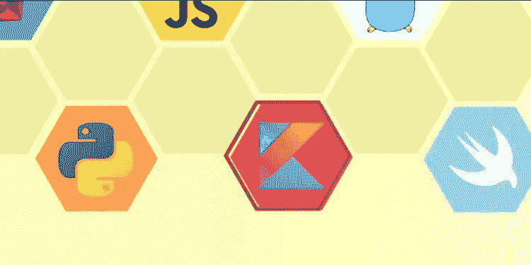
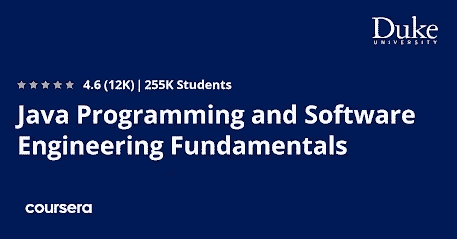
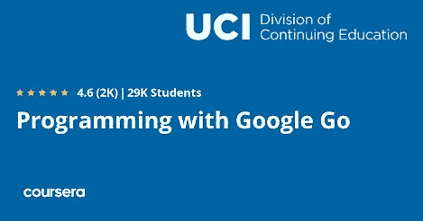
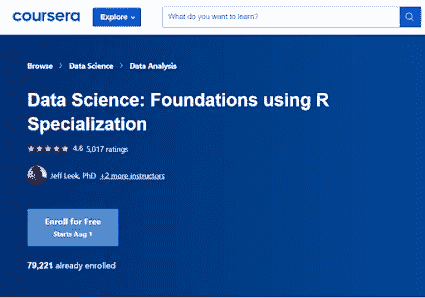
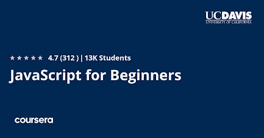

# 2023 年软件开发和数据工程最佳编程语言

> 原文：<https://medium.com/javarevisited/5-best-programming-language-for-software-development-and-data-engineering-f8d81e1fc7ad?source=collection_archive---------2----------------------->

## 想知道选择哪种编程语言进入 IT 和软件开发领域？这里有 5 种最好的编程语言，你可以选择在 2023 年开始你的软件开发职业生涯

大家好，**如果你想在 2023 年成为一名程序员、数据工程师或软件开发员**，但不确定选择哪种编程语言，那么你来对地方了。

你只需学习一种编程语言，如 [Python](https://javarevisited.blogspot.com/2020/02/10-best-coursera-courses--for-python.html) 、 [Java](https://javarevisited.blogspot.com/2020/11/coursera-course-review-java-programming-and-software-engineering-fundametnals.html) 或 [JavaScript](https://javarevisited.blogspot.com/2018/06/top-10-courses-to-learn-javascript-in.html) 就能搞定的时代已经一去不复返了，如今每份工作都要求更多，你总能在工作描述中找到几种编程语言。

几乎有数百种编程语言，如果你想选择下一步应该学习哪一种，你可能会感到头晕。虽然有些编程语言非常有名，但也有一些非常晦涩和奇怪。

但是你可能会问，你应该掌握哪种编程语言。别担心。我们支持你。许多人在 Java 和 JavaScript、Python 和 R、Golang 和 Rust 之间感到困惑，这正是本文将帮助你的地方。

在这篇文章中，我分享了 5 种最好的编程语言，这些语言基于我自己的研究、现有工作的数量、他们的需求和我的经验，你可以通过学习在 2023 年成为一名软件开发人员或数据工程师。你不需要全部学会，事实上你应该从一个像 Java 这样的开始，然后在你掌握了第一个声调之后再学第二个。

# 2023 年开始软件和数据工程职业生涯的 5 种最佳编程语言

决定专攻哪种编程语言可能是一个令人生畏的选择，尤其是对初学编程的人来说。但是，如果你想给你的潜在雇主留下深刻印象并获得你梦想中的软件工作，掌握不止一种编程语言的技能是绝对必要的。

在本文中，我们整理了一份初学者绝对必须学习的 5 种最佳编程语言的清单。为了让您的工作更轻松，我们还为您提供了学习这些语言的最佳课程。那你还在等什么？让我们开始吧。

## 1.Java 语言(一种计算机语言，尤用于创建网站)

Java 实际上是最流行的编程语言之一。这是科技公司在招聘程序员时最看重的技能。在美国，超过 30 亿部电话、1 . 25 亿台电视设备和 80%的个人电脑实际上都运行在 Java 上。

在美国，一名 Java 开发人员的平均工资为 85000 美元。对 Java 开发人员的需求一直很高。Java 也是最流行的后端开发语言，大多数大银行和保险巨头都使用 Java。

简而言之，学习 Java 意味着你将更容易被雇佣，并且可能比其他人获得更高的薪水。这里是 2023 年在线学习 Java 编程的最佳 Coursera 课程

## [Java 编程与软件工程基础专业](https://coursera.pxf.io/c/3294490/1164545/14726?u=https%3A%2F%2Fwww.coursera.org%2Fspecializations%2Fjava-programming)【Coursera】

这一专业将帮助你朝着以 Java 为重点的软件工程职业迈出第一步，Java 是最受欢迎的编程语言之一，也是 Android 操作系统的基础。

这个专业是为初学者设计的，你将学到核心的编程概念，这些概念将允许你编写程序和解决复杂的问题。

## 2.计算机编程语言

Python 基本上是一种强调代码可读性的高级通用编程语言。它实际上是你现在能学会的最简单的编程语言之一。它使用普通的单词和表达，有更多的空格和更少的花括号。

Python 支持 Instagram 和 Pinterest 的网络应用，以及 Reddit 和 NASA 的网络应用。公司经常把 Python 列为程序员必须熟悉的编程语言之一。

学习 Python 有很多好处，因为你不仅可以做网络开发和自动化工作，还可以进入利润丰厚的领域[数据分析](https://javarevisited.blogspot.com/2020/08/top-10-coursera-certifications-to-learn-Data-Science-Visualization-and-Data-Analysis.html)、[数据科学](https://www.java67.com/2018/10/top-10-data-science-and-machine-learning-courses.html)和[机器学习](https://javarevisited.blogspot.com/2020/08/top-10-coursera-courses-and-certification-for-artificial-intelligence-and-machine-learning.html)。

Python 是编程语言之王，有许多 python 框架和库可以让你的生活更轻松，比如 Django、Flask、NumPy、Pandas 等等。

而且，如果你已经下定决心在 2023 年学习 Python，只是需要一个很好的在线课程，那么这里是 2023 年在线学习 Python 的最佳课程

## [人人专精的 Python](https://coursera.pxf.io/c/3294490/1164545/14726?u=https%3A%2F%2Fwww.coursera.org%2Fspecializations%2Fpython)【Coursera】

这是一个很棒的专业，将向您介绍基本的编程概念，如数据结构、网络编程应用程序接口，以及使用 Python 编程语言的数据库。

该专业还有一个项目，在该项目中，您将使用您所学的所有技术来设计和创建您自己的数据检索、处理和可视化应用程序。

## 3.Go 编程语言

Go，也被称为 [Golang](https://javarevisited.blogspot.com/2021/11/top-5-golang-courses-for-beginners-to.html) ，是一种开源编程语言，主要关注简单性、效率和可靠性。Go 最初是由谷歌在 2007 年发布的。这是因为谷歌的人意识到他们需要一种植根于简单和高性能的新编程语言。

Go 于 2012 年向公众发布。从那以后，它获得了惊人的受欢迎程度，并成为最著名的现代编程语言之一。

许多公司已经开始使用 Golang 进行服务器端开发，在未来几年，对 Golang 开发人员的需求只会增加，因此[现在学习 Golang](https://www.java67.com/2019/12/top-5-courses-to-learn-go-or-golang.html) 并在 2023 年成为 Golang 专家是非常有意义的。

而且，如果你已经下定决心学习 JavaScript 编程语言，只是需要一个资源来开始，那么这里是 2023 年在线学习 Golang 编程语言的最佳课程

## 使用 Google Go 专业化进行编程【Coursera】

在这个精彩的课程中，您将学习如何使用创新的编程语言 Go 开发高效的应用程序。

你将通过从 Google 开始学习 Go 编程语言来开始这个专业。您还将大致了解 Go 提供的不同特殊功能。当你完成这个专业的时候，你将拥有使用 Go 创建高效、简洁的应用程序所必需的技能和知识。

## 4.r 编程语言

r 也是一种开源编程语言，广泛用作统计软件和数据分析工具。r 通常有一个命令行用户界面。r 在 Windows、 [Linux](https://javarevisited.blogspot.com/2021/06/5-websites-to-learn-linux-command-line.html) 和 macOS 等平台上广泛可用。

r 最初是由新西兰奥克兰大学的 Ross Ihaka 和 Robert Gentleman 设计的。目前由 R 开发核心团队开发和维护。它实际上是 S 编程语言的一种实现。

而且，如果你已经决定学习 R 编程语言并且需要一个资源来开始，那么这里是 2023 年在线学习 R 编程的最好的 Coursera 课程

## [数据科学:使用 R 专业化的基础](https://coursera.pxf.io/c/3294490/1164545/14726?u=https%3A%2F%2Fwww.coursera.org%2Fspecializations%2Fdata-science-foundations-r)【Coursera】

在这个奇妙的专业中，您将了解基础数据科学工具和技术。您将学习如何清理和探索数据，以及在 r 中进行可重复的研究和编程。

这个专业由五门优秀课程组成。当你完成这个专业时，你将能够使用真实世界的数据构建一个数据产品。

## 5.Java Script 语言

JavaScript 实际上是一种脚本语言，最常用于使网页具有交互性。它是用 HTML 文档编写的，并通过 web 浏览器运行。

如果你正在寻找一份前端 web 开发人员的工作，除了 [HTML](/javarevisited/10-best-html-and-css-courses-for-beginners-in-2021-6757eec00032) 、 [CSS](/javarevisited/10-best-css-online-courses-for-beginners-and-experienced-developers-54aa2e8c0253) 和其他脚本语言之外，你还需要精通 [JavaScript](/javarevisited/10-best-online-courses-to-learn-javascript-in-2020-af5ed0801645) 。学习 JavaScript 也有很多好处，因为这是唯一能让你成为真正的全栈开发者的编程语言。

您可以在前端和后端使用 JavaScript，不仅仅是 web 应用程序，还可以使用 JavaScript 和 React Native 创建移动应用程序，React Native 是一个用于 iOS 和 Android 应用程序开发的流行 JavaScript 库。

而且，如果你已经下定决心学习 JavaScript 编程语言，只是需要一个资源来开始，那么这里是 2023 年在线学习 R 编程的最佳课程

## [JavaScript 初学者专精](https://coursera.pxf.io/c/3294490/1164545/14726?u=https%3A%2F%2Fwww.coursera.org%2Fspecializations%2Fjavascript-beginner)【Coursera】

这种专门化非常适合没有编程经验的初学者。如果你想成为一名 web 开发人员，JavaScript 基本上是你需要学习的第一门编程语言。

这种奇妙的专业化将帮助您通过模块和课程的渐进过程来实践和建立您的技能。

这就是了。这些 **5 是最好的编程语言**，初学者可以用来开始他们的 IT 和软件开发生涯。我还介绍了像 Python 和 R 这样的编程语言，它们对你开始数据科学、数据分析师或数据工程师的职业生涯很有帮助。

有趣的是，你可以使用我们列出的课程来做到这一点。如果你喜欢这 5 种最佳编程语言和课程的列表，请随意与你的朋友和家人分享。

顺便说一下，当谈到参加这个课程时，你有两个选择，你可以单独参加这个课程，每个月花费大约 39 美元进行专业化，你也可以参加 [**Coursera Plus**](https://coursera.pxf.io/c/3294490/1164545/14726?u=https%3A%2F%2Fwww.coursera.org%2Fcourseraplus) 每年花费 399 美元，这是 Coursera 的一个订阅计划，让你无限制地访问他们最受欢迎的课程、专业化、专业证书和指导项目。

 [## Coursera Plus |无限制访问 7，000 多门在线课程

### 用 Coursera Plus 投资你的职业目标。无限制访问 90%以上的课程、项目…

coursera.pxf.io](https://coursera.pxf.io/c/3294490/1164545/14726?u=https%3A%2F%2Fwww.coursera.org%2Fcourseraplus) 

你可能喜欢的其他 **Coursera 和编程文章**

*   [学习云计算的 10 门最佳 Coursera 课程](https://javarevisited.blogspot.com/2020/08/top-10-coursera-certifications-to-learn-cloud-computing-aws.html#axzz6WK1yC5WW)
*   [2023 年程序员十大课程](https://javarevisited.blogspot.com/2020/08/top-10-coursera-courses-specilizations-and-certifications.html)
*   [学习 Web 开发的十大 Coursera 课程](https://javarevisited.blogspot.com/2020/08/top-10-coursera-certifications-to-learn-web-development.html)
*   [Coursera Plus Review——在 Coursera 上学习的更好方式](https://javarevisited.blogspot.com/2020/08/coursera-plus-better-way-to-take-coursera-courses-specilizations-certification.html)
*   [你可以在 Coursera 上在线申请的前 5 个计算机科学学位](https://javarevisited.blogspot.com/2020/04/is-it-possible-to-get-master-of-computer-science-degree-online-coursera.html)
*   [面向程序员和开发者的 Coursera 十大项目](https://javarevisited.blogspot.com/2020/08/top-10-coursera-projects-to-learn-essential-programming-skills.html)
*   【Coursera 证书对工作和事业有帮助吗
*   [Udemy vs Coursera？学理工和编程哪个好](https://javarevisited.blogspot.com/2020/01/coursera-vs-udemy-which-is-better-for-programming-tech.html)
*   [2023 年学习 Python 可以做的 8 个项目](/javarevisited/8-projects-you-can-buil-to-learn-python-in-2020-251dd5350d56)
*   [5 个最佳 Coursera 程序员职业证书](https://javarevisited.blogspot.com/2019/10/top-5-coursera-professional-certificates-for-programmers-IT-professionals.html)
*   [2023 年学习人工智能的 7 门最佳课程](/javarevisited/7-best-courses-to-learn-artificial-intelligence-in-2020-26d59d62f6fe)
*   [开始职业生涯的十大 Coursera 认证](/javarevisited/top-10-coursera-certificates-to-start-your-career-in-cloud-data-science-ai-mainframe-and-it-558690c83587)
*   [Udemy vs CodeCademy vs one month？](https://javarevisited.blogspot.com/2019/09/codecademy-vs-udemy-vs-onemonth-which-is-better-for-learning-code.html#axzz6VYKcmyZz)
*   [Udemy vs 复数视线？哪个学习平台比较好？](https://javarevisited.blogspot.com/2019/10/udemy-vs-pluralsight-review-which-is-better-to-learn-code.html)
*   你可以在 Coursera Online 上获得 5 个数据科学学位
*   Udemy vs Educative vs CodeCademy？新手用哪个比较好
*   [学习计算机科学的 10 门最佳课程](https://javarevisited.blogspot.com/2020/08/top-10-coursera-courses-to-learn-sofware-development-computer-science.html)
*   【Coursera 的 10 项数据科学和机器学习认证

感谢阅读这篇文章。如果你喜欢这些*软件开发人员最佳 Coursera 课程，*请与你的朋友和同事分享。如果您有任何问题或反馈，请留言。

**p . s .**——如果你正在寻找最好的 Coursera 职业证书来开始你的职业生涯，你也可以看看我列出的 23 个最好的 Coursera 职业证书，在 2023 年加入 。包含了最好的 Coursera 课程，学习 Java、Python、数据分析、机器学习、Git，以及其他软件开发所需的必备技能。

 [## 回顾—2023 年谷歌在 Coursera 上的数据分析专业证书值得吗？

### 我回顾了谷歌在 Coursera 上广受欢迎的数据分析专业证书，看看它是否真的值得…

medium.com](/javarevisited/is-googles-data-analytics-professional-certificate-on-coursera-worth-it-review-38f99663f891)