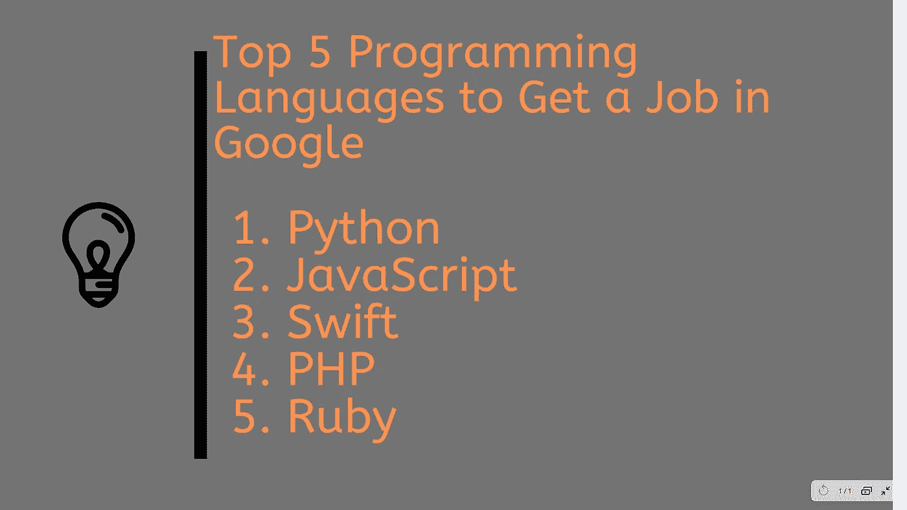
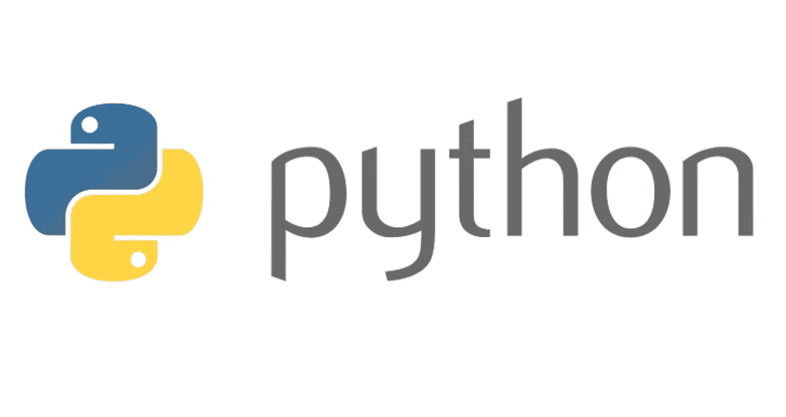
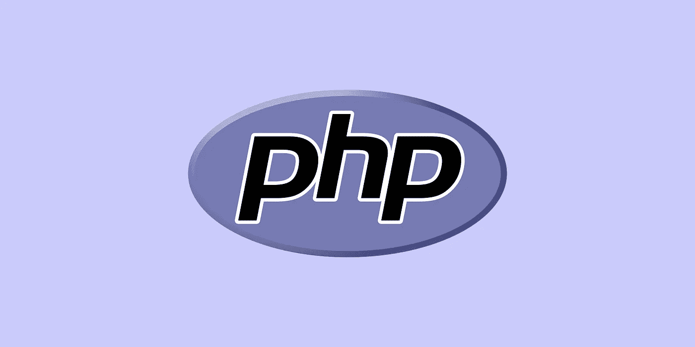
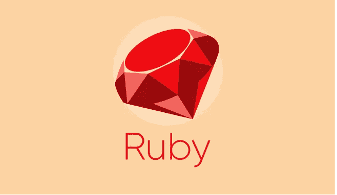
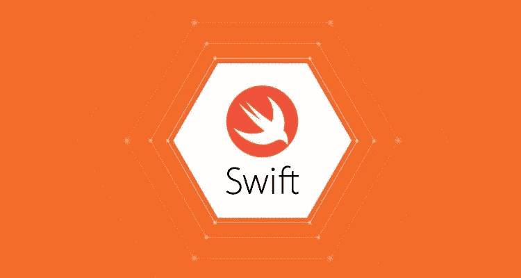

# 2023 年成为软件开发人员并在谷歌、亚马逊找到工作的 5 种最佳编程语言

> 原文：<https://medium.com/javarevisited/5-best-programming-languages-to-get-a-sofware-developer-job-in-google-3d8c83c444d6?source=collection_archive---------0----------------------->

## 这是 2023 年你可以学习并成为谷歌、亚马逊、脸书和其他顶级科技公司软件开发人员的前五种编程语言

paweczerwi ski 在 [Unsplash](https://unsplash.com?utm_source=medium&utm_medium=referral) 上的照片

大家好，如果你想知道你可以学习哪些编程语言，以便在[谷歌](https://javarevisited.blogspot.com/2012/01/google-interview-questions-answers-top.html)、脸书[、微软](https://javarevisited.blogspot.com/2015/12/30-microsoft-interview-questions-for-software-development-engineers.html)、苹果[、亚马逊](https://javarevisited.blogspot.com/2016/01/top-20-amazon-and-google-programming-interview-questions.html)或初创公司找到工作，或者作为一名开发人员从事一些自由职业，那么你来对地方了。

在这篇文章中，我将列出一些在谷歌、脸书、微软找工作的最佳编程语言。这些也是自由职业者和程序员在优步、Airbnb 或网飞等初创公司寻找软件开发工作的首选程序。

我根据自己多年的经验以及与曾在谷歌、脸书、微软等科技巨头工作过的程序员以及自由职业者的交谈，编制了这份清单。

这些也是一些最好的编程语言，可以让你在有望迅速好转的初创公司找到工作，并最终进入像谷歌、脸书、苹果、亚马逊和微软这样的公司。

# 成为软件开发人员并在谷歌找到工作的 5 种最佳编程语言，

不浪费你更多的时间，这里是我为自由职业者和想在创业公司找份工作的人列出的最佳编程语言。

## 1.计算机编程语言

Python 是此时此刻的编程语言之王。使用 [Python](/javarevisited/python-or-java-which-programming-language-beginners-should-learn-in-2020-de992b2650ec) 没有什么是你做不到的。您可以编写 web 应用程序，创建机器学习模型，自动化繁琐的任务，甚至可以使用 Python 废弃 web。

Python 的最大优势是几个免费提供的模块或包。你不需要写很多代码，只需要搜索合适的包或库，并把它们包含在你的项目中。

说到 web 开发，Python 有两个卓越的框架， [Django](https://javarevisited.blogspot.com/2019/04/top-5-python-web-development-frameworks.html) 和 [Flask](https://hackernoon.com/10-reasons-to-learn-python-in-2018-f473dc35e2ee) 。Django 是一个广泛的、全功能的框架，而 Flask 更简单。它给了你你需要的东西，但是你做剩下的决定。

类似地，你有像 [Pandas](https://javarevisited.blogspot.com/2019/10/top-5-courses-to-learn-pandas-for-data-analysis-python.html) ，SciKit-learn，和 [TensorFlow](https://dev.to/javinpaul/10-of-the-best-tensorflow-courses-to-learn-machine-learning-from-coursera-and-udemy-37bf) 用于[机器学习](https://hackernoon.com/10-machine-learning-data-science-and-deep-learning-courses-for-programmers-7edc56078cde)的奇妙的库，最好的是你可以用 Python 写很多脚本，这对自由职业者来说很棒。

例如，你可以写一个 Python 脚本，它可以删除所有自由职业者的网站，并根据你的喜好将你感兴趣的所有工作通过电子邮件发送给你。

简而言之，如果你想做自由职业者，或者有兴趣在谷歌、微软、脸书或任何初创公司找到工作，如果你需要从头开始学习 Python 的资源，请在 Udemy 上查看完整的 Python bootcamp 课程。

## 2.Java Script 语言

这是网络开发者最好的编程语言之一，也被称为网络之王，是的，我说的是 [JavaScript](/javarevisited/my-favorite-free-tutorials-and-courses-to-learn-javascript-8f4d0a71faf2) 。过去的十年是 JavaScript 的十年，它成为第一个开发[全栈 web 应用](https://javarevisited.blogspot.com/2019/01/10-web-development-frameworks-fullstack-developer-should-learn.html)的编程语言。

当你做自由职业者时，你没有奢侈去找不同的人来开发前端和后端；相反，你需要做所有的事情，这正是 JavaScript 可以帮助你的地方。对于[的初创公司](https://dev.to/javinpaul/top-5-programming-languages-to-learn-to-get-a-job-at-google-facebook-microsoft-or-work-as-a-freelance-developer-3ma5)以及谷歌、脸书和微软这样的科技公司来说也是如此，你需要承担产品的大部分责任。

JavaScript 允许您创建应用程序的前端和后端，这在开发项目或为初创公司招聘员工时是一个巨大的差异化因素。

如果你想学习 JavaScript，需要一个优秀的资源，建议你加入 Udemy 上 Jonas Schmedtmann 的 [**完整的 JavaScript 课程:构建真实项目**](https://click.linksynergy.com/deeplink?id=JVFxdTr9V80&mid=39197&murl=https%3A%2F%2Fwww.udemy.com%2Fcourse%2Fthe-complete-javascript-course%2F) 。

这是我最喜欢的课程，提供基于项目的学习，你可以通过开发自己的项目来学习，这是最好的学习方式。

## 3.服务器端编程语言（Professional Hypertext Preprocessor 的缩写）

很多人抨击 PHP，这非常不幸，因为它是一门伟大的语言，几乎一半的 web 都是由 PHP 驱动的。这很简单，您可以在任何地方快速部署 PHP 脚本。许多自由职业者的工作都是关于使用 [WordPress](https://javarevisited.blogspot.com/2020/08/top-5-courses-to-learn-wordpress-in.html#axzz6osztTyx9) 创建网站，它是使用 [PHP](https://hackernoon.com/5-free-php-and-mysql-courses-to-learn-web-development-63836cd3e587) 构建的。

如果你懂 PHP，你可以做所有这些工作。PHP 对于需要快速获得东西的自由职业者来说是非常棒的。对于大型组织来说，它可能不是最好的选择，但是如果你是自由职业者，正在构建个人项目，或者想在创业公司找份工作，PHP 可能是个不错的选择。

如果你想从头开始学习 PHP，并寻找一些优秀的资源，我建议看看 Udemy 上的这个 [**PHP 初学者——成为 PHP 大师**](https://click.linksynergy.com/deeplink?id=JVFxdTr9V80&mid=39197&murl=https%3A%2F%2Fwww.udemy.com%2Fcourse%2Fphp-for-complete-beginners-includes-msql-object-oriented%2F) 课程。本课程将通过测验、项目和实践练习教会你成为专业 PHP 开发人员所需的一切。

## 4.红宝石

出于和 [PHP](/javarevisited/top-10-free-courses-to-learn-php-and-mysql-for-web-development-e96e69982675) 一样的原因，这是另一种优秀的编程语言，可以帮助你快速完成工作。如果你知道 Ruby on Rails，你可以在一两天内完成一个功能齐全的网站和一个数据库，这在 Java 中需要一周左右的时间。

Ruby 在创业公司中也很普遍。事实上，许多成功的创业公司都是使用 Ruby 和 Rails 建立的，如 Twitter、Shopify、Github、Groupon 和您自己的 Airbnb。

这就是为什么如果你正在创业或者想在创业时找到工作，学习 Ruby 是非常有意义的，如果你需要资源，Rob Percival 和 mashrur hossain Mishal 的这个[**Ruby on Rails master class**](https://click.linksynergy.com/deeplink?id=JVFxdTr9V80&mid=39197&murl=https%3A%2F%2Fwww.udemy.com%2Fcourse%2Fthe-complete-ruby-on-rails-developer-course%2F)可能是最好的起点。

## 4.迅速发生的

今天的世界是智能手机的世界，如果你不在客户的手机上，你会损失很多钱，这就是为什么每个公司，无论大小，都在投资他们的移动应用程序。

所有的初创公司在他们的网站启动时都需要他们的移动应用，如果你有兴趣在初创公司获得一份移动开发人员的工作，Swift 可能是一个很好的选择。 [Swift](https://javarevisited.blogspot.com/2019/01/top-5-ios-developer-course-to-learn-ios.html#axzz6Dz0uFxDo) 是苹果针对 [iOS](https://javarevisited.blogspot.com/2019/01/top-5-ios-developer-course-to-learn-ios.html) 、macOS、watchOS 和 tvOS 的编程语言。

您可以使用 [Swift](https://www.java67.com/2019/03/5-free-courses-to-learn-swift.html) 构建 iPhone 和 iPad 应用程序。它的设计既安全又坚固。它还可以帮助你从事自由职业，因为在像 Fiverr 和 Upwork 这样的自由职业网站上有很多开发和增强 iOS 应用程序的工作。

像谷歌、微软、亚马逊、脸书这样的大公司也有很多移动应用程序，他们总是在寻找有能力的程序员来维护它们并开发新的应用程序。

还有最后一点，iOS 开发者赚的钱比 Android 开发者多很多。如果你想学习 Swift，需要一个资源，建议你去看看这个 [**iOS 和 Swift 5 大师班**](https://click.linksynergy.com/deeplink?id=JVFxdTr9V80&mid=39197&murl=https%3A%2F%2Fwww.udemy.com%2Fcourse%2Fios-13-app-development-bootcamp%2F) 课程，Angela Yu 是在线学习 Swift 最好的导师之一。

如果你跟着我，那么你会惊讶的发现 [*Java*](https://javarevisited.blogspot.com/2018/07/10-reasons-to-learn-java-programming.html) 不在这个列表中。作为一个 Java 的铁杆粉丝，并且已经用 Java 做了超过 10 年的编程，这很难，但是丑陋的事实是 Java 不适合自由职业者和创业公司。

在谷歌找到一份 Java 开发人员的工作机会微乎其微，但这种机会非常少，除非你像乔希·布洛赫(《高效的 Java》一书的作者)或道格·李(《实践中的 Java 并发》一书的合著者)。如果你懂 Python、JavaScript 或者 Ruby，你会有更好的机会。

如果你想在华尔街银行、巴克莱银行、花旗银行、摩根大通银行等大型机构找到工作，Java 实际上是最好的编程语言。，以及 AIG 这样的保险公司，但不适合创业公司和自由职业者，他们需要快速周转。

相反，像 [PHP](https://www.java67.com/2018/02/5-free-php-and-mysql-courses-for-web-developers.html) 、 [Ruby](https://www.java67.com/2018/02/5-free-ruby-and-rails-courses-to-learn-online.html) 和 [Python](https://javarevisited.blogspot.com/2018/12/10-free-python-courses-for-programmers.html) 这样的语言更适合初创公司和自由职业者，并最终为谷歌、脸书、苹果、亚马逊和微软等基于产品的公司工作。

我可能会因为把 [PHP](/javarevisited/top-10-free-courses-to-learn-php-and-mysql-for-web-development-e96e69982675) 包括在这个列表中而感到奇怪，因为抨击 PHP 还没有成为一种趋势，但是你会惊讶地发现，互联网上超过 50%的网站都运行在 PHP 上。

大多数自由职业者的开发工作是开发网站，管理使用 [WordPress](/javarevisited/5-best-wordpress-courses-for-beginners-and-experienced-website-developers-b45f7976ee40) 的网站，开发移动应用程序，然后为不同的需求构建实用程序。对于其中的大部分，需要对 PHP[和](/javarevisited/10-best-php-courses-for-beginners-and-experienced-developers-db18057a814f)有很好的了解，这也是 PHP 被包括在这个列表中的原因。

同样，在创业公司，你会被要求通宵或周末开发一个网站或移动应用程序。像 [Python](/better-programming/top-5-courses-to-learn-python-in-2018-best-of-lot-26644a99e7ec) 和 [Swift](/javarevisited/top-5-online-courses-to-learn-ios-12-swift-in-2019-a35ae1be7b2b) 这样的编程语言代替 Java 更适合这样的需求。

所以，如果你想在初创公司以及像谷歌和脸书这样的大型产品公司找到工作，就要学习像 Python、Ruby 和 Swift 和 T21 这样的语言。

这就是 2023 年成为软件开发人员并在谷歌、脸书、微软等公司找到工作的最佳编程语言。对于自由职业者，在优步、网飞或 Airbnb 等初创公司找工作，以及建立个人项目来说，这些语言也是很棒的语言。

正如我以前说过的，并不是每种编程语言都适合所有的事情。有时候，接受 [Java](/javarevisited/10-best-places-to-learn-java-online-for-free-ce5e713ab5b2) 并不是编写简单 web 应用程序的正确选择，而是选择 PHP 也是可以的。

如果你想在谷歌、脸书、微软找份工作，或者想在创业公司工作，或者想做一名自由职业者，学习这五种编程语言可以改变游戏规则。

其他**编程和科技文章**你可能喜欢:
[完整的前端和后端开发人员路线图](https://javarevisited.blogspot.com/2019/02/the-2019-web-developer-roadmap.html)
[软件开发人员的 11 项必备技能](https://dev.to/javinpaul/11-essential-skills-software-developers-should-learn-in-2020-1bio)
[完整的 DevOps 工程师路线图](https://javarevisited.blogspot.com/2018/09/the-2018-devops-roadmap-your-guide-to-become-DevOps-Engineer.html#axzz61d5FPRru)
[Java 和 Web 开发人员应该学习的 10 个框架](http://javarevisited.blogspot.sg/2018/01/10-frameworks-java-and-web-developers-should-learn.html)
[完整的 Java 开发人员路线图](https://javarevisited.blogspot.com/2019/10/the-java-developer-roadmap.html)
[每个 Java 程序员都应该学习的 10 件事](https://javarevisited.blogspot.com/2017/12/10-things-java-programmers-should-learn.html#axzz5atl0BngO)
[Java 框架前 5 名你 学习 Python 编程](http://javarevisited.blogspot.sg/2018/04/top-5-java-frameworks-to-learn-in-2018_27.html)
[深入学习 HTML 5 和 CSS 的前 5 门课程](https://javarevisited.blogspot.com/2019/05/top-5-html-5-and-css-3-courses-for-web-developers.html)
[10 个面向 Web 开发者的 JavaScript 框架和库](https://www.java67.com/2019/01/top-10-javascript-frameworks-and-libraries-for-web-developers.html)

感谢您阅读本文。如果你喜欢这篇文章，并发现这些编程语言对自由职业者和在初创公司找工作很有用，那么请与你的朋友和同事分享。如果您有任何问题或反馈，请留言。