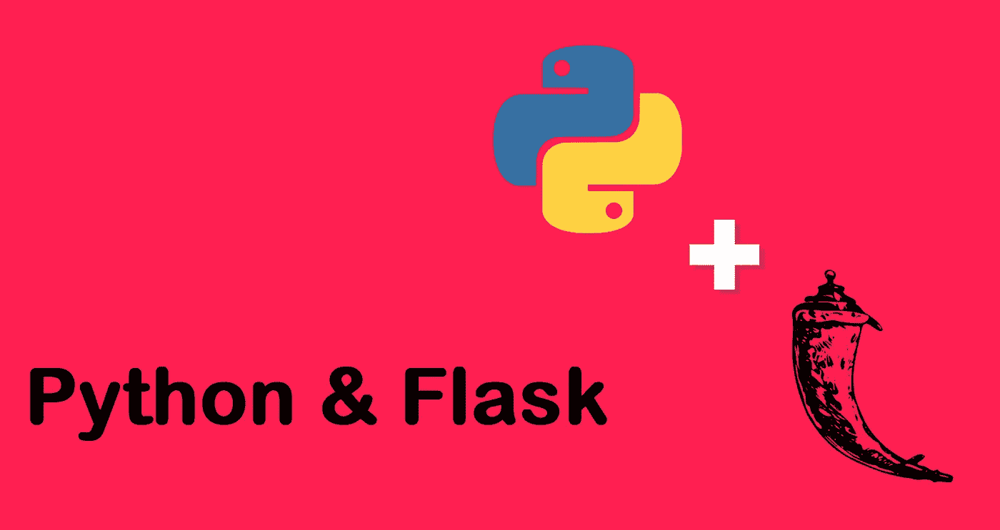
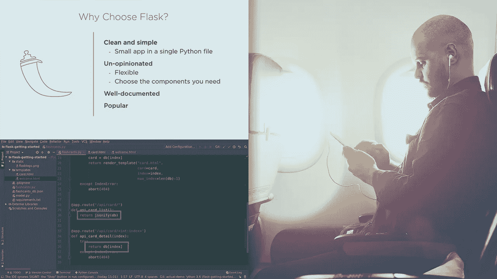
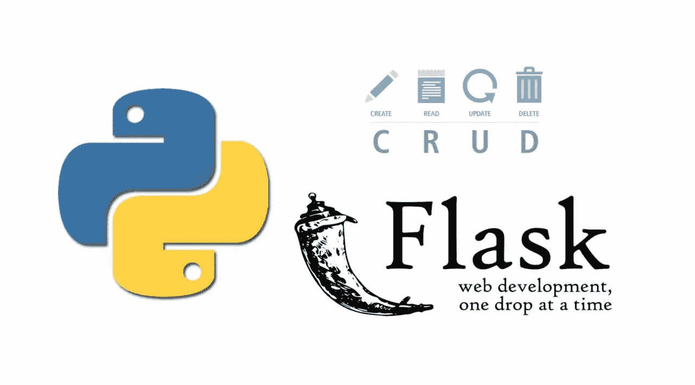

# 2023 年 5 个最适合初学者的 Flask 和 Python 课程

> 原文：<https://medium.com/javarevisited/5-best-python-flask-courses-for-beginners-2f262f8e23da?source=collection_archive---------0----------------------->

## 这些是 Python web 开发人员学习 Flask 框架的最佳在线课程。

大家好，如果你想在 2023 年学习 Python 和 Flask 的 web 开发，并寻找最好的 Python 和 Flask 在线课程，那么你来对地方了。

前面我已经分享了 [**最佳 Python 课程**](/better-programming/top-5-courses-to-learn-python-in-2018-best-of-lot-26644a99e7ec) 和[**最佳 Django 课程**](/javarevisited/my-favorite-courses-to-learn-django-for-beginners-2020-ac172e2ab920) ，另一个领先的全栈开发的 Python 框架，今天我要分享的是学习最简 Python web 开发框架 **Flask** 的最佳在线课程。

但是，在此之前，我必须祝贺你做出了正确的选择。Python 是目前的编程语言之王，它有许多[框架](https://javarevisited.blogspot.com/2019/04/top-5-python-web-development-frameworks.html)和[库](https://javarevisited.blogspot.com/2018/10/top-8-python-libraries-for-data-science-machine-learning.html)来创建健壮且可伸缩的 web 应用程序。

其中最值得注意的是 [**Flask**](https://flask.palletsprojects.com/en/1.1.x/) ，以简单易学著称。它允许你用少量的代码和工作创建一个 web 应用程序，因为它是 Python 社区中最流行的 [web 应用程序框架](https://javarevisited.blogspot.com/2019/01/10-web-development-frameworks-fullstack-developer-should-learn.html)之一，无论你是初学者还是有多年经验的人，它都是学习 web 开发的理想框架。

与 [**Django**](https://www.java67.com/2020/06/top-5-courses-to-learn-django-and-python-for-web-development.html) 不同，Django 是 Python 开发人员的另一个流行的 web 开发框架，它是一个[全栈框架](/javarevisited/top-10-online-courses-to-become-a-fullstack-web-developer-in-2020-d608a6b63232)， **Flask** 是一个**微框架**，它只提供 web 开发所需的基本特性，如路由、请求处理、会话管理等等。

如果你不知道像 Django 这样的全栈框架和像 Flask 这样的**微框架**之间的区别，让我修改一下，全栈框架有更多的特性，比如 ORM 支持、认证、授权，以及 web 应用程序所需的一些安全特性。瓶子选择了另一种方式，它只提供必要的东西，让你带进你想要的额外东西。有许多 Python 模块和扩展可以用来增强 Flask 的功能，这再次使它成为 web 开发的优秀框架。如果你懂 Python，那么学习 Flask 是非常容易的，你会很快准备好创建 web 应用程序。首先，你可以从下面的列表中选择任何课程并学习 Flask。

如果你问我，我会建议你选择一个基于项目的课程，这样你就可以通过做和创建一些有用的东西来学习，如 [**Python 和 Flask Bootcamp:使用 Flask 创建网站！**](https://click.linksynergy.com/deeplink?id=JVFxdTr9V80&mid=39197&murl=https%3A%2F%2Fwww.udemy.com%2Fcourse%2Fpython-and-flask-bootcamp-create-websites-using-flask%2F) 何塞·波尔蒂利亚的课程，你将使用 Flask 建立一个全功能的社交网站。

<https://click.linksynergy.com/deeplink?id=JVFxdTr9V80&mid=39197&murl=https%3A%2F%2Fwww.udemy.com%2Fcourse%2Fpython-and-flask-bootcamp-create-websites-using-flask%2F>  

# 2023 年学习 Flask 和 Python 的 5 门最佳在线课程

在不浪费你更多时间的情况下，这里是我列出的 2023 年学习 Flask 和 Python 的一些最佳课程。

该列表包括来自热门在线学习平台的在线课程，如 [Udemy](https://javarevisited.blogspot.com/2019/08/top-10-udemy-courses-and-certifications-for-programmers.html) 、 [Pluralsight](https://javarevisited.blogspot.com/2019/10/udemy-vs-pluralsight-review-which-is-better-to-learn-code.html) 、 [Coursera](https://javarevisited.blogspot.com/2019/10/top-5-coursera-professional-certificates-for-programmers-IT-professionals.html) 、 [Educative](https://javarevisited.blogspot.com/2020/01/top-10-free-interactive-online-courses.html) 和 [CodeCademy](https://javarevisited.blogspot.com/2019/09/codecademy-vs-udemy-vs-onemonth-which-is-better-for-learning-code.html) ，但在此之前，让我们了解一些关于 Flask 框架的更多信息。

它也有专门针对 Flask 的课程，其中一些同时教授 Python 和 Flask，适合任何对 Python 和 Flask 都不熟悉的人。

## 1.[用 Flask 和 Python 实现 REST API](https://click.linksynergy.com/deeplink?id=JVFxdTr9V80&mid=39197&murl=https%3A%2F%2Fwww.udemy.com%2Fcourse%2Frest-api-flask-and-python%2F)

这是一门以清晰和结构化的方式学习 Flask 和 Python 的极好课程。该课程以 Python 速成课程开始，这使得它非常适合 Python 新手或学习 Python 的人。

一旦你掌握了 [Python](/swlh/5-free-python-courses-for-beginners-to-learn-online-e1ca90687caf) ，你就开始探索用 Python 构建专业 REST APIs 的 Flask。您将学习不同的 Flask 扩展，如`Flask-RESTful` 和`Flask-SQLAlchemy` 以及其他，用很少的代码创建一个 web 应用程序。你还将学习一些基本工具，如 Git 和 Heroku，以及 REST APIs 等重要概念。总体来说，学习 Flask 的完美入门课程。

**这里是加入这个最佳 Flask 课程的链接**—[REST API 与 Flask 和 Python](https://click.linksynergy.com/deeplink?id=JVFxdTr9V80&mid=39197&murl=https%3A%2F%2Fwww.udemy.com%2Fcourse%2Frest-api-flask-and-python%2F)

说到社会证明，这门课程是由 Telcado 的何塞·萨尔瓦蒂耶拉创立的，是 Udemy 上*最受欢迎的烧瓶课程*之一。7753 名参与者平均给它打了 4.6 分，超过 4.3 万名学生注册了这门课程。如果你是 Python 和 Flask 的初学者，你会发现这个课程非常有用。

## 2.Python 和 Flask Bootcamp:使用 Flask 创建网站！

我真的很喜欢训练营风格的课程，这是其中之一。由何塞·波尔蒂利亚创建，他是我的最爱，也是 Udemy 上最受欢迎的 Python 指导者之一，这是一个很好的课程，学习如何使用 Flask 立即创建精彩的网站。这是一个完整的实践课程，将教你创建一个真实世界的 web 应用程序所需的关于 Flask 的一切知识。首先，你将学习前端技术的基础知识，如 [HTML](/javarevisited/5-free-html-and-css-courses-to-learn-front-end-web-development-online-8b04517c6ecb) 、 [CSS](https://www.java67.com/2018/02/5-free-html-and-css-courses-to-learn-web-development.html) 、 [Bootstrap](https://www.java67.com/2019/01/5-free-bootstrap-course-to-learn-online.html) 和 [Python](/better-programming/top-5-courses-to-learn-python-in-2018-best-of-lot-26644a99e7ec) 。一旦你熟悉了这些基本的前端技术，你将开始探索 Flask。

您将使用 Flask 创建简单的 REST APIs，如何使用 Flask 执行身份验证和授权，以及如何使用 Flask 代码连接到像 [MySQL](https://javarevisited.blogspot.com/2018/05/top-5-mysql-courses-to-learn-online.html) 这样的数据库。

**这里是加入这个 Python & Flask 课程**——[Python 和 Flask 训练营](https://click.linksynergy.com/deeplink?id=JVFxdTr9V80&mid=39197&murl=https%3A%2F%2Fwww.udemy.com%2Fcourse%2Fpython-and-flask-bootcamp-create-websites-using-flask%2F)的链接

最终，你会用 Flask 搭建一个完整的社交网站。它还涉及了一些高级概念，如 [**OAuth**](/javarevisited/top-10-courses-to-learn-spring-security-and-oauth2-with-spring-boot-for-java-developers-8f0222d6066d?source=---------5-----------------------) 以及如何在 Flask web 应用程序中使用 Stripe API 接受支付。谈到从零开始学习 Flask，这是我最喜欢的课程，如果你也喜欢基于项目的学习，我强烈建议你加入这个课程。

## 3.[烧瓶:入门](https://pluralsight.pxf.io/c/1193463/424552/7490?u=https%3A%2F%2Fwww.pluralsight.com%2Fcourses%2Fflask-getting-started)

这是从零开始学习 Flask 的又一门优秀课程。在本课程中，您将首先学习 Flask 的基础知识，以便开始 Python web 开发。

课程首先会教你如何创建视图函数，生成简单的 HTML 页面。在那之后，你将学习 **Jinja 模板**来创建一个动态网页和做一些任何网络应用程序需要的简单任务，比如提交网络表单和处理用户输入。

您还将运行 Flask 服务器和调试器来解决 web 应用程序的任何问题。总的来说，一个短暂而甜蜜的学习烧瓶的课程是必不可少的。也是既实用又够动手，能过而不腻。

**这里是加入初级烧瓶课程** — [烧瓶:入门](https://pluralsight.pxf.io/c/1193463/424552/7490?u=https%3A%2F%2Fwww.pluralsight.com%2Fcourses%2Fflask-getting-started)的链接

顺便说一句，你需要一个 [Pluralsight 会员](http://pluralsight.pxf.io/c/1193463/424552/7490?u=https%3A%2F%2Fwww.pluralsight.com%2Flearn)才能参加这个课程。没有的话就去弄一个，完全值得。Pluralsight 拥有超过 6000 门关于最新技术的高质量在线课程，您只需每月支付 29 美元或每年支付 299 美元就可以获得所有这些课程，但是，现在您只需支付**179 美元**就可以获得这些课程，因为 Pluralsight 在年度计划上提供高达 [**40%的折扣**](http://pluralsight.pxf.io/c/1193463/424552/7490?u=https%3A%2F%2Fwww.pluralsight.com%2Flearn) 。如果你今年真的想提高自己的技能，Pluralsight 会员资格对你来说是一笔极好的财富。而且，是的，他们还有一个 [**10 天免费试用**](http://pluralsight.pxf.io/c/1193463/424552/7490?u=https%3A%2F%2Fwww.pluralsight.com%2Flearn) ，这足以免费获得这门课程。

<http://pluralsight.pxf.io/c/1193463/424552/7490?u=https%3A%2F%2Fwww.pluralsight.com%2Flearn>  

## 4. [Flask:用 Python 开发 Web 应用](https://www.educative.io/courses/flask-develop-web-applications-in-python?affiliate_id=5073518643380224)

这是一门很棒的基于项目的课程，学习使用 Python 和 Flask on Educative 进行 Web 开发。本课程是使用 Flask 框架开发 web 应用程序的指南。

这是一门*基于项目的课程*，这意味着你将开发一个静态应用程序并从头开始构建它。您将了解静态路由、模板和资产。

学习完基础知识后，你还将学习 Jinja 模板，使用 Flask 以最少的代码创建动态网站。总的来说，这是一门面向乞丐和有抱负的[全栈开发者](https://javarevisited.blogspot.com/2019/01/10-web-development-frameworks-fullstack-developer-should-learn.html)的关于教育的优秀课程。

如果你不知道， [Educative](https://www.educative.io?affiliate_id=5073518643380224) 是一个相对较新的在线学习平台，它在浏览器上提供基于文本的课程和交互式编码，这有助于获得良好的学习体验。

**这里是加入 Flask 在线课程** — [Flask:用 Python 开发 Web 应用](https://www.educative.io/courses/flask-develop-web-applications-in-python?affiliate_id=5073518643380224)的链接

如果你也厌倦了观看视频和跳过讲座，你应该尝试 Educative 的基于文本的课程。你既可以购买这门课程，也可以购买一份 [**教育性订阅**](https://www.educative.io/subscription?affiliate_id=5073518643380224) 以每月 22 美元的费用访问他们的所有课程，这是一个合理的要求。

<https://www.educative.io/subscription?affiliate_id=5073518643380224>  

## 5.面向初学者的 Python Flask:使用 Flask 构建一个 CRUD web 应用

这是 Udemy 的又一个基于项目的课程，我推荐给所有想通过建立网站来学习 Flask 的人。在本课程中，你不仅将学习 Flask，还将学习如何在现实世界的项目中使用它。

课程最大的好处就是授课老师清晰简洁。它还包括在每个讲座结束时的总结，这有助于记住你在本章中学到的知识。

在本课程中，您将从 web 如何工作开始，然后学习如何创建 Flask 应用程序，使用 Jinja 2 模板生成 [HTML](https://dev.to/javinpaul/these-are-the-best-free-courses-to-learn-html-and-css-for-frontend-developers-2g8g) ，与 [MySQL 数据库](/javarevisited/top-5-courses-to-learn-mysql-in-2020-4ffada70656f)交互，以及做一个提交表单并将数据存储在服务器端的迷你项目。本课程结束时，你将使用 Flask 构建一个全功能的博客应用程序。这是一个完整的**实践课程**，如果你想在几个小时内学会 Flask，而不是几天或几周，这是一个理想的选择。我强烈推荐给所有忙碌的开发者。

**这里是加入这个 Flask 课程的链接**——[Python Flask 初学者:使用 Flask 构建 CRUD web 应用](https://click.linksynergy.com/deeplink?id=JVFxdTr9V80&mid=39197&murl=https%3A%2F%2Fwww.udemy.com%2Fcourse%2Fpython-flask-beginners%2F)

以上就是 2023 年学习 Flask 和 Python 的一些**最好的课程**。正如我所说，Flask 是一个很好的 web 开发 Python 框架。它漂亮、优雅、轻巧，而且简单易学。

它也有很多社区支持，以防你需要额外的帮助和创作。还有很多代码示例，你可以在 Flask 中找到几乎任何与 web 开发相关的内容。虽然所有这些课程都很棒，但我个人最喜欢的是第二门课程( [Python 和 Flask Bootcamp:使用 Flask 创建网站！](https://click.linksynergy.com/deeplink?id=JVFxdTr9V80&mid=39197&murl=https%3A%2F%2Fwww.udemy.com%2Fcourse%2Fpython-and-flask-bootcamp-create-websites-using-flask%2F))因为它的训练营风格和**基于项目的方法**，如果你也喜欢边做边学，那么你应该参加那个课程。

Flask 不仅是一个优秀的后端框架，如果你希望在今年成为 [**全栈开发者**](https://javarevisited.blogspot.com/2020/06/top-5-courses-to-learn-python-full-stack-web-development.html) ，它也是一项宝贵的技能。全栈开发人员的需求量很大，由于他们能够全面做出贡献，他们的薪酬通常会更高。

学习 Flask 也是一个很好的机会，可以进一步探索客户端和服务器端的开发，以提高你的技术技能，成为一名更好的网络开发人员，这是每个公司都追求的。

其他 **Python 编程文章**你可能喜欢

*   [2023 年学习 Python 的 10 个理由](https://javarevisited.blogspot.com/2018/05/10-reasons-to-learn-python-programming.html)
*   [初学 Python 的 5 大课程](https://javarevisited.blogspot.com/2018/03/top-5-courses-to-learn-python-in-2018.html)
*   [2023 年学习 Python 编程的前 5 本书](https://javarevisited.blogspot.com/2019/07/top-5-books-to-learn-python-in-2019.html#axzz6CF1B6UO6)
*   Python 和 JavaScript，从哪个开始比较好？
*   [深入学习 Python 的 10 门免费在线课程](https://javarevisited.blogspot.com/2018/12/10-free-python-courses-for-programmers.html)
*   [面向初学者和中级开发人员的 8 个 Python 项目](/@javinpaul/8-projects-you-can-buil-to-learn-python-in-2020-251dd5350d56)
*   [5 Python 中的数据科学与机器学习课程](https://javarevisited.blogspot.com/2018/03/top-5-data-science-and-machine-learning-online-courses-to-learn-online.html)
*   [10 门 Python 课程和程序员认证](/better-programming/top-5-courses-to-learn-python-in-2018-best-of-lot-26644a99e7ec)
*   [学习数据科学的 5 大 Python 书籍](https://javarevisited.blogspot.com/2019/08/top-5-python-books-for-data-science-and-machine-learning.html)
*   [深入学习 Python 的 15 门免费课程](/swlh/5-free-python-courses-for-beginners-to-learn-online-e1ca90687caf)
*   [Python vs . Java——你应该学习哪种编程语言？](https://javarevisited.blogspot.com/2018/06/java-vs-python-which-programming-language-to-learn-first.html)
*   [来自谷歌和微软的 10 个免费 Python 教程](/javarevisited/10-free-python-tutorials-and-courses-from-google-microsoft-and-coursera-for-beginners-96b9ad20b4e6)
*   [面向程序员的 10 本免费 Python 编程书籍](http://www.java67.com/2017/05/top-7-free-python-programming-books-pdf-online-download.html)

感谢您阅读本文。如果你喜欢这些 Flask 教程和课程，那么请分享给你的朋友和同事。如果您有任何问题或反馈，请留言。

**P. S. —** 如果你是一个完全的 Python 初学者，或者想在进入 Flask 之前以一种更有条理的方式学习 Python，那么我强烈推荐你在 Udemy 上阅读一下何塞·波尔蒂利亚的 [**完整的 Python 3 训练营:在 Python 中从零到英雄**](http://bit.ly/2BY5LJC) 。

<http://bit.ly/2BY5LJC> 