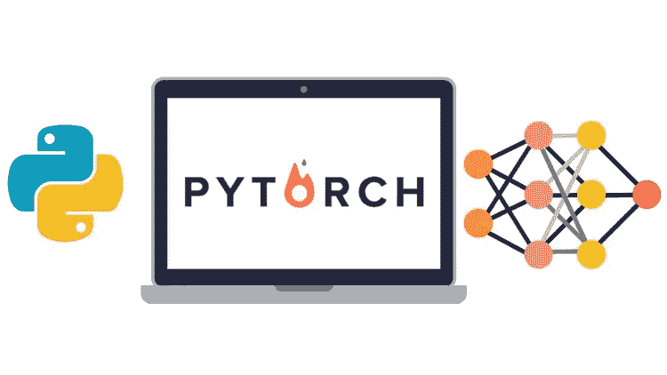
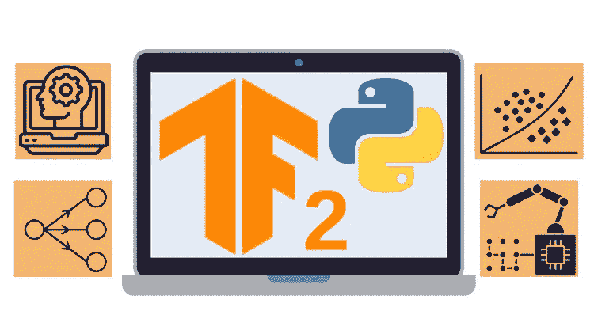
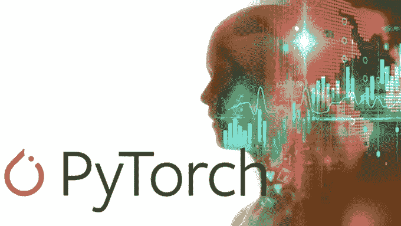
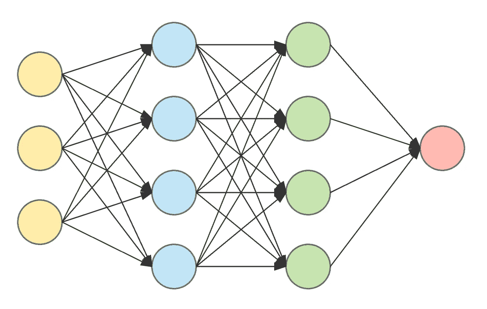
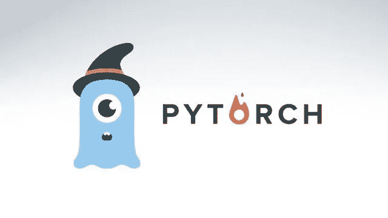
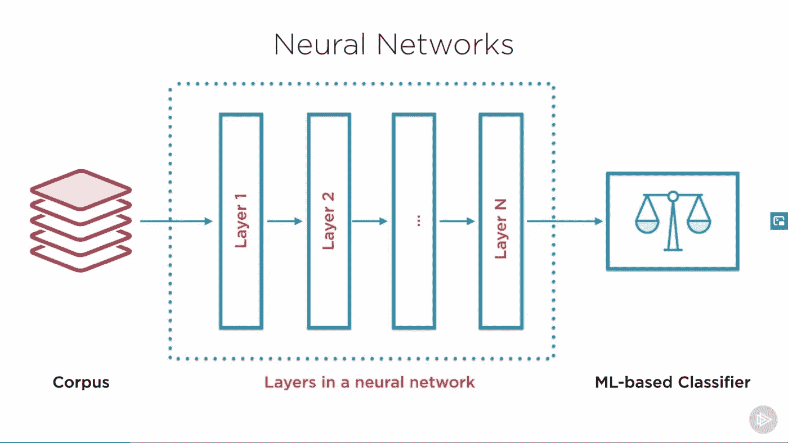
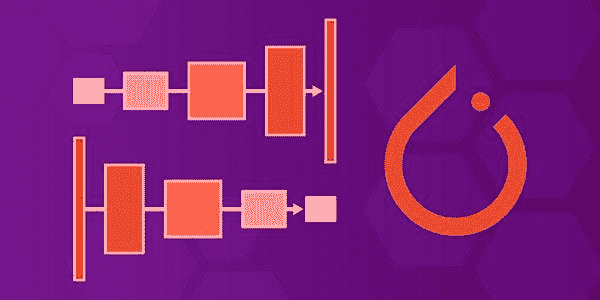

# 2023 年深度学习的 8 门最佳 PyTorch 和 Keras 课程

> 原文：<https://medium.com/javarevisited/5-best-pytorch-and-keras-courses-for-deep-learning-in-2021-c9ba377b1170?source=collection_archive---------0----------------------->

## 2023 年想学 PyTorch 和 Keras 深度学习库？这些是你可以从 Udemy、Coursera、Educative 和 Pluralsight 加入的最好的在线课程。

image_credit — Udemy

你好伙计们，如果你想在 2023 年从头开始学习 PyTorch 和 Kearas，并且正在寻找最好的 PyTorch 和 Keras 在线课程，你来对地方了。以前分享过 [**最好的机器学习课程**](/javarevisited/top-10-machine-learning-and-data-science-certifications-and-training-courses-for-beginners-and-a6308497b764) 和 [**最好的 TensorFlow 课程**](https://becominghuman.ai/top-10-courses-to-learn-tensorflow-for-machine-learning-in-2020-39a31e7cd84b) ，今天分享给初学者和有经验的程序员最好的 Keras 和 Pytorch 课程。

[PyTorch](https://pytorch.org/) 和 [Keras](https://keras.io/) 是由脸书和谷歌两家大公司开发的两个深度学习库，旨在促进创建深度学习应用程序，如人脸识别和自动驾驶汽车等。

Pytorch 是一个深度学习库，由科技巨头脸书开发，用于构建机器学习模型，如 [NLP](https://www.java67.com/2020/07/top-5-courses-to-learn-natural-language-processing-NLP.html) 和[计算机视觉](https://www.java67.com/2020/07/top-5-courses-to-learn-computer-vision-opencv-python.html)等等。Keras 只是一个接口，让你接触到其他深度学习库的庞然大物，如 [TensorFlow](https://hackernoon.com/top-5-tensorflow-and-ml-courses-for-programmers-8b30111cad2c) 、Theano 和微软 CNTK。

这些天来，学习这两个库已经成为任何想进入人工智能和深度学习领域的人，或者如果你想作为最好的深度学习研究工程师之一推动你的职业生涯，并在几乎每个公司找到工作的人必不可少的一部分。

以前分享过[书籍](https://javarevisited.blogspot.com/2019/08/top-5-python-books-for-data-science-and-machine-learning.html)，[教程](/javarevisited/my-favorite-data-science-and-machine-learning-courses-from-coursera-udemy-and-pluralsight-eafc73acc73f)，[认证](/javarevisited/my-favorite-data-science-and-machine-learning-courses-from-coursera-udemy-and-pluralsight-eafc73acc73f)，从零开始学习机器学习的最佳在线课程。如果你是机器学习领域的新手，你也可以通过它们来建立一些基础。

本文将找到教你如何在计算机视觉中执行深度学习技术的最佳在线课程、[聊天机器人](https://javarevisited.blogspot.com/2019/12/want-to-build-chat-bots-using-ai.html)、[递归神经网络](https://javarevisited.blogspot.com/2019/08/top-5-courses-to-learn-deep-learning.html)、卷积神经网络等等。

</javarevisited/5-best-dialogflow-and-chatbots-courses-to-learn-in-2021-14ce2e85090d>  

# 深度学习的 8 门最佳 Keras 和 Python 课程

事不宜迟，这里列出了学习 [PyTorch 和 Keras](https://www.java67.com/2020/06/top-5-courses-to-learn-pytorch-and-keras.html) 的最佳在线课程，这是来自脸书和谷歌的两个最受欢迎的[机器学习库](https://becominghuman.ai/10-free-courses-to-learn-python-machine-learning-libraries-scikit-learn-numpy-pandas-keras-3c77ba1a6907)。

列表包括*深入学习 PyTorch 和 Keras* 的基础和高级课程。该列表包括学习 Pytorch 或 Keras 的课程，以及涵盖两者的在线培训课程。

## 1.[完成 Tensorflow 2 和 Keras 深度学习训练营](https://click.linksynergy.com/deeplink?id=JVFxdTr9V80&mid=39197&murl=https%3A%2F%2Fwww.udemy.com%2Fcourse%2Fcomplete-tensorflow-2-and-keras-deep-learning-bootcamp%2F)

在 Udemy 上了解 TensorFlow 和 Keras 的最佳课程之一。本课程将带您了解机器学习的基本概念，然后向您展示如何在现实世界的程序中实现这些技术，从而在您学习本课程的同时获得一些机器学习的经验。

您将在本课程中学到的东西:

*   将 Keras API 与 TensorFlow 连接，构建机器学习应用。
*   使用 Google collab 和 TensorBoard 来可视化您的深度学习模型。
*   使用 Matplotlib 和 seaborn 实现数据可视化。

您将从 [TensorFlow](https://becominghuman.ai/top-10-courses-to-learn-tensorflow-for-machine-learning-in-2020-39a31e7cd84b) 机器学习库概念开始，因为 Keras 只是 TensorFlow 的一个接口，它将指导您如何使用 Keras APIs 对图像进行分类，预测未来数据，并像人类一样使用 RNN 技术生成文本。

**这里是加入这个令人敬畏的课程** — [完成 Tensorflow 2 和 Keras 深度学习训练营](https://click.linksynergy.com/deeplink?id=JVFxdTr9V80&mid=39197&murl=https%3A%2F%2Fwww.udemy.com%2Fcourse%2Fcomplete-tensorflow-2-and-keras-deep-learning-bootcamp%2F)的链接

## 2. [PyTorch:深度学习和人工智能](https://click.linksynergy.com/deeplink?id=JVFxdTr9V80&mid=39197&murl=https%3A%2F%2Fwww.udemy.com%2Fcourse%2Fpytorch-deep-learning%2F%26eid%3DCuIbQrBnhiw%26lsnoid%3DNONE)

这是一门从懒程序员团队学习深度学习和人工智能 PyTorch 的非常棒的课程，懒程序员团队是 Udemy 上机器学习和深度学习的最佳导师之一。

本课程面向从初级水平到专家级水平的学生。你将从一些非常基本的机器学习模型开始，并推进到最先进的概念。

您将了解所有主要的深度学习架构，如深度神经网络、卷积神经网络(图像处理)和递归神经网络(序列数据)。

以下是您将在本课程中学到的重要内容:

1.  人工神经网络/深度神经网络
2.  时间数列预测法
3.  计算机视觉
4.  如何构建深度强化学习炒股机器人
5.  生成对抗网络
6.  推荐系统

本课程是为想快速学习的人设计的，但也有“深入”部分，以防你想更深入地挖掘理论(如损失函数)和不同类型的梯度下降方法。

**这里是加入这个 Pytorch 课程的链接**——[py torch:深度学习和人工智能](https://click.linksynergy.com/deeplink?id=JVFxdTr9V80&mid=39197&murl=https%3A%2F%2Fwww.udemy.com%2Fcourse%2Fpytorch-deep-learning%2F%26eid%3DCuIbQrBnhiw%26lsnoid%3DNONE)

## 3. [PyTorch 教程—神经网络&Python 中的深度学习](https://click.linksynergy.com/deeplink?id=JVFxdTr9V80&mid=39197&murl=https%3A%2F%2Fwww.udemy.com%2Fcourse%2Fpytorch-primer-for-neural-networks-deep-learning-in-python%2F)

这是 PyTorch 上的另一个很棒的课程，面向希望学习和掌握神经网络和使用 Python 进行深度学习的人。

本课程是您使用 Python 中的 PyTorch 框架进行实用机器和深度学习的完整指南。它涵盖了 PyTorch 的重要方面，如果你学习了这门课程，你就可以省去学习其他课程或购买 PyTorch 书籍的麻烦。

这门课程的另一个好处是，你将学会在真实数据上使用 PyTorch，这与其他 Python 课程和书籍不同！我遇到的大多数其他资源都展示了如何在使用受限的内置数据集上使用 PyTorch。

**以下是加入本课程的链接** — [PyTorch 教程 Python 中的神经网络&深度学习](https://click.linksynergy.com/deeplink?id=JVFxdTr9V80&mid=39197&murl=https%3A%2F%2Fwww.udemy.com%2Fcourse%2Fpytorch-primer-for-neural-networks-deep-learning-in-python%2F)

## 4.[深度学习介绍](https://coursera.pxf.io/c/3294490/1164545/14726?u=https%3A%2F%2Fwww.coursera.org%2Flearn%2Fintroduction-to-deep-learning-with-keras)【Coursera】

这是另一个很好的 Udemy 课程，通过创建模型来学习深度学习和学习 Keras 库。该课程教你关于深度学习网络和人工智能在一般情况下如何工作的基本步骤，以及一些基础知识，如梯度下降、反向传播、激活函数等。

之后，您将获得如何在现实世界中使用 Keras(如执行回归和分类、CNN 和 RNN)实施这些基本方法的实践经验，并且您将在课程结束时完成一个项目，您需要创建该项目才能完成课程并获得认证。

本课程也是 [**IBM AI 工程专业证书**](https://coursera.pxf.io/c/3294490/1164545/14726?u=https%3A%2F%2Fwww.coursera.org%2Fprofessional-certificates%2Fai-engineer) 的一部分，这意味着完成本课程也将计入该证书。

以下是您将在本课程中学到的重要知识:

*   [深度学习](https://www.java67.com/2019/01/5-free-courses-to-learn-machine-and-deep-learning-in-2019.html)和 [AI](https://www.java67.com/2019/11/top-5-artificial-intelligence-courses.html) 的一些基本概念。
*   使用 Keras 创建深度学习模型。
*   查看其他不同的深度学习库。

**这里是加入本次深度学习课程**——[深度学习简介](https://coursera.pxf.io/c/3294490/1164545/14726?u=https%3A%2F%2Fwww.coursera.org%2Flearn%2Fintroduction-to-deep-learning-with-keras)的链接

顺便说一下，当谈到参加这个课程时，你有两个选择，你可以单独参加这个课程，每个月花费大约 39 美元进行专业化，你也可以参加 [**Coursera Plus**](https://coursera.pxf.io/c/3294490/1164545/14726?u=https%3A%2F%2Fwww.coursera.org%2Fcourseraplus) 每年花费 399 美元，这是 Coursera 的一个订阅计划，它可以让你无限制地访问他们最受欢迎的课程、专业化、专业证书和指导项目。

<https://coursera.pxf.io/c/3294490/1164545/14726?u=https%3A%2F%2Fwww.coursera.org%2Fcourseraplus>  

## 5.[用 Python 和 PyTorch 进行深度学习](https://www.awin1.com/cread.php?awinmid=6798&awinaffid=631878&clickref=&p=%5B%5Bhttps%3A%2F%2Fwww.edx.org%2Fcourse%2Fdeep-learning-with-python-and-pytorch)【EDX 最佳课程】

这是学习 PyTorch 库和用 Python 进行深度学习的最好的 edX 课程。在这个在线培训课程中，你可以使用 python 学习 PyTorch 进行深度学习，它需要一些数学培训，如代数和微积分，以及一些 [python 基础培训](/javarevisited/10-free-python-tutorials-and-courses-from-google-microsoft-and-coursera-for-beginners-96b9ad20b4e6)。

您将在本课程中学习到:

*   PyTorch 图书馆介绍。
*   创建不同的回归模型。
*   让你的预测更准确。

该程序的另一个独特之处在于，它将带您深入了解如何使用 PyTorch 构建逻辑回归等模型的综合方法，以及如何使用漏失层使预测更加准确。

**这里是加入 PyTorch 课程**——[用 Python 和 PyTorch 进行深度学习](https://www.awin1.com/cread.php?awinmid=6798&awinaffid=631878&clickref=&p=%5B%5Bhttps%3A%2F%2Fwww.edx.org%2Fcourse%2Fdeep-learning-with-python-and-pytorch)的链接

## 6.[py torch 基础](https://pluralsight.pxf.io/c/1193463/424552/7490?u=https%3A%2F%2Fwww.pluralsight.com%2Fcourses%2Ffoundations-pytorch)【plural sight 最佳课程】

这是 2023 年学习 PyTorch 最好的 Pluralsight 课程。这个在线培训课程将从简单的[深度学习](/javarevisited/top-5-advanced-deep-learning-and-neural-network-courses-to-learn-in-2020-a273f5eddca5)术语开始，如神经元和激活功能，然后带您浏览实际例子。

在本课程中，您将学到:

*   深度学习概念。
*   构建 PyTorch 模型。
*   优化你的[神经网络](https://javarevisited.blogspot.com/2019/08/top-5-courses-to-learn-deep-learning.html)。

您将学习如何在 PyTorch 模型中选择最佳参数值，并且您应该训练您的神经网络，然后实现一些技术，如梯度下降。

**这里是加入本课程**—[py torch 基础](https://pluralsight.pxf.io/c/1193463/424552/7490?u=https%3A%2F%2Fwww.pluralsight.com%2Fcourses%2Ffoundations-pytorch)的链接

顺便说一句，你需要一个 [Pluralsight 会员](https://pluralsight.pxf.io/c/1193463/424552/7490?u=https%3A%2F%2Fwww.pluralsight.com%2Flearn)才能参加这个课程，费用大约是每月 29 美元或每年 299 美元。会员资格完全值得你的时间和金钱，我强烈推荐每一个程序员，如果他们有能力让自己跟上时代的话。你也可以使用他们的 [**10 天免费试用**](https://pluralsight.pxf.io/c/1193463/424552/7490?u=https%3A%2F%2Fwww.pluralsight.com%2Flearn) 来免费获取这门课程。

<https://pluralsight.pxf.io/c/1193463/424552/7490?u=https%3A%2F%2Fwww.pluralsight.com%2Flearn>  

## 7.使用 PyTorch 制作您的第一个 GAN【教育性最佳课程】

如果您正在寻找一个令人敬畏的、动手的、基于文本的、交互式的课程来学习 PyTorch，那么这个教育课程就是为您学习 PyTorch 和使用行业标准工具构建 gan 而设计的。

如果你不知道，Educative 是一个新的在线学习平台，它允许你在浏览器中运行代码，使学习更容易，因为你不需要下载任何软件或设置你的开发环境。

本课程介绍了生成性对抗网络(GANs)和使用 PyTorch 制作自己的实用分步教程。

以下是您将在本课程中学到的关键技能:

1.  Pytorch 基础
2.  如何用 PyTorch 制作神经网络
3.  细化神经网络输出
4.  CUDA 基础
5.  甘的基本思想
6.  使用 GAN 学习简单的 1010 模式
7.  用 GAN 学习手写数字
8.  利用 GAN 学习人脸
9.  卷积高斯条件高斯

总的来说，这是一个很好的课程，可以用 Pytorch 制作您的第一个 GAN，并抓住机会在机器学习的前沿工作。

**这里是加入这个课程的链接**——[用 PyTorch 做你的第一个 GAN](https://www.educative.io/courses/make-your-first-gan-pytorch?affiliate_id=5073518643380224)。

而且，如果你觉得教育平台和他们的互动课程很有用，你还可以获得一个 [**教育订阅**](https://www.educative.io/subscription?affiliate_id=5073518643380224) ，每月只需 14.9 美元，不仅可以访问这门课程，还可以访问他们的 210 多门课程。非常划算，非常适合准备编码面试。

<https://www.educative.io/subscription?affiliate_id=5073518643380224>  

## 8.[Python 中的现代深度学习](https://click.linksynergy.com/deeplink?id=JVFxdTr9V80&mid=39197&murl=https%3A%2F%2Fwww.udemy.com%2Fcourse%2Fdata-science-deep-learning-in-theano-tensorflow%2F)【Udemy 课程】

如果你想在一门课程中学习 PyTorch 和 Keras，这绝对是适合你的课程。它将向你展示如何使用这两个不同的和其他的[深度学习库](https://www.java67.com/2019/01/5-free-courses-to-learn-machine-and-deep-learning-in-2019.html)如 Theano 和 CNTK。

你将看到如何创建像面部表情识别这样的程序，以及权重初始化和批量归一化等许多技术，使你的模型更加准确，但该课程需要一些深度学习如何工作的基本知识。

你将在本课程中学到:

*   PyTorch 和 Keras 旁边的许多深度学习库。
*   建立一个面部表情识别程序。
*   让你的预测更准确的技巧。

**这里是加入本课程的链接**—[Python 中的现代深度学习](https://click.linksynergy.com/deeplink?id=JVFxdTr9V80&mid=39197&murl=https%3A%2F%2Fwww.udemy.com%2Fcourse%2Fdata-science-deep-learning-in-theano-tensorflow%2F)

以上就是 PyTorch 和 Keras 上的**最佳深度学习课程。**虽然它们都涵盖了 PyTorch 和 Keras 的基础知识，但其中一些对你来说可能看起来有点深，有点难，有些数学比你预期的要多，但我保证这些课程会让你了解深度学习和人工智能的世界。

这些也是从 [Udemy](/javarevisited/10-best-udemy-online-courses-for-java-developers-4c9ab70cd01f) 、 [Pluralsight](/javarevisited/top-10-pluralsight-courses-to-learn-programming-and-software-development-during-covid-19-stay-at-30b7d8a4f88f) 和 [edX](/javarevisited/10-free-best-edx-certifications-and-courses-to-learn-online-3473d466f968) 学习 PyTorch 和 Keras 的*最佳在线培训课程，你可以加入其中任何一个课程，深入了解这些基本的机器学习库。

其他有用的**数据科学和机器学习**资源*

*   [2023 年学习 Python 的 5 大课程](http://javarevisited.blogspot.sg/2018/03/top-5-courses-to-learn-python-in-2018.html)
*   [从哈佛和 IBM 学习数据科学的 9 门课程](https://becominghuman.ai/9-data-science-and-machine-learning-courses-by-harvard-ibm-udemy-and-others-12a0c7c23ec1)
*   [免费学习 Python 编码的五大网站](https://javarevisited.blogspot.com/2019/09/5-websites-to-learn-python-for-free.html)
*   [5 门免费课程学习机器学习的 R 编程](http://www.java67.com/2018/09/top-5-free-R-programming-courses-for-Data-Science-Machine-Learning-Programmers.html)
*   [从零开始学习 Python 的前 5 本书](https://javarevisited.blogspot.com/2019/07/top-5-books-to-learn-python-in-2019.html)
*   [2023 年学习数据科学的 10 门 Coursera 课程](https://javarevisited.blogspot.com/2020/08/top-10-coursera-certifications-to-learn-Data-Science-Visualization-and-Data-Analysis.html#axzz6XbrCHCk9)
*   [学习熊猫数据分析的 5 门最佳课程](https://becominghuman.ai/5-best-courses-to-learn-pythons-pandas-libary-for-data-analysis-and-data-science-34b62abb0e96)
*   [为了更好地学习，你可以做的 8 个 Python 项目](/@javinpaul/8-projects-you-can-buil-to-learn-python-in-2020-251dd5350d56)
*   [排名前五的数据科学和机器学习课程](https://hackernoon.com/top-5-data-science-and-machine-learning-course-for-programmers-e724cfb9940a)
*   [前 5 名张量流和机器学习课程](https://hackernoon.com/top-5-tensorflow-and-ml-courses-for-programmers-8b30111cad2c)
*   [8 大 Python 机器学习库](https://javarevisited.blogspot.com/2018/10/top-8-python-libraries-for-data-science-machine-learning.html)
*   [9 门学习 PyTorch、Keras、Sci-kit 和 MatPlotLib 的课程](https://becominghuman.ai/10-free-courses-to-learn-python-machine-learning-libraries-scikit-learn-numpy-pandas-keras-3c77ba1a6907)
*   [2023 年程序员可以学习的 10 项技术](http://www.java67.com/2018/01/top-10-web-mobile-and-big-data-framework-libraries-technologies-programmers-should-learn-in-2018.html)
*   [2023 年学习 Python 的 5 门免费课程](http://www.java67.com/2018/02/5-free-python-online-courses-for-beginners.html)
*   [日本黄瓜农民如何使用深度学习和 TensorFlow](https://cloud.google.com/blog/products/gcp/how-a-japanese-cucumber-farmer-is-using-deep-learning-and-tensorflow)
*   每个程序员都应该知道的 10 件事
*   [学习数据科学数学的 5 门最佳课程](/javarevisited/5-best-mathematics-and-statistics-courses-for-data-science-and-machine-learning-programmers-bf4c4f34e288)

感谢您阅读本文。如果你觉得这些*最好的 PyTorch 和 Keras 在线课程*有用，请与你的朋友和同事分享。如果您有任何问题或反馈，请留言。

**P. S. —** 如果你有兴趣学习 PyTorch 和 Keras，并寻找免费的在线培训课程，你也可以在 Udemy 上查看这个针对初学者的 [**深度学习 py torch**](https://click.linksynergy.com/deeplink?id=JVFxdTr9V80&mid=39197&murl=https%3A%2F%2Fwww.udemy.com%2Fcourse%2Fdeep-learning-with-pytorch-for-beginners-part-1%2F)免费课程。这是完全免费的，你只需要一个免费的 Udemy 账户就可以加入这个课程。

<https://click.linksynergy.com/deeplink?id=JVFxdTr9V80&mid=39197&murl=https%3A%2F%2Fwww.udemy.com%2Fcourse%2Fdeep-learning-with-pytorch-for-beginners-part-1%2F> 