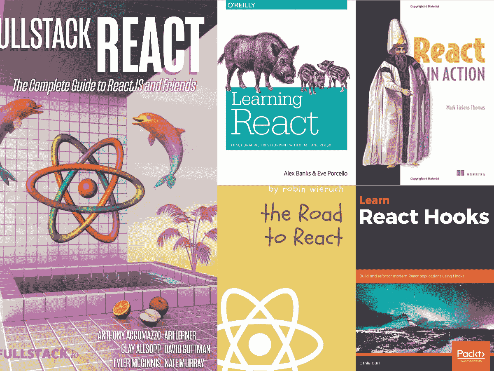
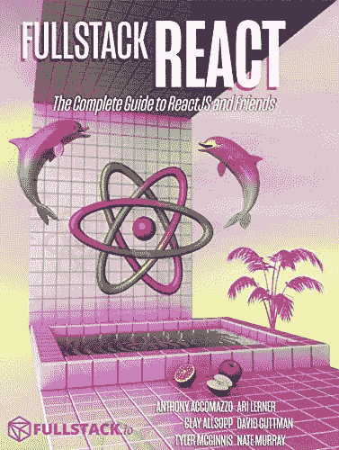
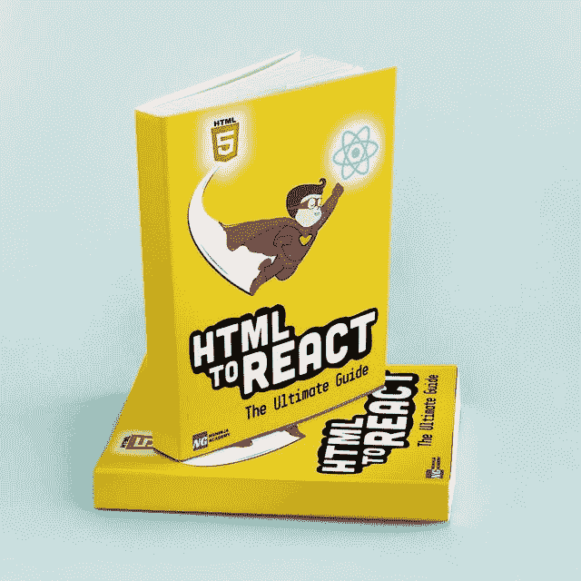
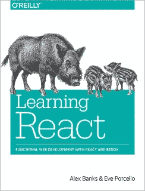
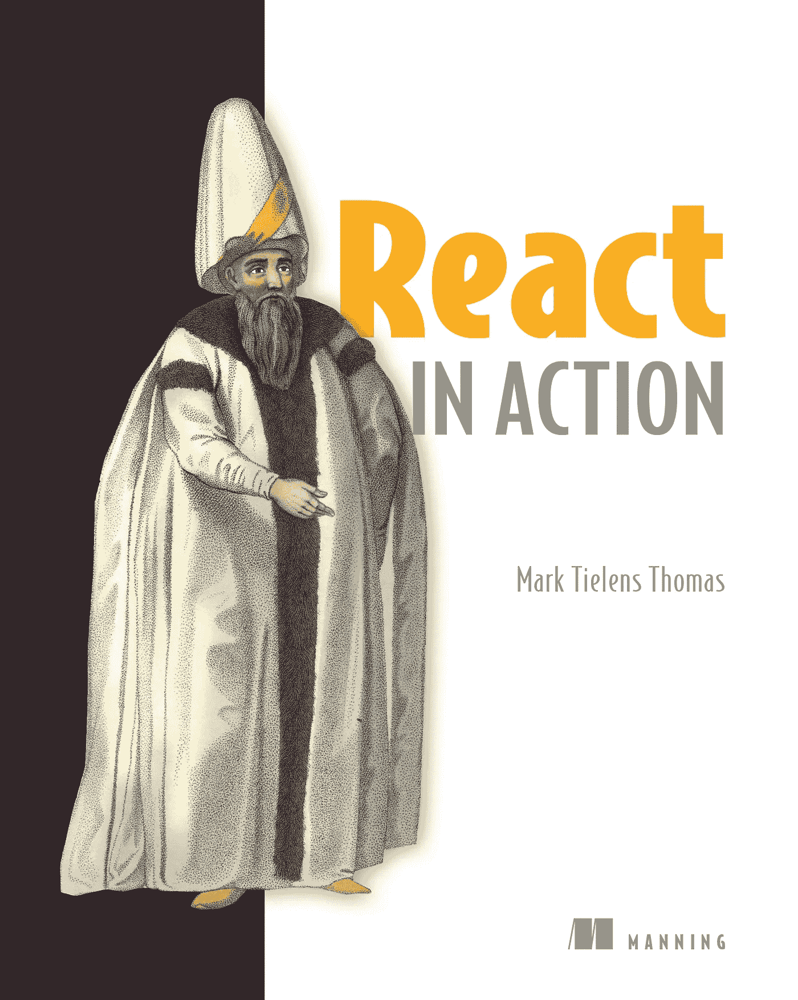
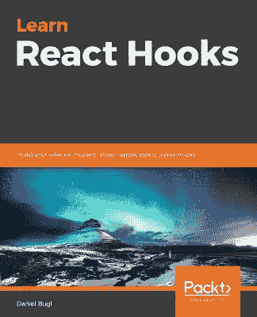

# 6 本适合初学者和有经验的 Web 开发人员的最佳 React.js 书籍

> 原文：<https://medium.com/javarevisited/5-best-react-js-books-for-beginners-and-experienced-web-developers-e7b90b1ab9d2?source=collection_archive---------0----------------------->

## 想深入学习 React.js？以下是 2023 年你能读到的最好的 React.js 书籍

[全栈反应](https://gumroad.com/a/934179955)

所以，你已经准备好迎接今天编码的最新热潮了。每个人都在谈论这个新的 [React.js](https://reactjs.org/) JavaScript 库，你想成为 React 社区的一员。

如果你想学习 React.js，那么你来对地方了。过去，我曾分享过 [**best Rect.js 课程**](/@javinpaul/top-5-courses-to-learn-react-js-in-2019-best-of-lot-fa02cd96cdf0?source=---------16------------------) 、[**React 开发者路线图**](/javarevisited/the-2019-react-js-developer-roadmap-9a8e290b8a56?source=collection_home---4------2-----------------------) 和 [React 教程](/javarevisited/top-10-free-courses-to-learn-react-js-c14edbd3b35f)，现在你正在考虑一本好书，让你继续学习 React 方法，从 React JavaScript 库构建组件。

你知道你的承诺是真实的，因为你不会被一本平均 750 页的技术书吓倒！或者，也许你是全新的，甚至不确定从哪里开始训练 [React JavaScript 编码](/javarevisited/10-javascript-frameworks-and-libraries-to-learn-in-2020-best-of-lot-5f61f86c60b4)。

没关系；今天的**五大 React.js 书籍**精选将带你从初级到中级再到高级的 React 开发话题。

在我们进入教学材料之前，让我们回顾一下我们正在谈论的内容，特别是关于使用 React 的 [JavaScript 编码](/javarevisited/10-best-online-courses-to-learn-javascript-in-2020-af5ed0801645)。

不过，如果你喜欢课程，那么你也可以从 Udemy 上 Maximillian 的 React 16- Complete Guide 课程开始，它不仅包括 React 挂钩，还包括其他基本的 React 概念。

 [## React 16:完整课程(包括 React 路由器 4 和 Redux)

### 投入其中，从头开始学习 React.js！学习 Reactjs、Hooks、Redux、React Routing、Animations、Next.js 等等！

udemy.com](https://click.linksynergy.com/fs-bin/click?id=JVFxdTr9V80&subid=0&offerid=323058.1&type=10&tmpid=14538&RD_PARM1=https%3A%2F%2Fwww.udemy.com%2Freact-the-complete-guide-incl-redux%2F) 

# JavaScript 是什么？

JavaScript 是一种嵌入在超文本标记语言(HTML)文档中的编码语言，使网页更加动态和用户友好。这是一个很好的定义，告诉你 JavaScript 允许网页访问者执行有趣的活动，比如按按钮和输入他们的电子邮件和地址。

当你访问你最喜欢的社交媒体或零售网页时，你可以选择浏览一下，然后买东西。 [JavaScript](/javarevisited/my-favorite-free-tutorials-and-courses-to-learn-javascript-8f4d0a71faf2) 是让这些功能成为可能的语言；否则，你会导航到一个网页，只看到静态的内容，这是没有乐趣的。

React 只是众多 [JavaScript (JS)库](/javarevisited/10-of-the-most-popular-javascript-frameworks-libraries-for-web-development-in-2019-a2c8cea68094)中的一个，用来让你与网页互动。现在，让我们找一本书来更深入地解释这一切。

而且，如果你想在学习 React.js 之前先学习 JavaScript，那么你可以随时查看 hen，我还建议你查看 [**完整的 JavaScript 课程 2023:构建真正的项目！Jonas Schmedtmann 在 Udemy 上的课程。**](https://click.linksynergy.com/deeplink?id=JVFxdTr9V80&mid=39197&murl=https%3A%2F%2Fwww.udemy.com%2Fcourse%2Fthe-complete-javascript-course%2F)

 [## 2023 年初学者学习的 14 门最佳 JavaScript 在线课程

### 对于初学者和有经验的 web 开发人员来说，最好的 JavaScript 在线课程值得你花费时间。还有…

medium.com](/javarevisited/10-best-online-courses-to-learn-javascript-in-2020-af5ed0801645) 

# 2023 年初学者学习 React.js 的前 6 本书

不浪费你更多的时间，这里是我列出的 2023 年学习 React.js 的最佳书籍。我也分享了一些课程来配合这本书进行一些积极的学习。

总的来说，我觉得从一本书和一门[课程](/javarevisited/top-10-online-courses-to-become-a-fullstack-web-developer-in-2020-d608a6b63232)中学习更好。这门课程提供了一个早期的开端，而这本书提供了更深入的知识。如果你愿意，你也可以选择那个型号来开始你的 React.js 之旅。

## 1.[全栈反应](https://gumroad.com/a/934179955)

一个明智的开发人员会希望对 web 开发有一个全面的了解。为了获得这一点，你应该使用一些其他的由经验丰富的专业人员使用的学科。

在本书中，您将从 Anthony Accomazzo、Nate Murray、Ari Lerner、Clay 奥尔索普、David Guttman 和 Tyler McGinnis 等专家那里学习 Full Stack React。几乎没有哪本书能让你有机会在一个地方向这么多专家学习。

这本书拓宽了我们对多种框架和采用全栈开发方式的理解。在理解了这篇重要文章中的主题后，你将成为一个自信的开发者。所有的贡献者都是受人尊敬的作者和开发人员，对许多语言和框架都有丰富的经验

**这里是购买这本书的链接**——[full stack React](https://gumroad.com/a/934179955)

如果你愿意，你也可以将这本书与 Udemy 上 Maximillian 的[**React 16-完全指南**](https://click.linksynergy.com/fs-bin/click?id=JVFxdTr9V80&subid=0&offerid=323058.1&type=10&tmpid=14538&RD_PARM1=https%3A%2F%2Fwww.udemy.com%2Freact-the-complete-guide-incl-redux%2F) 课程结合使用，该课程不仅涵盖了 React 挂钩，还涵盖了其他必要的 React 概念。

 [## React 16:完整课程(包括 React 路由器 4 和 Redux)

### 投入其中，从头开始学习 React.js！学习 Reactjs、Hooks、Redux、React Routing、Animations、Next.js 等等！

udemy.com](https://click.linksynergy.com/fs-bin/click?id=JVFxdTr9V80&subid=0&offerid=323058.1&type=10&tmpid=14538&RD_PARM1=https%3A%2F%2Fwww.udemy.com%2Freact-the-complete-guide-incl-redux%2F) 

顺便说一句，如果你喜欢这本书，你还可以在这里 免费下载一篇样章 [**。**](http://FullStack React)

## 2. [HTML 反应:终极指南](https://gumroad.com/a/172561523/dvfyN)

这是一本非常棒的书，适合那些正在努力学习 web 技术、想要学习 HTML 以及 Git、JavaScript 等工具的人。这本书将教你关于 web 开发的一切，让你像专家一样构建可伸缩的、生产就绪的 Web 应用程序。

这也是最值得推荐的 React 电子书之一，也是一个全面的学习指南，它将通过简单的课程、大量易于理解的示例、漂亮的插图和经过验证的路线图，教你成为一名自信的 web 开发人员所需知道的一切。

您将了解 ReactJS 的内容和原因、JSX、虚拟 DOM、函数与类组件、事件处理和双向绑定、组件生命周期、React 挂钩(useState、useEffect、useMemo、useRef、自定义挂钩、React 应用程序性能优化、React 悬念、React 中的好的和坏的实践、您需要了解的关于 GraphQL 的所有内容，等等

这本电子书有 400 多页有价值的内容。并且，作者会定期更新这本书。目前，这是第 3 版，你也可以免费获得新版本。

它还有 50 多个真实世界的项目想法和一堆你作为一个 Web 开发人员需要的清单。我强烈推荐这本书给任何想学习对 web 开发做出反应的人。

**以下是加入本课程的链接—** [HTML 反应:终极指南](https://gumroad.com/a/172561523/dvfyN)

如果你愿意，你也可以将这本书与 Coursera 的 [**全栈 Web 开发和 React 专业化**](https://coursera.pxf.io/c/3294490/1164545/14726?u=https%3A%2F%2Fwww.coursera.org%2Fspecializations%2Ffull-stack-react) 结合起来，在那里你将从零开始学习 React Web 开发。这本书很好地补充了那门课程。

 [## 使用 React 进行全栈 Web 开发

### 由香港科技大学提供。构建完整的 Web 和混合移动解决方案。主人…

coursera.pxf.io](https://coursera.pxf.io/c/3294490/1164545/14726?u=https%3A%2F%2Fwww.coursera.org%2Fspecializations%2Ffull-stack-react) 

## 3.[学习 React:使用 React 和 Redux 进行功能性 Web 开发](https://www.amazon.com/Learning-React-Functional-Development-Redux/dp/1491954620?tag=javamysqlanta-20)

初学者可能想通过这本书从高级 React 编码的激烈沉浸中退一步。作者认识到，一些新的开发者可能会被 React 材料的庞大规模和数量所吓倒，并创造了一种轻松融入社区的方式。他们首先带领初级开发人员浏览一个小型 JS 库和 Ecma International 开发的一些新 ECMAScript、JS。欧洲计算机制造商协会(ECMA)，一个跨国家和平台系统化技术的组织。

本书是向您介绍脸书和其他大型商业内容分销商所使用的 React 组件的标准。您访问的那些流行的网页是由 React 组件支持的。Alex 和 Eve 致力于对开发者和教育者做出反应。

**这里是了解本书更多信息的链接** — [学习 React:使用 React 和 Redux 进行功能性 Web 开发](https://www.amazon.com/Learning-React-Functional-Development-Redux/dp/1491954620?tag=javamysqlanta-20)

而且，如果你需要一门课程来搭配这本书，我强烈推荐 Max 或 Stephen Grider 的[**Modern React With Redux**](https://click.linksynergy.com/fs-bin/click?id=JVFxdTr9V80&subid=0&offerid=323058.1&type=10&tmpid=14538&RD_PARM1=https%3A%2F%2Fwww.udemy.com%2Freact-redux%2F)课程，它涵盖了 React 开发人员需要知道的一切，包括钩子。

 [## 现代反应与 Redux 培训课程

### 课程上次更新为 React v16.6.3 和 Redux v4.0.1！所有内容都是全新的！更新包括以下方面的详细视频…

udemyy.com](https://click.linksynergy.com/fs-bin/click?id=JVFxdTr9V80&subid=0&offerid=323058.1&type=10&tmpid=14538&RD_PARM1=https%3A%2F%2Fwww.udemy.com%2Freact-redux%2F) 

## 4.[罗宾·威鲁奇的《反应之路》](https://www.amazon.com/Road-learn-React-pragmatic-React-js-ebook/dp/B077HJFCQX?tag=javamysqlanta-20)

Robin Wieruch 写了许多关于 web 开发的入门书籍。这位德国作者是 JS 编程和 React 组件方面经验丰富的老手。

React 之路带领新开发人员构建一个 React 组件，演示如何向用户返回数据，这是 JS 语言最基本的操作之一。

这是一本开始扩展您构建和使用 React 组件的知识的好书。

这是购买这本书的链接——[罗宾·威鲁奇的《反应之路》](https://www.amazon.com/Road-learn-React-pragmatic-React-js-ebook/dp/B077HJFCQX?tag=javamysqlanta-20)

## 5.[马克·蒂伦斯·托马斯的《反应在行动》](https://www.amazon.com/React-Action-Mark-Tielens-Thomas/dp/1617293857?tag=javamysqlanta-20)

前端开发是 web 开发的关键部分。用户通过 React JS 在他们看到的页面上执行各种查询和购买。

[React in Action](https://www.amazon.com/React-Action-Mark-Tielens-Thomas/dp/1617293857?tag=javamysqlanta-20) 是开发者学习如何使网页具有动态性和连贯性，以便用户在导航到他们最喜欢的话题、社交兴趣或在线购物时能够获得无缝体验。

Mark 为学习型开发人员提供了大量实际操作 React 组件的经验。你将被介绍到生态系统和工具。你在 [HTML](/javarevisited/top-10-free-courses-to-learn-html-5-css-3-and-web-development-872d62d97a97) 和其他网络相关概念方面的经验将会派上用场，增加你对 [React](https://javarevisited.blogspot.com/2018/08/top-5-react-js-and-redux-courses-to-learn-online.html#axzz5r06B3egD) 的了解。

正文扩展了库、组件和 web 应用。你将了解专业网站开发的哲学。你甚至有机会探索移动设备的用户界面。

Mark 是另一位值得信赖的软件开发人员，拥有丰富的 React 经验。如果你愿意，你也可以将这本书与 Pluralsight 上的[**react . js:Getting Started**](https://pluralsight.pxf.io/c/1193463/424552/7490?u=https%3A%2F%2Fwww.pluralsight.com%2Fcourses%2Freact-js-getting-started)课程结合起来，这是一门由伟大的导师萨梅尔·布纳教授的伟大课程

 [## 反应:开始

### 课程概述大家好。我叫萨梅尔·布纳。我在 jsComplete 工作，我们在那里创造互动教育…

pluralsight.pxf.io](https://pluralsight.pxf.io/c/1193463/424552/7490?u=https%3A%2F%2Fwww.pluralsight.com%2Fcourses%2Freact-js-getting-started) 

## 6.丹尼尔·布格尔学习 React Hooks

熟悉编写 React 类的人可能会发现这本书很有帮助，因为它允许程序员放弃编写类，而使用更直接的方法与应用程序编程接口(API)进行交互。

开发人员能够创建 React 组件，这些组件使用钩子进行更无缝的交互。钩子允许 React 组件共享可重用的有状态逻辑。

作者 Daniel Bugl 是 React 社区中的一名成功的开发人员和开源贡献者。这本书平均价格在 40 美元左右，对于刚接触 React 的人来说可能有点挑战，但是有经验的 React 开发者会喜欢这本书。

这里是了解这本书更多信息的链接— [学习 React Hooks](https://www.amazon.com/Learn-React-Hooks-refactor-applications-ebook/dp/B07YZ9V9WW?tag=javamysqlanta-20)

而且，如果你需要一门课程来配合这本书，我强烈推荐你在 Udemy 上查看完整的 React Web Developer 课程。

 [## 完整的 React 开发人员课程(带 Hooks 和 Redux)

### 你以前有没有试着学过反应？很容易掉进图书馆和工具的兔子洞，结果却出来了…

udemy.com](https://click.linksynergy.com/fs-bin/click?id=JVFxdTr9V80&subid=0&offerid=323058.1&type=10&tmpid=14538&RD_PARM1=https%3A%2F%2Fwww.udemy.com%2Freact-2nd-edition%2F) 

作者 Andrew Mead 是一名[全栈开发人员](https://javarevisited.blogspot.com/2019/01/10-web-development-frameworks-fullstack-developer-should-learn.html)，也是一名出色的教师，他对所教授的主题有着深入的了解。这门课程真的很棒，也很实用，我向所有想成为使用 [React](http://javarevisited.blogspot.sg/2018/01/10-frameworks-java-and-web-developers-should-learn.html) 的专业 web 开发人员强烈推荐这门课程。

这是给初学者和有经验的 web 开发人员的最好的 React.js 书籍。对于开发人员来说，Javascript 可能是一门很难学的语言。然而，这些精选的书籍可以帮助你很快成为 React 方面的专家。

其他**编程文章和资源**你可能喜欢

*   [2023 年网络开发者路线图](https://javarevisited.blogspot.com/2019/02/the-2019-web-developer-roadmap.html)
*   [完整的 React 开发者路线图](https://javarevisited.blogspot.com/2018/10/the-2018-react-developer-roadmap.html)
*   【Java 和 Web 开发者应该学习的 10 个框架
*   [为有经验的开发者提供的 10 门免费 Java 课程](http://www.java67.com/2018/08/top-10-free-java-courses-for-beginners-experienced-developers.html)
*   [学习芯泉和 Spring Boot 的 5 门免费课程](http://www.java67.com/2017/11/top-5-free-core-spring-mvc-courses-learn-online.html)
*   [2023 年学习 Docker 的 10 门免费课程](http://www.java67.com/2018/02/5-free-docker-courses-for-java-and-DevOps-engineers.html)
*   [2023 年 React JS 开发者路线图](https://hackernoon.com/the-2018-react-js-roadmap-4d0a43814c02)
*   [面向 DevOps 工程师的五大免费 Kubernetes 课程](https://javarevisited.blogspot.com/2019/01/top-5-free-kubernetes-courses-for-DevOps-Engineer.html#axzz5d2bEyYmv)
*   [2023 年学习 Maven 和 Jenkins 的 5 门免费课程](http://www.java67.com/2018/02/6-free-maven-and-jenkins-online-courses-for-java-developers.html)
*   [面向程序员的 2023 年 DevOps 路线图](https://javarevisited.blogspot.com/2018/09/the-2018-devops-roadmap-your-guide-to-become-DevOps-Engineer.html)
*   Web 开发人员应该知道的 10 个 JavaScript 框架
*   [在线学习的 5 门最佳 React.js 课程](/javarevisited/5-best-react-js-books-for-beginners-and-experienced-web-developers-e7b90b1ab9d2)
*   [2023 年学习 React Native 的五大课程](/@javinpaul/top-5-react-native-courses-for-mobile-application-developers-b82febdf8a46?source=---------112------------------)
*   [5 本适合初学者的最佳 React.js 书籍](/javarevisited/5-best-react-js-books-for-beginners-and-experienced-web-developers-e7b90b1ab9d2)
*   [学习 React 钩子和上下文 API 的 10 门免费课程](/javarevisited/top-10-free-courses-to-learn-react-js-c14edbd3b35f)
*   [2023 年学习 Angular 和 React 的 10 门免费课程](/javarevisited/10-free-angular-and-react-js-courses-from-udemy-and-coursera-best-of-lot-e67f7d811e6b)

感谢您阅读本文。如果你喜欢这些免费的 Angular 和 React 课程，那么请分享给你的朋友和同事。如果您有任何问题或反馈，请留言。

**附言**——如果你喜欢从在线课程中学习，那么我也建议你去看看 Udemy 上 Maximillian 的[**React 16-完全指南**](https://click.linksynergy.com/fs-bin/click?id=JVFxdTr9V80&subid=0&offerid=323058.1&type=10&tmpid=14538&RD_PARM1=https%3A%2F%2Fwww.udemy.com%2Freact-the-complete-guide-incl-redux%2F) 课程。这是快速学习 React.js 的最佳课程之一

 [## React 16:完整课程(包括 React 路由器 4 和 Redux)

### 投入其中，从头开始学习 React.js！学习 Reactjs、Hooks、Redux、React Routing、Animations、Next.js 等等！

udemy.com](https://click.linksynergy.com/fs-bin/click?id=JVFxdTr9V80&subid=0&offerid=323058.1&type=10&tmpid=14538&RD_PARM1=https%3A%2F%2Fwww.udemy.com%2Freact-the-complete-guide-incl-redux%2F)