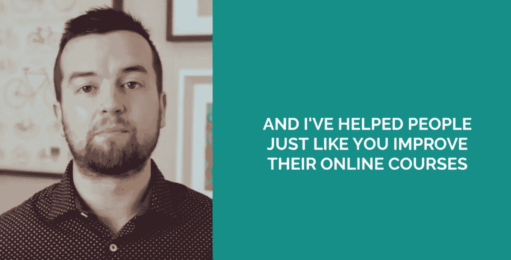

# 如何在 2022 年创建 Udemy 课程并获得被动收入【资源】

> 原文：<https://medium.com/javarevisited/5-best-resources-to-become-an-udemy-instructor-and-launch-your-online-training-courses-in-2021-658891abafec?source=collection_archive---------2----------------------->

## 如果你的目标之一是在 2022 年创建一个在线课程，那么这些资源可以帮助你实现它。

在 [Unsplash](https://unsplash.com?utm_source=medium&utm_medium=referral) 上 [NeONBRAND](https://unsplash.com/@neonbrand?utm_source=medium&utm_medium=referral) 拍摄的照片

在线培训课程让学习变得如此简单。他们负担得起，方便，随处可得。越来越多的程序员、博客作者和专家现在都在网上教学，所以现在互联网上有这么多高质量的课程可以学习几乎任何东西。

几年前，书籍和教程并不是学习新技能的主要资源，但在创建和销售在线课程方面，学习者和创作者仍有巨大的潜力。

**通过销售在线课程**，你每个月可以轻松赚到 10K 美元，更重要的是可以改变人们的生活。我一直倡导这一点，并与我的许多学生/读者合作[创建在线课程](https://javarevisited.blogspot.com/2019/06/why-programmers-should-create-and-sell.html#axzz5zt6Ca1vv)并积极鼓励他们在编程的同时建立可持续的在线业务。当你第一次这样做时，有很多疑问、问题和需要学习的东西，这是很自然的，这就是为什么我会收到很多关于如何创建在线课程的问题？*如何拍摄网络课程？*如何创建幻灯片？*我应该用哪个话筒录音？* *买哪种相机录上课？*哪个网络课程平台托管我的课程比较好？如何推广我的课程，等等。

在逐一回答这些问题时，我发现我一直在重复这样做，而且这些问题非常标准，那么为什么不创建一个 FAQ 来回答一个新的在线课程创建者或博客作者的所有问题呢？嗯，这是一个好主意，这项工作正在进行中，但在此之前，我想分享一些有用的资源，一个新的课程创建者，主要是一个程序员或技术人员，可以在创建一个在线课程之前浏览这些资源。一旦你完成了这个课程，你的大部分问题都将得到解答，你将拥有创建一个你一直想要的优秀在线课程所需的所有信息。

我也有目的地选择了激励性的课程。例如，这个列表中的第一个课程来自一位创作者，[菲尔·艾伯](https://click.linksynergy.com/deeplink?id=JVFxdTr9V80&mid=39197&murl=https%3A%2F%2Fwww.udemy.com%2Fuser%2Fphilipebiner2%2F)，他已经在 Udemy 赚了超过 100 万美元，也许更多。

 [## Phil Ebiner |顶级讲师，200 多万学生| Udemy

### 我来教你脱颖而出的必备技巧。无论是个人激情还是商业追求…

udemy.com](https://click.linksynergy.com/deeplink?id=JVFxdTr9V80&mid=39197&murl=https%3A%2F%2Fwww.udemy.com%2Fuser%2Fphilipebiner2%2F) 

他友好地分享了他在其他地方的数据和收入，如 [Teachable](http://sendmeto.teachable.com/lgrZW) 、[thinkfic](http://try.thinkific.com/javinpaul8817)、 [Podia](https://podia.sjv.io/c/3294490/1274189/15666?u=https%3A%2F%2Fwww.podia.com%2F) 、Skillshare、StackSocial 等。这种信息分享非常有激励性，但请注意，没有多少人能做到这一点。

**一旦你看到它是真实的，而不是骗局**并且有一种合法的方式不仅可以教授和启发学生，而且可以谋生，你就会全力以赴，那时你就会创造出你的学生会喜欢的最好的在线课程，你会为此感到自豪。

# 2022 年 Udemy 面向课程创建者、博客作者和讲师的前 5 名在线课程

在过去，我已经分享了几个帖子，建议程序员为什么应该创建一个在线课程(在这里阅读)，以及[何时使用 Udemy 和 Teachable](https://javarevisited.blogspot.com/2019/09/teachable-or-udemy-which-platform-is-best-online-course.html) 来托管你的在线课程(在这里阅读)。今天，我将分享一些最好的在线课程，你可以学习所有这些以及更多。

我们要明确一点，打造一门优秀的课程并不容易；你不仅需要成为一名主题专家，还需要知道如何使用最新技术，如动画视频、白板和其他技术，以引人入胜的方式展示信息。

你还需要知道如何以专业品质录制你的视频和音频，这样你的课程才能脱颖而出。所有这些都需要一些指导和知识，这就是这些课程的帮助所在。这些课程是由一些非常成功的在线课程创建者创建的，比如来自在线视频学校的 Phil Ebiner，他已经通过在线教学赚了超过 90 万美元。他们乐于分享他们的策略，你可以用这些策略来复制他们的成功。无论如何，不要再浪费你的时间了，这里有一些最好的在线课程，课程创建者和教师可以加入来提升他们的游戏水平，学习新的技术来创建令人敬畏的课程:

## 1. [Udemy Masters:学习在线课程创作—非官方](https://click.linksynergy.com/deeplink?id=JVFxdTr9V80&mid=39197&murl=https%3A%2F%2Fwww.udemy.com%2Fonline-course-masters%2F)

说到学习如何创建在线课程，这是我最喜欢的课程。在本课程中，广受欢迎的 Udemy instruct 网站 Phil Ebiner 将为您提供一步一步的提示，帮助您创建一个学生会喜欢的在线课程。

你将学到创建和销售在线课程所需的一切，如创意、验证、制作和推广。 [Phil](https://click.linksynergy.com/deeplink?id=JVFxdTr9V80&mid=39197&murl=https%3A%2F%2Fwww.udemy.com%2Fuser%2Fphilipebiner2%2F) 已经在网上做了超过 100 万次教学，他展示了他如何仅用 [Udemy](/javarevisited/10-best-udemy-online-courses-for-java-developers-4c9ab70cd01f) 就做了超过 77 万次的证明。这是一个令人印象深刻的数字，对于那些怀疑网上合法赚钱可能性的人来说，这是一个很大的激励。不仅如此，他给了你很多实用的技巧来创建一个成功的在线课程和业务。

从设备安装到课程宣传，你将学到一切。如果你只能参加一门课程，那就参加这门。

**这里是加入这个 Udemy 课程的链接**——[Udemy 大师:学习在线课程创作](https://click.linksynergy.com/deeplink?id=JVFxdTr9V80&mid=39197&murl=https%3A%2F%2Fwww.udemy.com%2Fonline-course-masters%2F)

## 2. [Udemy Mastery:如何每天创建一门课程！(非官方)](https://click.linksynergy.com/deeplink?id=JVFxdTr9V80&mid=39197&murl=https%3A%2F%2Fwww.udemy.com%2Fcourse%2Fudemy-mastery-how-to-create-1-course-per-day-unofficial%2F)

这是我在 Udemy 上发现的另一个令人兴奋的课程，用于创建在线课程和建立在线教学业务。导师商业英雄分享了一些非常酷的小技巧，让你每天都可以创建一个 Udemy 课程。嗯，这听起来太短了，但是他分享的技巧真的很酷，可以大大减少你制作和发布课程的时间。

从本课程中，我学到了很多关于[创建在线课程](/javarevisited/why-programmer-should-teach-online-as-side-hustle-ad6680783e1a)的知识，比如使用相同的幻灯片开始，并通过提问来吸引读者，我相信你也会发现很多有用的技巧，可以应用到你自己的在线课程中。

谈到社会证明，已经有超过 2400 名学生参加了这门课程，平均得分为 4.8，这是一个惊人的成绩，也说明了这门课程的质量。

**以下是加入本课程的链接** — [我的掌握:如何每天创建一门课程](https://click.linksynergy.com/deeplink?id=JVFxdTr9V80&mid=39197&murl=https%3A%2F%2Fwww.udemy.com%2Fcourse%2Fudemy-mastery-how-to-create-1-course-per-day-unofficial%2F)

## 3. [Udemy 被动收入课程创建(非官方)](https://click.linksynergy.com/deeplink?id=JVFxdTr9V80&mid=39197&murl=https%3A%2F%2Fwww.udemy.com%2Fcourse%2Fudemy-masterclass-passive-income%2F)

这是我推荐你参加的另一个课程，如果你想创建一个在线课程，并想把它放在 Udey 上，那么你应该这样做，因为这是在线课程的最佳平台。在这门课程中，讲师和课程创建者 [Loise Croft](https://click.linksynergy.com/deeplink?id=JVFxdTr9V80&mid=39197&murl=https%3A%2F%2Fwww.udemy.com%2Fuser%2Flouisecroft%2F) 非常坦率地表示她从她的 Udemy 课程中获得了全职收入，并分享了她从第一门课程学到的一切。

你会了解到你的课程的创意、规划、课程设置、拍摄、剪辑、创建缩略图、定价、推广，这样你就可以获得一份被动收入，也就是她现在所做的。她在睡梦中赚钱，环游世界，只要有无线网络，她就创建一个在线课程，然而就是这么简单，我真的很喜欢她关于她失败课程的透明度，以及你可以从一个课程中赚多少钱。

**以下是加入本课程的链接** — [我的被动收入课程创作(非官方)](https://click.linksynergy.com/deeplink?id=JVFxdTr9V80&mid=39197&murl=https%3A%2F%2Fwww.udemy.com%2Fcourse%2Fudemy-masterclass-passive-income%2F)

## 4.[如何创建、营销&销售在线课程](https://click.linksynergy.com/deeplink?id=JVFxdTr9V80&mid=39197&murl=https%3A%2F%2Fwww.udemy.com%2Fcourse%2Fhow-to-create-market-and-sell-online-courses%2F)

在本课程中，丹尼尔·斯科特详细介绍了他每月赚 10 万美元的步骤**、**创建和销售在线课程。令人印象深刻，对吧？向像丹尼尔这样的专家学习真的能决定你课程的成败。

Dan 是一名全职在线课程讲师，在本次培训中，他将向您展示成功开办您自己的第一门课程的最佳方法。

这个培训面向的是以前从未创建过在线课程的人，不需要以前的经验。Dan 已经创建了超过 22 门在线课程，本课程将带你完成开发和启动一门成功课程的个人步骤。

**这是加入这一精彩课程的链接**——[如何创建、营销&销售在线课程](https://click.linksynergy.com/deeplink?id=JVFxdTr9V80&mid=39197&murl=https%3A%2F%2Fwww.udemy.com%2Fcourse%2Fhow-to-create-market-and-sell-online-courses%2F)

## 5.[建立一个六位数的销售在线课程的在线企业](https://click.linksynergy.com/deeplink?id=JVFxdTr9V80&mid=39197&murl=https%3A%2F%2Fwww.udemy.com%2Fcourse%2Fcreate-and-sell-your-own-online-course%2F)

这是 Udemy 上的另一门优秀课程，它将教你如何通过创建和销售在线课程来建立一个六位数的在线业务。

本课程的讲师 [Eli Natoli](https://click.linksynergy.com/deeplink?id=JVFxdTr9V80&mid=39197&murl=https%3A%2F%2Fwww.udemy.com%2Fuser%2Feli-natoli%2F) 是一位专注于服务的营销策略师、国际演说家和畅销书作家。就 Udemy 本身而言，她有 8000 多名学生和 5 门课程，所以她很在行。这门课程有很多好东西要学，但我特别喜欢她关于销售在线课程的建议，这往往是最具挑战性的部分。

她解释了不同的选择，如在线市场、在线课程托管平台和自托管 WordPress 网站，以及它们各自的优缺点。

**这是参加本课程的链接**——[打造六位数的在线业务销售在线课程](https://click.linksynergy.com/deeplink?id=JVFxdTr9V80&mid=39197&murl=https%3A%2F%2Fwww.udemy.com%2Fcourse%2Fcreate-and-sell-your-own-online-course%2F)

对于课程创建者和教师来说，这也是一些最好的在线课程。如果你想在 2022 年创建一门在线课程，我强烈推荐你加入这些课程，学习创建在线课程的 hos 实用秘诀。

这些课程涵盖一切，从选择主题到验证想法、创建课程到设计测验、拍摄课程到在线主持，最重要的是，如何在不同的平台上推广和[销售你的课程](https://hackernoon.com/5-online-teaching-and-coaching-platforms-for-course-creators-and-bloggers-3lfj302n)。

今年，我发布了[我的第一本电子书](https://gumroad.com/l/QqjGH)和[我的第一门 Udemy 课程](https://www.udemy.com/course/spring-professional-practice-test-questions-vmware-edu-certification/?couponCode=30DAYPROMO)，我对在线教学提供的潜力和机会非常感兴趣，如果你也热爱教学，建议你尽早创建一门在线课程。

其他**编程资源**你可能喜欢查

*   [托管和销售您的课程的五大在线平台](https://javarevisited.blogspot.com/2020/03/top-5-websites-to-create-online-courses.html)
*   [可教性 vs 思想性 vs 隐蔽性复习](https://javarevisited.blogspot.com/2019/09/teachable-or-udemy-which-platform-is-best-online-course.html)
*   [2022 年 Java 开发者路线图](https://javarevisited.blogspot.com/2019/10/the-java-developer-roadmap.html)
*   [2022 年 React 开发者路线图](https://javarevisited.blogspot.com/2018/10/the-2018-react-developer-roadmap.html)
*   [为什么软件开发人员应该创建在线课程作为副业](https://dev.to/javinpaul/why-sofware-developers-should-create-online-courses-as-a-side-hustle-3011)
*   [2022 年学习 Python 的十大课程](/better-programming/top-5-courses-to-learn-python-in-2018-best-of-lot-26644a99e7ec)
*   [面向 Java 和 DevOps 工程师的 5 门免费 Docker 课程](http://www.java67.com/2018/02/5-free-docker-courses-for-java-and-DevOps-engineers.html)
*   [学习 Ruby 编程的前 5 门课程](https://www.java67.com/2018/02/5-free-ruby-and-rails-courses-to-learn-online.html)
*   [2022 年学习 JavaScript 的十大课程](https://javarevisited.blogspot.com/2018/06/top-10-courses-to-learn-javascript-in.html)
*   [2022 年学习 Swift 编程的前 5 门课程](https://javarevisited.blogspot.com/2019/01/top-5-ios-developer-course-to-learn-ios.html)
*   [2022 年学习 Spring Boot 的 10 门课程](/javarevisited/top-10-courses-to-learn-spring-boot-in-2020-best-of-lot-6ffce88a1b6e)
*   [为网络开发人员提供的 5 门免费 JavaScript 课程](http://www.java67.com/2018/04/top-5-free-javascript-courses-to-learn.html)
*   [学习 Java 编程的 5 门免费课程](https://javarevisited.blogspot.com/2018/05/top-5-java-courses-for-beginners-to-learn-online.html)
*   [2022 年学习 C 编程的前 5 门课程](https://javarevisited.blogspot.com/2019/11/top-5-courses-to-learn-c-programming-in.html)

感谢您阅读本文。如果你找到了这些成功创建在线课程的资源，请与你的朋友和同事分享。如果您有任何问题或反馈，请留言。

**P. S. -** Teachable 和 Udemy 并不是唯一可以托管和销售在线课程的平台。还有更多选项，如[**thinkfic**](http://try.thinkific.com/javinpaul8817)， [**Podia**](https://podia.sjv.io/c/3294490/1274189/15666?u=https%3A%2F%2Fwww.podia.com%2F) ， [Teachable](https://sendmeto.teachable.com/lgrZW) ，Kajabi，Skillshare 等等。你甚至可以将你的课程发布到多个平台上，从而两全其美。

 [## 利用排名第一的在线课程平台:Thinkific 创建、营销和销售

### 获得推广业务、销售课程和…所需的所有营销工具、集成和支付选项

try.thinkific.com](http://try.thinkific.com/javinpaul8817)