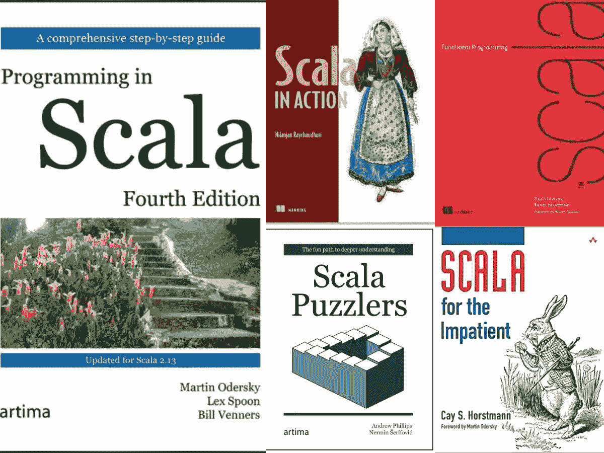
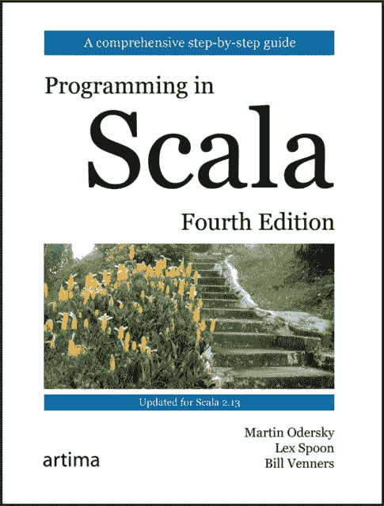
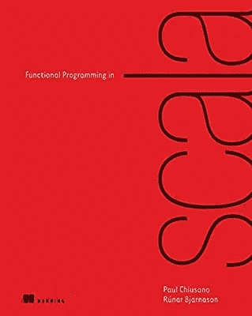
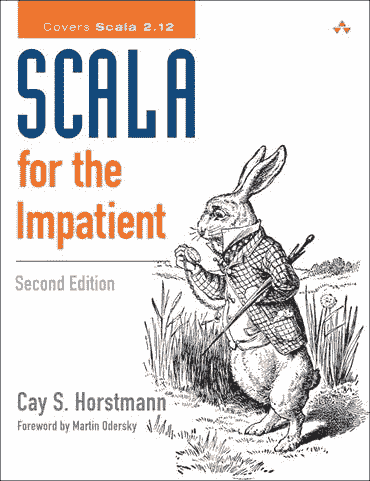
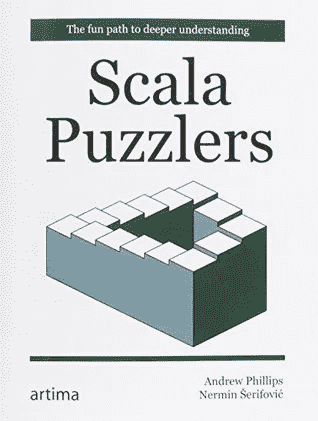
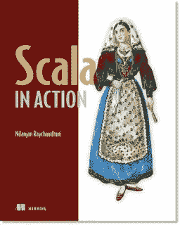

# 2023 年学习的 5 本最好的 Scala 和函数式编程书籍

> 原文：<https://medium.com/javarevisited/5-best-scala-and-functional-programming-books-to-learn-in-2021-97ec9e56f2bd?source=collection_archive---------0----------------------->

## 2023 年要学 Scala 和函数式编程吗？如果是的话，这些是你在 2023 年可以阅读的学习 Scala 的最佳书籍

大家好，如果你想在 2023 年学习 Scala 和函数式编程，并寻找最好的书籍和课程，那么你来对地方了。前面我分享了[为什么 Java 开发者要学习 Scala](/javarevisited/why-java-developer-should-learn-scala-programming-in-2020-3ca01a47eb0d) 以及面向 Java 开发者的 [**最佳 Scala 课程**](/javarevisited/10-best-scala-and-functional-programming-online-courses-for-beginners-b6461b27bf) ，而在这篇文章中，我将分享 2023 年面向初学者的**最佳 Scala 书籍**。

Scala 是相对较新的编程语言之一，它包含了许多编程语言的最佳实践。 [Scala](https://javarevisited.blogspot.com/2018/01/10-reasons-to-learn-scala-programming.html) 最大的优势在于它提供了[面向对象编程](/javarevisited/my-favorite-courses-to-learn-object-oriented-programming-and-design-in-2019-197bab351733?source=---------103------------------)和[函数式编程](/javarevisited/8-best-lambdas-stream-and-functional-programming-courses-for-java-developers-3d1836a97a1d)的完美融合。

因此，您不仅可以为最大的代码重用和可扩展性构建优雅的类层次结构，还可以使用*高阶函数*实现它们的行为。

它有一个简洁的语法，没有太多的仪式，这也使它成为脚本的理想选择，但不要低估它的力量。像 Java 一样，Scala 也被 Twitter、LinkedIn 和 Intel 等技术巨头用于关键任务应用。

说实话**，学习 Scala 并不容易**，即使对于有经验的 Java 程序员来说也是如此。当我开始[学习 Scala](/javarevisited/7-free-scala-and-functional-programming-courses-for-beginners-370f3cd41a4e) 时，语法对我来说看起来很不一样。习惯了 [Java](https://javarevisited.blogspot.com/2018/05/top-5-java-courses-for-beginners-to-learn-online.html) 的冗长风格，Scala 的简洁对我来说看起来很神秘，但是一旦我了解到，这种简洁是我最喜欢的。

学习 Scala 的另一个挑战是学习函数式编程概念，如单子、lambdas 等。由于我从未使用过像 Haskel 和 Lisp 这样的函数式编程语言，这对我来说太难了。当我在函数式编程方面取得一些进展时，我甚至停止学习 Scala 几个星期，然后重新开始。这就是为什么在这份学习 Scala 的最佳书籍列表中，我还加入了一本关于使用 Scala 进行函数式编程的书。

尽管网上有很多免费资料，甚至 Scala 文档也是学习 Scala 的绝佳来源，但我发现从书中学习是学习新编程语言的最佳方式，但如果你喜欢在线课程，那么你可以查看一下 [**摇滚 JVM！Udemy 上的 Scala 和函数式编程初学者**](https://click.linksynergy.com/fs-bin/click?id=JVFxdTr9V80&subid=0&offerid=323058.1&type=10&tmpid=14538&RD_PARM1=https%3A%2F%2Fwww.udemy.com%2Frock-the-jvm-scala-for-beginners%2F) 课程。

 [## Scala &面向初学者的函数式编程|震撼 JVM

### 在本课程中，我们将学习 Scala 和函数式编程的基础知识，这是软件领域两个非常热门的话题

udemy.com](https://click.linksynergy.com/fs-bin/click?id=JVFxdTr9V80&subid=0&offerid=323058.1&type=10&tmpid=14538&RD_PARM1=https%3A%2F%2Fwww.udemy.com%2Frock-the-jvm-scala-for-beginners%2F) 

# 2023 年面向初学者的前 5 本 Scala 和函数式编程书籍

以下是我列出的 2023 年学习 Scala 和函数式编程的最佳书籍。你可以从列表中的第一本书开始学习 Scala 编程概念，然后通过使用列表中的第二本书学习更有用的函数式编程概念。

*如果你真的想掌握 Scala* 你至少应该读这两本书，因为第二本书将向你展示如何使用函数式编程概念来解决现实世界的问题，如果你正在寻找一份 Scala 开发工作，这是一项非常有用的技能。

很多程序员认为仅仅学习像 **case 类**、 **traits** 、 **scala collection** 、 **optional** 这样的 scala 基础知识就足以获得一份 scala 程序员的工作，但事实并非如此。

如果你真的想成为一名 Scala 开发者，你必须理解函数式编程的概念，比如映射(map)、[归约(reduce)](https://www.java67.com/2016/09/map-reduce-example-java8.html)、折叠(fold)、[平面映射(flat map)](http://www.java67.com/2016/03/how-to-use-flatmap-in-java-8-stream.html)、单子(monads)以及 [lambda](/javarevisited/7-best-java-tutorials-and-books-to-learn-lambda-expression-and-stream-api-and-other-features-3083e6038e14?source=---------14------------------) 。仅仅学习 Scala 基础知识不足以在 Twitter、Linked In 或 Intel 上找到一份 Scala 编程工作。

不管怎样，现在让我们从书开始:

## 1.Scala 编程，第四版

这是迄今为止学习 Scala 的最佳书籍，尤其是对 Java 开发人员而言。拥有一个 Scala 编程语言的设计者，Martin Odersky，作为这本书的合著者，确实有助于在概念上提供更多的深度。

该书的第 1 版和第 2 版获得了巨大的成功，修订后的第 3 版涵盖了 Scala 2.12。这个第四版更新了整本书，增加了新的内容来涵盖 Scala 2.13 的变化，尤其是对集合的全面检查。

你可以把这本书作为参考，因为它提供了所有 Scala 概念和特性的全面覆盖。它还讨论了 Scala 和 Java 之间的相似之处和不同之处，这使得这本书对于有经验的 Java 程序员来说更有价值。

**这里是购买这本最好的 Scala 书籍的链接**——[Scala 编程，第四版](https://www.amazon.sg/Programming-Scala-Fourth-Martin-Odersky-dp-098153161X/dp/098153161X?tag=javamysqlanta-20)

简而言之，Martin Odersky、Lex Spoon 和 Bill Venners 的《Scala 第三版编程》是 Scala 程序员的必读书籍，如果你想学得更好，可以将这本书与[**Rock JVM 结合起来！Udemy 上的 Scala 和函数式编程初学者**](https://click.linksynergy.com/fs-bin/click?id=JVFxdTr9V80&subid=0&offerid=323058.1&type=10&tmpid=14538&RD_PARM1=https%3A%2F%2Fwww.udemy.com%2Frock-the-jvm-scala-for-beginners%2F) 课程。

 [## Scala &面向初学者的函数式编程|震撼 JVM

### 在本课程中，我们将学习 Scala 和函数式编程的基础知识，这是软件领域两个非常热门的话题

udemy.com](https://click.linksynergy.com/fs-bin/click?id=JVFxdTr9V80&subid=0&offerid=323058.1&type=10&tmpid=14538&RD_PARM1=https%3A%2F%2Fwww.udemy.com%2Frock-the-jvm-scala-for-beginners%2F) 

## 2.Scala 中的函数式编程

刚开始学 Scala 的时候，对我来说最有挑战性的部分是函数式编程概念，像单子，lambdas，carrying 等等。

尽管最初因为 Scala 语法非常简洁，可读性较差而与之斗争，但 FP 概念一直困扰着我，直到我阅读了保罗·丘萨诺和罗纳·比雅纳松的《Scala 第一版函数式编程》。

这是学习函数式编程概念的最好的书籍之一*不考虑语言。即使你不是在学习 Scala，你也可以阅读这本书来刷新或学习函数式编程的习惯用法和思想。*

*它通过引导你完成练习来教授 Scala 和函数式编程，在这些练习中，你将会发现 Scala 库的关键特性。*

***这里是购买这本 Scala 书籍**——[Scala 中的函数式编程](https://www.amazon.com/Functional-Programming-Scala-Paul-Chiusano/dp/1617290653/?tag=javamysqlanta-20)的链接*

**

*这本书的一个缺点是，关于如何使用函数式编程解决现实问题的例子或插图不多，所以我推荐同时阅读“[Advanced Analytics with Spark](https://www.amazon.com/Advanced-Analytics-Spark-Patterns-Learning/dp/1491912766/?tag=javamysqlanta-20)”。这两本书互为补充。*

## *3.不耐烦的 Scala*

*让我先声明，我是凯西·霍斯特曼的超级粉丝。在阅读了他的《住院病人 Java 8》和《核心 Java》第一卷和第二卷之后，我确信《不耐烦的 Scala》将会是一本很棒的书。*

*这本书的第一版取得了巨大的成功，现在你有了凯·s·霍斯特曼的《不耐烦的 Scala》的第二版。修订后的第二版涵盖了 Scala 2.12 和当前的 Scala 用法。这本书是为有经验的 [Java](/javarevisited/top-5-java-online-courses-for-beginners-best-of-lot-1e1e240a758) 、 [C++](/javarevisited/top-10-courses-to-learn-c-for-beginners-best-and-free-4afc262a544e) 、或 [C#程序员](/javarevisited/5-best-c-c-sharp-programming-courses-for-beginners-in-2020-494f7afc7a5c)而写的，他们是 Scala 或[函数式编程](http://www.java67.com/2015/07/5-books-learn-java-8-functional-programming.html)的新手。*

*这本书介绍了开始用 Scala 编码时你需要知道的关键 Scala 概念和技术。这是对这门语言的完美介绍，尤其是对于那些缺乏耐心的读者，他们希望学习 Scala 的基础知识，以便能够快速提高工作效率。*

***这里是购买这本最好的 Scala 书籍的链接**——[Scala 给没有耐心的人](http://www.amazon.com/dp/0321774094/?tag=javamysqlanta-20)*

**

## *4.斯卡拉难题*

*这本书类似于 Neil Gafter 和 Joshua Bloch 的《Java 难题》。我喜欢这种文本，因为它有助于您通过展示边角案例来深入学习编程语言。*

*这本书的标题，“**通向更深理解的有趣途径，”**最终证明了内容的合理性。简而言之，Andrew Phillips 和 ner min erifovi 的《Scala Puzzlers》是有经验的 Scala 程序员的必读书籍。*

*尽管您已经使用 Scala 好几年了，但是您肯定会学到一些东西。*

***这里是购买这本 Scala 书籍的链接**——[Scala puzzles](https://www.amazon.com/Scala-Puzzlers-Andrew-Phillips/dp/0981531679/?tag=javamysqlanta-20)*

**

## *5.Scala 的实际应用*

*我读过很多动作系列的书，像《JUnit 在行动》、《冬眠在行动》、《T2 春天在行动》等，我相信这本书也会完整地保留这个传统。书中充满了例子，并通过采用如何在 Scala 方法中做到这一点，教你许多日常任务。

这本书涵盖了 Scala 2.10，最后一次更新是在 2013 年，所以现在有点过时了，但你仍然可以用它来学习核心，Scala 的。*

*亲身实践的例子是这本书的基本优点。它还将教你如何使用 Java 和 Scala 开源库，调试，以及用 Scala 进行测试驱动的开发。*

***这里是购买这本全面的 Scala 书籍**——[Scala 在行动](http://www.amazon.com/dp/1935182757/?tag=javamysqlanta-20)的链接*

**

*以上是关于学习 Scala 和函数式编程的一些最好的书籍。学习 Scala 最大的好处是你将获得两个世界的精华，比如面向对象技术和函数式编程。

说实话，Scala 的学习曲线有点难，尤其是如果你来自 Java 背景，并且从未使用过任何函数式编程语言，如 [Haskell](/javarevisited/5-best-haskell-programming-courses-to-learn-online-d9849335a5c) 或 Lisp，但是，一旦你跨越了那个障碍，你就会爱上你开始学习 Scala 时讨厌的东西，如语法。*

*因此，祝 Scala 一切顺利，有更好的工作和更高的薪水。

**进修**
[Scala:入门](https://pluralsight.pxf.io/c/1193463/424552/7490?u=https%3A%2F%2Fwww.pluralsight.com%2Fcourses%2Fscala-getting-started)
[学以致用:Scala](https://click.linksynergy.com/fs-bin/click?id=JVFxdTr9V80&subid=0&offerid=323058.1&type=10&tmpid=14538&RD_PARM1=https%3A%2F%2Fwww.udemy.com%2Flearn-by-example-scala%2F)
[摇滚 JVM！Scala 与函数式编程初学者](https://click.linksynergy.com/fs-bin/click?id=JVFxdTr9V80&subid=0&offerid=323058.1&type=10&tmpid=14538&RD_PARM1=https%3A%2F%2Fwww.udemy.com%2Frock-the-jvm-scala-for-beginners%2F)

其他**我推荐的书籍**你可能喜欢去探究*

*   *[2023 年学习 Spring 框架的前 5 本书](http://www.java67.com/2016/12/5-spring-framework-books-for-java-programmers.html)*
*   *[2023 年学习核心 Java 的前 5 本书](http://javarevisited.blogspot.sg/2017/02/top-5-core-java-books-for-beginners.html)*
*   *[我最喜欢的书学习 Spring Boot 和春云](/hackernoon/top-5-spring-boot-and-spring-cloud-books-for-java-developers-75df155dcedc?source=---------23------------------)*
*   *[程序员最好的 10 本算法书](http://www.java67.com/2015/09/top-10-algorithm-books-every-programmer-read-learn.html)*
*   *[学习 Linux 和 UNIX 基本技能的 10 本书](http://javarevisited.blogspot.sg/2017/01/top-10-unix-and-linux-system-programming-books-best-of-lot-must-read.html)*
*   *[学习 REST 和 RESTful Web 服务的 5 本书](http://javarevisited.blogspot.sg/2017/02/top-5-books-to-learn-rest-and-restful-web-services-in-java.html)*
*   *[提高你的编码技能的 5 本书](http://www.java67.com/2016/02/5-books-to-improve-coding-skills-of.html)*
*   *[每个 Java 开发人员都应该阅读的 10 本最佳书籍](/swlh/top-10-java-books-for-programmers-all-time-great-82b0ee0b831a?source=---------126------------------)*
*   *每个程序员都应该读的 10 本书*
*   *[面向有经验开发人员的 5 本高级 SQL 书籍](http://www.java67.com/2017/02/2-best-books-to-learn-hibernate-for-Java-Developers.html)*
*   *[掌握 Java 编程语言的 10 本书](http://www.java67.com/2017/01/12-advanced-java-programming-books-for-experienced-programmers.html)*

***附言——**如果你正在寻找一份 Scala 的工作，你可能想练习一些常见的 Scala 面试问题，这些问题已经被很多公司要求了。你可以在这里查看它们[，如果你需要一些学习 Scala 的在线课程，可以查看](http://javarevisited.blogspot.sg/2017/03/top-30-scala-and-functional-programming.html) [**摇滚 JVM！Udemy 上的 Scala 和函数式编程初学者**](https://click.linksynergy.com/fs-bin/click?id=JVFxdTr9V80&subid=0&offerid=323058.1&type=10&tmpid=14538&RD_PARM1=https%3A%2F%2Fwww.udemy.com%2Frock-the-jvm-scala-for-beginners%2F) 课程。*

* [## Scala &面向初学者的函数式编程|震撼 JVM

### 在本课程中，我们将学习 Scala 和函数式编程的基础知识，这是软件领域两个非常热门的话题

udemy.com](https://click.linksynergy.com/deeplink?id=JVFxdTr9V80&mid=39197&murl=https%3A%2F%2Fwww.udemy.com%2Fcourse%2Frock-the-jvm-scala-for-beginners%2F)*