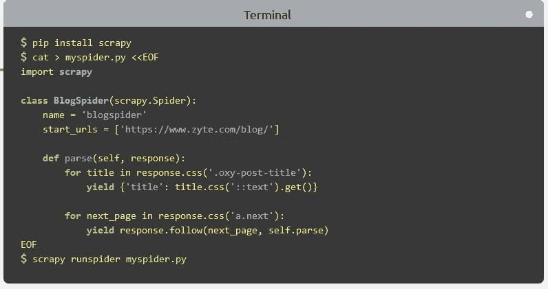
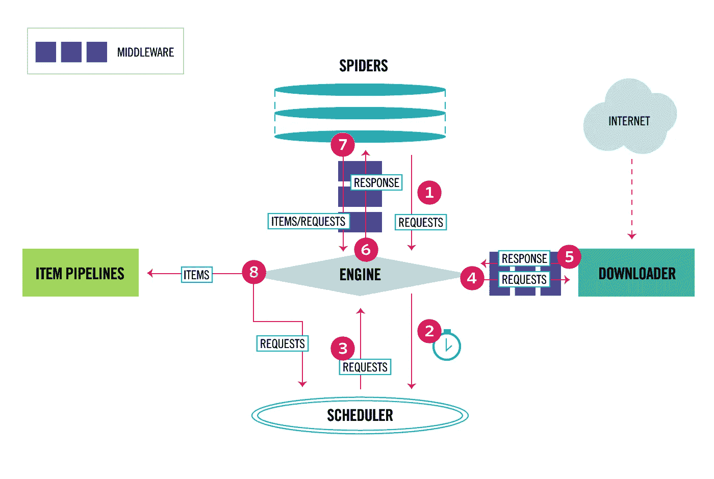
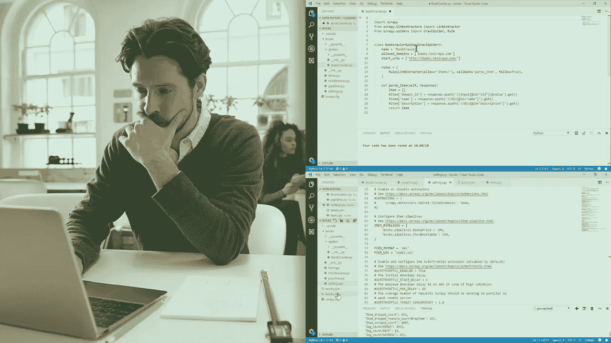

# 2023 年 Python 开发者学习 Scrapy 的 5 门最佳课程

> 原文：<https://medium.com/javarevisited/5-best-scrappy-online-courses-for-python-developers-df8873563441?source=collection_archive---------1----------------------->

## Scrappy 是一个用于网络爬行的快速而强大的 python 库，这些是初学者在 2023 年学习 Scrappy 的最佳课程。

image_credit — Scrappy

大家好，网页抓取是一项有用的技能，你可以用它来做很多不同的项目。例如，您可以使用 web scraping 来查找两国之间最便宜的航班、最便宜的酒店和度假套餐。

[Python](/better-programming/top-5-courses-to-learn-python-in-2018-best-of-lot-26644a99e7ec) 让从网站抓取数据并存储变得容易。还有许多内置的[工具](https://javarevisited.blogspot.com/2020/06/top-5-web-scrapping-tools-best-of-lot.html)可以进行网页抓取和抓取，其中一个最好的工具叫做 **Scrapy** 。这个工具是用 [python 编写的免费开源工具，用于网络抓取](https://www.java67.com/2020/07/top-5-courses-to-learn-web-scraping-in-python-and-javascript.html)和爬行目的，你可以用它从任何网站提取数据。当下载网页、提取数据并将数据存储到数据库时，你可以将这个神奇的[工具](https://javarevisited.blogspot.com/2020/06/top-5-web-scrapping-tools-best-of-lot.html)视为一个完整的框架。

如果你已经知道 [Scrapy](https://scrapy.org/) 并且正在寻找学习 Scrapy 的最佳在线课程，那么你来对地方了。在这篇文章中，我将分享 2023 年学习 Scrapy 的**最佳在线课程**。

学习 Scrapy 或 web crawling 是一项很好的技能，许多高薪工作都需要这项技能，如数据科学工程总监数据工程，以及更多需要这项技能的工作，有些工作的年薪从 2.5 万美元到 20 万美元以上不等。

所以如果你想在这些行业中有一份工作，你必须学习 Scrapy，然后你可以加入这些在线课程，从 [Udemy](/javarevisited/top-15-java-and-spring-framework-courses-from-udemy-best-of-lot-d7b965b62a9f) 和 [Pluralsight](https://javarevisited.blogspot.com/2020/08/top-10-pluralsight-courses-to-learn-React.js.html) 学习使用 [Python](/javarevisited/top-10-courses-to-learn-python-for-web-development-in-2020-best-of-lot-efe11fb6d212) 和 [Scrapy](https://javarevisited.blogspot.com/2020/06/top-5-web-scrapping-tools-best-of-lot.html) 进行网络抓取。

# 2023 年面向初学者的 5 门最佳在线课程

在不浪费你更多时间的情况下，这里有一个最好的在线课程列表，你可以学习使用 [Python](/javarevisited/10-free-python-tutorials-and-courses-from-google-microsoft-and-coursera-for-beginners-96b9ad20b4e6) 进行 web 抓取和爬行，特别是使用 Scrapy，这是最流行的 Web 抓取 Python 库之一。

这些课程不仅会教你 Python 和 SCrapy 的网络抓取基础知识，还会教你一些先进的技术和工具，让你的蜘蛛以安全的方式在线运行和托管，这对任何企业或项目都是必不可少的。

## 1. [Scrapy:强大的网页抓取&用 Python 爬行](https://click.linksynergy.com/deeplink?id=JVFxdTr9V80&mid=39197&murl=https%3A%2F%2Fwww.udemy.com%2Fcourse%2Fscrapy-tutorial-web-scraping-with-python%2F)

这个十个小时的课程可能是学习使用 Python 和 Scrapy 框架进行 web 抓取和 web 爬行的最大课程，从初学者到这些技术的高级水平，并将这些知识应用于现实生活中的问题。

在本课程中，您将学到:

*   建立一个网络蜘蛛和爬虫。
*   在其他框架中使用 Scrapy。
*   将数据存储在数据库中。

你将首先看到如何建立一个网络蜘蛛，然后添加一些先进的功能。之后，您将在一个名为 **ScrapingHub** 的平台上部署您的程序，并从那里运行它。

然后你将看到如何使用 Scrapy 框架和其他工具，如 Selenium 和 Splash 来构建一个网络爬虫，并将它存储在你的数据库中。

**这里是加入本课程的链接** — [Scrapy:强大的网络抓取&用 Python 爬行](https://click.linksynergy.com/deeplink?id=JVFxdTr9V80&mid=39197&murl=https%3A%2F%2Fwww.udemy.com%2Fcourse%2Fscrapy-tutorial-web-scraping-with-python%2F)

## 2. [Scrapy: Python 网页抓取&适合初学者的抓取](https://click.linksynergy.com/deeplink?id=JVFxdTr9V80&mid=39197&murl=https%3A%2F%2Fwww.udemy.com%2Fcourse%2Fscrapy-python-web-scraping-crawling-for-beginners%2F)

如果你想了解网站蜘蛛和爬行是如何工作的，并使用 python 创建自己的网站，并在一个程序中处理存储在数据库中的数据，那么你可以在 udemy 上看到这个四小时的课程。你将开始介绍 Scrapy 框架和网络爬行，以及它们如何工作，如何安装完成工作所需的工具。

接下来，你将使用 python 和 Scrapy 创建自己的蜘蛛，从网页中提取数据，并将其存储在一些数据库中，如 [SQLite](/hackernoon/top-5-sql-and-database-courses-to-learn-online-48424533ac61) 和 [MongoDB](https://javarevisited.blogspot.com/2019/01/top-5-mongodb-online-training-courses.html) 。最后，您将创建一个网络爬虫并抓取 amazon 网站。

在本课程中，您将学到:

*   使用 Scrapy 创建一个网络爬虫。
*   使用 Scrapy 创建一个 web 刮刀。
*   取消和绕过亚马逊网站的限制。

**这里是加入这个 Scrapy 课程的链接**——[Scrapy:Python Web Scraping&Crawling for 初学者](https://click.linksynergy.com/deeplink?id=JVFxdTr9V80&mid=39197&murl=https%3A%2F%2Fwww.udemy.com%2Fcourse%2Fscrapy-python-web-scraping-crawling-for-beginners%2F)

## 3.[用 Python 和 Scrapy 爬网](https://pluralsight.pxf.io/c/1193463/424552/7490?u=https%3A%2F%2Fwww.pluralsight.com%2Fcourses%2Fcrawling-web-python-scrapy) (Pluralsight)

如果你有一些 python 编程的经验，并且想学习如何抓取网站、提取高质量数据并存储它们的高级技术，以及在一些网站上这样做的法律后果，那么你可以在 Pluralsight 上看到这个课程。

你将从创建你的第一个蜘蛛开始，它可以使用 Scrapy 和 python 以及代码中的**beautiful soup**库从网页中提取数据。

你将在这门课中学到:

*   爬行的法律后果。
*   创建一个网络爬虫和蜘蛛。
*   使用美丽的汤库。

此外，您将获得使用其他一些功能的技能，如使用项目管道和项目加载器。最后，学习如何存储它们以及更多的东西，比如法律后果等等。

**这里是加入这个在线课程的链接**——[用 Python 和 Scrapy 爬网](https://pluralsight.pxf.io/c/1193463/424552/7490?u=https%3A%2F%2Fwww.pluralsight.com%2Fcourses%2Fcrawling-web-python-scrapy)

顺便说一句，你需要一个 [Pluralsight 会员](https://pluralsight.pxf.io/c/1193463/424552/7490?u=https%3A%2F%2Fwww.pluralsight.com%2Flearn)才能进入这个课程，费用大约是每月 29 美元或每年 299 美元(14%的折扣)。

如果你没有 Pluralsight 会员资格，我鼓励你申请一个，因为它可以让你访问他们 7000 多门关于所有最新主题的在线课程，如前端和后端开发、机器学习等。它还包括交互式测验、练习和最新的认证材料。

或者，你也可以使用他们的 [**10 天免费通行证**](https://pluralsight.pxf.io/c/1193463/424552/7490?u=https%3A%2F%2Fwww.pluralsight.com%2Flearn) 免费进入这个课程。因为它允许 200 分钟免费观看他们 7000 多门在线培训课程中的任何一门。

 [## 个人技术技能|多视角

### 借助 Pluralsight，在开发运维、机器学习、云、安全基础设施等领域构建所需技能…

pluralsight.pxf.io](https://pluralsight.pxf.io/c/1193463/424552/7490?u=https%3A%2F%2Fwww.pluralsight.com%2Flearn) 

## 4.[面向初学者的 Web 抓取:Python | Scrapy| BS4](https://click.linksynergy.com/deeplink?id=JVFxdTr9V80&mid=39197&murl=https%3A%2F%2Fwww.udemy.com%2Fcourse%2Fweb-scraping-for-beginners-with-python-scrapy-bs4%2F) (Udemy)

udemy 上的另一个高级短期课程，教你如何使用不同的技术，如 Scrapy 和 Beautifull Soup，从网站上收集数据。

在本课程中，您将学到:

*   关于互联网和 HTTPS 的概念。
*   使用 BS4 构建一个网页抓取工具。
*   使用 Scrapy 建立一个网络抓取工具。

从一些概念开始，比如什么是 HTTPS，互联网是如何工作的，移动到安装这些框架，使用 Beautifull Soup 创建基本的网络抓取工具，另一个使用 Scrapy，最后一节讨论如何使用 HTML。

以下是加入本课程的链接—[Python 初学者的网络搜集](https://click.linksynergy.com/deeplink?id=JVFxdTr9V80&mid=39197&murl=https%3A%2F%2Fwww.udemy.com%2Fcourse%2Fweb-scraping-for-beginners-with-python-scrapy-bs4%2F)

 [## 面向初学者的 Web 抓取:Python | Scrapy| BS4

### 网页抓取是自动下载网页数据并从中提取特定信息的过程…

udemy.com](https://click.linksynergy.com/deeplink?id=JVFxdTr9V80&mid=39197&murl=https%3A%2F%2Fwww.udemy.com%2Fcourse%2Fweb-scraping-for-beginners-with-python-scrapy-bs4%2F) 

## 5.[使用 Scrapy Splash Selenium 的 Python 现代网页抓取](https://click.linksynergy.com/deeplink?id=JVFxdTr9V80&mid=39197&murl=https%3A%2F%2Fwww.udemy.com%2Fcourse%2Fweb-scraping-in-python-using-scrapy-and-splash%2F)

这是另一个学习 Scrapy 的很好的课程，udemy 将会给你一个适当的解释和实用的课程，告诉你如何使用 Scrapy 从互联网上收集数据和信息。

首先在不同的机器上安装 Scrapy 工具，如 windows、macOS 和 Ubuntu，然后开始抓取网页中的标题链接，并将数据存储在 CSV 文件中，以及一些其他使用 Scrapy 的简单技术。

您将在本课程中学到:

*   在不同的操作系统中安装 Scrapy。
*   如何构建一个完整的蜘蛛
*   如何免费在 Heroku 上托管蜘蛛
*   如何使用代理与 Scrapy 蜘蛛

总的来说，这是关于网络抓取的最全面的在线培训课程之一，包括 [Python](https://javarevisited.blogspot.com/2020/05/top-10-udemy-courses-to-learn-python-programming.html) 、Scrapy、Splash 和 [Selenium](/javarevisited/top-7-courses-to-learn-selenium-for-java-and-c-developers-to-learn-automation-testing-free-and-e91637cd9622) 。你不仅会学到这些工具，还会学到高级的 web 抓取技术，比如如何处理登录、Xpath、CSS 选择器等等。

这是参加本课程的链接。[使用 Scrapy Splash Selenium 的 Python 现代网页抓取](https://click.linksynergy.com/deeplink?id=JVFxdTr9V80&mid=39197&murl=https%3A%2F%2Fwww.udemy.com%2Fcourse%2Fweb-scraping-in-python-using-scrapy-and-splash%2F)

以上就是 2023 年用 Python 学习 Scrapy 的**最佳课程。网络爬行是搜索引擎的工作方式，如谷歌或雅虎，它爬行网页并索引它们，以便查看最相关的网站，这些网站具有用户正在搜索的正确内容，现在您有课程向您展示如何使用 python 和它的工作方式。

其他有用的 **Python 编程**资源您可能喜欢探索**

*   [免费学习 Python 编码的五大网站](https://javarevisited.blogspot.com/2019/09/5-websites-to-learn-python-for-free.html)
*   [2023 年学习 Python 的 5 大课程](http://javarevisited.blogspot.sg/2018/03/top-5-courses-to-learn-python-in-2018.html)
*   [哈佛和 IBM 的 9 门数据科学课程](https://becominghuman.ai/9-data-science-and-machine-learning-courses-by-harvard-ibm-udemy-and-others-12a0c7c23ec1)
*   [为了学得更好，你可以做的 8 个 Python 项目](/@javinpaul/8-projects-you-can-buil-to-learn-python-in-2020-251dd5350d56)
*   [排名前五的数据科学和机器学习课程](https://hackernoon.com/top-5-data-science-and-machine-learning-course-for-programmers-e724cfb9940a)
*   [Python 开发者学习 Django 的 5 大课程](https://www.java67.com/2020/06/top-5-courses-to-learn-django-and-python-for-web-development.html)
*   [从零开始学习 Python 的前 5 本书](https://javarevisited.blogspot.com/2019/07/top-5-books-to-learn-python-in-2019.html)
*   [使用 Python 学习自然语言处理的 5 门最佳课程](https://www.java67.com/2020/07/top-5-courses-to-learn-natural-language-processing-NLP.html)
*   [在线学习 PyTorch 和 Keras 的前 5 门课程](https://www.java67.com/2020/06/top-5-courses-to-learn-pytorch-and-keras.html)
*   [学习数据分析 Panadas 的 5 门最佳课程](https://becominghuman.ai/5-best-courses-to-learn-pythons-pandas-libary-for-data-analysis-and-data-science-34b62abb0e96)
*   [2023 年程序员可以学习的 10 项技术](http://www.java67.com/2018/01/top-10-web-mobile-and-big-data-framework-libraries-technologies-programmers-should-learn-in-2018.html)
*   [2023 年学习 Python 的 5 门免费课程](http://www.java67.com/2018/02/5-free-python-online-courses-for-beginners.html)
*   [学习计算机视觉和 OpenCV 的 5 门最佳课程](https://www.java67.com/2020/07/top-5-courses-to-learn-computer-vision-opencv-python.html)
*   [前 5 名张量流和机器学习课程](https://hackernoon.com/top-5-tensorflow-and-ml-courses-for-programmers-8b30111cad2c)
*   [8 大 Python 机器学习库](https://javarevisited.blogspot.com/2018/10/top-8-python-libraries-for-data-science-machine-learning.html)
*   [9 门学习 PyTorch、Keras、Sci-kit 和 MatPlotLib 的课程](https://becominghuman.ai/10-free-courses-to-learn-python-machine-learning-libraries-scikit-learn-numpy-pandas-keras-3c77ba1a6907)
*   [成为全栈 Python 开发者的前 5 门课程](https://javarevisited.blogspot.com/2020/06/top-5-courses-to-learn-python-full-stack-web-development.html)

感谢您阅读本文。如果你觉得这些 Python 和 Scrapy 在线课程有用，那么请与你的朋友和同事分享。如果您有任何问题或反馈，请留言。

**P. S.** —如果你热衷于学习使用 Python 和 Scrapy 工具进行网络抓取，但正在寻找一个免费的在线课程，那么你也可以在 Udemy 上查看这个[**Python Scrapy 简介**](https://click.linksynergy.com/deeplink?id=JVFxdTr9V80&mid=39197&murl=https%3A%2F%2Fwww.udemy.com%2Fcourse%2Fintro-scrapy-create-a-reddit-bot-with-python%2F) 免费课程。该课程完全免费，已经有超过 16，000 名学生加入了该课程。

 [## 免费 Python 教程——用 Python 介绍 Scrapy

### 正如吴恩达所说“人工智能是新的电力”，在不久的将来，人工智能将在我们的世界中扮演非常重要的角色…

udemy.com](https://click.linksynergy.com/deeplink?id=JVFxdTr9V80&mid=39197&murl=https%3A%2F%2Fwww.udemy.com%2Fcourse%2Fintro-scrapy-create-a-reddit-bot-with-python%2F)