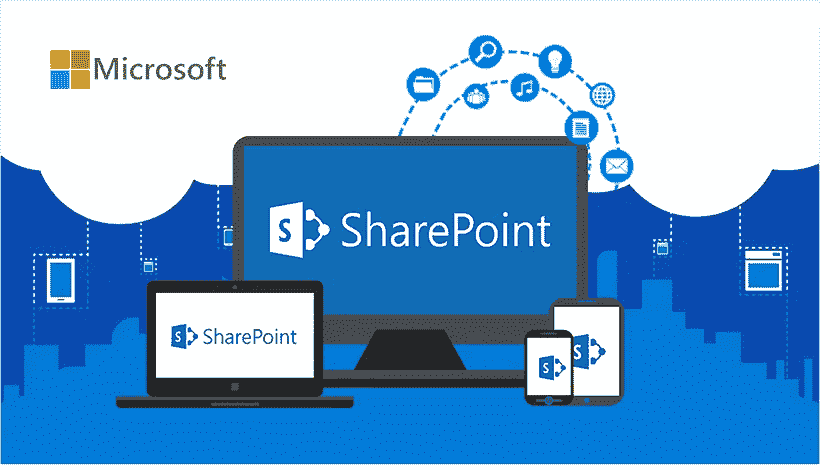
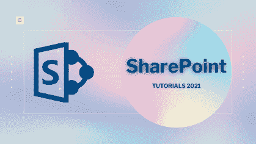
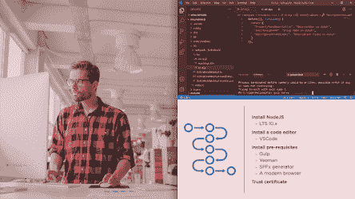
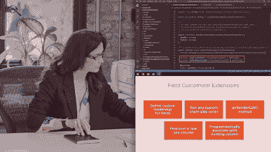
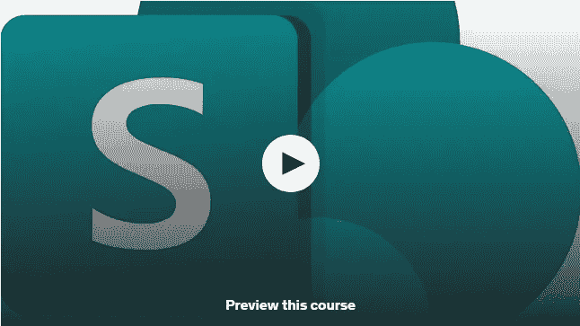

# 适合初学者学习的 5 门最佳 SharePoint 在线课程

> 原文：<https://medium.com/javarevisited/5-best-sharepoint-online-courses-for-beginners-to-learn-fd9739dbbcd?source=collection_archive---------1----------------------->

## 想知道 2023 年怎么学微软 SharePoint？以下是 2023 年开启 SharePoint 开发者之旅的最佳 SharePoint 在线课程

大家好，如果你想学习微软的 Sharepoint，一个在组织内部共享文档的流行工具，那么你来对地方了。在这篇文章中，我将在 2023 年把最好的在线课程分享到 larn SharePoint。但是，在我们开始学习 Microsoft SharePoint(最流行的文档共享协作工具之一)的最佳课程之前，让我回答一个重要的问题。

**微软 SharePoint 到底是什么？** SharePoint 基本上是一个基于网站的协作系统，它使用列表、数据库、工作流应用程序和其他安全功能，以便公司能够控制信息和自动化工作流流程。

SharePoint 也有微软云版本，叫做 SharePoint Online。它与常规 SharePoint 的不同之处在于，它有许多可以在云应用程序中使用的附加功能和集成能力。它还可以与 Microsoft Office 软件包中包含的其他生产力应用程序一起使用。

SharePoint 的主要优势之一是它允许公司提高生产率和增加信息的可见性。SharePoint 的强大功能还允许安全共享、内容管理和工作流协作。

作为一个基于网站的协作平台，SharePoint 也易于维护，易于新用户理解。

[SharePoint](https://www.microsoft.com/en-sg/microsoft-365/sharepoint/collaboration) 作为一个内部网工作平台，在提高财富 500 强公司不同业务领域的工作效率方面有着悠久的历史。它有许多惊人的功能，可以帮助用户在项目中一起工作，并为文档发布和记录数据建立标准流程。

# 2023 年学习 Microsoft SharePoint 的 5 门最佳课程

在这里，我们收集了学习 Microsoft SharePoint 的 5 门最佳课程。请继续阅读，了解更多信息。

## 1. [SharePoint —微软 SharePoint 在线完整指南](https://click.linksynergy.com/deeplink?id=JVFxdTr9V80&mid=39197&murl=https%3A%2F%2Fwww.udemy.com%2Fcourse%2Fthe-complete-guide-to-microsoft-sharepoint-online%2F)

这是一门综合课程，将向您传授有关 SharePoint Online、SharePoint 工作组网站、页面、库和工作流的所有知识。购买本课程后，您将终身获得超过 15 小时的点播视频讲座、1 篇文章和 1 个可下载的教育资源。

**课程时长:15 小时**

**课程评分:4.5 星(满分 5 分)**

课程讲师:亨利·哈比卜

**课程价格:16 美元**

您将学习如何创建复杂而强大的 SharePoint 工作组网站。您还将获得使用文档库管理整个组织的内容、文件、数据和知识的必要技能。

**这是参加本课程的链接** — [SharePoint —微软 SharePoint 在线完全指南](https://click.linksynergy.com/deeplink?id=JVFxdTr9V80&mid=39197&murl=https%3A%2F%2Fwww.udemy.com%2Fcourse%2Fthe-complete-guide-to-microsoft-sharepoint-online%2F)

## 2.【SharePoint 框架入门【plural sight】

这是一门高度专业化的课程，将向您介绍 SharePoint 框架，它是 Office 平台的核心。通过这门精彩的课程，您将学习如何使用 SharePoint Framework 交付定制解决方案。

**课程时长:2 小时**

**课程评分:4.6 星(满分 5 分)**

**课程讲师:萨希尔·马利克**

**课程价格:高级计划每年 140 美元**

本课程一开始，您将探索对 SharePoint 框架的需求。您还将了解 SharePoint Framework 开发环境的基本设置。您还将学习如何使用 SharePoint Framework 开发各种工件。

学完本课程后，您将掌握广泛的技能，并全面了解 SharePoint 框架。

**这是加入本课程的链接**—[SharePoint 框架入门](https://pluralsight.pxf.io/c/1193463/424552/7490?u=https%3A%2F%2Fwww.pluralsight.com%2Fcourses%2Fgetting-started-sharepoint-framework)

不过，你需要一个 [Pluralsight 会员](https://pluralsight.pxf.io/c/1193463/424552/7490?u=https%3A%2F%2Fwww.pluralsight.com%2Fpricing%2Fskills)才能加入这个课程，费用约为每月 29 美元或每年 299 美元(14%的折扣)。我向所有程序员强烈推荐这个订阅，因为它提供了超过 7000 个在线课程的即时访问，以学习任何技术技能。或者，你也可以使用他们的 [**10 天免费通行证**](https://pluralsight.pxf.io/c/1193463/424552/7490?u=https%3A%2F%2Fwww.pluralsight.com%2Fpricing%2Ffree-trial) 免费观看这个课程。

 [## Pluralsight |个人免费试用

### 立即开始免费试用 Pluralsight！查看我们为个人和团队提供的服务，如果您不确定…

pluralsight.pxf.io](https://pluralsight.pxf.io/c/1193463/424552/7490?u=https%3A%2F%2Fwww.pluralsight.com%2Fpricing%2Ffree-trial) 

## 3. [SharePoint Online 基础培训:基础知识](https://linkedin-learning.pxf.io/c/1193463/449670/8005?u=https%3A%2F%2Fwww.linkedin.com%2Flearning%2Fsharepoint-online-essential-training-the-basics-2022%3FreplacementOf%3Dsharepoint-online-essential-training-the-basics-2020)【LinkedIn 学习】

这是 LinkedIn 学习平台上评分最高的初级课程之一。该课程涵盖 SharePoint Online 的基础知识，这是一个利用云的强大功能的强大协作平台。

**课程时长:2 小时**

**球场评分:4.7 星(满分 5 分)**

**课程讲师:吉尼·冯·考特**

**课程价格:年费每月 12 美元**

您将学习如何实时创建、保存、共享和同步文档。您还将学习如何使用 SharePoint Online 进行业务协作和业务管理。这门课的授课老师是 Gini von Courter，她在 Microsoft office 上教授计算机课已经超过 20 年了，

**以下是参加本课程的链接** — [SharePoint Online 基础培训:基础知识](https://linkedin-learning.pxf.io/c/1193463/449670/8005?u=https%3A%2F%2Fwww.linkedin.com%2Flearning%2Fsharepoint-online-essential-training-the-basics-2022%3FreplacementOf%3Dsharepoint-online-essential-training-the-basics-2020)

顺便说一下，你需要一个 LinkedIn Learning 会员才能观看这个课程，这个课程大约每月花费*29.99 美元*，但是你也可以通过参加他们的 [**1 个月免费试用**](http://linkedin-learning.pxf.io/c/1193463/449670/8005?u=https%3A%2F%2Fwww.linkedin.com%2Flearning%2Fsubscription%2Fproducts) 来免费观看这个课程，这是一个探索他们 17000 多门最新技术在线课程的好方法。

 [## LinkedIn Learning 免费试用和订阅价格

### 从初级到高级的 20，000 多门由专家指导的个性化优质内容课程。基于社区的…

linkedin-learning.pxf.io](http://linkedin-learning.pxf.io/c/1193463/449670/8005?u=https%3A%2F%2Fwww.linkedin.com%2Flearning%2Fsubscription%2Fproducts) 

## 4.[更新旧的 SharePoint 定制](https://pluralsight.pxf.io/c/1193463/424552/7490?u=https%3A%2F%2Fwww.pluralsight.com%2Fcourses%2Fupdating-legacy-sharepoint-customizations)

在这门高度专业化的课程中，您将学习如何迁移常见的传统自定义，如脚本编辑器 web 部件，以便您可以利用 SharePoint 框架的强大功能。您还将能够为 SharePoint 开发现代自定义功能。

**课程时长:2 小时**

**球场评分:4.5 星(满分 5 分)**

**课程导师:丹尼·杰西**

**课程价格:高级计划每年 140 美元**

本课程开始时，您将探索最常见的遗留自定义类型，如脚本编辑器 web 部件和用户自定义操作。

您还将了解如何使用 SharePoint Framework 客户端 web 部件和应用程序定制器扩展来代替传统方法，以使用 JavaScript 构建 web 部件和更改页面外观。

以下是加入此 SharePoint 课程的链接— [更新旧版 SharePoint 自定义设置](https://pluralsight.pxf.io/c/1193463/424552/7490?u=https%3A%2F%2Fwww.pluralsight.com%2Fcourses%2Fupdating-legacy-sharepoint-customizations)

## 5. [SharePoint Online 基础培训:超越基础](https://linkedin-learning.pxf.io/c/1193463/449670/8005?u=https%3A%2F%2Fwww.linkedin.com%2Flearning%2Fsharepoint-online-essential-training-beyond-the-basics)

这是一个中级课程，可以被认为是这个列表中第三个课程的续集。因此，本课程将帮助您成为高级用户，并利用 SharePoint Online 的中级和高级功能。

**课程时长:2 小时**

**课程评分:4.7 星(满分 5 分)**

**课程讲师:吉尼·冯·考特**

**课程价格:年费每月 12 美元**

该课程将教你如何创建一个网站，应用一个标志和主题，以及将一个网站与一个枢纽联系起来。您还将学习如何使用列表应用程序，以及如何使用 PowerApps 编辑列表表单。

**这是参加本课程的链接** — [SharePoint Online 基础培训:超越基础](https://linkedin-learning.pxf.io/c/1193463/449670/8005?u=https%3A%2F%2Fwww.linkedin.com%2Flearning%2Fsharepoint-online-essential-training-beyond-the-basics)

# Microsoft SharePoint 常见问题

以下是学员在学习 Microsoft SharePoint 时会问的常见问题，如果您有此处未回答的疑问，请随时提问:

**1。什么是微软 SharePoint？**

SharePoint 基本上是一个基于网站的协作系统，它使用列表、数据库、工作流应用程序和其他安全功能，以便公司能够控制信息和自动化工作流流程。

**2。SharePoint 有什么特点？**

SharePoint 的主要优势之一是它允许公司提高生产率和增加信息的可见性。SharePoint 的强大功能还允许安全共享、内容管理和工作流协作。作为一个基于网站的协作平台，SharePoint 也易于维护，易于新用户理解。

**3。谁使用 Microsoft SharePoint？**

SharePoint 作为内部网工作平台有着悠久的历史，它提高了财富 500 强公司不同业务部门的工作效率。它有许多惊人的功能，可以帮助用户在项目中一起工作，并为文档发布和记录数据建立标准流程。

**4。2023 年学微软 SharePoint 有什么免费课程吗？**

如果你正在寻找免费的资源，比如免费的课程，那么你会喜欢 Udemy 上的这个 [**SharePoint 在线基础课程**](https://click.linksynergy.com/deeplink?id=JVFxdTr9V80&mid=39197&murl=https%3A%2F%2Fwww.udemy.com%2Fcourse%2Fsharepoint-online-fundamentals-lecture-part-1%2F) 。完全免费。

## 结论

以上是 2023 年你可以参加的学习微软 SharePoint 的**最佳在线课程**。这些课程是精英中的精英。精英中的精英。您可以从该列表中选择任何课程，并在几周内将自己从一个完全的新手转变为 SharePoint 专家。

我通常喜欢从多种来源学习，所以我参加了几门来自不同平台或不同讲师的课程，并遵循我与讲师联系的课程。

您可能想探索的其他**最新技术学习资源**

*   [如何从零开始学习 2023 年的元宇宙？](https://javarevisited.blogspot.com/2022/07/how-to-learn-metaverse-from-scratch-is.html)
*   [101 区块链认证区块链开发者值得吗？](https://javarevisited.blogspot.com/2022/05/review-is-certified-enterprise-blockchain-professional-certification-worth.html)
*   [2023 年免费学习区块链的 5 个最佳地点](https://javarevisited.blogspot.com/2022/06/top-5-websites-to-learn-blockchain-in.html)
*   [认证 NFT 专业认证值得吗？](https://javarevisited.blogspot.com/2022/06/review-is-certified-nft-certification-worth-it.html)
*   [2023 年 10 门元宇宙在线初学者课程](https://javarevisited.blogspot.com/2022/06/best-courses-to-learn-metaverse-online.html)
*   [2023 年区块链 5 门最佳 Coursera 课程](https://javarevisited.blogspot.com/2022/01/5-best-blockchain-certifications-and.html)
*   [3 门 Coursera 课程让你在 2022 年成为区块链开发者](https://javarevisited.blogspot.com/2022/06/best-coursera-courses-for-blockchain.html)
*   [2023 年学习区块链的前 5 本书](https://javarevisited.blogspot.com/2022/06/top-5-books-to-learn-blockchain-for.html)
*   [开发者的 10 门最佳区块链课程](/javarevisited/best-blockchain-courses-and-certification-in-2020-63729f8f04d0)
*   [我最喜欢的学习以太坊的在线课程](https://javarevisited.blogspot.com/2021/11/top-5-courses-to-learn-ethereum-for.html)
*   [2023 年十大区块链认证](https://javarevisited.blogspot.com/2020/07/top-5-online-courses-to-learn-blockchain.html)
*   [深度学习区块链的 6 大网站](https://dev.to/javinpaul/6-best-websites-to-become-a-blockchain-developer-in-2022-3han)
*   [10 门免费 NFT 课程，供初学者学习不可替代代币](https://javarevisited.blogspot.com/2022/07/free-nft-non-fungible-tokens-courses.html)

如果您喜欢这份学习 Microsoft SharePoint 的 5 门最佳课程列表，请随意与您的朋友和家人分享。如果您有任何疑问或问题，您也可以发表评论，我们会立即回复您。

**附言——**如果你热衷于学习微软 SharePoint，但又在寻找免费资源，比如一门免费的课程，那么你会喜欢 Udemy 上的 [**SharePoint 在线基础课程**](https://click.linksynergy.com/deeplink?id=JVFxdTr9V80&mid=39197&murl=https%3A%2F%2Fwww.udemy.com%2Fcourse%2Fsharepoint-online-fundamentals-lecture-part-1%2F) 。完全免费。