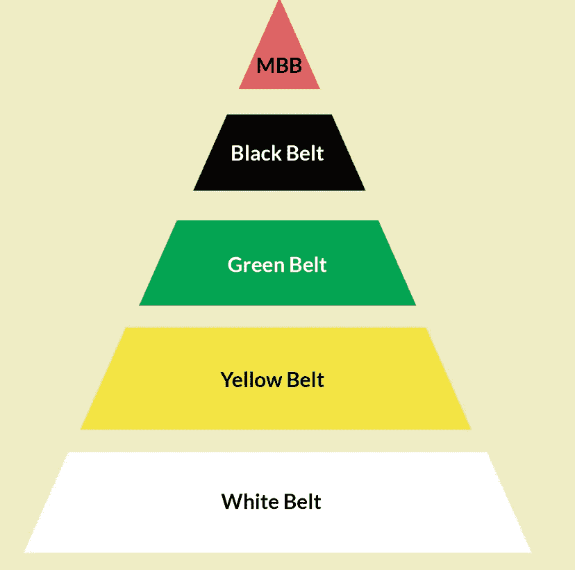
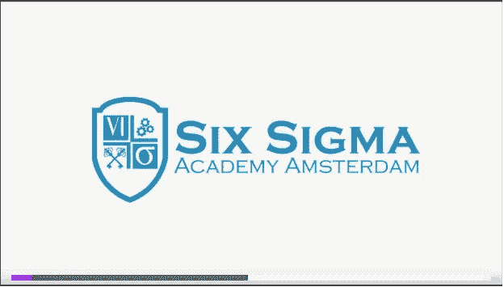
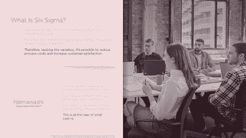
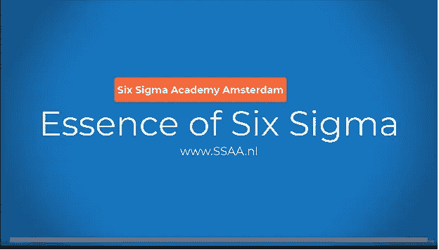

# 2023 年最佳的 6 个适马认证课程

> 原文：<https://medium.com/javarevisited/5-best-six-sigma-certification-courses-2f05bfc602c2?source=collection_archive---------1----------------------->

## 为 2023 年的六项适马认证做准备？以下是你可以参加的最好的在线课程，以便更好地准备

大家好，如果你正在准备**六级适马认证**并寻找最好的在线课程，那么你来对地方了。在过去，我已经分享了准备 [AWS 认证](/javarevisited/10-best-aws-certified-cloud-practitioner-clf-c01-online-courses-and-practice-test-to-crack-ecc0f913091e)、 [Azure 认证](/javarevisited/5-best-azure-fundamentals-courses-to-pass-az-900-certification-exam-in-2020-9e602aea035d)、 [Java 认证](/javarevisited/7-best-online-courses-to-prepare-for-oracles-java-se-8-certification-ocajp-8-and-ocpjp-8-2fd0d6779a9e)的资源，在这篇文章中，我将分享最佳在线课程，以准备 2023 年的六个适马认证，但在此之前，让我们了解一下六个适马本身。

**六适马**是一套技术和工具，组织可以使用它们来提高其业务流程的能力。这将导致业绩的增加，这意味着利润、员工士气以及产品和服务质量的提高。

六适马工艺是美国工程师比尔·史密斯于 1986 年在摩托罗拉工作时发明的。六适马本质上意味着所有的过程都可以被定义、测量、分析、改进和控制。

每个过程都有一些输入和一些输出。如果你控制了输入，也就意味着你控制了输出。

六种适马工具从定性到定量都有，可用于改进过程。这些工具可以是控制图、统计过程控制、故障模式和影响分析以及过程映射。

六适马方法强调严格的 DMAIC 方法，从识别问题开始，到实施解决问题的长期方案结束。

除了 DMAIC，还有许多其他方法可供六个适马从业者使用，尽管 DMAIC 是最流行和最广泛使用的方法。

六适马有几种定义。例如,“六适马”就是使用被分配了对公司底线有直接影响的明确项目的团队。它还涉及统计思维方面的实质性培训，并向关键人员提供高级统计方面的广泛培训。这些关键人物也被称为黑带。

在 [*六适马*](https://www.sixsigmaonline.org/) 中，强调了解决问题的 DMAIC 方法:定义、衡量、分析、改进和控制。就度量标准而言，六适马的质量绩效意味着每百万个机会中应该只有 3.4 个缺陷。

通过识别和消除缺陷原因和其他无法控制的变量，六适马战略也可用于改善/提高制造质量。这可以通过经验和统计方法以及聘请六名适马专家来帮助实现。

六适马侧重于提高过程控制和减少过程变化，精益六适马侧重于减少无附加值的过程和程序。六个适马和精益六个适马之间没有太大的区别，两种方法都应该用来获得积极的结果。

# 2023 年最好的六个适马认证在线课程是什么？

我们已经为你做了艰苦的工作，并在网上整理了一份最好的六个适马课程和证书的清单。这六门最好的适马在线课程选自流行的学习网站和平台，如 Udemy、Pluralsight 和 edX。看看下面的列表。

## 1.[适马绿带认证精益六，BKO 认证培训](https://click.linksynergy.com/deeplink?id=CuIbQrBnhiw&mid=39197&murl=https%3A%2F%2Fwww.udemy.com%2Fcourse%2Fsix-sigma-green-belt-including-microsoft-excel-application%2F)

这是一门经过认证的学术精益六适马绿带培训和认证课程，将帮助学生准备外部考试，如 ASQ、IAASC 或精益六适马认证的其他学术轨迹。

本课程由阿姆斯特丹六适马学院提供，阿姆斯特丹六学院是 BKO 认可的大学，遵循 ASQ 准则。

阿姆斯特丹六适马学院的专家讲师将使用久经考验的方法有效地教授学生，从而节省宝贵的时间。学生将学习如何在任何行业应用精益六适马。

**课程时长:6 小时
评分:4.6 星(满分 5 分)**

讲师还将向学生展示如何运行六适马项目，并特别关注实际应用。学生还将学习如何在 MS Excel 中应用六个适马绿化带应用程序。
本课程包括 6 小时的点播视频讲座，以及许多可下载的其他文章和教育资源。

**以下是参加本课程的链接**—[BKO 认证精益六适马绿带认证培训](https://click.linksynergy.com/deeplink?id=CuIbQrBnhiw&mid=39197&murl=https%3A%2F%2Fwww.udemy.com%2Fcourse%2Fsix-sigma-green-belt-including-microsoft-excel-application%2F)

## 3.[六适马黄带专精](https://coursera.pxf.io/c/3294490/1164545/14726?u=https%3A%2F%2Fwww.coursera.org%2Fspecializations%2Fsix-sigma-fundamentals)【Coursera】

这一黄带专业化课程将帮助学生利用六大适马知识改善职业生涯。学生将接触到行之有效的原则和工具，以提高其组织的质量保证。

由于这是一门黄带专业化课程，它主要面向对六适马和精益适马的基本组件感到好奇的初学者。这些技能可以帮助学生改进业务流程、绩效和质量保证。

**课程时长:约 5 个月
评分:4.7 星(满分 5 分)。**

本课程以线性方式设计，这将有助于学生在完成本课程后继续学习绿带专业。这门课程是由乔治亚理工学院提供的，这是一所非常有名的学校。

**这里是加入本课程的链接** — [六大适马黄带专精](https://coursera.pxf.io/c/3294490/1164545/14726?u=https%3A%2F%2Fwww.coursera.org%2Fspecializations%2Fsix-sigma-fundamentals)

顺便说一句，你有两个选择来参加这个课程，你可以单独参加这个课程，每个月花费大约 39 美元进行专业化，你也可以参加 [**Coursera Plus**](https://coursera.pxf.io/c/3294490/1164545/14726?u=https%3A%2F%2Fwww.coursera.org%2Fcourseraplus) 每个月花费 59 美元，这是 Coursera 的一个订阅计划，让你可以无限制地访问他们最受欢迎的课程、专业化、专业证书和指导项目。

<https://coursera.pxf.io/c/3294490/1164545/14726?u=https%3A%2F%2Fwww.coursera.org%2Fcourseraplus>  

## 4.[精益六适马基金会](https://pluralsight.pxf.io/c/1193463/424552/7490?u=https%3A%2F%2Fwww.pluralsight.com%2Fcourses%2Ffoundations-lean-six-sigma)【复数视线】

本课程将帮助学生了解历史，原则，哲学，以及六适马的做法和目的的基本结构。本课程非常适合准备 CSSC 精益六适马白带或黄带认证的学生。

最后，本课程将帮助您迈向黑带认证。
本课程将向学生传授开始实施精益六适马改进项目所需的基础知识。学生将发现质量管理的重要性，以及基于 Scrum 的敏捷实践。

**课程时长:2 小时 30 分钟
评分:4.5 星(满分 5 分)**

学完本课程的学生将具备将精益六适马的工具和方法联系起来的技能和知识。这个课程的培训师是 Frederico Aranha，他是 PMP、ITIL 的专家，也是 Scrum Master。这门课程可以在短时间内完成。

**这是加入本课程**——[精益六适马基金会](https://pluralsight.pxf.io/c/1193463/424552/7490?u=https%3A%2F%2Fwww.pluralsight.com%2Fcourses%2Ffoundations-lean-six-sigma)的链接

顺便说一下，你需要一个 [Pluralsight 会员](https://pluralsight.pxf.io/c/1193463/424552/7490?u=https%3A%2F%2Fwww.pluralsight.com%2Fpricing%2Fskills)才能加入这个课程，费用大约是每月 29 美元或每年 299 美元(14%的折扣)。我向所有程序员强烈推荐这个订阅，因为它提供了超过 7000 个在线课程的即时访问，以学习任何技术技能。或者，你也可以使用他们的 [**10 天免费通行证**](https://pluralsight.pxf.io/c/1193463/424552/7490?u=https%3A%2F%2Fwww.pluralsight.com%2Fpricing%2Ffree-trial) 免费观看这门课程。

<https://pluralsight.pxf.io/c/1193463/424552/7490?u=https%3A%2F%2Fwww.pluralsight.com%2Fpricing%2Fskills>  

## 4.[六适马:定义和衡量](https://www.awin1.com/cread.php?awinmid=6798&awinaffid=631878&clickref=&p=%5B%5Bhttps%3A%2F%2Fwww.edx.org%2Fcourse%2Fsix-sigma-define-and-measure)【edX】

本课程将向您介绍六适马方法和 DMAIC 过程改进循环。本课程还关注定义和测量阶段，其中包括一些用于理解抽样计划和计算过程能力的基本统计数据。

学生将对设定项目目标、计算过程产量和确定质量关键参数有基本的了解。课程讲座辅以互动练习，引导学生采用实用的方法。

**课程时长:约 8 周**

学生将学习如何绘制流程图，并使用必要的统计工具来确定流程的当前绩效和计算流程能力。

完成本课程的学生将获得 TUM Lean 和 Six 适马黄带认证。本课程的学习材料基于美国质量知识体系协会，达到绿带水平。

以下是加入本课程的链接— [六个适马:定义和衡量](https://www.awin1.com/cread.php?awinmid=6798&awinaffid=631878&clickref=&p=%5B%5Bhttps%3A%2F%2Fwww.edx.org%2Fcourse%2Fsix-sigma-define-and-measure)

## 5.[认证精益六适马黑带培训，BKO 认证](https://click.linksynergy.com/deeplink?id=JVFxdTr9V80&mid=39197&murl=https%3A%2F%2Fwww.udemy.com%2Fcourse%2Fsix-sigma-black-belt-including-ms-excel-application%2F)

本课程非常适合希望学习 FMEA(失效模式和效应分析)、约束理论、卡诺分析、实验设计、QFD(质量功能开发)等工具的学生。

**课程时长:4 小时
评分:4.6 星(满分 5 分)**

学生还将能够在 Microsoft Excel 中应用精益六适马工具，如多元回归、NPV 分析和置信区间。

本课程有超过 3 小时的视频讲座，以及其他教育材料。学生将终生接触所有的课程内容。

**以下是参加本课程的链接** — [认证精益六适马黑带培训](https://click.linksynergy.com/deeplink?id=JVFxdTr9V80&mid=39197&murl=https%3A%2F%2Fwww.udemy.com%2Fcourse%2Fsix-sigma-black-belt-including-ms-excel-application%2F)

## 结论

六适马认证将帮助你提高作为公司领导者的能力。六个适马战略可用于提高客户满意度和降低运营成本。这将导致收入的增长和生产率的提高。

你获得的技能将使你在竞争中获得优势。这也将是你简历上很有价值的一笔。如果你是主管、经理、团队领导、业务流程经理、项目经理或业务分析师，六适马认证将对你大有裨益。

其他**认证资源**针对 **IT 专业人员**和 Java 程序员

*   [2023 年将获得 10 项 AWS 认证](/javarevisited/10-best-aws-certifications-to-aim-in-2022-713c37fac147)
*   [破解 AWS 解决方案架构师专业考试的前 5 门课程](https://javarevisited.blogspot.com/2020/04/top-5-course-to-crack-aws-solution-architect-professional-sap-c01-certification-exam.html)
*   [如何通过 Spring Core Professional 5.0 认证](https://javarevisited.blogspot.com/2018/08/how-to-crack-spring-core-professional-certification-exam-java-latest.html)
*   [如何成为 Azure 认证管理员助理？](https://javarevisited.blogspot.com/2020/04/how-to-crack-microsoft-az-103-azure-administrator-associate-exam-certification.html)
*   [破解 AWS 解决方案架构师认证的 5 大课程](https://javarevisited.blogspot.com/2019/05/top-5-courses-to-crack-aws-solutions-architect-associate-certification-exam-SAA-C01.html#axzz5rHwAwycj)
*   [破解 Azure 云架构师(AZ-300)考试的前 5 门课程](https://javarevisited.blogspot.com/2019/07/top-5-courses-to-crack-azure-architecture-technologies-certification-az-300-exam.html#axzz6E6VuRMsx)
*   [破解 AWS DevOps 工程师考试的前 5 门课程](https://javarevisited.blogspot.com/2020/04/top-5-course-to-crack-aws-certified-devops-engineer-professional-exam-certification.html)
*   [程序员前 5 名 AZ-900 模拟测试](https://javarevisited.blogspot.com/2020/02/top-5-AZ-900-exam-Azure-Fundamentals-certification-practice-tests-and-mock-exams-to.html)
*   [学习 Docker 和 Kubernetes 的十大课程](https://dev.to/javinpaul/top-10-courses-to-learn-docker-and-kubernetes-for-programmers-4lg0)
*   [通过谷歌助理云工程师认证的前 5 门课程](https://javarevisited.blogspot.com/2019/07/top-5-google-cloud-platform-gcp-courses-certifications-online.html)
*   [5 次免费的 AWS 解决方案架构师实践测试](https://javarevisited.blogspot.com/2019/08/top-5-free-aws-solution-architect-Associate-certification-dumps-practice-questions.html)
*   [如何破解 Azure Fundamentals (AZ-900)认证](https://javarevisited.blogspot.com/2020/04/how-to-crack-microsoft-azure-fundamentals-certification-az-900-exam.html)
*   [学习 Docker 和 Kubernetes 的十大课程](https://dev.to/javinpaul/top-10-courses-to-learn-docker-and-kubernetes-for-programmers-4lg0)
*   [如何破解甲骨文 2023 年 Java 认证？](https://medium.freecodecamp.org/how-to-pass-oracles-java-certifications-a-practical-guide-for-developers-e9b607ba6173)
*   [成为 GCP 云工程师助理的前 5 门课程](https://javarevisited.blogspot.com/2020/05/top-5-course-to-crack-google-cloud-associate-cloud-engineer-certification-exam.html) r
*   [如何通过 AZ-300 Azure 解决方案架构师考试？](https://javarevisited.blogspot.com/2020/04/how-to-crack-microsoft-azure-solution-architect-exam-az-300.html)
*   [通过谷歌助理云工程师认证的前 5 门课程](https://javarevisited.blogspot.com/2019/07/top-5-google-cloud-platform-gcp-courses-certifications-online.html)
*   [通过 AWS 云从业者认证的前 5 门课程](https://javarevisited.blogspot.com/2020/02/top-5-courses-to-crack-aws-certified-cloud-practitioner-exam-certification-clf-c01.html)

如果你喜欢这份适马排名前五的六个球场，你可以和你的朋友和家人分享。如果您有任何反馈或意见，请随时在评论中提出。