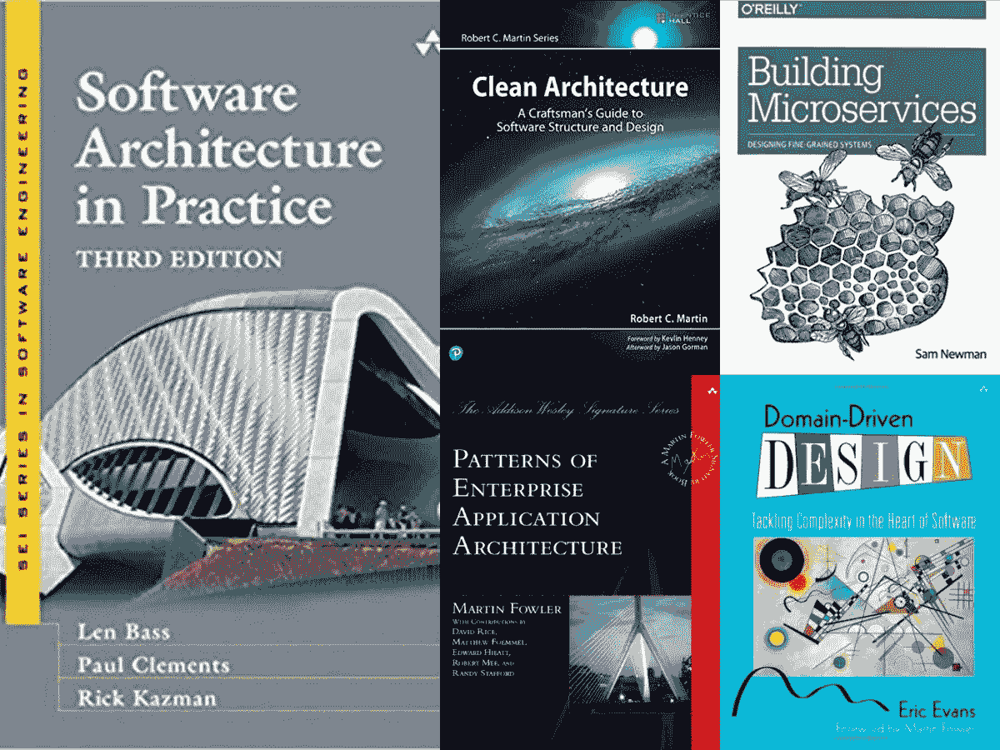
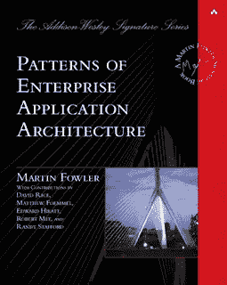
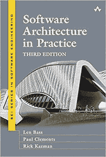
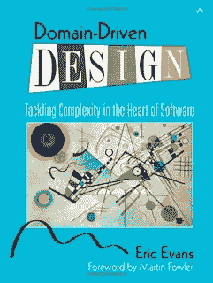

# 面向有经验的 Java 开发人员的 5 本最佳软件架构书籍

> 原文：<https://medium.com/javarevisited/5-best-software-architecture-books-for-experienced-java-developers-1267d05a6b1d?source=collection_archive---------0----------------------->

## 我喜欢的软件书籍和课程有经验的 Java 程序员可以阅读并加入成为软件架构师或解决方案架构师。

大家好，我收到了很多来自拥有 5 到 10 年经验的高级 Java 开发人员的询问，他们渴望成为软件架构师或解决方案架构师，比如他们怎样才能成为软件架构师？哪些书籍、在线课程或认证能有所帮助？以及像成为软件架构师需要多少经验之类的一般性问题。

在过去，我已经分享了 [**最佳软件架构课程**](/javarevisited/top-5-courses-to-learn-software-architecture-in-2020-best-of-lot-5d34ebc52e9) 和一些书籍来扩展他们的知识库，并从架构和设计的角度来看待软件，本文是许多这样的建议的汇编。

由于很多书可能会令人困惑，我仅从软件架构师的角度选择了 5 本最好的必读书籍。对于积极的学习者，我也分享了一些在线课程，以获得更好的学习体验。

由于软件架构是一个非常广阔的主题，并且高度依赖于你正在工作的领域，所以不可能从头到尾地学习设计软件所需的一切，但是这些书会给你构建健壮、安全和可维护的软件所需的必要工具和技术。他们还将帮助你培养关注本质而非细节的心态，这是开发人员的思维方式和架构师的思维方式之间的重要区别。

一般来说，开发人员关注底层细节，比如类和方法，而架构师关注高层细节，比如组件应该如何通信，持久层应该如何表现，使用哪种技术，非功能性需求是什么，等等。

这些书在[面向对象设计](https://dev.to/javinpaul/top-10-object-oriented-design-principles-for-writing-clean-code-4pe1)、[良好的编码实践](http://javarevisited.blogspot.sg/2014/10/10-java-best-practices-to-name-variables-methods-classes-packages.html#axzz4vpA7tbXo)以及如何在软件开发的初始阶段避免代价高昂的错误方面也充满了好的建议。

顺便说一下，如果你真的想成为一名软件架构师或解决方案架构师，那么我也推荐你去看看 Udemy 上的 [**如何成为一名杰出的解决方案架构师**](https://click.linksynergy.com/deeplink?id=JVFxdTr9V80&mid=39197&murl=https%3A%2F%2Fwww.udemy.com%2Fcourse%2Fhow-to-become-an-outstanding-solution-architect%2F) 课程。这个课程是一个很好的地方来学习你在 2023 年成为一名软件架构师所需要的所有硬技能和软技能。

<https://click.linksynergy.com/deeplink?id=JVFxdTr9V80&mid=39197&murl=https%3A%2F%2Fwww.udemy.com%2Fcourse%2Fhow-to-become-an-outstanding-solution-architect%2F>  

# 成为软件架构师或解决方案架构师的 5 本最佳软件架构书籍

事不宜迟，这里是我列出的一些书籍，是每个有经验的 Java 程序员和所有想成为软件架构师或解决方案架构师的开发人员都应该阅读的。

这些书将扩大你的知识面，填补你理解上的空白。他们还会帮助你理解大局，而不是专注于技术细节。

## 1.[企业应用架构的模式](https://www.amazon.com/Patterns-Enterprise-Application-Architecture-Martin/dp/0321127420/?tag=javamysqlanta-20)

这是那种不需要评论的书。这是每个程序员都应该读的经典书籍之一，就像《四人帮》一样。Martin Fowler 是我最喜欢的作者之一，也是软件开发界的大师，这本书清楚地说明了原因。这篇课文写得很好，很容易理解。

这本书补充了最初的 [Java 设计模式](http://javarevisited.blogspot.sg/2013/06/5-must-read-books-to-learn-object.html)书，但是从企业架构的角度列出了更多的模式。

如果你有兴趣学习流行框架背后的模式和架构原则，你必须阅读这本书，程序员使用这些框架来制作复杂的、真实的网络软件。

如果你喜欢主动学习，那么你也可以把这本书和我最喜欢的 Udemy 上的 Java 课程[*软件架构和设计模式基础*](https://click.linksynergy.com/deeplink?id=JVFxdTr9V80&mid=39197&murl=https%3A%2F%2Fwww.udemy.com%2Fbasics-of-software-architecture-design-in-java%2F) 结合起来。

<https://click.linksynergy.com/deeplink?id=JVFxdTr9V80&mid=39197&murl=https%3A%2F%2Fwww.udemy.com%2Fbasics-of-software-architecture-design-in-java%2F>  

## 2.[实践中的软件架构](https://www.amazon.com/Software-Architecture-Practice-3rd-Engineering/dp/0321815734?tag=javamysqlanta-20)

对于那些好奇或者想要理解软件架构背后的基本概念和思想的人来说，这本书是一个很好的开始，但是它有些抽象，许多程序员可能不喜欢。我喜欢的书是关于历史事件的故事和轶事。因为我坚信是故事教会了你该做什么和不该做什么，而且我们的大脑更容易记住故事而不是概念，所以我觉得这本书值得一提。

你可以将这本书作为学习软件架构的教材，如果你愿意，你也可以将这本书与 Coursera 广受欢迎的 [**软件架构在线课程**](https://coursera.pxf.io/c/3294490/1164545/14726?u=https%3A%2F%2Fwww.coursera.org%2Flearn%2Fsoftware-architecture) 结合起来，进行更主动的学习。

<https://coursera.pxf.io/c/3294490/1164545/14726?u=https%3A%2F%2Fwww.coursera.org%2Flearn%2Fsoftware-architecture>  

而且，如果你觉得 Coursera 专业化和认证有用，特别是像这样的，那么我建议你加入 [**Coursera Plus**](https://coursera.pxf.io/c/3294490/1164545/14726?u=https%3A%2F%2Fwww.coursera.org%2Fcourseraplus) ，这是 Coursera 的一个伟大的订阅计划，让你无限制地访问他们最受欢迎的课程、专业化、专业证书和指导项目。它每年花费大约 399 美元，但是它完全值得你的钱，因为你得到了**无限证书**。

## 3.[干净的建筑](https://www.amazon.com/Clean-Architecture-Craftsmans-Software-Structure/dp/0134494164?tag=javamysqlanta-20)

这是你应该阅读的关于软件架构师的第一本书。Bob 叔叔也是专业程序员必读的两本书 [Clean Code](http://javarevisited.blogspot.sg/2017/10/clean-code-by-uncle-bob-book-review.html) 和 [Clean Coder](http://www.java67.com/2015/03/10-books-every-programmer-and-software-engineer-read.html) 的作者，他介绍了他多年来关于如何构建一个干净架构的经验。

健壮、可维护、适应变化的东西。在这本书里，你不仅会学到软件架构的基本概念，还会学到在这个层次上使用的术语。

您还将了解[可靠的设计原则](http://pluralsight.pxf.io/c/1193463/424552/7490?u=https%3A%2F%2Fwww.pluralsight.com%2Fcourses%2Fprinciples-oo-design)以及编写干净代码所需的良好编码实践。这本书也给出了实用的建议，通过比较不同的设计和架构的优缺点来评估它们。

简而言之，这是关于软件架构的最基础的书籍之一，每个高级程序员或渴望成为解决方案架构师的人都应该阅读。

而且，如果你正在寻找一门关于 web 应用程序和软件架构的完整课程，我推荐你去 Educative.io 上查看 [**Web 应用程序和软件架构 101**](http://If you’re looking for a complete course on web application and software architecture, I recommend checking out Web Application and Software Architecture 101\. This is a useful course for anyone looking to strengthen their overall knowledge of software architecture.) ，这是一个基于文本的交互式学习平台**。对于任何希望加强软件架构整体知识的人来说，这是一门有用的课程。**

<https://www.educative.io/courses/web-application-software-architecture-101?affiliate_id=5073518643380224>  

## 4.[构建微服务:设计细粒度系统](https://www.amazon.com/Building-Microservices-Designing-Fine-Grained-Systems/dp/1491950358/?tag=javamysqlanta-20)

这是另一本学习现代分布式软件的设计和架构的好书，特别是微服务，这是这一代最伟大的应用，如优步、脸书、网飞等。

由 Sam Newman 创作，这是关于微服务架构的最受欢迎的书，微服务架构是开发云原生应用的关键。你将不仅学习微服务来构建一个分布式系统。

如果你想从单片应用转向微服务领域，那么这是你应该读的书。

而如果你想从课程中学习，也可以在 Udemy 上查看 Ranga Karnam 的[**大师微服务与 Spring Boot 和春云**](https://click.linksynergy.com/deeplink?id=JVFxdTr9V80&mid=39197&murl=https%3A%2F%2Fwww.udemy.com%2Fcourse%2Fmicroservices-with-spring-boot-and-spring-cloud%2F) 课程。这是学习如何使用 Spring Boot 和其他技术堆栈在 Java 中构建微服务的最佳和最新课程之一。

<https://click.linksynergy.com/deeplink?id=JVFxdTr9V80&mid=39197&murl=https%3A%2F%2Fwww.udemy.com%2Fcourse%2Fmicroservices-with-spring-boot-and-spring-cloud%2F>  

## 5.[领域驱动设计:解决软件核心的复杂性](https://www.amazon.com/Domain-Driven-Design-Tackling-Complexity-Software/dp/0321125215/?tag=javamysqlanta-20)

这是这个列表中最古老的书籍特性之一，你们中的许多人可能会认为它不适合软件架构师。好吧，我同意，它不适合软件架构师，但绝对是想成为软件架构师的程序员的必读之作。

这对于一个有 3 到 5 年经验的[软件开发人员](https://dev.to/javinpaul/11-essential-skills-software-developers-should-learn-in-2020-1bio)来说是非常理想的，因为它提出了许多实际问题及其解决方案，这些只能通过真实世界的经验来学习。

这些问题及其解决方案适用于许多不同的环境，考虑设计和架构师的人至少应该熟悉这些环境。

简而言之，这本书提供了深刻的架构见解，并帮助您在不断变化的环境中创建健壮的系统，最重要的是，Eric Evans 用开发人员可以理解的语言解释了所有这些内容，这是一项了不起的工作。

软件架构师的关键属性之一是了解软件的各个方面，如设计、编码、维护、部署、支持等。而这种属性只能通过扩大你的知识基础和经验来获得。

这些书，再加上一些前沿技术的高级培训课程，比如 [REST](http://courses.baeldung.com/p/rest-with-spring-the-master-class?affcode=22136_bkwjs9xa) 和 [Spring security](https://courses.baeldung.com/p/learn-spring-security-the-master-class?utm_source=javarevisited&utm_medium=web&utm_campaign=lss&affcode=22136_bkwjs9xa) ，可以帮助你达到目的。

这是关于软件架构师、技术主管和解决方案架构师的一些**最佳书籍。如果您是一名拥有 8 到 10 年经验的高级 Java 开发人员，并希望在职业生涯中朝着成为软件架构师的最终目标迈进，那么这些书是扩展您的视野和知识的必读之书。

其他**编程资源**你可能喜欢:
[5 门免费的面向 Java 开发人员的 Spring 框架课程](http://www.java67.com/2017/11/top-5-free-core-spring-mvc-courses-learn-online.html)
[5 门学习 Web 开发的课程](http://javarevisited.blogspot.sg/2018/02/top-5-online-courses-to-learn-web-development.html)
[5 门面向资深 Java 开发人员的 Java 设计模式课程](http://javarevisited.blogspot.sg/2018/02/top-5-java-design-pattern-courses-for-developers.html)
[5 门学习 IT 专业人士写邮件的课程](http://javarevisited.blogspot.sg/2018/02/top-5-professional-email-writing-courses-for-programmers.html)
[10 门编程/编码工作面试的课程](http://javarevisited.blogspot.sg/2018/02/10-courses-to-prepare-for-programming-job-interviews.html)
[5 门学习 Shell 脚本 免费学习核心 Java](http://javarevisited.blogspot.sg/2018/02/5-courses-to-learn-shell-scripting-in-linux.html)
[5 门课程学习 React Native](http://javarevisited.blogspot.sg/2018/02/5-react-native-courses-to-learn-mobile-development-using-JavaScript.html)
[5 门 Selenium with Java Web Driver 课程](http://javarevisited.blogspot.sg/2018/02/top-5-selenium-webdriver-with-java-courses-for-testers.html)
[5 门课程学习大数据和 Apache Spark](http://javarevisited.blogspot.com/2017/12/top-5-courses-to-learn-big-data-and.html)
[5 门面向 Java 开发者的最佳软件架构课程](https://javarevisited.blogspot.com/2019/03/5-courses-programmers-can-join-to-learn.html)**

感谢您阅读本文。如果你喜欢这些*最好的软件架构书籍*和有经验的 Java 程序员的课程，那么请分享给你的朋友和同事。如果您有任何问题或反馈，请留言。

**【p . s .】**—如果你正在寻找一个 Coursera 认证来学习软件架构，那么我也推荐你加入亚伯达大学肯尼王提供的 [**软件设计和架构专业化**](https://coursera.pxf.io/c/3294490/1164545/14726?u=https%3A%2F%2Fwww.coursera.org%2Fspecializations%2Fsoftware-design-architecture) 。这个项目不仅会教你如何设计你的软件，还会教你创建健壮软件所需的有用的设计原则和编码最佳实践。

<https://coursera.pxf.io/c/3294490/1164545/14726?u=https%3A%2F%2Fwww.coursera.org%2Fspecializations%2Fsoftware-design-architecture> 