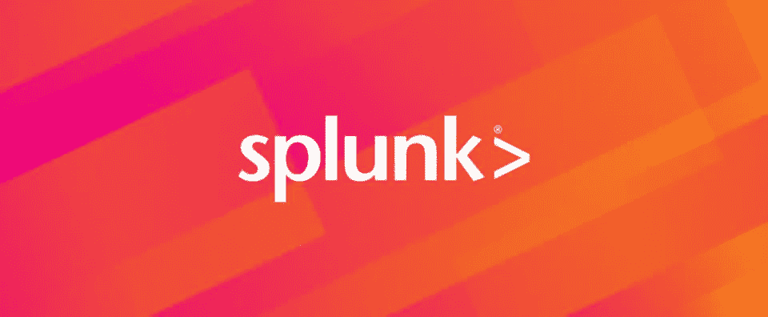
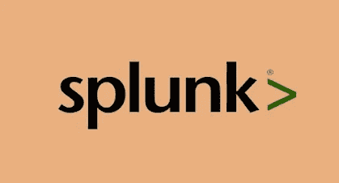
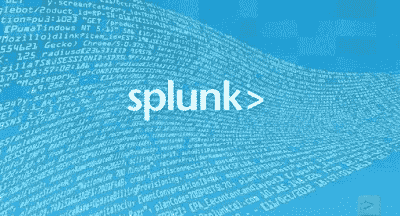

# 2023 年面向开发人员和开发者的 5 个最佳 Splunk 课程

> 原文：<https://medium.com/javarevisited/5-best-splunk-courses-for-developer-and-devops-7091523f1211?source=collection_archive---------0----------------------->

## 我最喜欢的从零开始学习 Splunk 工具的在线课程。这些课程适合开发者和开发者，初学者和有经验的 It 人员。

大家好，如果你想学习 Splunk，这是最流行的数据聚合、监控和可视化工具之一，特别是日志文件，那么你来对地方了。

在过去，我已经分享了学习 DevOps 、 [Selenium](/javarevisited/top-7-courses-to-learn-selenium-for-java-and-c-developers-to-learn-automation-testing-free-and-e91637cd9622) 和 [**机器学习**](/javarevisited/top-10-machine-learning-and-data-science-certifications-and-training-courses-for-beginners-and-a6308497b764) 的 [**最佳课程，在这篇文章中，我将分享初学者和有经验的程序员学习 Splunk 的最佳在线课程。**](/javarevisited/13-best-courses-to-learn-devops-for-senior-developers-in-2020-a2997ff7c33c)

我第一次知道 Splunk 是在一次公司研讨会上，当时他们正在转向 Splunk，以便更好地监控日志文件。我真的很喜欢在 boxe 上安装 Splunk 代理的概念，然后在一个基于 web 的界面中从一个地方查看所有生产机器的日志。

这对我们来说是一笔真正的交易，因为我们有数百台机器，很难找到客户要求解决任何问题。Splunk 通过实时聚合数据解决了这个问题。

机器数据是由一些计算机活动(如计算机、电话、网络设备、传感器或物联网设备等嵌入式系统)生成的任何数据，分析这些机器数据将向您解释许多隐藏的解决方案以及客户行为和要求，您需要一个工具来实现这一目标，这就是 Splunk 的强大之处。

[Splunk](https://www.splunk.com/) 是一项在线服务，帮助企业分析机器数据，以探索诸如安全问题、系统故障等问题。Splunk 还可用于分析业务数据，以提供更好的用户体验，并更好地了解客户及其需求。

如果你对[学习数据分析](/javarevisited/11-best-coursera-certifications-and-courses-for-data-science-and-analysis-in-2021-65ce1ac810a5)和[可视化](/javarevisited/8-best-data-visualization-tools-and-libraries-data-analysts-and-scientists-can-learn-d2734371df16)感到好奇，那么请继续阅读关于最佳五门课程的文章，以帮助你更多地了解这一工具，并利用你的业务和机器数据。此外，这些在线课程对于从初学者到专家的所有水平都是理想的。

# 2023 年面向初学者的 5 门最佳 Splunk 在线课程

在不浪费您更多时间的情况下，这里列出了 2021 年从零开始学习 Splunk 的最佳在线课程。这份名单包括我最喜欢的两个在线学习平台 Udemy 和 Pluralsight 的最佳 Splunk 课程。这些是由 Adam Frisbee 和 Zeal Vora 等专家创建的，教你在 2023 年如何工作和使用 Splunk。

## 1.[完整的 Splunk 初级课程](https://click.linksynergy.com/deeplink?id=CuIbQrBnhiw&mid=39197&murl=https%3A%2F%2Fwww.udemy.com%2Fcourse%2Fsplunker%2F)【2023】

根据近 56K 名学生和目标初学者(他们以前没有使用该工具的经验，并且希望发现该在线服务是否适合他们)的评分分数为 4.5 的最佳课程之一开始列表是一门短期课程。

这是 Udemy 上的*最佳 Splunk 课程之一，您将看到*Splunk 如何存储数据和日志文件*，了解他们的许可证，然后学习如何在您的计算机 windows 和 Linux 上安装软件。*

之后，您将开始导入和使用该工具中的数据，以及使用可视化数据的搜索选项，等等。

**以下是加入本课程的链接** — [完整的 Splunk 初级课程](https://click.linksynergy.com/deeplink?id=CuIbQrBnhiw&mid=39197&murl=https%3A%2F%2Fwww.udemy.com%2Fcourse%2Fsplunker%2F)

## 2. [Splunk 管理员&架构师:完整教程](https://click.linksynergy.com/deeplink?id=CuIbQrBnhiw&mid=39197&murl=https%3A%2F%2Fwww.udemy.com%2Fcourse%2Fsplunk-admin-architect-complete-tutorials-30-days-lab%2F)【Udemy 课程】

让我们假设您已经发现了 Splunk，并且想要掌握使用该工具。好吧，如果这是你想要的，那么你可能需要看看这个 16 小时的视频内容课程，从初学者到专家如何有效地使用 Splunk。

从了解 Splunk 不同产品开始，然后学习其设计和架构以及安装。然后，您将了解如何将此服务用于可视化 Splunk 搜索选项索引器等。

最后，您将有一个包含 35 个问题的模拟测试来评估您对此工具的了解。

简而言之，另一个值得学习的课程是面向有经验的开发人员、开发人员工程师和软件架构师的 Splunk。IT 支持人员也可以参加本课程，了解 Splunk 管理，这是支持人员的一项关键技能。

**以下是加入本课程的链接**——[Splunk 管理员&架构师:完整教程](https://click.linksynergy.com/deeplink?id=CuIbQrBnhiw&mid=39197&murl=https%3A%2F%2Fwww.udemy.com%2Fcourse%2Fsplunk-admin-architect-complete-tutorials-30-days-lab%2F)

## 3.[在 Splunk 中构建报告、仪表盘和警报](https://pluralsight.pxf.io/c/1193463/424552/7490?u=https%3A%2F%2Fwww.pluralsight.com%2Fcourses%2Fbuilding-reports-dashboards-alerts-splunk)【plural sight】

如果您知道如何在 Splunk 仪表盘中导航以及如何使用索引器和搜索选项，并且您希望了解如何创建有效的可视化和仪表盘，请随时参加 Pluralsight 的课程。

在本课程中，您将学习如何构建精美的报告以及可视化，以便从数据中获得洞察力，还将学习如何使用警报、通知、减少响应发生率，以及更多内容。

简而言之，学习 Splunk 的最佳 Pluralsight 课程之一。在本课程中，Thomas Henson 在解释 Splunk、其概念和 Splunk 仪表盘方面做得非常出色。

**这是参加本课程的链接** — [在 Splunk 中构建报告、仪表盘和警报](https://pluralsight.pxf.io/c/1193463/424552/7490?u=https%3A%2F%2Fwww.pluralsight.com%2Fcourses%2Fbuilding-reports-dashboards-alerts-splunk)

顺便说一下，你需要一个 Pluralsight 会员才能参加这个课程，费用大约是每月 29 美元或每年 299 美元(14%的折扣)。我向所有程序员强烈推荐这个订阅，因为它提供了超过 7000 个在线课程的即时访问，以学习任何技术技能。或者，你也可以使用他们的 [**10 天免费通行证**](https://pluralsight.pxf.io/c/1193463/424552/7490?u=https%3A%2F%2Fwww.pluralsight.com%2Fpricing%2Ffree-trial) 免费观看这门课程。

 [## Pluralsight |个人免费试用

### 了解有关 Pluralsight 免费试用版的更多信息。

pluralsight.pxf.io](https://pluralsight.pxf.io/c/1193463/424552/7490?u=https%3A%2F%2Fwww.pluralsight.com%2Fpricing%2Ffree-trial) 

## 4.[学习 Splunk](https://click.linksynergy.com/deeplink?id=CuIbQrBnhiw&mid=39197&murl=https%3A%2F%2Fwww.udemy.com%2Fcourse%2Flearning-splunk%2F) 【初学者最佳 Udemy 课程】

packtpub.com 创建的另一个很棒的课程是学习 Splunk 初学者工具，并学习该软件的术语、该工具的 web 界面和许多其他高级技术，以精通 Splunk 架构。

首先介绍 Splunk 及其术语，如保存的搜索和浏览仪表板。接下来，学习数据入门和 Splunk 部署组件、数据标准化等。

最后，可视化您的数据。令人难以置信的是，你将在所有章节中有一个小测试来检查你的知识。

**这里是加入本课程**——[学习 Splunk](https://click.linksynergy.com/deeplink?id=CuIbQrBnhiw&mid=39197&murl=https%3A%2F%2Fwww.udemy.com%2Fcourse%2Flearning-splunk%2F) 的链接

## 5. [Splunk 2023 —从初学者到架构师](https://click.linksynergy.com/deeplink?id=CuIbQrBnhiw&mid=39197&murl=https%3A%2F%2Fwww.udemy.com%2Fcourse%2Fsplunk-beginner-to-architect%2F)

没有额外要求，如果您是初学者，并且希望在一门包含 11 个小时视频内容的课程中掌握这一工具并了解许多方面，您可以注册这门课程，该课程的评分为 4.5 分，证明这门课程确实是该平台中最好的课程之一。

首先介绍 Splunk 工具并设置实验，然后学习如何使用它，如搜索帮助、搜索处理语言、Splunk 架构、转发器和用户管理、安装后活动、索引集群以及更多主题。

谈到社会证明，这门课程是由最畅销的 Udemy 讲师之一 Zeal Vora 创建的，受到了 1000 多名学生的信任。它也有很好的评论和评级。

**以下是参加本课程的链接** — [Splunk 2023 —从初学者到架构师](https://click.linksynergy.com/deeplink?id=CuIbQrBnhiw&mid=39197&murl=https%3A%2F%2Fwww.udemy.com%2Fcourse%2Fsplunk-beginner-to-architect%2F)

以上是 2023 年面向程序员、开发人员和 IT 支持人员的最佳 Splunk 在线课程。Splunk 实际上是帮助组织利用其机器和业务数据来了解客户行为和需求以及定义其系统中的技术问题的最有效工具之一。本文向您展示了一些学习该工具并开始新职业生涯的最佳课程，那么您还在等什么呢？

您可能喜欢的其他 **DevOps 工具和课程**

*   [我最喜欢的课程为有经验的人学习 DevOps】](/javarevisited/top-10-courses-to-learn-devops-for-experienced-programmers-d93b666db151)
*   [程序员学习 AWS 和云的 10 门免费课程](/javarevisited/top-10-courses-to-learn-amazon-web-services-aws-cloud-in-2020-best-and-free-317f10d7c21d)
*   [2023 年 DevOps 开发者路线图](/hackernoon/the-2018-devops-roadmap-31588d8670cb)
*   [面向 Java 和 DevOps 专业人员的 10 门免费 Docker 课程](https://javarevisited.blogspot.sg/2018/02/10-free-docker-container-courses-for-Java-Developers.html)
*   [学习 Jenkins 自动化和开发运维的五大课程](https://javarevisited.blogspot.com/2018/09/top-5-jenkins-courses-for-java-and-DevOps-Programmers.html)
*   [2023 年学习 Kubernetes 的 7 门免费在线课程](/javarevisited/7-free-online-courses-to-learn-kubernetes-in-2020-3b8a68ec7abc)
*   [初学者最佳硒课程](/javarevisited/top-7-courses-to-learn-selenium-for-java-and-c-developers-to-learn-automation-testing-free-and-e91637cd9622)
*   [10 Docker 和 Kubernetes 程序员课程](https://dev.to/javinpaul/top-10-courses-to-learn-docker-and-kubernetes-for-programmers-4lg0)
*   面向 Java 开发人员的 6 门 Maven 课程
*   [2023 年 Java 开发人员应该学会的 10 件事](http://javarevisited.blogspot.sg/2017/12/10-things-java-programmers-should-learn.html#axzz53ENLS1RB)
*   [学习亚马逊网络服务我最喜欢的课程](https://javarevisited.blogspot.com/2020/05/top-5-amazon-web-services-aws-courses-for-beginners-and-experienced-programmers.html)
*   [5 门免费硒课程学习自动化测试](https://javarevisited.blogspot.sg/2018/02/top-5-selenium-webdriver-with-java-courses-for-testers.html)
*   [7 门免费课程为 DevOps 学习硒](/javarevisited/top-7-courses-to-learn-selenium-for-java-and-c-developers-to-learn-automation-testing-free-and-e91637cd9622)
*   [2023 年学习 DevOps 的前 5 本书](https://javarevisited.blogspot.com/2020/04/top-5-books-to-learn-devops-for-developers.html)
*   [学习 Docker、Kubernetes 和 AWS 的 15 门在线课程](/javarevisited/top-15-online-courses-to-learn-docker-kubernetes-and-aws-for-fullstack-developers-and-devops-d8cc4f16e773)

感谢您阅读本文。如果您发现这些*最适合初学者的 Splunk 在线培训课程非常有用*，请与您的朋友和同事分享。如果您有任何问题或反馈，请留言。

**P. S. —** 如果您正在寻找工具来改善 Java 开发人员的日常生活，那么您也可以查看这些[**Java 开发人员的最佳工具**](https://javarevisited.blogspot.com/2019/02/10-tools-advanced-java-developers-should-know.html) ，我在这里为 Java 开发人员分享了编码、设计、开发、构建、调试和部署的最佳工具。

 [## Java 开发人员应该在 2023 年学习的 10 个工具-(更新)

### 大家好，我们现在是 2023 年的第一周，许多程序员已经开始为他们的…

www.java67.com](https://www.java67.com/2018/04/10-tools-java-developers-should-learn.html)