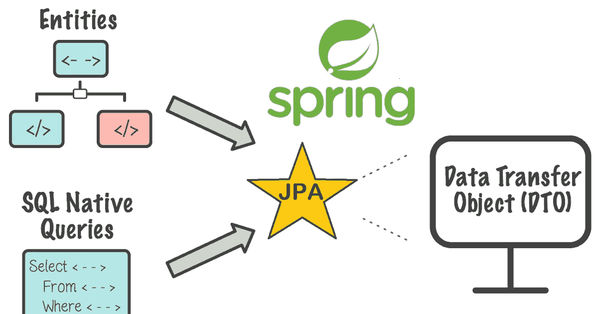
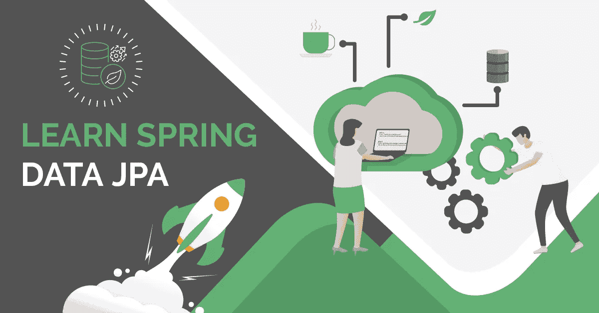
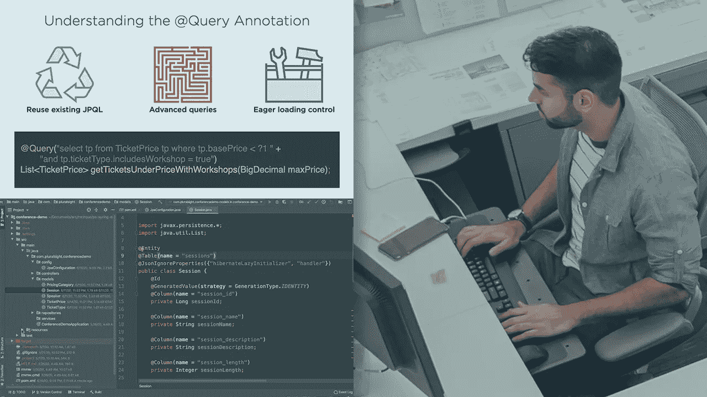

# 2023 年 Java 开发者学习的 5 门最佳 Spring Data JPA 课程

> 原文：<https://medium.com/javarevisited/5-best-spring-data-jpa-courses-for-java-developers-45e6438be3c9?source=collection_archive---------0----------------------->

## 我最喜欢的在线课程 2023 年初学者和有经验的 Java 程序员学习 Spring Data JPA

你好 Java 程序员，如果你想在 2023 年学习 Spring Data JPA 并寻找最好的在线课程，那么你来对地方了。前面我已经分享过我喜欢的课程，学习类似 [Spring Boot](/javarevisited/top-10-courses-to-learn-spring-boot-in-2020-best-of-lot-6ffce88a1b6e) 、[春云](/javarevisited/5-best-courses-to-learn-spring-cloud-and-microservices-1ddea1af7012)、[春安](/javarevisited/top-10-courses-to-learn-spring-security-and-oauth2-with-spring-boot-for-java-developers-8f0222d6066d)、[反应式 Spring + WebFlux](/javarevisited/7-best-webflux-and-reactive-spring-boot-courses-for-java-programmers-33b7c6fa8995) 、 [Spring MVC](/javarevisited/my-favorite-spring-mvc-courses-for-java-developers-5ede7f85dd88) 等 Spring 框架下的不同项目。

在本文中，我将为初学者和有经验的 Java 开发人员分享最好的 Spring Data JPA 课程。 **Spring Data JPA 是 Spring 框架的一部分**，它让与 JPA 提供者如 Hibernate 和 EclipseLink 的合作变得非常容易。如果使用正确，它可以极大地提高开发人员的工作效率。

如果你在想什么是 JPA 和 Spring Data JPA，那么让我告诉你 JPA 代表 **Java Persistence API** ，它是定义持久层的 Java 标准，而 [Spring Data JPA](https://spring.io/projects/spring-data-jpa) 是 Spring 框架保护伞下的一个子项目，它允许 Spring 应用程序与 JPA 集成。

与流行的说法相反，它是一个类似于 Hibernate 的 JPA 实现，实际上它提供了另一个抽象层次来产生更干净的代码，并且它总是需要一个类似 Hibernate 和 EclipseLink 的 JPA 实现来工作。

如果你在想使用 Spring Data JPA 有什么意义，如果你不得不使用 T2 Hibernate 或 T4 Eclipse Link，那么让我告诉你，它是一种插件，它使编写数据访问层变得更容易，并提供了干净的方法来保存和检索任何数据库中的数据，而无需编写 SQL。

Spring Data JPA 附带了一个叫做 JPA 存储库和查询方法的概念。JPA Repository 是一组定义查询方法的接口，如 **findByFirstName** 或 findByLastName 等。这些方法被 Spring 转换成[低级 SQL 查询](https://javarevisited.blogspot.com/2017/02/top-6-sql-query-interview-questions-and-answers.html)。

这意味着您不再需要编写 SQL 查询，这些查询将自动为您生成，但同时，如果您想要控制，您仍然可以编写可跨数据库供应商移植的 JQL 查询，如 [MySQL](https://javarevisited.blogspot.com/2018/05/top-5-mysql-courses-to-learn-online.html) 、 [Oracle](https://javarevisited.blogspot.com/2021/05/top-5-oracle-database-and-plsql-online-courses.html) 、 [Microsoft SQL Server](https://javarevisited.blogspot.com/2020/02/top-5-courses-to-learn-microsoft-sql-server-mssql.html) 和 [PostgreSQL](https://javarevisited.blogspot.com/2020/02/top-5-courses-to-learn-postgresql-in.html) 。

如果你想知道它是如何工作的，那么考虑一下代理模式。Spring Data JPA 只是定义了一个存储库接口，该接口包含从数据库[中保存和检索数据以及填充用户、书籍、订单等实体对象的方法。Spring 通过在运行时提供实现来完成所有繁重的工作，而开发人员只需做很少的工作。](/javarevisited/top-10-free-courses-to-learn-microsoft-sql-server-and-oracle-database-in-2020-6708afcf4ad7)

由于这种更干净的方法，许多基于 Spring 的应用程序正在使用 Spring Data JPA 来实现他们的[数据访问层](https://javarevisited.blogspot.com/2013/01/data-access-object-dao-design-pattern-java-tutorial-example.html)或 DAO 层，这就是为什么在 2023 年学习 Spring Data JPA 是有意义的。

说到 2023 年<https://www.java67.com/2021/11/best-hibernate-and-spring-data-jpa-courses.html>*学习 Spring Data JPA，在线课程和书籍是两种主要方式，不幸的是，网上提供的 *Spring Data JPA 课程*并不多，特别是当你与 [Spring Boot 课程](/javarevisited/10-advanced-spring-boot-courses-for-experienced-java-developers-5e57606816bd)的数量相比时，但我已经为你做了艰苦的工作，并从 Udemy、Baeldung 等网站策划了最好的 Spring Data JPA 课程。*

*这些课程是全面的、最新的、负担得起的，对于想要从头开始学习 Spring Data JPA 的初学者和有经验的 Java 开发人员都很有用。*

*顺便说一下，如果你是 Spring Framework 的新手，并且正在寻找最好的在线课程来开始学习 Spring Framework，那么我也推荐你参加 Udemy 上的 [**Spring Framework 5:初学者到大师**](https://click.linksynergy.com/deeplink?id=CuIbQrBnhiw&mid=39197&murl=https%3A%2F%2Fwww.udemy.com%2Fcourse%2Fspring-framework-5-beginner-to-guru%2F) 课程。这是学习 Spring 框架的最新课程。*

*<https://click.linksynergy.com/deeplink?id=CuIbQrBnhiw&mid=39197&murl=https%3A%2F%2Fwww.udemy.com%2Fcourse%2Fspring-framework-5-beginner-to-guru%2F> * 

# *2023 年面向初学者和有经验的 Java 程序员的 5 门最佳春季数据 JPA 课程*

*不浪费你更多的时间，让我们跳进我最喜欢的在线培训课程，学习 2023 年面向初学者和有经验的 Java 开发人员的 Spring Data JPA。*

*正如我所说的，这些课程是由 Eugen Paraschive 等 [Java](/javarevisited/8-best-resources-to-learn-sql-online-for-free-b00506d88c91) 和 [Spring Framework](/javarevisited/10-best-online-courses-to-learn-spring-framework-in-2020-f7f73599c2fd) 专家创建的，并在 [Udemy](/javarevisited/10-best-udemy-online-courses-for-java-developers-4c9ab70cd01f) 等流行的在线学习平台上提供。大多数课程都很便宜，尤其是 Udemy 课程，你只需花 10 美元就可以参加 Udemy 的销售活动，这种活动时有发生。*

## *1.[使用 Hibernate 的 Spring 数据 JPA](https://click.linksynergy.com/deeplink?id=CuIbQrBnhiw&mid=39197&murl=https%3A%2F%2Fwww.udemy.com%2Fcourse%2Fspring-data-jpa-using-hibernate%2F)*

*这是在 Udemy 上用 Hibernate 学习 Spring Data JPA 的最好课程之一，将教你如何用简单的步骤使用 Hibernate 和 Spring Data JPA。*

*这个课程是由 Bharat Thippireddy 创建的，他是我最喜欢和最受欢迎的 Udemy 讲师之一，拥有超过 30 万名学生。如果你是 Spring Boot 的开发者，想要在你的下一个项目中使用 Spring Data JPA，你应该加入这个课程。*

*以下是您将在这个 12.5 小时的春季数据 JPA 课程中学到的主要内容:*

*1.Spring 数据概念，如存储库和查询方法*

*2.Hibernate 和 ORM 概念，如实体和组件映射*

*3.如何在没有任何 SQL 语句的情况下从数据库中加载数据*

*4.Hibernate 缓存、分页和排序*

*5.如何从 Spring Boot 执行原生 SQL 查询？*

*6.不同类型的 Hibernate 映射*

*在这一过程中，您还将创建一个项目，一个迷你患者日程安排应用程序，并将您在课程中学到的所有知识应用到实践中。谈到课程质量，它是一门结构良好、清晰、简洁的课程。*

***这里是加入本课程的链接**——[Spring Data JPA 使用 Hibernate](https://click.linksynergy.com/deeplink?id=CuIbQrBnhiw&mid=39197&murl=https%3A%2F%2Fwww.udemy.com%2Fcourse%2Fspring-data-jpa-using-hibernate%2F)*

**

*教师反应非常迅速，在 24 小时内回答任何问题，课程的音频和视频质量都令人惊叹。我向 2023 年想学习 Spring Data JPA with Hibernate 的 Java 开发者强烈推荐这门课程。*

## *2.[拜尔东](https://www.baeldung.com/learn-spring-data-jpa-course?affcode=22136_bkwjs9xa#certification-class)学习春季数据 JPA*

*这是另一个学习 Spring Data JPA 的很棒的课程，作者不是别人，正是 Eugen Paraschive，他是来自 Baeldung 的 Java 博客作者和 Spring 讲师。他已经教授了 7000 多名学生各种 Spring 框架课程，如 [**REST with Spring**](http://www.baeldung.com/rest-with-spring-course?utm_source=javarevisited&utm_medium=web&utm_campaign=rws&affcode=22136_bkwjs9xa) 和 [**Learn Spring 5 和 Spring Boot 2**](https://www.baeldung.com/learn-spring-course?affcode=22136_bkwjs9xa) ，他提出了一个关于 Spring Data JPA 的很棒的课程。*

*这也是欧根的第一门基于文本的课程，材料非常好。该课程结构良好，你有理论，然后是编码示例，这样你就可以学习如何应用你所学的知识。*

*本课程还涵盖了所有重要的 Spring Data JPA 主题，例如*

*1.春季数据 JPA 的内容和原因*

*2.如何创建存储库类和查询方法*

*3.如何测试 Spring 数据仓库*

*4.如何用 JPQL 和原生 SQL 编写定制查询*

*5.了解如何使用[@查询注释](https://javarevisited.blogspot.com/2021/09/spring-data-jpa-query-example-tutorial.html)和@ModifyQueries*

*6.分页和排序*

*7.替代查询方法*

*8.春季数据和交易*

*有多种选择供你选择，比如它有一个大师班，一个认证班，和一个完整的教练班，Eugen 提供 6 个月的个人教练，有点贵，但如果你想向专家学习，这是一个很好的选择。你还将获得结业证书。*

***这里是加入本课程的链接**——[拜尔东](https://www.baeldung.com/learn-spring-data-jpa-course?affcode=22136_bkwjs9xa#certification-class)学习春季数据 JPA*

**

## *3. [Spring 框架:Spring 数据 JPA](https://pluralsight.pxf.io/c/1193463/424552/7490?u=https%3A%2F%2Fwww.pluralsight.com%2Fcourses%2Fspring-data-jpa-getting-started)【plural sight】*

*这是一门学习 Spring Data JPA，提高开发者生产力的中级课程。这个 2.5 小时的 Pluralsight 课程由 Dan Bunker 教授，它以清晰简洁的方式教授 Spring Data JPA 基础知识。*

*以下是您将在本课程中学到的主要内容:*

*1.如何选择 Java 数据访问层*

*2.如何将数据层与 Spring 数据 JPA 集成*

*3.什么是 Spring Data JPA？Spring Data JPA 能做什么？*

*4.Spring 数据 JPA 存储库*

*5.查询 DSL 和 JPA [命名查询](https://javarevisited.blogspot.com/2021/10/how-to-use-namedquery-in-spring.html)*

*6.Spring Data JPA 的高级特性包括分页、排序和审计。*

*总的来说，这是一门学习 Spring Data JPA 和提高开发人员生产力的好课程。完成本课程后，您将对查询注释和自定义存储库有很好的理解。*

***这里是加入本课程的链接** — [Spring 框架:Spring 数据 JPA](https://pluralsight.pxf.io/c/1193463/424552/7490?u=https%3A%2F%2Fwww.pluralsight.com%2Fcourses%2Fspring-data-jpa-getting-started)*

**

*顺便说一下，你需要一个 [**Pluralsight 会员**](https://pluralsight.pxf.io/c/1193463/424552/7490?u=https%3A%2F%2Fwww.pluralsight.com%2Fpricing%2Ffree-trial) 才能加入这个课程，费用约为每月 29 美元或每年 299 美元(14%的折扣)。我向所有程序员强烈推荐这个订阅，因为它提供了超过 7000 个在线课程的即时访问，以学习任何技术技能。或者，你也可以使用他们的 [**10 天免费通行证**](https://pluralsight.pxf.io/c/1193463/424552/7490?u=https%3A%2F%2Fwww.pluralsight.com%2Fpricing%2Ffree-trial) 免费观看这门课程。*

*<https://pluralsight.pxf.io/c/1193463/424552/7490?u=https%3A%2F%2Fwww.pluralsight.com%2Fpricing%2Ffree-trial> * 

## *4.[用 Spring Boot&Spring Data JPA](https://click.linksynergy.com/deeplink?id=CuIbQrBnhiw&mid=39197&murl=https%3A%2F%2Fwww.udemy.com%2Fcourse%2Frest-api-with-java-spring-boot-spring-data-jpa-jparepository-swagger%2F)构建 REST API*

*这是一门实践课程，通过构建一个全功能的 REST API 来学习 Spring Data JPA。通过构建和部署项目，您将学习 REST API 与 Java、Spring Boot 和 JPA 一起使用 JSON 以及 Spring AOP、Lombok、Swagger、Logging、JPQL、MySQL 和 Heroku。*

*这一长达 8 小时的课程由 Alfa e-learning 创建，可在 Udemy 上获取。这是本课程中您将学到的主要内容。*

*1.如何用 Spring Boot 和 Spring 数据 JPA 创建 REST APIs*

*2.如何使用[项目 Lombok 库](https://javarevisited.blogspot.com/2021/08/how-to-use-lombok-library-in-java.html)进行更干净的 Java 代码？*

*3.Spring Data JPA 关键概念，如查询方法、存储库等*

*4.如何创建 HTTP GET、POST、PUT 和 DELETE REST APIs*

*5.如何编写 Java 持久性查询语言( **JPQL** )*

*6.如何使用 [JPA](/javarevisited/top-5-books-to-learn-hibernate-for-java-developers-b2cb4b16ccd6) 实现表之间的关系？*

*7.大数据的排序和分页。*

*8.如何在使用 JPA 的查询中编写 AND、OR*

*总的来说，这是一个通过构建 REST APIs 来学习 Spring Data JPA 的很好的实践课程。本课程最棒的一点是，讲师会一步步向您展示如何使用 REST live 构建和测试 REST APIs。*

*你也将获得所有的源代码。简而言之，一门从零开始学习 Spring Data JPA 的切题课程。*

***这里是加入本课程的链接**——[用 Spring Boot&Spring Data JPA](https://click.linksynergy.com/deeplink?id=CuIbQrBnhiw&mid=39197&murl=https%3A%2F%2Fwww.udemy.com%2Fcourse%2Frest-api-with-java-spring-boot-spring-data-jpa-jparepository-swagger%2F)构建 REST API*

**

## *5.[用 100 步掌握 Spring Boot 的 Hibernate 和 JPA](https://click.linksynergy.com/deeplink?id=CuIbQrBnhiw&mid=39197&murl=https%3A%2F%2Fwww.udemy.com%2Fcourse%2Fhibernate-jpa-tutorial-for-beginners-in-100-steps%2F)*

*这是另一个很棒的课程，以循序渐进和有指导的方式学习 Spring Data JPA 和 Hibernate 与 Spring Boot。我是 Ranga 教学风格的忠实粉丝，这门课的讲师，也是 Java 和 Spring 上最受欢迎的 Udemy 讲师之一。*

*他专注于 20%的重要概念，这些概念有 80%的时间被使用，这对任何想要快速起步的人来说都非常有用。*

*在这个长达 13 小时的课程中，您将学到以下主要内容:*

*1.Hibernate 和 JPA 基础，如[实体](https://javarevisited.blogspot.com/2021/10/how-to-update-entity-using-spring-data.html)，关系，继承映射和注释*

*2.Spring Data JPA 基础，如存储库接口和查询方法*

*3.使用 [JPA 和 Hibernate](/javarevisited/top-5-hibernate-online-training-courses-for-beginners-and-advance-java-programmers-469460596b2b) 查询数据的不同方法，如 JPQL、Criteria API 和原生查询。*

*4.Hibernate 和 JPA 关系映射——一对一、一对多和多对多*

*5.Spring Data REST 的基础*

*6.像[一级缓存](https://www.java67.com/2017/10/difference-between-first-level-and-second-level-cache-in-Hibernate.html)和[二级缓存](https://javarevisited.blogspot.com/2017/03/difference-between-first-and-second-level-cache-in-Hibernate.html)这样的 Hibernate 缓存及其影响*

*总的来说，这是最吸引人、最清晰、最简明的课程之一。每堂课都建立在前一堂课的基础上，你会以一种结构化的方式学习。我强烈推荐这个课程给任何想学习 Hibernate 和 JPA 使用 Spring Boot 和 Spring Data JPA 在 2023 的人*

***这是参加本课程的链接** — [用 Spring Boot 的 100 个步骤掌握 Hibernate 和 JPA](https://click.linksynergy.com/deeplink?id=CuIbQrBnhiw&mid=39197&murl=https%3A%2F%2Fwww.udemy.com%2Fcourse%2Fhibernate-jpa-tutorial-for-beginners-in-100-steps%2F)*

**

*以上是 Java 程序员学习 Spring Data JPA 的**最佳在线课程**。Spring Data JPA 是简化数据访问层的一个很好的框架，特别是当你使用 Spring Framework 的时候。*

*您可以通过使用 Spring Data JPA 来提高开发人员的生产率，并且对 Spring Data JPA 的良好了解对成为一名更好的 Java 开发人员大有帮助。我强烈推荐中级和有经验的 Java 开发者在 2023 年学习 Spring Data JPA。*

*您可能想探索的其他 **Spring 框架文章***

*   *[15 春季数据 JPA 面试问题及答案](https://www.java67.com/2021/01/spring-data-jpa-interview-questions-answers-java.html)*
*   *[Spring MVC 内部是如何工作的？](http://javarevisited.blogspot.sg/2017/06/how-spring-mvc-framework-works-web-flow.html)*
*   *[dispatcher servlet 在 Spring MVC 中有什么用？](http://www.java67.com/2017/06/what-is-use-of-dispatcherservlet-in-spring-mvc.html)*
*   *[初学者的 10 个最佳 Spring 框架课程](/javarevisited/10-best-online-courses-to-learn-spring-framework-in-2020-f7f73599c2fd)*
*   *[Java 开发人员 20+ Spring Boot 面试问题](https://javarevisited.blogspot.com/2020/05/top-20-spring-boot-interview-questions-answers.html)*
*   *[15 春云面试问题及答案](https://www.java67.com/2021/01/spring-cloud-interview-questions-with-answers-java.html)*
*   *[如何在 Spring 控制器中获取 ServletContext 对象](http://javarevisited.blogspot.sg/2012/03/how-to-get-servletcontext-in-servlet.html)*
*   *[跟 Spring Boot 学微服务的 10 大课程](/javarevisited/10-best-java-microservices-courses-with-spring-boot-and-spring-cloud-6d04556bdfed)*
*   *[13 Spring Boot 致动器面试问题](https://www.java67.com/2021/02/spring-boot-actuator-interview-questions-answers-java.html)*
*   *[Spring MVC 中@RestController 和@Controller 的区别？](http://javarevisited.blogspot.sg/2017/08/difference-between-restcontroller-and-controller-annotations-spring-mvc-rest.html)*
*   *如何在 Java web 应用程序中启用 Spring 安全性？*
*   *[15 大微服务面试问题及答案](https://www.java67.com/2021/02/microservices-interview-questions-answers-java-spring.html)*
*   *[20 道 Spring Boot 测试面试问题及答案](https://javarevisited.blogspot.com/2020/05/top-20-spring-boot-interview-questions-answers.html)*
*   *[为有经验的开发人员开设的 10 门高级 Spring Boot 课程](/javarevisited/10-advanced-spring-boot-courses-for-experienced-java-developers-5e57606816bd)*
*   *[17 春季 AOP 面试问题及答案](https://javarevisited.blogspot.com/2021/03/spring-aop-interview-questions-answers.html#axzz6nwXUSoGH)*

*感谢您阅读本文。如果你觉得这些*Java 开发人员最佳 Spring Data JPA 在线课程*有用，请分享给你的朋友和同事。如果您有任何问题或反馈，请留言。*

***附言——**如果你是 Spring Framework 的新手，并且正在寻找最好的在线课程来开始学习 Spring Framework，那么我也推荐你参加 Udemy 上的 [**Spring Framework 5:初学者到大师**](https://click.linksynergy.com/deeplink?id=CuIbQrBnhiw&mid=39197&murl=https%3A%2F%2Fwww.udemy.com%2Fcourse%2Fspring-framework-5-beginner-to-guru%2F) 课程。这是学习 Spring 框架的最新课程。*

*<https://click.linksynergy.com/deeplink?id=CuIbQrBnhiw&mid=39197&murl=https%3A%2F%2Fwww.udemy.com%2Fcourse%2Fspring-framework-5-beginner-to-guru%2F> *