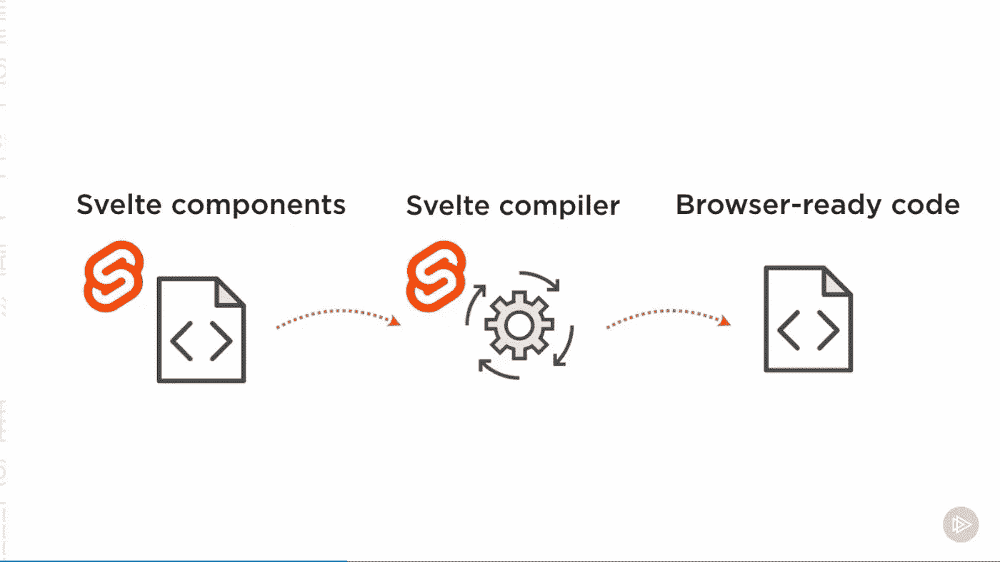
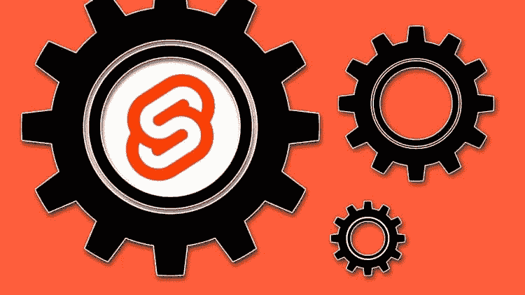
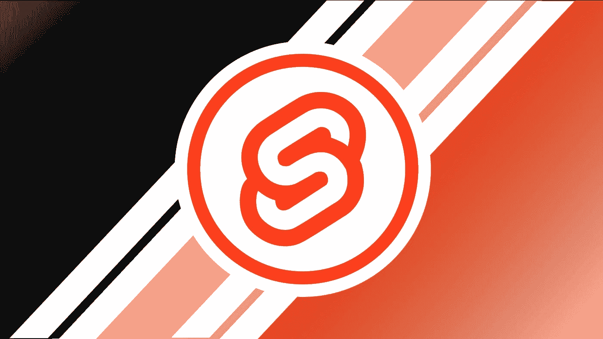
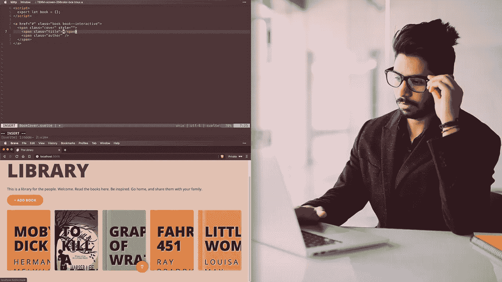

# 2023 年初学者学习的 5 门最佳 Svelte.js 在线课程

> 原文：<https://medium.com/javarevisited/5-best-svelet-js-courses-for-beginners-in-2021-fadf0c4e2bab?source=collection_archive---------0----------------------->

## 这些都是 2023 年对于新的 web 开发者和初学者来说，从零开始学习 Svelte 或 Svelte.js 最好的在线课程。

大家好，如果你想在 2023 年学习 Svelte 或 Svelte.js，并寻找最好的 Svelte 在线课程，那么你来对地方了。早些时候，我已经分享了学习 [Angular](/javarevisited/10-courses-to-learn-angular-for-web-development-6da1bd2856dc) 、 [React](/javarevisited/10-free-angular-and-react-js-courses-from-udemy-and-coursera-best-of-lot-e67f7d811e6b) 和 [Vue.js](/javarevisited/top-5-online-courses-to-learn-vue-js-in-2021-249e66b60646) 的最佳课程，今天，我将分享 2023 年学习 Svelte.js 的最佳在线课程，但是，在此之前，让我们了解一下什么是 Svelte.js 及其提供的好处，以及它在 Angular、React 和 Vue.js 之间的位置你可以使用 Svelte 来构建瘦瘦的但是高度反应的前端应用程序。

Svelte 可以成为[react . js](/javarevisited/top-10-free-courses-to-learn-react-js-c14edbd3b35f)[Angular](https://javarevisited.blogspot.com/2019/04/10-free-angular-and-react-courses-for.html)和 [Vue](/javarevisited/10-javascript-frameworks-and-libraries-to-learn-in-2020-best-of-lot-5f61f86c60b4) 的热门替代品，学习它将使任何前端 web 开发者受益。Svelte 提供了一种全新的构建用户界面的方法。

传统框架如 [React](/javarevisited/10-free-angular-and-react-js-courses-from-udemy-and-coursera-best-of-lot-e67f7d811e6b) 和 [Vue.js](/javarevisited/10-free-vue-js-nuxt-js-online-courses-for-beginners-in-2021-a347ea2ad144) 在浏览器中完成大部分工作，而 Svelte 将这些工作转变为编译步骤，这发生在你构建你的应用程序的时候

虽然你不需要了解这些框架来学习 Svelte——但是如果你了解它们，你会了解到一种有趣的替代方法，它可以让你用更少的代码构建你的 web 项目(并在此过程中获得更快的应用程序！).

对了，如果你赶时间的话，那么我建议你从 AcadMind 的[**svelte . js——完全指南(含 Sapper.js)**](https://click.linksynergy.com/deeplink?id=JVFxdTr9V80&mid=39197&murl=https%3A%2F%2Fwww.udemy.com%2Fcourse%2Fsveltejs-the-complete-guide%2F) 课程开始。是 2023 年学苗条最好的课程。

<https://click.linksynergy.com/deeplink?id=JVFxdTr9V80&mid=39197&murl=https%3A%2F%2Fwww.udemy.com%2Fcourse%2Fsveltejs-the-complete-guide%2F>  

# JavaScript 中的 Svelte 或 Svelte.js 是什么？

Svelte.js 或 Svelte，另一个用于构建基于组件的 UI 的 JavaScript 框架。什么？一个新的 JavaScript 框架，common 饶了我吧。

嗯，它与像 [React](https://javarevisited.blogspot.com/2018/08/top-5-react-js-and-redux-courses-to-learn-online.html#axzz5r06B3egD) 、 [Vue.js](https://javarevisited.blogspot.com/2019/08/top-5-online-courses-to-learn-vue.js-best.html) 和 [Angular](https://javarevisited.blogspot.com/2018/06/5-best-courses-to-learn-angular.html) 这样的成熟 JavaScript 前端框架有一点不同，从某种意义上说，它更像一个编译器，而不是一个框架或库。

在基于框架的应用程序中，您将代码和框架代码发送到客户端，它们在运行时一起工作，创造奇迹。而在 Svelte.js 的例子中，你并没有把框架代码发送给你的客户，而是发送一个由 Svelte 编译器根据你写的指令生成的代码。

这意味着更少的代码被发送到客户端，这意味着更快的加载和更少的带宽消耗。使用这种方法， [Svlete.js](https://svelte.dev/) 可以解决**单页应用程序(SPA)** 的首页加载问题，在这种情况下，首页的加载时间要比平时长。

现在，是时候看看 2023 年学习苗条身材的一些很棒的在线课程了。

# 2023 年学习 Svelte.js 的 5 门最佳在线课程

不要再浪费你的时间，这里是学习 Svelte.js 的最佳课程列表。正如我所说，Svelte.js 很新，网上没有太多学习 Svelte.js 的资源，所以列表很短，但它们真的真的很棒，你会学得更快更好。尽管如此，随着兴趣的增长，我们将有更多的资源，我将更新这篇文章，并添加更多的 Svelte.js 课程，包括一些免费的课程和书籍。

## 1. [Svelte.js —完整指南(包括 Sapper.js)](https://click.linksynergy.com/deeplink?id=JVFxdTr9V80&mid=39197&murl=https%3A%2F%2Fwww.udemy.com%2Fcourse%2Fsveltejs-the-complete-guide%2F)

这大概是目前在线学习 Svelte.js 最好的课程了。这个课程是由最好的 Udemy 导师之一和我最喜欢的 AcadMind 的 Maximilian Schwarzüller 创建的，它将教你如何用 SvelteJS 构建高性能的 web 应用程序。

参加过 Max 的[反应-完全指南](https://click.linksynergy.com/deeplink?id=JVFxdTr9V80&mid=39197&murl=https%3A%2F%2Fwww.udemy.com%2Fcourse%2Freact-the-complete-guide-incl-redux%2F)和[角度-完全指南](https://click.linksynergy.com/deeplink?id=JVFxdTr9V80&mid=39197&murl=https%3A%2F%2Fwww.udemy.com%2Fcourse%2Fthe-complete-guide-to-angular-2%2F)课程后，我对这门课程的预期有了一些想法，我必须说我没有失望。Max 让学习变得非常有趣和简单，他解释什么是 svelete.js 以及它解决了什么问题的方式最适合任何从 svelete 开始的人。在本课程中，您将了解关于 Svelte 的所有内容——一种轻量级 JavaScript 编译器，它如何工作，它的核心特性，以及如何在真实的服务器上运行您的最终应用程序，甚至是在 AWS、Azure、GCP、Openshift 等云平台上。

**这里是加入这个最佳课程的链接** — [Svelte.js —完全指南(含 Sapper.js)](https://click.linksynergy.com/deeplink?id=JVFxdTr9V80&mid=39197&murl=https%3A%2F%2Fwww.udemy.com%2Fcourse%2Fsveltejs-the-complete-guide%2F)

谈到社会证明，这是 Udemy 在 Svelte.js 上最畅销的课程之一。它得到了近 1359 名学习者的平均 4.7 分。总共有 6，957 名学生注册了这门课程，这充分说明了这门课程的质量。总之大概是[最好的 svelete.js 课程](https://javarevisited.blogspot.com/2020/05/top-3-courses-to-learn-sveltejs-in-2020.html#axzz6j8KhisSX)此刻上线。

如果你仍然想知道 Svelet.js 能做什么，那么让我提醒你，svelet . js 是一个工具(一个 JavaScript 编译器)，用于为 web 构建高度反应性的现代用户界面——它是 JavaScript 框架和库(如 [React.js](/@javinpaul/top-5-courses-to-learn-react-js-in-2019-best-of-lot-fa02cd96cdf0) 、 [Angular](/javarevisited/top-10-angular-books-and-courses-for-beginners-and-experienced-web-developers-best-of-lot-9a2dae87f04c) 或 [Vue](/javarevisited/top-5-online-courses-to-learn-vue-js-in-2021-249e66b60646) )的一个很好的替代品。

## 2.[苗条教程和项目课程](https://click.linksynergy.com/deeplink?id=JVFxdTr9V80&mid=39197&murl=https%3A%2F%2Fwww.udemy.com%2Fcourse%2Fsvelte-tutorial-and-projects-course%2F)

这是 2023 年在线学习 Svelte.js 的又一个牛逼课程。这是一门基于项目的课程，意味着您将通过构建有趣的项目和 web 应用程序来学习 Svelete.js。

由约翰·斯米尔金创立，本课程分为两个部分。在第一部分，预算计算器项目/svelte 教程中，您将学习 svelte 基础知识，在第二部分，Razors 电子商务项目中，您将实现 Svelte 来构建一个大项目。

谈论社会证明这门课程在 85 个评分中有 4.8 分，课程受到超过 1000+学生的信任，这使它成为一门伟大的课程。约翰也因其基于项目的课程而闻名，他撰写了许多 Udemy 畅销书，如 best [**Gatsby Tutorial 和 Project course**](https://click.linksynergy.com/deeplink?id=JVFxdTr9V80&mid=39197&murl=https%3A%2F%2Fwww.udemy.com%2Fcourse%2Fgatsby-tutorial-and-projects-course%2F) 。

正如我所说，本课程最大的优点是它包含了真实世界的项目，这些项目从一开始就是端到端开发的，包括路由、认证、授权等。

**这里是加入这个 Svelet.js 课程**——[苗条教程和项目课程](https://click.linksynergy.com/deeplink?id=JVFxdTr9V80&mid=39197&murl=https%3A%2F%2Fwww.udemy.com%2Fcourse%2Fsvelte-tutorial-and-projects-course%2F)的链接

这是学习新技术的好方法，因为除了苗条身材，你还可以学习如何在现实世界中使用它。如果你喜欢基于项目的实践学习，那么你会喜欢这个 Svelte.js 课程。

## 3.[苗条:入门(复数视线)](https://pluralsight.pxf.io/c/1193463/424552/7490?u=https%3A%2F%2Fwww.pluralsight.com%2Fcourses%2Fsvelte-getting-started)

这是 2023 年学苗条的又一个牛逼课程。这个课程来自 Pluralsight，另一个很棒的在线学习平台。

在本课程《Svelte:入门》中，您将学习使用一个有趣的 JavaScript UI 框架 Svelte 的基础知识。

以下是您将在本课程中学到的内容:

1.  创建 UI 组件
2.  处理用户交互
3.  数据绑定。

您将从探索设置 UI 布局开始。接下来，您将了解如何为您的设计添加交互性。最后，您将学习如何绑定动态数据。当你完成本课程后，你将拥有开始自己使用它所需的技能和知识。

**这里是加入这个 svelete.js 课程的链接**——[svelete:入门](https://pluralsight.pxf.io/c/1193463/424552/7490?u=https%3A%2F%2Fwww.pluralsight.com%2Fcourses%2Fsvelte-getting-started)

顺便说一下，你需要一个 [Pluralsight 会员](https://pluralsight.pxf.io/c/1193463/424552/7490?u=https%3A%2F%2Fwww.pluralsight.com%2Flearn)才能加入这个课程，费用大约是每月 29 美元或每年 299 美元(14%的折扣)。我向所有程序员强烈推荐这个订阅，因为它提供了超过 7000 个在线课程的即时访问，以学习任何技术技能。

或者，你也可以使用他们的 [**10 天免费通行证**](https://pluralsight.pxf.io/c/1193463/424552/7490?u=https%3A%2F%2Fwww.pluralsight.com%2Flearn) 免费观看这个课程。

<https://pluralsight.pxf.io/c/1193463/424552/7490?u=https%3A%2F%2Fwww.pluralsight.com%2Flearn>  

## 4.苗条速成班(免费代码营)

这是一个免费的速成课程，可以在 freeCodeCamp Youtube 频道上用 1 小时学习 Svelte.js。在这个完整的视频教程中，你将在一个小时内学会苗条，最棒的是视频中没有广告。

您将构建第一个苗条的应用程序，它使用多条路线，处理表单，并使用完整的 CRUD API。如果你不知道 Svelte 是一种构建用户界面的新方法。这是一个实际上并不是框架的框架。传统框架如 [React](https://www.java67.com/2018/02/5-free-react-courses-for-web-developers.html) 和 Vue 在浏览器中完成大部分工作，而 Svelte 将这些工作转变为编译步骤，在你构建应用时进行。

下面是 2023 年学习 Svelte.js 的 youtube 视频课程

## [5。2023 苗条 JS —完全指南](https://click.linksynergy.com/deeplink?id=JVFxdTr9V80&mid=39197&murl=https%3A%2F%2Fwww.udemy.com%2Fcourse%2Fsvelte-js-the-complete-guide%2F)

这是 2023 年学习这个有用的 JavaScript 框架的又一个很棒的课程。在这个 15 个小时的综合课程中，Angad Sharma 将教你如何使用 Svelte 构建健壮且性能卓越的 web 应用程序。

这是一门非常棒的课程，适合初级和高级的 JavaScript 学生或开发人员，他们已经进入了现代框架，如 [Vue](https://javarevisited.blogspot.com/2021/09/top-25-vuejs-interview-questions-and.html) 、 [React](https://javarevisited.blogspot.com/2021/09/reactjs-interview-questions-answers.html) 、 [angular](https://javarevisited.blogspot.com/2021/10/top-20-angular-interview-questions-answers.html) 等，他们还应该学习 Svelte，作为一种轻量级、快速且可用于生产的替代方案

这门课程的另一个好处是，它是一门基于项目的课程，这意味着你将使用其他关键技术，如 [GraphQL](/javarevisited/top-5-graphql-tutorials-and-courses-for-beginners-fb5543506fc2) 和 [Node.js](/javarevisited/top-10-online-courses-to-learn-node-js-in-depth-8ef0e31ca139) 来构建令人惊叹的项目

以下是您将在本课程中构建的项目列表:

1.  带有 Firebase 的待办事项应用程序
2.  基于 Firebase 的成熟博客
3.  Node.js、MongoDB 和 Svelte.js
4.  使用 AWS 制作电子商务或购物车 Web 应用程序

如果您对构建运行速度极快的现代高效用户界面感兴趣，Svelte.js 是您应该参考的。

**这里是加入这个 Udemy 课程的链接** — [苗条 JS —完全指南](https://click.linksynergy.com/deeplink?id=JVFxdTr9V80&mid=39197&murl=https%3A%2F%2Fwww.udemy.com%2Fcourse%2Fsvelte-js-the-complete-guide%2F)

以上就是 2023 年**学习 Svelte.js 的一些最好的在线课程**。js 去除了抽象，以生成运行速度更快的普通 JavaScript，尤其是在移动设备上，并且还可以帮助您解决单页面应用程序的首页加载问题。

如果你对构建快速加载和运行的现代反应式用户界面感兴趣，Svelte.js 是你今年应该学习的工具。

其他 **Web 开发** **文章和教程**你可能喜欢

*   [2023 年网络开发者路线图](https://javarevisited.blogspot.com/2019/02/the-2019-web-developer-roadmap.html)
*   [12 门面向网络开发者的免费 JavaScript 课程](/javarevisited/12-free-courses-to-learn-javascript-and-es6-for-beginners-and-experienced-developers-aa35874c9a32)
*   [面向 Java 开发者的 5 门免费 Spring 框架课程](http://www.java67.com/2017/11/top-5-free-core-spring-mvc-courses-learn-online.html)
*   [2023 年学习 React Native 的 5 门课程](http://javarevisited.blogspot.sg/2018/02/5-react-native-courses-to-learn-mobile-development-using-JavaScript.html)
*   [我最喜欢的学习网页开发的课程](/better-programming/my-5-favorite-courses-to-learn-web-development-in-2019-a5e74167f8b2)
*   [10 个免费的初学者角度课程](/javarevisited/top-10-free-courses-to-learn-angular-framework-in-2020-bb62148c73d3)
*   [2023 年学习 Web 开发的五大课程](https://javarevisited.blogspot.com/2018/02/top-5-online-courses-to-learn-web-development.html)
*   [学习大数据和 Apache Spark 的 5 门课程](http://javarevisited.blogspot.com/2017/12/top-5-courses-to-learn-big-data-and.html)
*   [面向 Web 开发人员的十大 JavaScript 教程和课程](https://javarevisited.blogspot.com/2018/06/top-10-courses-to-learn-javascript-in.html)
*   [2023 年学习 Spring Boot 的 5 大课程](https://javarevisited.blogspot.com/2018/05/top-5-courses-to-learn-spring-boot-in.html)
*   [2023 年学习 Python 的 5 大课程](http://www.java67.com/2018/02/5-free-python-online-courses-for-beginners.html)
*   [2023 年 React JS 开发者路线图](https://javarevisited.blogspot.com/2018/10/the-2018-react-developer-roadmap.html)
*   [10 JavaScript 框架 Fullstack 开发者应该知道的](http://www.java67.com/2019/01/top-10-javascript-frameworks-and-libraries-for-web-developers.html)
*   [学习 Web 开发 Python 的十大课程](/javarevisited/top-10-courses-to-learn-python-for-web-development-in-2020-best-of-lot-efe11fb6d212)
*   [深入学习 JavaScript 的 10 门最佳课程](/javarevisited/10-best-online-courses-to-learn-javascript-in-2020-af5ed0801645)
*   [初学者学习打字稿的 7 门最佳课程](/javarevisited/7-best-courses-to-learn-typescript-in-depth-58439e1ce729)

感谢您阅读本文。如果你喜欢这些最好的 Svelte.js 在线课程，请与你的朋友和同事分享。如果您有任何问题或反馈，请留言。

如果你知道一个很棒的 Svlete.js 课程，但不在这个列表中，那么请留言，我会把它列入这个列表。

**P. S.** —如果你是 JavaScript 新手，我建议你先掌握 JavaScript 基础知识和 ES6 和 ES7 中介绍的新概念，然后再学习框架。如果你需要资源，我强烈推荐 Udemy 上 Jonas Schmedtmann 的 [**完整 JavaScript 课程:构建真实项目**](https://click.linksynergy.com/deeplink?id=JVFxdTr9V80&mid=39197&murl=https%3A%2F%2Fwww.udemy.com%2Fcourse%2Fthe-complete-javascript-course%2F) ，这是学习 JavaScript 的最新实践课程之一。

<https://click.linksynergy.com/deeplink?id=JVFxdTr9V80&mid=39197&murl=https%3A%2F%2Fwww.udemy.com%2Fcourse%2Fthe-complete-javascript-course%2F> 