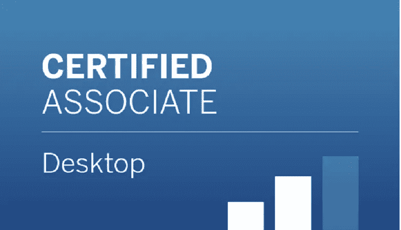
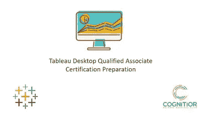
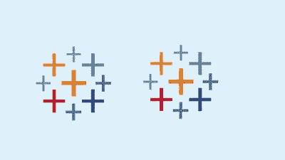

# 5 门最佳 Tableau 桌面助理认证课程和实践测试将于 2022 年完成

> 原文：<https://medium.com/javarevisited/5-best-tableau-desktop-associate-certification-courses-and-practice-tests-to-crack-in-2021-86312b60c1f3?source=collection_archive---------0----------------------->

## 这些是准备 2022 年 Tableau 桌面助理认证考试的最佳在线课程和练习测试

大家好，如果你正在准备 Tableau 桌面助理认证或想成为 Tableau 桌面认证助理，并寻找最好的在线课程开始准备，那么你来对地方了。

过去，我已经分享了学习 Tableau 的[最佳课程](https://javarevisited.blogspot.com/2019/07/top-5-tableau-online-courses-and-certifications-for-data-science-engineers.html#axzz6Rs6ATkD1)，今天我将分享破解 Tableau Deskopt 认证助理考试的最佳课程。

这些是来自 [Udemy](https://click.linksynergy.com/fs-bin/click?id=JVFxdTr9V80&offerid=323058.9410&type=3&subid=0) 和 [Pluralsight](https://pluralsight.pxf.io/c/1193463/424552/7490?u=https%3A%2F%2Fwww.pluralsight.com%2Flearn) 等网站的最好的在线课程，由专家和经验丰富的 Tableau 开发者创建。这些将帮助你涵盖所有的考试主题，并获得通过这项久负盛名的 [IT 认证](https://javarevisited.blogspot.com/2019/12/top-10-it-certifications-for-java-programmers.html)所需的所有必要技能。

如果你在数据科学、数据分析和数据可视化领域，那么你可能知道 Tableau，这是一个面向数据科学家和分析人员的流行的[数据可视化工具](https://www.java67.com/2020/07/top-5-data-visualization-tools-every.html)。

Tableau desktop 是一款大型软件，可以将原始数据转换为美丽的可视化和地图，以便从数据中获得想法和见解，使用该软件需要一些技能。

这也是 tableau 公司创立 [Tableau 桌面认证助理认证](https://www.tableau.com/learn/certification/desktop-certified-associate)的原因。业内对认证 Tableau 专业人员的需求很大。通过 Tableau 认证也有无形的好处，因为它鼓励你学习更多和更深入。

如果您正在准备 Tableau 桌面助理认证并寻找最好的在线课程和练习测试，那么您来对地方了。在这篇文章中，我将分享 5 门最好的在线课程，包括一些通过 2022 年 [Tableau 桌面认证助理](https://www.java67.com/2020/07/top-5-courses-to-pass-tableau-desktop-specialist-certification-exam.html)考试的模拟测试。
**Tableau 桌面认证助理**是继桌面专家认证之后由 [Tableau](https://javarevisited.blogspot.com/2019/07/top-5-tableau-online-courses-and-certifications-for-data-science-engineers.html) 提供的第二级认证，面向拥有至少五个月 Tableau 使用经验的人，换句话说，面向中级至专业用户。考试本身包含 36 道选择题，时间限制为两小时，费用约为 250 美元，及格分数为 75%，这意味着你需要通过至少 27 道题才能获得认证。

在本文中，您将看到一些学习 tableau 桌面认证助理的在线课程，如果您至少有一些 tableau 或数据可视化方面的经验，这些课程将帮助您通过正式考试。

# 2022 年破解 Tableau 桌面助理认证的 5 门在线课程

在不浪费你更多时间的情况下，这里列出了你可以参加的最好的在线课程，为 2022 年的 Tableau 桌面助理认证做准备。这些课程由 Tableau 专家创建，受到成千上万开发者的信任，用于学习 Tableau 并通过这一宝贵的认证。

## 1. [Tableau:认证助理认证](https://click.linksynergy.com/deeplink?id=JVFxdTr9V80&mid=39197&murl=https%3A%2F%2Fwww.udemy.com%2Fcourse%2Ftableau-2018-tableau-10-qualified-associate-certification%2F)

对于完全不熟悉数据可视化并且希望获得桌面专家或桌面认证助理认证的人，您可以参加本课程，它将从一开始就带您进入高级水平。

您将在本课程中学到:

*   准备您的数据。
*   将数据可视化。
*   高级仪表板和图表。

首先介绍如何准备数据以及离散数据和连续数据之间的区别，然后将数据转换为有意义的可视化仪表盘地图，并探索更多图表类型条形图等。

以下是参加 Tableau 课程的链接— [Tableau:认证助理认证](https://click.linksynergy.com/deeplink?id=JVFxdTr9V80&mid=39197&murl=https%3A%2F%2Fwww.udemy.com%2Fcourse%2Ftableau-2018-tableau-10-qualified-associate-certification%2F)

## 2. [Tableau 2022 认证助理考试指南 A-Z (w 数据集)](https://click.linksynergy.com/deeplink?id=JVFxdTr9V80&mid=39197&murl=https%3A%2F%2Fwww.udemy.com%2Fcourse%2Ftableau-certified-associate-exam-guide%2F)

参加 tableau desktop certified association 认证需要大约五个月或更长时间的 tableau 桌面知识，但您可以参加本课程，通过一门课程提高您的技能，并通过正式考试。

在没有任何 tableau 相关知识的情况下，您将作为一名新用户开始使用[数据可视化](https://javarevisited.blogspot.com/2020/08/top-10-coursera-certifications-to-learn-Data-Science-Visualization-and-Data-Analysis.html)并学习一些基础知识，如数据准备和连接创建地图仪表板计算等，直到您掌握该软件并有信心在您的组织内使用 tableau。

在本课程中，您将学到:

*   tableau 软件的基础。
*   数据连接和准备。
*   高级仪表板和映射。

以下是参加本课程的链接— [Tableau 认证助理考试指南 A-Z](https://click.linksynergy.com/deeplink?id=JVFxdTr9V80&mid=39197&murl=https%3A%2F%2Fwww.udemy.com%2Fcourse%2Ftableau-certified-associate-exam-guide%2F)

## 3.[带表格的数据分析基础](https://pluralsight.pxf.io/c/1193463/424552/7490?u=https%3A%2F%2Fwww.pluralsight.com%2Fcourses%2Fdata-analysis-fundamentals-tableau)【plural sight】

学习 data analyst 和 data visualization 可能有点困难，但您可以通过参加本课程来学习这两项内容，本课程将向您传授 tableau 的基础知识，并为您参加桌面认证助理认证做好准备。

你将从介绍 tableau 和连接数据开始，然后学习如何准备数据，如加入过滤排序等。此外，您将看到如何创建一些基本和高级图表映射仪表板计算介绍，等等。

你将在本课程中学习到:

*   tableau 桌面简介。
*   为分析准备数据。
*   高级数据可视化。

**这里是加入本 Tableau 课程** — [数据分析基础与 Tableau](https://pluralsight.pxf.io/c/1193463/424552/7490?u=https%3A%2F%2Fwww.pluralsight.com%2Fcourses%2Fdata-analysis-fundamentals-tableau) 的链接

顺便说一句，你需要一个 [Pluralsight 会员](https://pluralsight.pxf.io/c/1193463/424552/7490?u=https%3A%2F%2Fwww.pluralsight.com%2Flearn)才能加入这个课程，这个课程的费用大约是每月 29 美元或者一年 299 美元，这是 14%的折扣价。我认为你应该得到它，因为它为你提供了 7000 多门关于最新技术的在线课程，包括 tableau。

或者，你也可以使用他们的 [**10 天免费试用**](https://pluralsight.pxf.io/c/1193463/424552/7490?u=https%3A%2F%2Fwww.pluralsight.com%2Flearn) 免费观看本课程。

<https://pluralsight.pxf.io/c/1193463/424552/7490?u=https%3A%2F%2Fwww.pluralsight.com%2Flearn>  

## 4. [Tableau 桌面合格助理考试—备考](https://click.linksynergy.com/deeplink?id=JVFxdTr9V80&mid=39197&murl=https%3A%2F%2Fwww.udemy.com%2Fcourse%2Ftableau-desktop-qualified-associate-exam-prep-n%2F)【Udemy】

你可能从在线课程中获得了 tableau 的经验，或者你已经练习了很长时间，并且你想通过 tableau 桌面助理考试，你可以通过参加 Udemy 上的考试课程来测试你的知识。

您将在本考试课程中学习:

*   测试你的技能知识。
*   回答大约 122 个问题。
*   准备正式考试。

在本课程中，您将参加两个预备考试，以测试您在 tableau desktop 中的技能知识，并验证您是否有资格通过考试并获得认证，而烦恼考试有大约 122 个问题。

以下是参加本模拟考试的链接— [Tableau 桌面合格助理考试—准备](https://click.linksynergy.com/deeplink?id=JVFxdTr9V80&mid=39197&murl=https%3A%2F%2Fwww.udemy.com%2Fcourse%2Ftableau-desktop-qualified-associate-exam-prep-n%2F)

## 5. [Tableau 桌面认证助理——实践测试 2022](https://click.linksynergy.com/deeplink?id=JVFxdTr9V80&mid=39197&murl=https%3A%2F%2Fwww.udemy.com%2Fcourse%2Ftableau-desktop-ca-tests%2F)

完成我们的 tableau 桌面助理考试与另一个实践课程，也将测试您的技能和知识，在使用该软件和准备你的认证。

您将在本次考试中学习课程:

*   回答几十个问题。
*   通过从错误中学习来提高技能。
*   通过实践来检验你的知识。

考试课程有两个部分，包含大约 66 个问题，涵盖了 tableau 中的许多主题以及该问题的答案，它与官方课程非常相似，很容易学习和通过，并将提供 tableau 的详细解释。

**以下是参加 Tableau 模拟考试** — [Tableau 桌面认证助理—模拟考试 2022](https://click.linksynergy.com/deeplink?id=JVFxdTr9V80&mid=39197&murl=https%3A%2F%2Fwww.udemy.com%2Fcourse%2Ftableau-desktop-ca-tests%2F) 的链接

以上是关于 2022 年通过 Tableau 桌面认证助理认证的**最佳在线课程**。数据可视化和仪表板不仅仅是将数据转化为随机图表以使其更加清晰的科学，它还是一种交流和技能的方式，以提取洞察力，推动正确的业务决策，因此通过 tableau desktop certified associate 考试并获得认证是值得在简历中拥有的技能。

其他**数据分析和数据科学**文章您可能喜欢:

*   [2022 年需要学习的五大数据可视化工具](https://www.java67.com/2020/07/top-5-data-visualization-tools-every.html)
*   [五大基本机器学习算法](https://www.java67.com/2020/07/top-5-machine-learning-algorithms-for-beginners.html)
*   你可以在线获得 5 个数据科学学位
*   [面向数据科学家的 10 大 TensorFlow 课程](https://dev.to/javinpaul/10-of-the-best-tensorflow-courses-to-learn-machine-learning-from-coursera-and-udemy-37bf)
*   [学习机器学习的 5 大免费课程](https://www.java67.com/2019/01/5-free-courses-to-learn-machine-and-deep-learning-in-2019.html)
*   [面向程序员的 10 门机器学习和深度学习课程](https://hackernoon.com/top-5-courses-to-learn-python-in-2018-best-of-lot-26644a99e7ec)
*   [2022 年学习 Python 的 10 个理由](https://hackernoon.com/10-reasons-to-learn-python-in-2018-f473dc35e2ee)
*   [初学者学习 Python 的 10 门免费课程](https://hackernoon.com/10-free-python-programming-courses-for-beginners-to-learn-online-38312f3b9912)
*   [2022 年学习电力 BI 的前 5 门课程](https://www.java67.com/2020/06/top-5-courses-to-learn-microsoft-power-BI.html)
*   [初学者学习数据科学的 10 门课程](https://hackernoon.com/10-machine-learning-data-science-and-deep-learning-courses-for-programmers-7edc56078cde)
*   [2022 年学习 Python 的 5 大课程](https://hackernoon.com/top-5-courses-to-learn-python-in-2018-best-of-lot-26644a99e7ec)
*   [学习数据科学 Python 的 5 本书](https://javarevisited.blogspot.com/2019/08/top-5-python-books-for-data-science-and-machine-learning.html)
*   [面向数据科学和机器学习的 8 大 Python 库](https://javarevisited.blogspot.com/2018/10/top-8-python-libraries-for-data-science-machine-learning.html)
*   [学习高级数据科学的前 5 门课程](https://hackernoon.com/top-5-data-science-and-machine-learning-course-for-programmers-e724cfb9940a)
*   [初学者学习 TensorFlow 的 5 大课程](https://hackernoon.com/top-5-tensorflow-and-ml-courses-for-programmers-8b30111cad2c)
*   [学习 QlikView 和 Qlik Sense 的前 5 门课程](https://javarevisited.blogspot.com/2020/07/top-5-courses-to-learn-qlikview-and-qlik-sense.html)

感谢您阅读本文。如果您觉得这些*最佳 Tableau 桌面助理认证课程*有用，请与您的朋友和同事分享。如果您有任何问题或反馈，请留言。

**P. S. —** 如果你有兴趣了解更多关于 Tableau 的信息并寻找免费的在线课程，那么你也可以在 Udemy 上查看这个 [**Tableau 2022 A-Z:数据科学 Tableau 实践培训**](https://click.linksynergy.com/deeplink?id=JVFxdTr9V80&mid=39197&murl=https%3A%2F%2Fwww.udemy.com%2Fcourse%2Ftableau10%2F) 课程。这是深入学习 Tableau 最全面的课程之一。

<https://click.linksynergy.com/deeplink?id=JVFxdTr9V80&mid=39197&murl=https%3A%2F%2Fwww.udemy.com%2Fcourse%2Ftableau10%2F> 