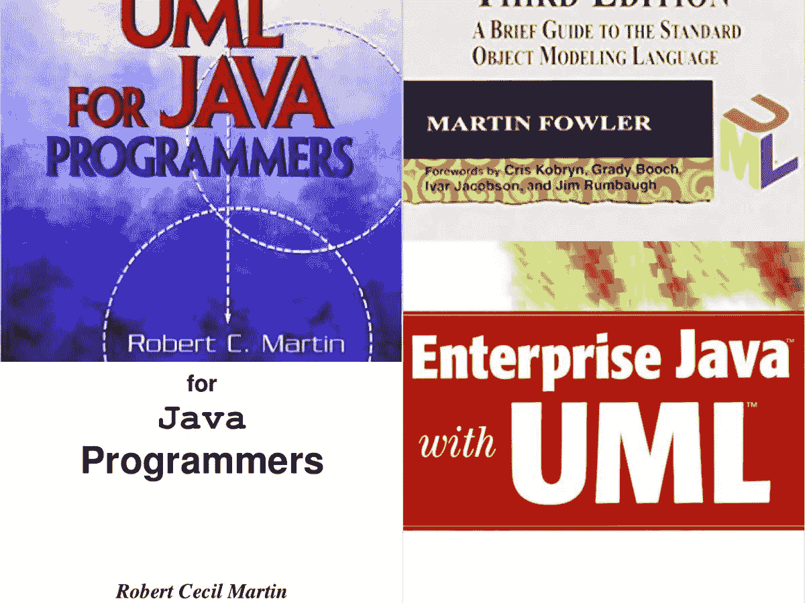
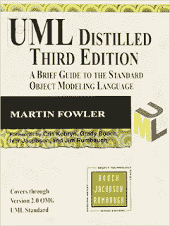
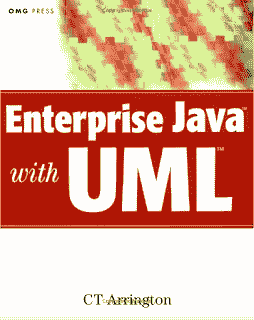

# 2023 年 Java 程序员学习软件设计的 5 本最佳 UML 书籍和课程

> 原文：<https://medium.com/javarevisited/5-best-uml-books-and-courses-for-java-programmers-13c551a9235d?source=collection_archive---------2----------------------->

## UML 是软件设计的重要工具之一，对于初学者和有经验的 Java 程序员来说，这是最好的 UML 书籍和课程。

你好，Java 程序员，如果你想学习软件设计的 UML，并寻找在线学习 UML 的最佳资源，如书籍和课程，那么你来对地方了。

早些时候，我已经分享了[最佳软件架构和设计课程](/javarevisited/top-5-courses-to-learn-software-architecture-in-2020-best-of-lot-5d34ebc52e9)，在这篇文章中，我将分享 Java 程序员的最佳 UML 和书籍。

UML 代表**统一建模语言**，它是面向对象设计的伟大工具之一。它允许你创建一些图表，比如类图、序列图、对象图等等，这有助于你更好地理解你的系统。

UML 还帮助您在实现之前向同事和团队成员传达您的想法和设计。由于一张图片胜过千言万语，这些交互通常可以帮助你很早就发现软件设计中的缺点和漏洞。

这实际上是我在我们的项目中使用 UML 的原因。顺便说一下，当我第一次开始 Java 开发时，我不知道 UML 或 [UML 图](http://javarevisited.blogspot.sg/2014/02/ifference-between-association-vs-composition-vs-aggregation.html)。也许，我可能听说过它，但它就像许多我听说过但没有足够重视的事情一样。那是我工作的第一年，我第一次被要求为我正在开发的一个模块准备类图和序列图。

对我来说，这是一个无用的任务，因为那时我相信立即开始[编码](/javarevisited/my-favorite-free-tutorials-and-courses-to-learn-javascript-8f4d0a71faf2)可以为不可预见的挑战节省时间。当我开始编码时，我不知道 UML 图会带来什么好处，也不知道它如何能帮助 Java 开发人员尽早发现他们思维过程和设计中的缺陷。我学习 UML 和创建那些类图和序列图的探索让我找到了一些书籍和资源。当这项工作完成后，UML 又被搁置了一年左右，直到类似的为遗留系统准备 UML 图的需求出现，但是挑战是我们没有太多的时间去学习。我后悔自己在 UML 上的懒惰

# Java 开发人员学习 UML 的前 5 本书和课程

这里是我收集的一些学习 UML 或统一建模语言的最佳书籍。我从 Java 和 JEE 开发者的角度选择了这些书，但是由于 UML 是语言独立的，如果你正在用 [Python](https://javarevisited.blogspot.com/2018/12/10-free-python-courses-for-programmers.html) 、 [C++](https://dev.to/javinpaul/top-10-courses-to-learn-c-in-depth-best-of-lot-1k7) 、 [C#](https://javarevisited.blogspot.com/2019/11/top-5-courses-to-learn-c-sharp-in.html) 或任何其他面向对象编程语言进行[面向对象分析和设计](http://javarevisited.blogspot.sg/2016/06/java-object-oriented-analysis-and-design-vending-machine-part-2.html)，你也可以使用这些书。这个列表包含了初级和有经验的程序员都可以阅读的书籍。由于软件设计和面向对象设计对你的职业生涯发展非常重要，我强烈建议高级 Java 开发人员熟悉 UML 和其他设计工具，如 [Microsoft Visio](https://www.amazon.com/Microsoft-Visio-Professional-2016-Download/dp/B0153V66WQ?tag=javamysqlanta-20) ，这有助于与团队成员、其他股东和内部团队进行可视化交流。如果你想成为软件架构师、团队领导或解决方案架构师，这一点尤其重要，因为他们的重要工作之一就是创建系统图、突出依赖关系以及可视化地传达信息。

## [1。马丁·福勒提炼的 UML](https://www.amazon.com/UML-Distilled-Standard-Modeling-Language/dp/0321193687?tag=javamysqlanta-20)

Martin Fowler 和 Kendall Scott 所著的《UML 精粹:标准对象建模语言简要指南》是迄今为止我读过的最好的 UML 书籍。

Martin Fowler 不需要任何介绍，我相信你可能已经读过它的一些最著名的书籍，如《重构》或《企业集成模式》。

这本书也超出预期。你不仅会学到什么是 UML，为什么要使用 UML，还会学到如何设计一个应用程序，以及如何在设计过程中使用 UML。当然，学习设计比简单地学习 UML 符号和图表更重要，作者在这方面已经做了很好的工作。

简而言之,《UML 精粹第三版》是任何需要扎实介绍 UML 或基本软件工程原理的人的最佳书籍，也是任何想成为软件架构师或解决方案架构师的 Java 程序员的必读书籍。

而且，如果你有一个在线课程来从头开始学习 UML，那么你也可以将这本书与统一建模语言(UML)的[**:Udemy 上的**](https://click.linksynergy.com/fs-bin/click?id=JVFxdTr9V80&subid=0&offerid=323058.1&type=10&tmpid=14538&RD_PARM1=https%3A%2F%2Fwww.udemy.com%2Fuml-the-complete-uml-unified-modeling-language-reference%2F) 课程结合起来，获得一些使用 UML 的实践经验。这也将帮助你更好地理解 UML 概念。

 [## 统一建模语言(UML):完整指南和示例

### 我是 ExpertWave 的总经理，expert wave 是一家培训和咨询公司，总部设在埃及开罗，在…

udemy.com](https://click.linksynergy.com/fs-bin/click?id=JVFxdTr9V80&subid=0&offerid=323058.1&type=10&tmpid=14538&RD_PARM1=https%3A%2F%2Fwww.udemy.com%2Fuml-the-complete-uml-unified-modeling-language-reference%2F) 

## 2.[罗伯特·c·马丁的《面向 Java 程序员的 UML》](http://www.amazon.com/UML-Java%C2%BF-Programmers-Robert-Martin/dp/0131428489?tag=javamysqlanta-20)

这是 Java 开发人员学习 UML 的最佳书籍之一。它将教你如何在面向对象的设计中使用 UML，并与其他开发人员和团队成员交流你的想法。这本书的作者不是别人，正是罗伯特·c·马丁，他也被称为鲍勃大叔，是《干净的代码》(Clean Code)、《干净的程序员》(Clean Code)[、《干净的架构》(Clean Architecture)](https://javarevisited.blogspot.com/2017/10/clean-code-by-uncle-bob-book-review.html#axzz5jSEI4IYE)等书的作者。众所周知，鲍勃叔叔把事情变得简单，容易理解和消化。你将学习序列图、类图、对象图和其他 UML 图，以显示类之间的相互依赖以及应用程序的不同部分如何协作。他还通过使用 UML 工具以面向对象的方式设计咖啡机，展示了如何在面向对象设计中使用 UML。简而言之，这是一本从 Java 开发角度学习 UML 基础知识的好书。你不仅会学习 UML，还会学习 XP，因为 Bob 叔叔热爱 XP。

如果你需要一门课程来配合这本书，那么我建议你也加入阿尔伯塔大学 Coursera 上的 [**面向对象设计课程**](https://click.linksynergy.com/deeplink?id=JVFxdTr9V80&mid=40328&murl=https%3A%2F%2Fwww.coursera.org%2Flearn%2Fobject-oriented-design) 。这是学习面向对象分析和设计以及使用 UML 进行 OOP 设计的一个很好的课程。

就像本书中的咖啡机器问题一样，您将学习如何应用面向对象的技术来使用 UML 分析现实世界中的难题。

本课程通过涵盖面向对象的分析和设计，使 Java 初学者更上一层楼。您将发现如何通过应用面向对象的设计原则和指南来创建模块化、灵活且可重用的软件。

而且，你将能够用一种被称为统一建模语言(UML)的可视化符号来交流这些设计。超过 65，000 人已经注册了该课程。本课程也是 Coursera 上 [**软件设计与架构专业化**](https://coursera.pxf.io/c/3294490/1164545/14726?u=https%3A%2F%2Fwww.coursera.org%2Fspecializations%2Fsoftware-design-architecture) 的一部分，是学习软件设计与架构的最佳资源之一。

 [## 软件设计和架构

### 乌尔贝塔被认为是世界领先的公共研究和教学密集型大学。作为…之一

coursera.pxf.io](https://coursera.pxf.io/c/3294490/1164545/14726?u=https%3A%2F%2Fwww.coursera.org%2Fspecializations%2Fsoftware-design-architecture) 

顺便说一句，如果你计划参加多个 Coursera 课程或专业，那么考虑参加 [**Coursera Plus 订阅**](https://coursera.pxf.io/c/3294490/1164545/14726?u=https%3A%2F%2Fwww.coursera.org%2Fcourseraplus) ，它为你提供无限制的访问他们最受欢迎的课程、专业、专业证书和指导项目的机会。它每月花费大约 59 美元，但它完全值得你的钱，因为你可以获得无限的证书。

## 3.[c . t . Ariington 的《使用 UML 的企业 Java》](https://www.amazon.com/Enterprise-Java-UML-Second-Arrington/dp/0471267783?tag=javamysqlanta-20)

如果你正在寻找一本好书来帮助你理解如何使用 UML 来设计和开发复杂的 J2EE/Java EE/JEE 应用程序，那么我强烈推荐 C. T. Ariington 的《使用 UML 的企业 Java 》,这是深入学习 UML 的最佳书籍之一。

如果你想成为一名 Java 架构师，这也是必读的一本书，因为作为一名解决方案架构师，你应该很好地理解 UML 图，以便向其他人解释你的系统，例如支持人员、基础设施团队、网络团队、BA/PM 等。

这本书非常清楚，但有时会重复，但这能确保你理解这个想法。

本书的 UML &面向对象分析部分确实很出色，可以和 Robert C. Martin 的《面向 Java 程序员的 UML》一起使用，以便更好地学习。

而且，如果你需要在线课程来加入这本书，我建议你使用 Udemy 上的 UML 课程查看[**高级面向对象的困难问题分析，这是一门非常实用的课程。**](https://click.linksynergy.com/fs-bin/click?id=JVFxdTr9V80&subid=0&offerid=323058.1&type=10&tmpid=14538&RD_PARM1=https%3A%2F%2Fwww.udemy.com%2Fadvanced-object-oriented-analysis-of-hard-problems%2F)

 [## 使用 UML 对困难问题进行高级面向对象分析

### 我是 Soundtrap 的联合创始人之一，也是该公司的首席执行官，sound trap 是一项让音乐人在云中制作在线音乐的服务…

udemy.com](https://click.linksynergy.com/fs-bin/click?id=JVFxdTr9V80&subid=0&offerid=323058.1&type=10&tmpid=14538&RD_PARM1=https%3A%2F%2Fwww.udemy.com%2Fadvanced-object-oriented-analysis-of-hard-problems%2F) 

## 4.Grady Booch 等人的《统一建模语言用户指南》。

本用户指南是一本深入介绍该语言的书。这不是一本关于面向对象的书。

读者应该对 OO 概念足够熟悉，例如[类](http://www.java67.com/2016/08/difference-between-class-and-interface-in-java.html)、[对象](http://javarevisited.blogspot.sg/2013/03/how-to-create-immutable-class-object-java-example-tutorial.html)、关系、[聚合](http://javarevisited.blogspot.sg/2014/02/ifference-between-association-vs-composition-vs-aggregation.html)、[组合](http://javarevisited.blogspot.sg/2015/06/difference-between-inheritance-and-Composition-in-Java-OOP.html)、[继承](http://www.java67.com/2012/08/what-is-inheritance-in-java-oops-programming-example.html)、[多态](http://www.java67.com/2015/05/difference-between-abstraction-and.html)等。

这本书从一开始就采用了 UML，除了语法和语义没有完全平等地涵盖之外，它提供了该语言的一步一步的深入介绍。

这种方法是解释性的。您也可以阅读这本书来让我熟悉 UML 2.0 中对 UML 的更改，这些更改是广泛的，

而且，如果你需要一个在线课程来配合这本书，那么我也建议你去看看 [**关于 Educative 的面向对象设计面试课程**](https://www.educative.io/collection/5668639101419520/5692201761767424?affiliate_id=5073518643380224) ，这是一个互动的、基于文本的课程，以掌握 OOP 和设计。

 [## 探索面向对象的设计面试——互动学习

### 面向对象设计一直是软件工程面试过程的关键部分。大多数的…

www.educative.io](https://www.educative.io/collection/5668639101419520/5692201761767424?affiliate_id=5073518643380224) 

本课程是掌握面向对象分析和设计的完整指南。它是由谷歌、脸书、微软和亚马逊的招聘经理设计的。它不仅有一套精心挑选的案例研究，这些案例在顶级科技公司被反复询问，而且还提供了处理不同面向对象设计场景的全面体验。

而且，如果你发现教育平台和他们的互动课程很有用，那么你还可以获得 [**教育订阅**](https://www.educative.io/subscription?affiliate_id=5073518643380224) ，它不仅提供这门课程，还提供他们的 210 多门课程，每月仅需 14.9 美元。它非常划算，非常适合准备编码面试

 [## 教育无限:保持领先

### 我们听到了您的反馈。你现在只需支付一次费用，就可以获得 Educative 上的所有课程。

www.educative.io](https://www.educative.io/subscription?affiliate_id=5073518643380224) 

以上是关于学习 UML 或统一建模语言的一些**最佳书籍和在线课程。如果您渴望成为一名企业 Java 架构师、解决方案架构师或顾问，您必须提高您的 UML 技能，这些书籍将帮助您实现这一目标。**

正如我所说，如果你渴望成为一名软件架构师或项目经理，你需要熟悉像 UML 这样的技术和像 Microsoft Visio Professional 这样的工具。

这款流行的设计软件的主要优势之一是它可以与 [Microsoft Excel](/javarevisited/7-best-microsoft-excel-courses-for-beginners-33a069708680) 和 Microsoft Sharepoint 同步，虽然生成的图表往往很枯燥，但它们肯定是专业的、实用的。

其他 **Java 文章**您可能喜欢探索:

*   [2023 年 Java 开发者路线图](https://javarevisited.blogspot.com/2019/10/the-java-developer-roadmap.html)
*   [深入学习 Spring 框架的前 5 门课程](https://javarevisited.blogspot.com/2018/06/top-6-spring-framework-online-courses-Java-programmers.html)
*   [Java 开发者应该知道的 20 个库](http://javarevisited.blogspot.sg/2018/01/top-20-libraries-and-apis-for-java-programmers.html)
*   [学习 JVM 内部机制和 Java 性能的前 5 门课程](https://javarevisited.blogspot.com/2019/04/top-5-courses-to-learn-jvm-internals.html)
*   [我最喜欢的深入学习 Java 的免费课程](/javarevisited/10-free-courses-to-learn-java-in-2019-22d1f33a3915)
*   [学习 Java 设计模式的前 5 门课程](https://javarevisited.blogspot.com/2018/02/top-5-java-design-pattern-courses-for-developers.html)
*   [2023 年学习 Spring Boot 的 5 大课程](https://www.java67.com/2018/06/5-best-courses-to-learn-spring-boot-in.html)
*   【Java 和 Web 开发人员应该学习的 10 个框架
*   [要学习的 10 种编程语言](http://www.java67.com/2017/12/10-programming-languages-to-learn-in.html)
*   [学习 Hibernate 和 JPA 的五大课程](https://javarevisited.blogspot.com/2018/01/top-5-hibernate-and-jpa-courses-for-java-programmers-learn-online.html)
*   [Java 开发人员应该阅读的 10 本书](http://www.java67.com/2018/02/10-books-java-developers-should-read-in.html)
*   [Java 开发人员学习 Maven、Jenkins 和 Docker 的 10 门免费课程](/javarevisited/top-10-free-courses-to-learn-maven-jenkins-and-docker-for-java-developers-51fa7a1e66f6)
*   [2023 年每个 Java 开发人员都要学习的 10 种工具](https://www.java67.com/2018/04/10-tools-java-developers-should-learn.html)

如果你正在寻找一些从零开始学习 Java 的在线课程，那么你也可以在 Medium 上查看 2023 年学习 Java 的 10 门最佳课程。

 [## 2023 年将加入 11 门高级核心 Java 在线课程

### 这些是核心 java 开发人员学习多线程、集合、JVM 等技能的最佳在线课程

medium.com](/javarevisited/11-advanced-core-java-online-courses-to-join-in-2021-46011661257a)