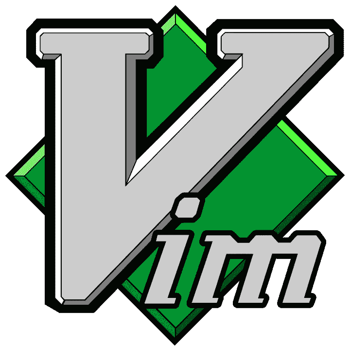
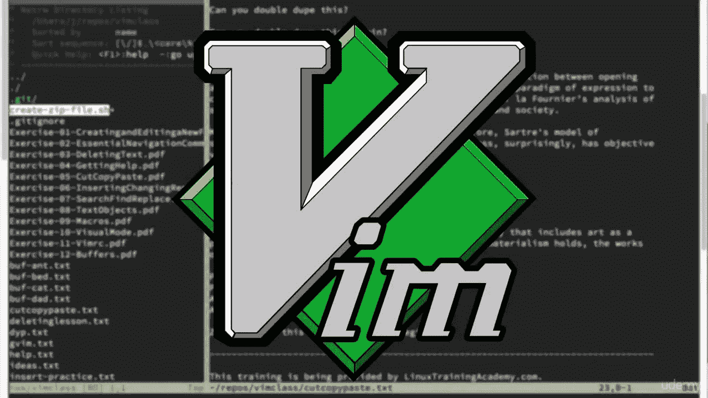
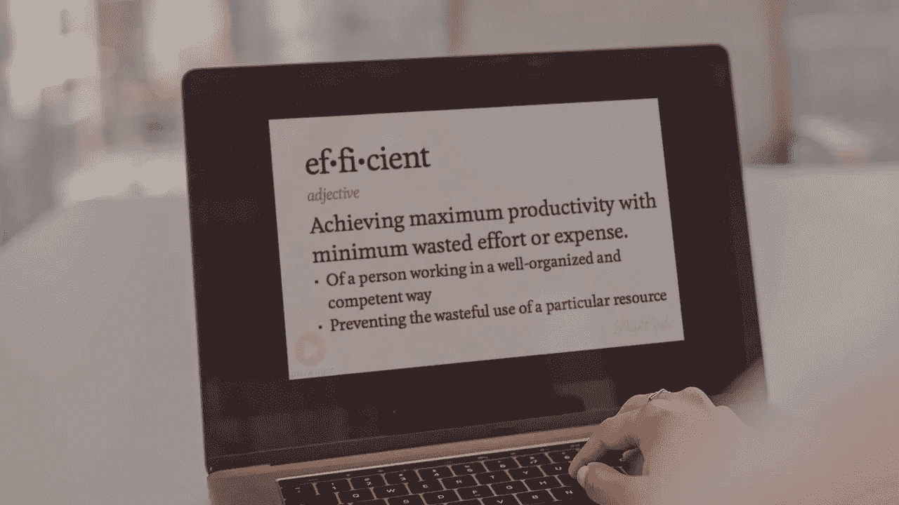

# 2023 年新手在线学习的 5 门最佳 Vi 或 Vim 编辑器课程

> 原文：<https://medium.com/javarevisited/5-best-vi-or-vim-editor-online-courses-for-beginners-9f567ff77c0f?source=collection_archive---------2----------------------->

## 我最喜欢的在线课程，从 Udemy 和 Pluralsight 为初学者学习 Linux 中的 Vim 或 VI 编辑器。它包含免费和最好的课程。

大家好，如果你想学习流行的 VI 编辑器或 Vim，并寻找最好的资源，如在线课程，那么你来对地方了。之前我已经分享了 [**最佳 Linux 课程**](/javarevisited/top-10-courses-to-learn-linux-command-line-in-2020-best-and-free-f3ee4a78d0c0) 和 [**最佳 shell 脚本课程**](/javarevisited/7-best-shell-scripting-courses-for-programmers-and-it-professionals-d1f1486accc9?source=---------13----------------------------) 今天我要分享的是 Udemy 和 Pluralsight 学习 VI 编辑器的最佳在线课程。

如果你在 Linux 中工作过，那么你可能知道 VIM 是最有用和最强大的文本编辑器之一，每个在 Linux 环境中工作的人都应该知道 VIM。

也被称为 VI 编辑器，它经常被吹捧为天才开发人员的首选编辑器，这些开发人员充分利用 Vim 的代码导航功能并做一些新奇的事情。

对于大多数人来说，像我们大多数人一样，VIM 是无处不在的文本编辑器，可以用来查看文本文件或编辑配置。很多时候，您还会使用它来查看日志文件，但是使用较少的命令可能是更好的选择。

正如我所说的， [VI Editor](https://javarevisited.blogspot.com/2011/06/vi-editor-in-unix-example-tutorial-and.html#axzz5SdlHplZc) 不仅仅是一个编辑器，而是严肃的程序员的一种生活方式，他们对它近乎神奇的力量深信不疑。它从外面看起来神秘而令人困惑，但一旦你开始使用它，你就会明白它带来的功能，以及为什么几十年后，它仍然如此受欢迎。

正如我之前所说，如果你想学习 VIM 或 VI 编辑器并寻找一些优秀的在线课程，那么你来对地方了。在这篇文章中，我将分享 [**最佳 VIM 课程**](https://javarevisited.blogspot.com/2020/04/top-5-courses-to-learn-vim-editor-in-Linux.html#axzz6skoVdG6z) ，它可以帮助你了解和掌握它的所有功能。

这些课程涵盖了 Vim 编辑器的端到端。他们将教你如何安装 Vim，通过 [SSH](https://javarevisited.blogspot.com/2022/02/top-5-courses-to-learn-ssl-and-tls-in.html) 使用 Vim 进行简单的编辑，用合理的默认值配置 Vim，使用操作符和命令，以及处理文件、窗口和缓冲区。

他们还会教你如何使用 Vims 的文本编辑、移动和操作功能，在 Linux 环境中变得更有效率，当然还有如何退出 VI 编辑器[这对新手来说是个问题。

问题是，如果你想真正掌握 Vim，如果你试图自己学习，可能要花很长时间。这就是这些课程可以帮助你的地方。它们为您提供了学习基础知识的最短路径和学习最高级功能的最快方法。](https://www.java67.com/2020/03/9-ways-to-close-or-exit-vim-editor-in-Linux.html)

# 2023 年 IT 专业人员学习 Vi 或 Vim 编辑器的前 5 门课程

在不浪费你更多时间的情况下，这里有你可以参加的掌握 Linux 中 VIM 或 VI 编辑器的最好的在线课程。该列表包括 VI editor 的初级和高级在线课程，因此即使您从未使用过 VIM，也可以开始熟练和高效地使用 Vim。

## 1. [Vim 大师班](https://click.linksynergy.com/deeplink?id=JVFxdTr9V80&mid=39197&murl=https%3A%2F%2Fwww.udemy.com%2Fcourse%2Fvim-commands-cheat-sheet%2F)【最佳 Udemy 课程】

由 Jason Cannon 创建，这是任何经常使用命令行的人的理想课程。无论您是系统管理员、开发人员、数据库管理员，还是任何需要在命令行环境中编辑文件的人，本课程都适合您。

这也是学习和掌握 VIM 或 Vim 编辑器的最好课程。如果你只能参加一门课程，那就选这门吧。它将帮助你掌握在 [Linux](https://dev.to/javinpaul/5-free-courses-to-learn-linux-for-beginners-367f) 、 [Unix](/javarevisited/6-free-courses-to-learn-bash-shell-scripting-in-linux-and-unix-a50461ecd4fe) 、 [Mac](/javarevisited/5-best-online-courses-to-learn-mac-os-in-depth-2763dd39b156) 和 Windows 操作系统上的 vi 和 Vim 编辑器。

它涵盖了所有 vim 编辑选项、如何比较文件、查看差异、在文件和同一文件中的行之间导航以及一些图形 Vim 选项。我强烈推荐这个课程给任何想学习或掌握 VI 编辑器或 Vim 的人。

**以下是参加本课程的链接，目的是掌握 VI** — [Vim 大师班](https://click.linksynergy.com/deeplink?id=JVFxdTr9V80&mid=39197&murl=https%3A%2F%2Fwww.udemy.com%2Fcourse%2Fvim-commands-cheat-sheet%2F)

谈到社交证明，这是 Udemy 上评分最高的 Vim 课程，近 2300 名参与者的平均评分为 4.7 分。也受到超过 15K 学生的信赖。

## 2.[用 VI 编辑器像专业人士一样学习编码](https://click.linksynergy.com/deeplink?id=JVFxdTr9V80&mid=39197&murl=https%3A%2F%2Fwww.udemy.com%2Fcourse%2Flearn-to-code-like-a-pro-with-vi-editor%2F)

这是在 Udemy 上学习 Vim 的另一个很棒的课程。如果您想掌握强大的命令行文本编辑器 VI 和 VIM，并使您的开发技能更上一层楼，那么您应该参加这个课程。

本课程将帮助您理解和掌握所有*VIM 的基本特征*。您将了解常用和奇特的特性，这些特性使它成为任何技术的强大代码编辑器。

我向任何想学习 Vim 的人推荐这门课程，不仅是为了文本编辑，也是为了在 Linux 中编码。如果你是一名 Java 开发人员，在 Linux 机器上有你的代码，并想在那里修改它，而不是在 Windows 中使用 [IntelliJIEDA](https://javarevisited.blogspot.com/2018/09/top-5-courses-to-learn-intellij-idea-java-and-android-development.html) 或 [Eclipse](/javarevisited/top-10-courses-to-learn-eclipse-junit-and-mockito-for-java-developers-4de1e8d62b96) ，那么你应该参加这个课程，使用 Vim 编写 Java 代码。

**这里是加入这个 Vim 课程的链接**——[用 VI 编辑器像专业人士一样学习编码](https://click.linksynergy.com/deeplink?id=JVFxdTr9V80&mid=39197&murl=https%3A%2F%2Fwww.udemy.com%2Fcourse%2Flearn-to-code-like-a-pro-with-vi-editor%2F)

## 3.[由安德鲁·斯图尔特打入维姆](https://pluralsight.pxf.io/c/1193463/424552/7490?u=https%3A%2F%2Fwww.pluralsight.com%2Fcourses%2Fsmash-into-vim)

这是另一个关于 Vim 的综合课程，主要面向程序员和开发人员。VIM 是一个功能强大的编辑器，这就是为什么即使在几十年后，它仍然是唯一一个将文本编辑和操作放在原始输入之上的文本编辑器。很少有编辑器能比得上 Vim 用户每天体验到的效率和功能。

在本课程中，你将从零开始学习 Vim。在第一个模块中，您将学习如何安装 Vim，通过 SSH 使用 Vim 进行简单编辑，使用合理的默认值配置 Vim，使用操作符和命令，以及使用文件、窗口和缓冲区。

第二个模块将教你如何有效地使用 Vim 的文本编辑、移动和操作功能。

以下是加入 VIM 课程的链接— [闯入 Vim](https://pluralsight.pxf.io/c/1193463/424552/7490?u=https%3A%2F%2Fwww.pluralsight.com%2Fcourses%2Fsmash-into-vim)

不过，我也建议你购买一个 [Pluralsight 会员](https://pluralsight.pxf.io/c/1193463/424552/7490?u=https%3A%2F%2Fwww.pluralsight.com%2Flearn)如果你渴望提高你的技术技能。Pluralsight 拥有超过 7000 个由专家指导的在线培训课程，您只需每月 29 美元，每年 299 美元(14%的折扣)即可参加。

对于需要不断学习的程序员来说，这钱花得值。他们也有 [**10 天免费旅行**](https://pluralsight.pxf.io/c/1193463/424552/7490?u=https%3A%2F%2Fwww.pluralsight.com%2Flearn) ，这足以免费体验这个课程。

顺便说一句，你需要一个 Pluralsight 会员资格才能参加这个课程。如果您没有，请不要担心， [Pluralsight 在 4 月份有一个月的免费期](/javarevisited/7000-free-pluralsight-courses-to-build-in-demand-tech-skills-without-leaving-your-house-40edb50a8cf2)，您可以利用这段时间学习 Vim。

 [## 对个人来说

### 无论你想进入一个新的领域，改善你的角色，还是把你的伟大想法变成现实，Pluralsight…

pluralsight.pxf.io](https://pluralsight.pxf.io/c/1193463/424552/7490?u=https%3A%2F%2Fwww.pluralsight.com%2Flearn) 

## 4. [Vim 基础知识—一小时达到熟练程度【免费 Vim 课程】](https://click.linksynergy.com/deeplink?id=JVFxdTr9V80&mid=39197&murl=https%3A%2F%2Fwww.udemy.com%2Fcourse%2Fvim-essentials%2F)

这是一门免费的 Vim 课程，你可以在一个小时内学会 [VI 编辑器](https://www.java67.com/2020/03/9-ways-to-close-or-exit-vim-editor-in-Linux.html)的基本特性。这就像是 Joseph Call 创建的免费 VIM 速成班，重点是教授你将在 80%的时间里使用的 20%的 Vim 编辑器。

换句话说，您将掌握 VIM 的关键特性，而无需花费数小时学习可能永远不会用到的 VIM 细节。本课程包括如何使用 Vim 读写文本文件，如何插入和删除，如何使用 Vim 比较两个文件，如何使用 Vim 进行[编码](https://javarevisited.blogspot.com/2018/02/10-courses-to-prepare-for-programming-job-interviews.html#axzz5oeVu3CYQ)。

如果你正在寻找一个短期内学习 VIM 的免费课程，那么这是最适合你的课程。你所需要做的就是创建一个免费的 Udemy 账户并注册这门课程。好消息是已经有超过 5000+的学生注册了这个免费的 Vim 教程。

**这是参加免费 Vim 课程**——[Vim 精要](https://click.linksynergy.com/deeplink?id=JVFxdTr9V80&mid=39197&murl=https%3A%2F%2Fwww.udemy.com%2Fcourse%2Fvim-essentials%2F)的链接

## 5. [Linux Shell 脚本:基于项目的学习方法](https://click.linksynergy.com/deeplink?id=JVFxdTr9V80&mid=39197&murl=https%3A%2F%2Fwww.udemy.com%2Fcourse%2Flinux-shell-scripting-projects%2F)

这是 Vim Masterclass 的作者 Jason Cannon 通过基于项目的培训学习 Linux 中的 shell 脚本的又一个优秀课程。

您将通过适当的 Bash 脚本学习 Vim、 [Bash 编程](https://javarevisited.blogspot.com/2018/02/5-courses-to-learn-shell-scripting-in-linux.html)、 [Sed](https://javarevisited.blogspot.com/2013/05/sed-command-examples-in-unix-and-linux.html) 、 [Grep](https://www.java67.com/2017/07/how-to-find-all-files-containing-matching-text-grep-command-example.html) 、Awk 等命令。最棒的是，这门课程彻底改变了那种陈旧、令人沮丧、过时的学习方式。它是基于项目的，这意味着您将编写可以在现实世界中使用的实际 shell 脚本，而不是学习零碎的信息。你有机会立即把你学到的东西用上，这样你就能完全理解并记住它。

**这是加入本课程的链接** — [Linux Shell 脚本:基于项目的方法](https://click.linksynergy.com/deeplink?id=JVFxdTr9V80&mid=39197&murl=https%3A%2F%2Fwww.udemy.com%2Fcourse%2Flinux-shell-scripting-projects%2F)

以上就是学习 Linux 中 VIM 编辑器的**最佳课程。**正如我告诉你的，VIM 是一个强大的工具和文本编辑器，每个程序员都应该了解它。因为，通常情况下，您会发现自己在 Linux 机器上工作，了解 VIM 无疑可以帮助您查看文本文件、日志。

其他**你可能喜欢的程序员和开发人员的在线资源**

*   [2023 年学习 Python 的十大课程](/better-programming/top-5-courses-to-learn-python-in-2018-best-of-lot-26644a99e7ec)
*   [学习 Git 和 Github 的 5 门免费课程](http://javarevisited.blogspot.sg/2018/01/5-free-git-courses-for-programmers-to-learn-online.html#axzz568Oo1Jao)
*   [5 门免费学习核心 Java 的在线课程](http://javarevisited.blogspot.sg/2017/11/top-5-free-java-courses-for-beginners.html#axzz4zuIICRs9)
*   [初学者学习 Shell 脚本的 7 门最佳课程](/javarevisited/7-best-shell-scripting-courses-for-programmers-and-it-professionals-d1f1486accc9)
*   [5 门免费学习棱角的在线培训课程](http://www.java67.com/2018/01/top-5-free-angular-js-online-courses-for-web-developers.html)
*   [2023 年学习 AWS 的 10 门课程](/javarevisited/top-10-courses-to-learn-amazon-web-services-aws-cloud-in-2020-best-and-free-317f10d7c21d)
*   [面向程序员和编码员的 6 门免费 Bash 课程](/javarevisited/6-free-courses-to-learn-bash-shell-scripting-in-linux-and-unix-a50461ecd4fe)
*   [面向 Java 和 Web 开发人员的 5 个节点 JS 课程](http://javarevisited.blogspot.sg/2018/01/top-5-nodejs-and-express-js-online-courses-for-web-developers.html)
*   [Java 开发者学习 Android 的 5 门课程](http://javarevisited.blogspot.sg/2017/12/top-5-android-online-training-courses-for-Java-developers.html)
*   [10 门免费的 Maven、Jenkins 和 Docker 课程](/javarevisited/top-10-free-courses-to-learn-maven-jenkins-and-docker-for-java-developers-51fa7a1e66f6)
*   [初学者学习 Linux 的 10 门课程](https://dev.to/javinpaul/top-10-linux-courses-for-programmers-and-developers-5-are-free-43al)
*   [学习大数据和 Apache Spark 的 5 门课程](http://javarevisited.blogspot.com/2017/12/top-5-courses-to-learn-big-data-and.html)
*   学习 Docker 和 Kubernetes 的 10 门课程
*   [学习云计算的 5 大课程](https://javarevisited.blogspot.com/2019/07/top-5-online-courses-to-learn-cloud-computing-aws.html)
*   [我最喜欢的学习 AWS 和云计算的课程](/javarevisited/top-10-courses-to-learn-amazon-web-services-aws-cloud-in-2020-best-and-free-317f10d7c21d)
*   [5 门学习数据结构和算法的免费课程](http://javarevisited.blogspot.sg/2018/01/top-5-free-data-structure-and-algorithm-courses-java--c-programmers.html#axzz55lOcYrUM)

感谢您阅读本文。如果你发现这些*学习 Vi 或 Vim 编辑器*的最佳在线课程，那么请分享给你的朋友和同事。如果您有任何问题或反馈，请留言。

**附言——**如果你正在寻找一些免费的在线课程来开始你的 Linux shell 脚本之旅，那么你也可以加入 Udemy 上的这个[**Linux Shell 脚本简介【免费**](https://click.linksynergy.com/deeplink?id=JVFxdTr9V80&mid=39197&murl=https%3A%2F%2Fwww.udemy.com%2Fcourse%2Flinux-shell-scripting-free%2F) 】课程。它是完全免费的，超过 83，000 名学生已经加入了这个课程。底线是，学习 shell 脚本来成为一个更有价值的程序员。

 [## 免费 Shell 脚本教程 Linux Shell 脚本介绍(免费课程)

### Jason 于 1999 年开始了他的 Unix 和 Linux 系统工程师生涯。从那时起，他开始利用他的 Linux 技能…

udemy.com](https://click.linksynergy.com/deeplink?id=JVFxdTr9V80&mid=39197&murl=https%3A%2F%2Fwww.udemy.com%2Fcourse%2Flinux-shell-scripting-free%2F)