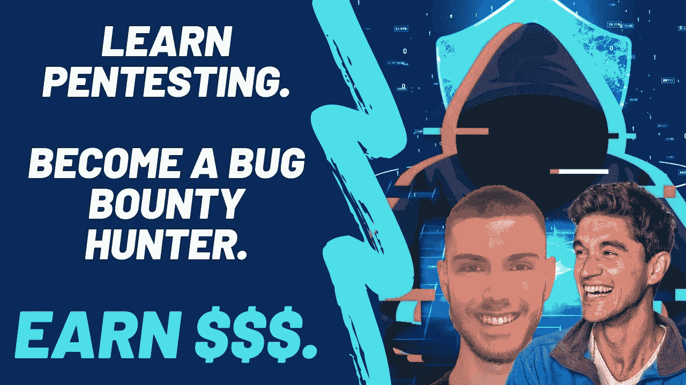
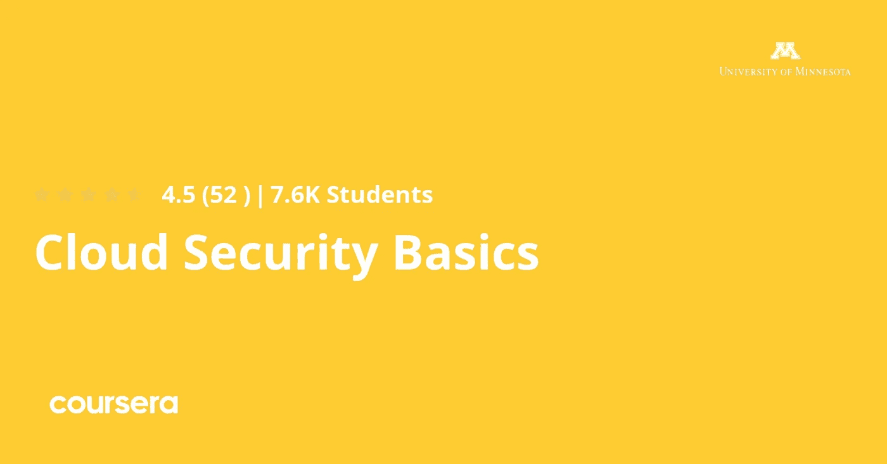
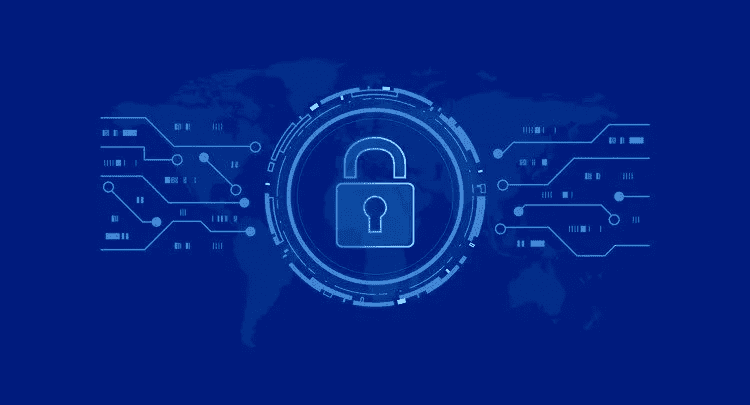
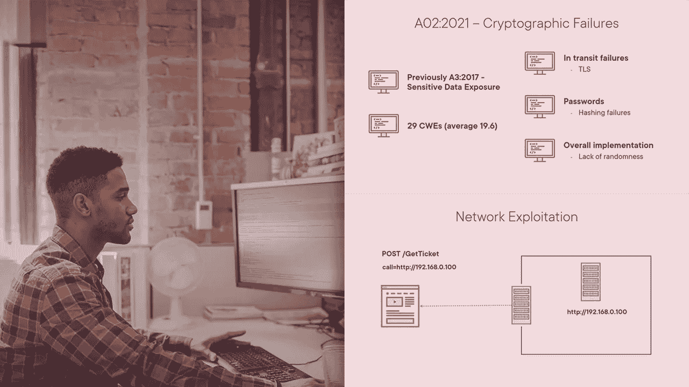
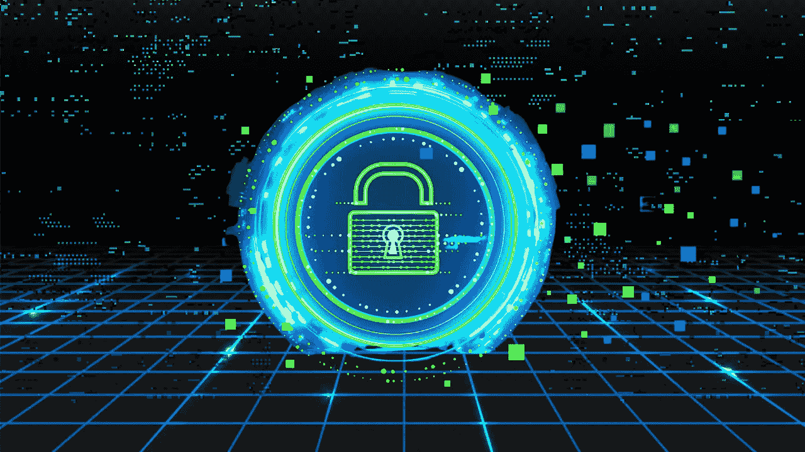

# 2023 年面向初学者和有经验者的 6 大网络安全和云安全在线课程

> 原文：<https://medium.com/javarevisited/5-best-web-security-and-cloud-security-courses-for-beginners-b5b54e8c204?source=collection_archive---------0----------------------->

## 我最喜欢学的在线课程是 2023 年的《初学者 Web Security》。从流行的在线学习平台如 Udemy 和 Pluralsight 收集而来。

大家好，如果你想学习网络安全，想成为一名安全专家，并寻找学习网络安全的最佳在线课程，那么你来对地方了。

之前我已经分享了 [**最佳网络安全课程**](/javarevisited/7-best-cyber-security-courses-for-programmers-and-developers-50afafae050b)[渗透测试课程](https://javarevisited.blogspot.com/2021/04/top-5-courses-to-learn-ethical-hacking.html)，[最佳 Kali Linux 课程](https://javarevisited.blogspot.com/2021/10/top-5-courses-to-learn-kali-linux-in.html)，在这篇文章中，我将分享学习 Web 安全的最佳课程。

如果你不知道，安全专家是技术领域薪酬最高的工作之一，对了解安全和防范网络攻击的人有巨大的需求，这就是这些最佳网络安全课程将帮助你的地方。

在这个每天都在增长的现代世界中，越来越多的敏感数据变得可以在线访问，精明的黑客正在利用这些问题并试图窃取用户的信息，因此它已经成为公司和个人的一个现实问题。

当黑客发现系统中的安全漏洞时，就会发生这种类型的攻击，他们不会向公司揭示这些问题，而是利用这些漏洞，试图访问他们不应该访问的数据。

由于这些攻击每天都在发生，越来越多的人开始意识到这种危险，他们试图了解网络安全，以帮助他们保护自己的网站和业务。

让我们看看 2017 年 GitHub 发生了什么，他们遭受了 DDoS 攻击，黑客获得了超过 1.5 亿人的访问权限，造成了很大的损失。

这份精选的最佳网络安全课程清单来自 [Udemy](https://click.linksynergy.com/deeplink?id=JVFxdTr9V80&mid=39197&murl=https%3A%2F%2Fwww.udemy.com%2F) 、 [Pluralsight](http://pluralsight.pxf.io/c/1193463/424552/7490?u=https%3A%2F%2Fwww.pluralsight.com%2Flearn) 、 [ZTM 学院](https://academy.zerotomastery.io/a/aff_fvgz1fnn/external?affcode=441520_zytgk2dn)和 [Coursera](https://click.linksynergy.com/deeplink?id=JVFxdTr9V80&mid=40328&murl=https%3A%2F%2Fwww.coursera.org%2F) ，它将向你传授基本的安全原则、工具和技术，并为你提供在 2023 年开始网络安全职业生涯所需的技能和知识。

# 2023 年初学者学习的 6 个最佳 Web 安全在线培训课程

在不浪费你更多时间的情况下，这里有一个学习 web 安全的最佳在线课程列表，适用于初学者和有经验的程序员、开发人员、软件工程师、系统管理员以及其他想学习 web 安全或想在利润丰厚的网络安全和 Web 安全领域开始职业生涯的技术人员。

这些课程由著名的网络安全专家和优秀的培训师创建，受到成千上万的开发人员的信任，以学习 2023 年的网络安全基础知识。它们也是最新的，这对任何与安全相关的技术课程都很重要。

## 1.[网络安全&漏洞赏金](https://click.linksynergy.com/deeplink?id=JVFxdTr9V80&mid=39197&murl=https%3A%2F%2Fwww.udemy.com%2Fcourse%2Fweb-security-and-bug-bounty-learn-penetration-testing%2F)

本课程将通过实践教会您学习 web 安全，并有超过 10 小时的视频内容。通过创建您的环境并尝试利用您的技术，渗透测试将是合法和安全的。您将通过在虚拟机器上安装 kali Linux 这样的环境来开始本课程，

然后，您开始使用 Nmap 等工具收集有关网站的信息。您将学习使用 Burpsuite 查找漏洞，并尝试像 HTML 注入和命令注入一样利用它们。您还将学习暴力攻击来猜测密码和 SQL 注入黑客数据库。

该课程由 Andrei Negaoie 及其团队创建，ZTM 学院也提供该课程。如果你是 ZTM 的会员，你可以免费参加这个课程。

**这里是加入本课程的链接** — [网络安全& Bug 赏金](https://academy.zerotomastery.io/a/aff_6zcp960k/external?affcode=441520_zytgk2dn)

如果你还没有 ZTM 会员资格，我建议你申请一个，因为它可以让你访问 Andrei 所有最畅销的课程以及未来的任何新课程。你也可以使用我的优惠券代码**朋友 10** 来获得你选择的任何订阅的 10%的折扣。

 [## ZTM 学院

### 无论你是刚刚开始学习编码，还是想提高你的技能，零到精通学院将教你…

academy.zerotomastery.io](https://academy.zerotomastery.io/p/academy?affcode=441520_zytgk2dn) 

## 2.Coursera 上的[云安全基础知识](https://coursera.pxf.io/c/3294490/1164545/14726?u=https%3A%2F%2Fwww.coursera.org%2Flearn%2Fcloud-security-basics)

当您开发 web 应用程序的代码时，您需要稍后将它托管在云上，比如 Amazon AWS。不过，问题是你的云帐户的一些配置可能会导致安全漏洞，坏人可以利用这一点来访问你的 web 应用程序。

本课程也是云专业 中 [**网络安全的一部分，云专业是 Coursera 中最好的网络安全专业之一，由明尼苏达大学提供。**](https://coursera.pxf.io/c/3294490/1164545/14726?u=https%3A%2F%2Fwww.coursera.org%2Fspecializations%2Fcybersecurity-cloud)

 [## 云中的网络安全

### 保护您的云免受网络攻击。利用现成的网络防御检测和阻止黑客这种专业化…

coursera.pxf.io](https://coursera.pxf.io/c/3294490/1164545/14726?u=https%3A%2F%2Fwww.coursera.org%2Fspecializations%2Fcybersecurity-cloud) 

在本课程中，您将获得互联网安全的介绍，如云安全基础知识，然后了解如何控制在相同网络和网络协议中交互的不同主机。

稍后，了解加密技术以保护您的信息等。简而言之，学习云安全的最佳初级课程之一。如果你想在云安全领域开始你的职业生涯，那么这是最好的 Coursera 项目。

**以下是参加本课程的链接** — [云安全基础知识](https://coursera.pxf.io/c/3294490/1164545/14726?u=https%3A%2F%2Fwww.coursera.org%2Flearn%2Fcloud-security-basics)

顺便说一下，除了单独加入这些课程和专业，你还可以加入 [**Coursera Plus**](https://coursera.pxf.io/c/3294490/1164545/14726?u=https%3A%2F%2Fwww.coursera.org%2Fcourseraplus) ，这是 Coursera 的一个订阅计划，让你可以无限制地访问他们最受欢迎的课程、专业、专业证书和指导项目。

 [## Coursera Plus |无限制访问 7，000 多门在线课程

### 用 Coursera Plus 投资你的职业目标。无限制访问 90%以上的课程、项目…

coursera.pxf.io](https://coursera.pxf.io/c/3294490/1164545/14726?u=https%3A%2F%2Fwww.coursera.org%2Fcourseraplus) 

## 3. [OWASP 十大:Web 应用安全](https://click.linksynergy.com/deeplink?id=CuIbQrBnhiw&mid=39197&murl=https%3A%2F%2Fwww.udemy.com%2Fcourse%2Fweb-application-security-for-absolute-beginners-no-coding%2F)【Udemy 课程】

如果有人决定学习 web 安全，本课程可能是最佳选择，因为它将向您展示 web 安全背后的所有理论，以便您可以在开始学习实际渗透之前，决定这个职业是否适合，甚至了解该领域的概念。

你将首先开始了解 SQL 注入窃取数据库数据的著名安全弱点。

然后，您将了解被破坏的身份验证和 XSS 攻击，这些攻击允许黑客在 web 应用程序中注入客户端代码，并使用它来绕过访问控制和更多弱点，如敏感数据暴露和 CSRF。

**这里是加入本课程的链接**——[OWASP 十大:Web 应用安全](https://click.linksynergy.com/deeplink?id=CuIbQrBnhiw&mid=39197&murl=https%3A%2F%2Fwww.udemy.com%2Fcourse%2Fweb-application-security-for-absolute-beginners-no-coding%2F)

## 4.[网络安全和 OWASP 前 10 名](https://pluralsight.pxf.io/c/1193463/424552/7490?u=https%3A%2F%2Fwww.pluralsight.com%2Fcourses%2Fweb-security-owasp-top10-big-picture)【plural sight 课程】

另一个很棒的课程是向您展示黑客访问您的 web 应用程序和网站时使用的 10 大著名漏洞。本课程将通过简单的解释来解释脆弱性是如何起作用的，以及如何保护自己免受其害。

您将从学习注入开始，这是许多 web 应用程序中普遍存在的弱点。

然后将您的知识扩展到被破坏的身份验证和跨站点脚本(XSS)以在客户端注入代码和设置的错误配置，从而使黑客能够轻松访问您的网站和许多其他漏洞。

**这是参加本课程** — [Web 安全和 OWASP 十大挑战](https://pluralsight.pxf.io/c/1193463/424552/7490?u=https%3A%2F%2Fwww.pluralsight.com%2Fcourses%2Fweb-security-owasp-top10-big-picture)的链接

顺便说一下，你需要一个 [Pluralsight 会员](https://pluralsight.pxf.io/c/1193463/424552/7490?u=https%3A%2F%2Fwww.pluralsight.com%2Fpricing%2Ffree-trial)才能加入这个课程，费用大约是每月 29 美元或每年 299 美元(14%的折扣)。我向所有程序员强烈推荐这个订阅，因为它提供了超过 7000 个在线课程的即时访问，以学习任何技术技能。或者，你也可以使用他们的 [**10 天免费试用**](https://pluralsight.pxf.io/c/1193463/424552/7490?u=https%3A%2F%2Fwww.pluralsight.com%2Fpricing%2Ffree-trial) 免费观看本课程。

 [## 2023 年加入 Pluralsight 的 10 个理由——是的，Pluralsight 值得！！

### 大家好，新年很快就要到了，如果你想通过加入一个在线的…

javarevisited.blogspot.com](https://javarevisited.blogspot.com/2021/12/10-reasons-to-join-pluralsight-in-2022.html) 

## 5.[网络黑客:成为专业的网络高手](https://click.linksynergy.com/deeplink?id=CuIbQrBnhiw&mid=39197&murl=https%3A%2F%2Fwww.udemy.com%2Fcourse%2Fwebhacking%2F)

本综合课程旨在教导没有网络渗透测试经验的初学者，作为一名专业、有道德的黑客，对他们的网站进行安全评估，并报告您的评估。

您将通过建立实验室和学习一些有关 web 的信息来开始本课程。您将通过手动扫描网站和使用一些工具自动开始渗透。

之后再尝试利用会话管理漏洞攻击网站，攻击密码 brut-force 等认证。最后，执行 SQL 注入并创建一份网站安全报告。

**这里是加入本课程的链接**——[网络黑客:成为专业的网络高手](https://click.linksynergy.com/deeplink?id=CuIbQrBnhiw&mid=39197&murl=https%3A%2F%2Fwww.udemy.com%2Fcourse%2Fwebhacking%2F)

## 6.[完整的网络安全训练营:零到精通](https://academy.zerotomastery.io/a/aff_swq47xdd/external?affcode=441520_zytgk2dn)

这是安德烈在《零到精通》或 [*ZTM 学院*](https://academy.zerotomastery.io/a/aff_fvgz1fnn/external?affcode=441520_zytgk2dn) 上发布的关于网络安全的新课程。这是最新、最全面的课程之一，有 48 小时的内容。

该课程是专门为有抱负的网络安全工程师和网络安全专业人员设计的，他们不仅将了解网络安全生态系统，还将了解基本的安全概念、威胁以及他们可以用来应对和防止这些威胁的工具。

您将了解常见的安全漏洞和攻击，如 DDOS，以及如何防止这些漏洞。您还将了解 SQL 注入、缓冲区溢出以及如何检测和修复它们。

如果你想在 2023 年成为一名验笔师或者道德黑客，你也可以加入这个课程。该课程将教你所有的网络安全技能，让你可以自信地申请所有这些工作。

**点击此链接，了解更多关于本课程的信息**——[网络安全训练营:零到精通](https://academy.zerotomastery.io/a/aff_swq47xdd/external?affcode=441520_zytgk2dn)

以上是关于 2023 年学习网络安全和云安全的**最佳在线课程。在这个列表中，我们涵盖了来自 Udemy、Pluralsight 和 Coursera 的 Web 安全课程，并选择了受到成千上万开发人员信任并由专家创建的课程。**

它们还涵盖了在现实安全工作中生存所需的基本 web 安全概念、工具和技术。

学习 web 安全是个不错的选择。平均年薪超过 8 万美元，这使它成为美国收入最高的工作之一，并使你能够保护你的网站免受坏人窃取你的信息和破坏你的业务。

面向 **IT 专业人员**和 Java 程序员的其他**认证资源**

*   [针对初学者的 6 门最佳道德黑客课程](/javarevisited/6-best-ethical-hacking-courses-to-learn-online-fe1fe171d05)
*   [如何在 2023 年成为 DevOps 工程师](https://javarevisited.blogspot.com/2018/09/the-2018-devops-roadmap-your-guide-to-become-DevOps-Engineer.html)
*   [2023 年通过 CompTIA Security+考试的 5 门最佳课程](https://javarevisited.blogspot.com/2020/06/top-5-courses-to-crack-comptia-security-certification-exam-sy0-501.html)
*   [每个软件开发人员都应该学习的 10 件事](https://dev.to/javinpaul/10-things-every-software-developer-should-know-39pe)
*   [十大移动应用开发框架和库](/@javinpaul/10-frameworks-and-libraries-mobile-application-developers-can-learn-in-2020-e0b91391cade)
*   [完整的 Java 开发者路线图](https://javarevisited.blogspot.com/2019/10/the-java-developer-roadmap.html)
*   [2023 年 Java 程序员可以学到的 21 项技术技能](https://javarevisited.blogspot.com/2020/03/top-20-skills-java-developers-can-learn.html#axzz6k4XBgTw4)
*   [破解任何编码面试的 5 个关键技巧](https://javarevisited.blogspot.com/2020/04/5-essential-skills-to-crack-coding-interviews.html)
*   [学习 Linux 命令行的 5 门免费课程](https://hackernoon.com/top-5-free-linux-courses-for-programmers-4a433b4edade)
*   [经验丰富的 Java 开发人员的五大职业选择](https://javarevisited.blogspot.com/2018/10/top-5-carrer-options-for-experienced-java-programmers.html)
*   [完整的前端和后端开发路线图](https://javarevisited.blogspot.com/2019/02/the-2019-web-developer-roadmap.html)
*   [现代网络开发者应该学习的 10 件事](/javarevisited/10-things-aspiring-web-developers-should-learn-in-2021-6747bfbfc12e)
*   [每个开发人员都应该学习的 10 个 Linux 命令选项](https://javarevisited.blogspot.com/2020/08/10-examples-of-essential-linux-commands.html#axzz6nH4euiJX)
*   [5 个免费学习 Python 编码的网站](https://javarevisited.blogspot.com/2019/09/5-websites-to-learn-python-for-free.html)
*   [面向开发人员和安全工程师的 7 门 Linux 课程](/javarevisited/7-best-linux-courses-for-developers-cloud-engineers-and-devops-in-2021-7415314087e1)
*   [10 门针对初学者的免费渗透测试课程](/javarevisited/10-free-courses-to-learn-ethical-hacking-and-penetration-testing-for-beginners-84e40104aa6c)

感谢您阅读本文。如果你喜欢这些*最佳网络安全在线课程*，那么请与你的朋友和同事分享。如果您有任何问题或反馈，请留言。

**P. S.** —如果你热衷于学习网络安全并成为一名安全工程师，但负担不起这些课程或寻找免费的网络安全课程，那么你也可以在 Udemy 上查看这个 [**初学者网络安全课程【免费】**](https://click.linksynergy.com/deeplink?id=JVFxdTr9V80&mid=39197&murl=https%3A%2F%2Fwww.udemy.com%2Fcourse%2Fcertified-secure-netizen%2F) 课程。它是完全免费的，超过 90，000 名学生已经加入了这个课程。

 [## 2023 年学习网络安全的 5 大课程——最佳课程

### 你好伙计们，如果你想学习网络安全，想成为安全专家，并在网上寻找最好的…

javarevisited.blogspot.com](https://javarevisited.blogspot.com/2021/10/top-5-courses-to-learn-web-security-in.html)