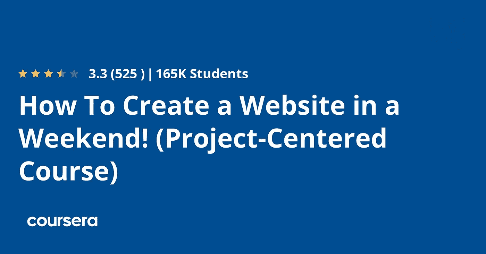

# 2023 年给初学者和有经验的网站开发者的 5 门最佳 WordPress 课程

> 原文：<https://medium.com/javarevisited/5-best-wordpress-courses-for-beginners-and-experienced-website-developers-b45f7976ee40?source=collection_archive---------0----------------------->

## 我最喜欢的在线课程 2023 年学习 Udemy、Pluralsight、Coursera 网站设计与开发的 WordPress 在线课程

大家好，如果你想学习 WordPress 来创建在线网站，并开始你的网页设计和网站开发生涯，那么你来对地方了。以前分享过学习 [HTML](https://javarevisited.blogspot.com/2019/05/top-5-html-5-and-css-3-courses-for-web-developers.html) 、 [CSS](https://www.java67.com/2020/06/top-5-courses-to-learn-advanced-css.html) 、 [JavaScript](https://javarevisited.blogspot.com/2018/06/top-10-courses-to-learn-javascript-in.html) 、 [Bootstrap](https://javarevisited.blogspot.com/2020/07/top-5-courses-to-learn-bootstrap-in.html) 、 [Web 开发](https://javarevisited.blogspot.com/2018/02/top-5-online-courses-to-learn-web-development.html)的最佳课程，今天分享学习 WordPress 的最佳在线培训课程。

WordPress 是创建网站最简单的方法之一。它也是网页设计者和网页开发者最重要的工具之一。如果你知道 WordPress，你可以在不同类型的公司工作，比如创业公司，甚至跨国公司。WordPress 也允许你做很多自由职业者的工作。

使用这项服务的最大好处是，你不需要有以前的知识来创建一个专业的网站。正如我之前所说，如果你想学习 WordPress 并寻找最好的在线课程，那么你来对地方了。在这篇文章中，我分享了学习 WordPress 的最佳在线课程。

这些是从 [Udemy](/javarevisited/my-favorite-udemy-online-courses-for-programmers-and-software-engineers-f9d941dd0035) 和 [Coursera](https://javarevisited.blogspot.com/2020/08/top-10-coursera-courses-specilizations-and-certifications.html) 学习 WordPress 的最好和最值得推荐的在线课程，你可以在家里加入它们来学习这项有用的技能。

在对编程一无所知的情况下，用 WordPress 创建一个网站是可能的。结合已经制作好的主题和插件，其中大部分可以免费使用，你将能够创建几乎任何你想要的东西。

因为简单， [WordPress](https://javarevisited.blogspot.com/2020/08/top-5-courses-to-learn-wordpress-in.html) 是创建网站最流行的方式，尤其是如果你想要一个个人或半专业使用的页面。为了让你对它的扩展程度有个概念，互联网上超过四分之一的网站是由 WordPress 驱动的。WordPress 创造了一种任何人都可以创建网页的方式。使用 WordPress，你可以创建商业网站、博客、电子商务商店、专业作品集等等。所以，让我们直接进入初学者和有经验的开发者学习 WordPress 的最佳课程。

# 2023 年要学习的 5 门最佳 WordPress 在线课程

为了不浪费你的时间，这里列出了学习 WordPress 的最好的在线课程。这些是来自 Udemy 和 Coursera(一个流行的在线培训平台)的最好的 WordPress 课程。

它们是由专家创建的，并由世界各地成千上万的开发人员进行了尝试和测试。它们也非常实惠，因为你可以免费参加 Coursera 课程，并在闪购期间以 10 美元的价格获得 Udemy 课程。

## 1. [WordPress 初学者——快速掌握 WordPress](https://click.linksynergy.com/deeplink?id=JVFxdTr9V80&mid=39197&murl=https%3A%2F%2Fwww.udemy.com%2Fcourse%2Fwordpress-for-beginners-course%2F)

这简直是在 Udemy 上学习 WordPress 的最佳课程。由安德鲁·威廉姆斯创建，这是一个完整的课程，将使你能够掌握 WordPress 的功能。

在教程中，您将学习以下技能:

*   在你的电脑上配置并安装 WordPress，以便在本地使用网站。
*   理解 WordPress 的主要特点
*   创建自定义菜单、自定义帖子和页面
*   知道如何配置一切来响应，看起来专业，并使网页免受网络攻击。

该课程的重点是有一个被动的，经常性收入的附属网站。它包括许多资源，有 8.5 小时的视频教程、14 篇文章和 29 个可供下载的资源。

这里是加入这个 WP 课程的链接——[WordPress for 初学者](https://click.linksynergy.com/deeplink?id=JVFxdTr9V80&mid=39197&murl=https%3A%2F%2Fwww.udemy.com%2Fcourse%2Fwordpress-for-beginners-course%2F)

## 2.初学者:创建你自己的 WordPress 网站

这是另一个关于 Udemy 的很棒的 WordPress 课程。由最受欢迎的也是我最喜欢的 Udemy 导师之一 Phil EbinerI 创建，这门课程是为那些想为他们的商业、爱好或个人生活建立一个网站的人设计的。这是非常实际的，你将会创建一个功能齐全的网站。

以下是您将在本课程中学到的关键技能:

*   如何创建一个完全定制的网站？
*   许多插件增加了网站的功能，使其达到非常专业的水平。

当然，你不需要了解任何关于 [HTML](https://www.java67.com/2020/08/5-best-online-courses-to-learn-html-5.html) 、 [CSS](/javarevisited/top-5-advanced-css-courses-to-learn-flexbox-grid-and-sass-da8e37b09b1d) 或者任何网络编程语言的知识来参加这个课程。教程的重点是在本地工作的网站，所以然后，你可以张贴到互联网上。它包含超过 7 小时的视频和 12 篇文章来补充信息。

这里是加入本课程的链接 — [WordPress for 初学者](https://click.linksynergy.com/deeplink?id=JVFxdTr9V80&mid=39197&murl=https%3A%2F%2Fwww.udemy.com%2Fcourse%2Fthe-complete-wordpress-for-beginners-course%2F)

## 3.[如何制作 WordPress 网站元素或页面生成器](https://click.linksynergy.com/deeplink?id=JVFxdTr9V80&mid=39197&murl=https%3A%2F%2Fwww.udemy.com%2Fcourse%2Fhow-to-make-a-wordpress-website-2017-elementor-builder%2F)

这是 2023 年学习 WordPress 的又一个动手、基于项目的 Udemy 课程。这个 WordPress 课程由 Darrel Wilson 创建，主要是学习 WordPress 的 Elementor 页面生成器。这是为以前没有使用过 WordPress 或类似工具的初学者准备的。

以下是您将在本课程中学到的关键技能:

*   如何从头开始创建一个具有现代风格的网站
*   如何掌握 Elementor 页面生成器？

该课程很快就能完成，因为它只包含一个半小时的流媒体视频和两篇文章。就像学习 WordPress 的速成班。如果你想快速了解 WordPress，那么这个在线课程就是为你准备的。

**这里是加入这个 WordPress 课程的链接**——[如何制作一个 WordPress 网站](https://click.linksynergy.com/deeplink?id=JVFxdTr9V80&mid=39197&murl=https%3A%2F%2Fwww.udemy.com%2Fcourse%2Fhow-to-make-a-wordpress-website-2017-elementor-builder%2F)

## 4.使用 WordPress 建立一个完整的网站

这是在 2 小时内从 Coursera 学习 WordPress 的最佳指导和基于项目的课程之一。由 Stacey Shanklin-Langford 创建的这个 Coursera 指导项目将教你如何使用 WordPress，这样你将能够:

*   创建一个完整的、有吸引力的、用户友好的网站。
*   学习如何通过使用 web 创建工具，利用主题和插件创建网站。
*   拥有一个虚拟空间，向希望保持联系的客户展示您的业务。

本课程结束时，您将能够向网页添加和组织小部件，如社交按钮等。课程时长只有 2 个小时的视频。

在 Coursera 上使用 WordPress 建立一个完整的网站是一个[指导的项目](https://javarevisited.blogspot.com/2020/08/top-10-coursera-projects-to-learn-essential-programming-skills.html)，在这里你只需两个小时就能学会如何使用 WordPress 建立一个网站。引导式项目对学习很有帮助，尤其是对初学者，因为你会一步一步地被引导去创建一个项目，你会在过程中学习。你通常也不需要设置任何东西，只需要在浏览器上编码，你的老师会在分屏视频中解释你想做什么。简而言之，这是一个从零开始学习 WordPress 的免费在线课程。

**这是加入这个在线课程的链接**——[使用 WordPress](https://coursera.pxf.io/c/3294490/1164545/14726?u=https%3A%2F%2Fwww.coursera.org%2Fprojects%2Fbuild-a-full-website-using-wordpress) 建立一个完整的网站

## 5.[如何在周末创建一个网站！](https://coursera.pxf.io/c/3294490/1164545/14726?u=https%3A%2F%2Fwww.coursera.org%2Flearn%2Fhow-to-create-a-website%3FranMID%3D40328%26ranEAID%3DJVFxdTr9V80%26ranSiteID%3DJVFxdTr9V80-JmJOQvy9DK2T7fk57svAfA%26siteID%3DJVFxdTr9V80-JmJOQvy9DK2T7fk57svAfA%26utm_content%3D10%26utm_medium%3Dpartners%26utm_source%3Dlinkshare%26utm_campaign%3DJVFxdTr9V80)【Coursera】

玛格丽特和安妮的 Coursera 课程在一个周末内完成一个完整的网站，这是 Coursera 上另一个受欢迎的 WordPress 课程。超过 150，000 人加入其中，在一个周末创建了一个网站，在一个周末付出了很多努力。

不过一个周末就上榜了。当然，你可以根据你的空闲时间来调整你花在课程上的时间。它的持续时间是 22 小时，所以是一个相当完整的指南。在本教程中，您将:

设计、构建和发布一个包含文本、声音、图像、超链接、插件和社交媒体互动的基本网站。

*   设置域名
*   为你的页面创建一个吸引人的布局
*   正确组织你的内容
*   保护你的网站安全

和列表上的其他课程一样，你不需要有网页设计的前期知识。感谢 Margaret Anne Schedel 博士和 Melissa Clarke 创建了这个精彩的课程。

**这是加入这个可怕课程的链接**——[如何在周末创建一个网站！](https://coursera.pxf.io/c/3294490/1164545/14726?u=https%3A%2F%2Fwww.coursera.org%2Flearn%2Fhow-to-create-a-website%3FranMID%3D40328%26ranEAID%3DJVFxdTr9V80%26ranSiteID%3DJVFxdTr9V80-JmJOQvy9DK2T7fk57svAfA%26siteID%3DJVFxdTr9V80-JmJOQvy9DK2T7fk57svAfA%26utm_content%3D10%26utm_medium%3Dpartners%26utm_source%3Dlinkshare%26utm_campaign%3DJVFxdTr9V80)

顺便说一句，如果你觉得 Coursera 课程有用，因为它们是由谷歌和 IB 等知名公司创建的，由世界各地的知名大学提供，我建议你加入 [**Coursera Plus**](https://coursera.pxf.io/c/3294490/1164545/14726?u=https%3A%2F%2Fwww.coursera.org%2Fcourseraplus) ，这是 Coursera 的一个订阅计划，让你无限制地访问他们最受欢迎的课程、专业、专业证书和指导项目。它每年花费大约 399 美元，但它完全值得你的钱，因为你可以获得无限的证书。

 [## Coursera Plus |无限制访问 7，000 多门在线课程

### 用 Coursera Plus 投资你的职业目标。无限制访问 90%以上的课程、项目…

coursera.pxf.io](https://coursera.pxf.io/c/3294490/1164545/14726?u=https%3A%2F%2Fwww.coursera.org%2Fcourseraplus) 

以上是关于初学者和有经验的开发者学习 WordPress 的最佳在线课程。我们已经看到，WordPress 是一个非常强大的工具，可以在对编程或网页设计一无所知的情况下创建一个网站。这是对这个世界的一个很好的介绍，它允许我们免费创建任何类型的页面。如果你一直想创建一个网页，却不知道如何创建，或者从哪里开始，现在你可以开始创建你一直想要的东西了。选择你喜欢的课程，并开始创建你的精彩网页！

其他**网页设计与开发文章**你可能喜欢

*   [成为全栈式 Web 开发人员的 10 大在线课程](/@javinpaul/top-10-online-courses-to-become-a-fullstack-web-developer-in-2020-d608a6b63232)
*   [Java 和 Web 开发人员应该学习的 10 个框架](http://javarevisited.blogspot.sg/2018/01/10-frameworks-java-and-web-developers-should-learn.html)
*   [网站开发者学习 Angular 的 10 门免费课程](https://javarevisited.blogspot.com/2019/04/10-free-angular-and-react-courses-for.html)
*   [2023 年前端开发者路线图](https://javarevisited.blogspot.com/2019/02/the-2019-web-developer-roadmap.html)
*   [2023 年学习 JavaScript 的 12 门免费课程](/javarevisited/12-free-courses-to-learn-javascript-and-es6-for-beginners-and-experienced-developers-aa35874c9a32)
*   [学习 Node.js 和 Express.js 框架的前 5 门课程](http://javarevisited.blogspot.sg/2018/01/top-5-nodejs-and-express-js-online-courses-for-web-developers.html)
*   [10 JavaScript 教程 Web 开发者应该查看](https://javarevisited.blogspot.com/2018/06/top-10-courses-to-learn-javascript-in.html)
*   [在线学习 React.js 的 5 大课程](https://javarevisited.blogspot.com/2018/08/top-5-react-js-and-redux-courses-to-learn-online.html)
*   [2023 年学习 Web 开发的十大课程](https://dev.to/javinpaul/top-6-courses-to-learn-web-development-best-of-lot-2fae)
*   [学习 Web 开发 TypeScript 的 10 门免费课程](/javarevisited/top-10-free-typescript-courses-to-learn-online-best-of-lot-44bce9da41d1)
*   [每个 Fullstack 开发者都应该知道的 10 个框架](https://javarevisited.blogspot.com/2019/01/10-web-development-frameworks-fullstack-developer-should-learn.html)
*   [2023 react . js 开发者路线图](https://javarevisited.blogspot.com/2018/10/the-2018-react-developer-roadmap.html)
*   [2023 年学习 Web 开发的五大课程](https://javarevisited.blogspot.com/2018/02/top-5-online-courses-to-learn-web-development.html)
*   [2023 年 Java 开发者应该学会的 10 件事](https://javarevisited.blogspot.com/2017/12/10-things-java-programmers-should-learn.html#axzz5atl0BngO)
*   [Web 开发的五大 Python 框架](https://javarevisited.blogspot.com/2019/04/top-5-python-web-development-frameworks.html)
*   [面向开发者的 15 门最佳 JavaScript 在线课程](/javarevisited/10-best-online-courses-to-learn-javascript-in-2020-af5ed0801645)
*   Web 开发人员的 10 门最佳 NodeJS 课程
*   [成为全栈 Java 开发人员的 10 门免费课程](/javarevisited/10-free-full-stack-java-development-courses-for-beginners-and-experienced-programmers-8473390bec03?source=---------6------------------)

感谢您阅读本文。如果你喜欢这些*最好的 WordPress 在线培训课程*，那么请与你的朋友和同事分享。如果您有任何问题或反馈，请留言。

**p . s .**——如果你热衷于学习 WordPress 并寻找免费的在线培训课程，那么你也可以在 Udemy 上查看这个免费课程— [**如何使用 WordPress 创建一个网站(一步一步)**](https://click.linksynergy.com/deeplink?id=JVFxdTr9V80&mid=39197&murl=https%3A%2F%2Fwww.udemy.com%2Fcourse%2Fhow-to-create-a-website-using-wordpress-step-by-step%2F) 。这是掌握 WordPress 的一个很好的课程，而且完全免费。你只需要一个免费的 Udemy 帐户就可以参加这个课程。

 [## 免费 WordPress 教程-如何使用 WordPress 创建一个网站(一步一步)

### 我是一个 30 岁的自学网页设计师和教师，来自爱尔兰北部！我的爱好包括，网页设计…

udemy.com](https://click.linksynergy.com/deeplink?id=JVFxdTr9V80&mid=39197&murl=https%3A%2F%2Fwww.udemy.com%2Fcourse%2Fhow-to-create-a-website-using-wordpress-step-by-step%2F)