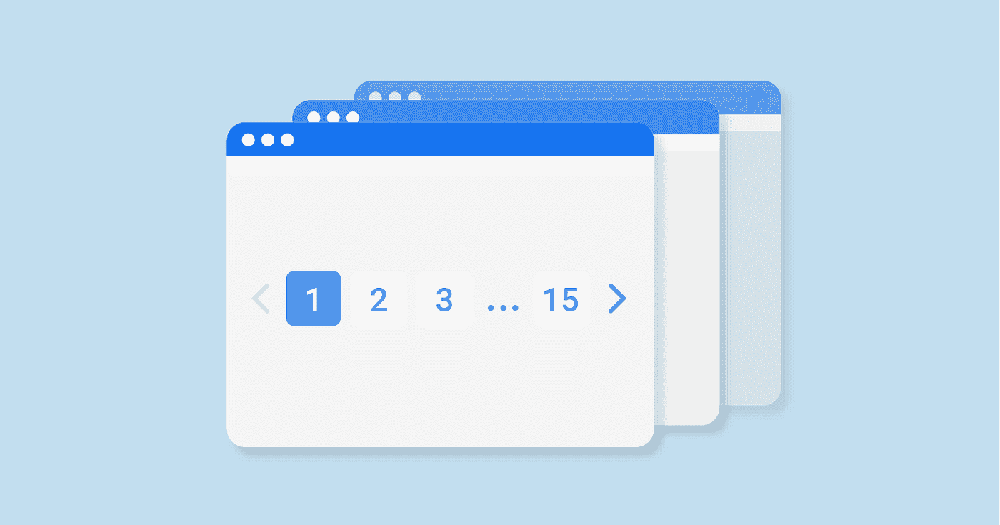
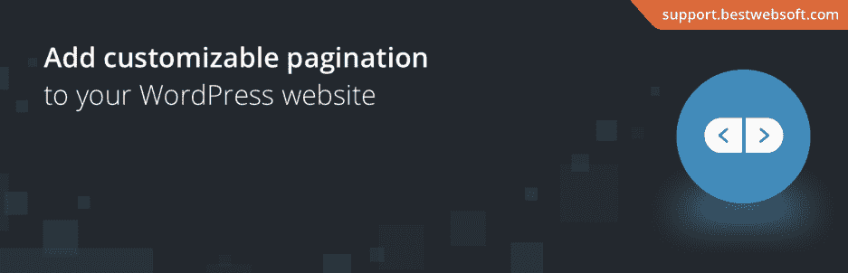
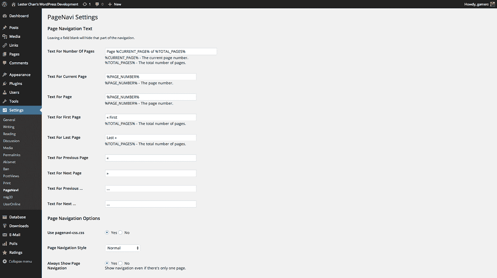
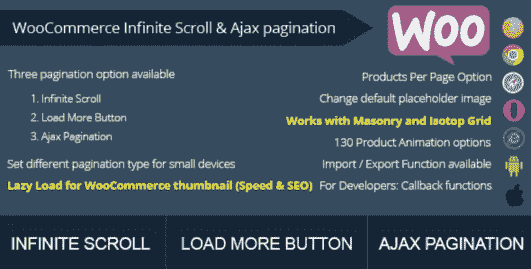

# 5 个最佳 WordPress 分页插件

> 原文：<https://medium.com/javarevisited/5-best-wordpress-pagination-plugins-d068f907bf20?source=collection_archive---------0----------------------->

网站内容和组件的巧妙构建的结构和顺序提高了可读性和用户体验。你建立的网站越有条理，访问者就越有可能找到他想要的东西，并对用户体验感到满意。

分页是使事情变得正确的方法之一，它是任何多页面网站结构中不可或缺的一部分。分页的一个简单例子是网站的页码，通常在底部。或者 WordPress 博客的默认分页看起来像“旧帖子”和“新帖子”

*来源:*[*【https://sitechecker.pro/pagination/】*](https://sitechecker.pro/pagination/)

分页是一种机制，增加了在特定网站或文章的不同部分导航的更多选项。分页也为搜索机器人提供了易于理解的页面信息。

WordPress 主题几乎总是包含一个定制的分页系统。但是，现在很少有人用现成的题材，基本上，都是自己从头做起。因此，分页需要单独创建。

幸运的是，现在您不需要完全了解代码就可以在站点上进行分页或其他操作。什么都有 WordPress 插件。

📖看看我的 [WordPress 会员插件](/javarevisited/6-best-wordpress-membership-plugins-cf1e305e5641)列表。

在这篇文章中，我将回顾一下最好的分页插件和部件。

# [BestWebSoft 分页](https://wordpress.org/plugins/pagination/)

BestWebSoft 团队开发了一个简单的[分页插件](https://wordpress.org/plugins/pagination/)，可以帮助你在网站中创建可理解的导航。它在 WP 目录上的免费版本中提供了最重要的功能，但也有一个扩展功能的高级版本。

## 核心功能:

*   允许向搜索结果、主页、博客、存档、类别、标签和作者页面添加自定义分页
*   允许通过函数给注释 PHP 模板和 PHP 文件添加分页
*   允许自定义箭头
*   可调能见度条件
*   允许添加自定义代码
*   允许选择分页类型(这是一个高级功能)

## 评论中的一些亮点:

*   客户服务团队反应非常迅速
*   有史以来最简单的网站速度增强
*   它在我的网站上效果不好

## [观看演示](https://bestwebsoft.com/demo-pagination-plugin/) ↗️

# [Crocoblock 分页控件](https://crocoblock.com/plugins/jetsmartfilters/?ref=2817)

Elementor 分页小部件是 [JetSmartFilters](https://crocoblock.com/plugins/jetsmartfilters/?ref=2817) 插件的一部分，该插件也包括九个过滤器。将这个小部件添加到出版物或产品档案中，无需重新加载页面就可以显示完整的项目列表。JetSmartFilters 插件中的所有其他功能都允许您为任何帖子类型添加高级过滤器。

## 核心功能:

*   AJAX 技术(页面不会在“下载更多”后重新加载)
*   还有一种简单的技术(重新加载页面)
*   允许启用上一页/下一页按钮并自定义它们

## 评论中的一些亮点:

*   Jet 智能过滤器是最好的 WordPress 过滤器插件
*   很遗憾它不提供免费试用
*   用户友好的 AJAX 过滤器

## [观看演示](https://crocoblock.com/widgets/pagination/?ref=2817) ↗️

# [WP-分页](https://wordpress.org/plugins/wp-paginate/)

使用 [WP-Paginate](https://wordpress.org/plugins/wp-paginate/) ，为你网站的访问者改进导航是一件简单的工作。这是一个简单的插件，可以帮助你给任何网站添加分页。

## 核心功能:

*   添加分页
*   允许为分页链接添加自定义 CSS

## 评论中的一些亮点:

*   一个简单但有效的分页插件

# [WP 页面导航](https://wordpress.org/plugins/wp-pagenavi/)

WP PageNavi 是 WordPress 目录中下载量最大的分页插件。它拥有超过 700，000 个活跃安装，拥有很高的评级和大多数好评。总的来说，WP-PageNavi 是另一个简单易用的插件。

## 核心功能:

*   提供生成可自定义分页链接的模板标记
*   附带了用于更改默认类名的过滤器

## 评论中的一些亮点:

*   这个插件提高了我的主题的可用性
*   完全自动分页

## [查看截图](https://ps.w.org/wp-pagenavi/assets/screenshot-2.png?rev=1206758) ↗️

# [WooCommerce 无限滚动和 Ajax 分页](https://codecanyon.net/item/woocommerce-infinite-scroll-and-ajax-pagination/10192075)

SB Themes 的 WooCommerce 无限滚动和 AJAX 分页是 WordPress 和 WooCommerce 的一个插件，可以帮助你将产品的默认分页转换成 Ajax 分页或无限滚动。

## 核心功能:

*   AJAX 分页
*   移动设备的可调分页
*   WooCommerce 缩略图的延迟加载

## 评论中的一些亮点:

*   强大的客户支持
*   节省了我很多时间
*   工作没有挫折

## [观看演示](https://codecanyon.net/item/woocommerce-infinite-scroll-and-ajax-pagination/full_screen_preview/10192075?_ga=2.181800423.1308133212.1621002957-951860015.1604420018) ↗️

# 最后的想法

对于内容很少的小网站，使用默认的 WordPress 导航可能就足够了。但是如果你想在设计中脱颖而出，改善用户体验，增强你的网站的搜索引擎优化，分页插件是一个很好的选择。没有痛苦。:)

希望你能在列表中找到最完美的 WordPress 插件选项。如果你有任何意见、问题或建议，我很乐意在下面的评论中倾听！