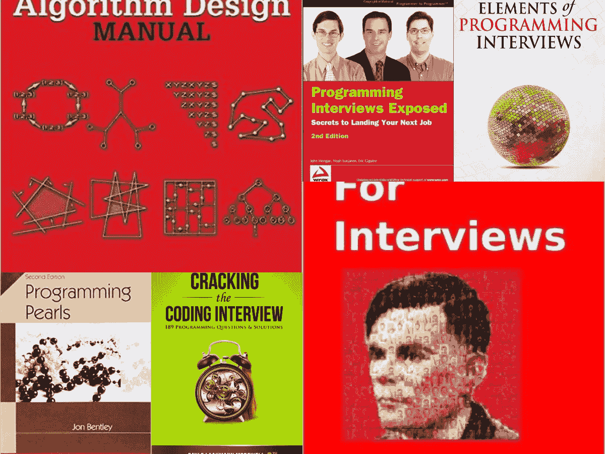
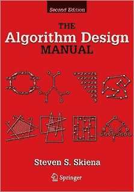
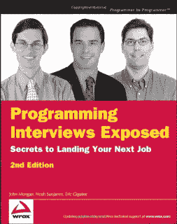
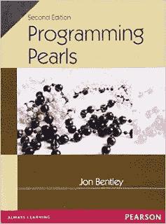

# 5 编面试本，为 2023 年编程工作面试做准备

> 原文：<https://medium.com/javarevisited/5-coding-interview-books-to-prepare-for-programming-job-interviews-d8f63348afaf?source=collection_archive---------0----------------------->

你好伙计们，如果你正在准备编程工作面试，并在寻找一些关于[编程问题](/hackernoon/50-data-structure-and-algorithms-interview-questions-for-programmers-b4b1ac61f5b0)的最佳书籍，那么你来对地方了。

在这篇文章中，我将分享几本好书来准备编码，软件设计和数据结构算法问题，这些问题对于任何编码面试都是必不可少的。

虽然编程面试也会探索软件开发的其他领域，比如编程语言，但你主要会在你的项目中用到，比如， [Python](/javarevisited/my-favorite-books-to-learn-python-in-depth-77465633b46e) ， [JavaScript](https://www.java67.com/2019/01/best-websites-to-learn-javascript-online.html) ， [C++](http://www.java67.com/2018/02/5-free-cpp-courses-to-learn-programming.html) ，或者 [Java](https://javarevisited.blogspot.com/2019/10/the-java-developer-roadmap.html) 。

基于数据库和 SQL 的问题、操作系统和 UNIX 相关的问题、一些软件设计和面向对象的设计模式问题等等，但基于编码的问题是编程面试的核心。

这篇文章只包含了编码访谈的书籍，但是如果你有兴趣寻找其他主题的好书，比如[并发编程](http://javarevisited.blogspot.com/2016/06/5-books-to-learn-concurrent-programming-multithreading-java.html)或 [Java](http://java67.blogspot.com/2016/06/12-must-read-advance-java-books-for-intermediate-programmers.html) 和其他主题，那么只要看看那些链接和我在本文末尾分享的更多内容。

# 2023 年编程或编码面试的 5 本最佳书籍

这是准备编程工作面试必读系列书籍的第二篇。在第[篇](http://javarevisited.blogspot.com/2015/12/5-good-books-for-java-jee-programming.html)文章中，我分享了一些书籍，尤其是关于 Java 面试的书籍，但是在收到许多关于一般编程面试书籍的反馈和请求后，我决定写这篇文章。我也没有把 10、15 或 20 本书列在这个清单上，因为查阅或参考太多的书会很有挑战性。相反，我总是喜欢有一个核心小组，由 3 到 4 本关于某个主题的最佳书籍组成；因此，我只分享 5 本关于编程/编码面试的书。

## 1.[破解编码面试](http://www.amazon.com/dp/098478280X/?tag=javamysqlanta-20)

这是你的通用编码面试本。Gayle Laakmann McDowell 分享了他对编程面试的见解，以及像[谷歌](http://javarevisited.blogspot.com/2012/01/google-interview-questions-answers-top.html)、[亚马逊](http://javarevisited.blogspot.com/2016/01/top-20-amazon-and-google-programming-interview-questions.html)、[微软](http://javarevisited.blogspot.com/2015/12/30-microsoft-interview-questions-for-software-development-engineers.html)、脸书、推特或苹果这样的科技公司在招聘程序员时对候选人的看法。

这些书通过涵盖编程面试的所有关键主题，如数据结构、算法、SQL、Java、网络、[数据库](/javarevisited/top-5-sql-and-database-courses-to-learn-online-48424533ac61)、[操作系统](/javarevisited/6-best-operating-system-courses-for-beginners-to-learn-7d727882d267)，以及如何准备代码面试的一般指南，给出了必要的基础知识。

这本书也是常见编程问题的海量集合，这也是我推荐它的最重要原因。

**这里是购买这本书的链接**——[破解编码面试](http://www.amazon.com/dp/098478280X/?tag=javamysqlanta-20)

如果你愿意，你也可以将这本书与[斯蒂芬·格里德](https://medium.com/u/d058882d8cd2?source=post_page-----d8f63348afaf--------------------------------)的 [**的《编码面试训练营:算法+数据结构**](https://click.linksynergy.com/fs-bin/click?id=JVFxdTr9V80&subid=0&offerid=323058.1&type=10&tmpid=14538&RD_PARM1=https%3A%2F%2Fwww.udemy.com%2Fcoding-interview-bootcamp-algorithms-and-data-structure%2F) 课程相结合，其中包含了更适合面对面一轮面试的基本问题。

<https://click.linksynergy.com/fs-bin/click?id=JVFxdTr9V80&subid=0&offerid=323058.1&type=10&tmpid=14538&RD_PARM1=https%3A%2F%2Fwww.udemy.com%2Fcoding-interview-bootcamp-algorithms-and-data-structure%2F>  

## 2.[算法设计手册](http://www.amazon.com/Algorithm-Design-Manual-Steven-Skiena/dp/1849967202?tag=javamysqlanta-20)

这是另一本编写算法设计的优秀书籍。《算法设计手册》是 Steven S. Skiena 写的，也是著名的算法设计书籍之一。唯一的问题是很难阅读和理解。

如果你和很多程序员一样，觉得理论很多的书很难读，那么我推荐从面试问题开始，遇到算法概念的时候参考这本书。这样你就不会因为只看理论而感到无聊，还会学到关键的算法。

不过，如果你已经忘记了在计算机科学课上教给我们的基本数据结构和算法，那么我强烈建议你首先去参加一个复习课程，比如 Pluralsight 上的 [**算法和数据结构——第一部分和第二部分**](https://pluralsight.pxf.io/c/1193463/424552/7490?u=https%3A%2F%2Fwww.pluralsight.com%2Fcourses%2Fads-part1) 课程，以快速达到速度。

<https://pluralsight.pxf.io/c/1193463/424552/7490?u=https%3A%2F%2Fwww.pluralsight.com%2Fcourses%2Fads-part1>  

否则，在解决本书中的问题时，你将不得不做许多来回的工作。

## 3.[编程面试的要素](http://www.amazon.com/dp/1479274836/?tag=javamysqlanta-20)

这是 Adnan Aziz，Tsung-Hsien Lee，Amit Prakash 关于编程面试的优秀书籍之一，他们已经撰写了几本书，如 [**面试算法**](http://www.amazon.com/Algorithms-For-Interviews-Adnan-Aziz/dp/1453792996?tag=javamysqlanta-20) ，旨在为程序员准备最强大的编程工作面试，如苹果，优步，谷歌，微软和亚马逊。

这本书涵盖了程序员需要通过编码面试的所有基本主题，如数据结构、算法、动态编程、位操作等

这里是购买这本书的链接— [编程面试的要素](http://www.amazon.com/dp/1479274836/?tag=javamysqlanta-20)

简而言之，这是为现场面对面的编码面试做准备的最佳书籍之一，这可能需要你在白板上编码。如果你需要一门课程来配合这本书，看看 [**JavaScript 算法和数据结构大师班**](https://click.linksynergy.com/deeplink?id=JVFxdTr9V80&mid=39197&murl=https%3A%2F%2Fwww.udemy.com%2Fcourse%2Fjs-algorithms-and-data-structures-masterclass%2F) 课程，作者是[柯尔特·斯蒂尔](https://medium.com/u/b74a1e474498?source=post_page-----d8f63348afaf--------------------------------) son Udemy。

## 4.[编程面试曝光](http://www.amazon.com/dp/1118261364/?tag=javamysqlanta-20)

这是我第一次读的关于软件工程师或 IT 面试话题的书。它太好了，我不能不推荐这本书，唯一的问题是它对有经验的程序员来说是必要的，但是如果你想读你的第一本编程面试书，这应该是一本。

它详细解释了如何通过不同方法的利弊来解决问题，还涵盖了编程面试的基本主题，如谜题、[字符串](http://javarevisited.blogspot.com/2015/01/top-20-string-coding-interview-question-programming-interview.html)、[数组](http://javarevisited.blogspot.com/2015/06/top-20-array-interview-questions-and-answers.html)、[编码](http://www.java67.com/2018/05/top-75-programming-interview-questions-answers.html)、[算法](https://hackernoon.com/10-free-data-structure-and-algorithm-courses-junior-developers-should-explore-978b72871af5)、[二叉树](https://codeburst.io/100-coding-interview-questions-for-programmers-b1cf74885fb7)、网络、计算机科学等。

**这里是购买本书的链接**——[编程访谈曝光](http://www.amazon.com/dp/1118261364/?tag=javamysqlanta-20)

而且，如果你问我要一个在线课程来补充这本书，我会强烈推荐 ZTM 学院(他自己的在线课程门户)上的安德烈·尼戈伊的《掌握编码面试:数据结构+算法》一书。

<https://academy.zerotomastery.io/p/master-the-coding-interview-data-structures-algorithms?affcode=441520_zytgk2dn>  

顺便说一句，你需要一个 [**ZTM 会员**](https://academy.zerotomastery.io/p/academy?affcode=441520_zytgk2dn) 来观看这个课程，这个课程每月花费大约 39 美元，但是也提供了许多超级吸引人和有用的课程，比如他的 [Python 课程](/better-programming/top-5-courses-to-learn-python-in-2018-best-of-lot-26644a99e7ec)和这个 [JavaScript 课程](https://academy.zerotomastery.io/p/javascript-projects?affcode=441520_zytgk2dn)。

如果你像我一样是一个不断学习的人，那么我建议你选择年度会员，而不是购买单一课程，你不仅会省钱，而且会使学习变得容易，因为你不需要每次想学习新东西时都购买课程。

## 5.[编程珍珠](http://www.amazon.com/Programming-Pearls-2nd-Edition-Bentley/dp/0201657880?tag=javamysqlanta-20)

这是准备编码面试的最佳书籍之一。Jon Bentley 的《编程珍珠》(第二版)侧重于问题解决、算法设计、正确性和性能。这本书很旧，但仍然值得一读，它将为你准备好任何类型的编程面试。

本书讨论的一些问题简直是编程面试的绝佳资源。不信你自己决定:

在给定的字典中找出所有组的变位词。

**如何在 1.25M 内存中排序 1000 万唯一非负整数，且都小于 107？**

问题并没有在这里结束；您可能会问，如果我们只有 1M(或更少)的可用内存怎么办？如果我们的整数不是唯一的，但是每个值出现的次数是有限的呢？

**这里是购买这本书的链接**——[编程珍珠](http://www.amazon.com/Programming-Pearls-2nd-Edition-Bentley/dp/0201657880?tag=javamysqlanta-20)

顺便说一下，回答这个问题需要良好的计算机基础知识，如数据结构和算法，如果你需要复习，我也建议你加入 Udemy 上的[**数据结构和算法:使用 Java**](https://click.linksynergy.com/fs-bin/click?id=JVFxdTr9V80&subid=0&offerid=323058.1&type=10&tmpid=14538&RD_PARM1=https%3A%2F%2Fwww.udemy.com%2Fdata-structures-and-algorithms-deep-dive-using-java%2F) 课程，这是关于算法的最好课程之一。

<https://click.linksynergy.com/fs-bin/click?id=JVFxdTr9V80&subid=0&offerid=323058.1&type=10&tmpid=14538&RD_PARM1=https%3A%2F%2Fwww.udemy.com%2Fdata-structures-and-algorithms-deep-dive-using-java%2F>  

再来看看这本书里一个比较有意思的问题:

**你有一个文件，里面有 40 亿个 32 位整数。找到一个不在文件中的整数。**
如果你有足够的内存，你会怎么做？如果你只有几百字节的内存，但是允许你写临时文件，那怎么办？

这本书还有一个续集叫做 [**更多编程珍珠**](https://www.amazon.com/More-Programming-Pearls-Confessions-Coder/dp/0201118890?tag=javamysqlanta-20) **:一个程序员的自白**，但那并不是真正关于编程面试或算法设计的，尽管如此，对任何程序员来说都是一本好书。

这些都在这个**关于编码或编程面试的前 5 本书的列表中**。我在这里提到的所有论文都是最好的，你可以根据你的目标和你要面试的公司进一步筛选。

例如，如果你的目标是谷歌，那么编程面试的要素和算法设计手册是必读的，但对于大多数编程工作面试来说， [**破解编码面试书**](http://www.amazon.com/dp/098478280X/?tag=javamysqlanta-20) 将完成工作，因为它涵盖了最受欢迎的问题。

**推荐文章**
如果你和我一样是书呆子，这里有几篇文章可以探索一些最好的编程书籍及其有用的资源:

*   每个程序员都应该读的 10 本书([列出](http://java67.blogspot.com/2015/09/top-10-algorithm-books-every-programmer-read-learn.html))
*   我最喜欢的学习算法和数据结构的免费课程([课程](https://www.freecodecamp.org/news/these-are-the-best-free-courses-to-learn-data-structures-and-algorithms-in-depth-4d52f0d6b35a/?gi=a41bf34d0c99)
*   排名前五的数据结构和算法书籍([列表](http://javarevisited.blogspot.com/2015/07/5-data-structure-and-algorithm-books-best-must-read.html))
*   2023 年学习 Java 编程的 10 门免费课程([课程](/javarevisited/10-free-courses-to-learn-java-in-2019-22d1f33a3915))
*   破解编程求职面试的 10 门课程([门课程](https://hackernoon.com/10-data-structure-algorithms-and-programming-courses-to-crack-any-coding-interview-e1c50b30b927))
*   5 本能让你成为摇滚明星开发者的书
*   每个程序员都应该阅读的 10 本算法书([列举](http://java67.blogspot.com/2015/09/top-10-algorithm-books-every-programmer-read-learn.html))
*   5 本面向对象设计、模式和最佳实践书籍([列表](http://javarevisited.blogspot.com/2013/06/5-must-read-books-to-learn-object.html))
*   10 门学习数据结构和算法的课程([门课程](https://www.java67.com/2019/07/top-10-online-courses-to-learn-data-structure-and-algorithms-in-java.html)
*   6 学习和掌握编程的书籍([列表](http://javarevisited.blogspot.com/2014/09/top-6-books-to-learn-programming-coding.html))
*   2023 年学习 Python 编程的 10 门免费课程([门课程](https://javarevisited.blogspot.com/2018/12/10-free-python-courses-for-programmers.html))
*   来自访谈的 50 多个数据结构和算法问题([问题](https://hackernoon.com/50-data-structure-and-algorithms-interview-questions-for-programmers-b4b1ac61f5b0))

感谢您阅读本文。如果你喜欢这些 Java 数据结构和算法课程，那么请分享给你的朋友和同事。如果您有任何问题或反馈，请留言。

**P. S.** —如果你正在寻找一些免费的算法课程来提高你对数据结构和算法的理解，那么你也应该检查一下这个列表中的 [**免费的数据结构和算法课程**](https://hackernoon.com/10-free-data-structure-and-algorithm-courses-junior-developers-should-explore-978b72871af5) ，它们是完全免费的

<https://hackernoon.com/10-free-data-structure-and-algorithm-courses-junior-developers-should-explore-978b72871af5>  

你准备好面试了吗？ [**参加 TripleByte 的测验**](https://triplebyte.com/a/aWqVhD4/d) ，直接进入顶级科技公司的最后一轮面试，如 Coursera、Adobe、Dropbox、Grammarly、优步、Quora、Evernote、Twitch 等等。

<https://triplebyte.com/a/aWqVhD4/d> 