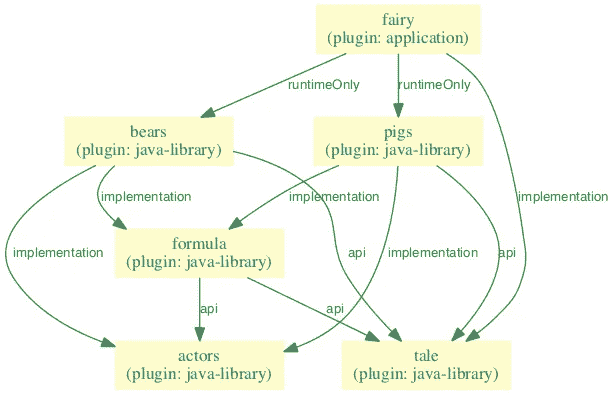
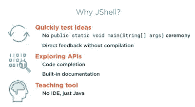
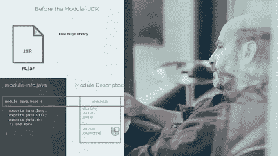

# 深入学习 Java 9 特性的 5 大在线课程

> 原文：<https://medium.com/javarevisited/5-courses-to-learn-java-9-features-in-depth-373f7afcf9fa?source=collection_archive---------0----------------------->

Java 模块系统

JDK 9 上市已经很久了。Java 的新版本包含了一些强大的特性，如模块、API 增强，如不可变列表、集合和映射的工厂方法、[流 API](https://javarevisited.blogspot.com/2014/02/10-example-of-lambda-expressions-in-java8.html#axzz5b2nmYJFN) 和[可选类的一些变化、流程 API 的新特性等。](http://www.java67.com/2018/06/java-8-optional-example-ispresent-orElse-get.html)

因为让自己保持最新总是好的，所以是时候花些时间来学习这些新特性，并利用它们来编写更好的 Java 代码了。当学习一项新技术或新事物时，在线课程效果最佳。他们通过提供必要的材料来帮助你快速入门，并鼓励你学习更多。书本也很好，但是你使用在线课程比书本学得更快，因为它们专注于最重要的部分，不像书本那样提供深入的覆盖面。在我看来，在完成一门课程后，你应该读一本[书](https://dev.to/javinpaul/11-great-reads-for-aspiring-java-devs-1l4k)来进一步巩固概念和填补空白，因为更多的书通常提供更全面的覆盖面。

# 深入学习 Java 9 的 5 个最佳在线课程

在这篇文章中，我将分享一些学习 JDK 9 功能的最佳课程。这些课程旨在帮助您掌握最受欢迎的 Java 9 特性，如模块、反应流、HTTP 2.0 和其他 API 变化。尤其是如果你要去参加一个工作面试或者有一个需要你最好表现的 Java 项目。

## 1.[**Java 9 的新特性——模块和更多！**](https://click.linksynergy.com/fs-bin/click?id=JVFxdTr9V80&subid=0&offerid=323058.1&type=10&tmpid=14538&RD_PARM1=https%3A%2F%2Fwww.udemy.com%2Fwhats-new-in-java-9%2F)

本课程的目标不是简单地快速浏览 Java 9 的所有新特性，而是旨在帮助您真正理解这些新特性。本课程解释了 Java 9 的大部分新特性，如 Java Shell、Java 平台模块系统以及对流程 API 的更新。

Java 平台模块系统大概是大多数开发者在想到 Java 9 的时候都听说过的特性。Java 9 平台模块系统允许 Java 通过模块化 JDK 以及将模块作为一等公民添加到 [Java](https://javarevisited.blogspot.com/2018/07/java-8-tutorials-resources-and-examples-lambda-expression-stream-api-functional-interfaces.html) 中来向前发展。

该课程由 [**完整 Java 大师班**](https://click.linksynergy.com/fs-bin/click?id=JVFxdTr9V80&subid=0&offerid=323058.1&type=10&tmpid=14538&RD_PARM1=https%3A%2F%2Fwww.udemy.com%2Fjava-the-complete-java-developer-course%2F) 讲师 Tim Buchalaka 打造，是深入学习 Java 的最佳课程之一。

 [## Java 9 的新特性——模块和更多！Udemy

### 通过了解 Java 9 的新特性，如模块、JShell、进程等，改善您的职业前景。

www.udemy.com](https://www.udemy.com/whats-new-in-java-9/?LSNPUBID=JVFxdTr9V80&ranEAID=JVFxdTr9V80&ranMID=39197&ranSiteID=JVFxdTr9V80-Wk9z7PCarheUGGtMyhW82g) 

## [**2。Java 9 在 Pluralsight** 上的新特性](http://pluralsight.pxf.io/c/1193463/424552/7490?u=https%3A%2F%2Fwww.pluralsight.com%2Fcourses%2Fjava-9-whats-new)

在本课程“Java 9 的新特性”中，您将大致了解该语言和库的最重要的变化。

首先，你将深入研究模块系统，将模块引入 Java 语言。然后，您将发现`jShell`，这是一个交互式试验 Java 代码的新工具。

最后，您将探索更小的和增量的变化，例如对 API 的改进，如 [Stream](http://www.java67.com/2018/11/10-examples-of-collectors-in-java-8.html) 和 [Optional](https://javarevisited.blogspot.com/2017/04/10-examples-of-optional-in-java-8.html) ，添加集合工厂方法，以及新引入的 API，如`ProcessHandle` 和`HttpClient`。完成本课程后，您将可以在自己的项目中充分利用 Java 9。该课程由 Sander Mak 创建，他是广受欢迎的 [**Java 9 模块化:开发可维护应用程序的模式和实践**](https://www.amazon.com/Java-Modularity-Developing-Maintainable-Applications/dp/1491954167?tag=javamysqlanta-20) 一书的作者，该书也是深入学习模块化的极好资源。

## [**3。Java 9 大师班—初学者到专家**](https://click.linksynergy.com/fs-bin/click?id=JVFxdTr9V80&subid=0&offerid=323058.1&type=10&tmpid=14538&RD_PARM1=https%3A%2F%2Fwww.udemy.com%2Fthe-complete-java-9-masterclass-beginner-to-expert%2F)

本课程不仅涵盖了 Java 9 的新特性，还告诉你如何使用 [Java 9](http://www.java67.com/2018/01/top-10-java-9-tutorials-and-courses.html) 开发应用程序。是一门完整的 Java 学习课程。

比如你刚开始编程，选择 [Java 9](https://hackernoon.com/top-10-java-9-tutorials-and-courses-best-of-lot-must-read-9a25c511a573) 开始，这是你应该加入的课程。

 [## Java 大师班-初学者到专家指南| Udemy

### 更新了新的 Java 9 特性========加入 8，000 多名学生的行列，他们正在享受并从……

www.udemy.com](https://www.udemy.com/the-complete-java-9-masterclass-beginner-to-expert/?ranMID=39197&ranEAID=JVFxdTr9V80&ranSiteID=JVFxdTr9V80-OwvUcZ.J_os9tqTdqjUyDw&LSNPUBID=JVFxdTr9V80) 

## [**4。用 Java 9 学习 JShell 循序渐进**](https://click.linksynergy.com/fs-bin/click?id=JVFxdTr9V80&subid=0&offerid=323058.1&type=10&tmpid=14538&RD_PARM1=https%3A%2F%2Fwww.udemy.com%2Fjshell-tutorial-for-beginners-with-java-9%2F)

JShell 是 Java 9 中的一个新特性，它允许您快速、轻松地运行代码。在本课程中，您将学习如何使用 Java REPL JShell 成为一名更高效的程序员。

你将学习如何使用`JShell` 探索 Java，并理解各种 JShell 命令。还提供了一些技巧和窍门，让你成为一名 JShell 专家。

良好的 JShell 知识将帮助你在探索[Java API](https://javarevisited.blogspot.com/2018/01/top-20-libraries-and-apis-for-java-programmers.html)和[库](https://dev.to/javinpaul/10-frameworks-java-and-web-developers-can-learn-in-2019-17ke)时变得更加高效。

 [## 用 Java 学习 JShell 循序渐进| Udemy

### master JShell——Java 9 最重要的新特性

www.udemy.com](https://www.udemy.com/jshell-tutorial-for-beginners-with-java-9/?ranMID=39197&ranEAID=JVFxdTr9V80&ranSiteID=JVFxdTr9V80-BeKSJN8j27tPtPUfu8m9Gw&LSNPUBID=JVFxdTr9V80) 

## [**5。Java 9 模块化:先看**](http://pluralsight.pxf.io/c/1193463/424552/7490?u=https%3A%2F%2Fwww.pluralsight.com%2Fcourses%2Fjava-9-modularity-first-look)

这是一门深入学习 Java 模块或项目 Jigsaw 的好课程。您将了解什么是模块，以及使用 Java 模块系统的模块化设计如何提高 Java 应用程序的灵活性、可维护性和安全性。

它还讨论了将现有应用程序迁移到新的 [Java 模块系统的问题](https://www.amazon.com/Java-Module-System-Nicolai-Parlog/dp/1617294284/?tag=javamysqlanta-20)也得到解决，具有自动模块等特性。当你学完这门课程后，像封装和显式模块依赖这样的术语对你来说将不再是秘密。

## [**6。学习路径:Java 9:用 Java 9 编程**](https://click.linksynergy.com/fs-bin/click?id=JVFxdTr9V80&subid=0&offerid=323058.1&type=10&tmpid=14538&RD_PARM1=https%3A%2F%2Fwww.udemy.com%2Flearning-path-java-9-programming-with-java-9%2F)

Packt publishing ( [Packt](https://medium.com/u/8ef58ed680e6?source=post_page-----373f7afcf9fa--------------------------------) )创建了一系列教授 Java 9 特性的课程，也称为学习途径。在这个学习路径中，您将学习使用 Java 9 的函数式和反应式编程。

它首先介绍函数式编程，然后教你如何使用 [Spring](https://javarevisited.blogspot.com/2016/12/top-5-spring-and-hibernate-training-courses-java-jee-programmers.html) 、 [Jersey](https://javarevisited.blogspot.com/2017/02/difference-between-jax-rs-restlet-jersey-apache-cfx-RESTEasy.html) 和 [Java 9](https://medium.freecodecamp.org/these-are-the-best-free-courses-to-help-you-learn-java-8-and-java-9-a7615c8644ab) 特性构建一个 [RESTful web 服务](https://dev.to/javinpaul/why-spring-mvc-is-best-for-creating-restful-web-services-in-java-358p)。

 [## 学习路径:Java 9:用 Java 9 编程| Udemy

### 如果你是一个希望根据行业标准保持更新的程序员，那么这个学习路径是为…

www.udemy.com](https://www.udemy.com/learning-path-java-9-programming-with-java-9/?ranMID=39197&ranEAID=JVFxdTr9V80&ranSiteID=JVFxdTr9V80-1VULnZxuoZLdFJGVihhjlQ&LSNPUBID=JVFxdTr9V80) 

以上就是从头开始学习 Java 9 的一些**最佳课程**。这些课程不仅很好地概述了 JDK 9 的基本特性，还展示了一些真实世界的例子，展示了如何使用 JDK 9 的特性，比如构建 RESTful web 服务。

永远不会太晚，今天可能是掌握 JDK 9 特性的最佳时机，用 Java 的最新和最棒的特性来更新自己。

其他**免费 Java 编程资源**你可能喜欢
[面向 Java 开发者的 5 门免费 Spring 框架课程](http://www.java67.com/2017/11/top-5-free-core-spring-mvc-courses-learn-online.html)
[深入学习 Web 开发的 5 门课程](https://javarevisited.blogspot.com/2018/02/top-5-online-courses-to-learn-web-development.html)
[学习大数据和 Apache Spark 的 5 门课程](http://javarevisited.blogspot.com/2017/12/top-5-courses-to-learn-big-data-and.html)
[面向 Web 开发者的 10 门 JavaScript 教程和课程](https://javarevisited.blogspot.com/2018/06/top-10-courses-to-learn-javascript-in.html)
[深入学习 Spring Boot 的 5 门课程](https://javarevisited.blogspot.com/2018/05/top-5-courses-to-learn-spring-boot-in.html)
[5 门免费数据](https://javarevisited.blogspot.com/2018/01/top-5-free-data-structure-and-algorithm-courses-java--c-programmers.html) [面向程序员和开发人员的 5 门免费 Linux 课程](http://www.java67.com/2018/02/5-free-linux-unix-courses-for-programmers-learn-online.html)
[学习 React JS 框架的 5 门免费课程](http://www.java67.com/2018/02/5-free-react-courses-for-web-developers.html)
[学习 Java 编程最好的方法是什么？](/javarevisited/3-ways-to-learn-java-and-become-a-software-developer-in-2023-3d885a58cd3c)
[如何深入学习 Spring 框架和 Spring Boot](/javarevisited/how-to-learn-spring-framework-spring-mvc-spring-boot-and-spring-security-best-resources-202e7f6ab3c8?source=user_profile---------11----------------------------)

感谢您阅读本文。如果你喜欢这些 Java 9 课程，请与你的朋友和同事分享。如果您有任何问题或反馈，请留言。

**附言**。—如果你是一个初学者，刚开始学 Java，那么 [**完整的 Java 大师班**](https://click.linksynergy.com/fs-bin/click?id=JVFxdTr9V80&subid=0&offerid=323058.1&type=10&tmpid=14538&RD_PARM1=https%3A%2F%2Fwww.udemy.com%2Fjava-the-complete-java-developer-course%2F) ，深入学习 Java 最好的、最新的在线课程之一。

 [## 完整的 Java 软件开发人员大师班(针对 Java 10)

### 你刚刚在网上偶然发现了最完整、最深入的 Java 编程课程。拥有超过 480，000 名学生…

udemy.com](https://click.linksynergy.com/fs-bin/click?id=JVFxdTr9V80&subid=0&offerid=323058.1&type=10&tmpid=14538&RD_PARM1=https%3A%2F%2Fwww.udemy.com%2Fjava-the-complete-java-developer-course%2F)