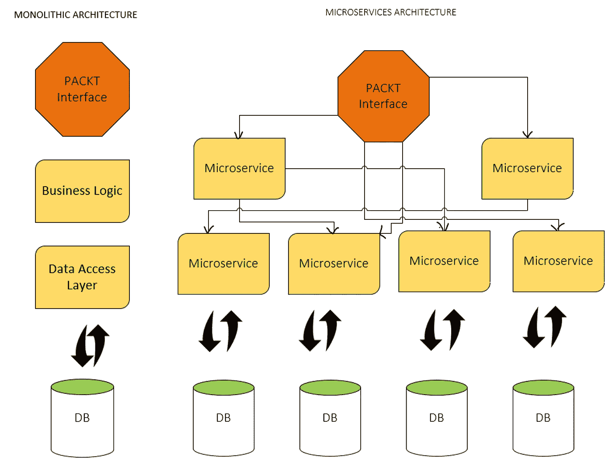

# 2023 年每个 Java 开发人员都应该学习的 5 个基本框架

> 原文：<https://medium.com/javarevisited/5-essential-frameworks-every-java-developer-should-learn-6ed83315f1fb?source=collection_archive---------0----------------------->

## Spring、Hibernate、Spring Boot、Spring Securit 和 Spring Cloud 是最基本的 Java 框架。

image_credit — Spring Boot 基本面

你好，Java 开发人员，如果你正在考虑要成为一名完整的开发人员应该学习哪些框架，那么你来对地方了。之前，我已经分享了 [**完整的 Java 开发者路线图**](https://javarevisited.blogspot.com/2019/10/the-java-developer-roadmap.html) ，今天我将分享你可以学习的最基本的 Java 框架。

虽然有几十种 Java 框架可用于不同的事情，但你不需要学习它们。当你真正需要的时候，你可以学习其中的一些，但是了解和学习基本的 Java 框架，比如 [Spring](/javarevisited/10-best-online-courses-to-learn-spring-framework-in-2020-f7f73599c2fd) 和 [Hibernate](/javarevisited/top-5-hibernate-online-training-courses-for-beginners-and-advance-java-programmers-469460596b2b) 是必须的。

这不仅会提升你的个人资料，还会让你有资格从事许多需要良好的 Spring、Hibernate 和 Spring boot 技能的 Java 开发人员工作。

不可否认，只要了解核心 Java、[多线程](https://javarevisited.blogspot.com/2018/06/top-5-java-multithreading-and-concurrency-courses-experienced-programmers.html)和[模式](/javarevisited/7-best-online-courses-to-learn-object-oriented-design-pattern-in-java-749b6399af59)，你就能找到一份好的 Java 开发人员工作，而这些框架的实践经验可以打开更多的机会之门。

如果你想知道如何学习这些框架，那么不要担心，我已经分享了免费和付费的在线课程和书籍，你可以自己阅读来学习这些基本的 Java 框架。

# 2023 年开发人员需要学习的 5 大基本 Java 框架

为了不浪费您的时间，这里是我列出的每个 Java 开发人员都应该学习的最基本的 Java 框架。这并不奇怪，因为我只选择了到处都在使用的最流行的 Java 框架。

## 1.[弹簧框架](https://spring.io/)

很有可能你已经知道了 Spring 框架，但是如果你不知道，那么这应该是你在 2023 年学习的第一个 Java 框架。

Spring framework 不需要任何介绍，因为它已经成为开发服务器端应用程序的标准 Java 栈，每个 Java 开发人员都应该知道 Spring Framework。

如果你的目标是成为一名[服务器端 Java 开发人员](/javarevisited/top-10-frameworks-full-stack-java-developers-can-learn-in-2020-5995021401e5)，那么你将需要在几乎所有的 Java 面试中展示 Spring 框架技能。除了 Hibernate，Spring 是 Java 程序员的另一项必备技能。虽然 Spring 是一个全面而庞大的框架，并且在它下面有几个项目，如 Spring Boot、Spring Cloud、Spring Data 等等，但是你至少应该知道 Spring core 和 Spring MVC。

如果你已经下定决心在 2023 年学习 Spring 框架，只是想找一些优秀的资源开始，我推荐 [**Spring Framework:初学者到大师**](https://click.linksynergy.com/fs-bin/click?id=JVFxdTr9V80&subid=0&offerid=323058.1&type=10&tmpid=14538&RD_PARM1=https%3A%2F%2Fwww.udemy.com%2Fspring-framework-5-beginner-to-guru%2F) 课程，这是深入学习 Spring 框架的最佳资源之一。

如果你更喜欢书，你也可以看看这个[基础](https://www.java67.com/2016/12/5-spring-framework-books-for-java-programmers.html)和[高级弹簧书](https://javarevisited.blogspot.com/2018/04/5-spring-framework-books-experienced-Java-developers-2018.html)的列表，万一你需要更多的选择，这个[篇](https://javarevisited.blogspot.com/2018/06/top-6-spring-framework-online-courses-Java-programmers.html)也有很多优秀的弹簧资源。

## 2.[冬眠](https://hibernate.org/)

毫无疑问，Hibernate 是领先的 Java 持久性框架，如果你还不知道 Hibernate，那么你应该在 2023 年学习。几乎每个 Java 项目中都有 Hibernate，尤其是在服务器端的 Java 应用程序中。它还提供了 JPA 或 Java 持久性 API 的实现，Java 持久性 API 是持久性的 Java 标准。

除了 Spring 框架， [Hibernate](/javarevisited/top-5-hibernate-online-training-courses-for-beginners-and-advance-java-programmers-469460596b2b) 也是 Java 开发人员最抢手的技能，你会发现大多数 Java Web 开发人员的工作描述中都提到了 Hibernate。

它也是一个已建立的框架，这意味着无论你在学习 Hibernate 上投入多少努力，都会对你的职业生涯有很大帮助。

如果你已经决定 2023 年学习 Hibernate，只是需要课程之类的资源，那么我推荐你去 Udemy 上查德德比的 [**Spring & Hibernate for 初学者**](https://click.linksynergy.com/deeplink?id=JVFxdTr9V80&mid=39197&murl=https%3A%2F%2Fwww.udemy.com%2Fcourse%2Fspring-hibernate-tutorial%2F) (包含 Spring Boot)。你可以在一个课程中同时学习春天和冬眠。

如果你喜欢从书本中学习而不是从课程中学习，那么你也可以看看这个为 Java 开发人员提供的学习 Hibernate 的最佳书籍列表。如果你问我，我会把课程和书籍与快速深入地学习 Hibernate 结合起来。

在线课程对 80%的时间里使用的 20%的功能提供了很好的概述，而书籍则适合深入某个特定主题。如果你需要更多的选项，请查看这个列表，列出了前五名 Hibernate 和 JPA 课程，其中我分享了一些为 Java 开发人员学习 Hibernate 和 JPA 的最佳课程。

## 3. [Spring Boot](https://spring.io/projects/spring-boot)

我使用 Spring 框架已经很多年了，所以当我第一次被介绍到 Spring Boot 时，我对配置的相对缺乏感到非常惊讶。

使用 Spring Boot 编写基于 Spring 的 Java 应用程序就像使用 [main()](http://www.java67.com/2014/02/can-you-run-java-program-without-main-method.html) 方法编写核心 Java 应用程序一样简单。尽管我用过 Spring Boot，但我还有很多东西要学，这就是为什么它会出现在我 2023 年要学的东西的清单上。

我建议每个 Java 开发人员学习 Spring Boot，如果你已经知道，花点时间更好地学习它。关于 Spring Boot 有太多东西要学了。

如果你需要一门课程，我推荐 Udemy 的 [**Spring Boot 大师班**](https://click.linksynergy.com/fs-bin/click?id=JVFxdTr9V80&subid=0&offerid=323058.1&type=10&tmpid=14538&RD_PARM1=https%3A%2F%2Fwww.udemy.com%2Fspring-boot-intro%2F) ，这是学习 Spring Boot 最好的在线课程之一，售价仅 10 美元。

如果你更喜欢书，你也可以看看这个[最佳 Spring Boot 书籍](/hackernoon/top-5-spring-boot-and-spring-cloud-books-for-java-developers-75df155dcedc?source=---------23------------------)的列表，万一你需要更多的选择，这篇文章也有很多优秀的[高级 Spring Boot 课程](/javarevisited/10-advanced-spring-boot-courses-for-experienced-java-developers-5e57606816bd?source=collection_home---4------0-----------------------)供高级开发者使用。

## 4.春天安全

安全是不可替代的，在 2023 年，它将更加重要。由于 Spring Security 已经成为 Java 世界中 web security 的代名词，所以在 2023 年用 Spring Security 的最新版本更新自己是完全有意义的。

Spring security 的新版本 5.0 包括许多错误修复和一个完整的新 OAuth 2.0 模块。

即使你不了解 Spring Security，你也要考虑在 2023 年学习它，没有比加入 Pluralsight 的[Spring Security Fundamentals](https://pluralsight.pxf.io/c/1193463/424552/7490?u=https%3A%2F%2Fwww.pluralsight.com%2Fcourses%2Fspring-security-fundamentals)和欧根帕拉斯基夫的 **s** [**学习 Spring Security master class**](https://courses.baeldung.com/p/learn-spring-security-the-master-class?utm_source=javarevisited&utm_medium=web&utm_campaign=lss&affcode=22136_bkwjs9xa)更好的方法了。我最喜欢的两门学习春季安全的课程。

如果你喜欢书，你也可以看看这个[高级 spring 书籍列表，](/javarevisited/5-advanced-spring-framework-books-experienced-java-developers-should-read-in-2020-best-of-lot-2a786fc5ad31?source=---------6-----------------------)如果你需要更多的选择，这篇文章也有很多优秀的 [spring security 和 OAuth 2 资源](/javarevisited/top-10-courses-to-learn-spring-security-and-oauth2-with-spring-boot-for-java-developers-8f0222d6066d?source=---------5-----------------------)。

## 5.春天的云

为云开发应用有其自身的挑战，Spring Cloud 旨在解决这些挑战。它为 Java 开发人员提供了快速构建一些基于云的应用程序的常见模式的工具，如配置管理、服务发现、电路中断、客户端负载平衡、智能路由、分布式会话等。

当你开发一个基于云的 Java 应用时，你不需要担心硬件、安装操作系统、数据库和其他软件。然而，你的应用程序仍然需要这些功能。

像 Cloud-Found 和 Heroku 这样的云提供商为你提供这些服务，但是你需要做大量的工作来访问这些服务，这就是 Spring Cloud 的帮助。

它提供了一个简单高效的云连接器，通过抽象所有特定于云的细节来访问这些服务，这意味着您可以在云中访问这些基本服务，就像在非云环境中一样，就像您只需知道主机、端口和登录凭据就可以连接到数据库一样。

如果你正在考虑基于云的 Java 应用，喜欢微服务，并且想学习 Spring Cloud 如何帮助你，我建议你去看看 [**大师微服务与 Spring Boot 和 Spring Cloud**](https://click.linksynergy.com/fs-bin/click?id=JVFxdTr9V80&subid=0&offerid=323058.1&type=10&tmpid=14538&RD_PARM1=https%3A%2F%2Fwww.udemy.com%2Fmicroservices-with-spring-boot-and-spring-cloud%2F) ，学习这两个伟大框架的最佳课程之一。

如果你更喜欢从书本中学习，那么 Josh Long 和 company 的[**Cloud Native Java**](https://www.amazon.com/Cloud-Native-Java-Designing-Resilient/dp/1449374646?tag=javamysqlanta-20)这本书是另一个很好的入门资源，如果你需要更多的选择，这篇文章也有很多很好的 [spring 云和微服务资源](/javarevisited/5-best-courses-to-learn-spring-cloud-and-microservices-1ddea1af7012)。

这就是每个 Java 程序员都应该学习的最好的 Java 框架。正如我所说的，这些是绝对必要的框架，增强了您作为 Java 开发人员的形象，使您有资格从事许多工作。

只要把这些框架放在你的 LinkedIn 个人资料中，就会增加你从招聘人员那里收到的请求数量，因为现在每个人都在进行基于关键字的搜索，以找到合适的开发人员和程序员。

其他 **Java 和编程文章**你可能喜欢的
[Java 程序员可以学习的 10 个技能加速自己的职业生涯](https://dev.to/javinpaul/10-skills-java-programmer-can-learn-to-accelerate-their-career-3nlh?fbclid=IwAR19fdBhg3zriyqcZyo9CfvMSHW_xKmNggTndkN-fFFfMaWH6VHG5T_Z6Rc)
[Java 开发人员应该知道的 10 个测试工具和库](http://javarevisited.blogspot.sg/2018/01/10-unit-testing-and-integration-tools-for-java-programmers.html)
[5 本面向有经验开发人员的 Spring 框架书](http://javarevisited.blogspot.sg/2018/04/5-spring-framework-books-experienced-Java-developers-2018.html)
[成为软件架构师的 5 门课程](/javarevisited/top-5-courses-to-learn-software-architecture-in-2020-best-of-lot-5d34ebc52e9)
[20 个春季 MVC 面试问题及答案](http://javarevisited.blogspot.sg/2018/02/top-20-spring-rest-interview-questions-answers-java.html#axzz57Kv4wGXe)
[2023 年 Java 开发人员应该阅读的 10 本书](http://www.java67.com/2018/02/10-books-java-developers-should-read-in.html)
开发者路线图
[2023 年你可以看的 21 本 Java 书](/javarevisited/10-books-java-developers-should-read-in-2020-e6222f25cc72)
[用 Spring Cloud 学习微服务的前 5 门课程](http://javarevisited.blogspot.sg/2018/02/top-5-spring-microservices-courses-with-spring-boot-and-spring-cloud.html)
[Java 开发者应该知道的前 20 个库](https://javarevisited.blogspot.com/2018/01/top-20-libraries-and-apis-for-java-programmers.html)
[Java 10 发布—你应该知道的 10 个新特性](http://javarevisited.blogspot.sg/2018/03/java-10-released-10-new-features-java.html)
[2023 年 DevOps 路线图—如何更好地学习 devo PS](https://javarevisited.blogspot.com/2018/09/the-2018-devops-roadmap-your-guide-to-become-DevOps-Engineer.html)

感谢您阅读本文。如果你喜欢这些 Java 框架，那么请分享给你的朋友和同事。如果您有任何问题或反馈，请留言。

**P.S. —** 如果你是 Java 世界的新手，想在学习这些高级框架之前掌握核心 Java，那么我建议你查看这些学习核心 Java 的 [**最佳课程**](/javarevisited/top-5-java-online-courses-for-beginners-best-of-lot-1e1e240a758) 来提升你的技能并掌握基础知识。

 [## 面向初学者和有经验的程序员的 10 大免费 Java 课程

### 互联网上充满了有用的资源，无论你想学什么，都有一些有用的东西可以提供给…

www.java67.com](https://www.java67.com/2018/08/top-10-free-java-courses-for-beginners-experienced-developers.html)  [## 2023 年 Java 开发人员可以学习的微服务开发 5 大框架

### Java 程序员们好，2023 年新年快乐。如果你正在考虑用 Java 进行微服务开发，并且正在寻找…

medium.com](/javarevisited/top-5-frameworks-java-developers-can-learn-for-microservices-development-in-2022-848da66d6651)  [## 十大微服务设计模式和原则-示例

### 让我们看看微服务架构构建的原则。1.可扩展性 2。灵活性 3…

javarevisited.blogspot.com](https://javarevisited.blogspot.com/2021/09/microservices-design-patterns-principles.html)