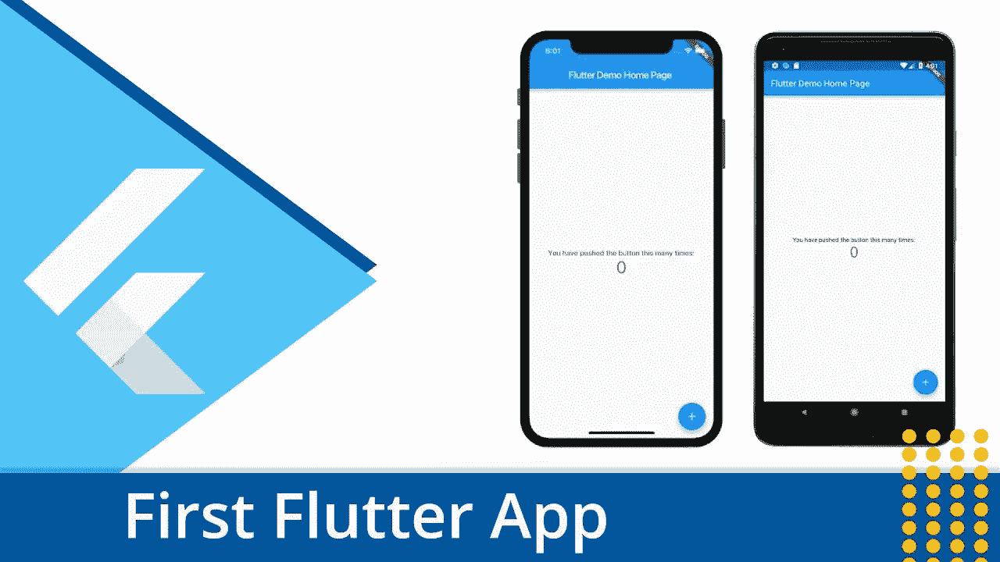
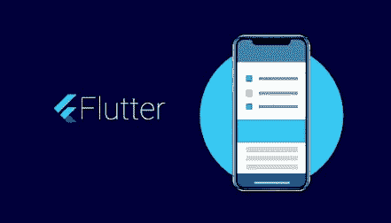
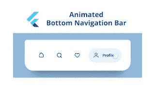
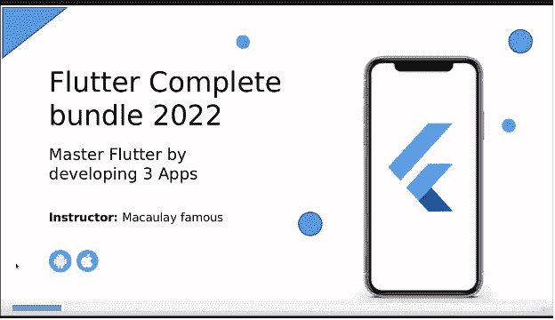
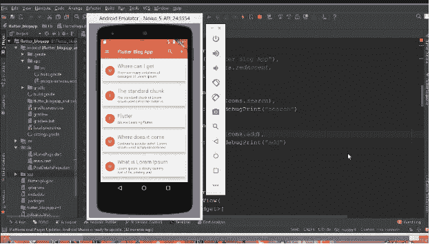

# 2023 年初学 App 开发的 8 个颤振项目

> 原文：<https://medium.com/javarevisited/5-flutter-projects-for-beginners-to-learn-app-development-b581e6cdae19?source=collection_archive---------0----------------------->

## 寻找颤振项目思路？这里是我最喜欢的 Flutter 项目，你可以构建它们来更好地学习 Flutter 和 app 开发。

你好，伙计们，如果你正在学习 Flutter，我建议你做项目，开发应用程序，因为没有比开发应用程序更好的学习 Flutter 的方法了。如果你正在考虑建造什么，寻找项目创意，那么你来对地方了。之前，我已经分享了 [**最佳颤振在线课程**](/javarevisited/my-favorite-flutter-and-dart-programming-courses-for-beginners-9e8355710d78) 以及[最佳免费颤振课程](/javarevisited/7-free-flutter-online-courses-to-build-android-and-ios-apps-in-2021-54c0c92f16f9)，在这篇文章中，我将分享 2023 年你可以建立的学习颤振的最佳项目。

如果你不知道 Flutter 是一个领先的应用程序开发框架，它来自谷歌，关于 Flutter 最好的事情是，它允许你用单一代码库为 Android 和 iOS 平台创建应用程序，这对许多公司和开发者来说是一个巨大的优势。

学习 Flutter 来为 Android 和 iOS 构建移动应用程序并不能让你成为一名专业的开发人员，人们可以依靠你来构建他们的应用程序。事实上，你需要尽可能多的训练来创建移动应用程序，这样你就可以认为自己是一个移动应用程序开发者。

如果你现在正处于创建移动应用程序的学习阶段，并且你想通过为两个平台 [android](/javarevisited/5-free-courses-to-become-an-android-developer-d4d207f53675) 和 [iOS](/javarevisited/my-favorite-free-courses-to-learn-ios-app-development-f172e7d3ba5d) 构建尽可能多的移动应用程序来提高你的技能，那么你来对地方了。

在这篇博客文章中，你会看到许多基于项目的免费和付费课程，教你如何为两个平台创建令人惊叹的移动应用程序，通过这样做，你实际上是在通过实践和丰富你的项目组合来学习新技能，这样你就可以与你的同事或员工分享这项工作。

顺便说一下，如果你刚刚开始学习 Flutter，那么我也建议你首先从一门全面的课程开始，以了解 Flutter 的语法和语义，这将在项目开发过程中对你有很大的帮助，如果你需要资源，那么没有比 Maximillian Schwarzmuller 和 AcadMind 的[**Flutter&Dart-The Complete Guide【2023 Edition】**](https://click.linksynergy.com/deeplink?id=JVFxdTr9V80&mid=39197&murl=https%3A%2F%2Fwww.udemy.com%2Fcourse%2Flearn-flutter-dart-to-build-ios-android-apps%2F)课程更好的课程了。这个长达 42 小时的课程包含了你在 2023 年成为一名 Flutter 应用开发者所需学习的一切。

 [## 2023 年面向初学者的前 5 名飞镖和飞镖在线课程-最佳

### 一个关于 Java，编程，算法，数据结构，SQL，Linux，数据库，面试问题，以及我个人…

javarevisited.blogspot.com](https://javarevisited.blogspot.com/2020/01/top-5-courses-to-learn-dart-programming.html) 

# 2023 年初学者的 8 个最佳颤振项目创意

这里是初学者在 2023 年学习 Flutter 可以建立的最好的项目。这些项目既不琐碎也不复杂，在构建这些项目时，你将学习并应用你所获得的关于 Flutter 的所有知识。

如果你不能建造 5 个，至少建造一个，有总比没有好，我相信当你完成一个，你会想做更多，这就是这些项目想法派上用场的地方。

## 1.制作登录屏幕

你将需要在这个项目中创建一个最简单的登录/注册屏幕，有像用户名或电子邮件和密码等基本字段，然后将它们转换为两个应用程序，一个用于 android，另一个用于 iOS 平台。

该项目旨在为初学者，但如果有人被困在这个项目中，也许你不能将它们转换为 android 和 iOS 两个平台，可以在 Udemy 上看到这个名为[**Flutter 3-Firebase 多商店应用程序(Full-Deep)**](https://click.linksynergy.com/deeplink?id=JVFxdTr9V80&mid=39197&murl=https%3A%2F%2Fwww.udemy.com%2Fcourse%2Fflutter-multi-store%2F)的课程，以获得一些帮助。

## 2.动画底部导航栏

在这个项目中，你需要在屏幕底部建立一个简单的动画导航菜单，当用户通过底部的图标导航时，他将改变到下一页屏幕，你应该使用一些动画导航栏，使它看起来像现代。

这个项目可能会有点混乱，可能对你们中的一些人来说很难，因此我在 Udemy 上找到了一个名为[的动画底部导航的课程，使用 Flutter](https://click.linksynergy.com/deeplink?id=JVFxdTr9V80&mid=39197&murl=https%3A%2F%2Fwww.udemy.com%2Fcourse%2Fthe-complete-flutter-ui-course-build-amazing-mobile-ui%2F) 来帮助你创建这种项目，所以如果你发现任何难以实现的东西，请随时查看。

## 3.使用 Flutter 构建电子商务和社交媒体应用

这个项目有点复杂，因为你需要建立完整的电子商务和社交媒体应用程序，但你可以从海湾步骤开始。对于你的例子来说，你所要做的就是为脸书谷歌 Twitter 和微软创建登录认证按钮，这样如果用户想登录他的帐户，他可以使用这些图标或按钮之一登录。

你学到的技术将适用于构建多个社交媒体应用，如果你需要帮助，那么[**fluth&Firebase 2023，构建电子商务&社交媒体应用**](https://click.linksynergy.com/deeplink?id=JVFxdTr9V80&mid=39197&murl=https%3A%2F%2Fwww.udemy.com%2Fcourse%2Fflutter-firebase-2022-complete-bundle-build-3-apps%2F) 是一个很好的资源。

本课程将通过使用 Firebase 开发电子商务、Tiktok、Zoom，以及使用 Getx 和 Provider 进行状态管理来教你 Flutter

## 4.Flutter 博客应用

您将创建一个博客应用程序，该应用程序同步来自 Cloud Firestore 的数据，并将博客标题显示为应用程序简介页面中的元素，当有人单击其中一个时，他将被重定向到具有一些良好设计(如导航和应用程序栏)的博客内容。

如果你发现自己需要一些帮助，你可以参考 Udemy 上的这个名为 [**Flutter 的基于课程的项目博客应用程序，教你在一门课程中创建这个惊人而复杂的项目所需的一切，并向你的应用程序添加更多功能。**](https://click.linksynergy.com/deeplink?id=JVFxdTr9V80&mid=39197&murl=https%3A%2F%2Fwww.udemy.com%2Fcourse%2Fflutter-blog-app-using-firestore-build-ios-android-app%2F)

## 5.构建 FoodPanda & Uber 吃克隆应用

在这个项目中，您将创建一个食品配送应用程序，如 FoodPanda 和 UberEats。这个项目是多个项目的组合，因为你将建立用户订购食品的应用程序，以及提供和交付的管理应用程序。

用户可以使用我们将在本课程中开发的这个应用程序来阅读菜单、订购和支付参与餐馆的食物。

这个项目并不难，但如果你像往常一样被困在这里，你可以参考这个课程，名为[**Build Food panda&Uber Eats Clone App with Admin WEB Portal**](https://click.linksynergy.com/deeplink?id=JVFxdTr9V80&mid=39197&murl=https%3A%2F%2Fwww.udemy.com%2Fcourse%2Fbuild-foodpanda-uber-eats-clone-app-with-admin-web-portal%2F)on Udemy，教你如何使用 Flutter 3、FireBase 和 FireStore 构建送餐和订餐应用程序——商店应用程序 Zomato 和 Swiggy Clone。

## 6.在 Flutter 中构建科学计算器

对于了解 Flutter 基础知识并希望使用该技能来构建一些重要且有用的东西的人来说，这也是一个有趣的项目想法。建立一个计算器很容易，因为用户界面简单，不同的计算器功能给你一个机会来测试你的编码技能。

在这个项目中，你将建立一个科学计算器。这个简单而科学的计算器应用程序将结合一个简单的用户界面，使用数学表达式求解器，以及一个显示结果的输出，因此它是另一个类似的基本应用程序设计的一个伟大的入门应用程序或模板。

如果你需要帮助，这里有一个 YouTube 视频，它会一步一步地向你解释如何在 Flutter 中建立一个科学计算器，你可以在这里或者 YouTube 上观看。

## 7.使用 Flutter 和 Firestore 构建 Instagram 克隆

Instagram 是最受欢迎的照片分享和社交媒体应用程序之一，可能是最受庆祝者欢迎的，但仍然是一个有趣的应用程序。你可以学习如何上传照片和不同的媒体，实现关注者、通知和新闻订阅的概念，这使得这个项目很有趣。

作为这个项目的一部分，你应该建立一个最小的 instagram 克隆，使你能够

1.  创建您的帐户
2.  关注他人
3.  允许上传照片和视频
4.  显示你关注的人的照片和视频的新闻源

如果你有信心，你还可以更上一层楼，建立喜欢和分享的功能。不过，如果你很纠结，你也可以看看这个 YouTube 视频，学习如何使用 Flutter 和 Firestore 构建 Instagram clone。

这个视频将教你如何使用 Flutter 和 Firebase 来构建一个响应式 Instagram 克隆。在本教程之后，您将能够在您的任何项目中使用 Firebase。您将了解 Firestore、Firebase Auth、Firebase Storage、响应式 UI 以及更多内容！

它可以在 freeCodecamp YouTube 频道上找到，也是学习 Flutter 的一个很好的资源。

## 8.使用 Flutter 构建数字钱包

这也是一个学习颤振，提高自己颤振技能的有趣项目。

以上就是 2023 年**最适合初学者的颤振项目。**你可以建立一个或多个这样的项目来更好地学习 Flutter，并成为一个更好的人人都想雇佣的应用开发者。在这篇文章中，你已经看到了许多有趣的项目，你可以做这些项目来获得至少一些关于 Flutter 和移动应用程序开发的经验。

不过，如果你想要更多，那么我也建议你参加一个名为 [**的综合项目课程，在 Udemy 上完成颤振开发**](https://click.linksynergy.com/deeplink?id=CuIbQrBnhiw&mid=39197&murl=https%3A%2F%2Fwww.udemy.com%2Fcourse%2Fdart-flutter-the-complete-flutter-development-course%2F) 以构建大约 7 个应用程序，例如:
1。掷骰子游戏
2。井字游戏
3。相机和手势
4。背景转换器

如果你想从头开始学习 Flutter，Angela Yu 的 [**完整的 Flutter 开发训练营和 Dart**](https://click.linksynergy.com/deeplink?id=JVFxdTr9V80&mid=39197&murl=https%3A%2F%2Fwww.udemy.com%2Fcourse%2Fflutter-bootcamp-with-dart%2F) 课程是另一个很好的资源。

image_credit —于安琪

这些是我最喜欢的**最好的扑动项目，初学者可以做**来更好地学习扑动和飞镖。开发移动应用程序和游戏既有趣又困难，但是为了成为这个领域的优秀开发者，你应该尽可能多地开发移动应用程序，这样随着时间的推移你会获得更多的经验。

您可能想探索的其他**编程资源**

*   [学习 iOS 应用开发的五大课程](https://javarevisited.blogspot.com/2019/01/top-5-ios-developer-course-to-learn-ios.html)
*   [2023 年学习微服务开发的 5 门课程](https://javarevisited.blogspot.sg/2018/02/top-5-spring-microservices-courses-with-spring-boot-and-spring-cloud.html)
*   [程序员 10 门 DevOps 课程](https://javarevisited.blogspot.com/2018/09/10-devops-courses-for-experienced-java-developers.html)
*   [20233 年学习 Java 的 5 门课程](http://www.java67.com/2018/02/5-online-courses-to-learn-java-9-better.html)
*   [面向应用开发者的 10 个移动框架和库](/@javinpaul/10-frameworks-and-libraries-mobile-application-developers-can-learn-in-2020-e0b91391cade)
*   [7 门最适合初学者的 React 本土课程](/javarevisited/top-5-react-native-courses-for-mobile-application-developers-b82febdf8a46)
*   [2023 年网络开发者路线图](https://hackernoon.com/the-2019-web-developer-roadmap-ab89ac3c380e)
*   [2023 年学习颤振的前 7 门课程](https://hackernoon.com/top-7-flutter-courses-and-tutorials-for-beginners-ejhf3yo4)
*   [有抱负的网络开发人员应该学习的 10 件事](/javarevisited/10-things-aspiring-web-developers-should-learn-in-2021-6747bfbfc12e)
*   [2023 年学习 Python 的 5 大课程](http://javarevisited.blogspot.sg/2018/03/top-5-courses-to-learn-python-in-2018.html)
*   [5 门机器学习和数据科学课程](http://javarevisited.blogspot.sg/2018/03/top-5-data-science-and-machine-learning-online-courses-to-learn-online.html)
*   [学习大数据、Hadoop 和 Spark 的 5 门免费课程](http://www.java67.com/2018/05/top-5-free-big-data-courses-to-learn-Hadoop-Apache-Spark.html)
*   [面向开发者的 10 门免费 Docker 课程](https://hackernoon.com/10-free-courses-to-learn-docker-for-programmers-and-devops-engineers-7ff2781fd6e0)
*   [面向 Java 开发人员的 5 大 Android 在线培训课程](https://javarevisited.blogspot.com/2017/12/top-5-android-online-training-courses-for-Java-developers.html)
*   [2023 年有抱负的应用开发者应该学会的 10 件事](/javarevisited/10-things-aspiring-web-developers-should-learn-in-2021-6747bfbfc12e)

感谢您阅读本文。如果你喜欢这些*适合初学者的 Flutter 项目创意*，那么请在你喜欢的平台(脸书、Linked In 或 Twitter)上分享。如果您有任何问题或反馈，请留言。

**p . s .**——如果你正在寻找学习 Android 应用程序开发，但正在寻找一些免费的东西，那么我也建议你看看这些 2023 年为程序员和移动开发者提供的 [**免费 Android 课程**](https://www.java67.com/2019/01/top-5-free-android-app-development-courses-for-programmers.html) 。

 [## 2023 年 5 门免费安卓 App 开发课程，供初学者学习

### 这些是免费学习 Android 与 Java 和 Kotlin 的最佳免费课程

medium.com](/javarevisited/5-free-courses-to-become-an-android-developer-d4d207f53675)