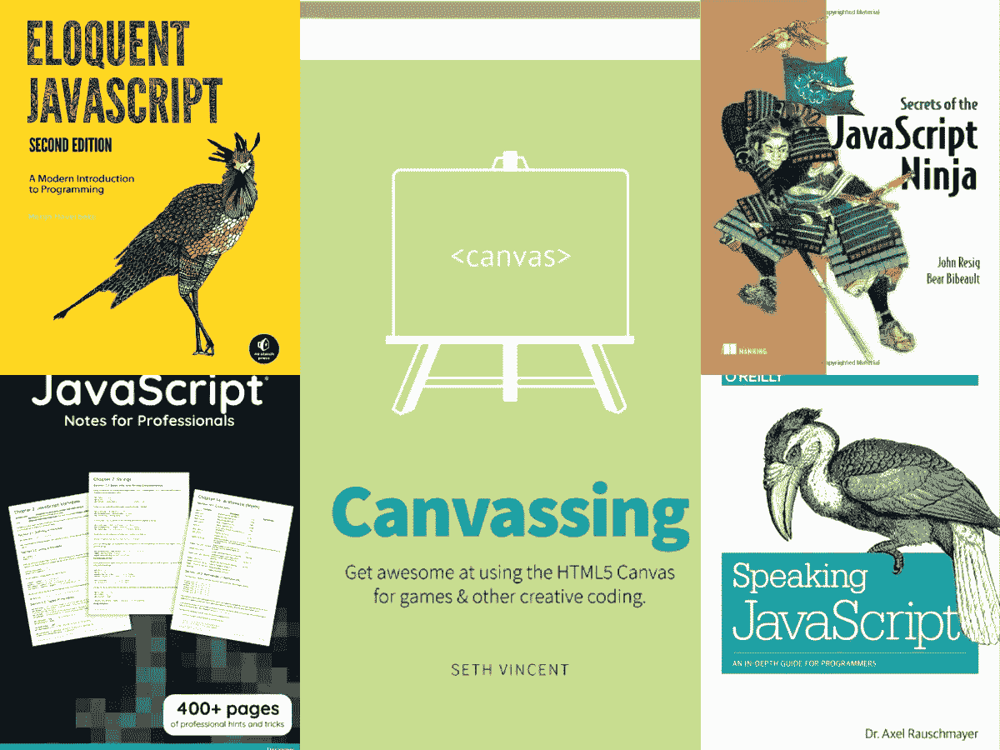
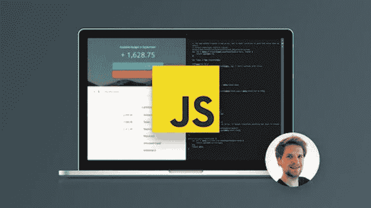
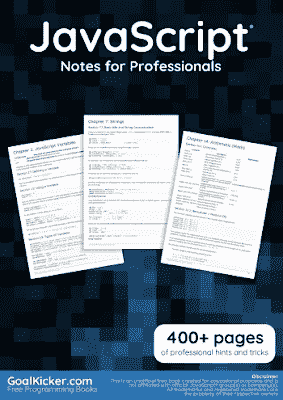
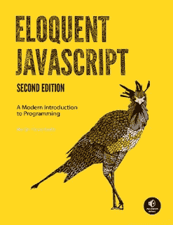
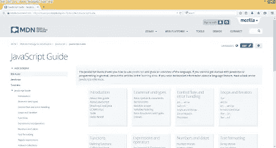
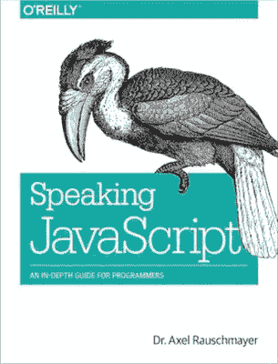
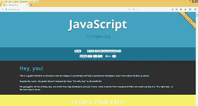

# 2023 年学习 JavaScript 的 5 本免费书籍

> 原文：<https://medium.com/javarevisited/5-free-books-to-learn-javascript-for-beginners-4cca79834262?source=collection_archive---------0----------------------->

## 这些是我最喜欢的免费 JavaScript 书籍，适合初学者学习 JavaScript 和 web 开发

互联网上有很多好东西，其中之一就是免费电子书和 PDF。程序员几乎可以通过这些免费书籍运行任何东西。之前我已经分享了一些 [**免费 JavaScript 教程**](https://javarevisited.blogspot.com/2018/06/top-10-courses-to-learn-javascript-in.html) **，第**篇在这篇文章中，我将分享 **5 本学习 JavaScript 的好的免费书籍，**哪些是开放在线阅读的或者允许你下载 pdf 供离线阅读的。

JavaScript 大概是另一种语言我推荐懂 Java 的人，为什么？因为它真的无处不在。几乎没有一个网站不是以这样或那样的格式使用 JavaScript 的。

一些人使用 JavaScript 进行客户端脚本和动画制作，而另一些人在服务器端使用 JavaScript，使用像 [Nodejs](https://www.java67.com/2019/07/top-5-free-nodejs-courses-for-web-development.html) 和 [Reactjs](https://javarevisited.blogspot.com/2018/08/top-5-react-js-and-redux-courses-to-learn-online.html) 这样的库，它与 [HTML](http://www.java67.com/2018/02/5-free-html-and-css-courses-to-learn-web-development.html) 和 [CSS](http://www.java67.com/2018/03/top-5-free-courses-to-learn-web-development.html) 形成了独特的三角形。如果你是一名 web 开发人员，了解 JavaScript 是必不可少的。Java 也无处不在，许多 Java web 应用程序使用 JavaScript 和 jQuery 进行客户端脚本编写和验证。

我强烈推荐 Java 程序员学习 [JavaScript](http://www.java67.com/2018/04/top-5-free-javascript-courses-to-learn.html) ，这只会帮助你变得更好。它将提供更多的工作机会，并帮助你成为一名全栈开发人员，这是大多数初创公司和小公司所关注的。如果你想进一步提高获得网络开发工作的机会，或者想开发现代网站，我也建议你看看流行的 JavaScript 框架，比如现在统治世界的 Angular 和 React JS T21。我们现在正在开发的大多数前端应用程序要么使用 Angular，要么使用 React。现在是学习这些 JavaScript 库的最佳时机。只要制定一个学习 Angular 和 React 的目标，你就会领先于市场上许多寻找相同工作的 JavaScript 开发人员。顺便说一句，如果你能花几块钱(比如 10 美元)，那么我强烈建议你参加完整的 JavaScript 课程:在 Udemy 上建立一个真实世界的项目课程。我在今年早些时候购买了这门课程，它被证明是最好的购买之一，有许多编码和真实世界的例子。如果你像我一样喜欢基于项目的学习，你会喜欢这门课程。

# 2023 年 5 大免费 JavaScript 书籍和 PDF 供初学者学习

谁不爱免费电子书和程序员，特别喜欢呢？以下是我收集的 *5 本不错的免费 JavaScript 书籍；其中一些可以免费在线阅读，但也有一些可以下载 PDF、EPUB 或 MOBI 版本在你的设备上离线阅读。*

## 1. [JavaScript 专业人士笔记丛书](https://goalkicker.com/JavaScriptBook/)

这是另一本非常棒的免费 JavaScript 书，可以从头开始学习 JavaScript。这本 400 多页的书充满了专业的技巧和诀窍，是由几位 JavaScript 专家贡献的 StackOverFlow 答案创建的。完全免费，你也可以下载 PDF 文件离线阅读。

您将学习如何编写代码 [JavaScript](https://www.java67.com/2020/08/top-10-pluralsight-courses-to-learn-JavaScript.html) ，变量，函数，检测鼠标和键盘事件，创建复杂的动画序列，并学习如何在画布上使用视频。这是一本值得参考的好书，因为它包含了许多不同 JavaScript 概念的快速解释和例子，我强烈推荐给任何使用免费资源学习 JavaScript 的人。

如果你需要一个免费的课程来配合这本书，那么你也可以看看[**JavaScript 简介:第一步**](https://www.educative.io/courses/introduction-to-javascript-first-steps?affiliate_id=5073518643380224) 课程一个基于文本的交互式课程，学习 Educative 上的 JavaScript，Educative 是一个由开发人员为开发人员制作的在线培训平台。

## 2.[雄辩的 JavaScript](http://eloquentjavascript.net/)

雄辩的 JavaScript 是一本关于 JavaScript 和编程的交互式书籍，作者是 Marijn Haverbeke。这本书的好处是你可以随时尝试例子；图书给了你编辑和运行它的权利。

代码示例融入文字真的很流畅。Marin Haverbek 做得非常好，他向 JavaScript 初学者解释了函数式编程和基于原型的面向对象编程，没有远离传统书籍，但仍然利用了交互式书籍的优势。

如果你愿意，只要把这本书和 Jonas Schemdtmann 的 [***完整的 JavaScript 课程结合起来:构建真实世界的项目***](http://bit.ly/2ytow1z) **，**学习 JavaScript 的最佳课程。

简而言之，这是一本关于 JavaScript 的最好的书，你可以免费阅读。《T2》的 epub 版本也可以在你的 iPad 或智能手机上离线阅读。你可以在他们的网站上在线阅读，或者你也可以得到这本书的平装本。你也可以免费下载一本 PDF 格式的雄辩 JavaScript 书。

如果你喜欢从在线课程中学习，那么这里有一些最好的免费在线 JavaScript 课程。

## 3. [JavaScript 指南](https://developer.mozilla.org/en-US/docs/Web/JavaScript/Guide)

JavaScript Guide 不是一本书，但不仅仅是一本书。这是 Mozilla 的官方教程，由社区专家提供。这个资源最好的一点是它是最新的资源之一，因为它是在线的，Mozilla 和 JavaScript 社区都让它保持最新。如果你愿意，你也可以将这个 JavaScript 指南与 Udemy 上的免费教程结合起来，例如劳伦斯·图尔顿的[**JavaScript essentials**](https://click.linksynergy.com/deeplink?id=JVFxdTr9V80&mid=39197&murl=https%3A%2F%2Fwww.udemy.com%2Fcourse%2Fjavascript-essentials%2F)**，它受到了 20 多万开发者的信任，并且完全免费加入，你需要做的只是创建一个 Udemy 帐户并注册课程。**

****

## **4.[说 JavaScript](http://speakingjs.com/es5/)**

**又一本学习 JavaScript 的好书，如题，说的是程序员深度指南。阿克塞尔博士出色地用简单的方式解释了这个复杂的概念。代码示例并不简单，有助于更好地理解这个概念。

这本书可以在网上免费阅读；PDF 下载选项不可用，但如果你想，你可以在这里得到这本书的平装本。

还有，如果你需要一个免费的 JavaScript 培训课程来结合这本书，我建议你去看看 Udemy 上的 [**学习用 JavaScript 编程:初学者到专业**](https://click.linksynergy.com/deeplink?id=JVFxdTr9V80&mid=39197&murl=https%3A%2F%2Fwww.udemy.com%2Fcourse%2Fprogramming-in-javascript%2F) 课程。同样，超过 100，000 名学生选修了完全免费的课程。**

****

## **5. [JavaScript 的正确方式](http://www.jstherightway.org/)**

**JavaScript:正确的方法不是一本书，而是一个在线指南，旨在向新开发人员介绍 JavaScript，并帮助有经验的开发人员了解更多关于 JavaScript 语言、习惯用法及其最佳实践的知识。

这个网站收集了顶级 JavaScript 开发者的文章、技巧和诀窍。按照作者的说法，因为它来自杰出的人，我们可以说它是“正确的方式”，或者最好的方式。

这本书最让我喜欢的是它广泛的资源收集。您将在一个地方找到 JavaScript 模式、测试工具、框架、库、游戏引擎、播客、截屏和新闻。

如果你需要一个免费的 JavaScript 在线课程，那么你应该看看 Udemy 上 Bharath Thippiready 的 [**JavaScript 基础 c**](https://click.linksynergy.com/deeplink?id=JVFxdTr9V80&mid=39197&murl=https%3A%2F%2Fwww.udemy.com%2Fcourse%2Fjavascriptfundamentals%2F) ourse。受到超过 58，000 名程序员和开发人员信任的免费 Javascript 课程。**

****

**这就是为程序员和 Web 开发人员提供的免费 JavaScript 书籍列表。你可以下载或者在线阅读，只要你能上网，它们都是免费的。不过，如果你是从网吧、学校或大学实验室上网，最好下载 PDF 文件进行离线阅读。**

****其他免费的 JavaScript 和 Web 开发资源****

*   **[初学者的 15 门最佳 JavaScript 课程](/javarevisited/10-best-online-courses-to-learn-javascript-in-2020-af5ed0801645)**
*   **[从零开始学习 Docker 的 10 门免费课程](https://javarevisited.blogspot.com/2018/02/10-free-docker-container-courses-for-Java-Developers.html)**
*   **[面向初学者的 12 门免费 JavaScript 课程](/javarevisited/12-free-courses-to-learn-javascript-and-es6-for-beginners-and-experienced-developers-aa35874c9a32?source=collection_home---4------0-----------------------)**
*   **[前端和后端开发者路线图](https://javarevisited.blogspot.com/2019/02/the-2019-web-developer-roadmap.html)**
*   **[面向开发者的 10 本免费 Angular 书籍和课程](/javarevisited/10-free-angular-and-react-js-courses-from-udemy-and-coursera-best-of-lot-e67f7d811e6b)**
*   **[成为全栈式 Web 开发人员的 10 门课程](/javarevisited/top-10-online-courses-to-become-a-fullstack-web-developer-in-2020-d608a6b63232)**
*   **[完整的 React 开发者指南](https://javarevisited.blogspot.com/2018/10/the-2018-react-developer-roadmap.html)**
*   **[初学者学习 TypeScript 的 7 大课程](/@javinpaul/7-best-courses-to-learn-typescript-in-depth-58439e1ce729)**
*   **[从零开始学习 Python 的 10 大课程](/better-programming/top-5-courses-to-learn-python-in-2018-best-of-lot-26644a99e7ec)**
*   **[学习网页设计与开发的最佳课程](/better-programming/my-5-favorite-courses-to-learn-web-development-in-2019-a5e74167f8b2)**
*   **[我最喜欢的网上免费 JavaScript 教程](/javarevisited/my-favorite-free-tutorials-and-courses-to-learn-javascript-8f4d0a71faf2)**
*   **[学习网页开发的 10 门课程](https://dev.to/javinpaul/top-6-courses-to-learn-web-development-best-of-lot-2fae)**
*   **[7 门免费课程学习打字稿](/javarevisited/top-10-free-typescript-courses-to-learn-online-best-of-lot-44bce9da41d1)**
*   **[我最喜欢的初学者学习棱角分明的课程](/javarevisited/10-courses-to-learn-angular-for-web-development-6da1bd2856dc)**
*   **面向程序员和开发人员的 10 门免费 React 课程**

**感谢您阅读本文。如果你喜欢这些*免费的 JavaScript 书籍*，那么请分享给你的朋友和同事。

**P.S.** —如果你更喜欢在线课程而不是书本，并且想学习 Java interactive，那么你也可以查看 Udemy 上的免费课程<http://bit.ly/2zNH9Tj>**。事实上，您可以将这些免费书籍与这些免费的 JavaScript 课程结合起来，以获得两全其美的效果。****

****<https://www.java67.com/2018/04/top-5-free-javascript-courses-to-learn.html> ****