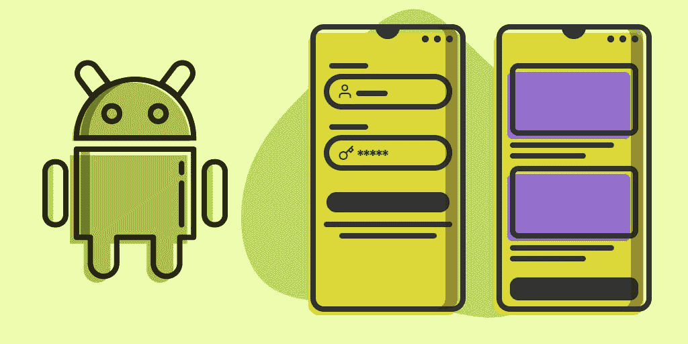
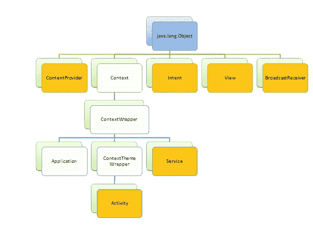
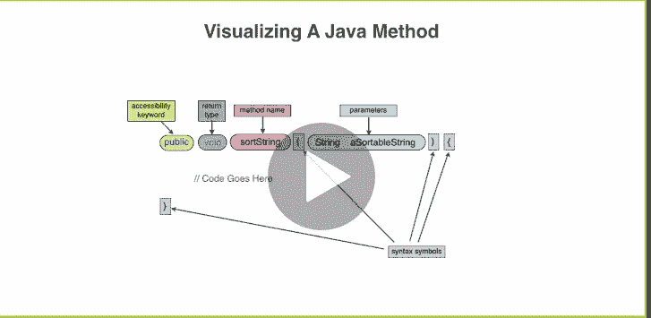
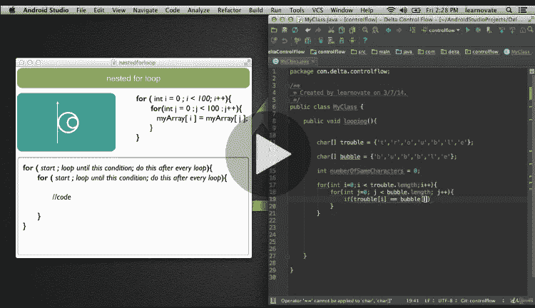

# 2023 年 5 门免费安卓 App 开发课程，供初学者学习

> 原文：<https://medium.com/javarevisited/5-free-courses-to-become-an-android-developer-d4d207f53675?source=collection_archive---------0----------------------->

## 这些是免费学习 Android 与 Java 和 Kotlin 的最佳免费课程

image_credit — [用 Java 开发现代安卓应用](https://www.educative.io/courses/modern-android-app-development?affiliate_id=5073518643380224)由[教育](https://medium.com/u/85b9909ed1cf?source=post_page-----d4d207f53675--------------------------------)

你好伙计们，如果你对创建手机游戏和应用程序充满热情，想学习如何开发 Android 应用程序，或者想成为一名 **Android 应用程序开发者**，那么你来对地方了。

早些时候，我已经分享了 [**最佳 Android 在线课程**](/javarevisited/top-5-courses-to-learn-android-for-java-programmers-667e03d995b4) ，在这篇文章中，我将为 [Java 程序员](/javarevisited/what-java-programmers-should-learn-in-2020-648050533c83)和其他人分享一些最佳和免费的 Android 开发课程。你可能知道早期的 Java 是唯一用于创建 Android 应用程序的语言。

但是，自从谷歌宣布 Kotlin 作为 Android 应用程序开发的官方语言，这意味着你可以使用 Kotlin 或 Java 来创建 Android 应用程序。

如果你对学习[安卓](/hackernoon/top-5-courses-to-learn-android-for-java-programmers-667e03d995b4)没有把握，那么让我告诉你，这可能是世界上给你最大影响力的单一技术。

> 有数十亿台移动设备，包括手机、平板电脑和电脑，都在运行 Android 操作系统。

通过学习 Android 和创建应用程序，你不仅可以影响很多人的生活，还可以为自己创造事业和生活。它不仅能让你在著名的财富 500 强公司找到一份工作，还能让你成为一名自由职业者，并通过创建自己的应用成为一名企业家。

我之前说过，如果你想成为本世纪的程序员，你最好既懂[移动](https://javarevisited.blogspot.com/2020/01/10-things-mobile-app-developers-can-learn.html)又懂 [web 开发](http://www.java67.com/2018/03/top-5-free-courses-to-learn-web-development.html)。这是永远都需要的两种技能，你永远不会缺少工作和机会。

过去我曾分享过[免费课程](https://javarevisited.blogspot.com/2018/08/top-5-free-java-8-and-9-courses-for-programmers.html)和[书籍](https://javarevisited.blogspot.com/2018/06/10-all-time-great-books-for-java.html#axzz5J4gh8Uh1)学习 Java 和 Kotlin，今天我们就来看看来自 [Udemy](https://medium.com/u/b32aa0132f1b?source=post_page-----d4d207f53675--------------------------------) 和 Pluralsight 的一些*免费 Android 开发课程*，可以用来学习 Android 应用开发。

顺便说一句，如果你不介意在学习像 Android 应用程序开发这样的有用技能的同时投资一些钱，那么我也强烈推荐 [**完整的 Android Oreo 开发者课程——构建 23 个应用程序！**](https://click.linksynergy.com/deeplink?id=JVFxdTr9V80&mid=39197&murl=https%3A%2F%2Fwww.udemy.com%2Fcourse%2Fthe-complete-android-oreo-developer-course%2F) 课程讲解 Udemy。

<https://click.linksynergy.com/deeplink?id=JVFxdTr9V80&mid=39197&murl=https%3A%2F%2Fwww.udemy.com%2Fcourse%2Fthe-complete-android-oreo-developer-course%2F>  

这不是免费的****而是完全值得你花费时间和金钱的**并且你将通过构建包括超级马里奥 Run、Whatsapp 和 Instagram 在内的真正应用来学习使用 Java & Kotlin 开发 Android 奥利奥应用！**

# **2023 年学习 Android 的 5 门免费课程**

**事不宜迟，下面是我为[程序员](/javarevisited/top-10-courses-to-learn-devops-for-experienced-programmers-d93b666db151)和[开发者](/javarevisited/top-10-frameworks-full-stack-java-developers-can-learn-in-2020-5995021401e5)提供的免费 Android 课程列表。Btw，我先说清楚，即使这些课程是免费的，也不代表质量差。

它们只是由他们的导师出于宣传和教育目的免费提供的。你在参加课程时也应该小心，因为有时教师会将他们的免费课程转变为付费课程，尤其是在 [Udemy](https://javarevisited.blogspot.com/2019/10/udemy-vs-pluralsight-review-which-is-better-to-learn-code.html) 中，一旦他们达到了他们的推广目标。

**无论如何，让我们来盘点一下 2023 年学习 Android 应用开发最好的免费课程吧。****

## **1.[学习 Android 应用开发](https://click.linksynergy.com/fs-bin/click?id=JVFxdTr9V80&subid=0&offerid=634352.1&type=10&tmpid=14538&RD_PARM1=https%3A%2F%2Fwww.udemy.com%2Flearn-android-application-development-y%2F)**

**这是学习 Android 应用开发最全面的课程之一，有 27+小时的内容。这门课程不仅教你 Android，还教你 Java 编程。如果你正考虑用 Java 开始 Android 开发，那么这是你的完美课程。

在本课程中，首先你会对 [Java](https://javarevisited.blogspot.com/2018/05/top-5-java-courses-for-beginners-to-learn-online.html) 有一个很好的概述，然后通过下载安装 Android Studio 来设置 Android 开发环境。**

**之后，您将学习创建一个 Android 应用程序，调试一个 Android 应用程序，以及如何创建一个签名的 APK 文件提交给谷歌 Play 商店上市。**

**您还将学习 Android 的基本概念，如显式和隐式意图，如何使用片段，自定义列表视图，Android 操作栏，如何使用异步任务，如何使用共享首选项，文件和 SQLite 等。**

****这里是免费加入本课程的链接**——[学习 Android 应用开发](https://click.linksynergy.com/fs-bin/click?id=JVFxdTr9V80&subid=0&offerid=634352.1&type=10&tmpid=14538&RD_PARM1=https%3A%2F%2Fwww.udemy.com%2Flearn-android-application-development-y%2F)**

****

**这门课程受到超过 218，000 名学生的信任，拥有超过 26 小时的内容，不亚于 Udemy 上的任何付费 Android 课程。简而言之，学习使用 Java 编程语言进行 Android 应用开发的完美课程。**

## **2.[从零开始成为安卓开发者](https://click.linksynergy.com/fs-bin/click?id=JVFxdTr9V80&subid=0&offerid=634352.1&type=10&tmpid=14538&RD_PARM1=https%3A%2F%2Fwww.udemy.com%2Fbecome-an-android-developer-from-scratch%2F)**

**这是在线学习 Android 最好的课程之一；它既全面又有趣。这也是 Udemy 上*最受欢迎的 Android 课程之一，已经有超过 341，499 名学生注册了这门课程。*

这也不仅仅是一个短短 30 分钟的课程，而是包含超过 11.5 小时的高质量材料来教你 Android。

课程也很动手；您将学习使用 [Android Studio](https://dzone.com/articles/top-5-intellij-idea-and-android-studio-courses-for) 建立自己的开发环境，并在仿真器和设备上创建、运行和调试应用程序。**

**如果你想在 2023 年成为一名专业的 Android 开发者，这是你应该上的课程。这门课程唯一的缺点是最近没有更新，但它仍然有助于学习 Android，Android 的基本面在过去几年中没有太大变化。**

****这里是免费加入本课程的链接**——[从零开始成为 Android 开发者](https://click.linksynergy.com/fs-bin/click?id=JVFxdTr9V80&subid=0&offerid=634352.1&type=10&tmpid=14538&RD_PARM1=https%3A%2F%2Fwww.udemy.com%2Fbecome-an-android-developer-from-scratch%2F)**

****

## **3.[完整的 Android Oreo(8.1)、N、M 和 Java 开发](https://click.linksynergy.com/fs-bin/click?id=JVFxdTr9V80&subid=0&offerid=634352.1&type=10&tmpid=14538&RD_PARM1=https%3A%2F%2Fwww.udemy.com%2Fthe-complete-android8-oreo-nougat-m-java-development%2F)**

**这是在 2023 年学习 Android 的一个相当新的课程。它涵盖了 Android 8 奥利奥和 Android 7 牛轧糖。它还包括 Android 6 棉花糖，这取决于你是否想学习它。

课程由 Kavita Mandal 授课，包含超过 **8.5 小时的培训资料**，涵盖了所有的基础和一些高级的 Android 概念。

课程也是动手操作，你将学习如何在 [Android Studio](https://itnext.io/top-5-intellijidea-and-android-studio-courses-for-java-and-android-programmers-afcc27309b60) 中开发 Android 应用，这是最流行的创建 Android 应用的 IDE。您将学习创建项目、导航、运行和调试，并探索一些用于主动开发的快捷方式。

课程结束时，您还将在 Android 中构建一个“问答 App”。总体来说，2023 年免费开始 Android 8 开发的一门优秀课程。**

****这里是免费加入本课程的链接**——[完整的 Android Oreo(8.1)、N、M 和 Java 开发](https://click.linksynergy.com/fs-bin/click?id=JVFxdTr9V80&subid=0&offerid=634352.1&type=10&tmpid=14538&RD_PARM1=https%3A%2F%2Fwww.udemy.com%2Fthe-complete-android8-oreo-nougat-m-java-development%2F)**

****

## **4.[安卓基础:应用开发终极教程](https://click.linksynergy.com/fs-bin/click?id=JVFxdTr9V80&subid=0&offerid=634352.1&type=10&tmpid=14538&RD_PARM1=https%3A%2F%2Fwww.udemy.com%2Fultimate-android-lollipop-app-development-course%2F)**

**这是另一个在 Udemy 上学习 Android 的很棒的免费课程，这个课程最好的部分是它的结构很好，涵盖了 Android 的基本概念。

由[Eduonix Learning Solution](https://medium.com/u/82e67ed633e0?source=post_page-----d4d207f53675--------------------------------)创建这是从底层 Android 架构和生态系统开始，接着是简单的 API，然后转移到复杂和最新的 API，如传感器、材料设计和数据存储。

这也是最新的，涵盖了 Android 开发的实际方面，比如让你的应用更专业的技巧，如何将你的应用货币化，以及为 Android 工作面试做准备。**

**简而言之，一门免费学习专业 Android 开发的完美课程，无论你打算找一份 Android 开发人员的工作，还是创建自己的 app 成为一名创业者，这门课程对两者来说都是极好的。**

****这里是免费加入本课程的链接**——[安卓基础:应用开发终极教程](https://click.linksynergy.com/fs-bin/click?id=JVFxdTr9V80&subid=0&offerid=634352.1&type=10&tmpid=14538&RD_PARM1=https%3A%2F%2Fwww.udemy.com%2Fultimate-android-lollipop-app-development-course%2F)**

****

## **5.[开始为 Android 开发](https://pluralsight.pxf.io/c/1193463/424552/7490?u=https%3A%2F%2Fwww.pluralsight.com%2Fcourses%2Fandroid-start-developing)**

**这是你应该在 Android 上参加的第一批课程之一。它是基础的，涵盖了 Android 应用程序开发平台的一些重要基础。

在本课程中，您将首先学习 Android 应用程序的结构，然后下载 [Android Studio](https://javarevisited.blogspot.com/2018/09/top-5-courses-to-learn-intellij-idea-java-and-android-development.html) 来创建 Hello World 应用程序。之后，您将扩展 Hello World 应用程序来学习核心概念，如 drawables、styles、menu 和 testing。

课程结束时，列出了您扩展 Android 知识的后续步骤。**

****这里是加入本课程的链接**——[开始为 Android 开发](https://pluralsight.pxf.io/c/1193463/424552/7490?u=https%3A%2F%2Fwww.pluralsight.com%2Fcourses%2Fandroid-start-developing)**

****

**顺便说一句，这个课程**不是完全免费的**，因为你需要一个 Pluaralsight 会员资格才能进入这个课程。拥有 Pluralsight 会员资格很好，因为您可以访问 5000 多门课程来学习最新技术。

但是，如果你不能加入，你也可以参加 [**10 天的免费试用**](http://pluralsight.pxf.io/c/1193463/424552/7490?u=https%3A%2F%2Fwww.pluralsight.com%2Flearn) 没有任何承诺免费进入这个课程，因为试用会给你 200 分钟的手表，这是足够完成这个课程。**

**<http://pluralsight.pxf.io/c/1193463/424552/7490?u=https%3A%2F%2Fwww.pluralsight.com%2Flearn>  

以上是关于学习 Android 应用程序开发的一些**最佳免费课程**以及创建可以在谷歌 Play store 上销售并赚钱的酷 Android 游戏和应用程序。Android 也为几个移动应用开发者的工作打开了大门；如果你愿意为其他公司工作，你总能以你的 Android 技能找到合适的职位。

其他**编程课程**和**文章**你可能喜欢
[2023 年学习 React Native 框架的 5 门课程](https://javarevisited.blogspot.com/2018/02/5-react-native-courses-to-learn-mobile-development-using-JavaScript.html#axzz5ay3YXrVT)
[2023 年程序员可以学习的 10 项技术](http://www.java67.com/2018/01/top-10-web-mobile-and-big-data-framework-libraries-technologies-programmers-should-learn-in-2018.html)
[2023 年学习 Python 的前 5 门课程](http://javarevisited.blogspot.sg/2018/03/top-5-courses-to-learn-python-in-2018.html)
[2023 年学习微服务开发的 5 条路径](https://javarevisited.blogspot.sg/2018/02/top-5-spring-microservices-courses-with-spring-boot-and-spring-cloud.html)
[2023 年学习 Java 编程的 5 门课程](http://www.java67.com/2018/02/5-online-courses-to-learn-java-9-better.html) [2023 年 5 门免费课程学习 Angular](http://www.java67.com/2018/01/top-5-free-angular-js-online-courses-for-web-developers.html)
[2023 年 5 门免费课程学习区块链](http://www.java67.com/2018/02/5-free-blockchain-technology-courses.html)
[5 门免费课程学习大数据、Hadoop 和 Spark](http://www.java67.com/2018/05/top-5-free-big-data-courses-to-learn-Hadoop-Apache-Spark.html)
[10 门免费 Docker 课程面向开发者](https://hackernoon.com/10-free-courses-to-learn-docker-for-programmers-and-devops-engineers-7ff2781fd6e0)
[5 门免费课程面向程序员学习 iOS App 开发](https://javarevisited.blogspot.com/2018/11/5-free-ios-app-development-courses-for.html)

感谢阅读本文至今。 如果你喜欢这些免费的 Android 课程，那么请分享给你的朋友和同事。如果您有任何问题或反馈，请留言。

**P.S.** —如果你想从头到尾只找一门课程学习 Android，那么我建议你加入 Udemy 上的 [**完整的 Android N 开发者课程**](https://click.linksynergy.com/fs-bin/click?id=JVFxdTr9V80&subid=0&offerid=634352.1&type=10&tmpid=14538&RD_PARM1=https%3A%2F%2Fwww.udemy.com%2Fcomplete-android-n-developer-course%2F) 。你只需花 10 美元就可以在 Udemy 的几次快闪拍卖上获得这门课程，这种活动每个月都会举行。

<https://click.linksynergy.com/fs-bin/click?id=JVFxdTr9V80&subid=0&offerid=634352.1&type=10&tmpid=14538&RD_PARM1=https%3A%2F%2Fwww.udemy.com%2Fcomplete-android-n-developer-course%2F> **