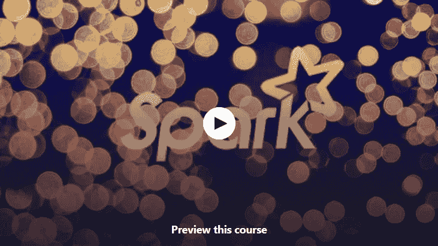
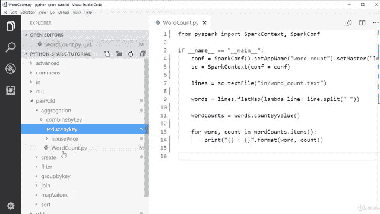

# 2023 年学习 Apache Spark 的 5 门最佳免费课程

> 原文：<https://medium.com/javarevisited/5-free-courses-to-learn-apache-spark-in-2020-bdff2d60c800?source=collection_archive---------1----------------------->

image_credit —数据块([https://databricks.com/spark/about](https://databricks.com/spark/about))

大家好，如果你想在 2023 年学习 Apache Spark，开始你的大数据之旅，并寻找一些非常棒的免费资源，如书籍、教程和课程，那么你来对地方了。

早些时候，我已经分享了 [**最好的 Apache Spark 课程**](/javarevisited/5-best-apache-spark-courses-for-java-and-python-developers-bbd9d63eb76c) ，在这篇文章中，我将为 [Java](/javarevisited/top-5-java-online-courses-for-beginners-best-of-lot-1e1e240a758) 、Scala 和 [Python](/javarevisited/10-free-python-tutorials-and-courses-from-google-microsoft-and-coursera-for-beginners-96b9ad20b4e6) 开发人员分享一些最好的**、免费在线 Apache Spark 课程**。如果不知道什么是阿帕奇 Spark？以及为什么它在[大数据](/swlh/5-free-online-courses-to-learn-big-data-hadoop-and-spark-in-2019-a553e6ccfe30)世界中如此重要，那么让我先给你一个简单的概述。

Apache Spark 是另一个集群计算框架，类似于 [Hadoop](http://javarevisited.blogspot.sg/2018/04/top-5-hadoop-courses-to-learn-online.html) ，用于分析巨大的数据集，但它比 Hadoop 快得多，这使得它非常适合今天的高计算需求，如处理大量数据。

处理大量数据的挑战之一是速度，因为用真实世界的数据训练机器学习算法可能需要数小时甚至数天。

Apache spark 通过为机器学习和 SQL 加载提供快速数据访问解决了这个问题。与 Hadoop 相比，它在进行内存计算时提供了快 100 倍的速度,如果在磁盘外进行 MapReduce 运算，则速度快 10 倍。

顺便说一句，这是 Apache Spark 的 10，000 视图，为了在您的项目中使用它或作为大数据顾问使用它，您需要了解更多信息，这些免费课程将在这方面为您提供帮助。

这些**免费的 Apache 课程**不仅会教你一些基本概念比如如果你有 Hadoop 为什么需要 [Apache Spark](http://javarevisited.blogspot.sg/2017/12/top-5-courses-to-learn-big-data-and.html) ？或者解释 Apache Spark 如何获得光速以及关键的 Apache Spark 抽象，如弹性分布式数据集或 RDD。

顺便说一句，如果你不介意花几块钱学习大数据、Spark 和 Hadoop 等有价值的技能，那么我也强烈建议你看看[**Apache Spark with Scala——亲身体验大数据！**](https://click.linksynergy.com/deeplink?id=JVFxdTr9V80&mid=39197&murl=https%3A%2F%2Fwww.udemy.com%2Fcourse%2Fapache-spark-with-scala-hands-on-with-big-data%2F) 课程由弗兰克·凯恩在 Udemy 上完成。

<https://click.linksynergy.com/deeplink?id=JVFxdTr9V80&mid=39197&murl=https%3A%2F%2Fwww.udemy.com%2Fcourse%2Fapache-spark-with-scala-hands-on-with-big-data%2F>  

这可能是 Spark 上最好的课程，有 20 多个使用 Apache Spark 在您的桌面或 Hadoop 上分析大型数据集的实践示例！它也不是很贵，你可以在不时发生的疯狂的 Udemy 大甩卖上花 9.9 美元买到它。

# 2023 年程序员学习的 5 大免费 Apache Spark 课程

由于大数据和 Apache Spark 是语言不可知论者，我为 [Java](http://javarevisited.blogspot.sg/2017/11/top-5-free-java-courses-for-beginners.html) 、 [Scala](http://javarevisited.blogspot.sg/2018/01/10-reasons-to-learn-scala-programming.html#axzz550Ppgfxg) 和 [Python](http://javarevisited.blogspot.sg/2018/03/top-5-courses-to-learn-python-in-2018.html) 开发人员提供了课程。他们现在都是免费的，但不能保证他们会免费多久，因为有时讲师会将他们的免费 Udemy 课程转变为付费课程，特别是在他们实现推广目标之后。

就算没时间学也不如现在就加入他们。一旦你加入他们，他们将终身免费，你可以按照自己的时间表学习。

## [1。火花启动器套件](https://click.linksynergy.com/fs-bin/click?id=JVFxdTr9V80&subid=0&offerid=323058.1&type=10&tmpid=14538&RD_PARM1=https%3A%2F%2Fwww.udemy.com%2Fsparkstarterkit%2F)

这是从 Apache Spark 开始的最佳课程之一，因为它解决了您想要学习的基础问题。因为作者声称这个课程比 Apache spark 上的几个付费课程要好，他说得有些对。注册了这门课程的 15000 名学生也证明了这一点。

该课程试图弥合 Apache Spark 文档和其他课程中可用的信息与开发人员真正寻找的信息之间的差距。

它试图回答 StackOverflow 和其他论坛上许多常见的 Apache Spark 问题，如如果你有 Hadoop，为什么需要 Apache Spark，**Apache Spark 和 Hadoop 的区别是什么？**Apache Spark 如何实现其更快的计算速度？什么是 RDD 抽象等等？

**这里是免费加入本课程的链接—**[**Spark Starter Kit**](https://click.linksynergy.com/fs-bin/click?id=JVFxdTr9V80&subid=0&offerid=323058.1&type=10&tmpid=14538&RD_PARM1=https%3A%2F%2Fwww.udemy.com%2Fsparkstarterkit%2F)

简而言之，这是一个学习 Apache Spark 的很好的课程，因为你将很好地理解 Spark 执行引擎背后的一些关键概念及其效率的秘密。

## [2。Scala 和 Spark 2 —入门](https://click.linksynergy.com/fs-bin/click?id=JVFxdTr9V80&subid=0&offerid=323058.1&type=10&tmpid=14538&RD_PARM1=https%3A%2F%2Fwww.udemy.com%2Fscala-and-spark-2-getting-started%2F)

如果你是一名 Scala 开发人员，并且对 Apache Spark 感兴趣，那么这是适合你的课程。在本课程中，你将学习如何使用 [Scala](http://javarevisited.blogspot.sg/2017/04/5-books-to-learn-scala-and-functional-programming.html) 开发应用，以及如何使用 IntelliJ IDEA 开发 Spark。

课程将教你如何通过安装 Java 和 JDK、 [IntelliJ IDEA、](https://itnext.io/top-5-intellijidea-and-android-studio-courses-for-java-and-android-programmers-afcc27309b60)和**集成 Apache Spark 与 IDEA** 来建立你的本地开发环境。

你需要的只是一台 4GB 内存和 64 位操作系统的电脑，以及一些 Scala 经验。

**这里是免费加入本课程的链接—** [Scala 和 Spark 2 —入门](https://click.linksynergy.com/fs-bin/click?id=JVFxdTr9V80&subid=0&offerid=323058.1&type=10&tmpid=14538&RD_PARM1=https%3A%2F%2Fwww.udemy.com%2Fscala-and-spark-2-getting-started%2F)

## 3. [Hadoop 平台和应用框架](https://coursera.pxf.io/c/3294490/1164545/14726?u=https%3A%2F%2Fwww.coursera.org%2Flearn%2Fhadoop)

如果你是一名 Python 开发人员，但想学习 Apache Spark for Big Data，那么这是最适合你的课程。这是对关键 Hadoop 组件的完整实践介绍，如 [Spark](/javarevisited/5-best-apache-spark-courses-for-java-and-python-developers-bbd9d63eb76c) 、Map Reduce、Hive、Pig、HBase、HDFS、YARN、Squoop 和 Flume
在这个面向 Python 开发人员的**免费 Spark 课程**中，您将通过以下 12 个以上使用 PySpark 和 Spark 库分析大数据的实践示例来学习 Apache Spark 和 [Python](http://www.java67.com/2018/02/5-free-python-online-courses-for-beginners.html) 。

这也是 Coursera 中 Apache Spark 上最受欢迎的课程之一，已经有近 **22K 名学生**注册，超过 **2000 年 4.9 的评分**。

您将从 Apache Spark 架构的概述开始，然后了解 Apache Spark 的主要抽象，即 RDD 或**弹性分布式数据集**，即大量只读数据。

**这里是免费加入本课程的链接—** [Hadoop 平台和应用框架](https://coursera.pxf.io/c/3294490/1164545/14726?u=https%3A%2F%2Fwww.coursera.org%2Flearn%2Fhadoop)

本课程最精彩的部分是大数据的**真实世界示例**，例如汇总来自不同来源的 NASA Apache 网络日志，通过查看加利福尼亚州的房地产数据探索价格趋势，以及使用 StackOverflow 调查数据找出不同国家开发人员的平均工资。

最后，您还将学习使用 Python API — PySpark 编写 Spark 应用程序。

## [4。Python 和 Spark —设置开发环境](https://click.linksynergy.com/fs-bin/click?id=JVFxdTr9V80&subid=0&offerid=323058.1&type=10&tmpid=14538&RD_PARM1=https%3A%2F%2Fwww.udemy.com%2Fpython-and-spark-setup-development-environment%2F)

正如我之前告诉您的，学习大数据的主要挑战之一是建立您自己的本地开发环境，这正是本课程将帮助您的地方。

本课程将向您介绍如何在配有 **4 GB RAM** 的 Windows 10 笔记本电脑中设置您的 Apache Spark 开发环境。完成本课程后，您可以参加其他 Python 和 Apache Spark 课程，以便更好地学习。

**这里是免费加入本课程的链接——**[Python 和 Spark——设置开发环境](https://click.linksynergy.com/fs-bin/click?id=JVFxdTr9V80&subid=0&offerid=323058.1&type=10&tmpid=14538&RD_PARM1=https%3A%2F%2Fwww.udemy.com%2Fpython-and-spark-setup-development-environment%2F)

## [5。阿帕奇火花基础](https://pluralsight.pxf.io/c/1193463/424552/7490?u=https%3A%2F%2Fwww.pluralsight.com%2Fcourses%2Fapache-spark-fundamentals)

如果你想从头开始 Apache Spark，那么这个 Pluralsight 课程真的很不错。它解释了为什么我们不能使用 Hadoop 来分析当今的大数据，以及 Apache Spark 的速度如何帮助现代大数据处理。

在本课程中，您将从 group up 开始学习 Spark，从创建维基百科分析应用程序之前的历史开始，以便更好地学习 Apache Spark 核心 API。

一旦你理解了 Apache Spark 核心库，它也会教你 **Spark 库，比如流和 SQL API**。

最后，你还会了解到在处理 Apache Spark 时应该避免的事情。总的来说，从 Apache Spark 开始是一个很好的课程。

**以下是参加本课程的链接—** [Apache Spark 基础知识](https://pluralsight.pxf.io/c/1193463/424552/7490?u=https%3A%2F%2Fwww.pluralsight.com%2Fcourses%2Fapache-spark-fundamentals)

顺便说一句，这个课程不是完全免费的。你需要一个 Pluralsight 会员才能进入这个课程，这个课程每月花费大约 29 美元，但是你可以进入超过 5000 个不同技术的</javarevisited/7000-free-pluralsight-courses-to-build-in-demand-tech-skills-without-leaving-your-house-40edb50a8cf2>**课程。如果您没有 Pluralsight 会员资格，那么您也可以通过注册 10 天的免费试用来免费学习本课程。**

**<http://pluralsight.pxf.io/c/1193463/424552/7490?u=https%3A%2F%2Fwww.pluralsight.com%2Flearn>  

以上就是 2023 年学习 Java、Scala 和 Python 中 Apache Spark 的一些**最佳免费课程。在分析大数据时做出正确的决策非常重要，我的意思是，为工作选择正确的工具。现代数据如此庞大，甚至 Hadoop 的批处理模型都无法应对。这时候你需要 Apache Spark 的光速来分析现代大数据集。

其他**免费在线课程**面向好奇开发者
[面向大数据专业人士的 5 大 Apache Kafka 课程](http://javarevisited.blogspot.sg/2018/04/top-5-apache-kafka-course-to-learn.html)
[5 大免费课程学习核心 Spring、Spring Boot、Spring MVC](http://www.java67.com/2017/11/top-5-free-core-spring-mvc-courses-learn-online.html)
[5 大免费课程学习 Servlet、JSP、 和 JDBC](http://www.java67.com/2018/02/5-free-servlet-jsp-and-jdbc-online-courses-for-java-developers.html)
[12 面向 Web 开发者的免费 JavaScript 课程](/javarevisited/12-free-courses-to-learn-javascript-and-es6-for-beginners-and-experienced-developers-aa35874c9a32)
[5 面向 Java 和 DevOps 工程师的免费 Docker 课程](/javarevisited/top-5-free-courses-to-learn-docker-for-beginners-best-of-lot-b2b1ad2b98ad)
[3 面向 Java 学习 RESTful Web Services 的书籍和课程](http://www.java67.com/2018/02/3-books-and-courses-to-learn-restful-web-services-with-spring.html)
[5 面向 Java 开发者学习 Maven 和 Jenkins 的课程](http://www.java67.com/2018/02/6-free-maven-and-jenkins-online-courses-for-java-developers.html)
[5 面向 Java 学习区块链技术的课程](http://www.java67.com/2018/02/5-free-blockchain-technology-courses.html)
[7 面向 Java 和 C#的免费 Selenium Webdriver 课程](http://www.java67.com/2018/02/7-free-selenium-web-deriver-courses-for-java-C-developer.html)**

感谢您阅读本文。如果你喜欢这些最好的免费 Apache Spark 课程，请与你的朋友和同事分享。如果您有任何问题或反馈，请留言。** 

> ****P. S. —** 如果你不介意花几块钱学习像大数据、Spark 和 Hadoop 这样有价值的技能，那么我也强烈推荐你去看看[**Apache Spark with Scala——亲身体验大数据！**](https://click.linksynergy.com/deeplink?id=JVFxdTr9V80&mid=39197&murl=https%3A%2F%2Fwww.udemy.com%2Fcourse%2Fapache-spark-with-scala-hands-on-with-big-data%2F) 课程由弗兰克·凯恩在 Udemy 上。**

**<https://click.linksynergy.com/deeplink?id=JVFxdTr9V80&mid=39197&murl=https%3A%2F%2Fwww.udemy.com%2Fcourse%2Fapache-spark-with-scala-hands-on-with-big-data%2F> **