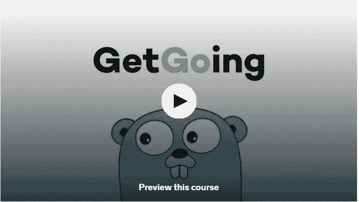
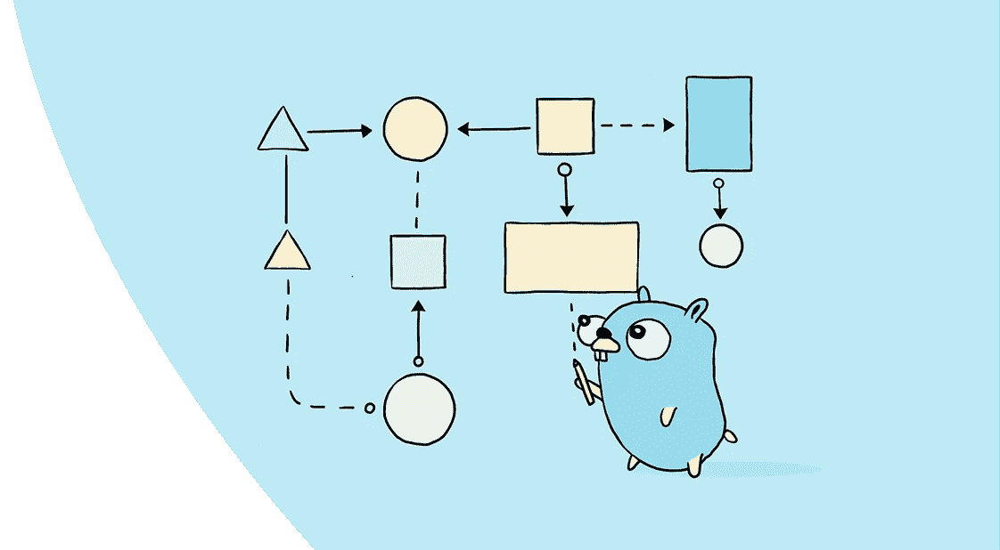
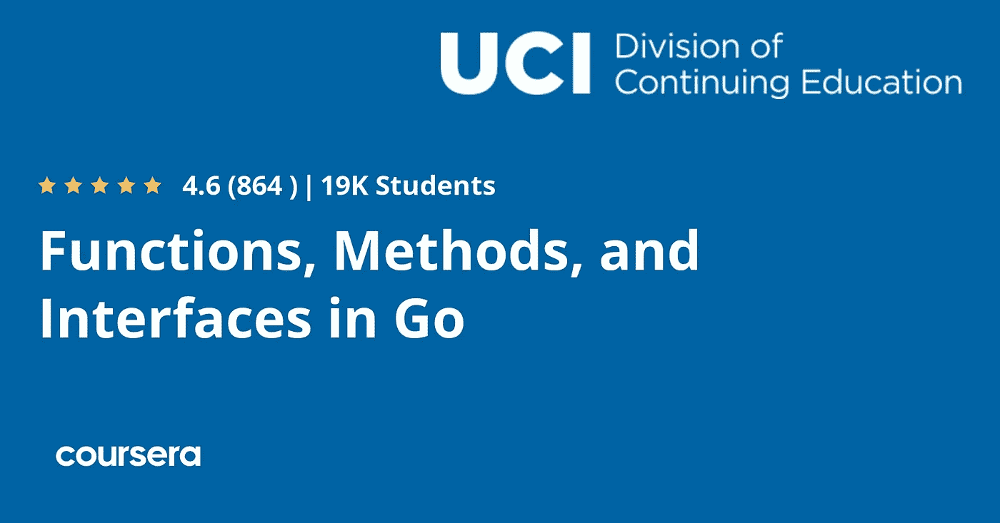

# 2023 年 5 门免费 Golang 在线课程，供初学者学习围棋编程

> 原文：<https://medium.com/javarevisited/5-free-golang-courses-for-beginners-to-learn-online-22ff73d31721?source=collection_archive---------1----------------------->

## 想学围棋编程语言？这里有最好的免费在线课程，你可以免费加入学习 Golang。

大家好，如果你想学习 Go 编程语言或 Golang 编程语言，这是新兴技术公司如 Byte Dance(抖音背后的公司)的宠儿语言之一，也是来自谷歌的语言，并寻找书籍、教程和在线课程等最佳资源，那么你来对地方了。

早些时候，我已经分享了 Udemy 、Pluralsight 和 Coursera 的 [**最佳 Golang 课程**，但是你们中的许多人要求免费的在线课程来学习 Golang，这样你们就可以开始学习这种受欢迎的编程语言，没有任何成本障碍。我听说了，我在网上找了我能找到的最好的免费在线课程和教程来学习 Golang，这篇文章就是这样的结果。](/javarevisited/7-online-courses-to-learn-golang-or-go-programming-languages-in-2020-f599a25cf14a)

这篇文章包含了从 freeCodecamp、YouTube、[、Udemy](/javarevisited/pluralsight-or-udemy-d9a94d2e8ee) 和 [Coursera](/javarevisited/10-best-coursera-certifications-and-courses-for-beginners-b13e930f2830) 等网站学习 Golang 的最佳免费在线课程。如果你不知道，是的，Udemy 和 Coursera 也有免费的在线教程和课程，你可以加入它们来学习有用的技能，如 [Golang](/@javinpaul/what-is-go-or-golang-programming-language-why-learn-go-in-2020-1cbf0afc71db) 。

回到 Golang 和 Go 编程语言的强大之处，如果我向你声称，在大量的评估中，有一种编程语言击败了 [Python](/javarevisited/8-advanced-python-programming-courses-for-intermediate-programmer-cc3bd47a4d19) 会怎么样？一种胜过 Java 的语言，Java 通常被认为比 Python 快得多。如果这就是你想要的，它甚至可以让软件运行得更快。

Golang 是所有这些问题的答案。

谷歌创造了这种理性构建的编程语言。虽然它在数据消耗和存储方面与 [C](https://javarevisited.blogspot.com/2019/11/top-5-courses-to-learn-c-programming-in.html) 不相上下，但在语法类型方面有所不同。它还结合了现代编程语言的最佳实践，这使它成为后端和服务器端开发的理想选择

顺便说一句，如果你正在寻找一个全面和最新的在线课程，并且不介意花几块钱学习像 Golang 这样有价值的技能，那么我强烈推荐你也在 Udemy 上查看[**Go:完整的开发者指南(Golang)**](https://click.linksynergy.com/deeplink?id=JVFxdTr9V80&mid=39197&murl=https%3A%2F%2Fwww.udemy.com%2Fcourse%2Fgo-the-complete-developers-guide%2F) 课程。这是深入学习 Golang 的最佳资源之一。

而且，如果你需要替代，那么 [***Go 编程(Golang):ZTM 学院上的完整开发者指南***](https://academy.zerotomastery.io/a/aff_lybwf816/external?affcode=441520_zytgk2dn) 课程是另一个杰作，如果你想在 2023 年学习 Golang，我强烈推荐这两个课程。

 [## 学习 Golang。成为一名围棋开发者。获得聘用|零到精通

### 这门 Golang 课程涵盖了 2023 年所有新的围棋最佳实践和趋势，重点是效率。这意味着你会…

academy.zerotomastery.io](https://academy.zerotomastery.io/a/aff_lybwf816/external?affcode=441520_zytgk2dn) 

# 2023 年为初学者提供 5 门免费的 Golang 在线课程

没有任何进一步的拖延，在这里，我会告诉你学习围棋的顶级课程。这些是来自热门在线网站和平台的最好的免费在线课程，如 *Udemy* 、 *Coursera* 和 *freeCodeCamp* 。2023 年，你可以参加一个或多个课程，从头开始学习 Golang

## 1.Golang 简介【免费】

Udemy 上有一本面向初学这门语言的 Go 程序员的手册，平均评分为 4.7 分&已经有超过 2 万名学生注册了这门课程。这个培训项目是由谷歌开发人员安格德·夏尔马和 DSC VIT 公司创建的。

这门对初学者友好的课程将让你简要了解这种编程语言是如何工作的。最初，它会以视频讲座的形式提供合适的链接和参考资料，让您了解如何在您的设备上设置 Go，这样您就可以在这个过程中获得逐步的虚拟帮助。

然后主要的参观将开始，导师将解释 Go 文件结构、控制语句、并行性、Goroutines、通道等。通过合适的视频讲座，与阅读枯燥的理论 pdf 相比，可以掌握更多的知识。

**链接到课程-**[**get going:Golang**简介 ](https://click.linksynergy.com/deeplink?id=CuIbQrBnhiw&mid=39197&murl=https%3A%2F%2Fwww.udemy.com%2Fcourse%2Fgetgoing%2F)

## 这个免费 Golang 课程的主要亮点

所有讲座的总时间大致为 3 小时 30 分钟；不过，你可以在闲暇时去。对于希望学习更多编程知识的软件爱好者和初学者来说，这是一个很好的选择。

以下是你将在这个免费的 Golang 教程中学到的东西:

*   让你开始使用 Golang 的所有基本概念。
*   创建应用程序编程接口。
*   在云环境(Heroku cloud)中托管应用程序。
*   如何与数据库建立连接，用 Go 进行& [后端开发。](https://javarevisited.blogspot.com/2021/05/top-10-backend-frameworks-fullstack.html)

总的来说，这是一个很棒的免费教程和在线课程，可以在 2023 年从头开始学习 Golang 编程语言。你只需要一个免费的 Udemy 帐户就可以参加这个课程。

## 2.[围棋入门](https://coursera.pxf.io/c/3294490/1164545/14726?u=https%3A%2F%2Fwww.coursera.org%2Fspecializations%2Fgoogle-golang)【免费 Coursera 课程】

这个项目可以在 Coursera 上获得，平均评分为 4.6 分，有超过 43000 名学习者注册了这个项目。这是一门中级课程，具有围棋基础知识将是加分项。

为 Go 打下坚实的基础，这是一种由谷歌创造的开源语言&由大量志愿者改进。这个会议是为那些以前有 C，Java 等语言编程经验的人准备的。

它解释了这种语言的原理。输入参数、方法、接口和创建集成 RFCs 和 JSON 的代码都被教授。最重要的是，你将有机会开发围棋程序，并获得同事的评论。这个课程也是 Coursera 流行的 [**用 Google Go 专业化**](https://coursera.pxf.io/c/3294490/1164545/14726?u=https%3A%2F%2Fwww.coursera.org%2Fspecializations%2Fgoogle-golang) 编程的一部分

 [## 使用 Google Go 编程

### 推进你的计算机编程生涯。使用 Google 创新的编程语言开发高效的应用程序…

coursera.pxf.io](https://coursera.pxf.io/c/3294490/1164545/14726?u=https%3A%2F%2Fwww.coursera.org%2Fspecializations%2Fgoogle-golang) 

Coursera 专业化认证不是免费的，但是在完成专业化认证下的所有课程并完成所有评估和项目后，您将获得证书。

## 本次 Golang 课程的亮点:

这门课程需要编程语言的基础知识，比如你应该熟悉循环、数据类型等。

所有的讲座都是完全在线的，你可以在注册课程后的任何时候访问。你将从中获得什么-你将探索学习围棋的所有好处&教练将帮助你建立练习环境，用围棋创建程序。

*   对数组、切片和映射概念的简单理解。
*   您还将学习如何在 Go 的帮助下从外部文件中获取和修改信息。

**链接到课程-** [**围棋入门**](https://coursera.pxf.io/c/3294490/1164545/14726?u=https%3A%2F%2Fwww.coursera.org%2Fspecializations%2Fgoogle-golang)

## 3.[Go 中的函数、方法和接口](https://coursera.pxf.io/c/3294490/1164545/14726?u=https%3A%2F%2Fwww.coursera.org%2Flearn%2Fgolang-functions-methods%3Fspecialization%3Dgoogle-golang)

Coursera 平台上的另一个很棒的课程，平均 4.6 的学习者评分&超过 16000 名学生注册了这个项目。它由 UCI 继续教育分部提供。在这个项目中，随着你对 Go 编程语言理解的加深，你将会发现例程、协议和接口。

课程中的主题包括例程的执行、函数类型、Go 中的面向对象、方法和类的生成。

## 课程亮点

中级水平课程——具有围棋基础知识者优先。不用担心时间，你可以按照你的时间表学习。与理论相关的文件也随讲座一起提供。你不必从一个网页漫游到另一个阅读概念。

你将学到什么——函数——它们是什么，如何调用函数。

*   Go 中的面向对象编程。
*   如何创建类&使用一个类的不同属性。
*   抽象接口

您将通过在软件程序中实现这些主题来学习所有这些主题，这样您也将有一个动手的项目体验，或者您可以说是一个实时解决问题的过程。

**链接到课程-**[Go](https://coursera.pxf.io/c/3294490/1164545/14726?u=https%3A%2F%2Fwww.coursera.org%2Flearn%2Fgolang-functions-methods%3Fspecialization%3Dgoogle-golang)中的函数、方法和接口

顺便说一下，如果你计划参加多个 Coursera 课程或专业，那么考虑参加 [**Coursera Plus 订阅，**](https://coursera.pxf.io/c/3294490/1164545/14726?u=https%3A%2F%2Fwww.coursera.org%2Fcourseraplus) ，它将为你提供无限制的访问他们最受欢迎的课程、专业、专业证书和指导项目的机会。它每年花费大约 399 美元，但是它完全值得你的钱，因为你可以获得无限的证书。

 [## Coursera Plus |无限制访问 7，000 多门在线课程

### 用 Coursera Plus 投资你的职业目标。无限制访问 90%以上的课程、项目…

coursera.pxf.io](https://coursera.pxf.io/c/3294490/1164545/14726?u=https%3A%2F%2Fwww.coursera.org%2Fcourseraplus) 

## 4.学习围棋编程——Golang 初学者教程

YouTube 是学习 Golang 的另一个极好的资源。该课程在平台的 FreeCodeCamp 频道提供。
当谈到学习某项技能或家务时，比如如何打结，用 Java 或其他语言准备特定的饭菜或程序，YouTube 是免费学习所有这些事情的最佳网站。

FreeCodeCamp.org 频道有各种完整的播放列表，人们可以在几个小时内学习 java 编程、python、android 开发、Golang，甚至更多从基础到高级的内容。那里的导师都是各自领域的专家&在大公司的软件开发部门工作。

## 课程的主要亮点

1.  一个完整的循序渐进的教学课程，将教你去编程。
2.  本课程持续时间约为 7 个小时，你可以全力以赴，一口气学完所有内容，也可以更好地理解概念
3.  建议不止一次地学习和复习你所学的内容。你可以在任何时候通过任何你想要的设备访问这些讲座。

## 以下是您将在本课程中学到的内容:

*   语言的基础，用法和起源。
*   如何建立自己的实践环境？
*   关于数据类型、数组、切片。
*   具有实际实现而非理论实现的循环语句。
*   什么是渠道和 Goroutines？

这是一个完整的一揽子课程，但它是一个付费的。这是给想掌握 Golang 的人看的。

**链接到课程-**[https://youtu.be/YS4e4q9oBaU](https://youtu.be/YS4e4q9oBaU)

## 5. [Go:完全开发者指南(Golang)](https://click.linksynergy.com/deeplink?id=JVFxdTr9V80&mid=39197&murl=https%3A%2F%2Fwww.udemy.com%2Fcourse%2Fgo-the-complete-developers-guide%2F) 【付费课程】

本课程由 Udemy 平台提供。平台评分超过 4.6 分，帮助全球超过 87000 名学习者。这是网站上最好的程序之一，可以帮助你简单地理解围棋程序。

在课程中，您将快速浏览基础知识，然后深入了解该语言的一些相对复杂的功能。不要被其他教你简单循环语句的程序误导。这是 Udemy 上唯一一个训练你充分利用 Go 的并行框架的程序。

Golang 应该是直观的，但理解起来却很复杂。通过本课程中的各种任务、测试和项目，你很快就会理解这门语言的特性和古怪之处。Go 与任何其他编程语言相似，都要求你创建代码来掌握它。

## 本课程的亮点

据 Udemy 称，像大众汽车、网飞和其他公司这样的顶级组织向他们的员工推荐这门课程。这个节目长达 9 个多小时，但你不必匆匆看完。尽可能花时间去理解每个主题。

以下是您将在本课程中学到的内容:

*   使用 Go 功能创建非常多的同时代应用程序。
*   理解最流行的数据结构之间的区别。
*   如何创新性地使用高级功能？

**这是课程的链接-** [Go:完全开发者指南(Golang)](https://click.linksynergy.com/deeplink?id=JVFxdTr9V80&mid=39197&murl=https%3A%2F%2Fwww.udemy.com%2Fcourse%2Fgo-the-complete-developers-guide%2F)

以上就是关于 2023 年学习 Golang 的**最佳免费在线课程。毫无疑问，Golang 值得学习。即使它有一个充满希望的未来，因为在未来几年它将吸引更多的开发者。如果你想用并行概念创建应用程序，那么 Go 就是你所需要的。现在对 Golang 开发者的需求很大，这意味着现在是学习 Go 编程语言的最佳时机。**

其他**免费的** **编程资源文章**您可能喜欢探索

*   [面向 Java 开发者的 5 门免费 Spring 框架课程](http://www.java67.com/2017/11/top-5-free-core-spring-mvc-courses-learn-online.html)
*   [我最喜欢的免费课程了解微服务](https://www.java67.com/2021/04/5-free-microservice-courses-for-java.html)
*   [面向 Java 程序员的 10 门高级 Spring Boot 课程](/javarevisited/10-advanced-spring-boot-courses-for-experienced-java-developers-5e57606816bd?source=collection_home---4------0-----------------------)
*   [面向有经验的 Java 开发人员的 5 大 Java 设计模式课程](http://javarevisited.blogspot.sg/2018/02/top-5-java-design-pattern-courses-for-developers.html)
*   [学习大数据和 Apache Spark 的 5 门课程](http://javarevisited.blogspot.com/2017/12/top-5-courses-to-learn-big-data-and.html)
*   [深入学习春季的 10 门最佳课程](/javarevisited/10-best-online-courses-to-learn-spring-framework-in-2020-f7f73599c2fd)
*   [与 Spring Boot 学习微服务的 5 大课程](/javarevisited/top-5-courses-to-learn-microservices-in-java-and-spring-framework-e9fed1ba804d)
*   [初学者学习 Spring 的 10 门免费课程](/javarevisited/top-10-free-courses-to-learn-spring-framework-for-java-developers-639db9348d25)
*   [官方 Golang 教程和游乐场](https://go.dev/play/)
*   [初学者学习 Spring MVC 的 5 门最佳课程](https://javarevisited.blogspot.com/2020/08/top-5-courses-to-learn-spring-mvc-for.html)
*   [5 门免费学习核心 Java 的在线课程](http://javarevisited.blogspot.sg/2017/11/top-5-free-java-courses-for-beginners.html#axzz4zuIICRs9)
*   [破解编码面试的 5 个必备技巧](https://javarevisited.blogspot.com/2020/04/5-essential-skills-to-crack-coding-interviews.html)
*   [编程/编码工作面试 10 门课程](http://javarevisited.blogspot.sg/2018/02/10-courses-to-prepare-for-programming-job-interviews.html)
*   [每个 Java 开发人员都应该学习的 5 个基本框架](/javarevisited/5-essential-frameworks-every-java-developer-should-learn-6ed83315f1fb)
*   面向 Java 开发者的 10 个免费 Spring Boot 教程和课程
*   [10 门针对初学者的免费数据结构课程](https://www.java67.com/2019/02/top-10-free-algorithms-and-data.html)

感谢您阅读本文。如果你觉得 Udemy 和 Coursera 的这些最好的*免费 Golang 编程课程*有用，请分享给你的朋友和同事。如果您有任何问题、反馈或其他收费课程要添加到此列表中，请随时提出建议。

**P. S.** —如果你想学习 Golang 编程和开发，并需要一个基于项目的实践资源，那么 [**用 Go 构建现代 Web 应用程序(Golang)**](https://click.linksynergy.com/deeplink?id=CuIbQrBnhiw&mid=39197&murl=https%3A%2F%2Fwww.udemy.com%2Fcourse%2Fbuilding-modern-web-applications-with-go%2F) 课程是一个很好的开始。它不是免费的，但价格相当实惠，你可以在 Udemy 上花 10 美元买到。超过 8000 名 Golang 开发者已经从中受益。另外，ZTM 学院的 [*Golang 训练营课程*](https://academy.zerotomastery.io/a/aff_lybwf816/external?affcode=441520_zytgk2dn) 也是一个不错的起点。

 [## 学习 Golang。成为一名围棋开发者。获得聘用|零到精通

### 这门 Golang 课程涵盖了 2023 年所有新的围棋最佳实践和趋势，重点是效率。这意味着你会…

academy.zerotomastery.io](https://academy.zerotomastery.io/a/aff_lybwf816/external?affcode=441520_zytgk2dn)