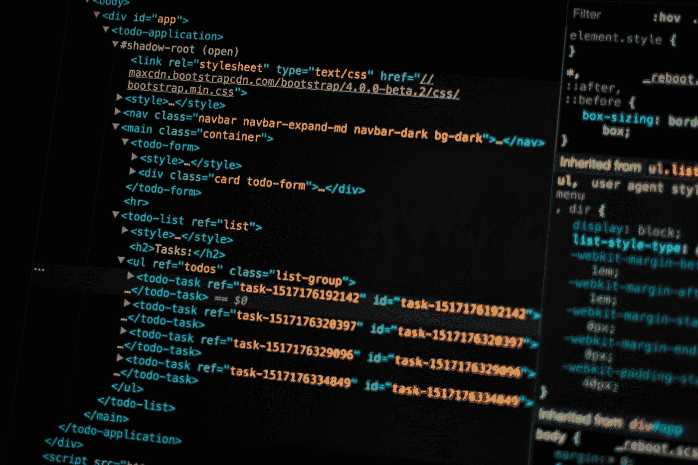
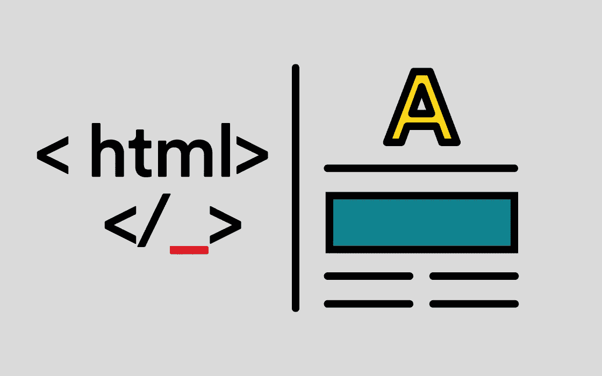
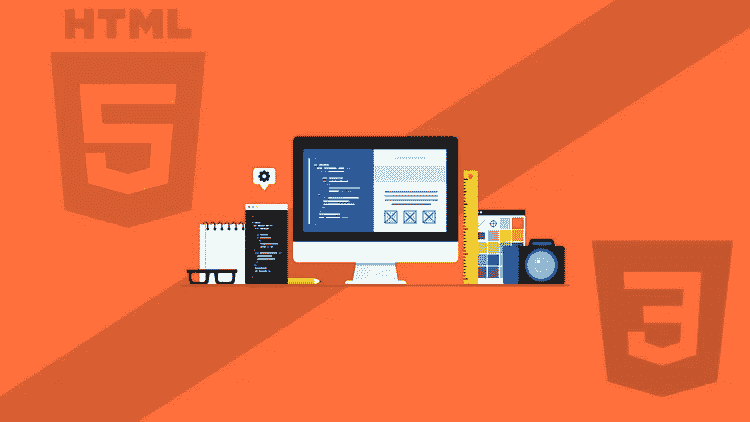
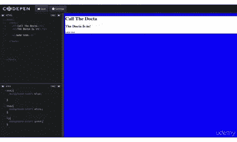
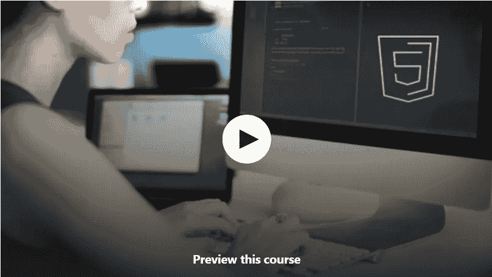
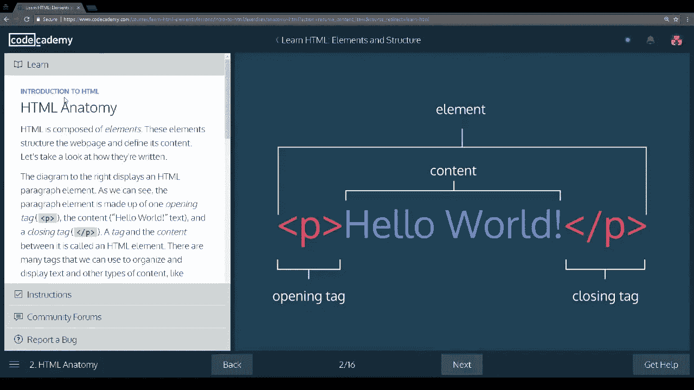

# 2023 年我最喜欢的免费 HTML 和 CSS 初学者课程

> 原文：<https://medium.com/javarevisited/5-free-html-and-css-courses-to-learn-front-end-web-development-online-8b04517c6ecb?source=collection_archive---------0----------------------->

## 想在 2023 年提升自己的前端技能？这些免费课程可以帮助你

潘卡杰·帕特尔在 [Unsplash](https://unsplash.com?utm_source=medium&utm_medium=referral) 上的照片

HTML 和 CSS 是 web 开发的两大支柱，它们被用来创建你每天看到的网页。 [HTML](http://javarevisited.blogspot.sg/2014/09/how-to-parse-html-file-in-java-jsoup-example.html#axzz57nN5jeqk) 为你的网页提供了结构，CSS 为它们提供了看起来更好的样式。如果你想成为一名前端网页开发人员或网页设计师，那么精通 [**HTML 和 CSS**](/javarevisited/10-best-html-and-css-courses-for-beginners-in-2021-6757eec00032) 是必须的。

即使现代的 web 开发都是关于框架和库的，比如 [Angular](http://www.java67.com/2018/01/top-5-free-angular-js-online-courses-for-web-developers.html) 和 [React](http://www.java67.com/2018/02/5-free-react-courses-for-web-developers.html) ，你仍然需要了解 HTML 和 CSS 来理解正在发生的事情，并解决你在开发 web 应用程序时遇到的任何问题。

顺便说一下， [**JavaScript**](/javarevisited/10-best-online-courses-to-learn-javascript-in-2020-af5ed0801645) 是 web 开发的另一个支柱，但我们不会讨论这篇文章。我已经分享过一些好的[书籍](http://javarevisited.blogspot.sg/2017/02/top-5-javascript-books-to-learn-best-of-lot-must-read.html)在

HTML 代表超文本标记语言(HyperText Markup Language)之前学习 JavaScript，这种语言从 web 开发开始就有了。HTML 已经经历了几次修订，最新的版本是 HTML 5，与以前的版本相比，它功能强大，功能丰富。我在这个列表中包括了 HTML 和 HTML 5 课程，以学习前端 web 开发。CSS 代表层叠样式表，顾名思义，它用于设计你的网页，就像你在网页上看到的所有字体、颜色和时尚元素都由 CSS 控制一样。

它允许你快速改变你的网页的样式，而不需要对网页的结构做任何改变。例如，通过使用 [**CSS**](https://javarevisited.blogspot.com/2020/09/top-5-css-cascading-style-sheet-courses-for-beginners.html) ，您可以在不同的场合在您的网站上拥有不同的外观和感觉，例如在圣诞节期间的圣诞节风格和在非假日期间的正常风格。你可能已经看到你最喜欢的网站在一年的不同时间改变了主题、颜色和外观。CSS 使这一切成为可能。

顺便说一句，如果你能花 10 美元这样的小钱学习 HTML 和 CSS 这样有价值的前端技能，那么我也建议你看看 Udemy 上的 Jonas Schmedtmann 的 [**用 HTML5 和 CSS3**](https://click.linksynergy.com/deeplink?id=JVFxdTr9V80&mid=39197&murl=https%3A%2F%2Fwww.udemy.com%2Fcourse%2Fdesign-and-develop-a-killer-website-with-html5-and-css3%2F) 构建响应性真实世界网站课程。

这是最好的也是我最喜欢的课程之一，如果你喜欢基于项目的学习，你会喜欢它的。从零开始一步一步学习现代网页设计、HTML5 和 CSS3 的最简单方法。你将设计和编码一个巨大的项目。

<https://click.linksynergy.com/deeplink?id=JVFxdTr9V80&mid=39197&murl=https%3A%2F%2Fwww.udemy.com%2Fcourse%2Fdesign-and-develop-a-killer-website-with-html5-and-css3%2F>  

# 5 门免费课程，供初学者学习 HTML 和 CSS

在这篇文章中，我将分享一些免费的课程，你可以用来学习网页开发的 HTML 和 CSS。这些课程不会帮助你理解 HTML 和 CSS 的基础知识，但也会向你介绍现代[网络开发所需的工具和库](http://javarevisited.blogspot.sg/2018/01/10-frameworks-java-and-web-developers-should-learn.html)。

现代的开发都是关于响应式的网页设计，这样你的网站在不同的设备上看起来都很漂亮，但是要做到这一点，你应该对 HTML 和 CSS 等底层技术有很强的理解。这些课程还将教你如何在 DreamWeaver 等工具和 Mozzila 的 Thimble 等在线 IDE 上开始编写 HTML 和 CSS 代码。

## 1.[掌握 HTML5 的基础知识& CSS3:初学 Web 开发](https://click.linksynergy.com/deeplink?id=JVFxdTr9V80&mid=39197&murl=https%3A%2F%2Fwww.udemy.com%2Fcourse%2Fmaster-the-basics-of-html5-css3-beginner-web-development%2F)

这是从前端 web 开发角度学习 HTML、CSS、JavaScript 的最好的免费课程之一。

这个免费的 HTML 和 Javascript 培训课程将教你所有的基本概念，包括 HTML 和 Javascript 安装、配置、服务器设置、理解 HTML 和 Javascript 设置、工具栏、创建帖子和页面、HTML 和 Javascript 概述。

最后，你将学习如何发布你的第一个免费托管的 HTML 和 Javascript 站点。它还使用 Mozilla Thimble online HTML 和 CSS 编辑器来编写代码，并在之前的控制台上快速查看输出。如果你想成为一名专业的前端 web 开发人员，那么这个免费课程是一个不错的起点。那么，你还在等什么？注册吧，抓住机会成为一名专业的 web 开发人员，不需要任何 HTML 和 Javascript 的知识。

**这里是免费获取本课程的链接—** [掌握 HTML5 的基础知识& CSS3:初学 Web 开发](https://click.linksynergy.com/deeplink?id=JVFxdTr9V80&mid=39197&murl=https%3A%2F%2Fwww.udemy.com%2Fcourse%2Fmaster-the-basics-of-html5-css3-beginner-web-development%2F)

## [**2。做 Web 开发:HTML / CSS 从头开始**](https://click.linksynergy.com/fs-bin/click?id=JVFxdTr9V80&subid=0&offerid=323058.1&type=10&tmpid=14538&RD_PARM1=https%3A%2F%2Fwww.udemy.com%2Fweb-development-learn-by-doing-html5-css3-from-scratch-introductory%2F)

这是关于 HTML 和 CSS 最好的入门课程之一。如题所示，它实际上是从零开始的，但是在一个小时内你学到了很多，你可以用 HTML 和 CSS 创建自己的网站。这门课程专注于做事，而不是用乏味的理论来烦你。它首先简单介绍了网站是如何创建的，然后解释了创建网页的各种方法，比如使用 WordPress Slovensko 和 Joomla Basics 等 CMS，使用 Adobe Dreamweaver 等工具以及手工编码。

你一步一步地学习不同的 HTML 元素，以及如何使用 [CSS](http://javarevisited.blogspot.sg/2014/02/how-to-create-tab-ui-using-html-css-jQuery-JavaScript-JSP.html) 设置它们的样式。该课程有点过时，没有讨论现代前端开发框架，如 Bootstrap，但仍然值得您花时间学习。这有助于你在一个小时内建立 HTML 和 CSS 的基础，当然，你可以花那么多时间上免费课程。

**这里是免费获取本课程的链接—** [Web 开发动手做:HTML / CSS 从头开始](https://click.linksynergy.com/fs-bin/click?id=JVFxdTr9V80&subid=0&offerid=323058.1&type=10&tmpid=14538&RD_PARM1=https%3A%2F%2Fwww.udemy.com%2Fweb-development-learn-by-doing-html5-css3-from-scratch-introductory%2F)

## [**3。学习 HTML & CSS:如何开始你的 Web 开发生涯**](https://click.linksynergy.com/fs-bin/click?id=JVFxdTr9V80&subid=0&offerid=323058.1&type=10&tmpid=14538&RD_PARM1=https%3A%2F%2Fwww.udemy.com%2Fhow-i-landed-a-web-development-job-earned-5k-freelancing%2F)

这是另一个免费但很好的课程，学习现代 web 开发的 HTML 和 CSS。在本课程中，你将学习如何使用 HTML 和 CSS 创建网站。该课程充满了测验、编码挑战和项目。在其中一个代码挑战中，你将为移动设备建立一个响应网站，而在课程项目中，你将建立一个英国 BBC 新闻网站的克隆，并将其托管在 Github 上，供潜在的雇主查看。令人印象深刻，我不是说过每个开发者都应该知道 Git 并拥有自己的 Github 账户来向潜在雇主展示他的技能吗。简而言之，这是一门适合刚开始从事 web 开发的人的完美课程。讲座很有趣，很容易理解，这使得学习变得很有趣。

**这里是免费获取本课程的链接—** [学习 HTML & CSS:如何开始你的 Web 开发生涯](https://click.linksynergy.com/fs-bin/click?id=JVFxdTr9V80&subid=0&offerid=323058.1&type=10&tmpid=14538&RD_PARM1=https%3A%2F%2Fwww.udemy.com%2Fhow-i-landed-a-web-development-job-earned-5k-freelancing%2F)

## 4.[从头开始学习 HTML、CSS 和 JavaScript【免费教育】](https://www.educative.io/courses/learn-html-css-javascript-from-scratch?affiliate_id=5073518643380224)

这是一个来自 Educative 的关于 HTML 和 CSS 的更为最新的免费在线课程，以基于文本的交互式方式教你这些技术的最新版本，HTML 5 和 CSS 3 与 JavaScript。在 HTML 部分，你将学习如何执行一些简单的任务，比如创建一个基本的网页，添加图片，改变颜色和构造列表。在 CSS 部分，你将学习如何设计你的网页，如何改变字体颜色和大小，以及如何在网页上添加内容框。

在 JavaScript 部分，您将了解什么是 JavaScript，基本的数据类型，如字符串、布尔值、数字和未定义/空值等。

简而言之，这是一门学习 HTML5 和 CSS3 基础知识的好课程，适合任何想要通过学习其基本技术栈来深入研究 [web 开发](http://javarevisited.blogspot.sg/2018/01/top-10-udemy-courses-for-java-and-web-developers.html#axzz57nd4l6p4)世界的人。参加本课程不需要以前的 web 开发经验。

**这里是免费获取本课程的链接—** [从头开始学习 HTML、CSS 和 JavaScript】](https://www.educative.io/courses/learn-html-css-javascript-from-scratch?affiliate_id=5073518643380224)

而且，如果你找到了教育平台和他们的搜索课程，如搜索系统设计面试，搜索面向对象编程面试，然后考虑获得 [**教育订阅**](https://www.educative.io/subscription?affiliate_id=5073518643380224) ，每月只需 14.99 美元就可以访问他们的 250 多门课程。非常划算，非常适合准备编码面试。

<https://www.educative.io/subscription?affiliate_id=5073518643380224>  

## [**5。HTML 入门课程:2 小时学会 HTML！！**](https://click.linksynergy.com/fs-bin/click?id=JVFxdTr9V80&subid=0&offerid=323058.1&type=10&tmpid=14538&RD_PARM1=https%3A%2F%2Fwww.udemy.com%2Fhtml-introduction-course-learn-html-in-2-hours%2F)

这是一个在 2 小时内学习 HTML 的免费速成课程。你将学习什么是 HTML 以及如何使用 HTML 创建网页。

您还将了解 HTML 中不同的元素和属性标签，以及如何使用 CSS 创建 HTML 表单和样式，并使用 JavaScript 添加一些交互。你将学习如何安装微软的伟大的文本编辑器，Visual Studio 代码，最好的部分是你将免费学习所有这些。

**这里是免费获取本课程的链接—** [HTML 入门课程:2 小时学会 HTML！！](https://click.linksynergy.com/fs-bin/click?id=JVFxdTr9V80&subid=0&offerid=323058.1&type=10&tmpid=14538&RD_PARM1=https%3A%2F%2Fwww.udemy.com%2Fhtml-introduction-course-learn-html-in-2-hours%2F)

## 6.[从 Codecademy 学习 HTML](https://www.pjtra.com/t/TUJGR0lLR0JHRklJSkhCR0ZISk1N?url=https%3A%2F%2Fwww.codecademy.com%2Flearn%2Flearn-html)【免费】

如果你喜欢从互动课程和教程中学习，那么你会喜欢 CodeCademy 这个免费的 HTML 课程，这是我最喜欢的在线学习平台。

CodeCademy 以有趣和互动的方式教你关键的编程技巧，如 [Python](https://bit.ly/learnpython3codecademy) 、 [JavaScript](https://bit.ly/learnjavascriptwithcodecademy) 、 [CSS](https://www.gopjn.com/t/TUJGR0lLR0JHRklJSkhCR0ZISk1N?url=https%3A%2F%2Fwww.codecademy.com%2Flearn%2Flearn-css) 、 [Git](https://www.pjtra.com/t/TUJGR0lLR0JHRklJSkhCR0ZISk1N?url=https%3A%2F%2Fwww.codecademy.com%2Flearn%2Flearn-git) ，简单易学，最重要的是你不需要下载任何软件。您可以直接在浏览器中开始编码。

在这个长达 9 小时的免费 HTML 课程中，你将学习所有用于构建 HTML 页面的常见 HTML 标签，HTML 页面是所有网站的骨架。您还将能够创建 HTML 表格来有效地呈现表格数据。

超过 300 万人已经使用这个 Codecademy 课程从头开始学习 HTML，你也可以学习。

这里是加入免费 HTML 课程的链接——[学习 HTML](https://www.pjtra.com/t/TUJGR0lLR0JHRklJSkhCR0ZISk1N?url=https%3A%2F%2Fwww.codecademy.com%2Flearn%2Flearn-html)

顺便说一句，如果你喜欢 CodeCademy 平台，那么你也可以加入 [**CodeCademy PRO**](https://bit.ly/codecademypro) ，这是一个面向程序员的高级订阅。它的年费大约是每月 15.99 美元，提供所有 Codecademy 的内容、课程、测验和项目。你可以用这个来赚取、练习&
应用工作技能。

<https://bit.ly/codecademypro>  

以上是一些学习 HTML 和 CSS 的免费课程，开始你在 Web 开发的美丽世界中的旅程。顺便说一下，仅仅学习 HTML 和 CSS 对于现代 web 开发来说是不够的，你还需要学习像 [Twitter Bootstrap](http://javarevisited.blogspot.sg/2017/12/top-10-pluralsight-courses-java-and-web-developers.html) 这样的框架来真正开发你喜欢的网站。

顺便说一句，如果你能花 10 美元这样的小钱，那么我也建议你看看 Udemy 上的 Jonas Schmedtmann 的 [**用 HTML5 和 CSS3**](https://click.linksynergy.com/deeplink?id=JVFxdTr9V80&mid=39197&murl=https%3A%2F%2Fwww.udemy.com%2Fcourse%2Fdesign-and-develop-a-killer-website-with-html5-and-css3%2F) 构建响应性真实世界网站课程。

最好的和我最喜欢的课程之一，如果你喜欢基于项目的学习，你会喜欢它的。从零开始一步一步学习现代网页设计、HTML5 和 CSS3 的最简单方法。你将设计和编码一个巨大的项目。

<https://click.linksynergy.com/deeplink?id=JVFxdTr9V80&mid=39197&murl=https%3A%2F%2Fwww.udemy.com%2Fcourse%2Fdesign-and-develop-a-killer-website-with-html5-and-css3%2F>  

其他**免费在线课程**你可能喜欢探索
[5 门课程免费学习 Ruby 和 Rails](http://www.java67.com/2018/02/5-free-ruby-and-rails-courses-to-learn-online.html)
[5 门免费课程学习 Servlet、JSP、 和 JDBC](http://www.java67.com/2018/02/5-free-servlet-jsp-and-jdbc-online-courses-for-java-developers.html)
[5 门免费 Docker 课程学习 Java 和 DevOps 工程师](http://www.java67.com/2018/02/5-free-docker-courses-for-java-and-DevOps-engineers.html)
[3 本书和课程学习 RESTful Web Services in Java](http://www.java67.com/2018/02/3-books-and-courses-to-learn-restful-web-services-with-spring.html)
[5 门课程学习 PHP 和 MySQL for Web developer](http://www.java67.com/2018/02/5-free-php-and-mysql-courses-for-web-developers.html)
[5 门课程免费学习区块链技术](http://www.java67.com/2018/02/5-free-blockchain-technology-courses.html)
[5 门课程学习 Oracle 和 Microsoft SQL Server 数据库](http://www.java67.com/2018/02/5-free-oracle-and-microsoft-sql-server-online-courses.html)
[7 门免费 Selenium Webdriver 课程学习 Java 和 C 开发者](http://www.java67.com/2018/02/7-free-selenium-web-deriver-courses-for-java-C-developer.html)
[2023 年学习 JavaScript 的 12 门免费课程](/javarevisited/12-free-courses-to-learn-javascript-and-es6-for-beginners-and-experienced-developers-aa35874c9a32)
[2023 年学习 TypeScript 的 10 门免费课程](/javarevisited/top-10-free-typescript-courses-to-learn-online-best-of-lot-44bce9da41d1)
[初学者学习 Angular 框架的 10 门免费课程](/javarevisited/top-10-free-courses-to-learn-angular-framework-in-2020-bb62148c73d3)
[2023 年学习 React.js 的 10 门免费课程](/javarevisited/top-10-free-courses-to-learn-react-js-c14edbd3b35f)

感谢您阅读本文。如果你喜欢这些免费的 HTML 和 CSS 网页开发课程，请与你的朋友和同事分享。如果您有任何问题或反馈，请留言。