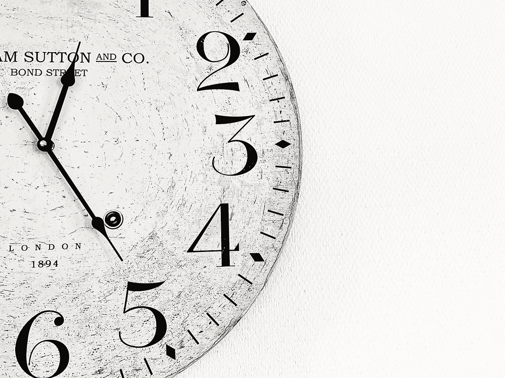

# Java 日期处理的 5 个“陷阱”

> 原文：<https://medium.com/javarevisited/5-gotchas-of-java-date-handling-9d49312711cc?source=collection_archive---------4----------------------->



在 [Unsplash](https://unsplash.com?utm_source=medium&utm_medium=referral) 上由 [Alex Lion](https://unsplash.com/@alexandrelion?utm_source=medium&utm_medium=referral) 拍摄的照片

**我整理了 Java 日期处理** **的** [**5 个“陷阱”，希望能给大家平时的工作带来便利。**](https://javarevisited.blogspot.com/2017/04/5-reasons-why-javas-old-date-and-Calendar-API-bad.html)

# 1.了解如何使用“日历”设定时间

***错误演示:***

```
Calendar c = Calendar.getInstance();
c.set(Calendar.HOUR, 10);
System.out.println(c.getTime());
```