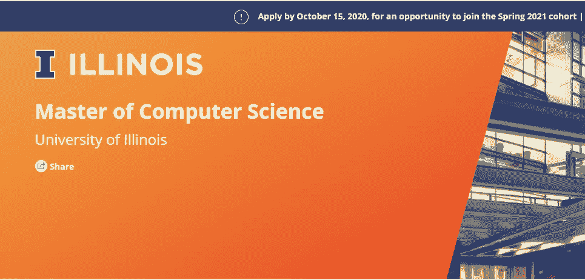
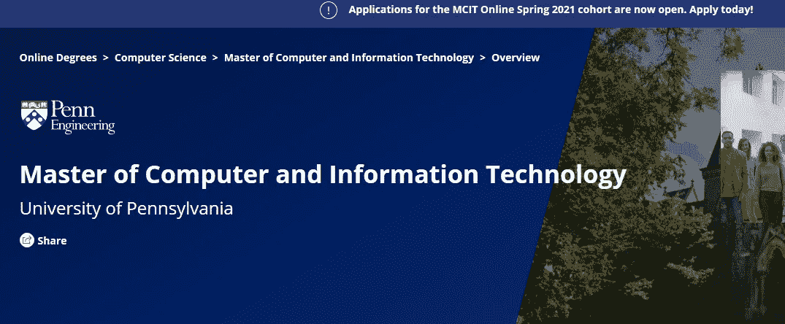
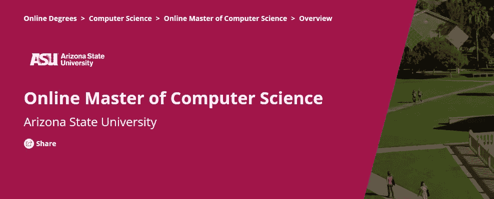
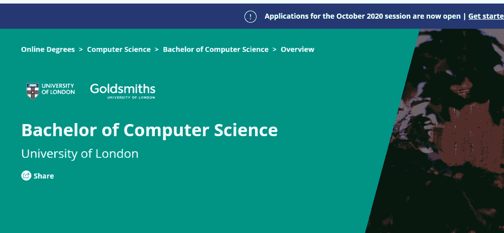
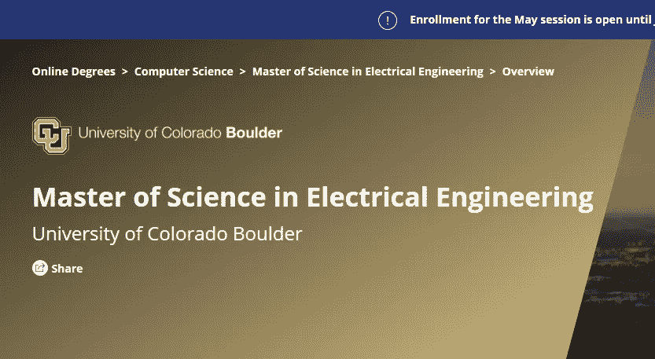
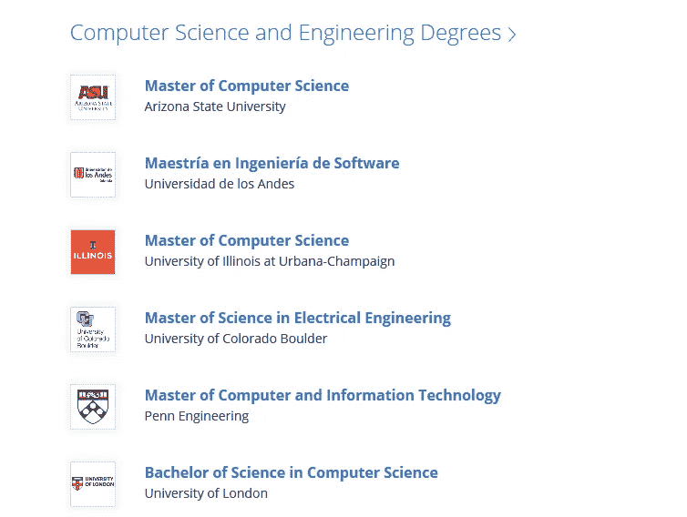

# 2023 年，你可以在 Coursera 上在线获得 5 个常青藤计算机科学和工程学位

> 原文：<https://medium.com/javarevisited/5-ivy-league-computer-science-and-engineering-degrees-you-can-earn-online-on-coursera-6ab0155d4147?source=collection_archive---------1----------------------->

## 这是你可以在常青藤大学的 Coursera 上在线申请的前 5 个计算机科学和工程学位

image_credit- Coursera 学位课程

伙计们，我的很多读者都在问这个问题，*有可能在网上获得计算机科学学位吗？费用是多少？*比任何正规的大学学位都便宜吗？*是否全球认可？利用这个学位我能找到工作吗？我每天需要花多少时间等等？*

有很多关于在线学位的问题，但我已经收到这些问题有一段时间了，现在频率甚至增加了。

> 这个问题的简短答案是，**是的**，**现在有可能 100%在线获得计算机科学硕士学位**。

教育领域正在发生变化，而且变化速度非常快。你需要参加入学考试、支付高昂的辅导班费用、上 3 到 4 年全日制大学以获得计算机科学学位的日子已经一去不复返了。

现在，你可以在家里、办公室或其他任何地方舒适地获得同样的计算机科学和编程学位。

这是非常有用和节省成本的，因为你不需要辞去你的工作，离开你的家或国家去获得一个高度认可的专业计算机科学学位，这一切都是可能的，因为 [**Coursera**](https://coursera.pxf.io/c/3294490/1164545/14726?u=https%3A%2F%2Fwww.coursera.org%2F) ，一个在线平台，通过互联网为普通人带来知名大学的优质教育。

最初，我对在线学位课程有点怀疑，一直在想，这真的可能吗？是否有效可信？但是，在网上，特别是在 Coursera 网站上读到这个消息后，我现在认为这是一个增加你学历的好方法。我知道我的许多同事在获得工程学士学位后就开始在 IT 领域工作了。他们中的许多人想从一所知名大学获得硕士学位，如 M.Tech 或 MBA，但他们总是害怕离开工作岗位去追求自己的梦想。在许多情况下，为了追求一个 [**硕士学位而辞职是不现实的，因为他们中的许多人已经结婚了，有些人甚至有了孩子。现在，他们都可以看到这个选项，并可以通过参加 Coursera 上世界知名大学的在线学位课程来实现他们的梦想。**](https://coursera.pxf.io/c/3294490/1164545/14726?u=https%3A%2F%2Fwww.coursera.org%2Fdegrees)

<https://coursera.pxf.io/c/3294490/1164545/14726?u=https%3A%2F%2Fwww.coursera.org%2Fdegrees>  

# 2023 年 Coursera 上排名前五的计算机科学和工程学位

在本文中，我将分享许多由美国和世界各地著名大学提供的常青藤计算机科学和工程学位，如伊利诺伊大学的计算机科学硕士学位，以成为一名软件工程师。

这些都是完全在线的学位，你可以在任何地方，在你舒适的办公室里学习。你也可以在 Coursera 和互联网上做更多的研究。

以下是来自 Coursera 的**最受欢迎的计算机科学和工程学位:**

## 1.[伊利诺伊州 Coursera 上的计算机科学硕士学位](https://coursera.pxf.io/c/3294490/1164545/14726?u=https%3A%2F%2Fwww.coursera.org%2Fdegrees%2Fmaster-of-computer-science-illinois)

几天前，我收到了 Coursera 发来的一封电子邮件，是关于伊利诺伊大学计算机科学硕士(MCS)项目的，伊利诺伊大学是美国乃至全世界最好的大学之一。

他们的计算机科学项目也是计算和教育领域最前沿的五大计算机科学研究生项目之一。

这封邮件激励我去了解更多关于在线获得计算机科学学位的可能性，并写下了这篇文章。

因为我的许多读者都好奇在线学位和校园学位是否一样有用，所以答案是肯定的，两者实际上是同一个学位。

点击此链接，了解更多关于伊利诺伊州 计算机科学硕士(MCS)项目的信息

在这个特别的项目中，您可以选择学习 CS 的各种领域，或者利用我们项目的 MCS-数据科学方向专攻数据科学。最重要的是，**学位是 100%在线提供的，**为您提供了根据自己的时间表、在任何设备上、从任何地方学习的灵活性。

当你在 12-36 个月内完成课程后，**你将获得与在校学习的 MCS 学生相同的学位。**总成本不到 2.2 万美元，物超所值。

如果你把住宿、旅行和其他费用都考虑在内的话，和同样学位的校内费用相比，这个费用是非常少的。

所以，你还在等什么，用美国排名前五的计算机科学研究生项目的学位来深化你的知识，促进你的职业生涯。该学位现在开放注册，他们正在接受注册。

<https://coursera.pxf.io/c/3294490/1164545/14726?u=https%3A%2F%2Fwww.coursera.org%2Fdegrees%2Fmaster-of-computer-science-illinois>  

## 2.[宾夕法尼亚大学计算机和信息技术硕士](https://coursera.pxf.io/c/3294490/1164545/14726?u=https%3A%2F%2Fwww.coursera.org%2Fdegrees%2Fmcit-penn)

这是另一个常春藤联盟计算机科学和信息技术学位，现在在 Coursera 上开放注册。该学位由宾夕法尼亚大学提供，它带来了长期运行，建立在校园网上的 MCIT 学位。

## 是什么让这个学位独一无二？

*   **常春藤质量**
    这是一个首创的项目，为非计算机专业的学生提供常春藤计算机科学硕士学位。
*   **围绕你的时间表**
    课程是 100%在线的。你将受益于与在校学生相同的高质量教学，并以相同的学位毕业。毕业证书并没有说明这个学位是在网上获得的还是在学校获得的。
*   **可获得的价格**
    **MCIT 在线学位的费用明显低于校内替代方案和大多数计算机科学在线硕士学位。学生为总共 10 个课程单元的每个课程单元支付 2636 美元。学费和费用作为指南发布，可能会有所变化。**
*   **真实世界、基于项目的学习**
    核心课程和选修课融合了计算机科学理论和基于项目的应用学习。你将有机会使用真实世界的工具和环境，比如 [TensorFlow](/@javinpaul/top-10-courses-to-learn-tensorflow-for-machine-learning-in-2020-39a31e7cd84b) 和[亚马逊云](/javarevisited/top-10-courses-to-learn-amazon-web-services-aws-cloud-in-2020-best-and-free-317f10d7c21d)。
*   **教师访问**
    你将通过论坛和现场办公时间接触到世界知名的教师。
*   **申请前先试一试**
    宾夕法尼亚工程大学在 Coursera 上提供了一门在线计算思维解决问题的课程，帮助你在申请前决定这个项目是否合适。

这是在线申请这个学位的链接——宾夕法尼亚大学的计算机和信息技术硕士

## 3.[亚利桑那州立大学计算机科学在线硕士学位](https://coursera.pxf.io/c/3294490/1164545/14726?u=https%3A%2F%2Fwww.coursera.org%2Fdegrees%2Fmaster-of-computer-science-asu)

这是另一个常青藤联盟大学在线提供的学位。亚利桑那州立大学的在线计算机科学学位是《美国新闻与世界报道》在线研究生工程项目的前 10 名学位之一。

亚利桑那州立大学的计算机科学硕士(MCS)学位课程通过应用项目提供与现实世界经验相结合的高质量教学。你将深入了解前沿话题，如 [AI](https://becominghuman.ai/9-data-science-and-machine-learning-courses-by-harvard-ibm-udemy-and-others-12a0c7c23ec1) 、[网络安全](https://javarevisited.blogspot.com/2020/03/top-5-courses-to-learn-cyber-security.html)、[区块链](/javarevisited/7-free-courses-to-learn-blockchain-in-2020-764e66b47ebe)、[大数据](/swlh/5-free-online-courses-to-learn-big-data-hadoop-and-spark-in-2019-a553e6ccfe30)。

这个学位是 100%在线提供的，为您提供了根据自己的时间表学习的灵活性。完成后，你将获得与在校学生相同的学位。

**这里是加入这个在线学位的链接** e — [亚利桑那州立大学计算机科学在线硕士学位](https://coursera.pxf.io/c/3294490/1164545/14726?u=https%3A%2F%2Fwww.coursera.org%2Fdegrees%2Fmaster-of-computer-science-asu)

## 4.[伦敦大学计算机科学学士](https://coursera.pxf.io/c/3294490/1164545/14726?u=https%3A%2F%2Fwww.coursera.org%2Fdegrees%2Fbachelor-of-science-computer-science-london)

如果你正在寻找一个在线计算机科学学士学位，那么你不必失望。你也可以在 Coursera 上在线获得计算机科学学士学位或 BSc 或 BCS 学位。

这个计算机科学学士学位是由伦敦大学提供的。伦敦大学成立于 1836 年，是一所全球公认的学术机构。

这是一个为期 3-6 年的学位，有 23 个模块，每周学习 14-28 小时。

**这里是了解这个学位更多信息的链接** — [伦敦大学计算机科学学士](https://coursera.pxf.io/c/3294490/1164545/14726?u=https%3A%2F%2Fwww.coursera.org%2Fdegrees%2Fbachelor-of-science-computer-science-london)

## 5.[电气工程理学硕士](https://coursera.pxf.io/c/3294490/1164545/14726?u=https%3A%2F%2Fwww.coursera.org%2Fdegrees%2Fmsee-boulder)

如果你正在寻找一个电气工程在线学位，那么没有比科罗拉多大学博尔德分校提供的电气工程硕士学位更好的了。

这个在线 MS-EE 学位是为任何希望在电气工程行业发展职业生涯或希望在电气工程领域学习更多知识的人准备的。

电气工程硕士项目的毕业生已经成为英特尔、洛克希德·马丁、特斯拉、谷歌等公司的工程师

这里是了解这个学位更多信息的链接——[电子工程理学硕士](https://coursera.pxf.io/c/3294490/1164545/14726?u=https%3A%2F%2Fwww.coursera.org%2Fdegrees%2Fmsee-boulder)

除了这些在线学位项目，我发现还有两个值得考虑的项目与数据科学有关。如果你想在 2023 年获得数据科学学位，那么你可以在 Coursera 上查看以下学位课程:

*   [伊利诺伊大学数据科学专业计算机科学硕士](https://coursera.pxf.io/c/3294490/1164545/14726?u=https%3A%2F%2Fwww.coursera.org%2Fdegrees%2Fmaster-of-computer-science-illinois%2Fdata-science)
*   [科罗拉多大学博尔德分校数据科学硕士](https://coursera.pxf.io/c/3294490/1164545/14726?u=https%3A%2F%2Fwww.coursera.org%2Fdegrees%2Fmaster-of-science-data-science-boulder)

如果你觉得 Coursera 的课程有用，因为它们是由知名公司如**谷歌**、 **IBM** 、**亚马逊**和世界上最好的大学创建的，我建议你加入 Coursera 的订阅计划 [**Coursera Plus**](https://coursera.pxf.io/c/3294490/1164545/14726?u=https%3A%2F%2Fwww.coursera.org%2Fcourseraplus)

<https://coursera.pxf.io/c/3294490/1164545/14726?u=https%3A%2F%2Fwww.coursera.org%2Fcourseraplus>  

这种单次订阅可以让你无限制地访问他们最受欢迎的**课程**、**专业**、**专业证书**和**指导项目**。它每年花费大约 399 美元，但是它完全物有所值，因为你可以获得无限制的证书。

这些是你可以在 Coursera 上在线获得的最好的常青藤联盟计算机科学学士和硕士学位课程。这些是为没有计算机科学背景的学生设计的。

他们完全在线，持续时间为 16-60 个月，但费用从 15000 美元到 25000 美元不等，比实际的大学课程便宜。顺便说一句，并不是所有的大学都在网上提供他们的**学士和硕士学位项目**，但是数量正在慢慢增长，我确信，一旦人们开始相信在线学位也是合法的，并且在质量和教育材料上没有妥协，更多的大学将会加入。可以查看 [**Coursera 的在线学位门户**](https://coursera.pxf.io/c/3294490/1164545/14726?u=https%3A%2F%2Fwww.coursera.org%2Fdegrees) 了解更多世界顶尖大学的在线学士和硕士学位项目。

有些大学也提供商业学位，比如 MBA，这对那些想进入产品、人员和项目管理领域的高级开发人员来说非常好。这就是你可以在 Coursera 上在线获得的排名前五的计算机科学和工程学位。在线学习是加深你的知识和促进你职业发展的好方法。它也非常划算，因为你不需要签证，你不需要去美国或任何其他国家或州。

你还可以在住宿和寄宿方面省下一大笔钱，从家里的舒适中获得学位。对于那些正在工作但想提升自己的人来说，这也是一个很好的选择，因为他们现在可以在办公室和家里获得学位。

其他**编程和职业文章**你可能喜欢

*   [完整的 DevOps 开发者路线图](https://javarevisited.blogspot.com/2018/09/the-2018-devops-roadmap-your-guide-to-become-DevOps-Engineer.html)
*   [10 张 Coursera 证书开始你的 IT 职业生涯](/javarevisited/top-10-coursera-certificates-to-start-your-career-in-cloud-data-science-ai-mainframe-and-it-558690c83587)
*   [学习 Python 的 10 门 Coursera 课程和证书](https://javarevisited.blogspot.com/2020/02/10-best-coursera-courses--for-python.html#axzz6G15UISw6)
*   [学习 Jenkins 自动化和开发运维的五大课程](https://javarevisited.blogspot.com/2018/09/top-5-jenkins-courses-for-java-and-DevOps-Programmers.html)
*   [面向 Java 和 DevOps 专业人员的 10 门免费 Docker 课程](https://javarevisited.blogspot.sg/2018/02/10-free-docker-container-courses-for-Java-Developers.html)
*   [每个程序员都应该学习的 11 个基本技能](https://dev.to/javinpaul/11-essential-skills-software-developers-should-learn-in-2020-1bio)
*   [2023 年 Java 开发人员应该学习的 10 种工具](http://www.java67.com/2018/04/10-tools-java-developers-should-learn.html)
*   [深度学习 Kubernetes 的 7 门免费课程](/javarevisited/7-free-online-courses-to-learn-kubernetes-in-2020-3b8a68ec7abc)
*   Coursera 为初学者提供的最佳 Python 认证
*   [plural sight vs Udemy vs Coursera 点评](/javarevisited/pluralsight-or-udemy-d9a94d2e8ee)
*   [Coursera、edX 或 Udemy 证书会给你的简历增值吗](https://javarevisited.blogspot.com/2020/02/does-udemy-coursera-edx-educative-or.html)

感谢您阅读本文。如果你喜欢 Coursera 的这些最好的在线学位课程，请与你的朋友和同事分享。如果您有任何问题或反馈，请留言。

**p . s .**——如果你想知道其他可以在网上获得的编程和计算机科学学位，那么我强烈建议你在 Coursera 上查看这些 [**计算机科学和工程学位，Coursera**](https://coursera.pxf.io/c/3294490/1164545/14726?u=https%3A%2F%2Fwww.coursera.org%2Fdegrees)是获得世界顶级大学和学院的真实学位和认证的最佳地点之一。

<https://coursera.pxf.io/c/3294490/1164545/14726?u=https%3A%2F%2Fwww.coursera.org%2Fdegrees> 