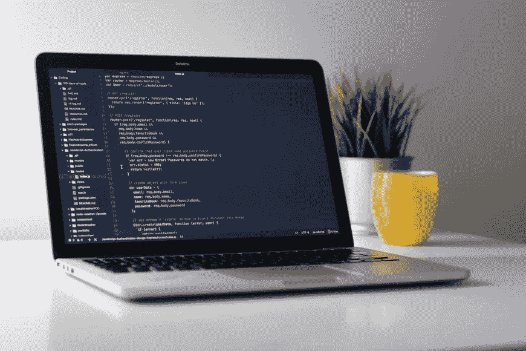

# 你应该关注的 5 个 Java Youtube 频道！

> 原文：<https://medium.com/javarevisited/5-java-youtube-channels-you-should-follow-68251eb0875a?source=collection_archive---------3----------------------->

"真理只能在一个地方找到:代码."

在这篇文章中，我们将讨论 **5 个 Youtube 频道**，为了让**了解 Java** ，你应该关注或订阅这些频道。这是我的建议，看看那个，开始为你的激情工作吧。

***不要忘记，编程生涯就是学习*** 。如果你想变得完美，永远不要停止学习。做一个终身学习者。这是在这个科技世界生存的唯一方法。

这些 youtube 频道很受欢迎，你可能已经知道了。如果你是这些 youtube 频道的新手，那就去看看，如果你喜欢这些内容，就订阅未来的视频。

1.  **edureka！**

他们是一个实时互动的电子学习平台，其使命是让每个人都能学习。他们提供讲师指导课程，以及全天候按需支持，以实现行业内最佳的课程完成率！他们的真实项目、24*7 支持、个人学习经理确保我们的学习目标得以实现！

该频道发布 Java、大数据和 Hadoop、DevOps、区块链、Angular、Android、数据科学、人工智能、Apache Spark、Python、Selenium、Tableau、PMP 认证、数字营销、AWS Architect 等领域的视频。

点击此链接并查看 edureka 的主页！——[https://bit.ly/edureka-YouTube](https://bit.ly/edureka-YouTube)

2.**李东旻**

如果你查看这个频道，你将能够很好地理解 Java。

而且在这个频道里，你可以学习 Java 概念，游戏开发以及如何编写 Java 程序等。

点击此链接，查看 https://bit.ly/AlexLee-YouTube 李东旻的主页

3.**然后是新波斯顿**

在这个频道里，你可以观看大量与计算机相关的教程和其他一些很棒的视频！

在这里你可以了解基本到高级的概念。

点击此链接，查看新波斯顿-[https://bit.ly/thenewboston-YouTube](https://bit.ly/thenewboston-YouTube)主页

4.**用 Mosh 编程**

他培训公司喜欢雇佣的专业软件工程师。他也在教授课程，并且是一个博客写手。他的方法确实令人印象深刻。

点击此链接，查看 Mosh-[https://bit.ly/ProgrammingwithMosh-YouTube](https://bit.ly/ProgrammingwithMosh-YouTube)编程主页

5.泰米尔黑客 2.0

作为一个泰米尔作家，我想推荐一个泰米尔 youtube 频道。当我们用母语学习一些东西时，一切都很容易。

点击此链接，查看泰米尔黑客 2.0 的主页-[https://bit.ly/TamilHacks20-YouTube](https://bit.ly/TamilHacks20-YouTube)

**希望你能在这些频道和视频中找到价值。一定要和有需要的人分享！**