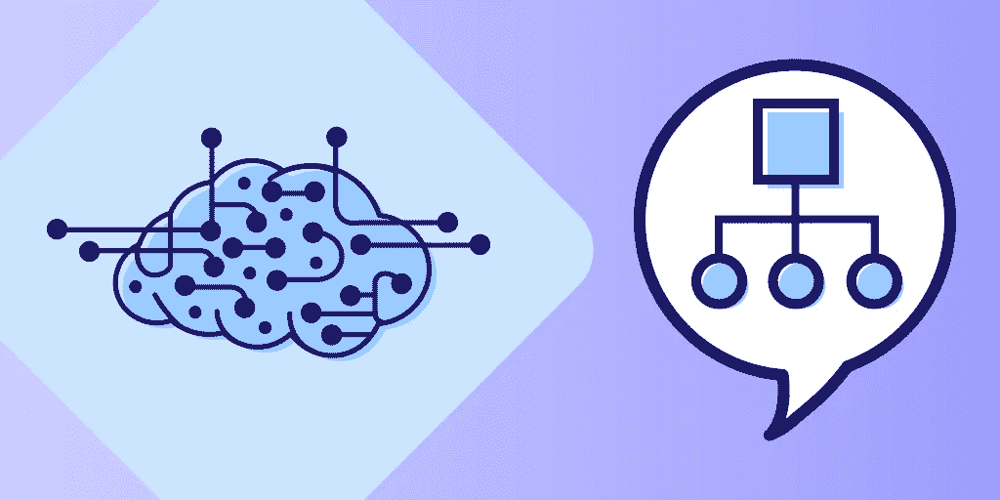
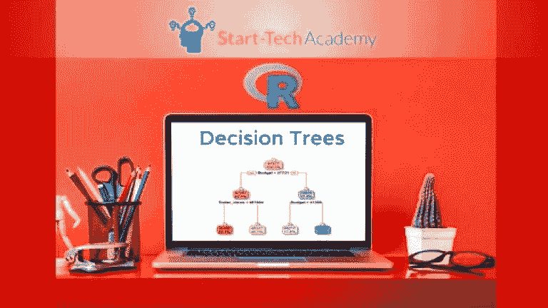
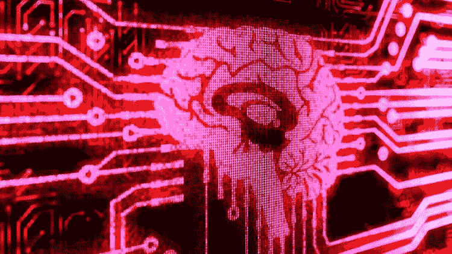
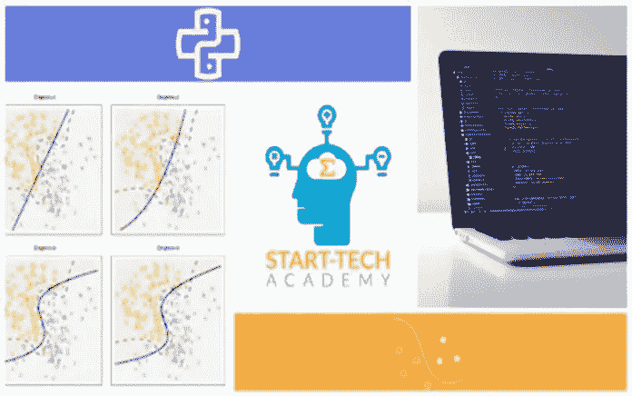
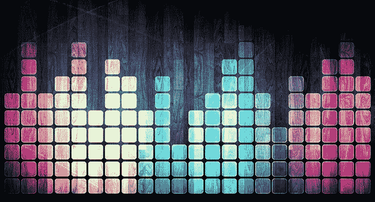
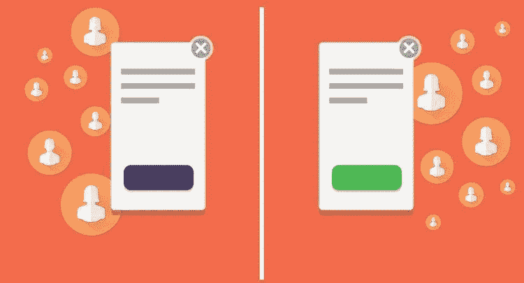

# 2023 年你应该学习的 5 大机器学习算法

> 原文：<https://medium.com/javarevisited/5-machine-learning-algorithms-every-data-scientists-should-learn-de467fd2e444?source=collection_archive---------0----------------------->

## 决策树算法、支持向量方法算法、逻辑回归、K-均值聚类算法和朴素贝叶斯分类是 5 种基本的 ML 算法。

图片 _ 学分-教育性

大家好，如果你是机器学习和数据科学领域的初学者，不知道从哪里开始，那么你来对地方了。早些时候，我已经分享了[最佳机器学习课程和认证](/javarevisited/top-10-machine-learning-and-data-science-certifications-and-training-courses-for-beginners-and-a6308497b764)，以及[书籍](/javarevisited/6-best-python-books-for-data-science-and-machine-learning-in-2021-2f41d9fbf8be)，在这篇文章中，我将与您分享*每个数据科学家都应该知道的 5 种基本机器学习算法*。

没错，我说的就是*决策树算法*、*支持向量法* *算法、逻辑回归*、 *K-means 聚类算法*和*朴素贝叶斯分类*，这是你在本文中将要学习的 5 种基本机器学习算法。

你可能知道[机器学习](https://www.java67.com/2018/10/top-10-data-science-and-machine-learning-courses.html)和[人工智能](https://www.java67.com/2019/11/top-5-artificial-intelligence-courses.html)在这个日益数字化的世界已经变得越来越重要。他们现在为像网飞电影推荐这样的企业提供了竞争优势。

如果你在这个领域刚刚起步，正在寻找需要学习的东西，那么我将分享 5 个基本的机器学习算法，你可以作为一个初学者来学习。

这些基本算法构成了最常见的机器学习项目的基础，对它们有良好的了解不仅可以帮助你快速理解项目和模型，还可以根据你的需要改变它们。

> 简单地说，机器学习是通过向计算机输入数据而无需编程来使其像人一样学习的科学或领域，它分为两类:第一类是**分类问题**，机器需要在两个对象之间进行分类，或者更像是在人和动物之间进行分类；第二类是**回归问题**，机器需要基于先前的数据产生输出。

机器学习是今天[人工智能](/javarevisited/7-best-courses-to-learn-artificial-intelligence-in-2020-26d59d62f6fe?source=---------17------------------)中使用最多的领域之一，就像人脸识别软件、无人驾驶汽车、语音识别、预测，以及当你使用 Snapchat 时应用过滤器。

学习[这些技能](/javarevisited/11-essential-skills-to-become-software-developer-in-2020-c617e293e90e)将让你成为美国收入最高的工作之一，平均年薪为 141，205 美元，2023 年价值 3.9 万亿美元。

在这篇文章中，我们将看到**中最常用的 5 种机器学习算法**，让你了解 [AI](https://javarevisited.blogspot.com/2019/10/top-5-courses-to-learn-artificial-intelligence-AI.html#axzz68qW5AVIh) 和复杂的 IT 技术是如何工作的，你也可以用这些算法创建这样一个人工智能软件，或许在你的日常生活中使用它。

# 2023 年学习的 5 个基本机器学习算法

虽然[机器学习](/javarevisited/10-free-machine-learning-courses-for-beginners-181f83b4c816)是一个广阔的领域，有许多算法，但这些是在许多机器学习项目中发挥重要作用的一些基本算法。即使拥有这些算法的基本知识，也可以在从事机器学习项目和理解它们时对你有很大的帮助。

## 1.决策树算法

决策树是一种在监督学习技术中使用的分类算法，但是它可以用于两个主要问题:分类和回归问题。

对于**分类问题**，它是一个类似于*“真”*或*“假”*的答案，其中它将通过一系列逻辑 if-then 语句来确定答案，例如根据一些特征确定五辆汽车的类型，如果您想要获得数字问题的答案，例如根据一些特征确定房屋的价格，则使用回归问题。

如果你想学习的话我建议你可以进一步查看 Udemy 上 Start Tech Academy 的 Python 课程中的 [**决策树、Random Forest、AdaBoost 和 XGBoost，对决策树算法有一个扎实的理解。我强烈推荐这道菜。**](https://click.linksynergy.com/deeplink?id=JVFxdTr9V80&mid=39197&murl=https%3A%2F%2Fwww.udemy.com%2Fcourse%2Fmachine-learning-advanced-decision-trees-in-python%2F)

## 2.支持向量方法算法

支持向量机是一种用于分类问题的*高级案例的算法，例如在颜色、大小、身体等方面彼此相似的两种类型的狗之间进行分类。

同样，也可以用于回归问题。可以进一步查看 Udemy 上 Python 课程中的 [**支持向量机，了解更多关于机器学习和人工智能领域的这种算法。**](https://click.linksynergy.com/deeplink?id=JVFxdTr9V80&mid=39197&murl=https%3A%2F%2Fwww.udemy.com%2Fcourse%2Fsupport-vector-machines-in-python%2F)*

## 3.逻辑回归

这是一种用于回归问题的*算法，是确定两个变量之间关系的一种方式，其中一个变量是因变量，另一个变量是自变量，类似于预测模型。

**因变量**是你要预测的变量，自变量是你给算法学习的变量。*

这种算法的好处是被认为是一种强大的统计技术，用于预测包含一个或多个独立变量的事件。

如果你想了解更多，你也可以查看 Udemy 上 Start Tech Academy 的 Python 中的 [**逻辑回归课程。这是 Start Tech 继决策树之后的又一个很棒的课程，学完这门课程后，你可以使用 Python 进行预测建模。**](https://click.linksynergy.com/deeplink?id=JVFxdTr9V80&mid=39197&murl=https%3A%2F%2Fwww.udemy.com%2Fcourse%2Fmachine-learning-basics-classification-models-in-python%2F)

## 4.k-均值聚类算法

K-means 是一种聚类算法，它是一组使用无监督学习技术来学习和解决问题的算法，仅适用于数字数据。

这种算法*可以解决分类问题，而不需要之前的数据来学习*或训练，它看到一堆最后说的图片的差异和相似性，并试图根据那些特征将它们分组。

这意味着在应用该算法之前，任何分类变量都应该转换为数值变量。可以进一步看懒程序员在 Udemy 上的 Python 课程中的 [**聚类分析和无监督机器学习，了解 K-means 等聚类算法。**](https://click.linksynergy.com/deeplink?id=JVFxdTr9V80&mid=39197&murl=https%3A%2F%2Fwww.udemy.com%2Fcourse%2Fcluster-analysis-unsupervised-machine-learning-python%2F)

## 5.朴素贝叶斯分类

朴素贝叶斯是一种适用于大型数据集的分类算法，它是在背景中使用统计计算(如概率)的最佳算法，甚至是解决分类问题的高级算法，也适用于命令式分析。

该算法在垃圾邮件检测、人脸识别、模式识别等许多日常应用中使用，被认为是预测测试数据集类别最简单、最快的算法之一。

您还可以查看[**Python 中的贝叶斯机器学习:A/B 测试**](https://click.linksynergy.com/deeplink?id=JVFxdTr9V80&mid=39197&murl=https%3A%2F%2Fwww.udemy.com%2Fcourse%2Fbayesian-machine-learning-in-python-ab-testing%2F) 了解贝叶斯方法在现实世界中的实际用法。

以上就是关于**基本的机器学习算法**每个机器学习工程师都应该学习的。我们在本文中讨论了许多机器学习算法，它们是机器学习工程师中最常用的，他们可以创建一个应用程序来方便他们的生活或复杂的软件。

当然，还有其他算法我们没有在这里讨论，但它们是主要的，如果你正在考虑成为机器学习工程师，你可以开始学习它们，但这些基本的机器学习算法是很好的开始。

其他**机器学习**文章可能喜欢

*   [2023 年学习 Python 的 10 个理由](https://hackernoon.com/10-reasons-to-learn-python-in-2018-f473dc35e2ee)
*   [初学者学习 Python 的 5 大课程](https://hackernoon.com/top-5-courses-to-learn-python-in-2018-best-of-lot-26644a99e7ec)
*   [面向数据科学和机器学习的 8 大 Python 库](https://javarevisited.blogspot.com/2018/10/top-8-python-libraries-for-data-science-machine-learning.html)
*   [学习人工智能的 7 门最佳课程](/javarevisited/7-best-courses-to-learn-artificial-intelligence-in-2020-26d59d62f6fe)
*   [初学者学习 TensorFlow 的 5 大课程](https://hackernoon.com/top-5-tensorflow-and-ml-courses-for-programmers-8b30111cad2c)
*   [学习高级数据科学的前 5 门课程](https://hackernoon.com/top-5-data-science-and-machine-learning-course-for-programmers-e724cfb9940a)
*   [初学者学习 Python 的 10 门免费课程](https://hackernoon.com/10-free-python-programming-courses-for-beginners-to-learn-online-38312f3b9912)
*   [7 门最适合初学者的人工智能课程](/javarevisited/7-best-courses-to-learn-artificial-intelligence-in-2020-26d59d62f6fe)
*   [为数据科学学习数学和统计学的 5 门课程](https://javarevisited.blogspot.com/2019/09/top-5-statistics-and-mathematics-course-for-data-science.html)
*   [学习数据科学表格的前 5 门课程](https://javarevisited.blogspot.com/2019/07/top-5-tableau-online-courses-and-certifications-for-data-science-engineers.html)
*   [学习数据科学 Python 的 5 本书](https://javarevisited.blogspot.com/2019/08/top-5-python-books-for-data-science-and-machine-learning.html)
*   [学习机器学习的 5 大免费课程](https://www.java67.com/2019/01/5-free-courses-to-learn-machine-and-deep-learning-in-2019.html)
*   [初学者学习数据科学的 10 门课程](https://hackernoon.com/10-machine-learning-data-science-and-deep-learning-courses-for-programmers-7edc56078cde)
*   [学习人工智能的 10 门 Coursera 课程](https://javarevisited.blogspot.com/2020/08/top-10-coursera-courses-and-certification-for-artificial-intelligence-and-machine-learning.html)
*   [成为数据分析师的 10 门课程](https://javarevisited.blogspot.com/2020/08/top-10-coursera-certifications-to-learn-Data-Science-Visualization-and-Data-Analysis.html)
*   [数据分析师的 7 门最佳 Tableau 课程](https://becominghuman.ai/my-favorite-courses-to-learn-tableau-for-data-science-and-visualization-46623ba5b424)

感谢您阅读本文。如果你发现这些*基本机器学习算法*很有用，那么请与你的朋友和同事分享。如果您有任何问题或反馈，请留言。

**p . s .**——如果你决心在机器学习领域发展事业，并寻找最好的在线课程来提升你的技能，那么我强烈推荐你在 Udemy 上查看由基里尔·叶列缅科教授的 [**机器学习 A-Z-动手 Python**](https://click.linksynergy.com/deeplink?id=JVFxdTr9V80&mid=39197&murl=https%3A%2F%2Fwww.udemy.com%2Fcourse%2Fmachinelearning%2F) 课程。这是在线学习机器学习最受欢迎和最全面的课程之一。

 [## 机器学习 A-Z(数据科学课程中的 Python & R)

### 对机器学习领域感兴趣？那么这道菜就是为你准备的！这个课程是由两个…

udemy.com](https://click.linksynergy.com/deeplink?id=JVFxdTr9V80&mid=39197&murl=https%3A%2F%2Fwww.udemy.com%2Fcourse%2Fmachinelearning%2F)