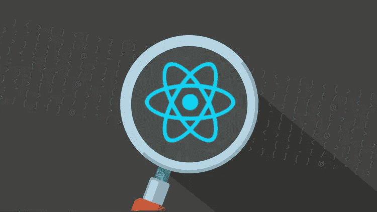
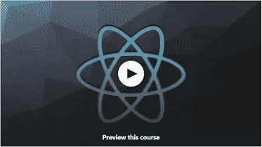
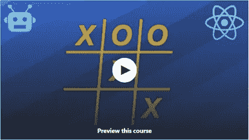
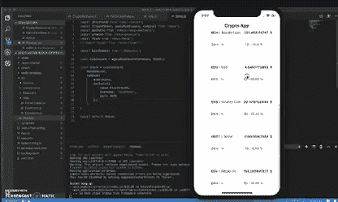
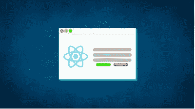

# 2023 年学习 React.js 可以构建的 5 个项目

> 原文：<https://medium.com/javarevisited/5-projects-you-can-build-to-learn-react-js-ffaaac23d4f0?source=collection_archive---------0----------------------->

## React 初学者的项目想法，提供免费课程/文章的链接来构建这些项目

image_credit —教育性

大家好，如果你正在自学 React.js 并寻找一些项目想法来磨练你的 React 技能，那么你来对地方了。之前我已经分享过最好的 [**网站**](/javarevisited/6-best-websites-to-learn-react-js-coding-for-free-ba7ec5c43433)[**课程**](https://javinpaul.medium.com/top-5-courses-to-learn-react-js-in-2019-best-of-lot-fa02cd96cdf0)[**路线图**](https://javarevisited.blogspot.com/2018/10/the-2018-react-developer-roadmap.html)[**书籍**](https://www.java67.com/2020/03/top-5-books-to-learn-reactjs-for-beginners.html) 来学习 Reactjs，今天我要分享的是你可以构建的最好的 React.js 项目来提高 React 技能。

这些项目主要面向学习 React.js 的初学者，但即使是中级开发人员也可以使用这些项目想法来创建一些有趣的项目。

学习 web 开发和新技术并不容易，react js 就是其中之一。仅仅完成一门关于 react 的在线课程并不能让你成为一名专业的 web 开发人员，除非你通过创建多个项目来测试你的知识，从而利用它的特性来达到学习的目的。

如果你正在学习 React.js，这是最流行的用于前端开发的 JavaScript 库之一，并且你想提高你的技能，你应该现在就开始构建一个项目。

构建项目而不是做练习的一个关键优势是，您可以接触到许多相关的技术，这是构建实际应用程序的关键。

你还可以做一些人们想用的东西，可以添加到你的简历或 GitHub 文件夹中的东西，可以自豪地与你的朋友、家人和未来的雇主分享的东西。做项目有很多好处。

在本文中，您将看到许多项目，您可以做这些项目来了解更多信息并掌握这个 react 库，并建立一个良好的投资组合，以吸引员工雇用您或向您的同行展示，并可能作为自由职业者开始自己的业务。

顺便说一下，如果你是 React.js 的完全初学者，那么我建议你首先通过一个全面的 React 课程，如[**React-完整指南(包括钩子，React 路由器，Redux)**](https://click.linksynergy.com/deeplink?id=JVFxdTr9V80&mid=39197&murl=https%3A%2F%2Fwww.udemy.com%2Fcourse%2Freact-the-complete-guide-incl-redux%2F) ，以结构化的方式学习 React.js，而不是跳入项目中。一旦你了解了 React 的基本原理和不同的 React 概念，你就可以开始这些项目了。

# 2023 年初学者学习的 5 个最佳 React.js 项目思路

在不浪费您更多时间的情况下，这里有一个适用于初学者的 Reactjs 项目想法列表。您可以按任何顺序构建这些项目，但建议从上到下构建，因为您将从游戏开始，学习构建逻辑，然后最终使用 React.js 库构建一个完整的网站。

在构建项目时遇到困难是很常见的，所以遇到困难时不要失望或放弃。我还提到了一些资源和在线课程，如果遇到困难，你可以在这些资源和课程中找到如何构建一个特定的项目。

我在网上的建议是不要复制粘贴，相反，如果你卡住了，通过资源和学习，然后回来自己做。

## 1.构建基于 React JS 的 Web 应用程序

你将不得不创建一个 react js 单个 web 应用程序，其前端看起来像一个博客网站，也应该是移动友好的，并添加一些功能，如移动菜单，这里最主要的是无需刷新浏览器就能浏览页面。

Udemy 上的这个免费课程基于一个名为 [**的项目，构建您的第一个 React JS 应用程序**](https://click.linksynergy.com/deeplink?id=JVFxdTr9V80&mid=39197&murl=https%3A%2F%2Fwww.udemy.com%2Fcourse%2Fbuild-your-first-react-js-application%2F) ，它向您展示了如何创建您自己的 react js web 应用程序，并且具有导航菜单等良好的移动友好功能，因此如果您被该项目所困扰，可以将其作为参考。

## 2.在 React 中构建井字游戏

在这个项目中，您将构建一个有三行和三列的井字游戏，通常有两个玩家开始做 X 和 O，第一个垂直或水平完成一行的人获胜，他们需要防止对方这样做，否则其中一人将赢得游戏。

这个项目实际上是 udemy 上的一个免费课程，名为 [**在 React**](https://click.linksynergy.com/deeplink?id=JVFxdTr9V80&mid=39197&murl=https%3A%2F%2Fwww.udemy.com%2Fcourse%2Freact-clarified-building-a-game-in-react%2F) 中构建一个游戏，一步一步地向你展示如何使用 React 和一些基本的 HTML/CSS JavaScript 代码来实现这一点，所以如果你觉得有点难，可以查看该课程以了解更多信息。

## 3.使用 React Native 构建加密货币跟踪器应用程序

在这个项目中，您将创建一个运行在您的手机上的加密货币跟踪器应用程序 e，它具有一些功能，如特定加密货币的实时价格。

这个想法很棒，你可以把这个应用放到 App Store 或谷歌 Play 商店，因为 React Native 允许你创建跨平台的应用。可以使用 React.js、React Native、Firebase 来构建课程，其中 Firebase 可以用来构建后端。

如果你卡住了，那么你可以 [**观看这个免费的 Udemy 课程**](https://click.linksynergy.com/deeplink?id=JVFxdTr9V80&mid=39197&murl=https%3A%2F%2Fwww.udemy.com%2Fcourse%2Fultimate-react-native-with-firebase%2F) 来了解如何使用 React 和 React Native 构建一个加密货币追踪器应用程序。

## 4.构建反应表单

在这个项目中，你必须利用 react 创建一个简单的注册表单，应该包含用户名和电子邮件密码等字段，并具有一些功能，如当用户在电子邮件字段中输入不同的东西时，它会告诉他一个无效的电子邮件或密码不匹配，它会告诉他。

该项目旨在为开始学习 react 库的初学者服务，但如果您在完成该项目时遇到一些困难，请随时参考 udemy 上名为[**React Forms**](https://click.linksynergy.com/deeplink?id=JVFxdTr9V80&mid=39197&murl=https%3A%2F%2Fwww.udemy.com%2Fcourse%2Freact-forms-crash-course%2F)**的课程，以获得一些帮助。**

****

## **5.使用 React.js 建立一个网站**

**最后一个项目是创建一个简单的网站，react 库的目标是这样做，但你需要在你的网页上添加一些 HTML/CSS JavaScript 代码，添加一些带有图片的组件，使它有点现代，有一个漂亮的界面。**

**像往常一样，我建议的每个项目都有一个在线课程，已经为你的问题提供了解决方案，Coursera 上的这个名为 [**的指导项目建立你的第一个 React 网站**](https://coursera.pxf.io/c/3294490/1164545/14726?u=https%3A%2F%2Fwww.coursera.org%2Fprojects%2Fbuild-first-react-website) 为你的项目提供了解决方案，如果你在创建项目时遇到了困难。**

****

**除此之外，Coursera 还有另一个名为 [**的项目，用 ReactJS**](https://coursera.pxf.io/c/3294490/1164545/14726?u=https%3A%2F%2Fwww.coursera.org%2Fprojects%2Ftwitter-clone-frontend) 构建一个 Twitter 克隆前端，这对学习如何使用 React.js 构建前端非常有用**

**在这个 1 小时 20 分钟长的基于项目的课程中，您将学习如何使用 React.js 库为 Twitter 创建一个全功能的前端。您将学习如何使用 *create-react-app* 从头开始一个项目，如何构建功能性 react 组件并沿组件树向下传递属性，如何实现组件状态，如何从外部 API 获取数据以及如何存储和显示数据。**

** [## 用 ReactJS 构建一个 Twitter 克隆前端

### 在 2 小时内完成这个指导项目。在这个 1 小时 20 分钟长的基于项目的课程中，您将学习如何…

coursera.pxf.io](https://coursera.pxf.io/c/3294490/1164545/14726?u=https%3A%2F%2Fwww.coursera.org%2Fprojects%2Ftwitter-clone-frontend) 

最后，您将能够使用 Bootstrap 和 CSS 来设计组件的样式。在你完成任何一个 react 教程之后，我强烈推荐你使用这个。

顺便说一句，如果你计划参加多个 Coursera 课程、项目或专业，那么考虑参加 [**Coursera Plus 订阅**](https://coursera.pxf.io/c/3294490/1164545/14726?u=https%3A%2F%2Fwww.coursera.org%2Fcourseraplus) ，它可以让你无限制地访问他们最受欢迎的课程、专业、专业证书和指导项目。

 [## Coursera Plus |无限制访问 7，000 多门在线课程

### 用 Coursera Plus 投资你的职业目标。无限制访问 90%以上的课程、项目…

coursera.pxf.io](https://coursera.pxf.io/c/3294490/1164545/14726?u=https%3A%2F%2Fwww.coursera.org%2Fcourseraplus) 

以上就是 2023 年**最适合初学者的**best react . js 项目。本文中提供的资源将使你成为一名 react 开发人员，如果你想作为一名自由开发人员申请工作或开始自己的事业，你将获得一些可以依赖的经验。

此外，如果你对创建项目感兴趣，并且你想要更多的项目，比如丰富你的投资组合，作为获得聘用的经验或其他任何东西，请在 Udemy[**Complete React JS web developer**](https://click.linksynergy.com/deeplink?id=JVFxdTr9V80&mid=39197&murl=https%3A%2F%2Fwww.udemy.com%2Fcourse%2Fcomplete-react-js-course%2F)上查看本课程，它将帮助你构建 10 个真实世界的项目，其中一些是:

1.  博客应用
2.  课程销售申请
3.  Reddit API
4.  计时器应用程序
5.  反应应用程序

这门课程不是免费的，但它完全值得你花钱。它也很实惠，你只需花 10 美元就可以在不时举行的 Udemy 大减价上买到。

你可能喜欢的其他 **React.js 和 Web 开发文章**

*   [来自 Pluralsight 的 10 大 React 课程](https://javarevisited.blogspot.com/2020/08/top-10-pluralsight-courses-to-learn-React.js.html)
*   [10 门免费 React.js 课程学习钩子和上下文 API](/javarevisited/top-10-free-courses-to-learn-react-js-c14edbd3b35f?source=extreme_main_feed----d3a191ac6ed-----5-1--------------------561c2dc6_a2b4_41e0_b7be_1d97edbf631c--8)
*   [React 开发人员的 5 大 Gatsby 课程](https://javarevisited.blogspot.com/2020/09/top-5-online-courses-to-learn-gatsby-in.html)
*   [10 个面向开发者的免费 Angular 和 React 课程](https://javarevisited.blogspot.com/2019/04/10-free-angular-and-react-courses-for.html)
*   [2023 年学习 Web 开发的五大课程](https://javarevisited.blogspot.com/2018/02/top-5-online-courses-to-learn-web-development.html)
*   [学习大数据和 Apache Spark 的 5 门课程](http://javarevisited.blogspot.com/2017/12/top-5-courses-to-learn-big-data-and.html)
*   [12 门面向网络开发者的免费 JavaScript 课程](/javarevisited/12-free-courses-to-learn-javascript-and-es6-for-beginners-and-experienced-developers-aa35874c9a32)
*   [2023 年网络开发者路线图](https://javarevisited.blogspot.com/2019/02/the-2019-web-developer-roadmap.html)
*   [面向 Java 开发者的 5 门免费 Spring 框架课程](http://www.java67.com/2017/11/top-5-free-core-spring-mvc-courses-learn-online.html)
*   [2023 年学习 React Native 的 5 门课程](http://javarevisited.blogspot.sg/2018/02/5-react-native-courses-to-learn-mobile-development-using-JavaScript.html)
*   [我最喜欢的学习网页开发的课程](/better-programming/my-5-favorite-courses-to-learn-web-development-in-2019-a5e74167f8b2)
*   [2023 年学习 Spring Boot 的 5 大课程](https://javarevisited.blogspot.com/2018/05/top-5-courses-to-learn-spring-boot-in.html)
*   [初学 3 门最佳 Svelete.js 课程](https://javarevisited.blogspot.com/2020/05/top-3-courses-to-learn-sveltejs-in-2020.html)
*   [2023 年学习 Python 的 5 大课程](http://www.java67.com/2018/02/5-free-python-online-courses-for-beginners.html)
*   [10 JavaScript 框架 Fullstack 开发者应该知道的](http://www.java67.com/2019/01/top-10-javascript-frameworks-and-libraries-for-web-developers.html)
*   [10 个免费的初学者角度课程](/javarevisited/top-10-free-courses-to-learn-angular-framework-in-2020-bb62148c73d3)
*   [学习 Web 开发 Python 的十大课程](/javarevisited/top-10-courses-to-learn-python-for-web-development-in-2020-best-of-lot-efe11fb6d212)
*   [深入学习 JavaScript 的 10 门最佳课程](/javarevisited/10-best-online-courses-to-learn-javascript-in-2020-af5ed0801645)
*   [初学者学习 TypeScript 的 7 门最佳课程](/javarevisited/7-best-courses-to-learn-typescript-in-depth-58439e1ce729)

感谢您阅读本文。如果你喜欢这些为初学者准备的 Reactjs 项目，请与你的朋友和同事分享。如果您有任何问题或反馈，请留言。

万事如意。

**P. S.** —如果你此刻只想做一件事来启动你的 React.js 之旅，就去参加 Udemy 上 Stephen Grider 的[**The Modern React with Redux【2023 Update】**](https://click.linksynergy.com/deeplink?id=JVFxdTr9V80&mid=39197&murl=https%3A%2F%2Fwww.udemy.com%2Fcourse%2Freact-redux%2F)课程吧。你将很快学会 React.js，并且永远不会后悔你的决定，如果你喜欢简单的东西，现在就开始这个 Coursera 项目。

 [## 建立你的第一个 React 网站

### 在 2 小时内完成这个指导项目。在这个 1 小时长的基于项目的课程中，您将获得动手…

coursera.pxf.io](https://coursera.pxf.io/c/3294490/1164545/14726?u=https%3A%2F%2Fwww.coursera.org%2Fprojects%2Fbuild-first-react-website)**