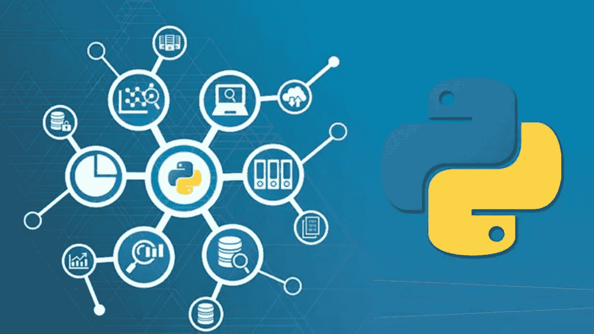
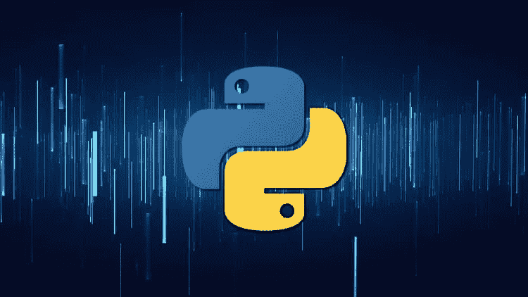
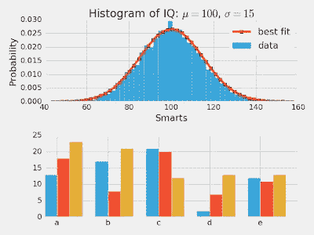
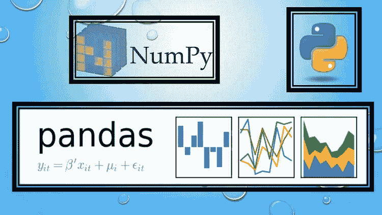

# 2022 为什么要学数据科学的 Python？5 个原因

> 原文：<https://medium.com/javarevisited/5-reasons-to-learn-python-for-data-science-16a9d4c44d6d?source=collection_archive---------1----------------------->

## Python 是学习数据科学的最佳编程语言，但如果你有疑问，这里有 5 个学习数据科学 Python 的理由。

大家好，如果你想学习数据科学或机器学习，并想成为一名数据科学家，但不知道应该学习哪种编程语言( [Python](/swlh/5-free-python-courses-for-beginners-to-learn-online-e1ca90687caf) 、 [R](/javarevisited/10-best-r-programming-courses-for-data-science-and-statistics-8f84ebec4974) 或其他语言)，那么你来对地方了。

在过去，我已经分享了[最佳数据科学资源](/javarevisited/my-favorite-data-science-and-machine-learning-courses-from-coursera-udemy-and-pluralsight-eafc73acc73f)和[最佳 Python 课程](/better-programming/top-5-courses-to-learn-python-in-2018-best-of-lot-26644a99e7ec)，今天，我将告诉你为什么 Python 是数据科学的最佳编程语言，并分享对数据科学和机器学习有意义的 5 个理由。

说到学习数据科学和机器学习，你主要有两个选择，要么用 [**Python**](/javarevisited/8-advanced-python-programming-courses-for-intermediate-programmer-cc3bd47a4d19) **要么用** [**R**](https://becominghuman.ai/top-5-free-courses-to-learn-r-programming-for-data-science-and-statistics-in-2020-305bf1c6f24e) ，但是你会发现**大部分数据科学家用的都是 Python 编程语言**。

我想了很久。*为什么数据科学家如此钟爱 Python？*和*是什么让 Python 成为数据科学和机器学习探索的绝对选择？*

我开始研究这个问题并阅读了许多文章、[书籍](/javarevisited/top-10-resources-to-learn-data-science-and-machine-learning-best-of-lot-f153e1f44e89)，参加了[数据科学课程](https://www.java67.com/2018/10/top-10-data-science-and-machine-learning-courses.html)并同时学习 Python 和 R 来了解自己，所发现的无非是令人惊讶。

我的意思是，简单而实用的原因使得 Python 比 R 或任何其他主流编程语言如 [Java](https://javarevisited.blogspot.com/2018/05/top-5-java-courses-for-beginners-to-learn-online.html) 、 [C++](/@javinpaul/top-10-courses-to-learn-c-for-beginners-best-and-free-4afc262a544e) 、 [Ruby](https://www.java67.com/2018/02/5-free-ruby-and-rails-courses-to-learn-online.html) 或 [JavaScript](https://javarevisited.blogspot.com/2018/06/top-10-courses-to-learn-javascript-in.html) 更好的选择。

现在，让我们看看 Python 编程语言在 2022 年及以后成为学习数据科学和机器学习的人的理想选择的原因。

# 为什么 Python 是数据科学的最佳编程语言？

以下是 Python 在数据科学家和机器学习爱好者中如此受欢迎的 5 大原因，以及如果你想在 2022 年成为数据科学家，你应该学习 Python 的原因。

## 1.Python 相对简单，更容易学习

Python[的一个主要优势是它的直观和简单，这也是它受任何想要得到结果而不是迷失在代码中的人欢迎的原因。

Python 的可读性也很好，也很容易学习，这意味着与其他编程语言(如](/javarevisited/the-complete-python-bootcamp-udemy-course-review-b1ab69f232b5) [R](https://www.java67.com/2018/09/top-5-free-R-programming-courses-for-Data-Science-Machine-Learning-Programmers.html) 、 [Java](https://www.java67.com/2018/08/top-10-free-java-courses-for-beginners-experienced-developers.html) 或 [C+](https://www.java67.com/2018/02/5-free-cpp-courses-to-learn-programming.html) +)相比，它的入门门槛较低，这些语言需要建立一个适当的环境来做除了运行简单的 HelloWorld 程序之外的任何事情。

如果你已经确信 Python 是数据科学的最佳编程语言，并且正在寻找一门从数据科学的角度教你 Python 的在线课程，那么我强烈推荐你加入 Kirill Erenemko 的[**Python A-Z:Python For Data Science 的真实练习！**](https://click.linksynergy.com/deeplink?id=JVFxdTr9V80&mid=39197&murl=https%3A%2F%2Fwww.udemy.com%2Fcourse%2Fpython-coding%2F) 关于 Udemy 的课程。这门动手课程是学习 Python 进行数据科学的最佳课程。

## 2.工具和库

数据科学家的主要工作之一是*分析数据，*在现实世界中，数据以各种形式出现。它们通常是原始的，不适合运行任何类型的分析；因此，数据争论适用于这一点。

清理和转换数据是一个困难的过程，以便您可以对其进行分析和建模，从而获得洞察力。

Python 在这里帮助数据科学家；它附带了如此多的[开源 Python 库](https://javarevisited.blogspot.com/2018/10/top-8-python-libraries-for-data-science-machine-learning.html)，可以为他们完成所有这些任务。这些是定期更新的库，如 [NumPy](/javarevisited/6-best-online-courses-to-learn-numpy-for-beginners-60120f611e06) 、 [Pandas](https://becominghuman.ai/5-best-courses-to-learn-pythons-pandas-libary-for-data-analysis-and-data-science-34b62abb0e96) 、MatPlotLib 等，你需要做的就是在你的 Python 脚本中使用它们，你拥有了数据分析和数据可视化的最佳工具。

你不需要**学习 NumPy 如何工作**或者**Pandas 如何工作**，只要你能把你的数据弄干净，应用一些数学公式，运行一些你满意的统计方程。

那不是一个注重结果的人会喜欢的吗？嗯，我当然知道。你需要学习的就是如何导入一个 Python 模块，你就大功告成了。如果你对哪个 Python 模块用于哪个工作感到好奇，那么只要谷歌一下，你就会找到你的答案。你不需要记住我应该使用哪些 Python 库。

实际上，在使用少量脚本后，您将自动熟悉面向数据科学家的基本 Python 库，如代表数字 Python 的 [NumPy](https://javarevisited.blogspot.com/2018/10/top-8-python-libraries-for-data-science-machine-learning.html) ，作为数据清理和分析的最关键工具的 Pandas，以及用于可视化数据、创建图表和生成见解的 [MatPlotLib](https://matplotlib.org/) 。

你也有 [TensorFlow](https://becominghuman.ai/top-10-courses-to-learn-tensorflow-for-machine-learning-in-2020-39a31e7cd84b) 、 [Sci-kit](https://becominghuman.ai/10-free-courses-to-learn-python-machine-learning-libraries-scikit-learn-numpy-pandas-keras-3c77ba1a6907) 、 [PyTorch](https://www.java67.com/2020/06/top-5-courses-to-learn-pytorch-and-keras.html) ，它们提供一些科学和机器学习能力，并由世界各地的人才不断增强和更新。例如，脸书最近在 [PyTorch](/javarevisited/5-best-pytorch-and-keras-courses-for-deep-learning-in-2021-c9ba377b1170) 上增加了许多机器学习功能。

作为一名数据科学家和机器学习爱好者，你不需要担心更新库、添加新功能等问题。，因为有人在替你做这项工作。你只需要使用图书馆来完成你的工作。

## 3.Jupyter 笔记本

数据科学家喜欢 Python 的另一个原因是 Jupyter 笔记本，它允许您使用 web 浏览器编码并与其他数据科学家合作。Jupyter Notebook 诞生于 IPython，一个用于 [Python](/swlh/5-free-python-courses-for-beginners-to-learn-online-e1ca90687caf) 的交互式命令行终端。

由于使用命令行对每个人来说都不容易，他们为 Python 创建了一个强大的 web 接口，并将其命名为 Jupyter Notebook。

Jupyter 笔记本是开发和展示数据科学项目的强大工具。它允许您将代码及其输出集成到一个文档中，结合可视化、数学公式和解释。

其实我上过的关于[**Google Cloud 上的机器学习**](https://click.linksynergy.com/deeplink?id=JVFxdTr9V80&mid=40328&murl=https%3A%2F%2Fwww.coursera.org%2Fprofessional-certificates%2Fgcp-data-engineering)Coursera 上的大部分在线课程都是用 Jupyter Notebook 做动手的例子。由于其令人印象深刻的功能，Jupyter 笔记本在数据科学家中非常受欢迎，是他们的必备工具之一。

如果所有这些好东西还不够，你会惊讶地发现 Jupyter Notebook 还可以处理 R 代码，这意味着你还可以与一位使用 [R 编程语言](https://becominghuman.ai/top-5-free-courses-to-learn-r-programming-for-data-science-and-statistics-in-2020-305bf1c6f24e)的数据科学家合作。

## 4.社区支持

我发现 Python 在社区中学习数据科学的人群中流行的另一个原因。因为 Python 有一个活跃的社区，并且许多人正在使用 Python 进行[数据科学，所以当你陷入困境时，你已经有一个活跃的社区可以求助。

你也从他们的工作中受益，因为大部分东西都是开源共享的。

许多大型组织，如谷歌和脸书，都对](https://becominghuman.ai/5-best-courses-to-learn-pythons-pandas-libary-for-data-analysis-and-data-science-34b62abb0e96) [TensorFlow](https://javarevisited.blogspot.com/2018/08/top-5-tensorflow-and-machine-learning-courses-online-programmers.html) 和 [PyTorch](https://www.java67.com/2020/06/top-5-courses-to-learn-pytorch-and-keras.html) 做出了贡献，这是一些最受欢迎的用于数据科学和机器学习的 [Python 库](https://becominghuman.ai/10-free-courses-to-learn-python-machine-learning-libraries-scikit-learn-numpy-pandas-keras-3c77ba1a6907)。

## 5.熊猫

这是第二点的延伸，但是熊猫对于数据科学家来说是一个非常重要的工具，值得一提。我参与的大部分数据科学项目都是以熊猫开始，以熊猫结束。

它不仅允许你清理和按摩你的数据，而且还可以分析数据。您可以从各种数据源加载数据，如 CSV 文件、 [Excel](/javarevisited/5-advanced-courses-to-learn-microsoft-excel-in-depth-b556aaee5f6c) 、[数据库](/hackernoon/top-5-sql-and-database-courses-to-learn-online-48424533ac61)和许多其他来源。

Pandas 包含各种各样的数据导入、导出、索引和数据操作功能。它还提供了像 DataFrames(一系列行和列)和 series(一维数组)这样方便的数据结构以及处理它们的有效方法。

例如，你可以用熊猫来重塑、合并、拆分、聚合数据。简而言之，熊猫和 Jupyter 笔记本一样，是数据科学家不可或缺的工具。如果你想更好的学习熊猫，我也推荐你去看看 Udemy 上的 [**用 Python 和熊猫**](https://click.linksynergy.com/deeplink?id=JVFxdTr9V80&mid=39197&murl=https%3A%2F%2Fwww.udemy.com%2Fcourse%2Fdata-analysis-with-pandas%2F) 进行数据分析的课程。

回到主题，因为所有这些优秀的工具、框架、库和 Python 编程语言的简单性，数据科学家喜欢 Python，并继续喜欢它。

## 结论

简而言之，以下是 2022 年 Python 成为最受数据科学和机器学习初学者欢迎的编程语言的 5 个主要原因:

1.  [Python](/javarevisited/10-best-python-certification-courses-from-coursera-4576890eb6b3) 简单直观。
2.  Jupyter Notebook 允许数据科学家协作，并将 cod 和输出结合起来。
3.  像 [NumPy](/javarevisited/6-best-online-courses-to-learn-numpy-for-beginners-60120f611e06) 和 [Pandas](/javarevisited/5-best-free-pandas-courses-for-beginners-in-2022-d7dbe017b90c) 这样的 Python 包和库有助于数据清理和分析。
4.  社区支持
5.  熊猫

以上就是关于**为什么 Python 是数据科学和机器学习最流行的编程语言**的全部内容。我也是一个阵营的。我确实试着休息了，但是没有超过几天。为什么？因为我想把我的时间花在我可以用在数据科学之外的地方的东西上，在这个参数上，Python 远远领先于 R.

如果你也认为 *Python 是数据科学的最佳编程语言*，从数据科学家的角度来看，这里有一些你可以学习 Python 的课程。

**进一步学习**
[完整的 Python 大师班](http://bit.ly/2ytsDuO)
[完整的 Python 训练营:从零到英雄中的 Python](https://click.linksynergy.com/deeplink?id=JVFxdTr9V80&mid=39197&murl=https%3A%2F%2Fwww.udemy.com%2Fcomplete-python-bootcamp%2F)
[Python —超越基础知识](https://pluralsight.pxf.io/c/1193463/424552/7490?u=https%3A%2F%2Fwww.pluralsight.com%2Fcourses%2Fpython-beyond-basics)
[数据分析用 Python 和熊猫](https://click.linksynergy.com/deeplink?id=JVFxdTr9V80&mid=39197&murl=https%3A%2F%2Fwww.udemy.com%2Fcourse%2Fdata-analysis-with-pandas%2F)

其他文章**程序员和数据科学家**可能喜欢

*   [初学者学习数据科学的 10 门课程](https://hackernoon.com/10-machine-learning-data-science-and-deep-learning-courses-for-programmers-7edc56078cde)
*   [使用 Python 和 AI 构建聊天机器人的 5 大课程](https://javarevisited.blogspot.com/2019/12/want-to-build-chat-bots-using-ai.html)
*   [面向数据科学和机器学习的 8 大 Python 库](https://javarevisited.blogspot.com/2018/10/top-8-python-libraries-for-data-science-machine-learning.html)
*   [2022 年学习 Python 的 5 大课程](https://hackernoon.com/top-5-courses-to-learn-python-in-2018-best-of-lot-26644a99e7ec)
*   [面向数据科学家的 10 大 TensorFlow 课程](https://dev.to/javinpaul/10-of-the-best-tensorflow-courses-to-learn-machine-learning-from-coursera-and-udemy-37bf)
*   [学习高级数据科学的前 5 门课程](https://hackernoon.com/top-5-data-science-and-machine-learning-course-for-programmers-e724cfb9940a)
*   [面向程序员的 10 门机器学习和深度学习课程](https://hackernoon.com/top-5-courses-to-learn-python-in-2018-best-of-lot-26644a99e7ec)
*   [学习数据科学数学和统计的 5 门课程](https://javarevisited.blogspot.com/2019/09/top-5-statistics-and-mathematics-course-for-data-science.html)
*   [学习数据科学表格的前 5 门课程](https://javarevisited.blogspot.com/2019/07/top-5-tableau-online-courses-and-certifications-for-data-science-engineers.html)
*   [初学者学习 Python 的 10 门免费课程](https://hackernoon.com/10-free-python-programming-courses-for-beginners-to-learn-online-38312f3b9912)
*   [学习数据科学 Python 的 5 本书](https://javarevisited.blogspot.com/2019/08/top-5-python-books-for-data-science-and-machine-learning.html)
*   [10 张 Coursera 证书开启云计算和数据科学职业生涯](/javarevisited/top-10-coursera-certificates-to-start-your-career-in-cloud-data-science-ai-mainframe-and-it-558690c83587)
*   [学习机器学习的 5 大免费课程](https://www.java67.com/2019/01/5-free-courses-to-learn-machine-and-deep-learning-in-2019.html)
*   [2022 年最佳数据科学与机器认证](/javarevisited/my-favorite-data-science-and-machine-learning-courses-from-coursera-udemy-and-pluralsight-eafc73acc73f)
*   [最佳课程数据分析和数据科学课程](https://javarevisited.blogspot.com/2020/08/top-10-coursera-certifications-to-learn-Data-Science-Visualization-and-Data-Analysis.html)

感谢您阅读本文。如果你有任何关于 Python 在数据科学家中如此受欢迎的其他原因和*为什么 Python 是数据科学的最佳编程语言*，那么请插话与我们分享。

**p . s .**——如果你不了解 Python，但现在想学习 Python，那么我也建议你查看 [**Python 大型课程:构建 10 个真实世界应用**](http://bit.ly/2AHe393) 课程，深入学习 Python。这是一个很好的实践课程，可以进一步促进你在机器学习和人工智能方面的培训。这是你的武器库中必备的工具之一。

<http://bit.ly/2AHe393> 