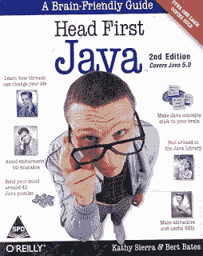
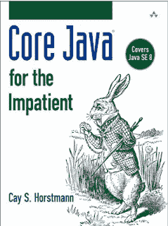
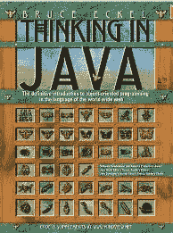

# 从零开始学习 Java 编程的 5 本最佳书籍，提供了更好学习的技巧

> 原文：<https://medium.com/javarevisited/5-tips-and-4-books-to-learn-java-programming-from-scratch-cbca21befed1?source=collection_archive---------0----------------------->

## 想在 2023 年学习 Java 编程，成为一名 Java 程序员？好了，这里是 2023 年在线学习 Java 的最佳资源、书籍、课程和教程，以及一些提示

image_credit —教育性

大家好，我收到了很多关于 Java 的电子邮件和脸书聊天，但是很多人问的最常见的问题之一是，*我如何学习 Java* ？*学习 Java 最好的书是哪本？* *学 Java 要参加哪个课程*？还有*我刚开始学 Java，可以请你推荐一本好的核心 Java 书给我吗？*

在回答了很多那些读者和新 Java 开发者为 [**【头先 Java】**](http://www.amazon.com/dp/0596009208/?tag=javamysqlanta-20)**和** [**的完整 Java master class**](https://click.linksynergy.com/deeplink?id=JVFxdTr9V80&mid=39197&murl=https%3A%2F%2Fwww.udemy.com%2Fcourse%2Fjava-the-complete-java-developer-course%2F)**后，我想到了写这篇博文，为什么？因为他们中的一些人回来问我，“你能推荐一本严肃的 Java 书，而不是漫画吗？”**

**嗯，我不喜欢那个评论，但后来我想这是很自然的，不是每个人都会发现*【Head First Java】*像我一直发现的那样有用。

很多程序员不喜欢笑话，不喜欢图表，不喜欢一种轻松的学习方式，这是 Head First 系列提供的。**

**有些人会比其他人更好地联系到一些作者，这也是很自然的，许多人觉得 Head First 系列更罗嗦，很像 Java。因此，我想花些时间为我的新手 Java 开发人员找出一些选择。值得庆幸的是，市场上有一些优秀的 Java 书籍，它们是最新的、全面的，但也很容易理解，本文就是这些书籍的集合。**

**过去，我曾分享过[最佳 Java 编程课程](/javarevisited/top-5-java-online-courses-for-beginners-best-of-lot-1e1e240a758)，以及为 FRE E 学习 Java 的最佳[网站，在这篇文章中，我将分享学习 Java 编程的 5 个技巧，以及一些你可以自己阅读来学习 Java 的书籍。](/javarevisited/10-best-places-to-learn-java-online-for-free-ce5e713ab5b2)**

**虽然这些书不是最新的，也没有涵盖 Java 的最新版本 Java 16，但对于初学者来说，它们已经足够好地学习 Java 基础知识了，但在阅读这些书之前，让我们先看看我关于更好地学习 Java 的提示。**

# **从头开始学习 Java 编程的 5 个技巧**

**如果你是编程新手，也是 Java 新手，那么这里是我快速学习 Java 的 5 个技巧:**

## **1.每天阅读书籍**

**无论你从这个列表中选择哪本书，确保你每天都读，直到你学会这些概念。这可能需要几个星期到几个月的时间，但是你应该养成每天阅读这本书的习惯。这将确保你不仅阅读而且理解概念。**

## **2.每天写代码**

**阅读一本书是必不可少的，但这是一个被动的行动，这就是为什么你必须每天写代码，这是在书中给出的。从仅仅键入书中提供的程序开始，它会养成一些代码编写习惯和代码阅读能力。慢慢的，你会养成代码感，它会告诉你代码在做什么，怎么做。**

## **3.做所有练习**

**你必须做书中给的所有练习。所有初学者的书都有适量的练习来锻炼你的头脑，它必须回忆起它所学过的概念。这也是新手选书的主要标准之一。通过做练习，你不仅能冲洗和重复概念，还能积极参与阅读、写作和思考。这种肌肉练习对于记住你所学的知识是必不可少的。**

## **4.每当你遇到困难时，就继续查阅这本书**

**当你做运动的时候，遇到困难的时候，不要犹豫回头。事实上，回顾相关概念是练习的目标之一。熟能生巧，重复是练习的一部分。**

## **5.与某人交谈**

**找到一个也在学习 Java 的朋友，和他交谈，讨论他，告诉他你刚刚学到的新概念。当我们试图向任何人解释某事时，我们学得更好。**

**此外，知识交流填补了空白，为更深入的学习开辟了道路。如果你真的热爱 Java，就准备[甲骨文 Java 认证](http://javarevisited.blogspot.com/2014/09/latest-OCPJP-exam-java-8-certification-oracle-java-se-8.html)，没有比准备 SCJP 或 OCPJP 更快速学习 Java 的方法了。**

# **从零开始学习 Java 的 4 本最佳书籍**

**这里是我推荐的四本 Java 书籍，适合想在几个月后学习 Java 的初学者。你可以在几个月内[学会 Java](/javarevisited/10-free-courses-to-learn-java-in-2019-22d1f33a3915) ，只要你每天阅读这本书，练习代码，并与你的伙伴讨论你所学到的任何东西。**

## **1.[头头 Java](http://www.amazon.com/dp/0596009208/?tag=javamysqlanta-20)**

**我的第一个推荐仍然是 Head First Java，因为这是学习 Java 的最佳书籍。如果你可以连接到 head 第一系列，那么你会喜欢它，你会在你的通勤途中阅读它，睡觉前阅读它，并在你的 iPad 上阅读它，是的，它是那么好。**

**它解释了[面向对象编程](/swlh/5-free-object-oriented-programming-online-courses-for-programmers-156afd0a3a73)的关键概念，Java 是带有图片、图表和对话的简单文字。那里有不同种类的练习、谜题和填空，也有助于定期修改概念，最棒的是他们的*“没有问题是愚蠢的问题”*部分，你会喜欢它的。

为了达到最好的效果，你应该把这本书和一门最新的课程结合起来，比如 Udemy 上 Tim Buchalaka 的 [**完整的 Java 大师课**](https://click.linksynergy.com/deeplink?id=JVFxdTr9V80&mid=39197&murl=https%3A%2F%2Fwww.udemy.com%2Fcourse%2Fjava-the-complete-java-developer-course%2F) 。这意味着你不仅会有一个最好的开始，同时也会提升你的知识。**

****

**Head First Java 以这样一种方式提供知识，使你很快就能理解 Java。编码部分有点简单，但是如果您按照代码示例并结合 IDE 使用这本书，那么您会学得更快。**

**</javarevisited/is-complete-java-masterclass-from-udemy-good-to-learn-java-online-in-2021-review-cef466469733> ** 

## **2.[凯·霍斯特曼的核心 Java](http://www.amazon.com/Core-Java-Impatient-Cay-Horstmann/dp/0321996321?tag=javamysqlanta-20)**

**我是在读了凯·霍斯特曼的书《Java S.E. 8 for 心急》之后才知道他的，我非常喜欢他的写作技巧。他真的很擅长解释事情，所以当我开始搜索一本初学者的 Java 书籍时，我的第一次搜索是去凯·霍斯特曼的书籍，看看什么，我发现了一个名为“核心 Java”系列书籍的瑰宝。

这不像 **Head First Java** ，这像一本普通的书，里面有很多信息、代码样本、解释。不喜欢 Head First Java 的轻量级的程序员肯定会欣赏凯·霍斯特曼用简单的语言所做的全面覆盖。**

**核心 Java 系列有两个部分，[核心 Java 第 1 卷](http://www.java67.com/2015/05/best-book-to-learn-java-for-beginners.html)介绍基础知识，而[核心 Java 第 2 卷](http://www.java67.com/2017/01/12-advanced-java-programming-books-for-experienced-programmers.html)介绍高级特性。**

> **这本书唯一的缺点是你需要一些编程经验；不适合对编程一窍不通的完全新手。它最适合有经验的程序员。**

**这是作者对这本书的评价“这本书的目标读者是希望学习如何编写有用的 Java 应用程序和小程序的有经验的程序员。没有炒作，没有玩具代码，没有语言层次感，只有扎实的事实，深入的研究，帮你写出真正的程序”。

如果你愿意，你也可以把这本书和 [**完全初学者 Java 编程**](https://click.linksynergy.com/deeplink?id=JVFxdTr9V80&mid=39197&murl=https%3A%2F%2Fwww.udemy.com%2Fcourse%2Fjava-programming-tutorial-for-beginners%2F) 课程结合起来，该课程由 Java 博主同行、Udemy 畅销讲师岚华·卡南教授。他会告诉你如何使用 JShell 来加快 Java 的学习。**

****

## **3.[用 Java 思考](http://www.amazon.com/dp/0131872486/?tag=javamysqlanta-20)**

**这是我给想学 Java 的人的第三个推荐。我在开始学习 Java 的时候就读过这本书，所以我可以很有把握地说，对于刚开始学习 Java 的程序员来说，没有哪本书比*《用 Java 思考》*更好。布鲁斯·埃凯尔的书读起来很有趣，例子也很容易理解。**

**这本书的最新版本是“ **Thinking in Java 第四版”**，涵盖了 Java 的大部分特性，除了 Java 7 和 8 中介绍的特性。您将学习高级特性，如[枚举](https://javarevisited.blogspot.com/2011/08/enum-in-java-example-tutorial.html#axzz7Eeg9YVnJ)、[泛型](https://javarevisited.blogspot.com/2020/04/50-java-collection-and-generics-interview-questions-answers.html)、注释等。像前两本书一样，这本书也有很多练习，让你忙起来，并给你足够的 Java 实践机会。

如果你愿意，也可以把这本书和 Pluralsight 上的 [Java 基础第一部分和第二部分](https://pluralsight.pxf.io/c/1193463/424552/7490?u=https%3A%2F%2Fwww.pluralsight.com%2Fcourses%2Fjava1)课程结合起来，也是初学者的绝佳伴侣。**

****

## **4.Java:初学者指南**

**Java:初学者指南，第 8 版，是另一本适合初学者的优秀书籍。它很简单，而且——重要的是——一直是最新的，我的意思是它也涵盖了 Java S.E. 11。Kindle 版本也有。

很多 Java 的在线课程也使用这本书作为他们的学习指南，例如，你也可以在 Coursera 上加入杜克大学的 [***Java 编程和软件工程基础专业***](https://coursera.pxf.io/c/3294490/1164545/14726?u=https%3A%2F%2Fwww.coursera.org%2Fspecializations%2Fjava-programming) 与这本书一起学习。**

****

**虽然还有很多 Java 书籍，但首先我只推荐这四本书。试试这四个，挑一个最适合你的。**

**一旦你花了几个月的时间在 Java 上，并且能够流利地用 IDE 编写 Java 程序，你就可以看看我的[高级 Java 书籍列表](http://www.java67.com/2016/06/12-must-read-advance-java-books-for-intermediate-programmers.html)来扩展你在其他关键领域的知识。

比如，作为一名 Java 开发人员，你需要掌握 [Java 集合](/javarevisited/7-best-java-collections-and-stream-api-courses-for-beginners-in-2020-3ad18d52c38)、[并发](/javarevisited/8-best-multithreading-and-concurrency-courses-for-experienced-java-developers-8acfd3b25094)、 [JUnit 测试](/javarevisited/5-courses-to-learn-junit-and-mockito-in-2019-best-of-lot-f217d8b93688)、 [Java 性能优化](/javarevisited/7-best-courses-to-learn-jvm-garbage-collection-and-performance-tuning-for-experienced-java-331705180686?source=---------8------------------)、[设计模式](/javarevisited/7-best-online-courses-to-learn-object-oriented-design-pattern-in-java-749b6399af59?source=---------10------------------)。Java 中有很多东西需要学习，但最好从一本书开始，并适当地遵循它。**

**<https://coursera.pxf.io/c/3294490/1164545/14726?u=https%3A%2F%2Fwww.coursera.org%2Fspecializations%2Fjava-programming>  

正如我之前所说，学习 Java 很容易，但掌握 Java 编程语言非常困难，因为它非常庞大，在语言、API、框架和库方面有太多的东西需要学习。因此，如果你不仅想学习 Java，还想掌握它，我建议你看看下面的建议，让自己在并发、集合、spring、hibernate、单元测试、JVM 内部和性能调优等重要领域变得强大。

**延伸阅读**
[初学 Spring 的前 10 门课程](/javarevisited/10-best-online-courses-to-learn-spring-framework-in-2020-f7f73599c2fd)
[学习 Java 中数据结构和算法的前 5 本书](http://javarevisited.blogspot.com/2016/05/5-free-data-structure-and-algorithm-books-in-java.html)
[学习数据结构和算法的前 5 本书](https://javarevisited.blogspot.com/2018/11/top-5-data-structures-and-algorithm-online-courses.html)
[学习 Java 的前 5 本书 8](http://javarevisited.blogspot.sg/2016/10/best-books-to-learn-java-8.html)
[学习 Java 的前 5 门课程](https://javarevisited.blogspot.com/2018/05/top-5-java-courses-for-beginners-to-learn-online.html)
[学习 Spring 框架的前 5 本书](http://www.java67.com/2016/12/5-spring-framework-books-for-java-programmers.html)

深入学习 Spring 框架
[Java 开发人员学习 Hibernate 的前 5 本书](http://javarevisited.blogspot.com/2014/01/top-5-hibernate-books-for-java-programmers-learning.html)
[学习 JPA 和 Hibernate 的前 5 门课程](https://javarevisited.blogspot.com/2018/01/top-5-hibernate-and-jpa-courses-for-java-programmers-learn-online.html)
[学习 JVM 内部和性能调优的前 5 本书](http://javarevisited.blogspot.sg/2014/07/top-5-java-performance-tuning-books.html)

感谢阅读本文。 如果你喜欢我的 Java 书籍推荐和学习技巧，请与你的朋友和同事分享。如果你有任何反馈、建议或任何你认为程序员应该阅读的学习 Java 的好书，请通过评论与我们分享。

顺便说一句，如果你喜欢先从教程再从书开始学习，那么就从甲骨文的官方 Java 教程开始吧([http://docs.oracle.com/javase/tutorial/](http://docs.oracle.com/javase/tutorial/))

**p . s .**——如果你正在寻找一些可以下载供离线阅读的免费 Java 书籍和 pdf，那么你应该看看这个列表，里面有 [**免费 Java 书籍**](http://www.java67.com/2013/11/10-free-java-programing-books-download-PDF-HTML.html) 和 [**免费 Java 课程**](/javarevisited/10-free-courses-to-learn-java-in-2019-22d1f33a3915) 。它包含了一些 Java 书籍和课程的合法免费拷贝，它们的作者和出版商可以免费在线阅读或下载 PDF 格式供离线阅读。

</javarevisited/top-5-java-online-courses-for-beginners-best-of-lot-1e1e240a758> **