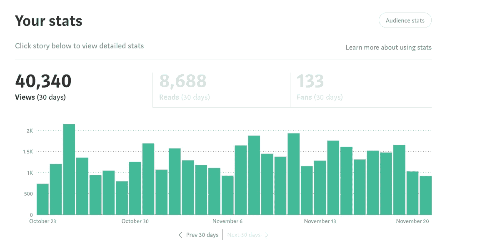
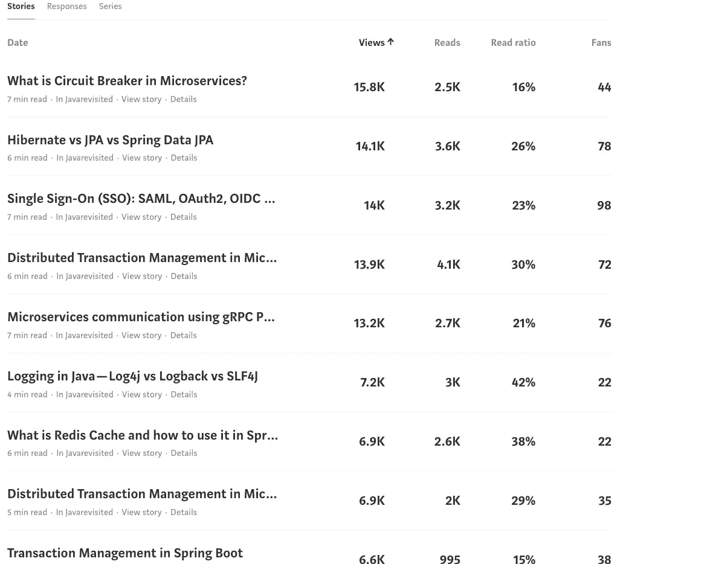
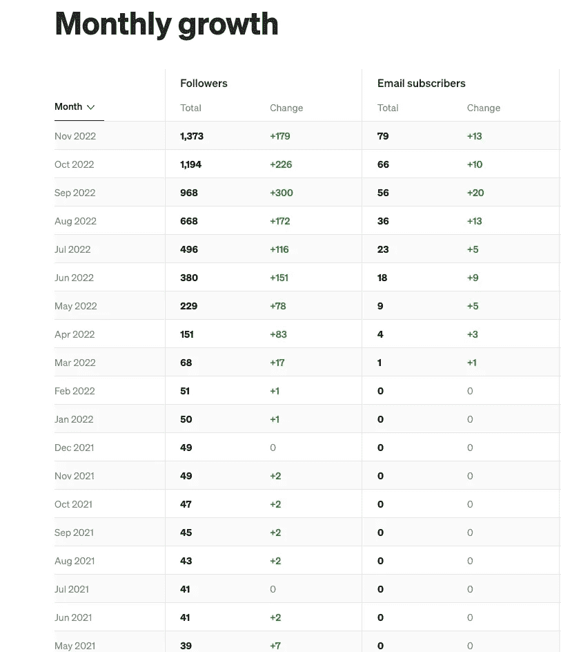
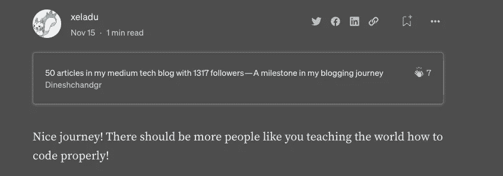
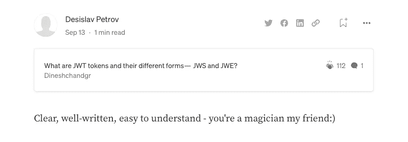
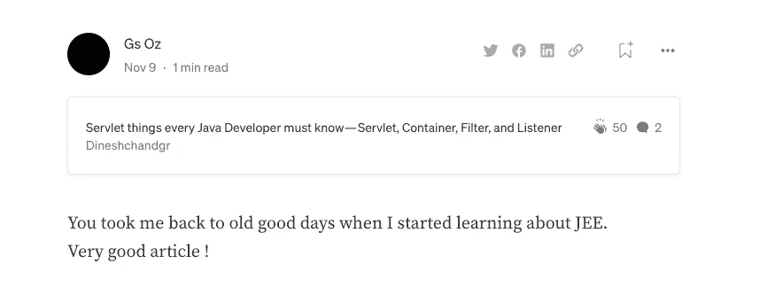
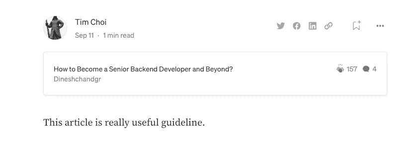
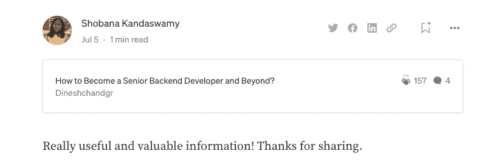
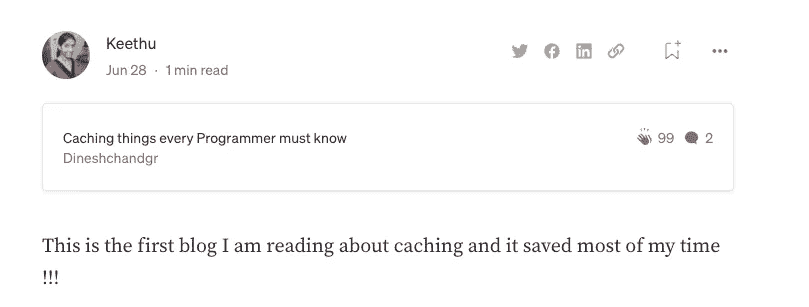
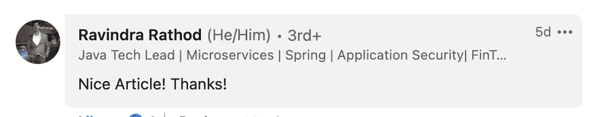

# 我的媒体技术博客中有 50 篇文章，有 1373 名粉丝——这是我博客旅程中的一个里程碑

> 原文：<https://medium.com/javarevisited/50-articles-in-my-medium-tech-blog-with-1317-followers-a-milestone-in-my-blogging-journey-a29cf0163b4b?source=collection_archive---------0----------------------->



大家好。在这篇文章中，我将分享我的博客之旅。

首先，我很兴奋能在这篇文章中打出每一个字。这是我过去几个月一直想达到的一个里程碑，在跨过障碍后，我终于来到了这里。有时候事情不会像预期的那样发生，我希望每件事情都有不确定性，让我们猜测未来会发生什么。

我要衷心感谢每一位关注者和读者。没有你们，我不可能达到这个里程碑，我无法感谢你们所有人。我能做的最好的贡献就是为你们所有人继续写作并证明高质量的内容。

写作一直是我的爱好，我在谷歌/猫途鹰之类的网站上写评论，有时也在 Linkedin 和脸书等网站上写评论。几年前，我了解了媒体博客，我想尝试在那里写博客，看看怎么样。令人惊讶的是，对于一个初学者来说，建立一个博客是非常容易的，我想发布 1 或 2 篇文章来看看。

写了 2 篇文章后，我甚至有一年左右的时间没有去过一个中型网站。然后我收到电子邮件通知，人们回复我的文章并关注我。看到这一点，我有动力写更多，这就是一切的开始。我写得越多，我的文章受到观众的好评，然后我就继续前进。任何事情都需要耐心和时间来发展，写博客也是如此。

我总是探索趋势和重要的话题，并写下它们有两个原因。第一个原因是我想了解这一点，然后一个原因是我想与社区分享，以获得更好的影响。

我发现大多数文章没有提供关于这个主题的完整背景，而且结尾很突然。这是我想跳到的地方，填补我的追随者的空白，到目前为止效果很好。

我的风格总是从基础开始阅读，然后深入，我在写作中也遵循同样的方式。我总是从基本的外行术语开始，然后在一篇文章中解释关于一个主题的一切。如果太大，我会做第二部分或第三部分。

有些文章需要几个小时，有些需要几天，有些甚至需要几周。 我会查阅多方资料，收集知识，并确保在向观众展示之前，我彻底理解了这些知识。有时这个过程需要时间，但当我花时间提供一篇高质量的文章时，它会给我一种成就感。

作为一名作家，我总是乐于接受你诚实的反馈和批评。这将有助于我提高写作技巧，使我成为一名优秀的作家。赞赏让我有动力继续前进，但批评让我不断进步。所以我想在我的文章中同时拥有这两者。

我们都知道，在软件开发人员的生活中，留给我们个人兴趣的时间并不多。由于工作压力，我们大多数人都无法调整自己的爱好。我们不再做朝九晚六的工作，尤其是有了两个孩子，我总是很忙。我的速度慢了一点，但我打算每周至少写 1-2 篇关于热门话题的文章。

我总是鼓励我的朋友和同事在 medium.com 或任何网站上写博客，如果他们对写作感兴趣的话。如果你有其他兴趣，我会建议你加强和追求你的爱好或第二技能。否则生活将会单调乏味。

在[写博客](https://savingsfunda.blogspot.com/2022/12/top-4-blogging-courses-to-start-blog-in.html)之前，我也不知道我的第二项技能或爱好是什么，我正在寻找它。但现在我很清楚，这才是我在工作时间之外想追求的。写博客让我学到新东西，并与社区和人们分享。这也提高了我的沟通技巧，我也开始更多地与人交流。我在各种平台上发布了一些我的读者的评论。我很抱歉，我不能理解所有的评论，无论我能得到什么，我都贴在下面

# 我的读者的一些评论



我写过各种主题的文章，可能会引起不同背景或不同角色的人的兴趣。我名单上的每个人都有适合的东西

我已经根据下面的主题对我的文章进行了分类

# 路线图文章

 [## Java/高级 Java 开发人员的路线图

### 我们生活在一个连续的世界里。持续整合，持续部署，持续学习等等..

dineshchandgr.medium.com](https://dineshchandgr.medium.com/the-roadmap-for-a-java-senior-java-developer-b1f7432fba9d) [](/javarevisited/how-to-become-a-senior-backend-developer-and-beyond-846e8a8ae4a0) [## 如何成为一名高级后端开发者及超越？

### 大家好！！！在这篇文章中，让我们看看成为高级后端工程师和更高级的工程师需要什么样的技能

medium.com](/javarevisited/how-to-become-a-senior-backend-developer-and-beyond-846e8a8ae4a0) 

# 与安全相关的文章

[](/javarevisited/single-sign-on-sso-saml-oauth2-oidc-simplified-cf54b749ef39) [## 单一登录(SSO): SAML，OAuth2，OIDC 简体版

### 大家好。在本文中，我们将了解单点登录(SSO)以及广泛用于…

medium.com](/javarevisited/single-sign-on-sso-saml-oauth2-oidc-simplified-cf54b749ef39) [](/javarevisited/what-are-jwt-tokens-and-their-different-forms-jws-and-jwe-bea92e61a6c2) [## 什么是 JWT 代币及其不同的形式——JWS 和 JWE？

### 大家好。在这篇文章中，我们将看到你需要知道的关于 JWT、JWS 和 JWE 的一切。

medium.com](/javarevisited/what-are-jwt-tokens-and-their-different-forms-jws-and-jwe-bea92e61a6c2) [](/javarevisited/what-is-http-http-s-ssl-passthrough-and-ssl-termination-fc729fe87fed) [## 什么是 HTTP、HTTP(S)、SSL 穿越和 SSL 终止？

### 在本文中，让我们看看什么是 HTTP、HTTPS、SSL 穿越和 SSL 终止。这是一个非常重要的话题…

medium.com](/javarevisited/what-is-http-http-s-ssl-passthrough-and-ssl-termination-fc729fe87fed) 

# 分布式系统

[](/javarevisited/distributed-transaction-management-in-microservices-part-1-bb7dc1fbee9f) [## 微服务中的分布式事务管理—第 1 部分

### 大家好。在本文中，我们将了解跨微服务的分布式事务管理。

medium.com](/javarevisited/distributed-transaction-management-in-microservices-part-1-bb7dc1fbee9f) [](/javarevisited/distributed-transaction-management-in-microservices-part-2-saga-pattern-53808a55e641) [## 微服务中的分布式事务管理—第 2 部分— Saga 模式

### 大家好。这篇文章是上一篇文章的延续

medium.com](/javarevisited/distributed-transaction-management-in-microservices-part-2-saga-pattern-53808a55e641) [](https://dineshchandgr.medium.com/what-are-message-queues-and-why-they-are-widely-used-in-distributed-systems-cf9735e9afd7) [## 什么是消息队列，为什么在分布式系统中广泛使用？

### 大家好。在本文中，我们将了解消息队列——一个在…

dineshchandgr.medium.com](https://dineshchandgr.medium.com/what-are-message-queues-and-why-they-are-widely-used-in-distributed-systems-cf9735e9afd7) 

# 微服务

[](/javarevisited/distributed-tracing-in-microservices-spring-boot-125272b58ad8) [## 微服务/ Spring Boot 中的分布式跟踪

### 大家好。在本文中，让我们了解一下微服务中的分布式跟踪

medium.com](/javarevisited/distributed-tracing-in-microservices-spring-boot-125272b58ad8) [](/javarevisited/what-is-service-discovery-in-microservices-15a2333bc1db) [## 什么是微服务中的服务发现？

### 大家好。在本文中，我们来了解一下微服务架构中的服务发现。

medium.com](/javarevisited/what-is-service-discovery-in-microservices-15a2333bc1db) [](/javarevisited/do-you-know-about-the-12-factor-app-in-microservices-architecture-50bd34551bd8) [## 你知道微服务架构中的 12 因素应用吗？

### 大家好。在这篇文章中，我们将看到一个有趣的方法，称为 12 因素应用程序，用于…

medium.com](/javarevisited/do-you-know-about-the-12-factor-app-in-microservices-architecture-50bd34551bd8) 

# gRPC 协议相关

[](/javarevisited/everything-you-need-to-know-about-http-2-protocol-e64bfffafe47) [## 关于 HTTP/2 协议你需要知道的一切

### 大家好。在本文中，我们将了解什么是 HTTP/2，它的特性、术语和优点。我们会…

medium.com](/javarevisited/everything-you-need-to-know-about-http-2-protocol-e64bfffafe47) [](/javarevisited/what-are-protocol-buffers-and-why-they-are-widely-used-cbcb04d378b6) [## 什么是协议缓冲区，为什么广泛使用？

### 大家好。在本文中，我们将探讨一个有趣的话题——协议缓冲区，它是…

medium.com](/javarevisited/what-are-protocol-buffers-and-why-they-are-widely-used-cbcb04d378b6) [](/javarevisited/microservices-communication-using-grpc-protocol-dc3a2f8b648d) [## 使用 gRPC 协议的微服务通信

### 大家好。在本文中，我们将学习 gRPC 协议。gRPC 取得巨大成功是因为…

medium.com](/javarevisited/microservices-communication-using-grpc-protocol-dc3a2f8b648d) 

## GraphQL

[](https://dineshchandgr.medium.com/do-you-know-about-graphql-the-query-language-for-api-s-4038660865be) [## 你知道 GraphQL 吗 API 的查询语言？

### 大家好。我们将会看到一种叫做 GraphQL 的有趣技术，它是一种开源数据查询…

dineshchandgr.medium.com](https://dineshchandgr.medium.com/do-you-know-about-graphql-the-query-language-for-api-s-4038660865be) [](https://dineshchandgr.medium.com/how-to-use-graphql-with-spring-boot-7a4d66ed84d7) [## 如何在 Spring Boot 上使用 GraphQL？

### 大家好。在我之前的文章中，我已经深入的写过关于 GraphQL 的内容。请在…之前看一下这篇文章

dineshchandgr.medium.com](https://dineshchandgr.medium.com/how-to-use-graphql-with-spring-boot-7a4d66ed84d7) 

## 贮藏

[](/javarevisited/caching-things-every-programmer-must-know-28d4a7e8b9b1) [## 缓存每个程序员都必须知道的东西

### 大家好。缓存是最简单也是最复杂的话题之一，也是每个程序员必须做的基本事情之一…

medium.com](/javarevisited/caching-things-every-programmer-must-know-28d4a7e8b9b1) [](/javarevisited/what-is-redis-cache-and-how-to-use-it-in-spring-boot-using-spring-data-redis-d5ef9967f9e) [## 什么是 Redis 缓存，如何在 Spring Boot 使用 Spring-Data-Redis 使用它？

### 大家好。在本文中，让我们看看如何在 Spring Boot 应用程序中使用 Redis 缓存。如果你想知道…

medium.com](/javarevisited/what-is-redis-cache-and-how-to-use-it-in-spring-boot-using-spring-data-redis-d5ef9967f9e) 

# 反应式编程

[](/javarevisited/what-is-reactive-programming-9cb913eea519) [## 什么是反应式编程？

### 大家好。在本文中，让我们了解一下反应式编程范例，并理解所有的术语…

medium.com](/javarevisited/what-is-reactive-programming-9cb913eea519) [](/javarevisited/reactive-programming-in-java-rxjava-part-2-c1f37ac3282) [## Java 中的反应式编程(RxJava) —第 2 部分

### 大家好。在本文中，我们将学习反应式 Java (RX Java)

medium.com](/javarevisited/reactive-programming-in-java-rxjava-part-2-c1f37ac3282) [](/javarevisited/reactive-programming-in-spring-boot-using-spring-webflux-framework-276bafd384f6) [## 使用 Spring Webflux 框架在 Spring Boot 进行反应式编程

### 大家好。在本文中，我们将详细了解 Spring Webflux 框架。但在此之前，请…

medium.com](/javarevisited/reactive-programming-in-spring-boot-using-spring-webflux-framework-276bafd384f6) 

# 基于 Java 的

[](/javarevisited/servlet-things-every-java-developer-must-know-servlet-container-filter-and-listener-374a460169bd) [## 每个 Java 开发人员都必须知道的 Servlet——Servlet、容器、过滤器和监听器

### 大家好。在本文中，我们将了解 Web 服务器和 Servlet 之间的区别…

medium.com](/javarevisited/servlet-things-every-java-developer-must-know-servlet-container-filter-and-listener-374a460169bd) [](/javarevisited/logging-in-java-log4j-vs-logback-vs-slf4j-88c533088d2a) [## 用 Java 登录—Log4j vs . log back vs . SLF4J

### 大家好。我将讨论另一个重要但深奥的话题，即 Java 中的登录。

medium.com](/javarevisited/logging-in-java-log4j-vs-logback-vs-slf4j-88c533088d2a) 

# Spring Boot

[](/javarevisited/hibernate-vs-jpa-vs-spring-data-jpa-ff4485aaa780) [## Hibernate vs JPA vs Spring Data JPA

### 大家好。在本文中，我们将看到 JPA、Hibernate 和 Spring Data JPA 之间的区别。

medium.com](/javarevisited/hibernate-vs-jpa-vs-spring-data-jpa-ff4485aaa780) [](/javarevisited/transaction-management-in-spring-boot-eb01e20b21fe) [## Spring Boot 的交易管理

### 大家好，

medium.com](/javarevisited/transaction-management-in-spring-boot-eb01e20b21fe) [](https://dineshchandgr.medium.com/how-to-learn-spring-boot-and-microservices-road-map-series-32c2e246f1a4) [## 如何学习 Spring Boot 和微服务—路线图系列

### 大家好。这篇文章是我收到巨大反响的路线图系列的延续。

dineshchandgr.medium.com](https://dineshchandgr.medium.com/how-to-learn-spring-boot-and-microservices-road-map-series-32c2e246f1a4) [](/javarevisited/spring-framework-filter-vs-dispatcher-servlet-vs-interceptor-vs-controller-745aa34b08d8) [## Spring 框架——过滤器 vs 分配器 Servlet vs 拦截器 vs 控制器

### 大家好。在本文中，我们将研究过滤器、调度器 Servlet、拦截器和控制器

medium.com](/javarevisited/spring-framework-filter-vs-dispatcher-servlet-vs-interceptor-vs-controller-745aa34b08d8) [](/javarevisited/what-is-spring-cloud-gateway-34dfdc9548bc) [## 什么是春云网关？

### 大家好。这篇文章是上一篇文章的延续

medium.com](/javarevisited/what-is-spring-cloud-gateway-34dfdc9548bc) [](/javarevisited/what-is-spring-cloud-and-how-it-is-different-from-spring-and-spring-boot-128d276a1432) [## 什么是春云，它与春天和 Spring Boot 有什么不同？

### 大家好。让我们在这篇文章中讨论春云。有很多术语像春天，Spring Boot，春天…

medium.com](/javarevisited/what-is-spring-cloud-and-how-it-is-different-from-spring-and-spring-boot-128d276a1432) [](/javarevisited/what-is-project-lombok-and-how-to-use-it-with-spring-boot-d6034f865541) [## 什么是龙目岛项目，如何与 Spring Boot 一起使用？

### 大家好。在本文中，我们将深入了解 Project Lombok，并了解如何在 Spring 中使用它…

medium.com](/javarevisited/what-is-project-lombok-and-how-to-use-it-with-spring-boot-d6034f865541) [](https://dineshchandgr.medium.com/database-migration-in-spring-boot-using-flyway-ee791db8aea0) [## 使用 Flyway 在 Spring Boot 迁移数据库

### 大家好。本文是上一篇文章的延续，在上一篇文章中，我们了解了什么是数据库迁移和…

dineshchandgr.medium.com](https://dineshchandgr.medium.com/database-migration-in-spring-boot-using-flyway-ee791db8aea0) [](/javarevisited/what-is-database-migration-in-spring-boot-and-how-it-is-done-using-liquibase-bd5cad981862) [## 什么是 Spring Boot 的数据库迁移，如何使用 Liquibase 完成？

### 大家好。在本文中，我们将使用其中一种工具来研究 Spring Boot 的数据库迁移

medium.com](/javarevisited/what-is-database-migration-in-spring-boot-and-how-it-is-done-using-liquibase-bd5cad981862) [](/javarevisited/hibernate-methods-save-persist-update-merge-and-saveorupdate-19d21511dea2) [## 休眠方法—保存、持续、更新、合并和保存或更新

### 大家好。在本文中，让我们了解 Hibernate 的会话接口的 5 个重要方法。但是之前…

medium.com](/javarevisited/hibernate-methods-save-persist-update-merge-and-saveorupdate-19d21511dea2) 

# 基于绩效的文章

[](/javarevisited/top-performance-issues-every-developer-architect-must-know-part-1-fc1ad6e1644b) [## 每个开发人员/架构师都必须知道的主要性能问题—第 1 部分

### 大家好。这是我写的一篇有趣的文章，因为它讨论了一个…

medium.com](/javarevisited/top-performance-issues-every-developer-architect-must-know-part-1-fc1ad6e1644b) [](/javarevisited/top-performance-issues-every-developer-architect-must-know-part-2-concurrency-a15bd0b2b3b6) [## 每个开发人员/架构师都必须知道的主要性能问题—第 2 部分—并发性

### 大家好。本文是第 1 部分的继续…

medium.com](/javarevisited/top-performance-issues-every-developer-architect-must-know-part-2-concurrency-a15bd0b2b3b6) [](/javarevisited/top-performance-issues-every-java-developer-architect-must-know-part-3-memory-351144590489) [## 每个 Java 开发人员/架构师都必须知道的主要性能问题—第 3 部分—内存

### 大家好。本文是以下文章的延续

medium.com](/javarevisited/top-performance-issues-every-java-developer-architect-must-know-part-3-memory-351144590489) 

# 数据结构和算法

[](/javarevisited/time-and-space-complexity-of-an-algorithm-simplified-with-examples-9e0809c4b3be) [## 算法的时间和空间复杂性——用例子简化

### 大家好。在这篇文章中，我们将着眼于一个复杂而可怕的话题，即计算…

medium.com](/javarevisited/time-and-space-complexity-of-an-algorithm-simplified-with-examples-9e0809c4b3be) [](https://dineshchandgr.medium.com/linear-data-structures-with-time-complexity-every-programmer-must-know-c58a446e06ac) [## 具有时间复杂性的线性数据结构——每个程序员都必须知道

### 大家好。你可能已经多次遇到或读到过数据结构。我正在写我自己的版本给…

dineshchandgr.medium.com](https://dineshchandgr.medium.com/linear-data-structures-with-time-complexity-every-programmer-must-know-c58a446e06ac) [](https://dineshchandgr.medium.com/linear-data-structures-continued-stack-queue-and-hash-table-81366ff51d52) [## 线性数据结构…续—堆栈、队列和哈希表

### 大家好。这篇文章是我上一篇文章的延续。请浏览我下面的文章，关于…

dineshchandgr.medium.com](https://dineshchandgr.medium.com/linear-data-structures-continued-stack-queue-and-hash-table-81366ff51d52) 

# 基于云的

[](/javarevisited/do-you-know-everything-about-serverless-architecture-f0cd06c81329) [## 你了解无服务器架构的一切吗？

### 大家好。在这篇文章中，我们将看看 FaaS(功能即服务)，然后我们将探讨各种…

medium.com](/javarevisited/do-you-know-everything-about-serverless-architecture-f0cd06c81329)  [## 你打算做 AWS 认证吗？这就是您如何经济高效地做到这一点——路线图系列

### 云无处不在，无法避免，这也是它成为热门技能的原因。每个人都想做…

medium.com](/javarevisited/are-u-planning-to-do-aws-certification-this-is-how-you-can-do-it-cost-effectively-roadmap-series-274341331508) [](/javarevisited/scalability-in-the-cloud-vertical-vs-horizontal-scaling-ba38ca29d1b7) [## 云中的可扩展性:垂直扩展与水平扩展

### 大家好。在本文中，让我们了解一下云中的可伸缩性和 3 种类型的扩展——水平扩展……

medium.com](/javarevisited/scalability-in-the-cloud-vertical-vs-horizontal-scaling-ba38ca29d1b7) 

# 集装箱化——Docker 和 Kubernetes

[](https://dineshchandgr.medium.com/what-are-docker-containers-virtual-machines-and-containerization-e68bf076edf4) [## 什么是 Docker、容器、虚拟机和容器化？

### 大家好。在本文中，让我们来了解一下 Docker、容器、虚拟机和…

dineshchandgr.medium.com](https://dineshchandgr.medium.com/what-are-docker-containers-virtual-machines-and-containerization-e68bf076edf4) [](/javarevisited/container-orchestration-and-kubernetes-part-2-8bf0ff2637e0) [## 容器编排和 Kubernetes —第 2 部分

### 大家好。在本文中，我们将了解什么是容器编排，以及…

medium.com](/javarevisited/container-orchestration-and-kubernetes-part-2-8bf0ff2637e0) [](https://dineshchandgr.medium.com/kubernetes-certification-paths-and-how-to-prepare-for-kubernetes-developer-exam-ckad-6d2d5c5aab19) [## Kubernetes 认证途径以及如何准备 Kubernetes 开发者考试(CKAD)？

### 大家好。欢迎阅读这篇文章，在这里我们将看到获得 CKAD(认证…

dineshchandgr.medium.com](https://dineshchandgr.medium.com/kubernetes-certification-paths-and-how-to-prepare-for-kubernetes-developer-exam-ckad-6d2d5c5aab19) 

# 物联网

[](https://dineshchandgr.medium.com/everything-you-need-to-know-about-iot-internet-of-things-1b481e917edc) [## 关于 IoT(物联网)你需要知道的一切

### 大家好，你可能听说过物联网这个时髦词汇，但可能没有深入探讨过它。让我们看看…

dineshchandgr.medium.com](https://dineshchandgr.medium.com/everything-you-need-to-know-about-iot-internet-of-things-1b481e917edc) 

# 数据库ˌ资料库

[](https://dineshchandgr.medium.com/sql-vs-no-sql-databases-everything-you-need-to-know-b723457446a5) [## SQL 与非 SQL 数据库—您需要知道的一切

### 大家好。在本文中，我们将了解什么是 SQL 和 NoSQL 数据库，然后我们将继续…

dineshchandgr.medium.com](https://dineshchandgr.medium.com/sql-vs-no-sql-databases-everything-you-need-to-know-b723457446a5) 

再次感谢你们阅读这篇文章，感谢你们给我的支持。在我的下一篇文章中再见

希望你喜欢这篇文章，感谢阅读

```
If you like to get more updates from me, 
please follow me on Medium and subscribe to email alert. 
If you are considering to buy a medium membership, 
please buy through my referral link
```

[](https://dineshchandgr.medium.com/membership) [## 通过我的推荐链接加入 Medium-Dineshchandgr

### 阅读来自 Dineshchandgr 的高质量技术内容，直接跟上技术更新您的会员费…

dineshchandgr.medium.com](https://dineshchandgr.medium.com/membership)