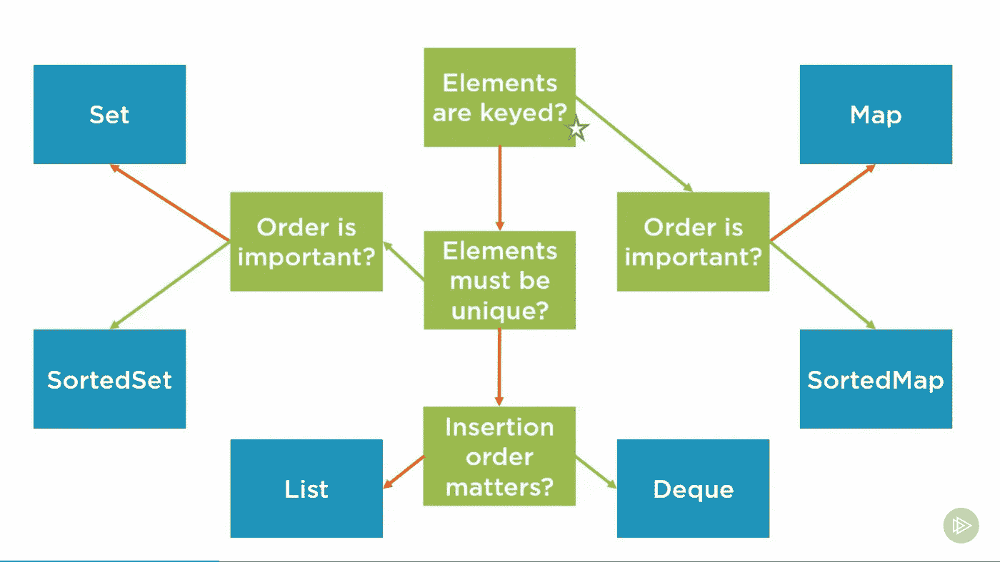
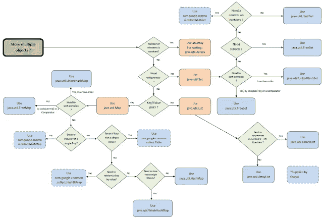
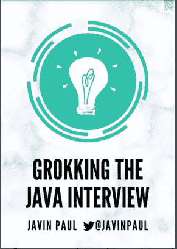
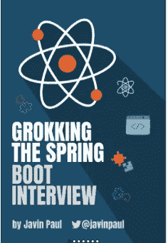

# 50 多个面向初学者和有经验的程序员的 Java 集合面试问题

> 原文：<https://medium.com/javarevisited/50-java-collections-interview-questions-for-beginners-and-experienced-programmers-4d2c224cc5ab?source=collection_archive---------0----------------------->

image _ credit—Java collections Fundamentals by[plural sight](https://medium.com/u/50a6c7ef7431?source=post_page-----4d2c224cc5ab--------------------------------)

大家好，如果你正在准备 Java 开发人员面试，那么你可能知道 Java 集合和泛型是 Java 面试的一个非常重要的话题。如果你想通过 Java 面试，那么你必须准备 Java 集合和泛型问题。

过去，我已经分享了 [**最佳 Java 集合课程**](/javarevisited/7-best-java-collections-and-stream-api-courses-for-beginners-in-2020-3ad18d52c38) ，在这篇文章中，我将分享过去 Java 访谈中的 50 个 poular Java 集合和泛型问题。

正如我所说的，这是一个你不能错过的重要话题，这些问题将让你了解作为一个 Java 开发人员你需要知道的关键概念。当谈到面试时，他们也向程序员提出了一些最难的问题，尤其是[泛型](https://javarevisited.blogspot.com/2020/04/50-java-collection-and-generics-interview-questions-answers.html)。

首先理解一段特定的代码用这些问号和其他符号做什么并不容易，然后面试的压力也使得回答泛型的复杂用法变得很难。

但是，通过适当的准备并注意 Java 集合和泛型，你可以解决这个障碍。如果你正在寻找一份 Java 工作，但是你在面试中表现不佳，那么你来对地方了。

在这篇文章中，我分享了很多不同主题和难度的 Java 面试问题。

有 [Java 问题](https://www.freecodecamp.org/news/review-these-50-questions-to-crack-your-java-programming-interview-69d03d746b7f/)既有针对初学者的，也有针对编程高手的。它们是基于 Java 编程概念的理论问题，也是针对程序员的[编码](https://codeburst.io/100-coding-interview-questions-for-programmers-b1cf74885fb7?source=---------10------------------)和[数据结构算法](/javarevisited/top-21-string-programming-interview-questions-for-beginners-and-experienced-developers-56037048de45)问题，这篇文章只会让这些问题更有价值。

在本文中，我将分享一些常见的 Java 集合和采访中的一般性问题。这些是你在电话面试和面对面面试中经常会遇到的问题。

这对有 2 到 3 年经验的初学者和有 5 到 6 年经验的 Java 程序员都很有用。

这个列表收集了一些问题，其中既有简单的问题，也有困难的问题，但最重要的是，大多数问题已经在面试中被问过了。我相信你可能在采访中也看到了。

知道这些问题的答案不仅有助于你破解 Java 面试，还能深入理解 Java 泛型和集合主题，最终帮助你写出更好的 Java 程序员和代码。

顺便说一句，如果你是 Java 新手或者想巩固你的 Java 知识，那么在尝试解决这些问题之前，你应该查看一下像 [**完整 Java 大师班**](https://click.linksynergy.com/fs-bin/click?id=JVFxdTr9V80&subid=0&offerid=323058.1&type=10&tmpid=14538&RD_PARM1=https%3A%2F%2Fwww.udemy.com%2Fjava-the-complete-java-developer-course%2F) 这样的综合课程。它将通过填补你知识中的空白和反复来帮助你。这也是最新的课程，涵盖了 Java 新版本中引入的所有新特性

<https://click.linksynergy.com/fs-bin/click?id=JVFxdTr9V80&subid=0&offerid=323058.1&type=10&tmpid=14538&RD_PARM1=https%3A%2F%2Fwww.udemy.com%2Fjava-the-complete-java-developer-course%2F>  

# 50 多个 Java 集合和通用面试问题

为了不浪费你更多的时间，下面是我列出的 50 多个关于集合和泛型的 Java 面试问题。

如果你已经用 Java 做了一些工作，那么你应该知道这些问题的答案，但是如果你不知道，你总是可以看到答案。

我没有在这里写答案，而是将它们链接到相关的帖子，这样你就可以尝试在这里自己解决问题，如果你需要，你可以在单个帖子上进行深入的讨论，以深入了解这个主题。

**1)什么是 Java 集合框架，如何选择不同的集合？** ( [回答](https://javarevisited.blogspot.com/2011/11/collection-interview-questions-answers.html#axzz5Y4KkQFHS) )
下面是回答这个问题的示意图:

**2)Java 中有哪些泛型？** ( [答](https://javarevisited.blogspot.com/2011/09/generics-java-example-tutorial.html) )
提示:Java 特性，保证编译时的类型安全。

**3)Java 集合框架中你最喜欢的类有哪些？** ( [回答](https://javarevisited.blogspot.com/2012/11/difference-between-treeset-hashset-vs-linkedhashset-java.html) )
提示:集合、`List`、`Set`、`Map`、`ArrayList`、`Vector`、`LinkedList`、`HashMap`等

、 **4)在 Java 中什么时候使用 Set、List、Map？** ( [答](https://www.java67.com/2013/01/difference-between-set-list-and-map-in-java.html) )
提示—不需要重复的时候使用 set，需要有重复的时候使用 List，需要存储键值对的时候使用 Map。

**5)你用过哪个排序集合？** ( [回答](http://javarevisited.blogspot.sg/2011/12/treemap-java-tutorial-example-program.html#axzz4qw7RoNvw) )
提示— TreeSet 是排序集合的一个例子

**6)HashSet 在 Java 中是如何工作的？** ( [回答](http://www.java67.com/2014/01/how-hashset-is-implemented-or-works-internally-java.html) )
提示—和 HashMap 一样，使用 hashing and equals()和 hashCode()方法。HashSet 实际上是由 HashMap 支持的，其中键是存储在 HashSet 中的元素，值总是 null。

**7)对于要在基于哈希的集合中用作键的对象，应该重写哪两种方法？** ( [回答](http://www.java67.com/2013/06/how-get-method-of-hashmap-or-hashtable-works-internally.html) )
提示—equals and hashcode

**8)在并发应用中可以使用 HashMap 吗？** ( [回答](http://www.java67.com/2017/08/top-10-java-hashmap-interview-questions.html) )
提示—可以，但前提是你是从 HashMap 中读取并由单线程将其初始化，否则不行

**9)Java 中 HashMap 和 Hashtable 有什么区别？** ( [答](https://javarevisited.blogspot.com/2010/10/difference-between-hashmap-and.html) )
提示— HashMap 快但不线程安全，Hashtable 慢但线程安全

**10)Java 中同步和并发收集有什么区别？(** [**回答**](http://javarevisited.blogspot.sg/2016/05/what-is-difference-between-synchronized.html)**)**

**11)Java 中如何进行 ConcurrentHashMap 工作？** ( [答案](https://javarevisited.blogspot.com/2013/02/concurrenthashmap-in-java-example-tutorial-working.html) )
将地图分割成段，单独锁定，而不是锁定整个地图。

**12)Java 中什么是 PriorityQueue？** ( [答](http://www.java67.com/2015/07/how-to-use-priorityqueue-in-java-example.html) )
一种数据结构，它总是把最高或最低的元素放在头部，这样你就可以在固定的时间内访问或删除它。

**13)什么是泛型中的类型擦除？** ( [答](https://javarevisited.blogspot.com/2012/06/10-interview-questions-on-java-generics.html) )
它是 Java 编译器的一部分，从 Java 中删除所有编译后的类型相关信息，这样生成的代码就和泛型之前一样了。

**14)Java 中 ArrayList 和 Vector 有什么区别？(** [**回答**](http://javarevisited.blogspot.sg/2011/09/difference-vector-vs-arraylist-in-java.html) **)**

提示— ArrayList 不同步所以快，Vector 同步所以慢

**15)Java 中 LinkedList 和 ArrayList 有什么区别？** ( [答](http://www.java67.com/2012/12/difference-between-arraylist-vs-LinkedList-java.html))

提示— ArrayList 由 array 支持，而 LinkedList 由链接列表支持，这意味着只能在 ArrayList 中使用索引进行搜索。

**16)Java 中 Hashtable 和 ConcurrentHashMap 有什么区别？(** [**回答**](https://javarevisited.blogspot.com/2011/04/difference-between-concurrenthashmap.html) **)**

提示— ConcurrentHashMap 是一个新的并发类，具有更好的可伸缩性，因为只有一部分名为 segment 的映射被锁定，而 Hashtable 是一个旧类，其中整个映射都被锁定以进行同步。有关更多详细信息，请参见 [**Java 集合:基础**](https://pluralsight.pxf.io/c/1193463/424552/7490?u=https%3A%2F%2Fwww.pluralsight.com%2Fcourses%2Fjava-collections-fundamentals) 课程。

<https://pluralsight.pxf.io/c/1193463/424552/7490?u=https%3A%2F%2Fwww.pluralsight.com%2Fcourses%2Fjava-collections-fundamentals>  

顺便说一句，你需要一个 [**Pluralsight 会员**](https://pluralsight.pxf.io/c/1193463/424552/7490?u=https%3A%2F%2Fwww.pluralsight.com%2Fpricing) 才能加入这个课程，费用大约是每月 29 美元，每年 299 美元(14%的折扣)，但是完全值得。另类。你也可以使用他们的 [**10 天免费试用**](https://pluralsight.pxf.io/c/1193463/424552/7490?u=https%3A%2F%2Fwww.pluralsight.com%2Flearn) 免费观看这门课程。

**17)Java 中 LinkedHashSet 和 TreeSet 有什么区别？** ( [答](https://javarevisited.blogspot.com/2012/11/difference-between-treeset-hashset-vs-linkedhashset-java.html))

提示— `TreeSet` 是一个排序集合，其中元素根据 comparable 和 comparator 以自然或自定义排序顺序存储，而 LinkedHashSet 只是一个保持插入顺序的有序集合。

**18)Java 泛型中 extends 和 super 的区别？(** [**回答**](https://javarevisited.blogspot.com/2012/11/difference-between-treeset-hashset-vs-linkedhashset-java.html)**)**

**19)什么叫线程安全集合？举一个 Java 中 2 线程安全集合的例子？** ( [回答](https://javarevisited.blogspot.com/2017/08/how-to-create-thread-safe-concurrent-hashset-in-java-8.html))

**20)Java 中的 equals 和 compareTo 是什么关系？(** [**回答**](https://javarevisited.blogspot.com/2011/11/how-to-override-compareto-method-in.html)**)**

**21)Java 中 ArrayList 和 HashMap 的默认大小是多少？** ( [答](http://www.java67.com/2012/08/difference-between-hashmap-and-ArrayList-in-Java.html))

**22)Java 中集合的负载系数、容量、大小是多少？(** [**回答**](https://javarevisited.blogspot.com/2011/02/how-hashmap-works-in-java.html)**)**

**23)Java 中迭代器和枚举有什么区别？** ( [答](http://javarevisited.blogspot.sg/2010/10/what-is-difference-between-enumeration.html))

**24)concurrent modification exception 发生在什么时候？(** [**回答**](http://javarevisited.blogspot.sg/2018/01/concurrentmodificationexception-while-removing-elements-from-ArrayList-in-loop-Java-solution.html#axzz569KffZvl)**)**

**25)Java 中的 fail-safe 和 fail-fast 迭代器有什么区别？** ( [答](http://www.java67.com/2015/06/what-is-fail-safe-and-fail-fast-iterator-in-java.html) )

**26)什么是 Java 中的 CopyOnWriteArrayList？(** [**回答**](http://www.java67.com/2015/06/difference-between-synchronized-arraylist-and-copyOnWriteArrayList-java.html)**)**

**27)Java 中什么时候使用 BlockingQueue？** ( [回答](http://www.java67.com/2015/12/producer-consumer-solution-using-blocking-queue-java.html))

用于在 Java 中实现生产者-消费者模式。

**28)队列接口的 peek()和 poll()方法有什么区别？(** [**答案**](https://javarevisited.blogspot.com/2014/06/synchronousqueue-example-in-java.html) **)**

peek()只返回队列的头部，但不删除，而 poll()不仅返回队列头部的元素，还删除它。

**29)如何发现一个 ArrayList 是否包含一个对象？** ( [回答](https://javarevisited.blogspot.com/2014/03/binary-search-vs-contains-performance.html))

提示—您可以使用 contains()方法来检查 ArrayList 是否包含特定的对象。它使用 equals()方法，所以只有当你的对象实现 equals()时它才起作用，否则，直到你传递对象的完全相同的引用时它才起作用。

在 Java 中，我们能在数组列表中存储整数吗？( [**回答**](https://javarevisited.blogspot.com/2017/04/difference-between-raw-type-and-wild-card-arraylist.html)**)**

**31)如何在 Java 中获得 HashMap 的方法？** ( [答](http://www.java67.com/2013/06/how-get-method-of-hashmap-or-hashtable-works-internally.html))

提示—哈希，hashcode 方法用于查找存储桶位置以放置映射，equals 用于检索。

**32)Java 中如何对集合进行排序？(** [**答案**](https://javarevisited.blogspot.com/2013/08/how-to-sort-list-in-reverse-order-in-java-collection-example.html)**)**

**33)Java 中的 ListIterator 和 Iterator 有什么区别？** ( [回答](http://www.java67.com/2016/09/5-difference-between-iterator-and-ListIterator-in-java.html))

**34)Java 中的 HashSet 和 LinkedHashSet 有什么区别？(** [**回答**](http://www.java67.com/2014/01/when-to-use-linkedhashset-vs-treeset-vs-hashset-java.html)**)**

**35)Java 中什么时候使用 EnumSet？** ( [答](https://javarevisited.blogspot.com/2014/03/how-to-use-enumset-in-java-with-example.html) )

**36)列出 Java 中迭代 Map 的 4 种方式？(** [**回答**](https://javarevisited.blogspot.com/2011/12/how-to-traverse-or-loop-hashmap-in-java.html) **)**

提示—

1.  使用 for 循环
2.  用于 JDK 5 的每个循环
3.  使用迭代器
4.  使用列表迭代器

可以进一步查看 [**完整的 Java Masterclass**](https://click.linksynergy.com/fs-bin/click?id=JVFxdTr9V80&subid=0&offerid=323058.1&type=10&tmpid=14538&RD_PARM1=https%3A%2F%2Fwww.udemy.com%2Fjava-the-complete-java-developer-course%2F) **课程了解更多详情**。这也是最新的课程，涵盖了 Java 新版本中引入的所有新特性

<https://click.linksynergy.com/fs-bin/click?id=JVFxdTr9V80&subid=0&offerid=323058.1&type=10&tmpid=14538&RD_PARM1=https%3A%2F%2Fwww.udemy.com%2Fjava-the-complete-java-developer-course%2F>  

如何在 Java 中创建只读集合？ ( [回答](https://javarevisited.blogspot.com/2012/07/create-read-only-list-map-set-example-java.html) )

**38)什么是 Java 中的 IdentityHashMap？(** [**回答**](http://www.java67.com/2016/09/difference-between-identityhashmap-weakhashmap-enummap-in-java.html)**)**

**39)Java 中 IdentityHashMap 和 WeakHashMap 的区别？** ( [答案](https://www.java67.com/2016/09/difference-between-identityhashmap-weakhashmap-enummap-in-java.html))

**40)Java 中的比较器和可比器有什么区别？** ( [答](https://javarevisited.blogspot.com/2011/06/comparator-and-comparable-in-java.html) )

**41)什么是出列？你什么时候使用它？** ( [答](https://javarevisited.blogspot.com/2012/02/producer-consumer-design-pattern-with.html) )

**42)如何从集合中移除一个对象？(** [**回答**](https://javarevisited.blogspot.com/2014/01/ow-to-remove-objects-from-collection-arraylist-java-iterator-traversing.html)**)**

**43)Java 中集合的 remove()方法和迭代器有什么区别？** ( [答](https://www.java67.com/2014/03/2-ways-to-remove-elementsobjects-from-ArrayList-java.html))

**44)ArrayList 和 ArrayList <有什么区别？>在 Java？** ( [回答](https://javarevisited.blogspot.com/2017/04/difference-between-raw-type-and-wild-card-arraylist.html))

**45)Java 中 PriorityQueue 和 TreeSet 有什么区别？(** [**回答**](https://javarevisited.blogspot.com/2017/04/difference-between-priorityqueue-and-treeset-in-java.html)**)**

**46)如何避免“未检查的施法”警告？** ( [答](https://javarevisited.blogspot.com/2015/09/what-is-suppresswarnings-annotation-in-java-unchecked-raw-serial.html))

**47)Java 中的“钻石”运算符是什么？(** [**回答**](https://www.java67.com/2012/09/what-is-new-in-java-7-top-5-jdk-7.html)**)**

**48)什么是 Java 中的协变方法 overriding？** ( [回答](https://javarevisited.blogspot.com/2014/03/covariant-method-overriding-of-java-5.html))

**50)Java 泛型中有界通配符和无界通配符有什么区别？** ( [答](https://javarevisited.blogspot.com/2012/04/what-is-bounded-and-unbounded-wildcards.html))

# Java 和 Spring 面试准备资料

如果你正在准备 Java 和 Spring 开发者访谈，那么你也可以看看我的书

[**搜 Java 面试**](https://gumroad.com/l/QqjGH) :

其中包含许多关于热门话题的常见 Java 问题及答案。

还有，寻找 Spring Boot 访谈，它提供了准备春季开发者访谈的完整指南。

你可以在这里得到你的副本— [**搜索 Spring Boot 采访**](https://gumroad.com/l/hrUXKY)

以上就是这个 **50 个 Java 泛型和集合面试问题**的列表。从 Java 访谈的角度来看，它们是一个非常重要的话题，尤其是集合。在参加任何面试之前，一定要做好准备。如果你需要进一步的准备，你也可以看看这些 Java 面试书籍和课程:

## 进一步学习

[Java 面试指南:200+面试问答](https://click.linksynergy.com/fs-bin/click?id=JVFxdTr9V80&subid=0&offerid=323058.1&type=10&tmpid=14538&RD_PARM1=https%3A%2F%2Fwww.udemy.com%2Fjava-interview-questions-and-answers%2F)
[Java 编程面试被马卡姆曝光](http://www.amazon.com/Java-Programming-Interviews-Exposed-Markham/dp/1118722868?tag=javamysqlanta-20)
[破解编码面试— 189 问答](http://www.amazon.com/Cracking-Coding-Interview-6th-Edition/dp/0984782850/?tag=javamysqlanta-20)
[数据结构与算法解析求职面试](https://click.linksynergy.com/fs-bin/click?id=JVFxdTr9V80&subid=0&offerid=323058.1&type=10&tmpid=14538&RD_PARM1=https%3A%2F%2Fwww.udemy.com%2Fdata-structure-and-algorithms-analysis%2F)

其他**面试问题文章**你可能喜欢探讨

*   过去 5 年的 130 多个 Java 面试问题([问题](https://javarevisited.blogspot.com/2015/10/133-java-interview-questions-answers-from-last-5-years.html))
*   十大春季框架面试问题及答案([见此](http://javarevisited.blogspot.sg/2011/09/spring-interview-questions-answers-j2ee.html))
*   来自访谈的 50 多个数据结构和算法问题([问题](https://dev.to/javinpaul/50-data-structure-and-algorithms-problems-from-coding-interviews-4lh2))
*   Java EE 开发人员的 10 个 Hibernate 面试问题([见此](http://javarevisited.blogspot.sg/2013/05/10-hibernate-interview-questions-answers-java-j2ee-senior.html))
*   Java 程序员的 10 大 XML 面试问题([在此阅读](http://javarevisited.blogspot.sg/2013/01/10-xml-interview-questions-and-answers.html))
*   面试中被问到的 20 个伟大的 Java 设计模式问题([看这里](http://java67.blogspot.com/2012/09/top-10-java-design-pattern-interview-question-answer.html))
*   Java 开发人员常见的 10 个 Struts 面试问题([列表](http://javarevisited.blogspot.sg/2011/11/struts-interview-questions-answer-j2ee.html))
*   20 Tibco 集合点和 EMS 面试问题([阅读更多](http://javarevisited.blogspot.sg/2011/01/tibco-rv-interview-question-as-part.html))
*   10 个常见 Servlet 面试问题及答案([参见此处](http://javarevisited.blogspot.sg/2011/09/servlet-interview-questions-answers.html))
*   Java Web 开发人员的 20 个 jQuery 面试问题([列表](http://javarevisited.blogspot.sg/2015/02/top-16-jquery-interview-questions.html))
*   Java 开发人员的 10 大 Oracle 面试问题([参见此处](http://javarevisited.blogspot.sg/2012/12/top-10-oracle-interview-questions-and-answers-database-sql.html))
*   J2EE 面试中的十大 JSP 问题([点击此处](http://javarevisited.blogspot.sg/2011/10/jsp-interview-questions-answers-for.html))
*   采访中的 12 个好的 RESTful Web 服务问题([点击这里](http://javarevisited.blogspot.sg/2012/01/rest-web-services-framework-interview.html))
*   EJB 十大面试问答([看这里](http://javarevisited.blogspot.sg/2012/03/top-10-ejb-interview-question-and.html))
*   10 大 JMS 和 MQ 系列面试问答([列表](http://javarevisited.blogspot.sg/2014/03/top-10-websphere-mq-series-interview-questions-answers-active-rabbit.html))
*   面试前复习这 50 个 Java 问题([复习](https://www.freecodecamp.org/news/review-these-50-questions-to-crack-your-java-programming-interview-69d03d746b7f/))
*   Java 程序员的 10 大 JDBC 面试问题([问题](http://javarevisited.blogspot.sg/2012/12/top-10-jdbc-interview-questions-answers.html))
*   15 Java NIO 与联网面试问题及答案([见此](http://javarevisited.blogspot.sg/2014/08/socket-programming-networking-interview-questions-answers-Java.html))
*   十大 XSLT 面试问题及答案([阅读更多信息](http://javarevisited.blogspot.sg/2013/05/10-xslt-or-xml-xsl-transformation-interview-questions-answers-java.html))
*   来自 Java 访谈的 15 个数据结构和算法问题([此处阅读](http://javarevisited.blogspot.com/2013/03/top-15-data-structures-algorithm-interview-questions-answers-java-programming.html))
*   Java 面试十大绝招问答([看这里](http://java67.blogspot.com/2012/09/top-10-tricky-java-interview-questions-answers.html))
*   40 个核心 Java 电话面试问题及答案([列表](http://java67.blogspot.com/2015/03/top-40-core-java-interview-questions-answers-telephonic-round.html))

感谢您阅读本文。如果你喜欢这些 Java 泛型和集合面试问题，那么请与你的朋友和同事分享。如果您有任何问题或反馈，请留言。

**P. S. —** 如果你真的想掌握 Java 集合——最重要的 Java API 之一，那么我也建议你去看看 Pluralsight 上的 Java 冠军@Richrad Warburton 开设的 [**Java 集合:基础**](https://pluralsight.pxf.io/c/1193463/424552/7490?u=https%3A%2F%2Fwww.pluralsight.com%2Fcourses%2Fjava-collections-fundamentals) 课程。这是一个很好的课程，可以学习为什么以及 Java 程序员应该使用哪些集合。

<https://pluralsight.pxf.io/c/1193463/424552/7490?u=https%3A%2F%2Fwww.pluralsight.com%2Fcourses%2Fjava-collections-fundamentals>  

**P. P. S —** 快速更新，[**Pluralsight 免费周末**](https://pluralsight.pxf.io/c/1193463/871467/7490) 就在这里，你可以在这个周末免费访问所有 7000+ Pluralsight 课程和项目。好好利用这一点，学习一项新技能或提升现有技能。不要错过这个，这只是这个周末。这又是一个链接:

<https://pluralsight.pxf.io/c/1193463/871467/7490> 