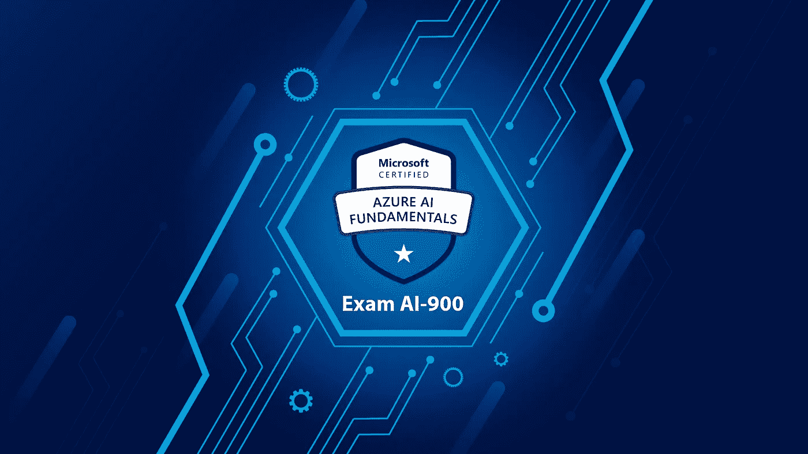
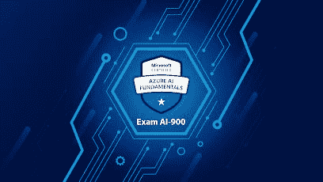
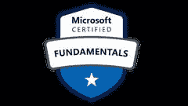
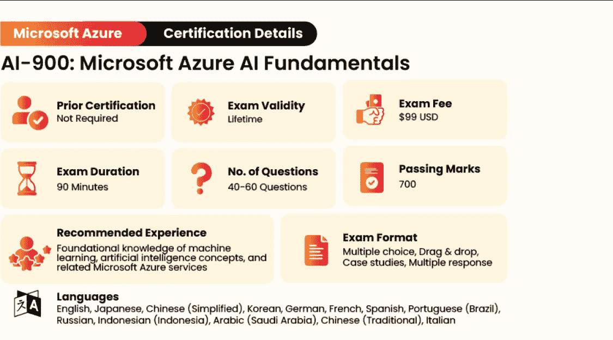
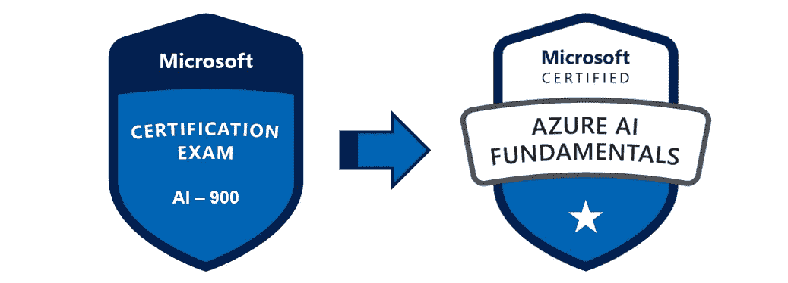

# 破解 Azure 人工智能基础认证考试的 6 个最佳 AI-900 练习测试

> 原文：<https://medium.com/javarevisited/6-best-ai-900-practice-tests-to-crack-azure-ai-fundamentals-certification-exam-c2a7124c8415?source=collection_archive---------4----------------------->

## 实践测试对于首次尝试破解任何 IT 认证都很重要，这里是最佳实践测试和模拟考试，用于在 2023 年破解 Azure 的 AI-900 认证

大家好，如果你正在准备 Azure AI 基础认证或 AI-900 考试，并在寻找最好的准备材料和资源，那么你来对地方了。

早些时候，我已经分享了 [**最佳 AI-900 课程**](https://javarevisited.blogspot.com/2021/11/top-5-courses-to-crack-ai-900-microsoft.html) ，在这篇文章中，我将分享最佳 AI-900 练习测试，以在第一次尝试中通过考试。AI-900 Azure 人工智能基础认证考试是为对机器学习感兴趣并希望成为数据科学家或人工智能工程师的人准备的。Azure 人工智能基础认证涵盖了广泛的主题，如 Azure 认知服务、知识挖掘、负责任的人工智能和其他人工智能概念。

通过这个认证考试将使你成为经典机器学习模型、机器学习管道和 MLOps 的基本概念以及 AutoML 和 Azure ML Studio 的专家。

考生可以通过支付 99 美元的考试费并在微软 Azure 的一个官方测试中心参加考试，轻松尝试 AI-900 Azure AI Fundamentals 认证考试。你可以在线参加考试，也可以亲自参加。

AI-900 Azure AI 基础知识认证考试由 40 到 60 个问题组成，您需要在 60 分钟内回答这些问题。你需要得到 70%的分数才能通过考试。

Azure 认证将向你未来的雇主表明，你对你的职业生涯是认真的，并且能够理解不同的人工智能概念，如知识挖掘和 ML studio。

# 2023 年 AI-900 考试的 6 个最佳实践测试

我们已经为您做了艰苦的工作，并为 AI-900 考试编制了一份最佳实践测试列表。这些模拟测试将确保您为认证考试做好充分准备。请继续阅读，了解更多信息。

## 1.[【2023】AI 900—Azure AI 基础考试实践考试新](https://www.udemy.com/course/ai-900-azure-ai-fundamentals-exam-practice-test-new/?referralCode=F6DDFF0D4E425F65D18C)

这是我自己的课程，为了准备 AI 基础认证和 AI-900 考试，我分享了 300 多个问题。每个问题都有详细的解释，并且与考试主题紧密相关。

您可以检查这些问题，不仅可以检查您的准备情况，还可以提高通过考试所需的速度和准确性，因为您需要在 60 分钟内解决大量问题(40 到 60 个问题)。

**课程持续时间:6 次模拟测试**

**课程评级:新**

**课程讲师:Javin**

**课程价格:29.9 美元**

以适当的速度，你不仅可以尝试所有的问题，还可以修改和复查，以确保你会得到满分。

**这里是加入本课程的链接** — [AI 900 — Azure AI 基础考试模拟考试新](https://www.udemy.com/course/ai-900-azure-ai-fundamentals-exam-practice-test-new/?referralCode=F6DDFF0D4E425F65D18C)

## 2. [Azure AI 基础 AI-900 模拟考试](https://click.linksynergy.com/deeplink?id=JVFxdTr9V80&mid=39197&murl=https%3A%2F%2Fwww.udemy.com%2Fcourse%2Fai-900-practice-tests%2F)

本课程包含 Azure AI Fundamentals AI-900 认证考试的 3 个练习测试，包含 130 多个独特的问题和答案，并附有详细解释。模拟测试准确地模拟了真正的 AI-900 考试，如果你想在考试前测试你的知识，这对你来说将是非常有价值的。

**课程持续时间:3 次模拟测试**

**课程评分:4.4 星(满分 5 分)**

**课程讲师:赛义德·塔斯比萨赞**

**课程价格:16 美元**

这里需要注意的重要一点是，所有问题的难度都比原来考试中的问题要高。这可以确保你做好充分准备，并在认证考试中表现出色。

**这里是加入本课程的链接**——[Azure AI 基础 AI-900 模拟考试](https://click.linksynergy.com/deeplink?id=JVFxdTr9V80&mid=39197&murl=https%3A%2F%2Fwww.udemy.com%2Fcourse%2Fai-900-practice-tests%2F)

## 3.[考试 AI-900:微软 Azure AI 基础](https://shareasale.com/r.cfm?b=413930&u=880419&m=43514&urllink=https%3A%2F%2Fwww%2Ewhizlabs%2Ecom%2Fmicrosoft%2Dazure%2Dcertification%2Dai%2D900%2F&afftrack=)

本课程由 3 次实践测试和 2 次模拟考试组成，包含 250 多个问题和详细答案，将帮助您首次通过 AI-900 认证考试。这些模拟测试中的问题附有详细的解释，并已于 9 月更新。

**课程持续时间:3 次模拟测试**

**课程评分:4.5 星(满分 5 分)**

**课程讲师:Whizlabs**

**课程价格:20 美元**

实践测试和模拟考试涵盖的主题包括人工智能工作负载、自然语言处理工作负载、对话式人工智能工作负载和计算机视觉工作负载。这些模拟测试将帮助您对不同的机器学习概念有一个基本的了解。

**这里是加入本课程的链接—** [考试 AI-900:微软 Azure AI 基础](https://shareasale.com/r.cfm?b=413930&u=880419&m=43514&urllink=https%3A%2F%2Fwww%2Ewhizlabs%2Ecom%2Fmicrosoft%2Dazure%2Dcertification%2Dai%2D900%2F&afftrack=)

顺便说一句，如果你正在准备认证，考虑参加 [**Whizlabs 订阅**](https://shareasale.com/r.cfm?b=1551042&u=880419&m=43514&urllink=&afftrack=) ，它提供对他们所有在线培训课程和不同认证的实践测试的完全访问，每年仅需 149 美元(现在有 25%的折扣)。我强烈推荐这个订阅计划，因为 Whizlabs 有最好的材料来准备 IT 认证。您还可以使用我们的优惠券**20 折**获得 **20%的** F。

## 4.[微软 Azure AI 基础 AI-900 模拟测试](https://click.linksynergy.com/deeplink?id=CuIbQrBnhiw&mid=39197&murl=https%3A%2F%2Fwww.udemy.com%2Fcourse%2Fmicrosoft-certified-azure-ai-fundamentals-practice-test%2F)【Udemy】

本课程与列表中的第一个课程相似，由 3 个模拟测试和 125 个问题组成。所有的问题都有准确的答案和详细的解释，你可以用来验证自己的答案。

**课程持续时间:3 次模拟测试**

**课程评分:4.4 星(满分 5 分)**

**课程讲师:奥兹教育**

课程价格:26 美元

模拟测试将帮助您获得 Microsoft Azure 提供的云服务的基础知识。它非常适合初次接触 Azure 和刚刚开始使用基于云的解决方案的人。

**以下是加入本课程的链接—** [微软 Azure AI 基础 AI-900 模拟测试](https://click.linksynergy.com/deeplink?id=CuIbQrBnhiw&mid=39197&murl=https%3A%2F%2Fwww.udemy.com%2Fcourse%2Fmicrosoft-certified-azure-ai-fundamentals-practice-test%2F)

## 5. [AI-900 Azure AI 基础练习测试](https://click.linksynergy.com/deeplink?id=JVFxdTr9V80&mid=39197&murl=https%3A%2F%2Fwww.udemy.com%2Fcourse%2Fnew-ai-900-azure-ai-fundamentals-practice-tests-sept-2021%2F)【Udemy】

本课程中包含的 5 个模拟测试旨在准确模拟真实的考试场景。所有的问题都有详细的解释和回答。

有 200 多个问题将测试您的知识，并确保您为真正的认证考试做好充分准备。

**课程持续时间:5 次模拟测试**

**球场评分:4.7 星(满分 5 分)**

**课程讲师:学苑**

**课程价格:31 美元**

模拟考试涵盖了所有的主题，问题也和原始考试中的问题一样难。所有的问题也根据最新的考试版本进行了更新。

**以下是加入本课程的链接—** [AI-900 Azure AI 基础练习测试](https://click.linksynergy.com/deeplink?id=JVFxdTr9V80&mid=39197&murl=https%3A%2F%2Fwww.udemy.com%2Fcourse%2Fnew-ai-900-azure-ai-fundamentals-practice-tests-sept-2021%2F)

## 6.[微软 AI-900 认证](https://www.certification-questions.com/practice-exam/microsoft/ai-900?affiliateCode=fcff36fd-557a-4713-abf6-973e9924770f&utm_source=Javin&utm_medium=affiliate&utm_campaign=affiliate)【认证问题】

这是一个考试转储，包括本课程中包含的 2 个模拟测试，将确保您准备好在第一次尝试中通过 AI-900 认证考试。有 190 多个问题，以及准确的答案和详细的解释，你可以用来测试你的知识和准备自己。

每个模拟测试也与真正的 AI-900 微软 Azure AI 基础认证考试具有相同的格式。

**课程持续时间:2 次模拟测试**

**课程评分:4.5 星(满分 5 分)**

**课程讲师:认证问题**

课程价格:终身学习 50 美元

该课程还包含一份独特的测试报告，显示您的进步以及您可以改进的领域。

**以下是加入本课程的链接—** [微软 AI-900 认证](https://www.certification-questions.com/practice-exam/microsoft/ai-900?affiliateCode=fcff36fd-557a-4713-abf6-973e9924770f&utm_source=Javin&utm_medium=affiliate&utm_campaign=affiliate)

## **Azure AI 认证备考常见问题**

**1。AI-900 有多少题？**

AI-900 Azure AI 基础知识认证考试由 40 到 60 个问题组成，您需要在 60 分钟内回答这些问题。你需要得到 70%的分数才能通过考试。

**2。微软 AI-900 值得吗？**

AI-900 Azure 人工智能基础认证考试是为对机器学习感兴趣并希望成为数据科学家或人工智能工程师的人准备的。Azure 认证将向你未来的雇主表明，你对你的职业生涯是认真的，并且能够理解不同的人工智能概念，如知识挖掘和 ML studio。

**3。AI-900 的考试费是多少？**

考生可以通过支付 99 美元的考试费并在微软 Azure 的一个官方测试中心参加考试来尝试 AI-900 Azure AI Fundamentals 认证考试。你可以在线参加考试，也可以亲自参加。

## 结论

以上是关于**最好的 AI-900 模拟测试和模拟考试，你可以参加这些测试来更好地准备 AI-900。这些是目前为止你能在网上找到的最好的实践测试。无论你是刚刚开始准备认证考试，还是已经涵盖了所有主题，并希望测试你的知识，这都无关紧要。这些测试会给你很大的帮助。**

如果你喜欢 AI-900 认证的最佳实践测试列表，请随意与你的朋友和家人分享。此外，如果您有任何疑问或问题，请发表评论，我们将立即回复您。]

面向 IT 专业人员和 Java 程序员的认证资源

*   [破解 AWS 解决方案架构师认证的 5 大课程](https://javarevisited.blogspot.com/2019/05/top-5-courses-to-crack-aws-solutions-architect-associate-certification-exam-SAA-C01.html#axzz5rHwAwycj)
*   [学习 Docker 和 Kubernetes 的十大课程](https://dev.to/javinpaul/top-10-courses-to-learn-docker-and-kubernetes-for-programmers-4lg0)
*   [程序员前 5 名 AZ-900 模拟测试](https://javarevisited.blogspot.com/2020/02/top-5-AZ-900-exam-Azure-Fundamentals-certification-practice-tests-and-mock-exams-to.html)
*   [如何破解 2021 年 AZ-103 Azure 行政管理考试](https://javarevisited.blogspot.com/2020/04/how-to-crack-microsoft-az-103-azure-administrator-associate-exam-certification.html)
*   [破解 Azure 云架构师(AZ-300)考试的前 5 门课程](https://javarevisited.blogspot.com/2019/07/top-5-courses-to-crack-azure-architecture-technologies-certification-az-300-exam.html#axzz6E6VuRMsx)
*   [如何准备 Azure Solution Architect (AZ-300)认证](https://javarevisited.blogspot.com/2020/04/how-to-crack-microsoft-azure-solution-architect-exam-az-300.html)
*   [破解 Azure 基础知识(AZ-900)考试的前 5 门课程](https://javarevisited.blogspot.com/2020/02/top-5-courses-to-crack-az-900-microsoft-azure-fundamentals-certification-exam.html)
*   [破解 Azure 管理员认证的 5 门最佳课程(AZ-103/104)](https://javarevisited.blogspot.com/2020/06/top-5-course-to-become-microsoft-azure-administrator-certification-exam.html)
*   [通过 Azure 开发者助理认证(AZ-203)的 5 门在线课程](https://javarevisited.blogspot.com/2020/06/top-5-course-to-crack-Microsoft-Azure-Developer-Certification-Exam-AZ-203.html)
*   [通过谷歌助理云工程师认证的前 5 门课程](https://javarevisited.blogspot.com/2019/07/top-5-google-cloud-platform-gcp-courses-certifications-online.html)
*   [如何成为 DevOps 工程师？](https://javarevisited.blogspot.com/2018/09/the-2018-devops-roadmap-your-guide-to-become-DevOps-Engineer.html)
*   [如何破解甲骨文 2021 年 Java 认证？](https://medium.freecodecamp.org/how-to-pass-oracles-java-certifications-a-practical-guide-for-developers-e9b607ba6173)
*   [Pivotal 的 Spring 认证对工作和职业生涯有帮助吗？](https://javarevisited.blogspot.com/2017/07/does-spring-certification-help-in-job-and-career.html)
*   [如何通过 Spring Core Professional 5.0 认证](https://javarevisited.blogspot.com/2018/08/how-to-crack-spring-core-professional-certification-exam-java-latest.html)
*   [10 门免费学习数据结构和算法的课程](http://www.java67.com/2019/02/top-10-free-algorithms-and-data.html)
*   [10 门数据科学和机器学习认证课程](https://dev.to/javinpaul/10-data-science-and-machine-learning-courses-for-programmers-looking-to-switch-career-57kd)
*   每个软件开发人员都应该学习的 10 件事
*   [破解 Azure 云架构师(AZ-300)考试的前 5 门课程](https://javarevisited.blogspot.com/2019/07/top-5-courses-to-crack-azure-architecture-technologies-certification-az-300-exam.html#axzz6E6VuRMsx)
*   [OCAJP 和 OCPJP 考试的 10 道免费样题](http://www.java67.com/2017/05/10-free-java-8-certification-sample-questions-OCAJP8-OCPJP8-Mock-Exams.html)

感谢您阅读本文。如果你喜欢这些 AI-900 认证问题和实践测试，那么请分享给你的朋友和同事。如果您有任何问题或反馈，请留言。

**【p . s .】**—如果你是 Azure 云世界的新手，正在寻找在 Azure 上学习云计算的免费课程，那么你也可以在 Medium 上使用 Azure 查看这个 [**最佳免费云计算课程列表。它包含一些最好的免费在线培训课程，用于学习亚马逊网络服务和 Clod 工程师和架构师的热门技能。**](/javarevisited/my-favorite-free-microsoft-azure-cloud-courses-for-beginners-to-learn-in-2020-3418524bb531)

 [## 2023 年学习微软 Azure 云平台的 6 大免费课程-最佳选择

### 大家好，如果你想学习微软 Azure 的概念和服务，并寻找免费的在线培训课程和…

www.java67.com](https://www.java67.com/2020/07/5-free-courses-to-learn-microsoft-azure-cloud.html)