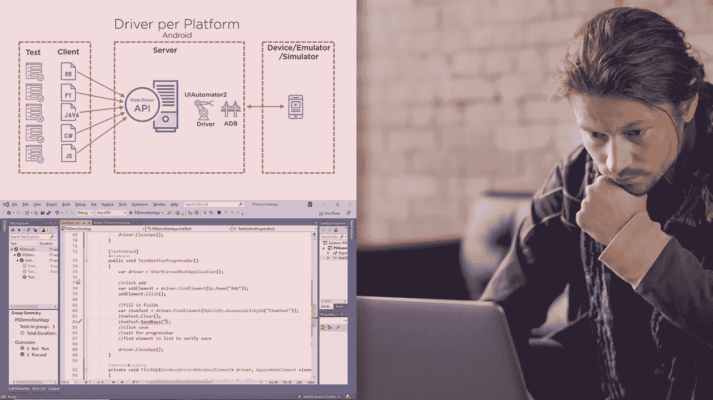
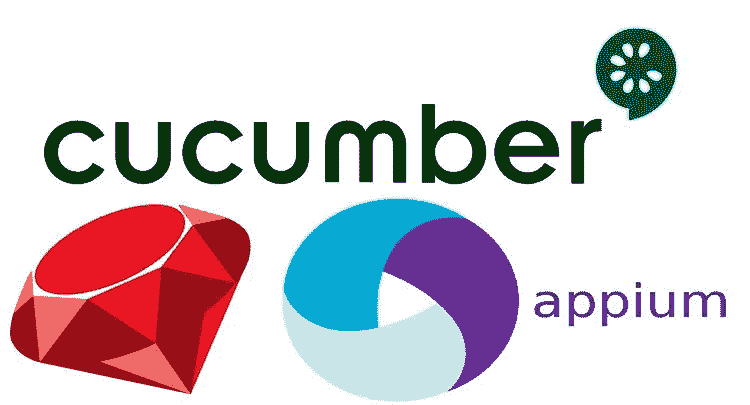
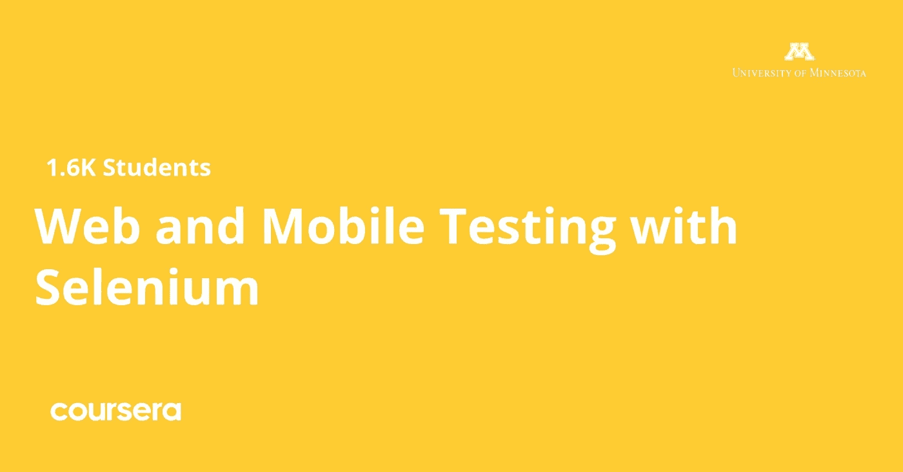

# 2023 年 Android 和 iOS 应用测试的 6 门最佳应用和软件测试在线课程

> 原文：<https://medium.com/javarevisited/6-best-appium-and-mobile-testing-courses-for-android-and-ios-developers-80f6cd51e375?source=collection_archive---------4----------------------->

## 这些是学习 Appium 的最佳在线课程，app ium 是最受欢迎的移动自动化测试工具，包括 Android 和 iOS 应用。

大家好，如果你想在 2023 年学习自动化测试的 Appium 工具，并寻找最好的在线课程，那么你来对地方了。在过去，我已经分享了学习 Selenium 的最佳课程**和最佳 Android 培训课程**，在本文中，我将为初学者和有经验的开发人员分享最佳 Appium 课程。****

****这些课程是由专家创建的，受到世界各地许多开发者的信任，如果您已经在使用 Appium 而没有深入的知识，您也可以加入它们，从头开始学习 Appium，并提高您的 app ium 技能。****

****如果你从事移动应用程序开发，比如 Android 和 iOS 应用程序开发，那么你可能听说过 Appium，它是自动化测试移动应用程序的流行工具之一。****

****[Appium](https://appium.io/) 是一款软件，可让您在将应用推向市场之前测试您的应用，无论它是 android iOS windows 应用等原生应用还是 web 应用等混合应用，以确保它具有所需的质量，并且能够正确无误地运行。****

****Appium 是最受欢迎的测试应用之一，因为它是开源和跨平台的，这意味着你可以在多种平台上执行测试，如 [iOS](https://javarevisited.blogspot.com/2019/01/top-5-ios-developer-course-to-learn-ios.html) 、 [Android](/hackernoon/top-5-courses-to-learn-android-for-java-programmers-667e03d995b4) 和 Windows。****

****每个开发人员都应该在将其推向市场之前使用该工具来确保其应用程序的质量，以避免在其 play store 或 app store 上出现任何错误或差评。

本文将向您展示最好的在线课程，让您了解如何在将应用推向市场之前使用 Appium 并对其进行移动自动化测试。****

# ****2023 年学习 Android 和 iOS 应用程序自动化测试 Appium 的 6 门在线课程****

****以下是深入学习应用程序的最佳在线课程列表。这些在线培训课程是由专家编写的，受到了全世界成千上万开发人员的信任。它们也很实惠，尤其是 Udemy 课程，在 Udemy 销售网站上只需花 10 美元就能买到，这种事情时有发生。****

## ****1.[app ium-从零开始的移动自动化测试+框架](https://click.linksynergy.com/deeplink?id=JVFxdTr9V80&mid=39197&murl=https%3A%2F%2Fwww.udemy.com%2Fcourse%2Fmobile-automation-using-appiumselenium-3%2F)****

****这是在 Udemy 上学习 Appium 和移动测试的最全面和最好的课程之一，它教你如何使用 Appium 为许多平台(如 android iOS 和 web 应用程序)执行自动化测试。

由 [Rahul Shetty](https://click.linksynergy.com/deeplink?id=JVFxdTr9V80&mid=39197&murl=https%3A%2F%2Fwww.udemy.com%2Fuser%2Frahul445%2F) 创建，他是最受欢迎的 Udemy、自动化和测试相关培训讲师之一。本课程从在 windows 和 macOS 上安装软件开始，然后使用 Appium 执行原生应用程序自动化和 web 应用程序自动化，以及 [iOS 应用程序](/javarevisited/my-favorite-free-courses-to-learn-ios-app-development-f172e7d3ba5d)和 web 应用程序，以及如何构建管理工具，了解 GIT 和任何其他要学习的主题，等等。

在本课程中，您将学到:****

1.  ****原生应用自动化测试。****
2.  ****Web 应用程序自动化测试。****
3.  ****建立管理工具。****

******这里是加入这个最佳应用课程的链接** — [应用——从零开始的移动自动化测试](https://click.linksynergy.com/deeplink?id=JVFxdTr9V80&mid=39197&murl=https%3A%2F%2Fwww.udemy.com%2Fcourse%2Fmobile-automation-using-appiumselenium-3%2F)****

********

## ****2. [Appium —使用最新 1.17 和实时项目进行移动测试](https://click.linksynergy.com/deeplink?id=JVFxdTr9V80&mid=39197&murl=https%3A%2F%2Fwww.udemy.com%2Fcourse%2Fappium-selendroid-tutorials%2F)****

****这是另一个大规模的 Udemy 在线课程，讲述如何在不同的平台上执行自动化测试，如 Android 和 iOS，以及在 Udemy 上使用最新版本的 Appium 的九小时视频内容的网络。

以下是您将在本课程中学到的内容:****

1.  ****在不同的操作系统上设置 Appium 环境。****
2.  ****在[安卓应用](/hackernoon/top-5-courses-to-learn-android-for-java-programmers-667e03d995b4)上运行测试。****
3.  ****在[的 iOS 应用上运行测试。](/javarevisited/my-favorite-free-courses-to-learn-ios-app-development-f172e7d3ba5d?source=---------79------------------)****

****在这个长达 60 小时的综合课程中，您将首先在 widows 上为 android 应用程序设置 Appium 环境，然后创建一个虚拟仿真器，并在该仿真器上安装和测试一个应用程序，以及属于 Android 设备的更多概念和操作。****

****稍后，您将看到如何在 macOS 上设置环境，并在 iOS 原生应用程序上运行您的第一个测试。****

******这里是加入这个大型课程**—[Appium——最新 1.17 和实时项目的移动测试的链接](https://click.linksynergy.com/deeplink?id=JVFxdTr9V80&mid=39197&murl=https%3A%2F%2Fwww.udemy.com%2Fcourse%2Fappium-selendroid-tutorials%2F)****

********

## ****3.[UI 测试和应用入门](https://pluralsight.pxf.io/c/1193463/424552/7490?u=https%3A%2F%2Fwww.pluralsight.com%2Fcourses%2Fgetting-started-ui-testing-appium) [Pluralsight]****

****如果您想编写能够在 android 和 iOS 上执行自动化的客户自动化测试应用程序，并了解如何使用应用程序来完成此类工作，您可以报名参加 Pluralsight 课程。

从 Appium 的工作原理开始，然后学习一些实用课程，例如使用 HTTPS 测试您的应用，创建您的第一个测试，以及在 iOs、android 和 windows 应用上进行测试，以及您将在本模块中看到的更多主题。

在本课程中，您将学到:****

1.  ****在不同的平台上执行测试。****
2.  ****编写自己的测试程序。****
3.  ****执行 UI 测试。****
4.  ****提高您的生产力****
5.  ****学习如何使用 Appium****
6.  ****在 iOS 和 Android 平台上测试****

******这是加入本课程的链接**—[UI 测试和应用入门](https://pluralsight.pxf.io/c/1193463/424552/7490?u=https%3A%2F%2Fwww.pluralsight.com%2Fcourses%2Fgetting-started-ui-testing-appium)****

********

****顺便说一句，你需要一个 [**多视会员**](https://pluralsight.pxf.io/c/1193463/424552/7490?u=https%3A%2F%2Fwww.pluralsight.com%2Flearn) 才能加入这个课程，费用大约是每月 29 美元或每年 299 美元(14%的折扣)。如果你还没有，我强烈推荐你订阅，因为它提供了 7000 多门高质量的课程，可以促进你的学习。或者，你也可以带着他们的 [**10 天免费通行证**](https://pluralsight.pxf.io/c/1193463/424552/7490?u=https%3A%2F%2Fwww.pluralsight.com%2Flearn) 免费观看这个课程。****

**** [## 对个人来说

### 无论你想进入一个新的领域，改善你的角色，还是把你的伟大想法变成现实，Pluralsight…

pluralsight.pxf.io](https://pluralsight.pxf.io/c/1193463/424552/7490?u=https%3A%2F%2Fwww.pluralsight.com%2Flearn) 

我想告诉你的另一件事是，这个月所有 700+plur sight 课程都是免费的，因为 plur sight 正在运行他们的免费四月优惠。这是学习 Pluralsight 课程的好时机。**** 

## ****4.[移动自动化:app ium cumber for Android&iOS+Jenkins](https://click.linksynergy.com/deeplink?id=JVFxdTr9V80&mid=39197&murl=https%3A%2F%2Fwww.udemy.com%2Fcourse%2Ftest-automation-with-appium-cucumber-and-ruby%2F)****

****对于想要了解 appium 和移动测试如何工作的原生 android 应用程序开发人员，可以报名参加本课程，并构建真正的功能测试自动化项目。****

****首先，您将在 windows 机器上设置应用程序及其要求，如 Java SDK 和安装 IntelliJ IDEA，然后学习如何连接真正的 android 手机和创建 android 仿真器，以及执行 Android 原生应用程序自动化，还有更多您将探索的内容。****

****在本课程中，您将学到:****

*   ****如何设置 Appium 环境？****
*   ****如何设置[詹金斯服务器](/javarevisited/7-best-courses-to-learn-jenkins-and-ci-cd-for-devops-engineers-and-software-developers-df2de8fe38f3?source=---------15------------------)****
*   ****如何使用 Appium 自动化任何 Android 应用程序****
*   ****如何使用 Android 真实设备和模拟器****
*   ****如何安装所有需要的工具来开始测试自动化****
*   ****如何使用基本元素为 iOS 应用程序设置项目****

****这个课程是为任何没有 QA 过程经验的人设计的，所以对于初学者和想要学习自动化测试的开发人员来说都是非常好的****

******这里是加入这个课程的链接牛逼课程——**[移动自动化:app ium cumber for Android&iOS+Jenkins](https://click.linksynergy.com/deeplink?id=JVFxdTr9V80&mid=39197&murl=https%3A%2F%2Fwww.udemy.com%2Fcourse%2Ftest-automation-with-appium-cucumber-and-ruby%2F)****

********

## ****5.[软件测试入门](https://coursera.pxf.io/c/3294490/1164545/14726?u=https%3A%2F%2Fwww.coursera.org%2Flearn%2Fintroduction-software-testing)【Coursera】****

****这是 Coursera 的一个很棒的课程，学习使用 Selenium 进行 Web 和移动测试，Selenium 是另一个流行的自动化测试工具。该课程由明尼苏达大学提供，也是 [**软件测试和自动化专业**](https://coursera.pxf.io/c/3294490/1164545/14726?u=https%3A%2F%2Fwww.coursera.org%2Fspecializations%2Fsoftware-testing-automation) 的一部分。****

****本课程涵盖了与 web 和移动平台测试相关的关键概念、基础技术，以及使用 Selenium 作为自动化测试此类应用程序的框架。****

****您将获得 web 和移动测试原理的坚实基础，以及使用测试框架来自动化测试执行的能力。****

****以下是您将在本课程中学到的内容:****

1.  ****Web 和移动测试简介****
2.  ****功能性 Web 测试****
3.  ****非功能性 Web 测试****
4.  ****移动测试****

****如果你是网络和移动测试的初学者，那么这是一个很好的课程。****

******以下是加入本课程的链接:** [软件测试入门](https://coursera.pxf.io/c/3294490/1164545/14726?u=https%3A%2F%2Fwww.coursera.org%2Flearn%2Fintroduction-software-testing)****

********

****当谈到加入这门课程时，你有两个选择，你可以单独加入这门课程，每月花费大约 39 美元进行专业化，你也可以加入 [**Coursera Plus，每年花费 399 美元**](https://coursera.pxf.io/c/3294490/1164545/14726?u=https%3A%2F%2Fwww.coursera.org%2Fcourseraplus) ，这是 Coursera 的一个订阅计划，让你无限制地访问他们最受欢迎的课程、专业化、专业证书和指导项目。****

**** [## Coursera Plus |无限制访问 7，000 多门在线课程

### 用 Coursera Plus 投资你的职业目标。无限制访问 90%以上的课程、项目…

coursera.pxf.io](https://coursera.pxf.io/c/3294490/1164545/14726?u=https%3A%2F%2Fwww.coursera.org%2Fcourseraplus)**** 

## ****6. [Appium 移动自动化— Android & iOS +框架+ CICD](https://click.linksynergy.com/deeplink?id=JVFxdTr9V80&mid=39197&murl=https%3A%2F%2Fwww.udemy.com%2Fcourse%2Fthe-complete-appium-course-for-ios-and-android%2F)****

****本文的最后一门课程是关于移动自动化的，特别是针对使用 java 作为源代码、Windows 作为主要操作系统的 android 开发人员。

在这个长达 39 小时的课程中，您将学习如何设置您的环境，然后开始创建您的第一个自动化测试，编写一些基本的 java 程序，构建一个真实世界的项目，并执行[自动化测试](/javarevisited/my-favorite-free-courses-to-learn-selenium-web-drive-for-automation-testing-2f248c8fe6aa)，等等。

以下是您将在本课程中学到的内容:****

1.  ****设置环境。****
2.  ****创建真实世界的项目。****
3.  ****执行自动化测试。****

******以下是加入本课程的链接** — [Appium 移动自动化— Android & iOS +框架+ CICD](https://click.linksynergy.com/deeplink?id=JVFxdTr9V80&mid=39197&murl=https%3A%2F%2Fwww.udemy.com%2Fcourse%2Fthe-complete-appium-course-for-ios-and-android%2F)****

********

****以上是关于**学习移动应用自动化测试应用的最佳课程**。如今，移动正在赋予世界力量，这之所以成为可能，是因为有大量的应用程序可以让你从网上购物或从餐馆点餐，在将应用程序推向市场之前，你需要测试该应用程序的质量，这就是 Appium 移动自动化测试的真正力量。

其他 **Java 和测试资源**你可能会觉得有用****

*   ****[2023 年 Java 开发者路线图](https://javarevisited.blogspot.com/2019/10/the-java-developer-roadmap.html)****
*   ****[2023 年加入 5 个最佳颤振课程](/javarevisited/my-favorite-flutter-and-dart-programming-courses-for-beginners-9e8355710d78)****
*   ****每个 Java 开发人员都应该知道的 10 个测试工具****
*   ****[我最喜欢的针对初学者的 React to Native 课程](/@javinpaul/top-5-react-native-courses-for-mobile-application-developers-b82febdf8a46?source=---------112------------------)****
*   ****[2023 年要学的十大免费 React 本土课程](/javarevisited/my-favorite-free-react-native-courses-for-beginners-in-2020-4629f5274eb6)****
*   ****[学习 Spring 框架的 10 门免费课程](/javarevisited/top-10-free-courses-to-learn-spring-framework-for-java-developers-639db9348d25)****
*   ****[学习 Java 单元测试的 5 本书](http://javarevisited.blogspot.sg/2014/08/top-5-books-to-learn-unit-testing-junit-tdd-Java-programmers.html)****
*   ****[2023 年学习飞镖的 10 门免费课程](/javarevisited/my-favorite-flutter-and-dart-programming-courses-for-beginners-9e8355710d78)****
*   ****[2023 年学习 JUnit 的 5 门免费课程](http://www.java67.com/2018/02/5-free-eclipse-and-junit-online-courses-java-developers.html)****
*   ****[我最喜欢的学习 Android 应用开发的免费课程](/javarevisited/5-free-courses-to-become-an-android-developer-d4d207f53675)****
*   ****[2023 年 Java 程序员应该学会的 10 件事](http://javarevisited.blogspot.sg/2017/12/10-things-java-programmers-should-learn.html#axzz53ENLS1RB)****
*   ****[2023 年移动开发者应该学会的 10 件事](https://javarevisited.blogspot.com/2020/01/10-things-mobile-app-developers-can-learn.html)****

****感谢您阅读本文。如果你喜欢这些针对 Java 开发人员和测试人员的*最佳应用和移动自动化测试课程*，那么请与你的朋友和同事分享。如果您有任何问题或反馈，请留言。****

******P. S.** —如果你对学习 Appium 很认真，但正在寻找免费的**在线培训课程，那么你也可以在 Udemy 上查看 Vaibhav Singhal 的[**Appium—Selenium for Mobile Automation Testing**](https://click.linksynergy.com/deeplink?id=JVFxdTr9V80&mid=39197&murl=https%3A%2F%2Fwww.udemy.com%2Fcourse%2Fappium-selenium-for-mobile-automation-testing%2F)。这个课程是完全免费的，你只需要一个 Udemy 帐户就可以加入这个课程。******

** [## 免费 Appium 教程- Appium - Selenium 用于移动自动化测试

### 自动化移动测试应用程序课程，涵盖从应用程序下载到面试问题(移动自动化工具)…

udemy.com](https://click.linksynergy.com/deeplink?id=JVFxdTr9V80&mid=39197&murl=https%3A%2F%2Fwww.udemy.com%2Fcourse%2Fappium-selenium-for-mobile-automation-testing%2F)**